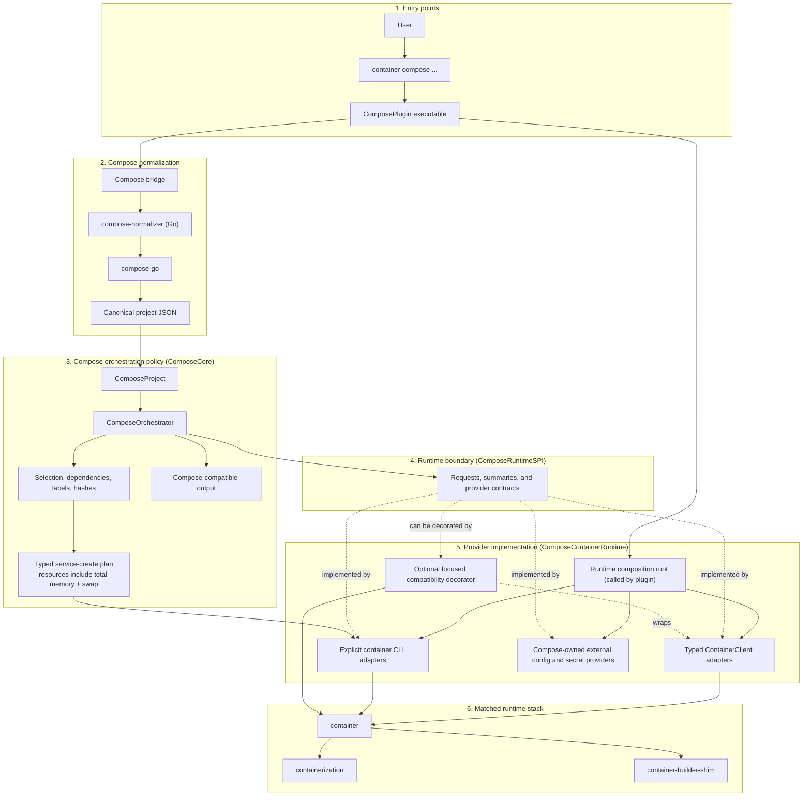

# container-compose Design

`container-compose` is a plugin for Apple's
[`container`](https://github.com/apple/container) CLI architecture. The
supported release lane uses the matched stephenlclarke runtime stack while
Apple-facing runtime additions are prepared as small generic handoffs.

The design is layered: `compose-go` owns Compose project semantics, Swift owns
normalization bridging and user-visible orchestration policy,
`ComposeRuntimeSPI` owns runtime-neutral contracts, and concrete providers own
the translation to the matched runtime stack. [STATUS.md](STATUS.md) is the
authoritative feature ledger; this file records only the architecture that
should remain stable as parity grows.

## Goals

- Match Docker Compose v2 loading and normalization behavior without building a
  second Compose parser.
- Keep Docker-shaped policy, service fan-out, output, and compatibility errors
  in `container-compose`.
- Prefer typed `container` APIs whenever they express the required primitive.
- Keep CLI-backed adapters explicit where the CLI is still the available
  runtime boundary.
- Make project resources deterministic, labelled, repeatable, and safe to
  reconcile.
- Reject unsupported behavior before runtime side effects.
- Shape Apple-backed changes as generic, focused, tested primitives that can be
  reviewed independently of Compose.

## Ownership Boundaries

### Compose Normalization

The release-built Go `compose-normalizer` helper uses
[`compose-go`](https://github.com/compose-spec/compose-go) for file discovery,
multi-file merge, interpolation, profiles, includes, extension handling, path
resolution, validation, and canonical defaults. It accepts Compose CLI-shaped
normalization inputs and emits canonical JSON. It does not perform runtime
work.

Generated Swift schema types may eventually reduce decoding boilerplate, but
they do not replace `compose-go`: a schema describes the accepted model shape,
not the loader behavior Docker Compose users depend on.

### Swift Orchestration

Swift decodes the canonical project, validates runtime-dependent behavior,
plans resource operations, reconciles existing project state, and renders
Docker Compose-compatible output. It owns:

- project and service selection;
- dependency ordering and replica fan-out;
- deterministic names, labels, and configuration hashes;
- Compose command and option policy;
- progress, prefixes, color, formatting, and dry-run output;
- precise unsupported-feature errors.

### Runtime Stack

The matched `container`, `containerization`, and builder-shim packages own
generic runtime behavior. Direct adapters cover typed APIs exposed by the
runtime. Command adapters cover remaining stable CLI surfaces, including the
build boundary and create-time values not yet available through a focused API.

`ComposeRuntimeSPI` is the Compose-owned boundary between orchestration and
those adapters. It contains stable, runtime-neutral requests, summaries, and
provider contracts; it has no dependency on the Apple runtime packages. The
complete contract surface covers discovery, lifecycle, execution, copy/export,
logs/events, stats/top, configs/secrets, images, and project resources. The
Compose-facing value types and provider protocols live in that target, while
the `ContainerClient`- and CLI-backed managers are the current Apple-backed
providers. Future providers can use the same contracts without making the
orchestrator import their package types.

Docker and Compose syntax is normalized into typed Compose-owned plans before
runtime projection. For example, `ContainerServiceCreatePlan` keeps service
identity, process configuration, logging, health, restart, hostname, hosts,
sysctls, block-I/O, and resource values typed even while part of execution
still renders `container` command arguments. `memswap_limit` is resolved here
as a total memory-plus-swap byte value: Compose validates its relationship to
`mem_limit` and calculates Docker's default, then the current explicit CLI
adapter carries the resulting `--memory-swap` value. The lower stack receives
only the generic typed primitive and projects it to OCI.

Missing runtime capabilities belong in Apple-shaped issue and pull request
drafts under [`docs/upstream/`](docs/upstream/). Those drafts request reusable
runtime primitives, not Compose service selection or Docker output policy.

## Architecture

### Layer Responsibilities

| Layer | Owned responsibility | Must not own |
| --- | --- | --- |
| Entry points | Plugin discovery, command parsing, and user invocation | Compose parsing or runtime calls |
| Compose normalization | Compose-file loading, interpolation, merge, and canonical JSON | Runtime work or policy decisions |
| Compose orchestration | Selection, plans, reconciliation, Docker-compatible behavior, and output | Apple package types in policy code |
| `ComposeRuntimeSPI` | Runtime-neutral requests, summaries, and capability contracts | Apple runtime dependencies or broad interception |
| `ComposeContainerRuntime` | Typed `ContainerClient`, explicit CLI translations, and Compose-owned external-resource defaults | Compose service selection or output policy |
| Matched runtime stack | Containers, images, networks, volumes, processes, VMs, and builds | Docker/Compose compatibility policy |

`ComposeContainerRuntime` is the Apple-backed composition root. It also owns
the local Compose default adapters: filesystem-backed external configs and
caller-Keychain external secrets. The plugin passes its dependencies into
`ComposeCore`, whose orchestrator references only `ComposeRuntimeSPI`
contracts. A focused compatibility decorator or another runtime provider can
therefore be introduced at that seam without importing its types into Compose
policy. Standalone `ComposeCore` defaults intentionally report an
unsupported-runtime error until a library client selects a provider.



Solid arrows show data or execution flow. Dashed arrows show a provider's
relationship to the SPI contract. The runtime adapter choice remains an
implementation detail below the orchestration boundary: moving a capability
from a command adapter to a direct API must not change Compose-visible behavior.

### Source Layout

```text
Sources/ComposePlugin/        Plugin command entry point and ArgumentParser surface
Sources/ComposeCore/          Normalization bridge and orchestration policy
Sources/ComposeContainerRuntime/ Apple ContainerClient and CLI providers plus composition root
Sources/ComposeRuntimeSPI/    Runtime-neutral value types and provider contracts
Tools/compose-normalizer/     Compose-go-backed canonical JSON normalizer
Tests/ComposeCoreTests/       Orchestration and adapter behavior
Tests/ComposeRuntimeSPITests/ Runtime-boundary contract behavior
```

## Package Layout

Installed packages use this plugin layout:

```text
/usr/local/libexec/container-plugins/compose/bin/compose
/usr/local/libexec/container-plugins/compose/config.toml
/usr/local/libexec/container-plugins/compose/resources/build-info.json
/usr/local/libexec/container-plugins/compose/resources/container-compose-icon.png
/usr/local/libexec/container-plugins/compose/resources/compose-normalizer
```

The Swift executable owns command parsing and orchestration. The Go binary is a
release-built normalization subprocess. `config.toml` registers the plugin with
`container`.

## Build Provenance

Packaged builds include `compose/resources/build-info.json`. It records the
package lane, source branch and commit, build type, resolved `container`
commit, `containerization` pin, and embedded `compose-go` version.
`container compose version` exposes the plugin metadata, while
`container system version` exposes the running runtime and builder metadata.
Runtime-backed commands compare those records before side effects so mixed or
stale installations fail with upgrade guidance.

Source builds fall back to the active checkout and resolved package metadata
when packaged provenance is absent.

## Design Rules

- Keep Compose parsing out of Swift and runtime orchestration out of Go.
- Prefer small typed models and focused adapters over broad mutable state.
- Keep subprocess interaction behind `CommandRunning` so plans remain testable
  without a live runtime.
- Preserve deterministic names, sorted traversal, labels, and configuration
  hashes.
- Use upstream Apple APIs when they overlap local code and remain sufficient.
- Keep every Apple-backed local change in an Apple-shaped commit with focused
  tests and a complete handoff draft.
- Keep support claims in [STATUS.md](STATUS.md), validation and release policy
  in [BUILD.md](BUILD.md), and installation steps in [INSTALL.md](INSTALL.md).
