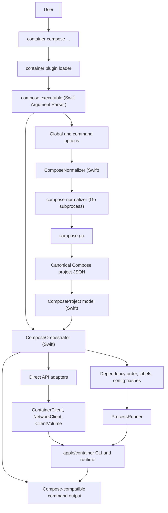

# container-compose Design

`container-compose` is a standalone plugin for Apple's
[`container`](https://github.com/apple/container) CLI. It is designed to provide
Docker Compose v2 style local-development workflows while keeping the
orchestration layer close to the Swift code and runtime primitives used by
[`apple/container`](https://github.com/apple/container).

## Goals

- Match Docker Compose file semantics by delegating parsing, merging,
  interpolation, profiles, and project normalization to the Compose reference
  implementation.
- Keep runtime orchestration in Swift so the plugin can use the same language,
  package manager, and container-related products as
  [`apple/container`](https://github.com/apple/container).
- Use direct [`apple/container`](https://github.com/apple/container) Swift APIs
  wherever they map cleanly to Docker Compose behavior.
- Make generated container, volume, and network names deterministic.
- Label every project resource with Compose metadata so lifecycle commands are
  project scoped and repeatable.
- Fail clearly when a Compose feature depends on a runtime primitive that
  [`apple/container`](https://github.com/apple/container) does not expose yet.

## Adoption Friction

The architecture is intentionally conservative so this repository can be
evaluated for possible apple/container adoption with as little reshaping as
possible. New work should prefer apple/container naming, SwiftPM structure,
Hawkeye license-header expectations, direct Swift runtime APIs, and small
reviewable boundaries. Compose compatibility gaps should be documented as either
plugin work or apple/container runtime primitive work instead of being hidden
behind partial behavior.

This also affects implementation choices. The Go helper stays at the
normalization boundary, Swift owns orchestration, and compatibility fallbacks to
the `container` CLI should remain obvious until a direct apple/container API
adapter exists. Keeping those seams explicit makes future upstream PRs smaller:
runtime primitives can be proposed against apple/container first, then this
plugin can map the newly available API in a focused follow-up.

Adoption friction should be treated as a design constraint, not cleanup. A
reviewer should be able to tell whether a change is Compose normalization,
Swift orchestration, runtime API mapping, compatibility documentation, or an
apple/container primitive gap without first untangling local conventions. When a
feature cannot be upstreamed directly, the reason should be visible in the
design notes, compatibility tables, or backlog so the eventual adoption path
stays practical.

## Why Go Is Used

Go is used only for the Compose normalization helper. The rest of the plugin is
Swift.

The main reason is `compose-go`. It is the maintained Compose Specification
implementation used by Docker Compose for loading and normalizing Compose
projects. By calling `compose-go`, this project avoids hand-rolling complex
Compose behavior such as multi-file merging, variable interpolation, profiles,
`.env` handling, extension fields, configs, secrets, healthchecks, and canonical
project defaults.

Rust would be a good systems language for a standalone parser, but it would
still require either reimplementing Compose semantics or wrapping `compose-go`
through a subprocess or foreign-function boundary. Swift has the same problem:
it is the right choice for the plugin and orchestration layer, but not for
rebuilding the full Compose loader from scratch. Objective-C is not a good fit
for this project because it would add an older object model without improving
Compose compatibility or integration with SwiftPM.

The Go boundary is intentionally small. The helper accepts Compose CLI-shaped
normalization options and emits canonical JSON. Swift treats that JSON as an
input model and performs all runtime decisions.

## Direct APIs And compose-go

`compose-go` and the direct apple/container APIs solve different problems.
`compose-go` answers "what does this Compose project mean after Docker Compose
style loading, merging, interpolation, profiles, path handling, and defaults?"
The Swift orchestration layer answers "which apple/container runtime calls are
needed to make that normalized project true?"

Direct apple/container APIs are preferred after normalization because they make
runtime behavior easier to test, avoid brittle command-output parsing, and keep
the plugin close to the code shape that would be needed for future adoption by
[`apple/container`](https://github.com/apple/container). The CLI compatibility
adapter remains useful where the CLI is currently the stable public surface or
where this repository has not yet introduced a focused adapter.

This boundary keeps Compose compatibility work honest:

- If `compose-go` accepts a surface and apple/container has a matching Swift
  API, `container-compose` should map it directly where possible.
- If `compose-go` accepts a surface but apple/container lacks the primitive,
  `container-compose` should reject it clearly and track the missing primitive
  in [PLAN.md](PLAN.md) as future apple/container upstream work.
- If apple/container has the primitive but this plugin has not mapped it yet,
  the gap belongs in this repository's backlog.

The main design discussion is how much of the normalized `compose-go` JSON
should become stable Swift model surface over time. A generated Swift schema
model could reduce boilerplate at the boundary, but it should not replace
`compose-go` unless it can also preserve Docker Compose v2 loader behavior. For
now, `compose-go` remains the Compose semantics boundary and Swift remains the
runtime orchestration boundary.

## Generated Swift Compose Types

Apple reviewers have discussed generating Swift Compose model types from the
Compose Specification JSON schema with
[`quicktype`](https://quicktype.io/), as shown in
[`apple/container` pull request 239](https://github.com/apple/container/pull/239#issuecomment-3138230001).
That approach is a good fit for a Swift-native schema package, and it may be
useful here as an additional typed boundary or as a golden-test aid.

The prototype attached to that discussion decodes raw Compose YAML with Yams
into Quicktype-generated Swift types. It also illustrates why this needs care
before adoption: the generated sketch does not preserve every dynamic Compose
map as a useful Swift model, and it does not run the Compose loader pipeline.
Any generated-type work should therefore be treated as a narrow model-generation
experiment until it proves that services, networks, volumes, configs, secrets,
extensions, and schema unions round-trip correctly.

Generated schema types are not a replacement for `compose-go` normalization in
the current architecture. The Compose JSON schema describes the accepted model
shape, while `compose-go` also performs the behavioral loading steps Docker
Compose users rely on: file discovery, multiple file merges, interpolation,
profiles, includes, extension handling, path resolution, validation, and
canonical defaults. Rebuilding those semantics in Swift would add a second
Compose implementation to maintain.

The current decision is therefore:

- Keep the `compose-go` helper as the source of canonical Compose semantics.
- Keep orchestration, runtime gap checks, and direct
  [`apple/container`](https://github.com/apple/container) API integration in
  Swift.
- Consider generated Swift Compose schema types only when they reduce
  boilerplate at the Swift model boundary without weakening compatibility with
  Docker Compose v2 behavior.

## Architecture



## Runtime Boundary

The installed plugin layout is:

```text
/usr/local/libexec/container-plugins/compose/bin/compose
/usr/local/libexec/container-plugins/compose/config.toml
/usr/local/libexec/container-plugins/compose/resources/compose-normalizer
```

`compose` is the Swift executable. It parses Docker Compose style commands and
options, invokes the normalizer, validates the resulting project, and translates
Compose operations into `container` operations.

Current orchestration uses direct apple/container APIs where a stable API maps
cleanly to a Compose operation, and keeps the installed `container` CLI as the
compatibility adapter for command surfaces that are not yet represented by a
focused direct adapter.

Direct API paths currently include:

- Project discovery, `ps`, `images`, recreate checks, indexed service-container
  target lookup, `port` published-port lookup, and orphan cleanup through
  `ContainerClient.list(filters:)` and `ContainerClient.get(id:)`.
- Project networks through `NetworkClient.create(configuration:)` with NAT or
  host-only mode plus one IPv4 and one IPv6 IPAM subnet, and
  `NetworkClient.delete(id:)`.
- Project volumes through `ClientVolume.create(name:driver:driverOpts:labels:)`,
  `ClientVolume.list()`, and `ClientVolume.delete(name:)`.
- Image pull, missing-image checks, push, and delete through
  `ClientImage.pull`, `ClientImage.get`, `ClientImage.push`,
  `ClientImage.delete`, and `ClientImage.cleanUpOrphanedBlobs()`.
- Service lifecycle through `ContainerClient.bootstrap(id:stdio:dynamicEnv:)`,
  `ClientProcess.start()`, `ClientProcess.wait()`,
  `ContainerClient.stop(id:opts:)`, `ContainerClient.delete(id:force:)`, and
  `ContainerClient.kill(id:signal:)`.
- `compose logs` and output-only `compose attach --no-stdin --sig-proxy=false`
  through `ContainerClient.logs(id:options:)` for raw replay and
  `ContainerClient.logRecords(id:options:)` for timestamped static replay with
  Docker-like API tail/time filters.
- Attached and detached `compose exec` through `ProcessIO`,
  `ContainerClient.createProcess`, `ProcessIO.handleProcess`, and
  `ClientProcess.start()`.
- `compose stats` through `ContainerClient.stats(id:)` for running containers
  and `ContainerClient.list(filters:)` metadata for stopped containers included
  by `--all`.
- `compose cp` through `ContainerClient.copyIn(id:source:destination:)` and
  `ContainerClient.copyOut(id:source:destination:)`, including staged
  service-to-service copies.
- `compose export` through `ContainerClient.export(id:archive:)`.

CLI compatibility paths currently include:

- `compose build`, which uses `container build --pull --platform --cache-in
  --cache-out --tag --label --secret --file` because no focused build API
  adapter is available in this repo yet.
- Create/run flags that are supported by apple/container but not yet represented
  by a focused direct adapter in this repo, including service no-network mode,
  explicit host-published ports, network MAC/MTU options, and long-form tmpfs
  size/mode options.
- Dynamic host-port allocation, where `container-compose` allocates ephemeral
  host ports first and then passes explicit `--publish <host>:<target>`
  bindings to apple/container.
- `--dry-run` output, which renders the equivalent `container` commands without
  mutating runtime state.

Unsupported Compose surfaces are rejected before resources are created when
apple/container does not expose a matching runtime primitive. Apple publishes
public DocC documentation for
[`container`](https://apple.github.io/container/documentation/) and
[`ContainerClient`](https://apple.github.io/container/documentation/containerclient/)
APIs; those docs should guide future direct Swift API adapter work whenever
Compose compatibility needs primitives that are available in the API.

`compose-normalizer` is a Go executable. It has no orchestration behavior. Its
only job is to load Compose files with `compose-go` and emit the normalized
project as JSON.

## Orchestration Model

Swift orchestration is based on a normalized `ComposeProject` model. Each
service is converted into deterministic runtime operations:

- Networks and volumes are created before services, unless marked external.
- Images are pulled or built according to command options and service
  definitions.
- Services are started in dependency order.
- Containers are named from the Compose project and service names unless a
  service declares an explicit container name.
- Compose labels record project, service, working directory, compose file hash,
  and service config hash.
- Existing containers are reused when their config hash matches and the command
  does not request recreation.
- `down` removes project-scoped containers and networks, and removes volumes
  only when requested.

Unsupported runtime behavior must be reported as an explicit error. This keeps
the plugin honest while gaps in
[`apple/container`](https://github.com/apple/container) are closed upstream.

## Design Principles

- Prefer small, testable value models over broad mutable state.
- Keep subprocess interaction behind `CommandRunning` so orchestration can be
  unit tested without a live container runtime.
- Keep Compose parsing out of Swift and runtime orchestration out of Go.
- Use deterministic names, sorted traversal, and labels to make repeated runs
  predictable.
- Keep the public behavior close to Docker Compose where
  [`apple/container`](https://github.com/apple/container) has the required
  primitive, and fail with precise feature names where it does not.
- Preserve [`apple/container`](https://github.com/apple/container) conventions
  so the plugin can be reviewed for future in-tree adoption with minimal
  conceptual translation.
