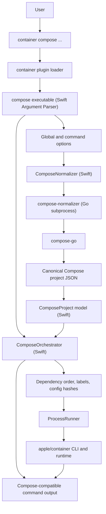

# container-compose Design

`container-compose` is a standalone plugin for Apple's
[`container`](https://github.com/apple/container) CLI. It is designed to provide
Docker Compose v2 style local-development workflows while keeping the
orchestration layer close to the Swift code and runtime primitives used by
[`apple/container`](https://github.com/apple/container).

## Goals

- Match Docker Compose file semantics by delegating parsing, merging,
  interpolation, profiles, and project normalization to the Compose reference
  implementation.
- Keep runtime orchestration in Swift so the plugin can use the same language,
  package manager, and container-related products as
  [`apple/container`](https://github.com/apple/container).
- Make generated container, volume, and network names deterministic.
- Label every project resource with Compose metadata so lifecycle commands are
  project scoped and repeatable.
- Fail clearly when a Compose feature depends on a runtime primitive that
  [`apple/container`](https://github.com/apple/container) does not expose yet.

## Why Go Is Used

Go is used only for the Compose normalization helper. The rest of the plugin is
Swift.

The main reason is `compose-go`. It is the maintained Compose Specification
implementation used by Docker Compose for loading and normalizing Compose
projects. By calling `compose-go`, this project avoids hand-rolling complex
Compose behavior such as multi-file merging, variable interpolation, profiles,
`.env` handling, extension fields, configs, secrets, healthchecks, and canonical
project defaults.

Rust would be a good systems language for a standalone parser, but it would
still require either reimplementing Compose semantics or wrapping `compose-go`
through a subprocess or foreign-function boundary. Swift has the same problem:
it is the right choice for the plugin and orchestration layer, but not for
rebuilding the full Compose loader from scratch. Objective-C is not a good fit
for this project because it would add an older object model without improving
Compose compatibility or integration with SwiftPM.

The Go boundary is intentionally small. The helper accepts Compose CLI-shaped
normalization options and emits canonical JSON. Swift treats that JSON as an
input model and performs all runtime decisions.

## Architecture



## Runtime Boundary

The installed plugin layout is:

```text
/usr/local/libexec/container-plugins/compose/bin/compose
/usr/local/libexec/container-plugins/compose/config.toml
/usr/local/libexec/container-plugins/compose/resources/compose-normalizer
```

`compose` is the Swift executable. It parses Docker Compose style commands and
options, invokes the normalizer, validates the resulting project, and translates
Compose operations into `container` operations.

Current orchestration uses direct Apple `container` APIs where a stable API maps cleanly to a Compose operation, and keeps the installed `container` CLI as the compatibility adapter for command surfaces that are not yet represented by a focused direct adapter. For example, project networks use `NetworkClient.create(configuration:)` and `NetworkClient.delete(id:)`, project volumes use `ClientVolume.create(name:driver:driverOpts:labels:)` and `ClientVolume.delete(name:)`, `compose kill` uses `ContainerClient.kill(id:signal:)`, `compose cp` uses `ContainerClient.copyIn(id:source:destination:)` and `ContainerClient.copyOut(id:source:destination:)` for service-aware copies, and `compose export` uses `ContainerClient.export(id:archive:)` for real execution. These commands render the equivalent `container` command only for `--dry-run` output. Apple publishes public DocC documentation for [`container`](https://apple.github.io/container/documentation/) and [`ContainerClient`](https://apple.github.io/container/documentation/containerclient/) APIs; those docs should guide future direct Swift API adapter work whenever Compose compatibility needs primitives that are available in the API.

`compose-normalizer` is a Go executable. It has no orchestration behavior. Its
only job is to load Compose files with `compose-go` and emit the normalized
project as JSON.

## Orchestration Model

Swift orchestration is based on a normalized `ComposeProject` model. Each
service is converted into deterministic runtime operations:

- Networks and volumes are created before services, unless marked external.
- Images are pulled or built according to command options and service
  definitions.
- Services are started in dependency order.
- Containers are named from the Compose project and service names unless a
  service declares an explicit container name.
- Compose labels record project, service, working directory, compose file hash,
  and service config hash.
- Existing containers are reused when their config hash matches and the command
  does not request recreation.
- `down` removes project-scoped containers and networks, and removes volumes
  only when requested.

Unsupported runtime behavior must be reported as an explicit error. This keeps
the plugin honest while gaps in
[`apple/container`](https://github.com/apple/container) are closed upstream.

## Design Principles

- Prefer small, testable value models over broad mutable state.
- Keep subprocess interaction behind `CommandRunning` so orchestration can be
  unit tested without a live container runtime.
- Keep Compose parsing out of Swift and runtime orchestration out of Go.
- Use deterministic names, sorted traversal, and labels to make repeated runs
  predictable.
- Keep the public behavior close to Docker Compose where
  [`apple/container`](https://github.com/apple/container) has the required
  primitive, and fail with precise feature names where it does not.
- Preserve [`apple/container`](https://github.com/apple/container) conventions
  so the plugin can be reviewed for future in-tree adoption with minimal
  conceptual translation.
