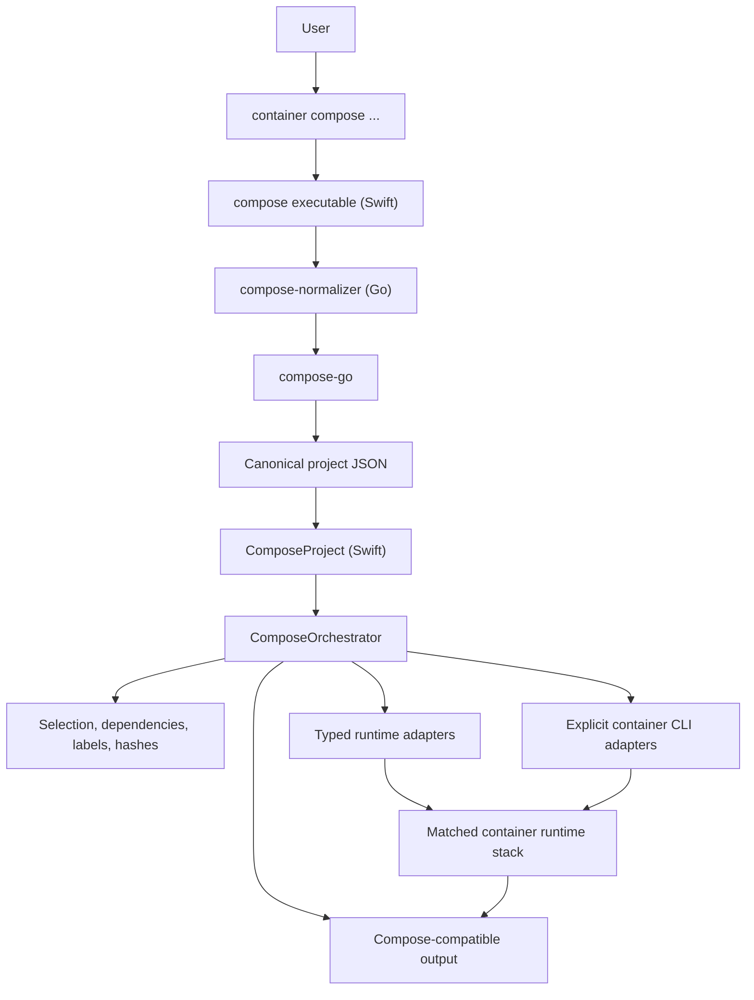

# container-compose Design

`container-compose` is a plugin for Apple's
[`container`](https://github.com/apple/container) CLI architecture. The
supported release lane uses the matched stephenlclarke runtime stack while
Apple-facing runtime additions are prepared as small generic handoffs.

The design has three boundaries: `compose-go` owns Compose project semantics,
Swift owns orchestration and user-visible compatibility, and the runtime stack
owns container, image, network, volume, process, and virtual-machine
primitives. [STATUS.md](STATUS.md) is the authoritative feature ledger; this
file records only the architecture that should remain stable as parity grows.

## Goals

- Match Docker Compose v2 loading and normalization behavior without building a
  second Compose parser.
- Keep Docker-shaped policy, service fan-out, output, and compatibility errors
  in `container-compose`.
- Prefer typed `container` APIs whenever they express the required primitive.
- Keep CLI-backed adapters explicit where the CLI is still the available
  runtime boundary.
- Make project resources deterministic, labelled, repeatable, and safe to
  reconcile.
- Reject unsupported behavior before runtime side effects.
- Shape Apple-backed changes as generic, focused, tested primitives that can be
  reviewed independently of Compose.

## Ownership Boundaries

### Compose Normalization

The release-built Go `compose-normalizer` helper uses
[`compose-go`](https://github.com/compose-spec/compose-go) for file discovery,
multi-file merge, interpolation, profiles, includes, extension handling, path
resolution, validation, and canonical defaults. It accepts Compose CLI-shaped
normalization inputs and emits canonical JSON. It does not perform runtime
work.

Generated Swift schema types may eventually reduce decoding boilerplate, but
they do not replace `compose-go`: a schema describes the accepted model shape,
not the loader behavior Docker Compose users depend on.

### Swift Orchestration

Swift decodes the canonical project, validates runtime-dependent behavior,
plans resource operations, reconciles existing project state, and renders
Docker Compose-compatible output. It owns:

- project and service selection;
- dependency ordering and replica fan-out;
- deterministic names, labels, and configuration hashes;
- Compose command and option policy;
- progress, prefixes, color, formatting, and dry-run output;
- precise unsupported-feature errors.

### Runtime Stack

The matched `container`, `containerization`, and builder-shim packages own
generic runtime behavior. Direct adapters cover typed APIs exposed by the
runtime. Command adapters cover remaining stable CLI surfaces, including the
build boundary and create-time values not yet available through a focused API.

Docker and Compose syntax is normalized into typed Compose-owned plans before
runtime projection. For example, `ContainerServiceCreatePlan` keeps service
identity, process configuration, logging, health, restart, hostname, hosts,
sysctls, and block-I/O values typed even while part of execution still renders
`container` command arguments.

Missing runtime capabilities belong in Apple-shaped issue and pull request
drafts under [`docs/upstream/`](docs/upstream/). Those drafts request reusable
runtime primitives, not Compose service selection or Docker output policy.

## Architecture



The runtime adapter choice is an implementation detail below the orchestration
boundary. Moving a capability from a command adapter to a direct API must not
change Compose-visible behavior.

## Package Layout

Installed packages use this plugin layout:

```text
/usr/local/libexec/container-plugins/compose/bin/compose
/usr/local/libexec/container-plugins/compose/config.toml
/usr/local/libexec/container-plugins/compose/resources/build-info.json
/usr/local/libexec/container-plugins/compose/resources/compose-normalizer
```

The Swift executable owns command parsing and orchestration. The Go binary is a
release-built normalization subprocess. `config.toml` registers the plugin with
`container`.

## Build Provenance

Packaged builds include `compose/resources/build-info.json`. It records the
package lane, source branch and commit, build type, resolved `container`
commit, `containerization` pin, and embedded `compose-go` version.
`container compose version` exposes the plugin metadata, while
`container system version` exposes the running runtime and builder metadata.
Runtime-backed commands compare those records before side effects so mixed or
stale installations fail with upgrade guidance.

Source builds fall back to the active checkout and resolved package metadata
when packaged provenance is absent.

## Design Rules

- Keep Compose parsing out of Swift and runtime orchestration out of Go.
- Prefer small typed models and focused adapters over broad mutable state.
- Keep subprocess interaction behind `CommandRunning` so plans remain testable
  without a live runtime.
- Preserve deterministic names, sorted traversal, labels, and configuration
  hashes.
- Use upstream Apple APIs when they overlap local code and remain sufficient.
- Keep every Apple-backed local change in an Apple-shaped commit with focused
  tests and a complete handoff draft.
- Keep support claims in [STATUS.md](STATUS.md), validation and release policy
  in [BUILD.md](BUILD.md), and installation steps in [INSTALL.md](INSTALL.md).
