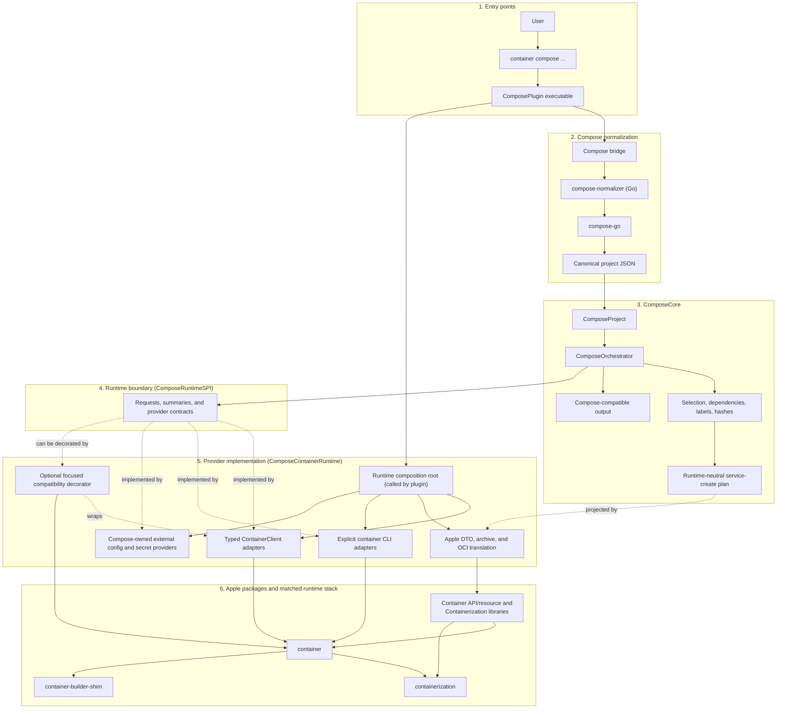

# container-compose Design

`container-compose` is a plugin for Apple's
[`container`](https://github.com/apple/container) CLI architecture. The
supported release lane uses the matched stephenlclarke runtime stack while
Apple-facing runtime additions are prepared as small generic handoffs.

The implementation has a separated architecture. `compose-go` owns Compose
project semantics, Swift owns normalization bridging and user-visible
orchestration policy, and `ComposeRuntimeSPI` provides injectable
runtime-neutral contracts. `ComposeCore` depends only on that Compose-owned
contract target. `ComposeContainerRuntime` owns Apple DTO, archive, OCI, and
live API translation for the matched runtime stack.

The package and source boundary is enforced by
`make core-runtime-neutrality`.
[STATUS.md](STATUS.md) is the authoritative feature ledger.

## Goals

- Match Docker Compose v2 loading and normalization behavior without building a
  second Compose parser.
- Keep Docker-shaped policy, service fan-out, output, and compatibility errors
  in `container-compose`.
- Prefer typed `container` APIs whenever they express the required primitive.
- Keep CLI-backed adapters explicit where the CLI is still the available
  runtime boundary.
- Make project resources deterministic, labelled, repeatable, and safe to
  reconcile.
- Reject unsupported behavior before runtime side effects.
- Shape Apple-backed changes as generic, focused, tested primitives that can be
  reviewed independently of Compose.

## Ownership Boundaries

### Compose Normalization

The release-built Go `compose-normalizer` helper uses
[`compose-go`](https://github.com/compose-spec/compose-go) for file discovery,
multi-file merge, interpolation, profiles, includes, extension handling, path
resolution, validation, and canonical defaults. It accepts Compose CLI-shaped
normalization inputs and emits canonical JSON. It does not perform runtime
work.

Generated Swift schema types may eventually reduce decoding boilerplate, but
they do not replace `compose-go`: a schema describes the accepted model shape,
not the loader behavior Docker Compose users depend on.

### Swift Orchestration

Swift decodes the canonical project, validates runtime-dependent behavior,
plans resource operations, reconciles existing project state, and renders
Docker Compose-compatible output. It owns:

- project and service selection;
- dependency ordering and replica fan-out;
- deterministic names, labels, and configuration hashes;
- Compose command and option policy;
- progress, prefixes, color, formatting, and dry-run output;
- precise unsupported-feature errors.

### Runtime Stack

The matched `container`, `containerization`, and builder-shim packages own
generic runtime behavior. Direct adapters cover typed APIs exposed by the
runtime. Command adapters cover remaining stable CLI surfaces, including the
build boundary and create-time values not yet available through a focused API.

`ComposeRuntimeSPI` is the Compose-owned injection boundary for discovery,
lifecycle, execution, copy/export, logs/events, stats/top, configs/secrets,
images, and project resources. The SPI target itself has no Apple runtime
dependency. The `ContainerClient`- and CLI-backed managers implement those
contracts through `ComposeContainerRuntime`.

Compose-specific archive requests are also injected without exposing Apple
types. `ComposeContainerRuntime` supplies archive-stream staging for path-only
providers, Bridge template extraction, and OCI commit-image construction.

Docker and Compose syntax is normalized into typed plans before runtime
projection. `ContainerServiceCreatePlan` keeps service identity, process
configuration, logging, health, restart, hostname, hosts, sysctls, block-I/O,
and resource values in Compose-owned types. The Apple-backed provider converts
those values to `ContainerResource` and `ContainerizationOCI` DTOs.
`memswap_limit` is resolved in Core as a total memory-plus-swap byte value:
Compose validates its relationship to `mem_limit` and calculates Docker's
default, then the current explicit CLI adapter carries the resulting
`--memory-swap` value. The lower stack receives the generic typed primitive and
projects it to OCI.

Missing runtime capabilities belong in Apple-shaped issue and pull request
drafts under [`docs/upstream/`](docs/upstream/). Those drafts request reusable
runtime primitives, not Compose service selection or Docker output policy.

## Architecture

### Layer Responsibilities

| Layer | Responsibility | Constraint |
| --- | --- | --- |
| Entry points | Plugin discovery, command parsing, user invocation, and Apple-backed composition | Imports Apple command and runtime products |
| Compose normalization | Compose-file loading, interpolation, merge, and canonical JSON | No runtime work |
| `ComposeCore` | Selection, runtime-neutral plans, reconciliation, Docker-compatible behavior, and output | Depends only on `ComposeRuntimeSPI`; imports no Apple modules |
| `ComposeRuntimeSPI` | Runtime-neutral requests, summaries, create-plan value types, and capability contracts | Contains no Apple package types or dependencies |
| `ComposeContainerRuntime` | Typed `ContainerClient`, Apple DTO/archive/OCI translation, explicit CLI translations, and Compose-owned external-resource defaults | Is the replaceable Apple-backed provider |
| Matched runtime stack | Containers, images, networks, volumes, processes, VMs, and builds | Carries no Docker/Compose compatibility policy |

`ComposeContainerRuntime` is an Apple-backed composition root and owns the
local default adapters for filesystem-backed external configs and
caller-Keychain external secrets. The plugin injects those collaborators into
`ComposeCore`. Standalone Core defaults intentionally report an
unsupported-runtime error until a library client supplies a provider.

### Runtime Boundary

`ARCH-101` and `ARCH-102` established this boundary:

1. `ComposeCore` depends only on Compose-owned models and
   `ComposeRuntimeSPI`.
2. Public Core APIs contain no Apple package types.
3. `ComposeContainerRuntime` owns every Apple translation and can be replaced
   at the executable or library composition boundary.
4. Package-graph and source-import checks prevent the dependency from
   returning.


```mermaid
flowchart TD
    subgraph Entry["1. Entry points"]
        direction TB
        User["User"] --> ContainerCLI["container compose ..."]
        ContainerCLI --> Plugin["ComposePlugin executable"]
    end

    subgraph Normalization["2. Compose normalization"]
        direction TB
        Bridge["Compose bridge"] --> Normalizer["compose-normalizer (Go)"]
        Normalizer --> ComposeGo["compose-go"]
        ComposeGo --> Canonical["Canonical project JSON"]
    end

    subgraph Policy["3. ComposeCore"]
        direction TB
        Model["ComposeProject"] --> Orchestrator["ComposeOrchestrator"]
        Orchestrator --> Planner["Selection, dependencies, labels, hashes"]
        Planner --> CreatePlan["Runtime-neutral service-create plan"]
        Orchestrator --> Output["Compose-compatible output"]
    end

    subgraph Boundary["4. Runtime boundary (ComposeRuntimeSPI)"]
        SPI["Requests, summaries, and provider contracts"]
    end

    subgraph Providers["5. Provider implementation (ComposeContainerRuntime)"]
        direction TB
        Composition["Runtime composition root (called by plugin)"]
        Direct["Typed ContainerClient adapters"]
        Translation["Apple DTO, archive, and OCI translation"]
        Command["Explicit container CLI adapters"]
        LocalStores["Compose-owned external config and secret providers"]
        Decorator["Optional focused compatibility decorator"]
        Composition --> Direct
        Composition --> Translation
        Composition --> Command
        Composition --> LocalStores
    end

    subgraph Runtime["6. Apple packages and matched runtime stack"]
        direction TB
        AppleProducts["Container API/resource and\nContainerization libraries"]
        Container["container"] --> Containerization["containerization"]
        Container --> Builder["container-builder-shim"]
        AppleProducts --> Container
        AppleProducts --> Containerization
    end

    Plugin --> Bridge
    Plugin --> Composition
    Canonical --> Model
    Orchestrator --> SPI
    SPI -. "implemented by" .-> Direct
    SPI -. "implemented by" .-> Command
    SPI -. "implemented by" .-> LocalStores
    SPI -. "can be decorated by" .-> Decorator
    Decorator -. "wraps" .-> Direct
    CreatePlan -. "projected by" .-> Translation
    Translation --> AppleProducts
    Direct --> Container
    Command --> Container
    Decorator --> Container
```

Solid arrows show data, execution, or package-use flow. Dashed arrows show
provider implementation and projection relationships. Moving a capability
from a command adapter to a direct API must not change Compose-visible
behavior.

### Source Layout

```text
Sources/ComposePlugin/        Plugin command entry point and ArgumentParser surface
Sources/ComposeCore/          Normalization, runtime-neutral planning, and orchestration
Sources/ComposeContainerRuntime/ Apple DTO/archive/OCI translation, providers, and composition root
Sources/ComposeRuntimeSPI/    Runtime-neutral value types and provider contracts
Tools/compose-normalizer/     Compose-go-backed canonical JSON normalizer
Tests/ComposeCoreTests/       Orchestration and adapter behavior
Tests/ComposeRuntimeSPITests/ Runtime-boundary contract behavior
```

## Package Layout

Installed packages use this plugin layout:

```text
/usr/local/libexec/container-plugins/compose/bin/compose
/usr/local/libexec/container-plugins/compose/config.toml
/usr/local/libexec/container-plugins/compose/resources/build-info.json
/usr/local/libexec/container-plugins/compose/resources/container-compose-icon.png
/usr/local/libexec/container-plugins/compose/resources/compose-normalizer
```

The Swift executable owns command parsing and orchestration. The Go binary is a
release-built normalization subprocess. `config.toml` registers the plugin with
`container`.

## Build Provenance

Packaged builds include `compose/resources/build-info.json`. It records the
package lane, source branch and commit, build type, resolved `container`
commit, `containerization` pin, and embedded `compose-go` version.
`container compose version` exposes the plugin metadata, while
`container system version` exposes the running runtime and builder metadata.
Runtime-backed commands compare those records before side effects so mixed or
stale installations fail with upgrade guidance.

Source builds fall back to the active checkout and resolved package metadata
when packaged provenance is absent.

## Design Rules

- Keep Compose parsing out of Swift and runtime orchestration out of Go.
- Prefer small typed models and focused adapters over broad mutable state.
- Keep every Core request, summary, and public plan free of Apple package
  types.
- Run `make core-runtime-neutrality` to enforce the package and source-import
  boundary.
- Keep subprocess interaction behind `CommandRunning` so plans remain testable
  without a live runtime.
- Preserve deterministic names, sorted traversal, labels, and configuration
  hashes.
- Use upstream Apple APIs when they overlap local code and remain sufficient.
- Keep every Apple-backed local change in an Apple-shaped commit with focused
  tests and a complete handoff draft.
- Keep support claims in [STATUS.md](STATUS.md), validation and release policy
  in [BUILD.md](BUILD.md), and installation steps in [INSTALL.md](INSTALL.md).
