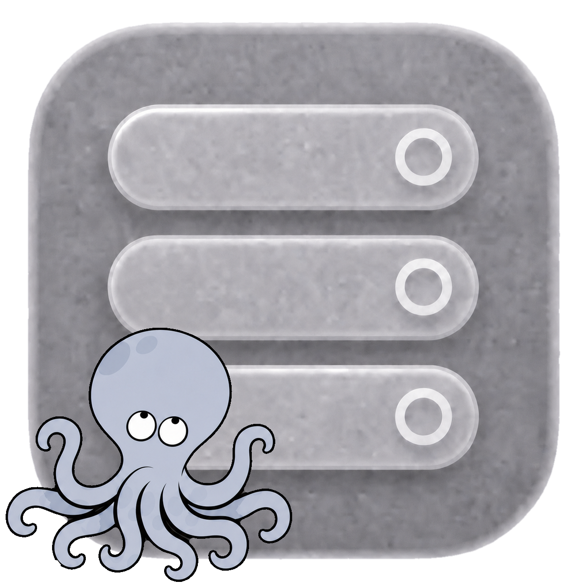

# container-compose

<!-- markdownlint-disable MD033 -->

  
  
  
  
  
  
  
  
  
  
  
  
  
  
  

 
 
<!-- markdownlint-enable MD033 -->

`container-compose` is a standalone plugin that provides Docker Compose v2
workflows for Apple's [`container`](https://github.com/apple/container) CLI.
Local files, Git resources, and `oci://` Compose project artifacts are
normalized with `compose-go`; image-backed projects can also push service
images and publish Compose YAML, env-file layers, and optional image digest
override layers or application image indexes as OCI project artifacts. Swift owns
orchestration and maps supported Compose behavior to the matched runtime stack.

> [!WARNING]
> 🤬 **This project is a maintenance nightmare.** 🤬
>
> What started as a 'fun' implementation due to a real need for Compose functionality on `apple/container` has turned into a beast. `container-compose` cannot be maintained in isolation: it depends on runtime and build capabilities not yet available in Apple releases, plus local fixes for upstream defects. Keeping it working means carrying and continuously refreshing a matched four-repository stack. At the 23 July 2026 snapshot, the three support forks are **431 commits ahead of Apple upstream**:
>
> - [`containerization`](https://github.com/stephenlclarke/containerization): **0 behind, 126 ahead** at [`6aa6e803539c`](https://github.com/stephenlclarke/containerization/commit/6aa6e803539c59ce754c55628e5417356216b297).
> - [`container`](https://github.com/stephenlclarke/container): **0 behind, 274 ahead** at [`ffe5819db359`](https://github.com/stephenlclarke/container/commit/ffe5819db3595ab88403bef01e9c3aa0ff5e9e88).
> - [`container-builder-shim`](https://github.com/stephenlclarke/container-builder-shim): **0 behind, 31 ahead** at [`5939a91ec0dd`](https://github.com/stephenlclarke/container-builder-shim/commit/5939a91ec0dd).
> - [`container-compose`](https://github.com/stephenlclarke/container-compose): the integration repository's current `main` branch, with no Apple repository to compare against.
>
> What looks like a local Compose change can therefore require coordinated conflict resolution, pin updates, builds, tests, packaging, and release validation across the entire stack. The pinned revisions must move together.
>
> Apple's [#1769 proposal](https://github.com/apple/container/pull/1769) and [stated direction](https://github.com/apple/container/pull/1769#issuecomment-4781645360) are that Docker CLI compatibility is **NOT** a project objective, because of UX, naming, and maintenance trade-offs; its preferred route is Docker CLI access through [Socktainer](https://github.com/socktainer/socktainer) and a separate API bridge or service plugin. The missing primitives and fixes may therefore remain long-lived fork responsibilities rather than work Apple adopts upstream.

<!-- Separate GitHub callouts. -->

> [!NOTE]
> **Runtime boundary**
>
> `ComposeRuntimeSPI` is the Compose-owned, runtime-neutral contract layer. It defines requests, summaries, and provider contracts for discovery, lifecycle, execution, copy/export, logs/events, stats/top, images, configs/secrets, and project resources, without importing Apple runtime packages.
>
> `ComposeCore` uses those contracts for runtime operations while sharing typed container resource models where needed. The plugin installs `ComposeContainerRuntime`, the Apple-backed composition root: it wires typed `ContainerClient` providers, explicit CLI bridges, and Compose-owned filesystem external-config and Keychain external-secret defaults. Standalone `ComposeCore` requires a provider rather than constructing an Apple client.
>
> Docker and Compose policy stays above this seam. This is not a general AOP framework: focused decorators can negotiate declared capabilities, while VM, guest, cgroup, mount, archive, device, and builder primitives remain small Apple-shaped runtime slices. New runtime work continues in tested vertical slices without changing Compose-visible behavior outside its documented parity surface.
>
> The resource contract also carries explicit `enableIPv6` and IPv6 gateway network intent. An enabled IPv6 pool can select an in-prefix gateway, which the matched macOS 26 vmnet primitive applies as the primary guest route and reports through network inspection. For `enable_ipv6: false`, Compose preserves the declared IPv6 IPAM pool and gateway in `config` output, but omits those contradictory values from the effective runtime create request, as Docker Engine does. The matched vmnet primitive then disables NAT66 and router advertisements and reports no IPv6 subnet.

Help color-codes command, subcommand, and option support: green for supported,
orange for partially supported, and red for unsupported. Command support and
option support are separate signals: a command can still be partially supported
when every listed option is green if the remaining Docker Compose gap is tied
to operands, output shape, or a runtime primitive instead of a flag. Partially
supported commands include a `Limitations` line that names the remaining gap.
Use `--ansi never` for plain output. Unsupported runtime behavior fails before
side effects with an explicit `unsupported compose feature` message.

The top-level help output is the quickest support overview. Run
`container compose COMMAND --help` for command-specific option support.

The authoritative parity ledger is [STATUS.md](STATUS.md). It lists every
tracked Compose file, service, Dockerfile/build, command, and long-option
surface with ✅ yes, ⚠️ partial, or ❌ no, and explains every partial surface.

On macOS, `container-compose` honors the active pull policy, prepares missing default-pull images when needed, then reads image metadata before `up`, `create`, and one-off `run`. It creates deterministic implicit Dockerfile-declared volumes and seeds an empty local volume from the selected image path for both declared and ordinary local volume mounts (including inherited external volumes), preserving the selected directory's ownership and mode on the volume root. `volume.nocopy: true`, a pre-existing `volume.subpath`, and a mount at a missing image path remain empty; populated volumes are preserved across `down`/`up`, matching Docker. Foreground `up --exit-code-from SERVICE` returns the selected service's terminal status even when teardown closes attached log streams.

Use `container system version` to see the running `container` runtime source, branch lane, commit, compiled `containerization` ref, and builder image metadata. Use `container compose version` to see the installed plugin lane, embedded `compose-go` version, and package/runtime compatibility metadata.

## See It Work

The recording is a complete matched-runtime execution of the portable nginx and Alertmanager service slice in the real [`examples/monitoring-stack/docker-compose.yaml`](examples/monitoring-stack/docker-compose.yaml). It visibly types `container system start`, confirms the running service, starts that two-service slice, shows `stats --no-stream` and `ps`, queries nginx `/healthz` and Alertmanager readiness from their running services, writes and reads data in the named `nginx_cache` volume across a retained-volume shutdown, and finally removes the project with `down --volumes --remove-orphans`. The focused slice keeps the recorded startup deterministic while the full macOS-safe monitoring stack remains covered by the Docker Compose v2 parity suite. Each displayed result is the live output of the command that was just typed; the tape has no transcript replay or marker helper. VHS is the fail-closed runtime gate on the hardware-virtualization-capable release runner, and each successful Current build publishes that direct terminal session with the mutable `current` release.

## Install And Project Map

Use [INSTALL.md](INSTALL.md) for install, upgrade, verification, and uninstall
commands. The supported Homebrew install uses the matched `stephenlclarke`
runtime stack; [BUILD.md](BUILD.md) covers repository roles, branch policy, and
deterministic release promotion.

## Plugin Recognition

When installed correctly, `container help` lists `compose` under `PLUGINS`.

## Documentation

- [Container documentation portal](https://stephenlclarke.github.io/container-compose/): browse the unified DocC portal for `container-compose`, `container`, `containerization`, and `container-k8s`, plus the builder shim's project documentation.
- [container-compose API reference](https://stephenlclarke.github.io/container-compose/documentation/composecore/): browse the Compose plugin API reference generated from the Swift source and published automatically from `main`.
- [INSTALL.md](INSTALL.md): install, upgrade, verify, uninstall, recover bad installs, and diagnose runtime issues.
- [BUILD.md](BUILD.md): build, test, package, validate parity, and promote the current build to a stable release, including the weekly minor-release scheduler and manual major-release dispatch.
- [DESIGN.md](DESIGN.md): understand the Swift/Go boundary and runtime adapter ownership.
- [STATUS.md](STATUS.md): get the current parity surfaces, blockers, active gaps, and validation handoff.
- [docs/external-resources.md](docs/external-resources.md): provision Compose-owned external config files and Keychain secrets.
- [CONTRIBUTING.md](CONTRIBUTING.md): prepare reviewable changes.
- [docs/parity/compose-cli-surface.md](docs/parity/compose-cli-surface.md): review local Docker Compose CLI surface parity and documented differences.
- [SUPPORT.md](SUPPORT.md): ask for help or report non-security issues.
- [SECURITY.md](SECURITY.md): report security issues.

The documents above are the maintained operational source of truth. The
Apple-facing drafts under [docs/upstream/](docs/upstream/README.md) are current
handoff records for unresolved or proposed upstream work; they are not install,
release, or support runbooks.

## License

This project uses the Apache License, Version 2.0, matching the license used by
[`apple/container`](https://github.com/apple/container).
