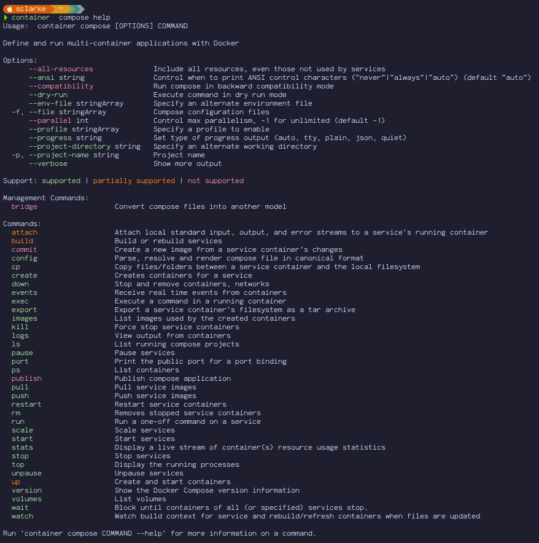
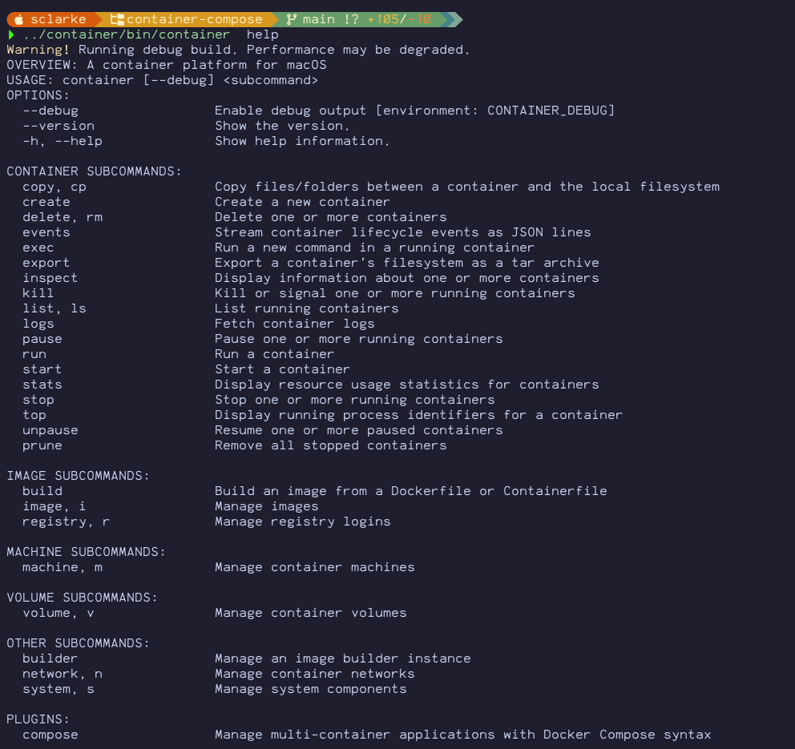

# container-compose

`container-compose` is a standalone plugin that provides Docker Compose style
workflows for Apple's [`container`](https://github.com/apple/container) CLI
where the supported Compose surface maps to available runtime primitives.

The first implementation target is local-development Compose v2 compatibility
where [`container`](https://github.com/apple/container) has matching runtime
primitives. Compose file normalization uses `compose-go`, with Swift handling
runtime orchestration.

The CLI accepts the Docker Compose 5.2.0 command and option surface, including
help output. Help color-codes command, subcommand, and option support status:
green for supported, orange for partially supported, and red for not supported;
use `--ansi never` for plain output. Commands or option modes that do not yet
have backing `apple/container` functionality fail with an explicit
`unsupported compose feature` message.

The top-level help output is the quickest support overview. Run
`container compose COMMAND --help` for command-specific option support.

Long-running project loading, image pull/build, and non-interactive runtime
handoff steps emit Compose-owned progress on stderr so scriptable stdout output
stays clean. Use `--progress quiet` to suppress these rows, `--progress plain`
for log-friendly rows, or `--progress tty` for the animated terminal spinner.
`--progress json` emits newline-delimited JSON events for Compose-owned phases.
`--progress auto` uses the animated spinner when stderr is a terminal and plain
rows otherwise.

Use `container system version` to see the running `container` runtime source, branch lane, commit, compiled `containerization` ref, and pinned `container-builder-shim` image. Use `container compose version` to see the installed plugin lane, embedded `compose-go` version, and the `container` / `containerization` pins that package was built against.

## Project Repositories

This fork-backed Compose stack spans four Stephen Clarke repositories:

- [`container-compose`](https://github.com/stephenlclarke/container-compose): this plugin and its Swift/Go packaging workflow.
- [`container`](https://github.com/stephenlclarke/container): the fork-backed runtime and CLI installed by Homebrew beside the plugin.
- [`containerization`](https://github.com/stephenlclarke/containerization): the Swift container runtime package consumed by both `container` and this plugin; `main` packages use `main`, and release packages use `release`.
- [`container-builder-shim`](https://github.com/stephenlclarke/container-builder-shim): the Go BuildKit bridge used by `container build`; `container` pins an immutable builder image version, currently `0.13.3`.

The aggregate Homebrew tap is [`homebrew-tap`](https://github.com/stephenlclarke/homebrew-tap). It tracks the four source repositories on `main` for maintenance, while installable formulae consume prebuilt release-quality assets. All Go outputs in the stack are treated as release code, not debug helpers.

## Plugin Recognition

When installed correctly, `container help` lists `compose` under `PLUGINS`.

## Documentation

- [INSTALL.md](INSTALL.md): install prebuilt Homebrew assets or a local plugin archive.
- [TROUBLESHOOTING.md](TROUBLESHOOTING.md): recover bad installs and diagnose runtime issues.
- [BRANCHES.md](BRANCHES.md): understand active `main`, stable `release`, and tagged `release-VERSION-TAG` install branches.
- [BUILD.md](BUILD.md): build, test, package, and run contributor validation.
- [DESIGN.md](DESIGN.md): understand the Swift/Go boundary and runtime adapter ownership.
- [PLAN.md](PLAN.md): review the current roadmap and Apple-facing slice order.
- [STATUS.md](STATUS.md): get the current dependency pins, blockers, and validation handoff.
- [CONTRIBUTING.md](CONTRIBUTING.md): prepare reviewable changes.
- [docs/parity/compose-cli-surface.md](docs/parity/compose-cli-surface.md): review local Docker Compose CLI surface parity and documented differences.
- [SUPPORT.md](SUPPORT.md): ask for help or report non-security issues.
- [SECURITY.md](SECURITY.md): report security issues.

## License

This project uses the Apache License, Version 2.0, matching the license used by
[`apple/container`](https://github.com/apple/container).
