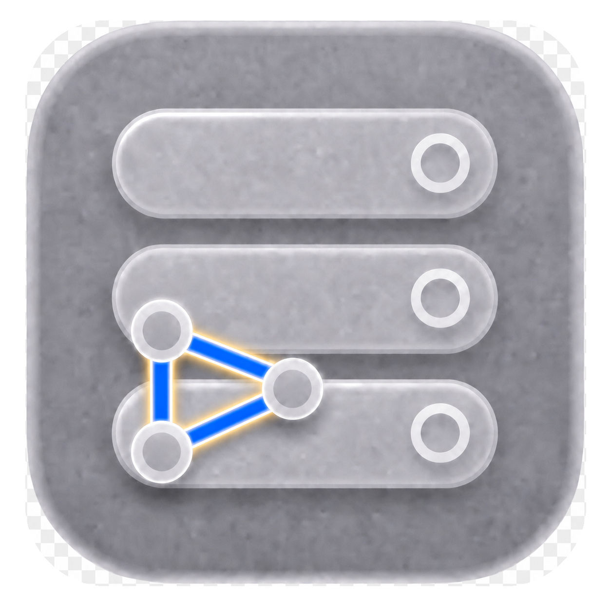

# container-compose

<!-- markdownlint-disable MD033 -->

  
  
  
  
  
  
  
  
  
  
  
  
  
  
  

 
<!-- markdownlint-enable MD033 -->

`container-compose` is a standalone plugin that provides Docker Compose v2
workflows for Apple's [`container`](https://github.com/apple/container) CLI.
Local files, Git resources, and `oci://` Compose project artifacts are
normalized with `compose-go`; image-backed projects can also push service
images and publish Compose YAML, env-file layers, and optional image digest
override layers or application image indexes as OCI project artifacts. Swift owns
orchestration and maps supported Compose behavior to the matched runtime stack.

Help color-codes command, subcommand, and option support: green for supported,
orange for partially supported, and red for unsupported. Command support and
option support are separate signals: a command can still be partially supported
when every listed option is green if the remaining Docker Compose gap is tied
to operands, output shape, or a runtime primitive instead of a flag. Partially
supported commands include a `Limitations` line that names the remaining gap.
Use `--ansi never` for plain output. Unsupported runtime behavior fails before
side effects with an explicit `unsupported compose feature` message.

Network attachments support Compose `interface_name`, which assigns a stable interface name inside the Linux guest, operator-managed `link_local_ips`, and static `ipv4_address` or `ipv6_address`. A Compose-managed IPv4 network can also choose its IPAM gateway and `ip_range` for dynamic addresses, and reserve the values in one `ipam.config.aux_addresses` mapping from allocation. Static addresses on a Compose-managed network must belong to its declared matching IPAM subnet and cannot use its gateway or a reserved address; `ip_range` does not restrict valid explicit static addresses. The current default bridge backend treats `aux_addresses` names as driver metadata rather than container DNS entries. External networks are validated by the runtime. Each `link_local_ips` value becomes an additional guest address with Docker's `/16` IPv4 or `/64` IPv6 default address mask.

The top-level help output is the quickest support overview. Run
`container compose COMMAND --help` for command-specific option support.

The authoritative parity ledger is [STATUS.md](STATUS.md). It lists every
tracked Compose file, service, Dockerfile/build, command, and long-option
surface with ✅ yes, ⚠️ partial, or ❌ no, and explains every partial surface.

Use `container system version` to see the running `container` runtime source, branch lane, commit, compiled `containerization` ref, and builder image metadata. Use `container compose version` to see the installed plugin lane, embedded `compose-go` version, and package/runtime compatibility metadata.

## See It Work

The recording inspects the installed stack, exercises support-aware `up` help,
and renders the real [`examples/monitoring-stack/docker-compose.yaml`](examples/monitoring-stack/docker-compose.yaml)
creation, readiness, status, and teardown plans with `--dry-run`. Its reproducible
[VHS tape](docs/container-compose-demo.tape) is kept alongside the generated
recording. Every successful Current build regenerates the recording with the
matching packaged runtime and Compose plugin, then publishes it with the
mutable `current` release.

## Install And Project Map

Use [INSTALL.md](INSTALL.md) for install, upgrade, verification, and uninstall
commands. The supported Homebrew install uses the matched `stephenlclarke`
runtime stack; [BUILD.md](BUILD.md) covers repository roles, branch policy, and
deterministic release promotion.

## Plugin Recognition

When installed correctly, `container help` lists `compose` under `PLUGINS`.

## Documentation

- [DocC API reference](https://stephenlclarke.github.io/container-compose/documentation/): browse the JavaScript API reference generated from the Swift source and published automatically from `main`.
- [INSTALL.md](INSTALL.md): install, upgrade, verify, uninstall, recover bad installs, and diagnose runtime issues.
- [BUILD.md](BUILD.md): build, test, package, validate parity, and promote the current build to a stable release, including the weekly minor-release scheduler and manual major-release dispatch.
- [DESIGN.md](DESIGN.md): understand the Swift/Go boundary and runtime adapter ownership.
- [STATUS.md](STATUS.md): get the current parity surfaces, blockers, active gaps, and validation handoff.
- [CONTRIBUTING.md](CONTRIBUTING.md): prepare reviewable changes.
- [docs/parity/compose-cli-surface.md](docs/parity/compose-cli-surface.md): review local Docker Compose CLI surface parity and documented differences.
- [SUPPORT.md](SUPPORT.md): ask for help or report non-security issues.
- [SECURITY.md](SECURITY.md): report security issues.

The documents above are the maintained operational source of truth. The
Apple-facing drafts under [docs/upstream/](docs/upstream/README.md) are current
handoff records for unresolved or proposed upstream work; they are not install,
release, or support runbooks.

## License

This project uses the Apache License, Version 2.0, matching the license used by
[`apple/container`](https://github.com/apple/container).
