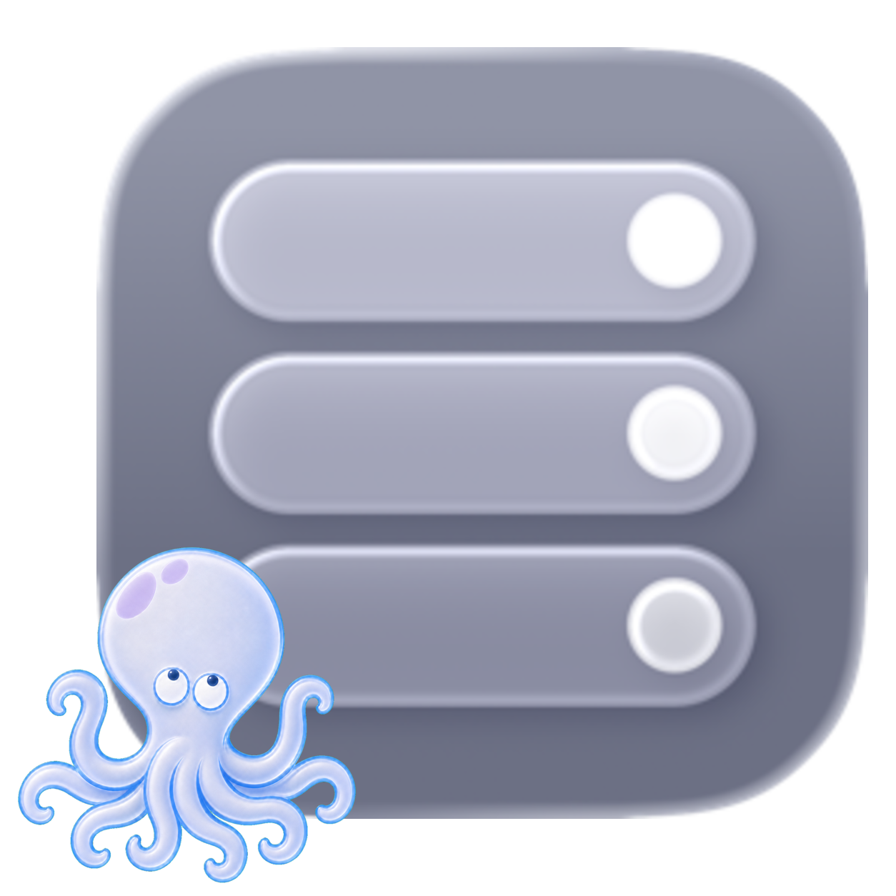
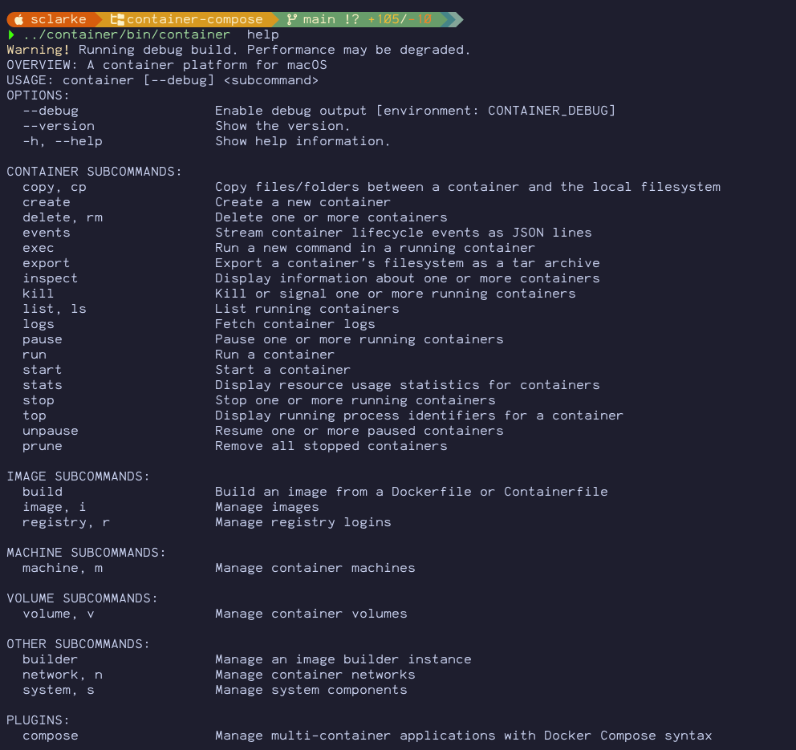

# container-compose

<!-- markdownlint-disable MD013 MD033 -->

  
  
  
  
  
  
  
  
  
  
  
  
  
  

 
 
<!-- markdownlint-enable MD033 -->

`container-compose` is a standalone plugin that provides Docker Compose v2
workflows for Apple's [`container`](https://github.com/apple/container) CLI.
Local files, Git resources, and `oci://` Compose project artifacts are
normalized with `compose-go`; image-backed projects can also push service
images and publish Compose YAML, env-file layers, and optional image digest
override layers or application image indexes as OCI project artifacts. Swift owns
orchestration and maps supported Compose behavior to the matched runtime stack.

## 0.14.2 Current candidate

[`0.14.1`](https://github.com/stephenlclarke/container-compose/releases/tag/0.14.1)
is the current stable macOS arm64 release. The rolling
[`current`](https://github.com/stephenlclarke/container-compose/releases/tag/current)
prerelease carries the reviewed 0.14.2 candidate with its matched Container
stack. It is not an immutable 0.14.2 release until the hosted Stable Release
Gate, including the supported Docker Compose parity suite, succeeds and
publishes that version.

The 0.14.2 maintenance candidate retains stopped containers and their log
histories after foreground `up --abort-on-container-exit`,
`--abort-on-container-failure`, and `--exit-code-from` completion. Its matched
runtime also recovers interrupted prepared cleanup, preserves short-lived VM
exits, keeps known-immediate starts off the speculative prewarm path, and
serializes cctl VM-backed integration tests so concurrent validation cannot
collide in the per-user runtime namespace.

The 0.14 release line adds explicit isolation and a faster, more
memory-responsive runtime:

- `container run --isolation dedicated-vm` retains the private-VM default,
  while explicit `shared-vm` runs eligible host, none, or built-in bridge
  workloads in a shared Linux sandbox; Compose projects can select the same
  modes with the service `isolation` field;
- live memory targets can be changed without restarting a container, and an
  opt-in controller samples usage to reclaim idle memory within a configured
  floor while restoring the boot-time maximum under sustained pressure;
- eligible dedicated containers prewarm after creation without starting init,
  independent VM boots run concurrently under a bounded FIFO admission limit,
  Containerization pipelines pod and mount preparation, and verified BuildKit
  contexts skip redundant file transfer; and
- shared-sandbox networking, root-filesystem privacy, mount materialization,
  natural exit, Virtualization.framework hot-plug recovery, concurrent netlink
  sessions, mountpoint creation, console links, tmpfs source projection,
  external-journal ext recovery, exec IPC namespace entry, optional-certificate
  TLS stability, and refreshed certificate handling include the release's
  reliability fixes.

Compose also reuses one control-plane Container client per invocation while
keeping attach and exec on independently owned sessions. This reduces repeated
XPC setup without allowing session teardown to interrupt unrelated work.

### Optimization pull-request provenance

The 0.14 release-line runtime and benchmark claims are backed by these merged support-fork
pull requests:

- the initial matched optimization stack: [Containerization #37](https://github.com/stephenlclarke/containerization/pull/37), [builder-shim #12](https://github.com/stephenlclarke/container-builder-shim/pull/12), and [Container #142](https://github.com/stephenlclarke/container/pull/142);
- concurrent and bounded dedicated-VM bootstrap: [Container #143](https://github.com/stephenlclarke/container/pull/143) and [Container #145](https://github.com/stephenlclarke/container/pull/145);
- dedicated prewarming and live memory control: [Containerization #41](https://github.com/stephenlclarke/containerization/pull/41), [Container #150](https://github.com/stephenlclarke/container/pull/150), [Container #154](https://github.com/stephenlclarke/container/pull/154), and [Container #158](https://github.com/stephenlclarke/container/pull/158);
- shared-VM execution and bounded workload starts: [Containerization #42](https://github.com/stephenlclarke/containerization/pull/42), [Containerization #46](https://github.com/stephenlclarke/containerization/pull/46), [Container #146](https://github.com/stephenlclarke/container/pull/146), [Container #159](https://github.com/stephenlclarke/container/pull/159), and [Container #165](https://github.com/stephenlclarke/container/pull/165); and
- Compose integration, client reuse, isolation projection, the isolation performance matrix, and invocation-scoped launch context reuse: [container-compose #325](https://github.com/stephenlclarke/container-compose/pull/325), [#327](https://github.com/stephenlclarke/container-compose/pull/327), [#330](https://github.com/stephenlclarke/container-compose/pull/330), [#331](https://github.com/stephenlclarke/container-compose/pull/331), and [#342](https://github.com/stephenlclarke/container-compose/pull/342), backed by [Container #177](https://github.com/stephenlclarke/container/pull/177); and
- 0.14.1 runtime recovery and immediate-start corrections: [Container #187](https://github.com/stephenlclarke/container/pull/187), [#188](https://github.com/stephenlclarke/container/pull/188), and [#190](https://github.com/stephenlclarke/container/pull/190).

As of 28 August 2026, **none of the benchmarked Container, Containerization,
builder-shim, or Compose optimization commits has a live pull request in an
Apple repository**. The stock-Apple `upstream/pr-*` branches are local
submission candidates, not submitted pull requests, and are deliberately not
presented as upstream links. The complete distinction between merged fork PRs,
Apple submissions, and unsubmitted candidates is recorded in the
[Apple upstream review](docs/upstream/APPLE-UPSTREAM-REVIEW.md#0140-optimization-pull-request-provenance).

The supported release line includes:

- durable `json-file` logging plus Syslog, Journald, Fluentd, GELF, Splunk HEC,
  AWS Logs, Google Cloud Logs, and Docker logging-plugin providers;
- bounded live log readers, rotation and compression health, provider recovery,
  and generation-safe logging cutover;
- network-scoped discovery and aliases, scaled hostnames, bridge mapping,
  advanced IPAM, IPv6-only networking, and runtime DNS;
- dependency-aware parallel lifecycle operations, attach-before-start,
  WebSocket attach and resize, wait, and expanded inspect/info behavior;
- inherited OCI and image-volume metadata, safer archive/copy behavior, image
  discovery and mutation, digest resolution, and content-addressed caching; and
- versioned runtime-capability negotiation plus stricter staging, containment,
  redaction, cancellation, and bounded-resource controls.

The candidate notes and exact dependency revisions are on the
[Current build page](https://github.com/stephenlclarke/container-compose/releases/tag/current).
[STATUS.md](docs/project/STATUS.md) describes the functionality and explicit limitations
in the stable baseline and current candidate. Planned compatibility work is kept separately in
[BACKLOG.md](docs/project/BACKLOG.md) and its linked GitHub issues.

> [!WARNING]
> 🤬 **This project is a maintenance nightmare.** 🤬
>
> <!-- upstream-metrics:start -->
> What started as a 'fun' implementation due to a real need for Compose functionality on `apple/container` has turned into a beast. `container-compose` cannot be maintained in isolation: it depends on runtime and build capabilities not yet available in Apple releases, plus local fixes for upstream defects. Keeping it working means carrying and continuously refreshing a matched four-repository stack. At the 4 September 2026 snapshot, the three support forks are **1098 commits ahead of Apple upstream**:
>
> - [`containerization`](https://github.com/stephenlclarke/containerization): **0 behind, 289 ahead** at [`7807badff6a8`](https://github.com/stephenlclarke/containerization/commit/7807badff6a8bd1d53fa1c6696543f7fffab0fa4).
> - [`container`](https://github.com/stephenlclarke/container): **0 behind, 761 ahead** at [`83cfab33d0b1`](https://github.com/stephenlclarke/container/commit/83cfab33d0b1ca5976ce979b3755761e58cc957a).
> - [`container-builder-shim`](https://github.com/stephenlclarke/container-builder-shim): **0 behind, 48 ahead** at [`4aff0ea2e7ff`](https://github.com/stephenlclarke/container-builder-shim/commit/4aff0ea2e7ff293544a4efac28b508da53aac3d6).
> - [`container-compose`](https://github.com/stephenlclarke/container-compose): the integration repository's current `main` branch, with no Apple repository to compare against.
>
> What looks like a local Compose change can therefore require coordinated conflict resolution, pin updates, builds, tests, packaging, and release validation across the entire stack. The pinned revisions must move together.
> <!-- upstream-metrics:end -->
>
> Apple's [#1769 proposal](https://github.com/apple/container/pull/1769) and [stated direction](https://github.com/apple/container/pull/1769#issuecomment-4781645360) are that Docker CLI compatibility is **NOT** a project objective, because of UX, naming, and maintenance trade-offs; its preferred route is Docker CLI access through [Socktainer](https://github.com/socktainer/socktainer) and a separate API bridge or service plugin. The missing primitives and fixes may therefore remain long-lived fork responsibilities rather than work Apple adopts upstream.

<!-- Separate GitHub callouts. -->

> [!NOTE]
> **Runtime boundary**
>
> `ComposeRuntimeSPI` is the Compose-owned, runtime-neutral contract layer. It defines requests, summaries, and provider contracts for discovery, lifecycle, execution, copy/export, logs/events, stats/top, images, configs/secrets, and project resources, without importing Apple runtime packages.
>
> `ComposeCore` depends only on those contracts and other Compose-owned models. The plugin installs `ComposeContainerRuntime`, the Apple-backed composition root: it translates neutral create plans to Apple DTOs, owns archive and OCI integration, and wires typed `ContainerClient` providers, explicit CLI bridges, and Compose-owned filesystem external-config and Keychain external-secret defaults. Standalone `ComposeCore` requires a provider rather than constructing an Apple client. `make core-runtime-neutrality` prevents Apple package dependencies or imports from returning to Core.
>
> Docker and Compose policy stays above this seam. This is not a general AOP framework: focused decorators can negotiate declared capabilities, while VM, guest, cgroup, mount, archive, device, and builder primitives remain small Apple-shaped runtime slices. New runtime work continues in tested vertical slices without changing Compose-visible behavior outside its documented parity surface.
>
> The resource contract also carries explicit `enableIPv6` and IPv6 gateway network intent. An enabled IPv6 pool can select an in-prefix gateway, which the matched macOS 26 vmnet primitive applies as the primary guest route and reports through network inspection. For `enable_ipv6: false`, Compose preserves the declared IPv6 IPAM pool and gateway in `config` output, but omits those contradictory values from the effective runtime create request, as Docker Engine does. The matched vmnet primitive then disables NAT66 and router advertisements and reports no IPv6 subnet.

Help color-codes command, subcommand, and option support: green for supported,
orange for partially supported, and red for unsupported. Command support and
option support are separate signals: a command can still be partially supported
when every listed option is green if the remaining Docker Compose gap is tied
to operands, output shape, or a runtime primitive instead of a flag. Partially
supported commands include a `Limitations` line that names the remaining gap.
Use `--ansi never` for plain output. Unsupported runtime behavior fails before
side effects with an explicit `unsupported compose feature` message.

For the 0.14.2 candidate, the generated help classifies 40 commands as green and six as
orange (`attach`, `events`, `exec`, `logs`, `run`, and `up`); no command is
red. It classifies 262 documented long options as green and only
`exec --privileged` as orange; no documented long option is red. Orange command
limitations describe the remaining runtime or evidence gap even when every
option for that command is green.

The top-level help output is the quickest support overview. Run
`container compose COMMAND --help` for command-specific option support.

Use [STATUS.md](docs/project/STATUS.md) for the current stable functionality and
[BACKLOG.md](docs/project/BACKLOG.md) for the remaining 1.0 parity contracts. The live
source of backlog state is the cross-repository GitHub hierarchy rooted at
[[Parity] Container Compose 1.0.0 completion](https://github.com/stephenlclarke/container-compose/issues/266).

The key project goal remains 100% observable Docker Compose v2 parity on macOS
with comparable or better performance. The backlog and executable reference
comparisons must expose every remaining project-owned difference; they must not
become implicit exceptions.

> [!IMPORTANT]
> **Retained controlled full-suite evidence (30 July 2026)**
>
> The complete maintained 62-target Docker Compose comparison suite passed in one uninterrupted 1,152.03-second run against Docker Compose 5.3.1 and Docker Engine 29.2.1 on a Mac17,9 running macOS 26.5.2. Its three-sample warm-image bridge comparator measured `up` at 0.153s for Docker Compose and 1.228s for container-compose (8.01×), while `down` measured 10.178s and 5.916s respectively (0.58×). Named-network service discovery, aliases, one-off aliases, recreate behavior, and source-scoped links all passed their live Docker oracles. Exact revisions, timing tables, fingerprints, and interpretation are retained in the [macOS Compose parity and performance review](docs/reviews/MACOS-COMPOSE-PARITY-AND-PERFORMANCE-REVIEW-2026-07-30.md).
>
> This retained run predates the current 0.14.2 candidate and is not a claim that the project goal is complete. Its lifecycle matrix covers warm-image 1/10/50-service detached startup and teardown, but its 31 July one-repetition debug diagnostic was slower than Docker at 10 and 50 services and is not release-grade evidence. That run did not include the later logging performance lanes; cold-resource collection, `develop.watch` sync, and build-context transfer remain open, and every partial surface in the current ledger remains open.

<!-- Separate GitHub callouts. -->

> [!NOTE]
> CodeQL is release-only. Current and stable package publication analyzes the
> exact Go normalizer source after the fail-fast Homebrew preflight and before
> native package construction. The standalone workflow recovers an already
> published release only. This does not claim Swift CodeQL coverage, and a
> missing or failed release analysis is not a pass.

On macOS, `container-compose` honors the active pull policy, prepares missing default-pull images when needed, then reads image metadata before `up`, `create`, and one-off `run`. It creates deterministic implicit Dockerfile-declared volumes and seeds an empty local volume from the selected image path for both declared and ordinary local volume mounts (including inherited external volumes), preserving the selected directory's ownership and mode on the volume root. `volume.nocopy: true`, a pre-existing `volume.subpath`, and a mount at a missing image path remain empty; populated volumes are preserved across `down`/`up`, matching Docker. Service `pre_start` helpers inherit service runtime context and gate startup, while `post_start` and `pre_stop` cover detached, foreground, and interactive one-off lifecycle paths with Docker-compatible detach and exit-status behavior. Foreground `up --exit-code-from SERVICE` returns the selected service's terminal status even when teardown closes attached log streams. The matched runtime encodes foreground attach signals by Linux-resolvable name, returns complete long records at backward-read tail boundaries, and keeps persistent log capture alive after an attached client disconnects; the committed signal/log reliability fixture verifies all three behaviors against Docker Compose V2.

Use `container system version` to see the running `container` runtime source, branch lane, commit, compiled `containerization` ref, and builder image metadata. Use `container compose version` to see the installed plugin lane, embedded `compose-go` version, and package/runtime compatibility metadata.

## See It Work

The recording is a complete matched-runtime execution of the portable nginx and Alertmanager service slice in the real [`examples/monitoring-stack/docker-compose.yaml`](examples/monitoring-stack/docker-compose.yaml). It visibly types `container system start`, confirms the running service, starts that two-service slice, shows `stats --no-stream` and `ps`, queries nginx `/healthz` and Alertmanager readiness from their running services, writes and reads data in the named `nginx_cache` volume across a retained-volume shutdown, and finally removes the project with `down --volumes --remove-orphans`. The focused slice keeps the recorded startup deterministic while the full macOS-safe monitoring stack remains covered by the Docker Compose v2 parity suite. Each displayed result is the live output of the command that was just typed; the tape has no transcript replay or marker helper. A separate recoverable Current Demo workflow records the session on the hardware-virtualization-capable runner after the signed Current packages and Homebrew formulae are available. Recording failure cannot block package, attestation, release, or tap publication, and an exact-SHA freshness check prevents a delayed recording from replacing a newer Current asset.

## Install And Project Map

Use [INSTALL.md](docs/guides/INSTALL.md) for install, upgrade, verification, and uninstall
commands. The supported Homebrew install uses the matched `stephenlclarke`
runtime stack; [BUILD.md](docs/guides/BUILD.md) covers repository roles, branch policy, and
deterministic release promotion.

## Plugin Recognition

When installed correctly, `container help` lists `compose` under `PLUGINS`.

## Documentation

- [Container developer API collection](https://stephenlclarke.github.io/api/): browse the unified documentation for `container-engine-api`, `container`, `containerization`, `container-k8s`, `container-builder-shim`, `container-compose`, and `devcontainer`.
- [container-compose API reference](https://stephenlclarke.github.io/api/container-compose/): browse the Compose plugin API reference generated from the Swift source.
- [INSTALL.md](docs/guides/INSTALL.md): install, upgrade, verify, uninstall, recover bad installs, and diagnose runtime issues.
- [BUILD.md](docs/guides/BUILD.md): build, test, package, validate parity, and promote the current build to a stable release, including the weekly minor-release scheduler and manual major-release dispatch.
- [DESIGN.md](docs/project/DESIGN.md): understand the Swift/Go boundary and runtime adapter ownership.
- [STATUS.md](docs/project/STATUS.md): understand the functionality and explicit limitations in the current stable release and candidate.
- [BACKLOG.md](docs/project/BACKLOG.md): understand the remaining parity contracts and follow their live GitHub issues.
- [Runtime capability contract](docs/architecture/runtime-capabilities.md): see the versioned matched-runtime requirements negotiated by 0.14.2 before side effects.
- [Docker logging-driver design](docs/architecture/docker-logging-driver-semantics-design.md): review the released logging architecture, retained evidence, and remaining provider and certification gaps.
- [Container-family parity architecture](docs/architecture/coherent-container-family-parity-design.md): understand the integrated authority, runtime topology, dependency order, and devcontainer/shared Engine design.
- [Container-family parity development cycle](docs/architecture/container-family-development-cycle.md): deliver vertical slices with local-first validation, review-to-clean convergence, MBP runners, clean GitHub state, upstream monitoring, and comparable-or-better performance.
- [Recoverable Container-family builds](docs/architecture/recoverable-container-family-builds.md): use the pinned OSS Nextflow graph for immutable source capture, noninteractive native macOS checks, durable evidence, and exact-session recovery.
- [Archived macOS parity closure review](docs/archive/remaining-macos-parity-closure-design.md): retain the 31 July 2026 analysis that preceded the GitHub-backed 1.0 backlog.
- [macOS Compose parity and performance review](docs/reviews/MACOS-COMPOSE-PARITY-AND-PERFORMANCE-REVIEW-2026-07-30.md): review the current parity, performance, design, and SonarQube-quality gaps.
- [External resources](docs/guides/external-resources.md): provision Compose-owned external config files and Keychain secrets.
- [CONTRIBUTING.md](docs/CONTRIBUTING.md): prepare reviewable changes.
- [docs/parity/compose-cli-surface.md](docs/parity/compose-cli-surface.md): review local Docker Compose CLI surface parity and documented differences.
- [SUPPORT.md](docs/SUPPORT.md): ask for help or report non-security issues.
- [SECURITY.md](docs/SECURITY.md): report security issues.

[INSTALL.md](docs/guides/INSTALL.md), [BUILD.md](docs/guides/BUILD.md), [STATUS.md](docs/project/STATUS.md), [BACKLOG.md](docs/project/BACKLOG.md), and [CONTRIBUTING.md](docs/CONTRIBUTING.md) are the maintained sources of truth for operation and planned parity work. The coherent architecture and development cycle describe the approved future design and process.

The Apple-facing drafts under [docs/upstream/](docs/upstream/README.md) are current handoff records for unresolved or Apple-shaped work; they are not install, release, support, or Apple-submission runbooks.

## License

This project uses the Apache License, Version 2.0, matching the license used by
[`apple/container`](https://github.com/apple/container).
