# Advanced Network and IPAM Parity Design

| Item | Value |
| --- | --- |
| Status | Implementation underway. The current 0.14.0 stable stack ships lossless IPAM modelling, network-scoped DNS/aliases, bridge mapping, IPv6-only networking, allocation ranges, gateway and auxiliary reservations, runtime DNS, persisted endpoint behavior for the supported vmnet lane, and an explicit shared-VM built-in bridge lane. Custom network/IPAM providers, IPv6 range/auxiliary behavior, durable multiple-pool/provider reconciliation, namespace joins, shared-VM custom Compose networks, and comparable-performance evidence remain. |
| Scope | `container-compose`, the matched `container` and `containerization` forks, the shared Engine API, devcontainer, and the common Engine Linux sandbox |
| Compatibility target | Docker Compose 5.4.0 with Docker Engine 29.2.1 API 1.53 on macOS. Retained 5.3.1 citations below identify original source or evidence checkpoints. |
| Evidence host | arm64 Mac17,9, macOS 26.5.2, Colima Docker context |
| Stable 0.14.0 Container revision | `9a7a6eff882e40d8204d8a1cdb5c935fa6755450` |
| Stable 0.14.0 Containerization revision | `4d07c76bafabc0adbb1b394f454d5c957023a213` |
| Design date | 31 July 2026 |
| Last documentation review | 28 August 2026 against the 0.14.0 release and current STATUS evidence |

## Goal

Deliver the [advanced networking and IPAM parity contract](https://github.com/stephenlclarke/container-compose/issues/268) without metadata-only success, hidden semantic differences, or a performance regression. Completion means that Container Compose:

- preserves every relevant Compose network and endpoint field without flattening or dropping information;
- matches Docker Compose's separation between configuration rendering and runtime validation;
- creates, inspects, reuses, reconciles, and removes networks with Docker-compatible ownership and error behavior;
- supports IPv6-only IPAM without an assigned IPv4 primary address while preserving explicitly requested link-local addresses;
- uses network and IPAM providers selected by name, including deterministic unavailable-provider errors;
- implements IPv4 and IPv6 allocation ranges, named auxiliary reservations, durable endpoint leases, and opaque driver options;
- preserves arbitrary ordered pool lists for capable providers while matching the built-in Docker bridge driver's one-pool-per-family limit; and
- remains comparable to or better than Docker Compose on the maintained same-host network lifecycle/data-plane matrix.

The compatibility contract is observable Docker Compose behavior. It is not an assertion that Apple's vmnet implementation has Docker Engine's internal architecture.

## Scope

### In scope

- Top-level network `driver`, `driver_opts`, `enable_ipv4`, `enable_ipv6`, `internal`, `attachable`, labels, and external/name resolution.
- Top-level `ipam.driver`, ordered `ipam.config` entries, `subnet`, `ip_range`, `gateway`, named `aux_addresses`, and source preservation of `ipam.options`.
- Service endpoint static addresses, link-local addresses, aliases, MAC address, interface name, attachment priority, gateway priority, and arbitrary endpoint `driver_opts`.
- Arbitrary custom-name `network_mode: NAME`, resolved as an existing selected-Engine network reference with stable-ID attachment, inspect, lifecycle, and reconciliation semantics.
- Runtime provider discovery, capability negotiation, network creation and inspection, durable IPAM leases, endpoint lifecycle, ownership, reconciliation, and error translation.
- The lower-runtime changes required for genuinely optional IPv4, family-neutral interface configuration, DNS, and routes.

### Explicitly out of scope

- Implementing the complete lifecycle of `network_mode: service:NAME` and `network_mode: container:NAME`, which is specified by the [shared namespaces design](shared-namespaces-privileged-isolation-design.md). This design supplies its required endpoint-delegation contract: a joiner allocates no endpoint, address, DNS identity, or port forward and references the donor by immutable ID.
- Swarm overlay scheduling, routing mesh, and multi-host control-plane behavior.
- Windows networking fields.
- Shipping every third-party Docker driver or IPAM implementation.
- Binary compatibility with Docker's Linux network-plugin packages. The provider contract in this design supplies equivalent Compose-visible semantics through signed Container plugins. Docker remote-plugin protocol compatibility must not be claimed unless a separately tested adapter implements it.
- A software router or appliance merely to make the built-in bridge accept multiple same-family pools. Docker Engine 29.2.1's bridge rejects that topology, so accepting it would be incompatible and would add avoidable startup cost.

## Normative Terms

`MUST`, `MUST NOT`, `SHOULD`, and `MAY` describe implementation requirements in this document. An oracle is an executable comparison against the pinned Docker Compose and Engine versions on the same Mac.

## Historical 0.11.0 Published Boundary

The original 0.11.0 release implemented the built-in vmnet subset described
above: source model retention, supported allocation ranges and reservations,
IPv6-only networks, network-scoped discovery/aliases, bridge mapping, runtime
DNS, and persisted endpoint behavior. The remaining design is still required
for custom network/IPAM providers, IPv6 range and auxiliary-address coverage,
durable multiple-pool/provider reconciliation, namespace joins, and
release-grade performance evidence.

## Retained Initial Evidence and Current Blockers

The layer table below records the initial 31 July implementation boundary. Its
singular-model and in-memory-allocation statements are historical inputs to the
implemented 0.11.0 subset; the unresolved provider, reconciliation, namespace,
and evidence consequences remain current where they also appear in
[STATUS.md](../project/STATUS.md).

The gap is cross-repository. No Compose-only projection can close it.

| Layer | Current boundary | Consequence |
| --- | --- | --- |
| Compose normalization | `NET-WP-01` adds a lossless source projection for `EnableIPv4`, IPAM driver/options, and ordered pools with named auxiliary addresses. Legacy singular fields and their existing runtime-preflight markers remain for the current vmnet adapter. | `config` and `convert` no longer lose requested IPAM data; runtime creation is still intentionally rejected before it could silently flatten unsupported values. |
| Compose model | `NET-WP-01` adds `ComposeNetwork.IPAM`, ordered `Pool` values, and tri-state `enableIPv4` alongside the existing singular runtime projection. | Source rendering is complete for this boundary; hashing, capability negotiation, and create projection still require the later work packages. |
| Compose runtime SPI | `Sources/ComposeRuntimeSPI/ComposeRuntimeResources.swift` exposes singular addressing and create/delete only. | There is no full request, capability query, inspect result, or safe same-name reconciliation. |
| Container adapter | `Sources/ComposeContainerRuntime/ContainerResourceAdapter.swift` hardcodes `container-network-vmnet` and treats a same-name `.exists` error as success. | Driver selection is ignored and an unrelated network can be reused without configuration or ownership checks. |
| Container resource model | `NetworkConfiguration`, `NetworkStatus`, and `Attachment` at the matched Container revision require singular IPv4 state. | Multiple pools and IPv6-only endpoints cannot be represented truthfully. |
| Container network service | Allocations are in-memory and tied to an XPC session; only the network configuration is persisted. | Addresses can be lost or reused after helper/API restart, unlike durable Docker endpoints. |
| Container plugin launch | Network plugins receive vmnet-shaped command-line arguments; only `options["variant"]` affects launch. | Arbitrary driver options and provider-specific structured configuration are not operational. |
| Containerization | `Interface`, NAT interfaces, guest interface setup, and runtime DNS require IPv4. | A hidden or dummy guest IPv4 would remain observable and is not parity. |
| vmnet | macOS 26 exposes one IPv4 subnet and one IPv6 prefix per reservation. | The built-in vmnet provider must expose the same one-pool-per-family limit as Docker's bridge driver. |

The pinned compose-go 2.14.0 model already exposes `EnableIPv4`, `EnableIPv6`, network driver/options, IPAM driver/options, and ordered `IPAMPool` entries. The first data loss is the local normalizer projection, so no parser fork is required.

The exact runtime pins are recorded in [`Tools/release/stack-refs.json`](../../Tools/release/stack-refs.json). Apple's public [`ClientNetwork`](https://apple.github.io/container/documentation/containerclient/clientnetwork/) and [`NetworkConfiguration`](https://apple.github.io/container/documentation/containernetworkservice/networkconfiguration/) surfaces are narrower than the requested design, while Containerization's public [`Interface`](https://apple.github.io/containerization/documentation/containerization/interface/) surface currently assumes an IPv4-shaped primary address. The fork changes below therefore remain explicit matched-stack requirements until equivalent Apple APIs are available.

## Docker Reference Contract

The implementation MUST follow the pinned reference rather than infer behavior from schema acceptance.

### Configuration and create phases

Docker Compose 5.4.0 preserves the network model during `config`, then performs parsing and Engine validation during create or endpoint attachment. Container Compose MUST retain the same phase boundary.

`container compose config` MUST NOT reject a value merely because network creation later will. The maintained differential fixtures include malformed CIDRs, malformed static addresses, out-of-pool static addresses, repeated same-family pools, malformed endpoint sysctls, and incomplete pool entries. Runtime parsing and provider validation MUST produce the matching failure category at the corresponding later phase.

### Effective semantics observed on this MBP

| Behavior | Docker Compose 5.4.0 / Engine 29.2.1 result | Required Container result |
| --- | --- | --- |
| Omitted `driver` | Engine selects `bridge`. | Resolve to the built-in `bridge` alias without changing `config` output. |
| Missing network driver | Creation fails because the named plugin is not found. | Fail at provider resolution with the Docker-compatible driver-not-found category. |
| Missing IPAM driver | Creation fails because the named plugin is not found. | Fail at IPAM provider resolution with the Docker-compatible IPAM-driver-not-found category. |
| Omitted family flags | IPv4 enabled; IPv6 disabled. | Resolve `enableIPv4` to `true` and `enableIPv6` to `false` for the built-in bridge. |
| Both families disabled | Creation fails with `IPv4 or IPv6 must be enabled`. | Fail before persistence or helper launch with the same message fragment. |
| IPv6 enabled without a pool | The default IPAM allocates an IPv6 pool. | Allocate a non-overlapping effective IPv6 pool and report it in inspect. |
| Disabled family with source pool | `config` retains the pool; Engine inspect and endpoints omit that family. | Preserve requested source state but omit it from effective state and attachments. |
| One IPv4 plus one IPv6 pool | Bridge accepts the dual-stack network. | Built-in vmnet accepts and realizes both families. |
| Second IPv4 or second IPv6 pool | Bridge fails with `bridge driver doesn't support multiple subnets`. | Built-in vmnet fails before creating any replacement network state with the same message fragment. |
| `ip_range` | A contained canonical CIDR sub-pool controls dynamic allocation; static addresses may be elsewhere in the parent subnet. | Match containment, allocation, and explicit-address behavior for both families. |
| Named auxiliary address | Address is reserved and cannot be allocated. | Preserve the name and prevent dynamic or static collision. |
| Omitted gateway | Default IPAM selects an effective gateway. | Select and inspect a family-appropriate gateway with oracle-tested behavior. |
| `ipam.options` | `config` retains the map, but Compose 5.3.1 does not send it in the local network-create request. | Retain it in requested/config state and intentionally omit it from the effective provider request for this reference version. |
| Unknown bridge option | Retained in inspect and ignored by the bridge driver. | Retain and ignore unless the built-in driver's oracle says the key or value is validated. |
| `external: true` with creation attributes | Compose 5.3.1 accepts at least `driver` during `config`, resolves the existing network, and ignores creation attributes at runtime despite the stricter current documentation wording. | Match the pinned implementation and never apply creation attributes to the external resource. |
| Unlabelled same-name network | Compose warns, then fails because `com.docker.compose.network` does not match the logical network key. | Emit the warning and fatal logical-label mismatch; do not reuse or remove the network. |
| Correct logical label but missing/wrong project label | Compose warns and can reuse the network when its hash is blank/equal, but `down` does not select it for removal. | Preserve the warning/reuse and teardown-filter asymmetry explicitly. |
| Ambiguous non-external exact name | After direct inspection fails, Compose lists exact-name matches, prefers one with both expected labels, otherwise warns and selects the first exact match. | Reproduce the fallback ordering with a stable resolved ID; do not apply the unique-name logical-label rule to this distinct path. |
| Changed logically labelled network hash | Attached project services are stopped, the network is removed/recreated, and those services are recreated. | Perform the same stable-ID reconciliation after the pinned warning/label checks. |

The network-create mapping and hash/reconciliation behavior are visible in [Docker Compose 5.3.1 `create.go`](https://github.com/docker/compose/blob/v5.3.1/pkg/compose/create.go#L1239-L1413). Docker's network-driver extension boundary is documented in [Docker network driver plugins](https://docs.docker.com/engine/extend/plugins_network/), and the remote protocol demonstrates the required separation between a named provider, capability handshake, network lifecycle, and endpoint lifecycle.

### Driver availability is environment-specific

The reference context for this design is Colima, whose Engine advertises `bridge`, `host`, `ipvlan`, `macvlan`, `null`, and `overlay`; Swarm is inactive. A Docker Desktop reference can advertise a different set. Therefore:

- a driver name is model-valid before create;
- availability is resolved at create time;
- an installed Container provider MAY implement a driver that is not bundled by default;
- an unavailable provider MUST fail rather than silently fall back to vmnet; and
- platform/Swarm drivers MUST return their reference-equivalent availability error when their prerequisites are absent.

## Design Decisions

### Preserve arbitrary pools; enforce topology in the driver

The canonical model and every transport MUST preserve an ordered arbitrary pool list. The selected network driver declares and enforces its topology capabilities. The built-in `bridge` alias reports `maxPoolsPerFamily = 1`, matching Docker's bridge driver and vmnet's physical limit. A capable custom provider can accept more.

IPAM and network-driver capability checks are independent. A custom IPAM provider cannot make the built-in bridge support a topology its data plane cannot route.

### Make IPv4 genuinely optional

An IPv6-only Compose network MUST produce an endpoint with no IPAM-assigned IPv4 primary address, no IPv4 default route, no A record, and no IPv4 primary in effective IPAM inspect output. Guest loopback, DNS-stub behavior, and explicitly requested IPv4 `link_local_ips` remain Docker-compatible and are not treated as enabling IPv4 IPAM. The vmnet helper MAY reserve an internal IPv4 transport range when the macOS API requires one, but that range MUST remain backend-private: it cannot be configured on the workload interface, returned by inspect, placed in DNS, or used as the container identity.

### Keep requested and effective state separate

Requested state is the normalized Compose model used for `config`, hashing, diagnostics, and reconciliation. Effective state is the provider-resolved configuration used by live endpoints and inspect. Defaults, automatically allocated pools/gateways, disabled-family filtering, and provider realization belong only in effective state.

### Persist endpoints, not XPC sessions

An endpoint address belongs to a container-network attachment, not to a helper connection. Reserve at container creation, activate at start, deactivate only after an orderly or observed stop, and release only at container deletion or explicit disconnect. Helper loss marks health degraded until reconciliation proves the data-plane state; it does not itself deactivate or release the endpoint. The same endpoint, DNS membership, and addresses survive control-client disconnect, API restart, and recoverable helper restart.

### Make vmnet a sandbox backhaul, not a container endpoint

Complete namespace and shared-volume parity makes one per-user Engine Linux sandbox foundational. Simple one-pool networks still use vmnet directly as the VM-level backhaul, with no router VM on the bridge path, but each container endpoint is a dynamic guest network namespace with a veth/TAP peer, routes, DNS, and firewall/NAT state. VZ hardware is not added per workload.

Capability checks, sparse allocation, structured provider configuration, and macOS port/backhaul policy remain in the authority or existing per-network helper. This preserves the fast data path while allowing private endpoints and Docker namespace donors in one kernel. The common topology and ownership rules are normative in [the coherent Container-family design](coherent-container-family-parity-design.md).

## Target Architecture

```mermaid
flowchart LR
    Source["Compose source"] --> Normalizer["compose-go normalizer"]
    Normalizer --> Model["Lossless requested network model"]
    Model --> Orchestrator["Compose validation, hash, and reconciliation"]
    Orchestrator --> SPI["ComposeRuntimeSPI v2"]
    SPI --> Authority["Selected Container authority and workload transaction"]
    Authority --> Controller["Network and IPAM controller"]
    Controller --> Registry["Common signed typed-provider registry"]
    Controller --> State["Network, endpoint, and immutable-owner store"]
    Registry --> Driver["Network driver provider"]
    Registry --> IPAM["IPAM provider"]
    IPAM --> State
    Driver --> Backend["VM-level vmnet or custom backhaul"]
    State --> Attachment["Family-neutral attachment plan"]
    Attachment --> Containerization["EngineLinuxSandbox dynamic network API"]
    Containerization --> Guest["Per-workload netns, veth/TAP, routes, DNS, and sysctls"]
```



The selected runtime authority owns the cross-resource workload transaction. The network controller owns network/IPAM orchestration and persistent leases within it. Native Container, Compose, shared Engine routes, and enhanced devcontainer all call this controller rather than keeping client-specific inventories. Network drivers own data-plane realisation and option interpretation. IPAM providers own pools and address leases. Containerization applies a resolved attachment or donor-delegation plan but does not interpret Compose or IPAM policy.

## Canonical Compose Model

The source-facing model remains string-based so `config` can preserve values that Docker validates only later.

```swift
struct ComposeNetworkSpec: Codable, Equatable, Sendable {
    var name: String
    var external: Bool
    var internal: Bool
    var attachable: Bool
    var driver: String?
    var driverOptions: [String: String]
    var enableIPv4: Bool?
    var enableIPv6: Bool?
    var ipam: ComposeIPAMSpec
    var labels: [String: String]
}

struct ComposeIPAMSpec: Codable, Equatable, Sendable {
    var driver: String?
    var options: [String: String]
    var pools: [ComposeIPAMPoolSpec]
}

struct ComposeIPAMPoolSpec: Codable, Equatable, Sendable {
    var subnet: String?
    var allocationRange: String?
    var gateway: String?
    var auxiliaryAddresses: [String: String]
}

struct ComposeEndpointNetworkSpec: Codable, Equatable, Sendable {
    var ipv4Address: String?
    var ipv6Address: String?
    var linkLocalAddresses: [String]
    var aliases: [String]
    var macAddress: String?
    var interfaceName: String?
    var priority: Int
    var gatewayPriority: Int
    var driverOptions: [String: String]
}
```

Required projection rules:

1. Copy `NetworkConfig.EnableIPv4`, `EnableIPv6`, `Driver`, `DriverOpts`, `Ipam.Driver`, `Ipam.Options`, and every `Ipam.Config` entry from compose-go.
2. Preserve pool order exactly.
3. Preserve auxiliary-address keys and values; never convert the map to an unnamed sorted value array.
4. Preserve absent family flags as `nil`; do not replace them with defaults during normalization.
5. Preserve source values during `config`/`convert`, including pools for a disabled family.
6. Normalize option scalar types exactly as compose-go does: network and endpoint driver option numbers become strings, while invalid booleans and invalid IPAM option scalar types remain schema errors.
7. Preserve endpoint `priority` separately from `gw_priority`; use the Docker/compose-go ordering and tie-break rules when producing the attachment list.
8. Do not use `unsupportedFields` to drop or transform the source model. Until `NET-WP-06` replaces the legacy marker with versioned capability negotiation, the existing marker remains a runtime-preflight signal so advanced values fail before an unsafe lossy create.

Temporary singular accessors MAY be retained for existing callers, but they MUST trap or return an explicit lossy-projection error when more than one pool of a family exists. Advanced data MUST never be silently truncated.

## Validation Phases

### Model phase

Compose-go remains authoritative for schema, interpolation, merge, profiles, environment resolution, and scalar normalization. `config` and `convert` render the complete requested model. No runtime provider is contacted.

### Resource resolution phase

Compose first resolves resources using the lossless raw model, before parsing creation-only network values or requiring advanced provider capabilities:

1. An external network resolves by exact name/ID and returns without parsing or validating ignored creation attributes.
2. A non-external exact-name network is inspected and compared by labels and the canonical raw-model hash. An absent/equal hash reuses the resource without parsing pool values or resolving providers.
3. Only a missing network or hash-divergent network enters create/recreate projection.

This ordering is observable. Malformed or locally unsupported creation fields MUST NOT make an external or reusable existing network fail when Docker ignores the same fields.

### Compose create projection

For a create/recreate candidate, Compose parses only network IPAM pool CIDRs and addresses into typed values. Its diagnostics MUST match Docker Compose's network-create parse categories, including `invalid subnet`, `invalid ip-range`, `invalid gateway address`, and `invalid auxiliary address`.

Docker Compose 5.4.0 removes a hash-divergent network and stops its affected services before it parses the replacement pool. Container Compose MUST preserve that order, including the possibility that invalid replacement data leaves the old network absent and services stopped. Persist a recovery marker and emit the matched error/events, but do not silently retain or restore the old network because that would be an observable divergence.

### Runtime provider preflight

Before any state is persisted or helper is launched, the controller:

1. resolves the network driver and IPAM provider;
2. resolves the pinned Engine defaults of IPv4 enabled and IPv6 disabled;
3. rejects both families disabled;
4. filters disabled-family pools from the effective plan while preserving requested state;
5. validates driver topology capabilities;
6. validates subnet canonicality, family consistency, range containment, gateway/aux containment, overlap, and provider-specific options; and
7. checks existing networks and endpoint reservations for conflicts.

Bridge repeated-pool validation occurs here and returns `bridge driver doesn't support multiple subnets`. It MUST occur before the replacement network entity, IPAM pool, launchd service, or vmnet reservation is created; on a hash-divergent path the old network has already been removed as described above.

### Endpoint reserve and activation

After project networks have been created/resolved, Compose parses each container endpoint's static IPv4, static IPv6, and link-local values while building the container create request. Parse diagnostics include `invalid IPv4 address`, `invalid IPv6 address`, and `invalid link-local IP`. The runtime then validates and reserves those addresses during container creation, matching Engine endpoint-create timing. A malformed endpoint can therefore leave the already-created project network present. Driver join options that require a live guest, including endpoint sysctls, are validated structurally during reserve and applied during activation. Activation failure rolls back only activation; the durable reservation remains associated with the stopped/failed container until its endpoint is removed.

## Compose Runtime SPI v2

Add an additive full-fidelity contract rather than expanding the singular `Addressing` type.

```swift
protocol ComposeRuntimeNetworkManaging: Sendable {
    func networkCapabilities() async throws -> RuntimeNetworkCapabilities
    func listNetworks(filters: NetworkFilters) async throws -> [RuntimeNetworkSummary]
    func inspectNetwork(idOrName: String) async throws -> RuntimeNetworkInspection
    func createNetwork(_ request: RuntimeNetworkCreateRequest) async throws -> RuntimeNetworkInspection
    func deleteNetwork(id: String, expectedOwner: RuntimeResourceOwner?) async throws
}
```

`RuntimeNetworkCreateRequest` carries the complete requested driver, options, tri-state family flags, IPAM driver, source-preserved IPAM options, ordered pool list, flags, labels, Compose ownership, and canonical config hash. Create returns a stable network ID and effective inspection rather than `Void`.

`RuntimeNetworkInspection` includes:

- requested and effective driver identity;
- requested and effective family flags;
- requested pools plus effective provider pool IDs, subnets, ranges, gateways, and named auxiliary reservations;
- requested driver options and provider-realized option state;
- requested IPAM identity and source-preserved options;
- labels, ownership, config hash, lifecycle state, and degraded reason;
- active/reserved endpoint summaries and per-pool allocation counts; and
- backend identity that is safe for diagnostics but does not expose hidden transport addresses.

Docker-shaped inspection fields are projected from effective state only. Requested-only metadata, including Compose 5.3.1's unapplied `ipam.options`, remains available to Compose reconciliation or a clearly namespaced Container extension and MUST NOT be presented as an applied Engine option.

The current create/delete methods remain as adapters for simple v1 providers during migration. An advanced request presented to a v1 provider fails explicitly; it is never down-converted.

### Typed container attachment projection

Network endpoints MUST move into the typed service/one-off container creation contract. Extend the Compose runtime create request and Container create configuration with an ordered `[RuntimeNetworkAttachmentRequest]`; each entry carries the stable network ID, requested static/link-local addresses, aliases, MAC, interface name, attachment priority, gateway priority, and opaque endpoint options.

```swift
struct RuntimeCustomNetworkModeRequest: Codable, Sendable {
    var requestedNameOrID: String
}

enum RuntimeNetworkModeIntentV2: Codable, Sendable {
    case ordinaryAttachments
    case builtInBridge
    case host
    case none
    case donor(containerID: String)
    case customExisting(RuntimeCustomNetworkModeRequest)
}

struct RuntimeNetworkAttachmentRequest: Codable, Sendable {
    var networkID: String
    var endpoint: ContainerNetworkEndpointRequestV1
}

struct ContainerNetworkEndpointRequestV1: Codable, Sendable {
    var ipv4Address: String?
    var ipv6Address: String?
    var linkLocalAddresses: [String]
    var aliases: [String]
    var macAddress: String?
    var interfaceName: String?
    var priority: Int
    var gatewayPriority: Int
    var driverOptions: [String: String]
}
```

`ComposeEndpointNetworkSpec` remains a ComposeCore source projection only.
Compose maps it losslessly into `ContainerNetworkEndpointRequestV1`; Docker
HTTP, native, and devcontainer clients construct that neutral request without
depending on ComposeCore. The neutral endpoint and attachment types live in
`container-engine-api`.

The common network-mode intent distinguishes built-in host/none/bridge, namespace donor, ordinary ordered attachments, and `.customExisting(RuntimeCustomNetworkModeRequest)`. For an arbitrary custom-name mode, Compose preserves the opaque requested name/ID and the selected authority resolves it at the Docker-matched container-create phase. The network controller returns a stable network ID and creates one ordinary owning endpoint lease; it does not create, hash-reconcile, label, or delete the referenced network. Missing, ambiguous, invalid, conflicting-`networks`, port/DNS/alias, and inspect behaviour are pinned by the Docker Engine/Compose oracle rather than inherited from top-level external-network policy.

`ordinaryAttachments` consumes the ordered attachment list; an empty list means
the selected Engine's default network. All other cases require that list to be
empty at the public contract. `customExisting` deliberately remains unresolved
until the selected authority's create preflight; only its internal effective
plan substitutes the resolved immutable network ID. Donor mode allocates no
endpoint and uses the namespace controller's canonical dependency lease.

The workload record stores both the requested custom reference and effective immutable network ID. Rename/replacement or same-name/different-ID drift never live-retargets a running/stopped container: reconciliation follows the pinned recreate/error result. Stop/start retains/reactivates the endpoint, removal releases only that endpoint, and `down` never deletes the custom referenced network. A service/container namespace donor remains a different intent and allocates no endpoint.

The current comma-delimited `--network` encoding remains a CLI rendering detail for dry-run output only. It cannot be the runtime transport because commas and equals signs are valid inside provider option values, including endpoint sysctl lists.

Container creation reserves every requested endpoint before committing the container entity. A multi-network reservation is transactional: if any endpoint fails, release reservations created by that attempt and do not create the container. The Compose layer orders attachments using Docker's priority and deterministic tie-break rules before transport; gateway priority independently determines default-route selection. Explicit interface names remain authoritative, and map iteration order must never influence attachment order, interface identity, or routes.

## Container Resource and API v2

### Persistent types

Add versioned, additive resource types in the matched Container fork:

```swift
struct NetworkDriverConfiguration: Codable, Sendable {
    var name: String
    var options: [String: String]
}

struct IPAMConfiguration: Codable, Sendable {
    var driver: String
    var sourceOptions: [String: String]
    var pools: [IPAMPoolConfiguration]
}

struct IPAMPoolConfiguration: Codable, Sendable {
    var subnet: IPPrefix?
    var allocationRange: IPPrefix?
    var gateway: IPAddress?
    var auxiliaryAddresses: [String: IPAddress]
}

struct ProviderGenerationReferenceV1: Codable, Sendable, Equatable {
    var providerID: String
    var providerGeneration: UInt64
}

struct IPAMPoolLeaseV1: Codable, Sendable, Equatable {
    var leaseID: String
    var leaseGeneration: UInt64
    var networkID: String
    var provider: ProviderGenerationReferenceV1
    var providerPoolID: String
}

struct IPAMAddressLeaseV1: Codable, Sendable, Equatable {
    var leaseID: String
    var leaseGeneration: UInt64
    var owner: IPAMAddressOwner
    var provider: ProviderGenerationReferenceV1
    var providerPoolID: String
    var providerLeaseID: String
    var address: IPAddress
}

struct NetworkEndpointActivationV1: Codable, Sendable, Equatable {
    var endpointID: String
    var leaseGeneration: UInt64
    var containerID: String
    var activeProcessGeneration: UInt64
    var activeSandboxGeneration: UInt64
    var networkProvider: ProviderGenerationReferenceV1
    var ipamProviders: [ProviderGenerationReferenceV1]
    var providerSessionGeneration: UInt64
    var backendDescriptorDigest: String
}
```

`NetworkConfigurationV2` adds tri-state requested family flags, resolved effective flags, driver/IPAM configuration, ordered pools, ownership, config hash, controller-owned `networkResourceRevision`, and separate immutable `networkProvider` and `ipamProvider` `ProviderGenerationReferenceV1` values. `NetworkStatusV2` and `AttachmentV2` use optional IPv4 and IPv6 values and refer to the exact pool/address leases rather than carrying unowned provider IDs. Legacy singular fields remain readable during the compatibility window.

Every opaque network, pool, address, endpoint, backend, and helper identifier is meaningful only with its recorded canonical `providerID` and `providerGeneration`. Durable pool, address, and endpoint records use the exact domain field `leaseGeneration`; the live endpoint/backend activation additionally binds that lease to the current `activeProcessGeneration`, `activeSandboxGeneration`, and ephemeral `providerSessionGeneration`. These clocks are independent of `networkResourceRevision`, lifecycle `transitionRevision`, and the workload transaction's `operationGeneration`.

### API routes

Extend the Container API/XPC contract with:

- network capability discovery;
- direct inspect by exact ID or name;
- create returning an inspection record;
- endpoint reserve, activate, deactivate, release, and list;
- exact-name list filtering; and
- ownership-guarded deletion.

The existing create/list/delete routes remain for old clients. New mutating calls carry a protocol version and the parent generic operation identity; a native/Compose caller may supply its idempotency key while the Docker gateway mints one. That generic key and its cached outcome remain solely in the common `identityLifecycleEvents` operation ledger. Mutating responses identify whether the operation created, reused, or reconciled a resource.

### Capability manifest

Add independent capability identifiers so callers fail closed only when they use the corresponding behavior:

- `io.github.stephenlclarke.container.advanced-network-ipam.v1` for the full ordered plan, inspection, allocation ranges, named auxiliary addresses, and durable endpoint ledger;
- `io.github.stephenlclarke.container.ipv6-only-network.v1` for optional IPv4 through attachment, DNS, routes, and inspect; and
- `io.github.stephenlclarke.container.network-providers.v1` for named network and IPAM provider discovery and endpoint options.

Update `Tools/release/runtime-capabilities.json`, Container's typed manifest, stack consistency checks, and [runtime capability documentation](runtime-capabilities.md) together when each implementation lands.

## Provider Contracts

### Registry and discovery

Container uses the common signed typed-provider registry defined by [the coherent design](coherent-container-family-parity-design.md), with one trust root, manifest store, launch policy, `providerGeneration`, health, timeout/cancellation, and error taxonomy shared by network, IPAM, volume, logging, and device providers. Network/IPAM capability kinds remain independently typed. A manifest declares:

- provider kind: network driver or IPAM;
- canonical name and aliases;
- immutable `providerGeneration`;
- protocol versions;
- local/global scope;
- supported families and whether IPv4 can be disabled;
- maximum pools per family;
- allocation-range and named-auxiliary support;
- internal, NAT, attachable, endpoint-option, and route capabilities;
- supported backend descriptor kinds; and
- option schema metadata used for diagnostics, never as a global Compose allowlist.

Compose-provided names MUST only resolve registered aliases. A Compose file cannot supply an executable path. Provider executables remain subject to the existing code-signing, ownership, launchd, and XPC controls.

A provider update stages generation N+1 and stops new allocations to N while every operation for an N-owned resource, opaque provider ID, or protected-effect reference continues to route to N. The controller drains or explicitly migrates every N network, pool, address, endpoint, backend descriptor, protected effect, and uncertain recovery record before atomically switching aliases to N+1. A provider restart may change an internal `providerSessionGeneration` without changing the registry's `providerGeneration`. N+1 never interprets N's opaque IDs or resolves N's protected-effect references. Raw bearer, credential, token, private host-path, and provider-request material remains only in N's controller-private protected store; the owning controller resolves it just in time for the exact authenticated call and never serialises it into Compose, general state, the operation ledger, logs, events, diagnostics, or handoff content. Crash recovery resumes the durable drain/migration state, and removal is refused while any resource, protected effect, or uncertain record still depends on that generation.

### Reference driver coverage

The provider abstraction does not by itself prove parity. Each release records `docker info`/network-driver inventory for the reference context and classifies every advertised driver:

- `bridge` is bundled and implemented by the vmnet provider in this design.
- `host` and `null` use the existing host/none runtime primitives where the reference permits attachment; attempts to create additional driver-owned networks reproduce the reference's singleton/name errors.
- `overlay` reproduces the pinned inactive-Swarm prerequisite error. Multi-host overlay behavior remains a Swarm exclusion, not a silently unavailable local provider.
- `ipvlan` and `macvlan` require bundled signed providers for this pinned reference. Valid explicit-pool/no-parent fixtures succeed there by creating a dummy parent, so a matched error is not sufficient. The Container providers use the common sandbox/raw-frame helper and, only where required by the host API, the coherent design's non-authoritative shared uplink appliance. They MUST pass create, endpoint attach, driver-option, parent selection, mode, L2/L3 reachability, MAC behavior, isolation, routes, and host-reachability oracles. They do not alter the bridge fast path.
- Third-party driver and IPAM names succeed only when equivalent Container providers are installed. Missing on both engines is a matched failure; installed only on Docker is an evidence-backed candidate gap, not a pass.

The release gate fails if an advertised, macOS-exercisable reference driver is unclassified or lacks either a green success oracle for every valid reference fixture or the same reference-side prerequisite failure for a failing fixture. In particular, classification alone cannot close the pinned `ipvlan` and `macvlan` success paths.

### ipvlan and macvlan backend

The pinned success paths use a concrete `Layer2Fabric` backend, not the vmnet bridge provider and not an unspecified plugin implementation:

1. The Engine Linux sandbox uses a bounded VM-level raw-frame/backhaul channel to the signed per-network helper. Inside the guest, each owning workload gets a private network namespace and veth/TAP endpoint; namespace joiners get no independent endpoint.
2. The helper and guest network controller implement a bounded Ethernet fabric with persisted port IDs, immutable `containerID` ownership, endpoint/port `leaseGeneration`, optional paired `activeProcessGeneration` and `activeSandboxGeneration`, endpoint MAC/IP bindings, VLAN, driver mode, policy, counters, the registry-owned `providerGeneration`, and an independent ephemeral `providerSessionGeneration` for helper incarnation. A single event loop batches frame forwarding; it does not launch a process or VM per endpoint.
3. An omitted parent creates a dummy fabric with no external uplink, matching the valid reference fixture. The runtime alias `eth0` resolves to Container's default external uplink, because the reference name denotes Colima's engine-VM uplink rather than a literal macOS interface. Inspect retains the requested name and reports the resolved runtime parent separately.
4. A real macOS parent resolves from `VZBridgedNetworkInterface.networkInterfaces` and requires the signed bundle's `com.apple.vm.networking` entitlement. The uplink uses vmnet packet I/O when the selected interface supports the requested frame behaviour. If direct packet I/O cannot preserve a required mode, the authority-supervised `Layer2UplinkAppliance` connects that physical parent through one [`VZBridgedNetworkDeviceAttachment`](https://developer.apple.com/documentation/virtualization/vzbridgednetworkdeviceattachment); one appliance is shared by every logical network and sandbox endpoint using that parent and is never used for `bridge`.
5. A parent suffix such as `.50` is parsed as an 802.1Q VLAN ID. The fabric inserts/removes tags at the uplink boundary while endpoint frames remain untagged, matching Docker parent-subinterface semantics.

For `macvlan`, the fabric preserves each endpoint's assigned MAC. `bridge`, `private`, `vepa`, and `passthru` modes control peer forwarding, forced uplink forwarding, host isolation, and the one-endpoint passthrough constraint. For `ipvlan`, endpoint IP identities share the parent MAC at the uplink; the fabric provides ARP/NDP proxying and deterministic L2, L3, and L3S forwarding/routes without exposing synthetic MACs in the guest. Driver-specific options are validated by these providers and remain opaque above them.

Before the provider implementation can merge, a mandatory MBP feasibility gate proves raw frame exchange between two private workload network namespaces in the Engine Linux sandbox, shared-MAC IPvlan forwarding, distinct-MAC Macvlan forwarding, dummy-parent isolation, default-uplink egress, VLAN tagging, helper restart restoration, and entitlement/signing in a release bundle. If direct packet I/O fails only where the pinned bridged path succeeds, the implementation may select the coherent design's shared non-authoritative uplink-appliance branch after its isolation/recovery/performance gates pass; otherwise the STATUS gap remains open. It never degrades to bridge or metadata-only success.

The Container network controller remains the sole source of network-resource, pool, address, endpoint, port, and domain `leaseGeneration` truth. The common provider registry owns `providerGeneration`, lifecycle owns `processGeneration`/`transitionRevision`, and the sandbox manager owns `sandboxGeneration`; the network controller records and validates those clocks but does not redefine them. The appliance receives only bounded generation-stamped effective fabric ports over a private authenticated channel, persists no authoritative resource record, runs no user workload, and receives no Engine socket, provider executable, registry credential, volume, or host path. Crash/restart advances only its `providerSessionGeneration`, marks affected parent-backed networks degraded, preserves their authority records, and replays current ports idempotently before recovery is reported.

### Structured transport

Replace the growing vmnet-specific launch argument list with a versioned JSON configuration stored atomically in the network's private plugin-state directory and passed by file descriptor or private path. File permissions MUST prevent other users from reading it. Options are untrusted input and MUST be size-bounded, excluded from secrets logs, and parsed without shell evaluation.

### Network-driver lifecycle

A v2 network provider implements idempotent operations equivalent to:

```text
capabilities
validateNetwork
createNetwork
inspectNetwork
deleteNetwork
prepareEndpoint
activateEndpoint
deactivateEndpoint
releaseEndpoint
```

Every call carries the selected `ProviderGenerationReferenceV1`. Each mutating call additionally carries the immutable parent `operationID`, the workload or resource transaction's exact `operationGeneration`, and a stable controller-action ID and controller-action idempotency key derived beneath that parent. The action key is not the generic client/workload idempotency key, does not mint another client operation, and cannot replace or duplicate the generic operation's retry state or cached outcome. Operations on existing state additionally carry the expected `networkResourceRevision` or domain `leaseGeneration`; semantic and action digests bind the method, identities, generations, request, and protected input digest. `createNetwork` receives the effective pool plan after IPAM resolution. `prepareEndpoint` receives assigned addresses, aliases, MAC, interface name, attachment priority, gateway priority, link-local addresses, and the opaque endpoint option map. The driver returns a versioned backend/attachment descriptor stamped with the same provider reference; unknown descriptor kinds or mismatched generations fail deterministically rather than being treated as vmnet.

Before a provider effect, the network controller persists the complete action request and its operation-ledger claim. If the provider returns bearer or cleanup material, it does so only through a bounded authenticated non-`Codable` private-wire envelope; the controller seals that material in its domain-owned protected store and persists only a controller-scoped protected-effect reference and integrity digest in the common ledger. The reference identifies the effect, owning controller/provider generation, protected-store object, and digest; it is not the raw material. Only the owning controller may resolve it, only just in time for the exact authenticated provider call, and the resolved bytes are bounded and destroyed after use. Opaque pool, address, endpoint, and backend IDs are ordinary generation-scoped provider identities rather than bearer material and remain distinct from protected-effect references. Lost replies and recovery reuse the original controller-action identity and reconcile the provider's exact reservation/effect before another action can be admitted.

### IPAM lifecycle

IPAM remains independent of the network data plane. A v2 IPAM provider implements the semantic equivalents of:

```text
capabilities
requestPool
releasePool
requestAddress
releaseAddress
inspectPool
```

The contract is explicit about Docker's address spaces and provider scope:

```swift
enum IPAMAddressSpaceScope: String, Codable, Sendable {
    case local
    case global
}

enum NetworkProviderEffectActionV1: String, Codable, Sendable {
    case createNetwork
    case deleteNetwork
    case prepareEndpoint
    case activateEndpoint
    case deactivateEndpoint
    case releaseEndpoint
    case requestPool
    case releasePool
    case requestAddress
    case releaseAddress
    case reconcile
}

struct NetworkProviderActionIdentityV1: Codable, Sendable {
    var provider: ProviderGenerationReferenceV1
    var parentOperationID: String
    var operationGeneration: UInt64
    var action: NetworkProviderEffectActionV1
    var actionID: String
    var actionIdempotencyKey: String
    var semanticRequestDigest: String
    var actionRequestDigest: String
}

struct IPAMPoolRequest: Codable, Sendable {
    var action: NetworkProviderActionIdentityV1
    var addressSpace: String
    var scope: IPAMAddressSpaceScope
    var family: IPAddressFamily
    var requestedPool: IPPrefix?
    var requestedSubpool: IPPrefix?
    var providerOptions: [String: String]
    var networkID: String
}

struct IPAMPoolResult: Codable, Sendable {
    var provider: ProviderGenerationReferenceV1
    var providerPoolID: String
    var pool: IPPrefix
    var subpool: IPPrefix?
    var metadata: [String: String]
}

enum IPAMAddressOwner: Codable, Sendable {
    case gateway(networkID: String)
    case auxiliary(networkID: String, name: String)
    case endpoint(endpointID: String)
}

struct IPAMAddressRequest: Codable, Sendable {
    var action: NetworkProviderActionIdentityV1
    var providerPoolID: String
    var owner: IPAMAddressOwner
    var requestedAddress: IPAddress?
    var options: [String: String]
}

struct IPAMAddressResult: Codable, Sendable {
    var provider: ProviderGenerationReferenceV1
    var providerLeaseID: String
    var address: IPAddress
    var metadata: [String: String]
}
```

Capabilities return the provider's default local/global address-space names, equivalent to Docker remote IPAM's default-address-space discovery. Every IPAM call uses the same generation-stamped call envelope as the network-driver operations. When `requestedPool` is absent, the requested family tells the provider to choose a pool from that address space and return it in `IPAMPoolResult`. Provider pool and lease IDs are opaque, stable, and unique only within the recorded canonical provider identity and `providerGeneration`. Gateway and named-auxiliary leases are network-owned; endpoint leases are endpoint-owned. Release carries the same owner, provider reference, domain `leaseGeneration`, and provider lease ID so restart reconciliation never invents synthetic endpoint identities for network reservations. The controller enforces overlap and uniqueness across every active network sharing a local address space; a global-scope provider owns cross-node/global uniqueness and returns a conflict when that guarantee is unavailable. Network-driver scope and IPAM scope must be compatible before requesting a pool.

`NetworkProviderActionIdentityV1` is the common mutating-call envelope described above: it contains the immutable parent `operationID`, exact `operationGeneration`, stable controller-action ID and action idempotency key, semantic/action digests, and selected provider reference. The network controller creates one child transaction across IPAM and network-driver work beneath that immutable parent operation. Each provider effect has its own stable action identity/key; no child record copies the generic client/workload key or its retry/cached-outcome state. On failure the controller releases only leases created by that child transaction, in reverse order; the parent then compensates the other domain controllers in dependency order. Recovery replays the controller-action keys, routes each operation and protected-effect reference to the recorded `providerGeneration`, reconciles persisted state, and publishes any Docker event only through the canonical lifecycle/event journal.

For Docker Compose 5.4.0, top-level `ipam.options` are retained in requested state but the Compose adapter marks them `inspectionOnly` and does not send them to `requestPool`. This rule is versioned with the Docker reference and MUST be revisited when the pinned Compose implementation changes.

### Provider error categories

Providers return structured codes with safe detail. Compose translates them to stable Docker-shaped messages and exit status. Required categories include:

- network driver not found;
- IPAM driver not found;
- no address family enabled;
- unsupported pool cardinality;
- invalid/colliding/overlapping pool;
- range outside subnet or wrong family;
- invalid or reserved gateway/auxiliary address;
- requested address outside all effective pools;
- address already in use;
- pool exhausted;
- invalid driver or endpoint option;
- network has active endpoints; and
- unavailable platform or Swarm prerequisite.

Exact message fragments and failure phases are oracle fixtures, not ad hoc strings in individual adapters.

## Built-in Bridge Provider

The registered Docker-compatible name is `bridge`; it resolves internally to the v2 vmnet provider. `container-network-vmnet` can remain a private implementation identifier, not a Compose driver name.

The built-in provider advertises:

- IPv4 and IPv6, including IPv6-only guest configuration;
- at most one pool of each family;
- allocation ranges and named auxiliary addresses for both families;
- local scope, internal networks, NAT, attachable local endpoints, aliases, MAC, interface name, attachment/gateway priorities, and endpoint options; and
- requested/effective inspection without backend-private transport details.

### vmnet realization

One IPv4 and one IPv6 pool map to vmnet's single sandbox-backhaul subnet/prefix reservation. DHCP remains disabled; the persistent IPAM ledger supplies workload addresses. NAT44, NAT66, router advertisement, forwarding, and MTU are set from the effective family and driver plan, then the guest controller applies the resolved addresses/routes to each workload namespace.

For IPv6-only IPAM, the guest attachment includes an IPv6 primary and any explicitly requested link-local addresses, but no IPv4 primary or gateway. If vmnet requires an IPv4 reservation internally, the provider chooses a collision-free private transport prefix and records it only in backend-private state. It MUST NOT appear as an effective IPAM pool.

### Network driver options

The option map is opaque at the Compose and SPI layers. The built-in provider maintains an oracle-backed behavior table for the current bridge driver, including at least:

- bridge/interface naming metadata;
- IP masquerade and inter-container connectivity;
- default host binding IPv4/IPv6 used by Compose port publishing;
- gateway mode for each family;
- MTU;
- container interface prefix; and
- inhibit-IPv4 behavior.

Known invalid values fail during provider preflight. Unknown keys are retained and ignored, matching the current bridge oracle. Options that affect packet flow MUST change live behavior, not only inspection metadata. Where vmnet lacks a direct switch, the provider uses host/helper policy or guest nftables rules and proves the result with connectivity oracles. Default host-binding options are returned in effective inspect state and consumed by the Compose port-binding planner.

### Endpoint driver options

Pass the complete endpoint option map without comma-flattening. The built-in provider implements the Docker endpoint interface-name key and `com.docker.network.endpoint.sysctls`. Sysctl syntax is checked at reserve, `IFNAME` is replaced with the realized guest interface, and vminitd applies allowed `net.ipv4`, `net.ipv6`, or `net.mpls` interface sysctls at activation. Invalid, unavailable, or unwritable settings fail in the same phase and category as the reference.

## Default IPAM Provider

The built-in `default` provider operates on family-neutral 128-bit addresses and prefixes. It MUST NOT enumerate an IPv6 `/64` or allocate a full-range bitmap.

### Pool resolution

- Preserve configured pool order and assign a stable provider pool ID to every effective entry.
- Automatically select a collision-free local pool for an enabled family with no explicit pool.
- Treat `ip_range` as a canonical CIDR allocation sub-pool contained by its parent subnet, not as a start/end interval.
- Select an omitted gateway according to the Docker default-IPAM oracle and persist it as effective state.
- Reserve network and broadcast addresses where the family/prefix requires them, the gateway, and every named auxiliary address.
- Reject pairwise overlap with active local pools where Docker does, before data-plane creation.

### Address allocation

- Explicit endpoint addresses may be outside `ip_range` but MUST be inside exactly one effective parent pool of the family.
- Dynamic addresses come from `ip_range` when present, otherwise from the parent pool.
- Allocation uses sparse allocated/reserved interval indexes, with bounded logarithmic lookup and no address-space enumeration. Candidate ordering, cursor advancement, free-address reuse, and restart behavior are a versioned strategy derived from the pinned Docker differential oracle; persistence records every state value required to reproduce that observable sequence.
- For a provider supporting multiple same-family pools, dynamic allocation tries compatible pools in configured order and advances only after the current pool is exhausted, unless that provider declares a different oracle-backed policy.
- Gateway, auxiliary, network, broadcast, explicit, and existing dynamic addresses all participate in one collision index.
- Concurrent reservations serialize per network and commit atomically.
- DNS publishes A only for assigned IPv4 and AAAA only for assigned IPv6; aliases retain the existing network-scoped multi-answer behavior.

### Durable endpoint ledger

Persist a versioned owning-endpoint ledger under each network entity directory. Each record contains stable endpoint ID, immutable container ID, domain `leaseGeneration`, paired optional `activeProcessGeneration` and `activeSandboxGeneration`, exact network-provider reference, child IPAM pool/address lease references with their provider generations, attachment ordinal, requested and effective addresses, pool IDs, MAC, aliases, endpoint-options hash, lifecycle state, health/degraded reason, `createdOperationGeneration`, and `triggeringContainerTransitionRevision`. The last field is the lifecycle journal revision that caused the endpoint transition, not an endpoint-local generation.

Network namespace delegation is not a second per-network lease. The namespace controller owns one canonical generation-bound donor-dependency lease for the joiner. The workload plan may carry that lease's opaque lease ID plus exact `leaseGeneration` so network inspection can derive the donor's current effective attachments, but the network controller persists no delegation state under each donor network and allocates no endpoint, address, pool, MAC, alias, DNS publication, IPAM reservation, or port forward for the joiner.

Owning endpoint state transitions are:

```text
reserved -> active -> inactive -> active
reserved|active|inactive -> released
```

A control client or XPC session disconnect does not change endpoint lifecycle or DNS state. Lifecycle `ProcessExitFinalizationV1` generation-fences live forwarding, changes the matching owning endpoint from `active` to `inactive`, clears the paired `activeProcessGeneration` and `activeSandboxGeneration`, and retains its address/DNS reservation after natural exit, stop, kill, or restart. Live activation/deactivation and callbacks require the exact endpoint `leaseGeneration`, network/IPAM `providerGeneration` values, current `providerSessionGeneration`, and active process/sandbox tuple. Durable release/recovery never depends on a dead helper session: it routes by recorded provider identity/generation plus resource/lease revision, resolves the current authenticated helper session, and reconciles or rewrites the activation before cleanup. A response from any prior session is rejected and cannot affect a later activation. Unexpected helper loss marks endpoint health degraded/unknown while the controller reconciles the running container and data plane; lifecycle changes only after that observation proves the endpoint inactive. Owning-container deletion or explicit network disconnect releases it. A namespace joiner changes only the canonical namespace controller lease and never the donor endpoint. Network deletion is blocked while any non-released owning endpoint exists.

At API startup, reconciliation loads network configurations and owning endpoint records, compares them with persisted attachments, recreates only provable reservations, marks ambiguous records degraded instead of deleting them, and removes only records proven orphaned. Namespace-controller reconciliation independently validates donor leases; network/Container inspection follows only a validated canonical lease ID plus `leaseGeneration`. Atomic replace plus exact revision/generation checks prevent partial writes and lost concurrent updates.

## Containerization Changes

Add an additive family-neutral interface plan next to the legacy `Interface` surface:

```swift
struct InterfaceConfiguration: Sendable {
    var name: String
    var hardwareAddress: MACAddress
    var addresses: [InterfaceIPAssignment]
    var routes: [InterfaceRoute]
    var mtu: Int?
    var sysctls: [String: String]
}

enum InterfaceIPAddress: Sendable {
    case ipv4(address: IPv4Address, prefixLength: UInt8)
    case ipv6(address: IPv6Address, prefixLength: UInt8)
}

enum InterfaceAddressScope: String, Codable, Sendable {
    case global
    case linkLocal
    case loopback
}

struct InterfaceIPAssignment: Sendable {
    var address: InterfaceIPAddress
    var scope: InterfaceAddressScope
}

struct InterfaceRoute: Sendable {
    var destination: IPPrefix?
    var nextHop: IPAddress?
    var metric: UInt32?
}
```

`InterfaceIPAssignment` is a new value, not the matched revision's existing `InterfaceAddress`, whose mandatory `ipv4Address` is the blocker. Its scope distinguishes global, link-local, loopback, and other future address classes without pairing IPv4 and IPv6 in one object.

Required lower-runtime work:

- Productionise the common `EngineLinuxSandbox` dynamic workload-network surface; vmnet/VZ devices are attached at sandbox/backhaul scope, while workload endpoints are guest network namespaces and veth/TAP peers.
- Make address collections valid with IPv4 absent, IPv6 absent, or both present according to the effective network plan.
- Adapt legacy `Interface` values into the new plan so existing callers do not source-break.
- Extend NAT/vmnet interface strategies and the vminit protobuf/service with additive address, route, MTU, and interface-sysctl operations.
- Configure link routes before default routes and honor existing gateway/interface priority semantics.
- Make runtime DNS address records family-optional.
- Report interface and route state without synthesizing an IPv4 value.
- Gate new guest-agent operations by capability and fail before endpoint/workload mutation when an advanced plan reaches an old agent; on a cold sandbox this is also before sandbox launch, but an existing sandbox serving unrelated workloads is never restarted for the failure.
- Add an explicit donor-delegation plan that creates no endpoint and binds inspection/lifecycle to the donor `containerID`, namespace `leaseGeneration`, and active `processGeneration` where present.

Containerization does not allocate addresses, interpret Compose driver options, or persist endpoint ownership.

## Ownership, Hashing, and Reconciliation

The canonical network hash covers the resolved network name, normalized requested driver, driver options, tri-state family flags, internal/attachable state, IPAM driver, source IPAM options, ordered pools, named auxiliary addresses, and user labels. Compose-generated custom labels are excluded, matching `NetworkHash`; map keys are sorted only for canonical encoding and pool order remains significant.

Resolution follows Docker Compose 5.4.0:

1. Resolve external networks by exact name or ID. Never create, mutate, hash-reconcile, or delete them.
2. For a non-external exact-name match, warn when the project label is missing or names another project.
3. Require the logical network label to equal the Compose network key. A missing or different logical label is fatal after the warning; the network is neither reused nor removed.
4. Reuse a logically labelled network when its config hash is absent or equal. Record whether both project and logical labels match; only that fully owned state is eligible for normal `down` cleanup.
5. When the hash differs, follow Compose 5.3.1's separate `up` reconciliation path: stop affected services, deactivate/disconnect their endpoints, remove by inspected stable ID, create the new network, reserve new endpoints, and recreate the affected containers. The pinned reference reaches this path after validating the logical label even if it previously warned about the project label; preserve that tested warning/reconciliation boundary rather than conflating it with `down` ownership.
6. If direct inspection fails because the name is ambiguous, list strict exact-name matches, prefer the entry with both expected labels, otherwise warn and resolve the first exact match as the pinned reference does. External ambiguity remains fatal.
7. Retry one create conflict after exact-name inspection to handle concurrent Compose processes.
8. During `down`, select networks by both expected project and logical-network labels, confirm the exact name, and delete by stable ID. A name-only delete is prohibited.

Every mutating phase records its controller-action identity/key and recovery marker beneath the generic operation record owned by `identityLifecycleEvents`. New-network failure leaves no partial replacement, while hash-divergent replacement failure preserves Docker's already-removed old-network state as an inspectable recovery record. No path silently adopts a unique unlabelled collision or performs a name-only delete.

## Migration and Compatibility

Implementation proceeds additively:

1. Land the coherent architecture's immutable identity, common provider registry, workload transaction journal, selected-provider handshake, and v2 value types/inspect DTOs without changing behaviour.
2. Land the persistent endpoint ledger as a network-controller child of the workload transaction, with atomic reconciliation and failure injection. Continue using the v1 vmnet data plane initially.
3. Land the production Engine Linux sandbox, optional-family dynamic interface/route plan, per-workload network namespaces, and guest capability negotiation.
4. Land structured provider configuration, backend descriptors, and the v2 built-in vmnet provider.
5. Switch simple Compose networks to v2 and prove no behavior/performance regression.
6. Switch advanced Compose projection on only when all required runtime capabilities are present; otherwise fail with the exact missing-capability diagnostic.
7. Add native custom network and IPAM provider fixtures, then enable named provider selection.
8. Remove legacy write formats only in a future major compatibility window after all supported bundles read v2.

Legacy decoding rules are deterministic:

- singular IPv4 fields become the first IPv4 pool and imply effective IPv4 enabled;
- singular IPv6 fields become the first IPv6 pool and use the persisted legacy enable flag;
- unnamed legacy reserved IPv4 values receive stable generated keys such as `legacy-0` only in effective internal state; newly decoded Compose source never loses real auxiliary names;
- legacy attachments become v2 endpoints with their existing stable container/network identity and optional IPv6; and
- a migrated entity is written in v2 only after successful validation, with the legacy file retained as a rollback backup until the transaction commits.

An old client can continue creating a simple v1 network. An advanced create/recreate candidate can never reach an old server because capability preflight rejects it before replacement creation; external and equal-hash reuse paths do not require creation-only advanced capabilities that Docker would never exercise.

### Devcontainer authority handoff

Devcontainer network state contributes only to the coherent design's one canonical `networksAndIPAM` part package in `ProviderHandoffManifestV1`. It contains stable network/IPAM resource and endpoint IDs/names, requested/effective Docker-visible configurations and hashes, complete effective allocator state, pool/address ownership, endpoint/DNS/port intent, attachment dispositions, and source network/IPAM provider provenance. A network-domain record may reference its generic lifecycle operation by immutable operation ID, but canonical event/audit disposition, the generic operation/idempotency key, retry state, cached outcome, generic tombstone, and lifecycle finaliser exist solely in `identityLifecycleEvents` and are never copied into `networksAndIPAM`. The network part contains no live provider session, namespace FD, backend/forwarding handle, dereferenceable protected-effect reference, or raw bearer, credential, token, private host-path, or provider-request material.

The destination validates the complete immutable part package without effects, including stable-ID and name collisions, same-ID/different-config or digest conflicts, provider identity/generation availability, pool/address overlap, endpoint ownership, and cross-domain container/namespace references. A source opaque provider pool/address/backend ID is preserved only when the exact provider identity/generation and its complete provider-owned state are transferred through a versioned digest-verified provider export/import contract. Otherwise the destination re-resolves through an explicitly mapped destination provider and tentatively creates new destination-owned opaque IDs and leases, but it must reproduce both the same Docker-visible requested semantics and the complete committed effective allocation state: every network/pool gateway and auxiliary reservation, stopped-container endpoint IP/MAC/DNS ownership, free/allocated/quarantined address sets, allocator cursor/reuse order, and next-allocation result. Any effect material needed for those tentative resources remains only in the network controller's handoff-token-owned protected staging namespace. Its controller-private tentative receipt records the protected-effect references/digests, the common part-staging record carries only the opaque receipt digest, and the controller resolves raw material just in time; ordinary operation-ledger claims are created only when signed commit promotion/reconciliation requires them. Source opaque IDs remain provenance only. Exact reproduction failure or a provider, mapping, semantic, allocation, identity, or capability conflict known while constructing and validating the unsigned candidate sets that candidate part's disposition to `explicitResolutionRequired`; it may not silently reallocate a stopped endpoint or reset allocator history. Once the manifest digest is signed and bound to its token, neither the package nor its disposition can change. A conflict first discovered during retrieval, protected import, or staging compare-and-swap aborts and compensates that token, retains the immutable failed evidence, and requires explicit resolution followed by a new token/manifest; it cannot relabel the signed part or continue towards commit. A destination generation never reinterprets a source opaque ID or resolves a source protected-effect reference. Running endpoints must be drained and recreated from durable intent; they are never imported as running merely because an old helper or devcontainer process was live.

The signed `networksAndIPAM` payload descriptor and its one payload package are immutable. Retrieval, validation, tentative import, and compensation progress changes only the separate token/manifest/part-scoped `ProviderHandoffPartStagingRecordV1`; its common mutable state carries verification results and an opaque controller-verifiable import-receipt digest, never extracted canonical records or raw provider material. Controller-private protected staging is outside public indexes, canonical controller revision vectors, and the immutable package. The signed common commit authorises forward promotion and leaves the destination token-fenced in `destinationReconciling`; only that phase promotes the frozen import through ordinary controller transactions and tombstones source ownership. Network APIs, indexes, allocation and the destination writer remain non-public until the signed Complete outcome establishes `destinationActive`. A post-commit failure resumes forward reconciliation and cannot expose a partial network view or roll back to the source. The staging record remains staging/audit evidence and never becomes canonical resource state. Abort before commit compensates tentative effects and proves their absence without rewriting manifest or package bytes.

The `networksAndIPAM` part cannot switch provider aliases or resource writers, start the destination writer, archive/tombstone the source, or commit independently. Those actions occur only under the coherent Wave 8 exclusive handoff token and single authoritative manifest commit. A pre-commit failure leaves the source authoritative; after commit, recovery completes destination reconciliation and source tombstoning without returning to dual writers.

## Security and Failure Atomicity

- Only registered, signed, correctly owned provider executables can run.
- Provider aliases cannot shadow built-in names without an explicit administrator override outside Compose files.
- Driver/IPAM options and endpoint sysctls are untrusted, size-bounded, and never shell-expanded.
- Plugin responses are schema/version validated and have timeouts, cancellation, and output limits.
- Network, pool, and endpoint IDs are opaque and cannot contain filesystem paths.
- State writes use atomic replacement, fsync where required, generation checks, and explicit rollback records.
- A crash after pool allocation, helper launch, endpoint reserve, or activation is covered by the parent generic operation plus replayable controller-action identities/keys, protected-effect references/digests, and startup reconciliation.
- Raw provider effect material remains in the owning controller's protected store, is resolved only just in time for its authenticated call, and cannot enter Compose, general state, the operation ledger, inspect, events, logs, diagnostics, or handoff content.
- Logs redact provider-defined secret fields and never expose hidden vmnet transport addressing.

## Performance Contract

The design adds no VM or always-running process per endpoint. `bridge` uses the one Engine Linux sandbox and existing per-network helper, with no router/uplink VM. The `ipvlan`/`macvlan` fabric also uses one per-network helper; parent-backed networks MAY share the single lazy uplink appliance per physical parent defined above only when direct packet I/O cannot preserve the reference behaviour. Capability manifests are cached by provider generation, pool checks use indexed prefixes, and endpoint allocation uses sparse interval indexes.

The maintained comparator runs release builds on the same Mac with identical images and isolated state. It records median and P95 for:

- network create and remove for IPv4, dual-stack, and IPv6-only networks;
- successful create, 1/10/50-endpoint attach, connectivity, throughput, and remove for each bundled `bridge`, `ipvlan`, and `macvlan` fixture, split by dummy and external parent where supported;
- detached `up` and `down` at 1, 10, and 50 services;
- endpoint reserve/activate and stop/start reuse;
- DNS lookup latency and multi-answer updates;
- TCP connection latency and throughput within a network; and
- idle helper CPU and RSS.

The primary release criterion is the repository definition of comparable: no material regression outside the declared noise band, with candidate median and P95 comparable to or better than Docker Compose. The existing 10× timeout/incomplete guard remains only a diagnostic safety ceiling and is not evidence of comparable performance.

## Implementation Work Packages

| Stable ID | Repository | Work package | Exit condition |
| ---: | --- | --- | --- |
| <a id="net-wp-01"></a>`NET-WP-01` | `container-compose` | Lossless compose-go projection and source model | **Verified static-model subset:** [NET-IPAM-MODEL-01](../parity/handoffs/NET-IPAM-MODEL-01.md) preserves full ordered pools, named aux, drivers, options, and tri-state flags through `config`/`convert` without enabling runtime behavior. |
| <a id="net-wp-02"></a>`NET-WP-02` | Shared authority | Immutable identity, common typed-provider registry, workload journal, v2 resources, inspect API, capabilities, and migration | Network mutations are one domain transaction under the selected authority; legacy fixtures dual-read and advanced values round-trip. |
| <a id="net-wp-03"></a>`NET-WP-03` | `container` | Transactional endpoint ledger, canonical namespace-delegation reference, custom-mode resolver, and sparse default IPAM | **Verified limited subset:** [NET-IPAM-ALLOCATION-RANGE-01](../parity/handoffs/NET-IPAM-ALLOCATION-RANGE-01.md) proves one VMNet IPv4 pool’s range/gateway/auxiliary reservation behavior and service restart retention. The full exit condition remains deterministic lease conflicts, custom existing-network attachment, donor joins, stop/start, service restart, exhaustion, and crash recovery across the durable ledger. |
| <a id="net-wp-04"></a>`NET-WP-04` | `containerization` | Engine Linux sandbox dynamic netns, optional-family interface, route, DNS, and sysctl primitives | IPv6-only and private/joined live workloads have correct endpoints, routes, DNS, connectivity, and isolation. |
| <a id="net-wp-05"></a>`NET-WP-05` | `container` | Structured provider contract, controller-action identity, protected-effect storage/reconciliation, backend descriptors, and v2 vmnet provider through the common registry | Built-in bridge passes family/range/aux/options oracles and exact repeated-pool negatives; raw effect material never enters general state and lost replies do not duplicate effects. |
| <a id="net-wp-06"></a>`NET-WP-06` | `container-compose` | SPI v2 adapter, custom `network_mode` projection, capability gating, hashing, ownership, and reconciliation | Advanced fields and custom existing-network mode reach the runtime, same-name label rules match Docker, and hash-divergent networks recreate correctly. |
| <a id="net-wp-07"></a>`NET-WP-07` | All three | `Layer2Fabric`, reference driver matrix, custom driver/IPAM fixtures, and endpoint options | Pinned `ipvlan`/`macvlan` create/attach/data-plane success paths are green; `host`/`null`/`overlay` match each fixture's success or prerequisite error; installed fixture providers receive the full ordered plan; missing providers and option errors match Docker phases. |
| <a id="net-wp-08"></a>`NET-WP-08` | `devcontainer`, gateway, and `container` | Prepare and validate the sole canonical immutable `networksAndIPAM` part package, separate mutable part-staging record, protected controller import state, and client path; switch authority only inside the coherent Wave 8 single manifest/token/commit. | Exact part ownership, collision, staged-import/resume/abort, immutable package/disposition, post-bind conflict abort/new-token, protected-material, interrupted-handoff, source-tombstone, cross-domain, and one-writer tests pass; the part cannot cut over independently. |
| <a id="net-wp-09"></a>`NET-WP-09` | All components | Live differential and performance release gates | Complete behavior matrix is green and median/P95 is comparable or better. |

Each runtime behavior slice requires the matching Container/Containerization upstream issue and pull-request handoff records, exact stack-pin updates, and stack-consistency validation before the Compose adapter slice is enabled.

## Required Test and Evidence Matrix

### Normalization and rendering

- Driver omitted/custom, driver options with accepted numeric normalization, and rejected option booleans.
- Tri-state family flags, including absent versus explicit `true` and `false`.
- Ordered mixed-family and repeated-family pool lists.
- IPv4 and IPv6 ranges, gateways, and named auxiliary maps.
- Custom IPAM driver plus inspection-only IPAM options.
- Endpoint options, interface name interaction, attachment and gateway priorities, static addresses, and link-local addresses.
- Custom-name `network_mode` versus built-in/donor/ordinary attachments, conflict validation, exact name/ID resolution, and source rendering.
- Malformed runtime values preserved by `config` and rejected only at the Docker-matched later phase.
- Malformed endpoint addresses fail after network creation and leave the same project-network state as Docker; malformed network pool values follow the distinct create/recreate phase.

### Runtime model and migration

- Every legacy network/status/attachment JSON form decodes to v2 and reloads.
- Dual-stack, IPv6-only, named aux, arbitrary ordered pools, and provider options round-trip.
- Corrupt, partial, and newer-version state fails closed without overwriting the source.
- Advanced-to-old-server requests fail before side effects; simple old-client requests retain their v1 behavior.
- Devcontainer handoff covers identical records, same-name/different-ID, same-ID/different-config or digest, provider-generation absence, address overlap, endpoint/container reference collision, and running-endpoint drain/recreate.
- Handoff with an exact provider-state export preserves only digest-verified generation-scoped opaque IDs; a mapped destination provider creates new destination-owned IDs/leases and controller-private protected effect material and records protected-effect references/digests only in its tentative receipt and only that receipt's opaque digest in the common part-staging record. A known unmappable explicit provider produces an unsigned candidate `explicitResolutionRequired` disposition; the same fact first discovered after token/manifest binding aborts and compensates that token and requires explicit resolution plus a new token/manifest, without source mutation or signed-byte changes.
- Before signing, a mapped-provider handoff proves it can preserve stopped-endpoint IP/MAC/DNS identity, gateway/auxiliary reservations, free/allocated/quarantined sets, allocator cursor, and exact next-allocation/free-reuse order across commit and destination restart; known unreproducible state fixes the unsigned candidate disposition as `explicitResolutionRequired`, while a contradictory result first discovered after binding aborts and compensates that token and requires a new token/manifest.
- Handoff fixtures accept network/IPAM records only in `networksAndIPAM`, accept canonical event/audit disposition and generic operation/idempotency/retry/outcome/tombstone/finaliser records only in `identityLifecycleEvents`, resolve immutable cross-part operation-ID references after all parts stage, and reject a wrong-owner or duplicated record before commit.
- Interrupted retrieval/import changes only `ProviderHandoffPartStagingRecordV1` and controller-private protected staging; resume and abort leave the signed descriptor/package byte-identical, expose no raw effect material, and verify or compensate the exact tentative receipt.
- A conflict known before signing fixes the unsigned candidate disposition as `explicitResolutionRequired`; an equivalent conflict discovered after token/manifest binding cannot rewrite that disposition, CAS-aborts and compensates the exact token, and proceeds only through explicit resolution and a newly signed token/manifest.
- Crash before and after the common handoff commit proves no independent network writer/alias switch or source tombstone and no dual-writer recovery.

### Default IPAM

- IPv4 and IPv6 range boundaries and canonical containment.
- Gateway, auxiliary, network, and broadcast exclusions.
- Static address inside parent/outside range succeeds; outside all pools fails.
- Duplicate static/dynamic requests, concurrent reserve, release, and exhaustion.
- Exact first/next allocation and free-address reuse order for IPv4 and IPv6, with and without ranges/auxiliary skips, across endpoint deletion and daemon restart.
- Stop/start, control-client disconnect, helper crash, API restart, and ledger reconciliation preserve addresses, active/degraded state, and DNS membership according to the Docker oracle.
- Default local/global address-space discovery, cross-network overlap/uniqueness, stable pool IDs, and incompatible network/IPAM scope errors.
- Sparse IPv6 allocation proves bounded memory for `/64` and larger spaces.

### Built-in bridge differential oracles

- Default IPv4 on/IPv6 off and automatic pool inspection.
- IPv6 enabled without a source pool.
- IPv6-only IPAM endpoint: no IPv4 primary, IPv4 default route, or DNS A record; Docker-compatible loopback/DNS stub plus working IPv6 route, DNS, and connectivity.
- IPv6-only IPAM plus an explicit IPv4 `link_local_ips` value: the link-local address is configured and inspected without creating an IPv4 IPAM pool, primary gateway, default route, or DNS A record.
- Explicit one-pool dual stack with gateways, ranges, auxiliary reservations, and static endpoints.
- Independent two-IPv4 and two-IPv6 negatives with `bridge driver doesn't support multiple subnets`.
- Both families disabled with `IPv4 or IPv6 must be enabled`.
- Known bridge options prove packet-flow, MTU, interface, NAT, and host-binding effects; unknown options are retained and ignored.
- Endpoint interface name and sysctls prove live guest state plus malformed/unavailable failures.
- Internal networks have no external egress, attachable local endpoints retain the existing behavior, aliases remain network-scoped, and port publishing follows effective default host-binding and family settings.

### Custom provider contract

- Missing network and IPAM providers produce Docker-compatible errors at create.
- A fixture driver advertising multiple pools receives the unmodified ordered list and realizes endpoints in non-first pools.
- The built-in bridge still rejects repeated pools when paired with a custom IPAM provider.
- The recorded `bridge`/`host`/`null`/`overlay`/`ipvlan`/`macvlan` reference inventory has a green success result for every valid reference fixture or the same prerequisite failure for a reference fixture that fails; `ipvlan` and `macvlan` include successful create, attach, option, and data-plane fixtures.
- A fixture IPAM provider proves local/global default address spaces, requested pool/subpool forwarding, stable provider pool/lease IDs, opaque options, gateway/auxiliary/endpoint request and release ownership, and cross-network conflict behavior.
- Capability mismatch, protocol mismatch, timeout, crash, malformed response, and unknown backend descriptor fail atomically.
- Provider restart and controller restart reattach to persisted networks/endpoints without lease duplication.
- Helper session N loss followed by session N+1 proves durable release/recovery succeeds through current-session re-resolution while every late N response is rejected.
- Provider N to N+1 upgrade with active networks/endpoints, crash during drain or migration, old-generation release/recovery routing, rollback before alias switch, and stale-generation rejection.

### Ownership and lifecycle

- External exact name/ID resolution, missing and ambiguous errors, and no mutation/deletion.
- Pinned Compose acceptance of external creation attributes, with proof that runtime resolution ignores them.
- Unlabelled same-name warning followed by fatal logical-label mismatch, with no mutation.
- Correct logical label plus missing/wrong project label warning/reuse, changed-hash reconciliation, and exclusion from normal `down` selection.
- Wrong logical label and stable-ID deletion guards.
- Owned equal/absent hash reuse and changed-hash network/service recreation.
- Active endpoint deletion refusal and cleanup after explicit disconnect/container delete.
- Custom-name mode exact name/ID attach, missing/ambiguous failure phase, requested/effective inspect, stop/start, same-name replacement, remove/down non-ownership, and no Compose aliases or ports beyond the pinned oracle.
- Parallel `up` conflict retry and crash injection at every transaction boundary.
- Sandbox/process N stale finalisation after N+1 endpoint activation cannot clear the newer forwarding tuple.

### Inspection and DNS

- Requested versus effective flags, pools, defaults, ranges, gateways, aux names, options, provider names, allocation counts, and degraded state.
- Hidden vmnet transport addressing never appears in inspect, guest state, DNS, or Compose output.
- A/AAAA behavior, aliases, scaled multi-answer updates, and cleanup across activate/deactivate/release.

### Test harness correction

The existing `ContainerResourceAPIRequest.createNetwork` recorder in `Tests/ComposeCoreTests/ComposeOrchestratorTestSupport.swift` omits IPv4 reserved-address values. Fix that blind spot before relying on request assertions for named auxiliary reservations.

## Definition of Done

The STATUS gap can be marked complete only when every row below has durable evidence on the matched release stack.

| Gap | Closure evidence |
| --- | --- |
| Custom network drivers | Lossless name/options transport, complete reference-driver classification, installed fixture provider success, missing-provider Docker error, and provider lifecycle/inspect/restart tests. |
| Custom IPAM drivers | Independent provider selection, pool/address lifecycle fixture, missing-provider Docker error, and proof that data-plane limits remain enforced. |
| Disabled IPv4 | IPv6-only-IPAM live guest, routes, DNS, inspect, published-port behavior, restart stability, no IPv4 primary identity, and correct explicit IPv4 link-local behavior. |
| IPv6 allocation ranges | Dynamic allocations confined to range; valid static outside range; containment/canonical/error parity. |
| IPv6 auxiliary addresses | Names retained, addresses reserved, collision/exhaustion and inspect parity. |
| Multiple same-family pools | Full ordered transport to a capable fixture provider and exact built-in bridge rejection for IPv4 and IPv6. |
| Network driver options | Opaque transport plus live, inspectable behavior for every pinned built-in bridge option class; unknown-option parity. |
| Endpoint driver options | Opaque transport, interface-name behavior, live sysctl effects, and error-phase parity. |
| Durable IPAM | Stop/start and API/helper restart retain addresses; concurrent/crash tests show no duplicates or leaks. |
| Provider ownership | Every opaque network/IPAM/backend ID and protected-effect reference is generation-pinned; upgrades drain or migrate before one alias switch, raw material remains controller-private and is resolved just in time, and recovery never routes an old identity/reference to a new generation. |
| Shared sandbox and donors | VM-level backhaul plus guest private endpoints preserve isolation; namespace joiners allocate no endpoint/address/DNS/port and delegate by immutable ID. |
| Custom-name network mode | Arbitrary existing selected-Engine network names/IDs resolve to stable owning endpoint leases with Docker-matched conflicts, inspection, lifecycle, drift reconciliation, and no network ownership/deletion. |
| Network ownership/reconciliation | External, unlabelled collision, cross-project warning/reuse, owned-equal, hash-divergent, ambiguous, concurrent, and label-filtered `down` cases match Docker without name-only deletion. |
| Inspection | Requested and effective state is complete, stable, and contains no backend-private transport identity. |
| Authority handoff | Network/IPAM/endpoint state migrates only in the complete Wave 8 manifest/token/commit through the sole immutable `networksAndIPAM` package, a separate mutable staging/receipt record, controller-private protected tentative state, exact part ownership, collision handling, immutable pre-sign disposition, abort/new-token handling for post-bind conflicts, explicit source-to-destination provider mapping/export rules, exact effective allocation/allocator-sequence reproduction with destination-owned opaque state, and one writer before and after cutover. |
| Performance | Same-host release-build median/P95 network lifecycle and data-plane matrix is comparable to or better than Docker Compose. |

No field may be described as supported solely because it parses, renders, is passed through, or appears in inspect. The corresponding runtime behavior or Docker-equivalent failure must be covered by an executable oracle.

## Primary References

- [Coherent Container-family parity architecture](coherent-container-family-parity-design.md)
- [Shared namespaces and privileged isolation](shared-namespaces-privileged-isolation-design.md)
- [Compose networks reference](https://docs.docker.com/reference/compose-file/networks/)
- [Compose service networking reference](https://docs.docker.com/reference/compose-file/services/#networks)
- [Docker Compose 5.3.1 network creation and reconciliation](https://github.com/docker/compose/blob/v5.3.1/pkg/compose/create.go#L1239-L1413)
- [Docker Compose 5.3.1 endpoint projection](https://github.com/docker/compose/blob/v5.3.1/pkg/compose/create.go#L360-L431)
- [Docker network creation and IPAM](https://docs.docker.com/reference/cli/docker/network/create/)
- [Docker bridge driver](https://docs.docker.com/engine/network/drivers/bridge/)
- [Docker network driver plugins](https://docs.docker.com/engine/extend/plugins_network/)
- [Moby 29.2.1 remote network-driver protocol](https://github.com/moby/moby/blob/6bc6209b88a7a834c91f77d848e025c79e0227a1/daemon/libnetwork/docs/remote.md)
- [Apple Container documentation](https://apple.github.io/container/documentation/)
- [Apple Containerization documentation](https://apple.github.io/containerization/documentation/containerization/)
- [Current macOS parity and performance review](../reviews/MACOS-COMPOSE-PARITY-AND-PERFORMANCE-REVIEW-2026-07-30.md)
