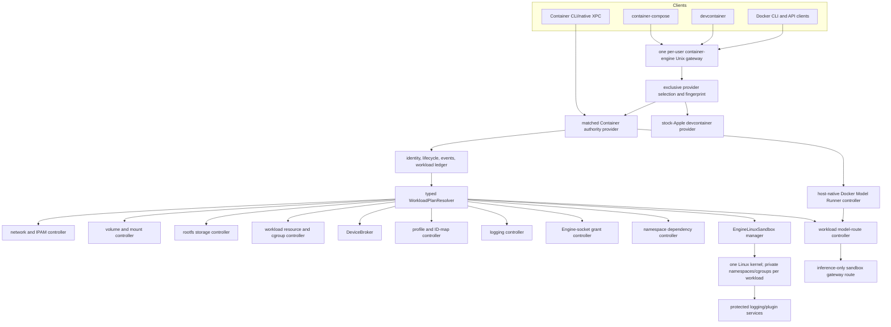
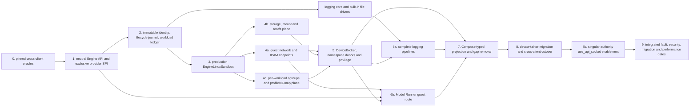

# Coherent Container-Family Parity Architecture

| Item | Value |
| --- | --- |
| Status | Integrated design complete; implementation underway. The current 0.14.0 stack ships the neutral Engine API/gateway, selected enhanced provider, versioned capabilities, durable logging/provider work, explicit dedicated/shared VM isolation, live memory targeting, adaptive reclamation, and several network/image/lifecycle subsets. Docker-compatible namespace joins, singular-authority devcontainer cutover, remaining resource planes, migration, security, and comparable-performance gates are incomplete. |
| Family | `container-engine-api`, `container-engine`, `container`, `containerization`, `container-compose`, `container-builder-shim`, `devcontainer`, and supporting matched-stack projects |
| Compatibility target | Docker Compose 5.4.0 with Docker Engine 29.2.1 API 1.53 on macOS. Retained 5.3.1 citations below identify original source or evidence checkpoints. |
| Stable 0.14.0 Container revision | `e4349d93442e19ca80c0a21356f41c6edacee392` |
| Stable 0.14.0 Containerization revision | `59ce8dafa11841f47287e3c29d1e8fe6d976236c` |
| Original devcontainer design evidence | `b31e80b2b9c09ecc73bb3badf9cd5cf16550a538` on `origin/main`; extraction head must be reselected from a clean reviewed revision |
| Socktainer comparison | 1.1.1 at `6cc7a32cc37d4ad0c07e9c88a7bbf2abdaceeea0`; conformance input only |
| Design date | 31 July 2026 |
| Last documentation review | 28 August 2026 against the 0.14.0 release and current programme STATUS |

## Outcome

The parity gaps cannot be closed as independent adapters. They share identity, lifecycle, storage, networking, namespaces, cgroups, devices, security profiles, logging, and one Docker API authority. The coherent implementation has four foundations:

1. **One runtime-neutral Engine gateway.** A per-user `container-engine` service, built from a shared `container-engine-api` package extracted from devcontainer, owns the Docker-compatible Unix listener, wire protocol, route ledger, connection safety, provider selection, and protocol projection.
2. **Exactly one selected runtime authority.** The gateway routes to one immutable provider fingerprint and one associated state root. Enhanced mode uses the matched Container authority; standalone devcontainer mode uses a stock-Apple adapter. There is no automatic fallback, federation, second listener, or simultaneous writer.
3. **One enhanced Linux engine sandbox.** Complete Docker namespace, volume, network, cgroup, device, security, logging-plugin, and privileged semantics run in one per-user Linux kernel with private workload namespaces and cgroups by default. Containerization's experimental `LinuxPod` is productionised into `EngineLinuxSandbox`; one VM per container is not the parity topology.
4. **One durable workload transaction model.** Container owns immutable identity, lifecycle state/events, and an operation ledger that composes durable policies and typed leases from specialised network, volume/mount, rootfs-storage, workload resource/cgroup, device, security-profile/ID-map, logging, socket, namespace, and model-route controllers. Containerization applies effective Linux plans and does not interpret Docker or Compose policy.

`devcontainer` is a first-class Container-family project even though it remains capable of running on stock Apple components. Its hardened Docker socket implementation becomes the shared gateway rather than a competing daemon. Socktainer is treated as an important Apple-container ecosystem interoperability and socket-relay reference, not as a second authority or a substitute for the API 1.53 parity target.

## Integrated Scope

This document is the dependency and authority design for:

- [advanced network and IPAM](advanced-network-ipam-design.md);
- [non-local volumes, advanced mounts, and API socket](non-local-volumes-advanced-mounts-api-socket-design.md);
- [Docker logging-driver semantics](docker-logging-driver-semantics-design.md);
- [remaining resource and security controls](remaining-resource-security-controls-design.md);
- [Docker lifecycle states and actions](docker-lifecycle-states-actions-design.md);
- [model-runner services](model-runner-services-design.md);
- [Local Deploy device/resource subset](local-deploy-device-resource-subset-design.md); and
- [shared namespaces and Docker-complete privileged isolation](shared-namespaces-privileged-isolation-design.md).

It resolves cross-document conflicts and orders implementation. Each focused design remains normative for its protocol/behavioural details; this document is normative where topology, authority, ownership, dependency, migration, or shared primitives cross those boundaries.

Implementation, review convergence, local-first validation, main checkpoints, MBP runner use, upstream surveillance, and parity/performance acceptance follow the [Container-family parity development cycle](container-family-development-cycle.md).

### Explicitly out of scope

- Product implementation in this change; this is design only.
- Running two providers against one socket/state root or merging their live state automatically.
- Routing requests silently to Docker Desktop, Colima, Socktainer, or another daemon when the selected provider is unavailable.
- Making devcontainer import ComposeCore or require the matched Container forks in its stock provider.
- Reimplementing Docker Model Runner, Docker logging plugins, network/volume provider protocols, or Linux kernel facilities in Compose.
- Claiming Swarm scheduling, Windows containers, or arbitrary macOS hardware where Docker Compose local mode or host APIs cannot provide it.

## Normative Invariants

These invariants apply to every focused design:

1. One user-visible Engine socket has one owning process, one selected provider fingerprint, and one state root.
2. One immutable container ID identifies the same resource through native Container, Compose, Docker HTTP/CLI, and devcontainer clients; name is separate and mutable.
3. The selected runtime provider is the only resource/lifecycle/event writer. The Engine gateway may persist protocol/provider selection and Docker-only compatibility data only through the provider's transaction contract.
4. Enhanced native workloads run in one `EngineLinuxSandbox`; they are not divided among feature-specific or per-container VMs.
5. Every workload has private PID/IPC/network/UTS/cgroup/mount namespaces, cgroup, rootfs, endpoint, and policy by default. Supported PID/IPC/network donor sharing is explicit and resolves to an immutable donor ID; supported host modes select the sandbox's corresponding namespace. Mount namespaces and rootfs remain per-workload under every namespace mode, while bind propagation remains a mount-plane policy. User-namespace mappings follow the selected Engine ID-map policy, with `userns=host` as the explicit exemption.
6. VM capacity is distinct from workload cgroup policy. A service CPU or memory limit never resizes the shared VM.
7. Requested, resolved/effective, ignored-with-warning, and observed state remain distinct.
8. Compose/YAML strings end at typed policies. Containerization receives only provider-resolved Linux primitives.
9. Network, volume/mount, rootfs-storage, device, profile, socket, logging, namespace, and model-route allocations are durable typed leases coordinated by one workload-ledger transaction, not uncoordinated side effects. This is one authority decision over frozen controller receipts, not a claim of one physical transaction across controller stores. Resource/cgroup intent is a durable requested/effective policy revision; only its live cgroup materialisation is process/sandbox-generation-bound.
10. Privileged and Engine-socket access are independent. Privilege never implies a socket grant; a socket grant is full Engine authority unless Docker itself says otherwise.
11. Host-native services, sandbox service workloads, and user containers have separate lifecycle/logging/health models.
12. A capability mismatch fails before unsafe side effects; no layer silently degrades to metadata-only success.
13. Behavioural parity and performance are proven separately against pinned references.

## Cross-Design Conflicts and Resolutions

| Conflict or hidden dependency | Resolution |
| --- | --- |
| Network design assumed per-workload VZ/vmnet attachment, while namespace sharing requires arbitrary same-kernel network donors. | vmnet becomes VM-level multiplexed backhaul. Guest networking creates dynamic per-workload network namespaces and veth/TAP endpoints; a joiner owns none and delegates to its donor. |
| Volume design made a shared Linux storage/workload authority conditional on a managed-directory oracle. | The `EngineLinuxSandbox` is foundational for enhanced parity regardless of fast-path results. Oracle-qualified managed-directory mounts may remain optimisations inside the same authority model. |
| Logging design proposed a Linux provider plane started only for journald/plugins. | Logging providers run as protected service workloads/namespaces in the same `EngineLinuxSandbox`; no second provider VM exists. Native file writers may remain a macOS-side fast path. |
| Existing API-socket design made Container itself the listener, which would make standalone devcontainer depend on Stephen's forks. | Split the neutral Engine listener/router from runtime ownership. `container-engine` loads exactly one stock or enhanced provider across a process/XPC boundary. |
| Devcontainer and the enhanced family pin stock and forked Apple packages with the same SwiftPM identities. | `container-engine-api` imports neither Apple package. Stock/enhanced adapters remain out of process and communicate through a versioned provider protocol. |
| Lifecycle, Compose, Engine, and devcontainer could each manufacture state/events. | The selected provider owns one immutable identity store, lifecycle controller, and canonical event journal. Clients filter/project it; they do not synthesise missing transitions. |
| Namespace donors rely on names and can be recreated. | Resolve names/service references to immutable IDs before create; Compose cascade-recreates dependants when donor recreation changes the ID. Leases are generation-bound. |
| Resource, Deploy, privilege, volumes, and models each need devices/accelerators. | One DeviceBroker owns guest device inventory, providers, CDI edits, and leases. Host Model Runner uses a distinct host-accelerator admission/lease rather than pretending Metal is a guest GPU. |
| `privileged` was treated as a stronger isolation mode. | It intentionally grants Docker-equivalent authority over the Engine Linux host/siblings. The outer security boundary is the macOS authority/VM. It still grants no Engine socket or macOS credential implicitly. |
| Local Deploy gap description called for CPU/PID/generic reservations and generic/device limits. | Match the schema and local projection exactly: CPU and generic-resource reservations are preserved/ignored; reservation PIDs and limit devices/generic resources are schema-invalid; CPU/memory/PID limits and memory reservation use ordinary controls; every reservation `DeviceRequest`, including non-GPU, uses DeviceBroker. The job-specific wait/restart gates are already verified removed; only the remaining false rejection work is in scope. |
| Security profiles could be read later from mutable host paths. | Compose resolves project-relative seccomp paths and snapshots compact inline content/digest before create. The profile controller owns validated immutable content. |
| Rootfs `storage_opt`, block devices, volume attachments, and device requests could allocate the same host artefact independently. | The workload ledger composes rootfs, volume, and DeviceBroker leases and rejects conflicts before materialisation. |
| Model runner could be represented as a provider service/container or supervised by the neutral gateway. | Use the pinned host-native Docker Model Runner under the enhanced Container authority's supervision and state root. `container-engine` only routes the selected-provider model SPI. Workloads see an inference-only stable guest route. |
| Socket relays could be treated as a safe project-limited pseudo-engine. | Match Docker: `/var/run/docker.sock` conveys broad/full Engine authority. Relay ownership is explicit, auditable, revocable, and independent of namespace/privilege. |
| The devcontainer evidence revision predates substantial local router/runtime work, while the sibling checkout is dirty. | Treat the old revision as original evidence only. Select a clean, reviewed, immutable extraction head before implementation; never extract from or rewrite the dirty checkout. |

## Target System Architecture



### Process and repository boundaries

| Component | Owns | Must not own |
| --- | --- | --- |
| `container-engine-api` | Docker wire DTOs/streams, versioned router metadata, Unix server primitives, neutral runtime/provider SPI, capability/fingerprint types, conformance tests. | Compose policy, devcontainer policy, Apple runtime packages, resources, provider state, credentials. |
| `container-engine` | One Unix listener, peer/path safety, protocol/version projection, route capability ledger, selected-provider session, connection/backpressure limits, socket discovery. | A second copy of provider resource truth, model supervision/store/credentials, or automatic fallback/federation. |
| enhanced Container authority | Canonical resources, immutable identity/name indexes, lifecycle/events, workload ledger/controllers, sandbox and host-service supervision. | Parsing Compose YAML, Docker wire handling, provider-specific code in Containerization. |
| stock devcontainer provider | Standalone adapter over exact upstream Apple tags plus any stock-lane compatibility state required by the neutral SPI. | Imports of Stephen's fork packages, shared enhanced state claims, private listener when `container-engine` already owns it. |
| `containerization` | Generic Linux VM/sandbox, namespace, cgroup, process, rootfs/mount, device, network and guest-agent primitives. | Docker/Compose semantics, provider registry, lifecycle events, stable resource identity. |
| `container-compose` | Compose model/selection/hash/reconciliation/progress/policy and typed requests. | Runtime resources, Docker Engine listener, inference, log transports, device or storage allocation. |
| `container-builder-shim` | Matched Container build/BuildKit adaptation and build-session integration through the shared Engine contract. | A second Engine listener, runtime inventory, or unversioned `/session` shortcut. |
| `devcontainer` | Dev Container specification/workflows and provider selection; packaging of stock provider where required. | A duplicate Docker router/socket/database after migration; ComposeCore dependency. |
| Docker Model Runner | Pinned upstream inference and model APIs/backend. | Container lifecycle/resource authority, Compose selection, guest management exposure. |

## Shared Engine Gateway and Devcontainer

### Extract, do not copy

Create a dedicated runtime-neutral package/repository, provisionally `stephenlclarke/container-engine-api`, by extracting reviewed devcontainer implementation with history. It provides:

- `ContainerEngineWire`: Engine version parsing, request/response/error types, JSON/JSONL, raw/multiplexed/hijacked streams, archive transfer, and field-preserving envelopes generated from the pinned Engine API;
- `ContainerEngineRouter`: versioned route matching/dispatch and a maintained per-route capability/compatibility ledger;
- `ContainerUnixHTTPServer`: hardened NIO Unix listener, bounded/spooled bodies, connection limits, backpressure, pipelining, half-close/upgrades, singleton lock, peer/owner checks, and inode-safe cleanup; and
- `ContainerEngineRuntimeSPI`: neutral async provider operations, streams, capabilities, identity fingerprint, and transactional mutation claims/protected-effect references.

The existing devcontainer router is valuable implementation and test evidence but is not assumed complete. Known gaps such as missing routes, registry-auth handling, and unknown-field loss are closed against the generated API 1.53 ledger. Existing tests move with extracted code and pass before either consumer changes.

The audited sibling checkout is dirty and contains substantial work beyond the original `origin/main` evidence revision. Implementation MUST first resolve that branch independently, choose a clean immutable accepted head, and document the extraction diff. This design does not modify or bless the dirty checkout.

### Exclusive provider selection

A provider fingerprint includes provider kind, implementation semantic version,
Apple/fork runtime build revisions, protocol capability set, state schema, and
the immutable state-root UUID created at initialisation. It explicitly excludes
process IDs, boot IDs, live sandbox identity, `sandboxGeneration`, guest-agent
session, and current capability/inventory observations; those are ephemeral
reconciliation tokens and a normal restart must not look like a provider
switch. Fingerprints and deterministic legacy-ID migration use the state-root
UUID rather than serialising a host path. `container-engine` persists the
selected fingerprint and refuses a genuinely different provider/state root for
the same socket while resources or an incomplete handoff exist.

The handoff control records are themselves versioned durable state:

```swift
public enum ProviderHandoffPartDispositionV1: String, Codable, Sendable {
    case included
    case empty
    case unsupported
    case retainOffline
    case explicitResolutionRequired
}

public enum ProviderHandoffPartKindV1: String, Codable, Sendable {
    case identityLifecycleEvents
    case imagesAndContent
    case networksAndIPAM
    case volumesAndMounts
    case rootfsConfigsAndSecrets
    case socketGrants
    case resourcesSecurityProfilesAndIDMaps
    case devices
    case namespaces
    case logging
    case modelsAndRoutes
    case buildsAndCache
}

public enum ProviderHandoffCanonicalEncodingV1: String, Codable, Sendable {
    case deterministicCBORV1
}

public enum ProviderHandoffDigestAlgorithmV1: String, Codable, Sendable {
    case sha256
    case lineageHMACSHA256V1
    case orderedLineageHMACSHA256AggregateV1
}

public enum ProviderHandoffPayloadProtectionV1: String, Codable, Sendable {
    case authenticatedPlaintext
    case destinationSealedX25519HKDFSHA256XChaCha20Poly1305V1
}

public enum ProviderHandoffContentDigestScopeV1: String, Codable, Sendable {
    case publicSHA256V1
    case singleSourceLineageHMACSHA256V1
    case multiSourceLineageHMACSHA256AggregateV1
}

public struct ProviderHandoffContentSourceDigestV1: Codable, Sendable {
    public var sourceStateRootUUID: String
    public var authorityLineageUUID: String
    public var lineageDigestKeyVersion: UInt64
    public var orderedEntryIDs: [String]
    public var sourceDigestHMACSHA256: String
}

public struct ProviderHandoffCanonicalContentDigestV1: Codable, Sendable {
    public var algorithm: ProviderHandoffDigestAlgorithmV1
    public var scope: ProviderHandoffContentDigestScopeV1
    public var orderedSourceDigests: [ProviderHandoffContentSourceDigestV1]
    public var digest: String
}

public struct ProviderHandoffPayloadPackageEntryV1: Codable, Sendable {
    public var entryID: String
    public var sourceStateRootUUID: String?
    public var recordKind: String
    public var schemaVersion: UInt32
    public var canonicalRecordBytes: Data
}

public struct ProviderHandoffPayloadPackageV1: Codable, Sendable {
    public var schemaVersion: UInt32
    public var partKind: ProviderHandoffPartKindV1
    public var entries: [ProviderHandoffPayloadPackageEntryV1]
}

public struct ProviderHandoffPayloadDescriptorV1: Codable, Sendable {
    public var bundleObjectID: String
    public var mediaType: String
    public var schemaVersion: UInt32
    public var canonicalEncoding: ProviderHandoffCanonicalEncodingV1
    public var canonicalPlaintextByteLength: UInt64
    public var transportByteLength: UInt64
    public var canonicalContentDigest: ProviderHandoffCanonicalContentDigestV1
    public var transportDigestSHA256: String
    public var protection: ProviderHandoffPayloadProtectionV1
    public var destinationEncryption: ProviderHandoffPayloadEncryptionV1?
}

public struct ProviderHandoffPartV1: Codable, Sendable {
    public var kind: ProviderHandoffPartKindV1
    public var schemaVersion: UInt32
    public var disposition: ProviderHandoffPartDispositionV1
    public var sourceStateRootUUIDs: [String]
    public var requiredCapabilities: [String]
    public var payload: ProviderHandoffPayloadDescriptorV1
}

public enum ProviderHandoffSignatureAlgorithmV1: String, Codable, Sendable {
    case ed25519V1
}

public enum ProviderHandoffPublicKeyAlgorithmV1: String, Codable, Sendable {
    case ed25519V1
    case x25519V1
}

public enum ProviderHandoffKeyRoleV1: String, Codable, Sendable {
    case gatewayCoordinator
    case sourceProvider
    case destinationProvider
}

public enum ProviderHandoffKeyPurposeV1: String, Codable, Sendable {
    case trustRegistrySigning
    case sourceManifestSigning
    case coordinatorManifestSigning
    case lineageKeyEnvelopeSigning
    case coordinatorCommitSigning
    case coordinatorTerminalOutcomeSigning
    case destinationPossessionSigning
    case destinationPayloadEncryption
    case destinationLineageKeyEncryption
}

public struct ProviderHandoffPublicKeyProvenanceV1: Codable, Sendable {
    public var enrollmentID: String
    public var owningBundleIdentifier: String
    public var codeRequirementDigestSHA256: String
    public var teamIdentifier: String?
    public var providerRegistrationDigestSHA256: String
    public var enrolledAtUnixSeconds: UInt64
    public var enrollmentProofSignature: Data?
}

public struct ProviderHandoffTrustKeyV1: Codable, Sendable {
    public var keyID: String
    public var algorithm: ProviderHandoffPublicKeyAlgorithmV1
    public var role: ProviderHandoffKeyRoleV1
    public var purpose: ProviderHandoffKeyPurposeV1
    public var providerFingerprint: String?
    public var stateRootUUID: String?
    public var rawPublicKey: Data
    public var provenance: ProviderHandoffPublicKeyProvenanceV1
    public var notBeforeUnixSeconds: UInt64
    public var notAfterUnixSeconds: UInt64
    public var rotationPredecessorKeyID: String?
    public var revokedAtUnixSeconds: UInt64?
    public var revocationReason: String?
}

public struct ProviderHandoffSignatureV1: Codable, Sendable {
    public var algorithm: ProviderHandoffSignatureAlgorithmV1
    public var purpose: ProviderHandoffKeyPurposeV1
    public var signerKeyID: String
    public var signerRole: ProviderHandoffKeyRoleV1
    public var providerFingerprint: String?
    public var stateRootUUID: String?
    public var trustRegistryRevision: UInt64
    public var canonicalBytesVersion: UInt32
    public var signedProjectionDigestSHA256: String
    public var signature: Data
}

public struct ProviderHandoffTrustRegistryV1: Codable, Sendable {
    public var schemaVersion: UInt32
    public var registryRevision: UInt64
    public var issuedAtUnixSeconds: UInt64
    public var keys: [ProviderHandoffTrustKeyV1]
    public var registryDigestSHA256: String
    public var registrySignature: ProviderHandoffSignatureV1
}

public enum ProviderHandoffEnvelopeAlgorithmV1: String, Codable, Sendable {
    case x25519HKDFSHA256XChaCha20Poly1305V1
}

public enum ProviderHandoffAEADObjectKindV1: String, Codable, Sendable {
    case partPayload
    case lineageKeyEnvelope
    case destinationPossessionChallenge
}

public struct ProviderHandoffAEADAssociatedDataV1: Codable, Sendable {
    public var schemaVersion: UInt32
    public var objectKind: ProviderHandoffAEADObjectKindV1
    public var tokenID: String
    public var manifestID: String
    public var objectLocalID: String
    public var partKind: ProviderHandoffPartKindV1?
    public var mediaType: String?
    public var payloadSchemaVersion: UInt32?
    public var canonicalPlaintextByteLength: UInt64
    public var canonicalContentDigest: ProviderHandoffCanonicalContentDigestV1?
    public var sourceStateRootUUID: String?
    public var authorityLineageUUID: String?
    public var lineageDigestKeyVersion: UInt64?
    public var destinationProviderFingerprint: String
    public var destinationStateRootUUID: String
    public var destinationKeyPurpose: ProviderHandoffKeyPurposeV1
    public var destinationKeyID: String
    public var ephemeralPublicKey: Data
    public var nonce: Data
}

public struct ProviderHandoffPayloadEncryptionV1: Codable, Sendable {
    public var encryptionAlgorithm: ProviderHandoffEnvelopeAlgorithmV1
    public var destinationKeyPurpose: ProviderHandoffKeyPurposeV1
    public var destinationKeyID: String
    public var ephemeralPublicKey: Data
    public var nonce: Data
    public var associatedDataDigestSHA256: String
}

public enum ProviderHandoffRootRoleV1: String, Codable, Sendable {
    case source
    case destination
}

public struct ProviderHandoffControllerRevisionV1: Codable, Sendable {
    public var controllerID: String
    public var revision: UInt64
    public var canonicalStateDigestSHA256: String
}

public struct ProviderHandoffRevisionVectorV1: Codable, Sendable {
    public var schemaVersion: UInt32
    public var stateRootUUID: String
    public var rootStoreRevision: UInt64
    public var snapshotCheckpointID: String?
    public var controllerRevisions: [ProviderHandoffControllerRevisionV1]
    public var revisionVectorDigestSHA256: String
}

public struct ProviderHandoffHeaderExpectationV1: Codable, Sendable {
    public var schemaVersion: UInt32
    public var role: ProviderHandoffRootRoleV1
    public var stateRootUUID: String
    public var expectedHeader: StateRootHeaderV1
    public var expectedHeaderDigestSHA256: String
    public var preCommitRevisionVector: ProviderHandoffRevisionVectorV1
    public var abortHeader: StateRootHeaderV1
    public var abortHeaderDigestSHA256: String
    public var abortRevisionVector: ProviderHandoffRevisionVectorV1
}

public struct ProviderHandoffSourceV1: Codable, Sendable {
    public var providerFingerprint: String
    public var stateRootUUID: String
    public var authorityLineageUUID: String
    public var lineageDigestKeyVersion: UInt64
    public var preCommitExpectation: ProviderHandoffHeaderExpectationV1
    public var sourceSignature: ProviderHandoffSignatureV1
}

public struct DestinationSealedLineageKeyEnvelopeV1: Codable, Sendable {
    public var envelopeID: String
    public var sourceStateRootUUID: String?
    public var authorityLineageUUID: String
    public var keyVersion: UInt64
    public var destinationKeyPurpose: ProviderHandoffKeyPurposeV1
    public var destinationKeyID: String
    public var encryptionAlgorithm: ProviderHandoffEnvelopeAlgorithmV1
    public var ephemeralPublicKey: Data
    public var nonce: Data
    public var canonicalPlaintextByteLength: UInt64
    public var associatedDataDigestSHA256: String
    public var ciphertext: Data
    public var envelopeSignature: ProviderHandoffSignatureV1
}

public struct ProviderHandoffDestinationKeyPossessionProofV1: Codable, Sendable {
    public var schemaVersion: UInt32
    public var proofID: String
    public var tokenID: String
    public var manifestID: String
    public var destinationProviderFingerprint: String
    public var destinationStateRootUUID: String
    public var destinationKeyPurpose: ProviderHandoffKeyPurposeV1
    public var destinationKeyID: String
    public var challengeEphemeralPublicKey: Data
    public var challengeNonce: Data
    public var challengeAssociatedDataDigestSHA256: String
    public var challengeCiphertext: Data
    public var responseDigestSHA256: String
    public var destinationSignature: ProviderHandoffSignatureV1
}

public struct ProviderHandoffManifestV1: Codable, Sendable {
    public var schemaVersion: UInt32
    public var manifestID: String
    public var tokenID: String
    public var trustRegistryRevision: UInt64
    public var destinationKeyPossessionProofDigestsSHA256: [String]
    public var sources: [ProviderHandoffSourceV1]
    public var resultingAuthorityLineageUUID: String
    public var resultingLineageDigestKeyVersion: UInt64
    public var destinationSealedLineageKeyEnvelopes: [DestinationSealedLineageKeyEnvelopeV1]
    public var destinationProviderFingerprint: String
    public var destinationStateRootUUID: String
    public var destinationPreCommitExpectation: ProviderHandoffHeaderExpectationV1
    public var parts: [ProviderHandoffPartV1]
    public var manifestDigestAlgorithm: ProviderHandoffDigestAlgorithmV1
    public var manifestDigest: String
    public var coordinatorSignature: ProviderHandoffSignatureV1
}

public enum ProviderHandoffPhaseV1: String, Codable, Sendable {
    case draining
    case quiesced
    case staged
    case aborting
    case committed
    case reconciling
    case complete
    case aborted
}

public struct ProviderHandoffProviderSelectionRecordV1: Codable, Sendable {
    public var schemaVersion: UInt32
    public var selectionRevision: UInt64
    public var selectedProviderFingerprint: String?
    public var selectedStateRootUUID: String?
    public var providerRegistrationDigestSHA256: String?
    public var trustRegistryRevision: UInt64
}

public struct ProviderHandoffProviderSelectionExpectationV1: Codable, Sendable {
    public var expectedRecord: ProviderHandoffProviderSelectionRecordV1
    public var expectedRecordDigestSHA256: String
    public var resultingRecord: ProviderHandoffProviderSelectionRecordV1
    public var resultingRecordDigestSHA256: String
}

public struct ProviderHandoffSocketDiscoveryRecordV1: Codable, Sendable {
    public var schemaVersion: UInt32
    public var discoveryRevision: UInt64
    public var socketInstanceUUID: String
    public var ownerUID: UInt32
    public var minimumEngineAPIVersion: String
    public var maximumEngineAPIVersion: String
    public var selectedProviderFingerprint: String?
    public var selectedStateRootUUID: String?
}

public struct ProviderHandoffSocketSelectionExpectationV1: Codable, Sendable {
    public var expectedRecord: ProviderHandoffSocketDiscoveryRecordV1
    public var expectedRecordDigestSHA256: String
    public var resultingRecord: ProviderHandoffSocketDiscoveryRecordV1
    public var resultingRecordDigestSHA256: String
}

public struct ProviderHandoffTokenV1: Codable, Sendable {
    public var schemaVersion: UInt32
    public var tokenID: String
    public var tokenRevision: UInt64
    public var orderedSourceStateRootUUIDs: [String]
    public var destinationProviderFingerprint: String
    public var destinationStateRootUUID: String
    public var trustRegistryRevision: UInt64
    public var resultingAuthorityLineageUUID: String
    public var resultingLineageDigestKeyVersion: UInt64
    public var phase: ProviderHandoffPhaseV1
    public var preCommitRootExpectations: [ProviderHandoffHeaderExpectationV1]
    public var destinationKeyPossessionProofDigestsSHA256: [String]
    public var manifestID: String
    public var manifestDigest: String?
    public var importedParts: [ProviderHandoffPartImportExpectationV1]?
    public var authoritativeCommitRevision: UInt64?
    public var commitDigestSHA256: String?
    public var handoffChainHeadDigestSHA256: String?
    public var rootPrepareRecordDigestsSHA256: [String]?
    public var terminalOutcomeDigestSHA256: String?
}

public enum ProviderHandoffPartStagingStateV1: String, Codable, Sendable {
    case declared
    case retrieving
    case transportVerified
    case decrypted
    case contentVerified
    case imported
    case compensationRequired
    case compensated
}

public enum ProviderHandoffPartStagingFailureClassV1: String, Codable, Sendable {
    case transport
    case authentication
    case canonicalContent
    case capability
    case collision
    case importEffect
    case compensation
}

public struct ProviderHandoffByteRangeV1: Codable, Sendable {
    public var lowerBound: UInt64
    public var upperBoundExclusive: UInt64
}

public struct ProviderHandoffSourceDigestVerificationV1: Codable, Sendable {
    public var sourceStateRootUUID: String
    public var authorityLineageUUID: String
    public var lineageDigestKeyVersion: UInt64
    public var computedSourceDigestHMACSHA256: String
}

public struct ProviderHandoffPartStagingRecordV1: Codable, Sendable {
    public var schemaVersion: UInt32
    public var tokenID: String
    public var manifestID: String
    public var manifestDigest: String
    public var partKind: ProviderHandoffPartKindV1
    public var bundleObjectID: String
    public var payloadDescriptorDigestSHA256: String
    public var stagingRevision: UInt64
    public var state: ProviderHandoffPartStagingStateV1
    public var receivedRanges: [ProviderHandoffByteRangeV1]
    public var verifiedTransportDigestSHA256: String?
    public var sourceDigestVerifications: [ProviderHandoffSourceDigestVerificationV1]
    public var verifiedCanonicalContentDigest: String?
    public var stagedImportReceiptDigestSHA256: String?
    public var lastFailureClass: ProviderHandoffPartStagingFailureClassV1?
}

public struct ProviderHandoffPartImportExpectationV1: Codable, Sendable {
    public var partKind: ProviderHandoffPartKindV1
    public var payloadDescriptorDigestSHA256: String
    public var stagedImportReceiptDigestSHA256: String
}

public struct ProviderHandoffRootPrepareRecordV1: Codable, Sendable {
    public var schemaVersion: UInt32
    public var tokenID: String
    public var manifestID: String
    public var role: ProviderHandoffRootRoleV1
    public var stateRootUUID: String
    public var commitDigestSHA256: String
    public var expectedHeaderDigestSHA256: String
    public var preCommitRevisionVectorDigestSHA256: String
    public var postCommitHeaderDigestSHA256: String
    public var postCommitRevisionVectorDigestSHA256: String
    public var prepareRevision: UInt64
}

public struct ProviderHandoffCommitIntentV1: Codable, Sendable {
    public var schemaVersion: UInt32
    public var tokenID: String
    public var manifestID: String
    public var manifestDigest: String
    public var trustRegistryRevision: UInt64
    public var authoritativeCommitRevision: UInt64
    public var preCommitRootExpectations: [ProviderHandoffHeaderExpectationV1]
    public var importedParts: [ProviderHandoffPartImportExpectationV1]
    public var destinationKeyPossessionProofDigestsSHA256: [String]
    public var providerSelection: ProviderHandoffProviderSelectionExpectationV1
    public var socketSelection: ProviderHandoffSocketSelectionExpectationV1
    public var resultingAuthorityLineageUUID: String
    public var resultingLineageDigestKeyVersion: UInt64
    public var resultingMinimumWriterSchemaVersion: UInt32
}

public struct ProviderHandoffPostCommitRootV1: Codable, Sendable {
    public var role: ProviderHandoffRootRoleV1
    public var stateRootUUID: String
    public var postCommitHeader: StateRootHeaderV1
    public var postCommitHeaderDigestSHA256: String
    public var postCommitRevisionVector: ProviderHandoffRevisionVectorV1
}

public struct ProviderHandoffCommitRecordV1: Codable, Sendable {
    public var schemaVersion: UInt32
    public var intent: ProviderHandoffCommitIntentV1
    public var commitDigestSHA256: String
    public var handoffChainHeadDigestSHA256: String
    public var postCommitRoots: [ProviderHandoffPostCommitRootV1]
    public var rootPrepareRecordDigestsSHA256: [String]
    public var coordinatorSignature: ProviderHandoffSignatureV1
}

public struct ProviderHandoffTerminalRootV1: Codable, Sendable {
    public var role: ProviderHandoffRootRoleV1
    public var stateRootUUID: String
    public var terminalHeader: StateRootHeaderV1
    public var terminalHeaderDigestSHA256: String
    public var terminalRevisionVector: ProviderHandoffRevisionVectorV1
}

public struct ProviderHandoffTerminalOutcomeV1: Codable, Sendable {
    public var schemaVersion: UInt32
    public var tokenID: String
    public var manifestID: String
    public var manifestDigest: String?
    public var phase: ProviderHandoffPhaseV1
    public var roots: [ProviderHandoffTerminalRootV1]
    public var outcomeDigestSHA256: String
    public var coordinatorSignature: ProviderHandoffSignatureV1
}
```

#### Canonical bundle and content digests

The manifest is the authenticated immutable index of one handoff bundle. Every
part kind occurs once and has exactly one `ProviderHandoffPayloadDescriptorV1`
and therefore one immutable payload object. `bundleObjectID` is
`sha256:<lowercase-hex transportDigestSHA256>` after the transport bytes exist;
it is never a caller path, URL, mutable upload ID, or an input to encryption.
Every payload object is a deterministic-CBOR
`ProviderHandoffPayloadPackageV1` containing an ordered index and any number of
bounded immutable entries. An entry is inline in that object and has no
`bundleObjectID`, transport digest, URL, or independently replaceable body.
Entry IDs are non-empty, unique within the part, and entries are ordered by the
manifest source order and then the encoded UTF-8 bytes of `entryID`; public
coordinator-only disposition entries follow all source entries. Every part,
including `empty`, `unsupported`, or `explicitResolutionRequired`, carries at
least one structured evidence entry. There is no zero-length implicit part.

Deterministic CBOR v1 is the sole signature/digest encoding: definite lengths,
shortest integer forms, text already validated as NFC UTF-8, map keys ordered
first by encoded length and then bytewise lexicographically, array order
preserved, and no floats, duplicate map keys, tags, indefinite values, or
implementation-object encoding. Encoding never silently normalises caller text;
non-NFC text is rejected by the owning schema before projection. Unless a rule
below says HMAC, a
domain digest is the raw 32 bytes of
`SHA-256(ASCII(domain) || 0x00 || deterministicCBOR(projection))` and is rendered
as lowercase hex only at the wire boundary. UUIDs use their lowercase canonical
text in CBOR; SHA/HMAC values inside a projection are 32-byte byte strings, not
their hex text.

The following projections are exact:

- `ProviderHandoffRevisionVectorV1` excludes only
  `revisionVectorDigestSHA256`. Controller IDs are unique and ordered by their
  encoded bytes. Its domain is `container-handoff-revision-vector-v1`. At the
  pre-commit boundary a source has a non-nil checkpoint and a complete entry for
  every controller; the data-pristine destination has a nil checkpoint and an
  empty controller array because imports are in the separate staging store.
  Post-commit/terminal vectors use the same schema with their complete current
  checkpoint/controller set. `rootStoreRevision` is always present and
  participates in compare-and-swap.
- `StateRootHeaderV1` has no embedded digest. Its complete deterministic-CBOR
  value, including the prior chain head and writer epoch, uses domain
  `container-state-root-header-v1`. A
  `ProviderHandoffHeaderExpectationV1` is valid only when the expected and abort
  headers, root UUID, both revision-vector root UUIDs, role, and all recomputed
  digests agree. Its expected header is the already-fenced
  `sourceQuiesced`/`destinationStaged` value. Its abort header is the exact
  alternative that clears the token/staged lineage, restores the source's
  recorded pre-drain writable state or the destination's prior `none` state,
  retains the prior chain/provider/lineage fields appropriate to that role, and
  increments `writerEpoch` once. The abort revision vector increments only
  `rootStoreRevision` once and retains the checkpoint and every ordered
  controller revision/digest from the pre-commit vector.
- Complete `ProviderHandoffProviderSelectionRecordV1` and
  `ProviderHandoffSocketDiscoveryRecordV1` values use domains
  `container-handoff-provider-selection-v1` and
  `container-handoff-socket-discovery-v1`. Each expectation embeds both records
  and their recomputed digests; a digest-only or partially reconstructed
  selection is invalid.
- The unsigned manifest excludes only `manifestDigest` and
  `coordinatorSignature`; its domain is `container-handoff-manifest-v1` and its
  algorithm is always `.sha256`. It includes complete source signatures,
  complete signed key envelopes, destination proof digests, and every final
  payload descriptor. Its destination expectation must have role `.destination`
  and match the token and later commit intent byte-for-byte. A source-signature
  projection contains the common
  manifest/token/trust/destination/resulting-lineage fields, exactly that
  `ProviderHandoffSourceV1` with `sourceSignature` omitted, its signed lineage-key
  envelopes, and each contributed part descriptor plus that source's digest
  entry when the part is sealed (the complete public descriptor otherwise); it
  contains no source-signature value from any source. Its domain is
  `container-handoff-source-manifest-v1`. The coordinator signs the resulting
  manifest digest and destination/root/token binding under
  `.coordinatorManifestSigning`.

Canonical content verification is independent of a source's assertion:

- An authenticated-public payload has algorithm `.sha256`, scope
  `.publicSHA256V1`, an empty `orderedSourceDigests`, and digest
  `SHA-256("container-handoff-public-content-v1" || 0x00 ||
  deterministicCBOR(complete ProviderHandoffPayloadPackageV1))`.
- Every entry in a sealed payload has a non-nil source root and belongs to
  exactly one source partition. A source partition contains that source's
  entries in package order and uses
  `HMAC-SHA-256(lineageKey, ASCII("container-handoff-source-content-v1") ||
  0x00 || deterministicCBOR(sourceProjection))`. `sourceProjection` is a closed
  map with exactly the named fields `tokenID`, `manifestID`,
  `packageSchemaVersion`, `partKind`, `sourceStateRootUUID`,
  `authorityLineageUUID`, `lineageDigestKeyVersion`, and
  `orderedCompleteEntries`; the last field contains the complete entry maps in
  package order, not just IDs or record-byte digests.
  The descriptor records the source/root/key-version tuple, ordered entry IDs,
  and resulting HMAC. No entry may occur in two partitions, and every sealed
  package entry must occur in one.
- A one-partition payload has algorithm `.lineageHMACSHA256V1`, scope
  `.singleSourceLineageHMACSHA256V1`, exactly that one complete value in
  `orderedSourceDigests`, and a top-level digest equal to that partition's raw
  HMAC. A payload with two or more partitions has algorithm
  `.orderedLineageHMACSHA256AggregateV1` and scope
  `.multiSourceLineageHMACSHA256AggregateV1`; `orderedSourceDigests` has exactly
  two or more unique partitions in manifest source order and its digest is
  `SHA-256("container-handoff-multi-source-content-v1" || 0x00 ||
  deterministicCBOR(array of ordered complete
  ProviderHandoffContentSourceDigestV1 values))`.

Protection and content scope are paired: `.authenticatedPlaintext` is valid only
with `.sha256`/`.publicSHA256V1`, while
`.destinationSealedX25519HKDFSHA256XChaCha20Poly1305V1` is valid only with one of
the lineage-HMAC algorithm/scope pairs above. For authenticated plaintext,
`destinationEncryption` is nil and the transport bytes are exactly the canonical
package bytes. For a destination-sealed descriptor, `destinationEncryption` is
non-nil, its purpose is exactly
`.destinationPayloadEncryption`, and the transport bytes are exactly the AEAD
ciphertext followed by its tag. In both cases `canonicalPlaintextByteLength` is
the canonical package-byte count, while `transportByteLength` and
`transportDigestSHA256` cover only the resulting transport bytes. Compression,
padding, an outer archive, or another transport transform is not permitted in
v1. The package `schemaVersion` and `partKind` must equal the descriptor and
manifest part before any entry is accepted.

A package containing any sensitive record is sealed as one object; all of its
records, including associated metadata, are source-partitioned. Public and
lineage-HMAC scopes cannot be mixed in one descriptor. The destination verifies
each signed lineage-key envelope, opens it only in its protected staging store,
recomputes every source HMAC from the decrypted canonical package, checks the
ordered aggregate, and then wipes or rewraps the raw key. A missing envelope,
wrong source/key version, duplicate/unassigned entry, or digest mismatch fails
before import or commit. This makes multi-secret and multi-source content
verifiable without publishing a plaintext SHA-256 fingerprint.

For every part, `sourceStateRootUUIDs` is the unique manifest-source-ordered set
of roots named by its package entries. For a sealed part it must also equal the
roots in `orderedSourceDigests`; a source with no entry is absent from both. The
array is provenance, not permission to omit or merge a partition.

While the token is held, the authenticated bundle service retrieves an object
only by `(tokenID, manifestID, bundleObjectID)`, enforces
`transportByteLength` before allocation, streams it resumably into a private
staging store, verifies the transport digest before decrypt/decode, and verifies
the canonical content rules above after decode. Objects remain available
through reconciliation or abort and are collected only after terminal-retention
rules permit it.

#### Trust registry and envelope cryptography

The current-user gateway owns a Keychain-backed, signed
`ProviderHandoffTrustRegistryV1`. Its bootstrap registry-signing Ed25519 public
key is installed with the gateway and pinned by key ID and code requirement;
the registry cannot authorise its own replacement. Each registry key has one
algorithm, role, purpose, provider/root binding, validity interval, rotation
predecessor, revocation state, and registry-signed provenance. Provider keys
require both `providerFingerprint` and `stateRootUUID`; gateway-coordinator keys
require both nil. A fingerprint alone is never a verification or encryption
key.

Trust keys are unique and ordered by encoded `keyID`. The unsigned registry
projection excludes `registryDigestSHA256` and `registrySignature`; its domain is
`container-handoff-trust-registry-v1`. The bootstrap key signs that digest using
purpose `.trustRegistrySigning` and the generic signature projection below. A
duplicate key ID, a recomputed key ID mismatch, an overlap that gives two active
keys the same role/purpose/provider/root without an explicit predecessor chain,
or a registry revision that is not exactly the previous revision plus one is
invalid.

`keyID` is the lowercase hex domain digest
`container-handoff-trust-key-id-v1` over algorithm, role, purpose,
provider/root binding, and the raw public key. Ed25519 public keys and signatures
are exactly 32 and 64 bytes. An Ed25519 enrollment proof is a self-signature over
the key-ID projection plus the provenance record with
`enrollmentProofSignature` omitted under domain
`container-handoff-ed25519-enrollment-v1`; it is present and exactly 64 bytes for
every non-bootstrap Ed25519 key. It is nil for the separately pinned bootstrap
key and every X25519 key. Registry acceptance attests an X25519 key's provenance
but never proves possession; the token-scoped challenge below is mandatory
before either X25519 purpose is used. The registry signature then attests the
accepted provenance. Every operational signature names one purpose and its
registry revision. Its `signedProjectionDigestSHA256` is the appropriate domain
digest above. The Ed25519 message bytes are exactly
`ASCII("container-handoff-signature-v1") || 0x00 || deterministicCBOR(signatureProjection)`,
where `signatureProjection` is the closed map of `purpose`, `signerRole`,
`algorithm`, `signerKeyID`, `providerFingerprint`, `stateRootUUID`,
`trustRegistryRevision`, `canonicalBytesVersion`, and the raw 32-byte
`signedProjectionDigestSHA256`. This is ordinary Ed25519, not Ed25519ph, and no
extra hash, JSON encoding or signature field is admitted. Algorithm, purpose,
role, provider/root, key ID, raw key, and projection must all match the same
trust entry.

| Purpose | Required algorithm, role, and binding |
| --- | --- |
| `.trustRegistrySigning` | Ed25519 bootstrap `gatewayCoordinator`; provider/root nil. |
| `.coordinatorManifestSigning`, `.coordinatorCommitSigning`, `.coordinatorTerminalOutcomeSigning` | Ed25519 `gatewayCoordinator`; provider/root nil. |
| `.sourceManifestSigning` | Ed25519 `sourceProvider`; exact source provider fingerprint and root. |
| `.lineageKeyEnvelopeSigning` | Ed25519 `sourceProvider` bound to the transferred source, or `gatewayCoordinator` with nil bindings only for a newly created resulting-lineage key. |
| `.destinationPossessionSigning` | Ed25519 `destinationProvider`; exact destination provider fingerprint and root. |
| `.destinationPayloadEncryption`, `.destinationLineageKeyEncryption` | X25519 `destinationProvider`; exact destination provider fingerprint and root. |

A key authorises new work only when the token issue/use time is inside its
inclusive validity interval and no signed revocation effective at or before the
use exists. Rotation adds a separately proven key with a new ID and optional
predecessor; new tokens use the newest valid key, while an already-bound token
may finish with its still-valid, unrevoked key. Revocation fences every
pre-commit token at its next phase transition. The destination retains each old
X25519 private key in its protected Keychain until every token bound to that key
is complete or aborted and every associated staged payload, opened lineage key,
and envelope has been wiped; deleting only the public registry entry or rotating
early must not strand recovery. Archived signed registry revisions and old
public keys remain read-only for terminal-record verification through the
retention window, but cannot authorise replay or new work.

A pre-commit token fenced by expiry or revocation may perform only signed abort,
receipt-driven compensation, protected-store wipe, and terminal evidence
retention. Cleanup operates from staging receipts and object ownership and never
marks an unopened envelope decrypted/content-verified or invents a successful
HMAC. A revocation observed after the signed commit decision cannot restore a
source or erase that decision; recovery consumes the already verified imports
and receipts, and fences for explicit intervention if those committed inputs are
unrecoverable rather than using the revoked key to authorise new decryption.

X25519 static and ephemeral public keys are raw 32-byte little-endian
u-coordinates. Decoding requires the high bit clear, the integer strictly less
than `2^255 - 19`, and a value other than zero or one. The implementation also
rejects any input whose constant-time X25519 operation produces the all-zero
32-byte shared secret; this rejects the remaining low-order inputs. Private keys
are CSPRNG-generated and clamped by the X25519 implementation. Each payload,
key envelope, and possession challenge uses a fresh ephemeral key and a fresh
24-byte XChaCha20 nonce; an ephemeral-public-key/nonce pair may never repeat for
one destination key.

For every sealed object, compute the one
`ProviderHandoffAEADAssociatedDataV1` projection first. Fields not applicable to
its tagged `objectKind` are nil; applicable fields must be present. It includes
the ephemeral public key and nonce but deliberately excludes
`associatedDataDigestSHA256`, ciphertext/tag, transport length/digest,
`bundleObjectID`, manifest digest/signatures, commit digest, chain head, and all
post-commit headers. Its raw associated-data digest is the domain digest
`container-handoff-aead-associated-data-v1`, and those 32 digest bytes are the
only XChaCha20-Poly1305 additional authenticated data.

`objectLocalID` is fixed before encryption: it is `part:<partKind-raw-value>` for
a part payload, the already-random `envelopeID` for a lineage-key envelope, and
the already-random `proofID` for a possession challenge. It is unique within
that token/manifest/object kind. The later content-addressed `bundleObjectID`,
transport digest, or any value derived from ciphertext is prohibited in
`objectLocalID`, the associated-data projection, HKDF salt, or HKDF info.

Associated-data applicability is closed, not implementation-selected:

| Object kind | Required object fields | Required content fields | Fields that must be nil |
| --- | --- | --- | --- |
| `.partPayload` | `objectLocalID = part:<kind>`, descriptor part kind, media type, schema version and plaintext byte length. | Complete canonical content digest. | Source root, lineage UUID and lineage key version. |
| `.lineageKeyEnvelope` | `objectLocalID = envelopeID`, fixed media type `application/vnd.io.github.stephenlclarke.container.handoff-lineage-key.v1+cbor`, payload schema version 1 and the envelope's plaintext byte length. | Envelope source root (nil only for a newly created resulting lineage), lineage UUID and key version. | Part kind and canonical content digest. |
| `.destinationPossessionChallenge` | `objectLocalID = proofID` and plaintext byte length 32. | No optional content field. | Part kind, media type, payload schema version, canonical content digest, source root, lineage UUID and lineage key version. |

Every row also requires schema version 1, token/manifest IDs, destination
provider/root, destination key purpose/ID, ephemeral public key, and nonce. The
duplicated metadata in a payload descriptor, key envelope, or proof record must
be byte-equal to the associated-data projection. Payload and lineage-envelope
purposes are respectively `.destinationPayloadEncryption` and
`.destinationLineageKeyEncryption`; a challenge uses the exact purpose it is
proving. A nil, extra, or mismatched field is an authentication failure rather
than a default.

Given the non-zero 32-byte X25519 shared secret, derive exactly 32 AEAD-key bytes
with RFC 5869 HKDF-SHA-256, using the raw shared secret as IKM. The salt is the
raw 32-byte domain digest `container-handoff-hkdf-salt-v1` over a closed map with
exactly the named fields `tokenID`, `manifestID`, `objectKind`, `objectLocalID`,
`destinationProviderFingerprint`, `destinationStateRootUUID`,
`destinationKeyPurpose`, and `destinationKeyID`, copied byte-for-byte from the
associated-data projection. The `info` byte string is
`ASCII("container-handoff-x25519-xchacha20poly1305-key-v1") || 0x00 ||
associatedDataDigestBytes`; HKDF output length is 32 with no secondary split or
expansion. AEAD is the XChaCha20-Poly1305-IETF construction: HChaCha20 consumes
nonce bytes 0 through 15, and ChaCha20-Poly1305-IETF consumes
`0x00000000 || nonce[16...23]`. Its AAD is exactly the raw 32-byte associated-data
digest and its plaintext is the exact unpadded, uncompressed bytes declared for
the object. Encryption emits ciphertext followed by the 16-byte Poly1305 tag;
that combined value is the payload object's transport bytes or the
envelope/challenge `ciphertext` field. Transport digest and content-addressed
object ID are computed only afterwards, so neither encryption nor the manifest
contains a digest cycle.

Payloads use a trust key whose sole purpose is
`.destinationPayloadEncryption`; lineage-key envelopes use
`.destinationLineageKeyEncryption`. An envelope plaintext is the
deterministic-CBOR closed map with exactly `schemaVersion = 1`,
`sourceStateRootUUID`, `authorityLineageUUID`, `keyVersion`, and one
`rawLineageHMACSHA256Key` 32-byte byte string. Its source may be nil only for a
newly created resulting-lineage key; all other plaintext bindings must equal the
outer envelope and associated data before the key is admitted. The envelope is
covered, including ciphertext, plaintext byte length and AEAD metadata, by a
valid `.lineageKeyEnvelopeSigning` signature over domain
`container-handoff-lineage-key-envelope-v1` with only `envelopeSignature`
omitted, and is verified before opening. A newly created resulting-lineage
envelope is signed by the coordinator; a transferred key is signed by its source
provider. The envelope's signer role/provider/root must match that choice.

Before any payload or lineage-key envelope is encrypted to a destination X25519
key, the gateway performs a token/manifest-scoped proof of possession for each
selected encryption purpose.
It encrypts a random 32-byte challenge through the same AEAD/KDF contract with
object kind `.destinationPossessionChallenge`. The destination decrypts it and
returns the domain digest `container-handoff-destination-key-proof-v1` over a
closed map containing every persisted proof field from `schemaVersion` through
`challengeCiphertext`, plus `challengePlaintext` as the exact decrypted 32-byte
byte string; `responseDigestSHA256` and `destinationSignature` are excluded. The
completed proof-record digest uses domain
`container-handoff-destination-key-proof-record-v1` over all persisted fields
except `destinationSignature`, including that response digest. The destination's
separately authorised `.destinationPossessionSigning` Ed25519 key signs the
proof-record digest. The gateway compares the response in constant time,
discards the plaintext challenge, and binds the completed proof-record digest
into the token, manifest, and commit intent. Proof digests are unique and ordered
by encryption-purpose raw value and then encoded destination key ID, with exactly
one for each key/purpose used by any payload or envelope. A signature alone,
provider claim, or successful X25519 public-key parse is not proof of private-key
possession.

#### Immutable manifest and mutable staging

The signed manifest bytes never change after the token first binds its digest.
Retrieval and import progress lives only in one token/manifest/part-scoped
`ProviderHandoffPartStagingRecordV1`. Its immutable identity fields must match
the signed descriptor; only `stagingRevision`, state, normalised non-overlapping
received ranges, verification results, opaque import-receipt digest, and bounded
failure class may change. Every update compare-and-swaps `stagingRevision`.
Progress loss replays retrieval from the immutable object; progress from another
token, manifest digest, part, or descriptor is never adopted.

The staging store and any controller-private tentative effects are a distinct
token-owned namespace outside public indexes and the authoritative root/controller
revision vectors. A staged import can change only its staging record and protected
receipt; it cannot advance `rootStoreRevision`, a controller revision, or a
canonical-state digest. Promotion after the signed decision performs ordinary
controller transactions and advances those revisions during reconciliation.
Abort compensation removes the tentative effects and proves their absence before
the unchanged pre-commit vector can take its one header-only abort transition.

The state order is declared, retrieving, transport verified, decrypted, content
verified, and imported. A public payload skips `decrypted`; a sealed payload
cannot. An import with externally staged effects records one opaque,
controller-verifiable receipt before `imported`. Abort moves an effected record
through `compensationRequired -> compensated`; failure remains fenced and
resumable. No progress field, receipt, collision decision, or extracted entry can
rewrite a payload descriptor, manifest digest, package entry, or source
signature. Commit requires exactly one `imported` record for every required part
and no unresolved or compensation-required record. Once that condition holds,
one token CAS records the manifest-ordered descriptor/receipt expectation array
and advances `quiesced -> staged`. That CAS freezes the imported records: they
may thereafter be read for prepare/commit or, after a proved absent decision,
and a successful token CAS to `aborting`, moved through compensation, but not
otherwise revised or replaced. The destination root's
prepare operation re-verifies every frozen descriptor/receipt expectation
against the commit intent. Any drift rejects prepare rather than modifying the
manifest or pretending the gateway can atomically CAS a controller store.

Token IDs and manifest IDs are cryptographically random and single-use. The
token freezes a non-empty unique ordered source-root array, one distinct
destination provider/root, trust-registry revision, resulting lineage/key
version, and manifest ID before drain. The gateway later binds one manifest
digest and destination-proof set before bundle reads and rejects the same token
with any other value. Root expectations use exactly the frozen source order
followed by that destination. Every token mutation compare-and-swaps and increments
`tokenRevision` once. A committed, aborted, or expired token cannot authorise
another handoff; recovery may resume only its already-bound manifest and phase.
Abort first compare-and-swaps any pre-decision `draining`, `quiesced`, or
`staged` token to `aborting`; the commit decision accepts only `staged`, so a
prepare-release/abort and a commit cannot both win. Signed envelopes may be
opened for verification during protected staging after these bindings and all
pre-commit expectations/signatures pass; opening an envelope does not transfer
authority, and abort wipes or compensates its staged key.

Token transitions are closed:
`draining -> quiesced -> staged -> committed -> reconciling -> complete`, or
`draining|quiesced|staged -> aborting -> aborted`. `aborting`, `committed`,
`reconciling`, `complete`, and `aborted` reject every transition not shown;
especially, no state at or after `committed` can abort and no `aborting` token can
prepare or commit.

#### Non-cyclic commit, compare-and-swap, and recovery

`ProviderHandoffCommitIntentV1` is frozen only after every part is imported. Its
root expectations are unique and ordered as manifest sources followed by the
destination. It contains the assigned monotonically increasing gateway commit
revision, complete pre-commit headers and revision vectors, manifest/trust/key
proof bindings, the manifest-ordered imported-part descriptor/receipt
expectations, exact before/after provider-selection record, exact before/after
socket-discovery record, resulting lineage/key version, and writer floor. The
provider and socket result revisions must each be exactly their expected revision
plus one. Provider selection changes only its selected registration/root/trust
binding. Socket discovery retains its socket instance, owner, and API range and
changes only revision plus selected provider/root. Both resulting records select
the manifest destination fingerprint/root and its manifest-bound trust revision,
after the gateway has checked the latest registry for intervening revocation.

The commit sequence is deliberately one-way:

1. Compute `commitDigestSHA256` as the domain digest
   `container-handoff-commit-intent-v1` over the complete commit intent. It
   contains only pre-commit headers and has no chain head or post-commit header.
2. Compute `handoffChainHeadDigestSHA256` as the domain digest
   `container-handoff-chain-head-v1` over the commit digest and the ordered
   `(stateRootUUID, prior handoffChainHeadDigest)` values copied from the
   pre-commit headers.
3. Deterministically derive each post-commit header with that chain head. Sources
   become `sourceTransferred`, clear the active token, increment `writerEpoch`,
   and retain their provider/lineage. The destination adopts the resulting
   lineage/key version and provider, clears staged lineage, becomes
   `destinationReconciling`, retains the active token, raises the writer floor,
   and increments its epoch. Compute each post-header digest with
   `container-state-root-header-v1`.
   Derive its post-commit revision vector by incrementing only
   `rootStoreRevision` once and retaining the checkpoint and every ordered
   controller revision/digest from the pre-commit vector.
4. Through the authenticated provider session, ask each root to atomically check
   its exact pre-commit header/revision vector and token-fenced handoff lock, then
   persist one immutable `ProviderHandoffRootPrepareRecordV1` in that lock's
   separate metadata store. Its closed complete projection uses domain
   `container-handoff-root-prepare-v1`, binds the commit digest and exact
   pre/post header/vector digests, and increments that lock's `prepareRevision`;
   it does not change either authoritative revision vector. Roots are prepared
   in manifest source order followed by the destination; after each response the
   gateway verifies or recovers that exact immutable record and CAS-appends its
   digest to the token's ordered prepare array. A partial array is resumable but
   cannot commit.
5. Assemble `ProviderHandoffCommitRecordV1` with the complete post-root values and
   ordered prepare-record digests. Sign its projection excluding only
   `coordinatorSignature`, under purpose `.coordinatorCommitSigning` and domain
   `container-handoff-commit-record-v1`.

Thus the commit digest determines the chain head, which determines post-commit
headers/vectors and prepare records, which determine the signed commit record;
no digest depends back on a post-header, prepare record, chain head, signature,
or ciphertext that depends on it.

The coordinator decision transaction compare-and-swaps the token from `staged`,
its manifest binding, next commit revision, current trust/proof set, exact
provider/socket selection expectations, every imported staging descriptor/
receipt expectation frozen in that token, and the ordered set of still-current
immutable root-prepare record digests. A prepare lock rejects abort, another
prepare, authoritative
controller mutation, or header change until the gateway first CASes the token
from its pre-decision phase to `aborting` and explicitly releases it. Therefore
the gateway does
not pretend to execute a cross-store compare-and-swap: each root performs its
own local exact CAS before the one gateway decision. If any gateway value or
root prepare differs, it writes no commit record or selection result and leaves
sources authoritative and quiesced for resume or the mutually exclusive
`aborting` prepare-release path. If
they all match, it atomically persists the signed commit record, resulting
provider/socket selections, and token phase `committed` in the gateway authority
store. This signed record is the authority decision even when separate physical
root-header writes have not all completed.

After the decision, each prepared root uses an idempotent two-value CAS: the
exact pre-commit header/vector plus matching prepare record writes the exact
derived post-header/vector; the exact post pair plus matching applied prepare
record succeeds without another epoch or revision increment; any third value
fences the root and requires explicit recovery. Applying or releasing a prepare
updates only the separate handoff-lock metadata. A crash with no valid commit
record can only resume staging/prepare or release every prepare and abort to the
signed post-abort pairs. A crash with a valid commit record can never release a
prepare, abort, or restore a source writer: recovery verifies the
signature/digests, repairs all missing post pairs and selections, then continues
destination reconciliation. A record whose intent, chain, prepare, post pair,
selection, or physical root cannot be verified keeps every writer fenced;
process presence and staged files are never authority evidence.

Once every prepared post pair and both selection records match the signed
decision, the gateway CASes `committed -> reconciling`; only that phase may
promote the frozen destination imports through controller transactions. Complete
requires every promoted controller revision/receipt and source tombstone to be
reconciled, then atomically records the signed Complete outcome and token phase
`complete`. No reconciliation failure reopens the commit choice.

Abort and Complete each produce one canonical terminal-outcome projection. Its
unsigned deterministic-CBOR form excludes the digest/signature; its SHA-256 and
coordinator signature use the terminal domain separator
`container-handoff-outcome-v1` and purpose
`.coordinatorTerminalOutcomeSigning`. The gateway terminal transaction binds
that outcome digest to the token. Each terminal root embeds its complete header,
header digest and revision vector; recovery compare-and-swaps or verifies that
exact pair. Once pre-commit expectations exist, an aborted outcome uses their
frozen `abortHeader`/`abortRevisionVector`, already source/coordinator-signed when
a manifest exists, never the pre-handoff expected values. The terminal outcome
always signs the resulting pairs. An earlier draining abort uses each root's
token-bound local handoff journal to CAS its exact current pair back to the
recorded prior authority state; an unrecorded or mismatched journal remains
fenced. A Complete outcome records the
actual post-reconciliation source pairs and the
destination's single header transition from `destinationReconciling` to
`destinationActive`; that transition clears the token, increments writer epoch
and root-store revision once, and leaves controller revisions at their already
reconciled values. `phase` in a terminal outcome is valid only as `aborted` or
`complete`, root UUIDs are unique and in manifest source order followed by the
destination (or the token's frozen source order when an early abort has no
manifest), and a missing/mismatched root keeps recovery fenced.

The manifest has a closed required part inventory. Every focused kind appears
exactly once, including when it is empty, unsupported, retained only as offline
evidence, or requires explicit resolution. A required unsupported/unresolved
part prevents commit. Part payload descriptors cover their canonical bytes,
transport representation, disposition and contributing roots; the manifest
digest covers the ordered source set, destination, lineage, key envelopes and
all parts. Every source signature binds its typed pre-commit
header/revision-vector expectation, lineage, signed key envelopes, and
contributed source partitions; the coordinator signature binds the complete
manifest. Recovery follows only the signed commit/terminal records and exact
compare-and-swap rules above, never which processes or staged files exist.

Part ownership is exact even when one focused controller document contributes
to several parts:

| Part | Sole canonical owner |
| --- | --- |
| `identityLifecycleEvents` | Immutable container/name/alias records, lifecycle/restart state, canonical event/audit disposition, the generic operation ledger, every generic idempotency/retry/outcome/tombstone record, and pending/completed lifecycle finalisers. |
| `imagesAndContent` | OCI image/index/manifest/config/layer descriptors, platform/tag references, content-store ownership and verified export/re-pull disposition; never Model Runner content or build-cache records. |
| `networksAndIPAM` | Network/IPAM resources, complete effective allocator state, endpoints/DNS/port intent and provider provenance; never live namespace/forwarding handles. |
| `volumesAndMounts` | Named-volume resources/provider provenance, population state, mount intent and durable attachment leases; no rootfs backing or generated artefact content. |
| `rootfsConfigsAndSecrets` | Rootfs-storage leases/backing/content export or re-materialisation disposition, config/secret/generated-artifact metadata, sealed content and protected digests. |
| `socketGrants` | Inbound/Engine socket grant intent, revocation/audit state and references to artifact IDs; it never duplicates artifact metadata or bytes. |
| `resourcesSecurityProfilesAndIDMaps` | Requested/effective cgroup policy, security-profile records/digests and engine ID-map policy/ranges; it never owns rootfs storage. |
| `devices` | Portable requested direct/device/CDI/privileged intent and trusted provenance only; no selected hardware, provider receipt or live handle. |
| `namespaces` | Requested namespace/donor policy, durable dependency identities, and terminal domain-scoped released-dependency/activation tombstone projections needed to prove finalisation; no live namespace activation, process/sandbox handle, or generic operation/idempotency/retry/outcome/tombstone record. |
| `logging` | Requested logging policy, portable destination-re-resolvable configuration, protected-option/history disposition, and terminal logging-pipeline/delivery evidence required to prove quiescence; no generic operation/idempotency/retry/outcome/tombstone/finaliser or writer/reader session. |
| `modelsAndRoutes` | Model settings/content/configuration disposition, portable bindings/environment and protected runtime flags; no runner/transfer/route activation or source provider lease. |
| `buildsAndCache` | Durable build records/provenance plus content-addressed BuildKit/cache descriptors and verified export/import/rebuild disposition; no active builder/session, secret, credential, mutable helper handle or image record duplicated from `imagesAndContent`. |

Every other kind owns only the domain named by its enum case. A focused export
aggregator must emit its controller records into these canonical parts; it may
not create a second “policy/security/rootfs” or “volume/socket/artifact” part.
Cross-part references use immutable IDs and are validated after all parts stage,
not by duplicating the referenced record.

Generic mutation retry state exists only in `identityLifecycleEvents`, even when
its operation invokes logging, networking, storage, model, socket, or another
controller. A domain part may carry its requested/effective configuration,
durable leases, provider receipts, and terminal domain evidence needed to prove
quiescence or reconstruct a result, but it references the generic operation ID
and never copies its idempotency key, cached outcome, retry state, tombstone, or
finaliser. Import rejects any generic operation record found in another part.

Image/content import verifies OCI media type, size and digest before promotion;
tag-to-digest collisions require explicit resolution and an unavailable content
blob is `retainOffline`/re-pull, never a fabricated local image. Build/cache
import accepts only a pinned digest-verifiable BuildKit/OCI cache export
contract. Active builds and cache leases drain before quiescence; unsupported
cache state is explicitly rebuildable/retained offline and cannot block
portable image content. Before commit, either part remains private staged state
tied to the common token and is compensated on abort. The signed commit only
authorises its forward promotion; controller transactions promote it during
`reconciling`, and it becomes publicly visible only after the signed Complete
outcome establishes `destinationActive`.

An ordinary move has one source and preserves that authority lineage/key. Wave
8 consolidation may have several independently writable sources (for example,
the accepted devcontainer and Container roots). It always stages into a fresh,
pristine destination root; an existing prospective destination with data must
become another quiesced source instead. The coordinator creates a new resulting
lineage and digest key for a multi-source consolidation, preserves every source
lineage/key as bounded signed ancestry for unexpired retry records, and requires
explicit resolution of every resource/name/idempotency collision. It never
silently overwrites destination data or changes an old record's origin scope.
Each part lists exactly the source roots whose canonical records it contains.

The `identityLifecycleEvents` part's canonical bytes normatively include the
operation ledger, every unexpired idempotency success/failure/tombstone with its
lineage/key-version/digest scope, and all pending or completed exit/removal
finalisation records needed for retry/recovery. These records cannot be omitted
merely because no public container is running or an outcome has already been
returned.

Provider change is explicit:

1. create one coordinated durable handoff token plus immutable manifest ID,
   validate the signed trust-registry revision, prove possession of each selected
   destination X25519 key, verify the destination's pristine `none` pair and
   atomically move it to token-fenced `destinationStaged` with its exact durable
   abort alternative, move every source to `draining`, reject new mutations,
   and advertise draining;
2. treat every live process generation as non-portable: stop/drain all public
   `running`, `paused`, and `restarting` containers plus exec processes, then
   complete every `ProcessExitFinalizationV1`; checkpoint/restore is out of
   scope. Complete or cancel builds, image/model transfers, provider calls,
   log/attach sessions, readers, and other asynchronous work so only stopped
   durable records/content can transfer;
3. reconcile every controller, freeze asynchronous observation/event ingestion,
   capture and verify the typed pre-commit header/revision vector for every
   `sourceQuiesced` source and the data-pristine, token-fenced
   `destinationStaged` destination, stop all source writers from mutating, and
   advance the exclusive token to `quiesced`; no snapshot is permitted until
   every source/controller acknowledges this boundary;
4. while that token remains held, export one signed/versioned
   `ProviderHandoffManifestV1` whose one immutable payload package per part
   contains all supported focused records:
   identity/lifecycle/restart state, the operation ledger, every unexpired
   idempotency record/tombstone, completed or pending generation-fenced exit and
   removal recovery marker, protected event-history disposition,
   images/digests/content, networks/IPAM, volumes/mounts/rootfs/configs/secrets,
   socket grants, generated-artifact metadata/content,
   resource/device/security/profile/namespace intent,
   logging configuration/history disposition, model settings/routes/store
   references, and build/cache state;
5. validate every package, capability, signature, envelope, public/source/
   aggregate digest, identity, and collision at the destination without public
   effects, then import all packages through their separate token-scoped mutable
   staging records as one token-scoped staged import set, or stop for user
   resolution. This is not one physical cross-controller transaction: each
   controller owns its private tentative effects/receipt, and only the token's
   final frozen receipt array plus root prepare/commit protocol coordinates them;
6. require every part staging record `imported`, freeze the non-cyclic
   `ProviderHandoffCommitIntentV1`, locally prepare every exact root transition,
   and execute the signed gateway-decision/root-CAS rule above to select the
   destination fingerprint/socket discovery and make every source permanently
   transferred; no individual part can switch ownership or tombstone its source
   early;
7. tombstone every source writer/store under that committed token,
   start only the token-scoped destination reconciliation writer, and reconcile
   the complete manifest; the ordinary public writer is issued only after the
   signed Complete transition;
8. retain the token, manifest, commit record, and rollback evidence until
   destination verification completes. Before the authoritative commit, every
   staged destination effect is compensatable/discardable and abort returns the
   token to `aborted` before unlocking all unchanged authoritative sources;
   after that commit, reversal is an explicit offline reverse handoff and never
   a dual-writer rollback.

Legacy runtimes that predate v2 generations/finalisers require a durable
`LegacyRuntimeQuiescenceInventoryV1`, not fabricated v2 acknowledgements. Under
the one migration writer it records each legacy container/VM/process plus
observed mounts, network attachments, device uses, socket relays, log/attach
sessions, and other external handles, with observation revision and
`draining|finalising|clear|recoveryRequired`. `quiesced` requires positive
generation-independent proof that every entry is stopped and every listed
effect is closed/released. A crash before that proof leaves the legacy source
authoritative and resumes its drain; an empty v2 ledger is never evidence that
legacy effects are absent.

There is no automatic fallback when the provider is unavailable. Reads may expose a clear unavailable/recovery status, but another provider cannot start writing the same identities.

```swift
public enum StateRootHandoffStateV1: String, Codable, Sendable {
    case none
    case sourceDraining
    case sourceQuiesced
    case destinationStaged
    case sourceTransferred
    case destinationReconciling
    case destinationActive
}

public struct StateRootHeaderV1: Codable, Sendable, Equatable {
    public var schemaVersion: UInt32
    public var stateRootUUID: String
    public var authorityLineageUUID: String
    public var stagedAuthorityLineageUUID: String?
    public var currentDataSchemaVersion: UInt32
    public var minimumWriterSchemaVersion: UInt32
    public var writerEpoch: UInt64
    public var selectedProviderFingerprint: String?
    public var handoffState: StateRootHandoffStateV1
    public var activeHandoffTokenID: String?
    public var handoffChainHeadDigest: String?
    public var lineageDigestKeyVersion: UInt64
}
```

The state-root UUID never changes. A single-source move preserves its
authority-lineage UUID/protected digest-key version; a multi-source
consolidation creates the manifest's new resulting values and retains the input
lineages only in its signed ancestry index. None is inferred from a provider,
path, socket, name, or matching data. `stagedAuthorityLineageUUID` is non-nil
only for `destinationStaged`. The active token is non-nil while a handoff is
in `sourceDraining`, `sourceQuiesced`, `destinationStaged`, or
`destinationReconciling`, including while an `aborting` or committed gateway
decision, or a signed terminal outcome, still awaits its physical header
transition. The authoritative Commit
advances the signed `handoffChainHeadDigest` on every root: sources clear the
active token as they become permanently `sourceTransferred`, while the
destination retains it through reconciliation and clears it at Complete.
`sourceTransferred` plus that chain head is the permanent write fence. An
unselected new root may have a nil provider fingerprint; every writable
selected source/destination has exactly the fingerprint named by the gateway
selection record.

Entering `sourceDraining` or `destinationStaged` atomically persists the exact
prior header/revision pair in a token-bound root-local handoff journal before the
header transition. That journal is separate lock metadata, survives restart,
cannot be replaced for the token, and is retained through the terminal outcome;
it is the sole restoration source for an abort before pre-commit expectations
freeze.

| Transition | Header compare-and-swap and authority rule |
| --- | --- |
| New/open | Acquire the inode-safe exclusive lock, validate versions/selection, and increment `writerEpoch` before issuing a writer-session token. A process without that exact epoch cannot mutate. |
| Drain/quiesce | A selected source in `none` or `destinationActive` moves to `sourceDraining -> sourceQuiesced` with a fresh active token while preserving the prior chain head; provider fingerprint, lineage, digest-key version, and minimum writer floor cannot change. |
| Stage | A pristine destination in `none` moves to `destinationStaged`; it contains no prior public resources/idempotency records, and records the manifest's resulting lineage only in `stagedAuthorityLineageUUID`. An existing data-bearing root must be another source, never an implicit destination merge. No staged record is publicly readable/writable. |
| Abort | Before a valid gateway commit record exists, CAS the token to `aborting`, discard/compensate every part staging/import record, and release any prepare. After quiescence, compare-and-swap every root from its complete expected pre-commit pair to the signed abort pair; an earlier drain uses the token-bound root-local handoff journal and exact current pair. Both paths restore each source's recorded prior writable state and the pristine destination's prior `none` state, clear active/staged token fields, retain every prior chain head, and increment each `writerEpoch` and `rootStoreRevision` once for the final abort transition. The signed terminal outcome records the full resulting pairs and never claims to reuse the expected pre-handoff values. Every source remains authoritative. |
| Commit | Freeze `ProviderHandoffCommitIntentV1` from the exact pre-commit root, manifest, trust/proof, provider-selection and socket-selection expectations. Compute the commit digest from that intent, the new chain head from the commit digest plus ordered prior heads, and only then the post-commit header/revision pairs containing that chain. Each root locally CAS-prepares that exact transition; the signed commit-record decision atomically advances gateway selection/token state and idempotent root CAS applies the prepared pairs. Sources become `sourceTransferred`; the destination becomes `destinationReconciling`, adopts the resulting lineage/key/provider and writer floor, and remains token-fenced until Complete. No prepare/signed/post-header value feeds the commit digest. |
| Complete | After full reconciliation and all source tombstoning, destination compare-and-swaps to `destinationActive`, clears the active token and increments its writer epoch/root-store revision once; every source remains permanently transferred with the same chain head. The signed Complete outcome records all exact terminal pairs. A later forward or reverse offline handoff starts with a new token and chains another commit without erasing the prior fence. |

The gateway commit record is the atomic authority decision even if a crash delays
one physical header write; recovery converges headers from that signed record and
never infers authority from staged files or running processes. A binary below
the minimum writer schema, a non-selected provider, a root claiming another
lineage without its verified handoff chain, a stale writer epoch, or a
transferred source refuses read-write access. Retained legacy records are
rollback evidence exposed only through the migration reader; they are never a
second writable view. One selected migration controller may serially operate
legacy and v2 runtime mechanisms beneath this lock while draining; an
independent legacy daemon/old writer may not.

### Capability identifier ownership

All family-owned capability and local service identifiers use the owned reverse-DNS root `io.github.stephenlclarke.container.*`. Existing released Compose capabilities under `io.github.stephenlclarke.container.compose.*` remain canonical and are not renamed merely for visual consistency. New cross-client contracts use a stable descriptive suffix beneath the same owned root; no design may mint an `io.github.container.*` identifier.

An identifier's meaning is immutable. A breaking contract receives a new versioned identifier. If a released identifier must be renamed, the provider advertises old and new IDs together only when their semantics are identical, the manifest records the canonical/alias pair and compatibility window, clients prefer the canonical ID, and conformance tests exercise both. The alias is removed only after every supported client/provider bundle has migrated in a declared major compatibility window. Unknown optional capabilities may be ignored; an unknown required capability fails before side effects.

### Standalone and enhanced devcontainer lanes

Devcontainer remains usable without `container-compose` or Stephen's forks:

- its stock provider packages/targets exact upstream Apple Container/Containerization revisions;
- it installs/discovers the neutral `container-engine` gateway and registers its stock adapter;
- it keeps Dev Container policy above the provider SPI; and
- it can report enhanced-only capabilities unavailable before side effects.

When the enhanced Container-family provider is selected:

- devcontainer discovers the same per-user gateway/socket;
- the gateway calls the matched Container authority through its adapter/XPC contract;
- devcontainer does not start another listener, Apple runtime store, event stream, volume store, or model service; and
- every resource has the same ID/name/state/events across clients.

Non-Apple devcontainer providers may retain their own provider authorities under separate explicit profiles/state roots. They do not claim or merge enhanced Container state.

### Socktainer alignment

Socktainer demonstrates a Docker-compatible Unix bridge over Apple Container and transparently relays a requested guest `/var/run/docker.sock` back to that API. It is an upstream interoperability and conformance input for socket discovery, API behaviour, Podman Desktop integration, and relay security.

It is not embedded as a second daemon and does not own this family's state. Its advertised API target is narrower than this design's Engine API 1.53 target, and its documented limitations do not replace the focused parity contracts. Conformance tests SHOULD run compatible Docker clients and the Podman/Socktainer-shaped discovery/relay cases against `container-engine` without changing selected authority.

## Enhanced Runtime Authority

### Engine Linux sandbox

Promote Containerization's experimental multi-container work into one production per-user sandbox. It owns VM boot/capacity, Linux kernel and capability fingerprint, protected host/service namespaces, storage-pool attachment, VM-level network backhaul, guest-agent session, and idle/recovery policy.

All user containers default to private namespaces/cgroups/rootfs/mounts/network endpoints. Only supported PID/IPC/network selections join an immutable donor; supported `host` selections mean the sandbox's corresponding protected Linux host namespace. Mount namespaces and rootfs always remain per-workload. Privileged exposes the Docker-equivalent Linux host boundary, which is intentionally dangerous to sibling workloads, but the macOS service/VM boundary remains outside.

Feature-specific workload, service, or resource-authority Linux VMs are prohibited. The same sandbox provides:

- dynamic local/remote volume and advanced mount semantics;
- guest per-workload network namespaces and provider endpoints;
- PID/IPC/network donor joins;
- cgroup v2 resources, OOM observations, and live updates;
- device/CDI injection and privileged all-device inventory;
- journald and logging-plugin service workloads; and
- the guest route to host-native Model Runner inference.

The sole VM exception is a non-authoritative `Layer2UplinkAppliance` when a pinned `ipvlan`/`macvlan` success path requires `VZBridgedNetworkDeviceAttachment` semantics that direct host packet I/O cannot provide. It is one minimal appliance per physical parent, shared by all applicable logical networks, and owns no Engine/provider identity, IPAM/endpoints, workload namespace, durable source of truth, volume, credential, API socket, or user process. The Container network controller remains authoritative, supplies generation-bound effective port state over a private bounded channel, reconciles it after appliance failure, and reports affected networks degraded while unavailable. The appliance is lazy, entitlement-minimal, excluded from `bridge`, and must pass the same security/fault/performance gates; it is not a second Engine Linux sandbox.

### Workload plan and ledger

The common create envelope composes, rather than renames, the focused domain
DTOs. The following is the cross-design additions and ownership subset of that
envelope, not a complete replacement for the existing create request and not a
second compilable Swift wire declaration. Existing canonical image reference,
platform, process/command, environment, user/group, working-directory, port,
hostname, and other already-supported create fields remain in the full wire
request unchanged and are consumed by the same transaction:

```text
ContainerCreateRequestV2
  schemaVersion  -> explicit root envelope version
  idempotencyKey -> native/client key or gateway-minted internal operation identity
  identity       -> WorkloadIdentityRequest
  lifecycle      -> ContainerLifecycleIntentV2
  linuxPolicy    -> ContainerLinuxWorkloadPolicyRequestV1
  namespaces     -> LinuxNamespacePolicy
  privilege      -> ContainerPrivilegeIntentV2
  devices        -> ContainerDeviceRequestSetV1
                    (Docker requests plus optional trusted diagnostic provenance)
  resources      -> ContainerResourceIntentV2
                    (mounts, configs, and InboundUnixSocketIntentV1)
  protectedPayloads -> authenticated non-Codable artifact sidecar keyed by artifactID
  networkMode    -> RuntimeNetworkModeIntentV2
  networks       -> [RuntimeNetworkAttachmentRequest]
  logging        -> ContainerLogRequest
  modelRoute     -> ModelRouteIntent?
```

The root request carries an explicit `schemaVersion`; HTTP route/API-version
negotiation and capability IDs do not substitute for it. The lifecycle-owned
neutral DTOs are:

```swift
public struct WorkloadIdentityRequest: Codable, Sendable, Equatable {
    public var schemaVersion: UInt32
    public var requestedName: String?
    public var labels: [String: String]
}

public enum ContainerRestartPolicyNameV2: String, Codable, Sendable {
    case engineDefault = ""
    case no = "no"
    case onFailure = "on-failure"
    case always = "always"
    case unlessStopped = "unless-stopped"
}

public struct ContainerRestartPolicyV2: Codable, Sendable, Equatable {
    public var fieldWasPresent: Bool
    public var name: ContainerRestartPolicyNameV2
    public var maximumRetryCount: Int64?
}

public enum ContainerHealthcheckTestV2: Codable, Sendable, Equatable {
    case disabled
    case exec(arguments: [String])
    case shell(command: String)
}

public struct ContainerHealthcheckIntentV2: Codable, Sendable, Equatable {
    public var test: ContainerHealthcheckTestV2
    public var intervalNanoseconds: Int64?
    public var timeoutNanoseconds: Int64?
    public var startPeriodNanoseconds: Int64?
    public var startIntervalNanoseconds: Int64?
    public var retries: Int64?
}

public struct ContainerLifecycleIntentV2: Codable, Sendable, Equatable {
    public var schemaVersion: UInt32
    public var restartPolicy: ContainerRestartPolicyV2
    public var autoRemove: Bool
    public var stopSignal: String?
    public var stopTimeoutNanoseconds: Int64?
    public var healthcheck: ContainerHealthcheckIntentV2?
}

public struct SensitiveArtifactPayloadV1: Sendable {
    public var artifactID: String
    public init(artifactID: String, boundedBytes: Data) throws
    public func withUnsafeBytes<Result>(
        _ body: (UnsafeRawBufferPointer) throws -> Result
    ) rethrows -> Result
}

public struct SensitiveArtifactPayloadSidecarV1: Sendable {
    public var schemaVersion: UInt32
    public var payloads: [SensitiveArtifactPayloadV1]
}
```

Optional retry, duration, signal, and healthcheck fields preserve omission
separately from explicit zero/empty values; validation and default resolution
occur at the pinned Engine phase. The signed retry count deliberately retains a
negative raw Engine value until phase-correct validation. `fieldWasPresent` plus
`.engineDefault` preserves an omitted policy, an explicitly empty name, and
explicit `no` separately until the oracle proves any collapse. A nil healthcheck
means inherit/no explicit container override, while `.disabled` is an explicit
disable. These definitions live in `container-engine-api`; Compose,
devcontainer, and Apple adapters do not declare lookalike forms.

The protected payload sidecar is a separate authenticated in-memory/streaming
channel, not a field admitted to the general JSON/XPC persistence encoder. Every
payload ID must be unique, bounded, and referenced by exactly one config/artifact
intent that declares new inline sensitive content; missing, duplicate,
unexpected, or mismatched IDs fail before public identity/resource effects.
Before create commit, Container seals each payload into its protected artifact
store, verifies content digest and inode identity, and records only artifact ID,
protected HMAC/content digest, metadata, and content revision. The public create
record never contains bytes. Pre-commit failure compensates only artifacts
created by that attempt; a Docker-oracled post-create projection failure retains
the stopped container and its sealed owned artifact. Logging, diagnostics,
events, dry-run, and provider calls never receive the bytes.

`WorkloadIdentityRequest` and `ContainerLifecycleIntentV2` are owned by the
lifecycle contract. Their shared definitions are:

| DTO | Field | Exact requested meaning |
| --- | --- | --- |
| `WorkloadIdentityRequest` | `schemaVersion` | Required identity-contract version; the root create envelope has its own version and either unsupported value fails before identity allocation. |
| `WorkloadIdentityRequest` | `requestedName` | Optional client name, canonicalised and collision-checked when present; it is never an ID or storage path. When absent, the authority generates/reserves one canonical Docker-compatible name inside the create transaction and persists it in the attempt record before any retryable effect. Compose always supplies its deterministic name. |
| `WorkloadIdentityRequest` | `labels` | Exact key/value content after protocol decoding, including Compose project/service/replica provenance where applicable; canonical sorting is used only for hashing/encoding. |
| `ContainerLifecycleIntentV2` | `schemaVersion` | Required lifecycle contract version. |
| `ContainerLifecycleIntentV2` | `restartPolicy` | Presence-aware typed Engine name (empty/default, `no`, `on-failure`, `always`, or `unless-stopped`) plus optional signed raw maximum retry count, retaining omission/empty/zero/negative through pinned validation. No internal `.none` spelling crosses the wire. |
| `ContainerLifecycleIntentV2` | `autoRemove` | Exact Docker create intent; removal still uses the canonical `removing`/`dead` transaction. |
| `ContainerLifecycleIntentV2` | `stopSignal` | Optional requested signal, retaining omission for Engine default resolution. |
| `ContainerLifecycleIntentV2` | `stopTimeoutNanoseconds` | Optional non-negative timeout with omission distinct from zero. |
| `ContainerLifecycleIntentV2` | `healthcheck` | Optional typed test/disabled disposition, interval, timeout, start period, start interval, and retries, with presence retained for Docker projection. |

Every other type in the map is the canonical requested DTO in its linked
focused design. All focused designs import these exact definitions from the
shared Engine API module rather than defining lookalikes. Container-internal
effective plans use different names and may contain stable provider handles;
clients never author or send those handles. The sole echo exception is an
authority-issued, command-scoped authenticated `ModelRouteIntent`: it contains
only binding/command identity, expiry, digest and MAC, exposes no provider
fingerprint/revision/contract, and is accepted only by the issuing authority to
look up its private resolution before create effects. It is not a reusable
provider handle or a client semantic choice. The authority adds the allocated
`containerID`, selected provider fingerprint, immutable bundle key, initial
`transitionRevision`, and `operationGeneration`; none is client-supplied.

An idempotency identity is scoped by the stable Engine-authority lineage UUID,
authenticated caller namespace, operation kind, and `idempotencyKey`. It is not
scoped by the replaceable provider fingerprint or physical state-root UUID. The
authority persists a canonical semantic request digest
before effects. Sensitive payloads contribute a stable protected HMAC/content
digest rather than plaintext, and diagnostic-only provenance does not alter the
semantic digest. A retry with the same scoped key and digest joins the in-flight
operation or returns its cached success/failure and exact resource identity. Reuse
with a different digest is a conflict and can never alias or mutate the earlier
operation.

Native and Compose callers may provide a stable idempotency key. Docker Engine
API 1.53 has no such client field: the HTTP gateway mints one opaque key per
accepted request and reuses it only for that request's internal dispatch and
crash recovery. A client resubmission is a new Docker operation and therefore
gets ordinary name-conflict behaviour or, when no name was supplied, a second
generated container. No private header or stronger replay guarantee is added to
the Docker wire. For a native same-key retry with an omitted name, the attempt
record returns the originally generated name/container identity; name collision
generation is never rerun for that operation.

The full idempotency record lives for the resource lifetime. After terminal
removal it becomes a compact outcome tombstone retained for the advertised
retry window; expiry and garbage collection are atomic and observable only in
protected diagnostics. Reuse after tombstone expiry is a new operation, so
clients requiring longer replay safety must supply a fresh unique key. Handoff
migrates unexpired records/tombstones with their unchanged origin-lineage scope,
key version, and digest. A single-source destination continues that lineage.
After multi-source consolidation, new operations use the resulting lineage;
old retries consult only a bounded signed ancestry index for the same
authenticated caller, operation kind, and key, then recompute with that record's
original protected key/version. No unrelated state root is searched.

If more than one source contains the same caller/operation/key scope,
consolidation must stop until one record expires or a source-qualified client
mapping is explicitly installed. It may deduplicate only records whose semantic
digest, exact outcome, and resource identity are all equal and whose signed
sources approve that alias. It never silently chooses one client's record,
creates a broad old-to-new alias, or re-scopes an old record. The ancestry index
and its key versions are garbage-collected only after their last unexpired
record/tombstone.

Sensitive semantic digests use a versioned authority-lineage HMAC key held only
in the protected authority store. It is not state-root-local. The signed
manifest carries a destination-sealed envelope for every source key version
needed by an unexpired record/tombstone and for the resulting lineage's key;
staging rewraps them into the destination protected store. A single-source
commit activates the transferred key; a consolidation activates the new key for
new operations while ancestry lookup retains old keys only for old retries. Raw
key bytes never enter a provider, normal manifest inspection, log, or diagnostic.
Rotation retains old key versions only for citing records, with an explicit
version alias window. This preserves privacy and post-cutover digest equality
without allowing unrelated roots to compare payloads.

The resolver turns this requested policy into an effective plan containing only
stable IDs, provider handles, profile digests, namespace handles, cgroup values,
OCI edits, mounts, endpoints, model-route handles, and controller-scoped
protected-effect references. A reference contains a stable effect ID, owning
controller/provider generation, opaque protected-store object ID and integrity
digest;
it is not the raw bearer token, credential, secret, private host path, or
provider request body. Only the owning controller resolves the reference inside
its protected process at the exact provider call, bounds its lifetime to that
call/session, and never serialises the raw value into Compose, the shared plan,
the operation ledger, logs, events, diagnostics, or handoff content.

The operation ledger records phase, controller, owner ID, generation/revision,
idempotency key, protected-effect reference/digest, commit, and compensation.
The owning controller persists any required raw effect material only in its
protected store, rotates or revokes it independently, and resolves it just in
time for the controller/provider call. Controllers retain their own domain
stores and APIs; the ledger coordinates their policies and leases without
collapsing them into one class.

### Canonical identity and generation taxonomy

| Term | Owner and change rule | Contract use |
| --- | --- | --- |
| Container incarnation / `containerID` | Authority-allocated immutable 64-hex ID for one create-to-remove record; rename never changes it and recreation creates another ID. | Canonical owner for lifecycle, events, intents, leases, logs, and lookup. |
| `transitionRevision` | Monotonic per-container state/event commit revision. | Compare-and-swap and ordered inspect/event projection; never a process or provider generation. |
| `processGeneration` | Candidate reserved by the lifecycle controller for each start/restart attempt and committed only when that workload process starts successfully. | Exit/wait/restart suppression and every live process/session/activation handle. A failed candidate is compensated and retained only in the operation record. |
| `operationGeneration` | Monotonic authority transaction attempt paired with the client idempotency key. | Retry, recovery, compensation, and event causality; never identifies a running process. |
| `restartPolicyRevision` | Monotonic lifecycle-controller revision that changes whenever the requested/effective automatic-restart policy changes. | Invalidate pending restart timers without reusing the resource/security `policyRevision`; a pending timer is also bound to its ledger `operationGeneration`. |
| `policyRevision` | Monotonic per-container requested/effective resource and security policy revision owned by the policy controllers. | Inspect/update/rollback truth; live cgroup/profile handles additionally bind to process and sandbox generations. |
| `idMapRevision` | Engine ID-map controller; changes when the configured UID/GID mapping policy changes. | Pin the mapping used to resolve workload, mount, socket, config, and secret ownership; it is an engine configuration revision, not a provider/inventory or lease generation. |
| `sandboxGeneration` | `EngineLinuxSandbox` manager; changes when the sandbox/guest-agent runtime is replaced or boots into a new incarnation. | Reject/reconcile stale guest handles while preserving authority-owned workload intent. |
| `providerGeneration` | Common provider registry; changes when the selected implementation/contract incarnation is replaced. | Route every opaque provider ID/protected-effect reference and fence capability/contract decisions; another generation never interprets or resolves it. |
| `inventoryGeneration` | One exact `providerID` plus `providerGeneration`; changes when that provider's observed inventory snapshot changes without requiring an implementation change. | Fence selection/availability decisions. It is meaningful only with its provider identity/generation and never substitutes for `providerGeneration`. |
| Domain `leaseGeneration` | Specialised controller; changes when that durable lease record is replaced or materially revised. Every durable child record uses this exact field name; provider, inventory, contract, session, and content generations are separate clocks rather than aliases. | Stable ownership/recovery of network, volume/mount, rootfs-storage, device, namespace, profile, logging, socket, or model-route intent. |

Durable container intent survives an ordinary stop when Docker retains it:
endpoint/address reservations become inactive; volume, rootfs-storage, and
namespace leases remain owned; requested/effective resource policy and its
`policyRevision` remain while the live cgroup is removed; the requested
`DeviceRequest` remains with the stopped container, but its active
`DeviceRequestResolutionV1` and all member leases/handles are released. During
automatic-restart backoff only, a provider MAY retain the focused device
design's explicitly deactivated request-level reservation when that is safe and
required to prevent reallocation; it binds again only after a new resolution
against current inventory and the verified new `processGeneration`. Logging
configuration/history,
socket-grant intent, model-route intent, security/profile snapshots, and
generated artefacts also remain. Live processes, attach/exec/log-writer
sessions, guest mount/device handles, relays, and route activations are keyed by
`containerID` plus `processGeneration` and relevant sandbox/provider generation.
The lifecycle-owned `ProcessExitFinalizationV1` deactivates them after every
natural exit, stop, kill, and automatic/explicit restart, not only an explicit
stop; it persists controller acknowledgements before a new generation may
activate. They are recreated only for a verified new running process
generation. Remove releases durable intents in reverse dependency
order. No document may use an unqualified `containerGeneration` or
`workloadGeneration` as a substitute for these clocks.

### Identity, lifecycle, and events

The lifecycle design is a foundation, not a later presentation feature. Immutable ID and mutable name must exist before namespace donors, volume/device leases, event actor IDs, socket grants, or migration can be correct.

State mutation and its canonical Docker event commit in one ordered authority transaction. Resource controllers return acknowledged outcomes; they do not publish competing Docker actions. Internal provider/model/logging health uses namespaced protected diagnostics, not fabricated container events.

## Cross-Cutting Ownership Contracts

### Networking

Container owns requested/effective network resources, IPAM leases, endpoints, DNS, port forwards, and provider lifecycle. VM backhaul is stable; guest per-workload endpoints are dynamic. Network joiners delegate all endpoint identity/ports/DNS to donor ID. No VZ NIC is treated as a container namespace.

### Storage, mounts, and rootfs

The shared Linux-native storage pool is attached once. Volumes, NFS/CIFS, brokered block/NBD, bind grants, rootfs uppers, mount propagation, and `/dev/shm` are dynamically resolved into workload mount namespaces. An oracle-qualified host managed-directory path may optimise eligible semantics but remains under the same lease/authority model.

### Resources, security, and devices

Sandbox capacity is admission policy; per-container CPU/memory/PIDs/block I/O are cgroup settings. Unsupported cgroup-v1 controls follow Docker's cgroup-v2 warnings/discard behaviour and remain requested versus effective.

The workload resource/cgroup controller owns per-container resource policy,
cgroup hierarchy/settings, OOM counters, update/recovery, and writable-cgroup
mount disposition, consuming privilege and namespace policy where required.
The ID-map/profile controller owns engine user-remap policy, inline immutable
seccomp content, AppArmor/SELinux capability behaviour, mappings, and profile
digests. Containerization performs the generic cgroup mount/materialisation from
their combined effective plan. DeviceBroker owns direct devices, GPU subset,
CDI, provider-specific options, all-device privileged expansion, health, and
conflicts with rootfs/volume block leases.

Valid Local Deploy scheduler-only fields are preserved in `config` and ignored locally; schema-invalid resource locations retain compose-go errors. Reservation `DeviceRequests` use the same DeviceBroker as service `devices`, `gpus`, CDI, and privileged inventory.

### Logging

The logging controller owns one driver registry and per-container/per-generation pipeline. Built-in `none`, `json-file`, and `local` remain distinct. Remote/native drivers run through bounded providers; Linux journald and plugin workers are protected service workloads in the common sandbox. Privileged workloads are not isolated from the Linux host/service plane by default, so the hard outer boundary remains macOS/VM.

### Model runner

The pinned Docker Model Runner is host-native for Metal and global OCI model state. In enhanced mode, the selected Container authority alone supervises it and owns its store/credentials beneath that provider's state root. `container-engine` only dispatches the neutral model SPI to the selected provider; a stock adapter reports the capability unavailable unless it supplies its own isolated full implementation and never accesses enhanced state.

Every endpoint claim is durably scoped to the exact command ID, command create
window, authenticated caller namespace and caller idempotency key, and conflicts
unless the complete caller-owned endpoint-request semantic digest also matches.
The authority-issued `ModelRouteIntent` echoes that one claim only inside its
still-open create window; it cannot be replayed by another command, window,
caller, request digest, lineage or provider, and a lost response reconciles the
original claim instead of minting another binding.

Model configuration keeps caller intent separate from authority effects. The
caller owns and can replay the complete non-secret command request and semantic
intent digest; the selected authority alone assigns the internal effect ID,
protected-effect reference, predecessor and monotonically ordered per-key
configuration sequence, and durably maps them to that request before the runner
call. Callers never author or need those effect/sequence fields. Same-request
recovery rejoins that mapping and exact outcome, while a later command receives
its own ordered effect even when desired configuration is identical. Raw
protected values are resolved only inside the model controller/runner adapter at
dispatch, consistent with the common ledger contract above.

For a bound workload, Compose passes the derived environment overlay plus a typed
`ModelRouteIntent`. The Container model-route controller resolves it against the
effective network namespace and creates/returns a `ModelRouteLease` owned by the
container ID and domain `leaseGeneration` through the common ledger; its live
activation is keyed to the verified `processGeneration`. The proxy may be shared,
but start activates it, `ProcessExitFinalizationV1` deactivates it after every
process exit, and remove releases it. A namespace joiner persists its delegated
donor disposition and creates no duplicate endpoint. `network_mode: none`
persists the inspectable durable `.intentionallyUnreachable` no-route disposition
and Docker-visible environment, but creates no preparation, activation, provider
call, route effect, or handoff effect. Route cleanup never unloads global model
content. Pull/configure/credentials remain host-only. A model binding is not an
ACL, and service Deploy GPU reservations do not schedule host Model Runner
compute.

### Engine socket

The gateway socket is current-user private and broad authority. `use_api_socket` creates a typed container grant and credential-config projection; guest relay targets the same listener/selected provider. Privileged, model binding, namespace host mode, or a mounted volume never implies this grant.

## Security Boundaries and Threat Model

| Boundary | Trust and protection |
| --- | --- |
| macOS user to another user/system | Per-user launch/service identity, private directories/socket permissions, peer credentials, Keychain ACL, no cross-user discovery. |
| Engine gateway to provider | Versioned authenticated local transport, immutable fingerprint, capability negotiation, request/idempotency identity, no automatic provider switch. |
| macOS authority to guest | Host-authoritative guest-agent protocol, generation-bound opaque leases, no broad credentials in guest, bounded messages and replay protection. |
| Baseline workload to sibling | Private namespaces/cgroup/mount/rootfs/network, explicit devices/mounts/routes/capabilities, no socket by default. |
| Privileged workload to Linux host/sibling | Deliberately weak/Docker-equivalent; document host-dangerous authority. Hypervisor/macOS service remains the boundary. |
| Workload to Engine API | No access unless an explicit `use_api_socket`/bind grant exists; grant is full authority and audited. |
| Workload to Model Runner | Inference-only controlled route; management/store/credentials remain host-only. Docker-compatible shared inference is not misrepresented as per-binding authorisation. |
| External providers/plugins | Signed/authorised manifests, narrow capabilities/export roots, schema/bounds, secret handles, timeouts, process isolation, health and revocation. |

Every destructive cleanup uses stable owned IDs/leases, never mutable name, broad glob, unresolved environment variable, or unverified provider path. A partial cleanup remains visible through the lifecycle `dead` state and resumable ledger.

## Dependency Graph and Delivery Order

The graph defines architectural dependency order. The [development cycle](container-family-development-cycle.md) defines how each vertical slice is implemented, reviewed until clean, validated, landed, handed off, and closed without dangling GitHub state.



<a id="coherent-wave-00"></a>

Stable ID: `COHERENT-WAVE-00`.

### Wave 0: freeze references and evidence

- Pin Docker Compose 5.4.0, its embedded compose-go 2.14.0, Engine 29.2.1 API 1.53, Docker Model Runner, the repository's compose-go 2.14.0 dependency, Container/Containerization, guest image, and accepted devcontainer extraction revision.
- The former compose-go 2.13.0/2.14.0 skew is closed for the current 5.4.0 reference. Retain black-box differential coverage for schema, interpolation, merge, include, extends, project discovery/loading, paths, profiles, and hashes, because version alignment alone cannot prove whole-project parser parity; record every intentional extension.
- Build reusable oracles for Engine routes, state/events, namespaces, cgroups/security, devices, networks, volumes/mounts, logging, models, socket relay, failure phases, and performance.
- Record host/kernel/controller capability fingerprints and distinguish environmental unsupported behaviour from design gaps.

<a id="coherent-wave-01"></a>

Stable ID: `COHERENT-WAVE-01`.

### Wave 1: gateway/provider separation

- Extract the neutral Engine wire/router/server/test package from a clean devcontainer head.
- Generate/maintain the API 1.53 route/field/capability ledger and close known bounded-router gaps.
- Implement one `container-engine` service, stock/enhanced adapters, immutable fingerprint, exclusive selection, discovery, and drain/handoff protocol.
- Keep existing products on adapters until cross-client wire/performance evidence passes.

<a id="coherent-wave-02"></a>

Stable ID: `COHERENT-WAVE-02`.

### Wave 2: authority foundations

- Split immutable ID/mutable name/bundle/provider identity and migrate indexes.
- Implement canonical lifecycle snapshot, state transition controller, generation-aware operations, event journal, and removing/dead recovery.
- Add the workload transaction ledger and typed controller lease contracts.

No namespace, API-socket, devcontainer resource import, or complete event claim proceeds before this wave.

<a id="coherent-wave-03"></a>

Stable ID: `COHERENT-WAVE-03`.

### Wave 3: sandbox productionisation

- Refactor `LinuxPod`/`LinuxContainer` into `EngineLinuxSandbox` plus complete per-workload configuration.
- Add protected host/service namespaces, dynamic workload namespace/cgroup/rootfs/process lifecycle, guest-agent recovery, storage pool, and VM backhaul.
- Retain compatibility wrappers only for migration; do not build new parity features into the old per-container topology.

<a id="coherent-wave-04"></a>

Stable ID: `COHERENT-WAVE-04`.

### Wave 4: data planes and policy

- Implement dynamic guest networking/IPAM/DNS/ports, custom-name existing-network mode resolution, and provider contracts.
- Implement shared storage, volume providers, mount propagation/recursive modes, rootfs storage options, bind/block brokers, and leases.
- Split workload resources from VM capacity; implement cgroup capabilities, user-remap, profile snapshots, security options, OOM observations, and requested/effective inspection.

These may proceed in parallel after the sandbox/ledger contracts freeze, but integrated create/remove failure tests gate the next wave.

<a id="coherent-wave-05"></a>

Stable ID: `COHERENT-WAVE-05`.

### Wave 5: shared semantic primitives

- Implement DeviceBroker providers/CDI/inventory/leases and block conflicts.
- Implement arbitrary namespace donor graphs/dependency reconciliation.
- Complete privileged create/exec policy and outer-boundary tests.
- Correct Local Deploy preservation/ignore mapping and route all reservation devices through DeviceBroker.

<a id="coherent-wave-06"></a>

Stable ID: `COHERENT-WAVE-06`.

### Wave 6: logging and models

- Add distinct built-in logging formats/rotation/read contracts and provider registry/delivery/buffering; place Linux providers in sandbox service namespaces.
- Pin/supervise host-native Model Runner, global store/credentials, inference-only gateway route, and exact Compose ensure/injection phases.

These build on identity/network/security foundations. The host-native Model
Runner and protected logging/provider service workloads retain their own
service lifecycle and never appear as user containers or fabricated Docker
states. Per-container logging pipelines and model-route leases are nevertheless
workload-ledger children: create persists their intent, start activates them,
`ProcessExitFinalizationV1` deactivates them after natural exit, stop, kill, or
restart, and remove releases them in the canonical dependency order.

<a id="coherent-wave-07"></a>

Stable ID: `COHERENT-WAVE-07`.

### Wave 7: Compose projection

- Replace Compose CLI-shaped runtime hand-off with typed v2 policies/capability preflight.
- Exercise each completed authority/controller contract through Compose reconciliation without manufacturing state.

<a id="coherent-wave-08"></a>

Stable ID: `COHERENT-WAVE-08`.

### Wave 8: devcontainer migration and cutover

- Execute one quiesced, exclusive, collision-aware provider handoff using the
  common manifest, token, staged import, and single commit defined above. It
  places every focused devcontainer record in exactly one canonical part package;
  lifecycle, resource,
  device, event, model, image, network, volume, socket, log, and build/cache
  migrations are not independent cutovers.
- Change enhanced devcontainer to socket discovery only and retain a tested stock standalone provider.
- Drain legacy per-container VMs and rematerialise their imported stopped records in the shared sandbox under the same v2 container IDs; never fake live namespace import. Only ordinary Docker/Compose replacement semantics create a new ID.

<a id="coherent-wave-08b"></a>

Stable ID: `COHERENT-WAVE-08B`.

### Wave 8b: Engine-socket enablement

- Enable the already typed/gated Compose `use_api_socket` projection only after
  the devcontainer cutover proves one exclusive gateway, authority, identity
  store, event source, and resource state root.
- Prove full-authority root/non-root socket use, credentials, revocation,
  restart/recovery, recursive client-created resources, and zero-artifact
  opt-out through the singular authority before integrated release gates.

<a id="coherent-wave-09"></a>

Stable ID: `COHERENT-WAVE-09`.

### Wave 9: integrated gates and publication

- Implement the contracts in [BACKLOG.md](../project/BACKLOG.md) and the linked GitHub hierarchy: keep current STATUS claims accurate, classify provider feasibility, and execute the complete cross-client fault, security, migration, rollback, compatibility, and release-build performance matrices against immutable candidates.
- Move all stack pins/manifests/docs together, with an explicit rollback stack.
- Publish only after exact-head GitHub-recorded authorities pass and the matched stack satisfies the integrated definition of done.

## Integrated Failure and Recovery Rules

- A command establishes the base gateway protocol, selected-provider
  fingerprint, state-root identity, and, only when the operation needs it,
  current sandbox reconciliation token before authority-owned unsafe effects.
  Feature capability checks occur at the focused design's pinned Docker command
  phase and preserve any earlier reference-permitted effects; logging catalogue
  discovery and model capability checks cannot be promoted into a generic
  zero-residue preflight.
- Every mutation has a mandatory internal ledger idempotency key, immutable resource ID, state revision, and operation generation; native/Compose clients may supply the key, while the Docker gateway mints it per accepted request.
- State/event commit is atomic; provider side effects are staged/reconciled through ledger claims and protected-effect references/digests, with raw material resolved only by the owning controller at dispatch.
- Independent reservations may run concurrently, but final materialisation uses the complete effective plan.
- Failure compensates completed leases in reverse dependency order and retains actionable dead/recovery state when compensation cannot finish.
- Gateway disconnect/cancellation does not undo a committed operation or cancel shared work required by another client.
- Provider/authority/guest restart first reconciles actual resources, leases, and unpublished events; it does not assume process death cleaned anything.
- A mismatched provider fingerprint cannot inspect/mutate another provider's state as if compatible.
- Migration collision or unverifiable ownership stops for explicit resolution. Automatic name/ID/data merge is prohibited.

## Integrated Validation Strategy

### Behavioural oracles

Run the same scenario through native Container, Container Compose, Docker CLI/API, and devcontainer, then compare stable ID/name, inspect, events, files/network/process behaviour, errors/warnings, and cleanup:

- create/start/attach/exec/update/restart/wait/stop/remove and all public lifecycle states/events;
- private/host/donor namespace graphs, donor recreate, and privileged/security/device combinations;
- custom IPAM/providers, IPv4/IPv6-only, network joiners, ports/DNS;
- local/non-local volumes, recursive/propagation binds, copy-up, storage options, multi-container sharing;
- every logging driver mode/read/rotation/buffering/failure/restart path;
- model selection/pull/configure/injection/global persistence/network endpoint;
- Local Deploy mapped and preserve-but-ignore fields;
- explicit API-socket mounts, credential transformation, relay, and full-authority actions; and
- stock/enhanced provider selection and no-fallback failure.

### Fault and security matrix

Inject failure before/after every ledger phase and restart gateway, authority, guest agent, sandbox VM, provider/plugin, logger, Model Runner, and client. Prove no duplicate identity/event, leaked IP/mount/device/socket/profile/namespace/cgroup lease, corrupt data/model, false success, or stale restart resurrection.

Exercise malicious HTTP framing/streaming/archive requests, Unix socket replacement/symlinks/peer users, forged provider/lease/generation IDs, provider path escape, malicious guest requests, credential/log redaction, profile TOCTOU, device/CDI injection, privileged macOS escape attempts, and Engine-socket negative cases.

Common-ledger tests substitute, remove, replay across provider generations and
digest-mismatch every protected-effect reference. Generic plan/ledger/handoff/
inspect/log/event encoders reject raw bearer material, while the owning
controller proves just-in-time resolution only for the exact provider call.
Model tests additionally replay endpoint claims across command IDs, create
windows, callers and semantic request digests, and prove that callers cannot
author authority effect IDs, predecessors or configuration sequences.

Handoff has maintained golden and mutation suites:

- Deterministic-CBOR fixtures cover NFC, key ordering, integer/length boundaries,
  duplicate/indefinite/tag/float rejection, and byte-string rather than hex digest
  projection. Known-answer vectors independently recompute revision-vector,
  state-header, manifest, signature-projection, commit-intent, chain-head,
  post-header/vector, root-prepare, terminal-outcome, public-content, source-HMAC,
  aggregate, AEAD-AD, HKDF salt/key, and transport digests.
- Commit fault injection changes each controller/root-store revision, checkpoint,
  pre-header, prior chain, manifest/proof/trust binding, provider selection, and
  socket discovery value. It crashes before/after every root prepare, prepare
  acknowledgement, coordinator decision and physical post-pair write. A prepare
  with a changed pre/post header/vector digest is rejected; no-decision recovery
  releases all prepares before abort or resumes the same intent, while
  valid-decision recovery only rolls forward. A changed post-header/vector,
  prepare record or signature cannot change the intent digest/chain head, and
  any non-derived value is rejected rather than creating a cycle or second
  authority.
- Trust/crypto tests reject wrong algorithm, purpose, role, provider/root,
  provenance/enrollment proof, registry revision, validity window, rotation
  predecessor, revocation, key/signature length, non-canonical/low-order X25519
  key, all-zero shared secret, failed destination possession proof, reused
  ephemeral/nonce, and swapped payload/envelope keys. Rotation/revocation tests
  retain each bound destination private key through terminal wipe and permit only
  the declared abort/roll-forward recovery path. RFC-compatible X25519 plus
  independent HKDF-SHA-256 and XChaCha20-Poly1305 known-answer implementations
  must agree.
- AEAD mutation changes every associated-data field and verifies the fixed
  `objectLocalID` mapping and every required/nil applicability cell. Substituting
  the later `bundleObjectID`, ciphertext,
  transport digest, manifest digest, commit value, or post-header into AD/KDF is
  rejected by schema/golden tests. Truncation, tag substitution, wrong
  destination, and same-token/different-manifest replay fail before plaintext is
  admitted to staging.
- Content tests cover public packages, one-source protected packages, two or more
  source partitions, multiple secrets/artifacts inside one payload object,
  source/key-version rotation, wrong/missing signed key envelopes, reordered or
  duplicate entry IDs, unassigned/cross-source entries, per-source HMAC mismatch,
  and aggregate mismatch. No protected plaintext SHA is accepted as a substitute.
- Staging tests lose/replay/reorder received ranges and responses, restart at
  every state, substitute a descriptor/import receipt, and attempt to mutate
  signed manifest bytes or add a per-entry object ID. Only the one descriptor
  object can reach `imported`; abort compensation is durable and resumable.
- Ownership fixtures place a generic operation/idempotency/retry/outcome/
  tombstone/finaliser in each non-identity part and require import rejection.
  Logging accepts only its domain configuration/history and terminal pipeline or
  delivery evidence needed for quiescence. Namespaces accepts its terminal
  domain-scoped released-dependency/activation tombstone projections, rejects
  live activations/handles, and rejects a generic tombstone disguised as domain
  finalisation evidence.

Every negative case fails before authority commit and retains recoverable source
ownership. Post-decision injected failures retain the signed decision, keep old
writers fenced, and converge forward without recomputing an epoch or digest.

### Migration matrix

- Legacy Container stopped/running resources and volumes.
- Original and accepted-head devcontainer databases, containers, networks,
  managed volumes, image records/content, build/cache state, names/IDs/digests,
  and conflicts. Import verifies immutable IDs and content digests; unexportable
  state receives an explicit retain/re-pull/rebuild disposition; same-tag with
  different-digest never silently merges; the old writer and every migrated
  store are tombstoned after cutover.
- Identical, same-name/different-ID, same-ID/different-provider/state, and interrupted handoff.
- The closed part inventory has exactly one immutable payload object per kind;
  that object may contain an ordered inline package of multiple records, including
  multiple protected entries, but no entry has its own object ID. No duplicate
  rootfs, artifact, socket-grant, generic operation or policy record is permitted;
  cross-part references resolve after staging. Empty/unsupported/unresolved
  dispositions still have evidence entries, while missing/oversize objects and
  media/schema mismatch fail deterministically.
- Single- and multi-source migrations independently verify every signed lineage
  key envelope, source partition HMAC and ordered aggregate after decryption;
  wrong source/key-version binding cannot be resolved by rehashing plaintext.
- Resumable mutable staging records survive restart without changing the signed
  manifest. Crash matrices before the decision permit abort; matrices after the
  signed decision repair the exact derived provider/socket selection and
  prepared post-commit header/revision pairs, never restore a transferred source.
- Pre- and post-cutover retries of every unexpired idempotency record return the
  same outcome and resource identity under the transferred authority lineage;
  another state root with the same caller/key cannot discover or reuse it.
- Stock to enhanced, enhanced to stock where semantically exportable, failed import, rollback, old-binary rejection, and schema downgrade.
- Dirty checkout is never used as migration evidence.

### Performance

Use matched non-debug bundles and retain raw monotonic evidence, environment, exact heads, workload, repetitions, median/P95, and noise method. Cover:

- Engine HTTP ping/version/list/inspect/stream/archive/attach;
- cold/warm sandbox and 1/10/50 workload create/up/down;
- network/volume/device/profile/namespace allocation;
- logs first frame/tail/follow and remote delivery;
- model cold/warm/concurrent preparation and endpoint recovery;
- cross-client operations and provider reconnect; and
- migration/recovery where relevant.

Performance does not compensate for behavioural divergence, and parity does not imply acceptable performance.

## Repository and Release Governance

- Follow the [Container-family parity development cycle](container-family-development-cycle.md) for slice scope, proportionate local testing, full review convergence, self-hosted MBP execution, main checkpoints, quality scanning, and upstream handoffs.
- Add `container-engine-api` and accepted devcontainer revision to the common stack manifest/fingerprint and compatibility documentation.
- Pin Container, Containerization, guest image, builder components, Container Compose, Engine gateway/API package, devcontainer provider, logging/model dependencies, and API schemas as one tested release set.
- Use semantic immutable releases for the neutral package and one mutable `current` only where the existing family release contract permits it.
- Generate compatibility matrices from provider capability manifests and oracle results; do not hand-maintain unsupported claims separately in each project.
- Changes to a shared DTO/route/lease/event require provider and cross-client contract tests before merge.
- Status rows close only after the exact final published heads and GitHub-recorded gates/authorities pass; local design or unit evidence alone is insufficient. Those jobs may execute on the trusted self-hosted MBP lane.

## Integrated Definition of Done

| Area | Required proof |
| --- | --- |
| Shared gateway | One hardened API 1.53 listener/router package is used by devcontainer and the Container family with a complete route/field ledger. |
| Provider authority | Exactly one fingerprint/state writer exists; stock and enhanced lanes drain/switch explicitly with no fallback or federation. |
| Devcontainer | Remains stock-Apple standalone while enhanced mode discovers one shared socket/authority and owns no duplicate resources/events. |
| Sandbox | One production Linux kernel supplies isolated per-workload namespaces/cgroups/network/mounts and arbitrary donor graphs. |
| Identity/lifecycle | Immutable ID, mutable name, complete Docker states/actions, event journal, waits, OOM, and dead recovery are canonical across clients. |
| Transactions | Typed controller leases, common-ledger protected-effect references/digests with controller-only raw resolution, and durable reverse compensation prevent partial cross-resource creation/removal. |
| Network/storage | Advanced provider/IPAM and volume/mount/rootfs semantics use the sandbox topology without per-workload VZ hardware or unsafe multi-attach. |
| Resource/security/device | Workload cgroups, requested/effective capability behaviour, ID maps/profiles, DeviceBroker/CDI, Local Deploy subset, and privilege pass. |
| Logging | Distinct built-ins and provider delivery/read/buffering semantics use one registry and common sandbox service plane. |
| Models | Pinned host-native runner, global store, command/create-window/caller/request-digest-bound endpoint claims, caller-intent versus authority-effect/sequence separation, secure inference route, exact ensure/injection, and shared authority pass. |
| Socket security | `use_api_socket`/bind relay targets the same gateway, is explicitly granted/full authority, and is never implied by privilege. |
| Socktainer interoperability | Compatible discovery/client/relay scenarios pass without introducing a second daemon or narrowing the API target. |
| Handoff commit | Golden implementations reproduce the typed revision-vector/header, commit-intent, chain-head, root-prepare and post-pair digests; exact token/local-prepare/gateway-decision/root-CAS crash tests prove pre-decision abort versus post-decision roll-forward with no digest cycle or dual writer. |
| Handoff trust and crypto | The signed purpose/role/provider/root-bound trust registry, provenance, validity/rotation/revocation, retained destination private keys, X25519 possession, exact HKDF/XChaCha/AAD contract, signed key envelopes and known-answer/mutation tests pass. |
| Handoff content and staging | Public SHA-256 and single/multi-source lineage-HMAC packages verify independently after signed-envelope opening; every part has one immutable object, multiple protected entries remain inline, and separate mutable staging/import records cannot change manifest bytes. |
| Migration/rollback | Legacy Container and devcontainer data move through the canonical destination-bound replay-safe bundle with closed ownership: generic operation/idempotency/tombstone records exist only in `identityLifecycleEvents`; namespace and logging parts admit only their explicit terminal domain evidence and no live handle; other domain parts do not duplicate generic state; collision-aware commit plus abort/recovery are rehearsed; dirty sources are excluded. |
| Security/faults | Boundary and phase-injection matrix leaves no escape, secret leak, orphan, corrupt state, duplicate event, or false success. |
| Coverage | The machine-checked parity manifest accounts for every STATUS partial/blocker; no unexplained marker, contradictory aggregate, or unevidenced platform exclusion remains. |
| Performance | Matched release-build median/P95 is comparable to or better than Docker Compose in each metric's declared direction outside the noise band for every affected maintained lane. |
| Publication | Docs, status, schemas, stack pins, compatibility manifest, tests, packages, and exact final heads with GitHub-recorded authorities agree. |

## Primary References

- [Docker Engine API](https://docs.docker.com/reference/api/engine/)
- [Docker Compose 5.3.1 source](https://github.com/docker/compose/tree/v5.3.1)
- [Moby 29.2.1 source used for Engine behaviour](https://github.com/moby/moby/tree/6bc6209b88a7a834c91f77d848e025c79e0227a1)
- [Docker Model Runner](https://github.com/docker/model-runner)
- [Socktainer documentation](https://socktainer.github.io/)
- [Socktainer 1.1.1 source and API/socket contract](https://github.com/socktainer/socktainer/tree/6cc7a32cc37d4ad0c07e9c88a7bbf2abdaceeea0)
- [Pinned Containerization LinuxPod](https://github.com/stephenlclarke/containerization/blob/d7377b962af724f8d7c2b640f3ab12184d33f1af/Sources/Containerization/LinuxPod.swift)
- [Runtime capability negotiation](runtime-capabilities.md)
- [Parity backlog](../project/BACKLOG.md)
- [Archived macOS parity closure review](../archive/remaining-macos-parity-closure-design.md)
- [Current stack pins](../../Tools/release/stack-refs.json)
- [Current stable functionality](../project/STATUS.md)
