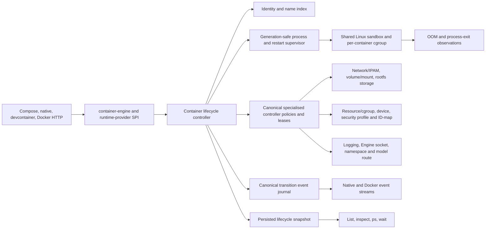

# Docker Lifecycle States and Actions Design

| Item | Value |
| --- | --- |
| Status | Design complete; implementation not started |
| Scope | `container-compose`, the matched `container` and `containerization` forks, the shared Engine API, and `devcontainer`'s selected runtime provider |
| Compatibility target | Docker Compose 5.4.0 with Docker Engine 29.2.1 API 1.53 on macOS. Retained 5.3.1 citations below identify original source or evidence checkpoints. |
| Evidence host | arm64 Mac17,9, macOS 26.5.2, Colima Docker context |
| Original design Container revision | `88460ab2ab0ca2f3fa9f91b2911b3b77647596c1` |
| Original design Containerization revision | `d7377b962af724f8d7c2b640f3ab12184d33f1af` |
| Design date | 31 July 2026 |
| Last documentation review | 25 August 2026 against the current 5.4.0 programme oracle and STATUS backlog |

## Goal

Deliver the [Docker lifecycle states and actions parity contract](https://github.com/stephenlclarke/container-compose/issues/274) by making container identity, public state, transitions, waits, and events one durable runtime contract. Completion means that every native, Compose, devcontainer, and Docker HTTP client observes:

- the same immutable container ID and independently mutable canonical name;
- Docker's `created`, `running`, `paused`, `restarting`, `exited`, `removing`, and `dead` states with complete inspect fields;
- generation-safe start, stop, kill, pause, unpause, explicit restart, automatic restart, rename, resize, update, attach/detach, wait, and remove operations;
- accurate OOM detection and `OOMKilled` state;
- Docker-compatible action names, ordering, attributes, filters, replay, and retention;
- deterministic recovery after authority, VM, guest-agent, or host interruption; and
- transactionally coordinated network/IPAM, volume/mount, rootfs-storage, resource/cgroup, device, security-profile/ID-map, logging, Engine-socket, namespace-dependency, model-route, health, and restart-policy cleanup.

The design replaces inferred state and synthetic event translation with a central lifecycle controller and append-only transition journal. Compose remains a consumer and policy layer; it does not manufacture missing runtime states.

## Scope

### In scope

- Public container states and all corresponding inspect/list/filter/`ps` projections.
- Immutable ID, mutable name, name/ID-prefix indexes, rename, and collision handling.
- Created/start/running/pause/unpause/exit/stop/kill/restart/removing/dead transitions and recovery.
- Explicit versus automatic restart semantics, restart count/backoff, manual suppression, generation-aware waits, and hook integration.
- OOM observation from per-container cgroups, including an OOM that does not immediately kill init.
- Init terminal resize, resource/restart-policy update, live attach/detach session actions, and exec detach.
- Docker container event actions currently exposed or required by supported operations, including create/start/kill/die/stop/pause/unpause/restart/oom/rename/resize/update/attach/detach/destroy/prune/health and exec actions.
- Durable native journal/cursor replay plus Docker's session-scoped `since`/`until`, filtering, streaming, slow-client/drop behaviour, and observable global 256-event replay window.
- Shared Engine API and devcontainer projection over the same state and event authority.

### Explicitly out of scope

- Swarm task/service state machines and cluster-scoped events.
- Windows container states or Hyper-V/process isolation.
- Checkpoint/restore and migration between Macs.
- Inventing a Docker event for an operation that the pinned Engine does not emit.
- Treating provider/model-runner health as a container public state. Provider-specific diagnostics use namespaced internal events.
- Keeping a failed removal invisible. A partially removed container is `dead` until cleanup succeeds, not silently absent.

## Normative Terms

`MUST`, `MUST NOT`, `SHOULD`, and `MAY` describe implementation requirements. An oracle is an executable comparison with the pinned Docker reference. Public state means the Docker-facing state; internal phases such as bootstrapping, stopping, thawing, cleanup, and recovery remain implementation details.

## Current Evidence and Blockers

| Layer | Current boundary | Consequence |
| --- | --- | --- |
| Container status | The pinned runtime exposes only `unknown`, `stopped`, `running`, `paused`, and `stopping`. | It cannot represent Docker `created`, `restarting`, `removing`, `exited`, or `dead` truthfully. |
| Compose discovery | [`ComposeRuntimeDiscovery.swift`](../../Sources/ComposeRuntimeSPI/ComposeRuntimeDiscovery.swift) carries a string status plus only exit code/date and health. | PID, OOM, error, restart count, exact timestamps, and transient state are lost. |
| Identity | Compose and lower adapters commonly use one string as both container name and ID. | Atomic rename and stable event actor identity are impossible. |
| Restart | [`ContainerLifecycleAdapter.swift`](../../Sources/ComposeContainerRuntime/ContainerLifecycleAdapter.swift) exposes start/stop but no atomic runtime restart. Compose implements restart as separate stop/start calls. | Interleaving clients, hooks, events, restart-policy suppression, and failure residue can diverge from Docker. |
| Events | [`ContainerEventsAdapter.swift`](../../Sources/ComposeContainerRuntime/ContainerEventsAdapter.swift) renders runtime JSONL and suppresses a generic delete event. | It cannot create missing provenance or guarantee the state commit associated with an action. |
| Exit events | The pinned runtime emits `die` and `stop` for every process exit. | Natural exit and automatic policy restart incorrectly look like explicit stop; Docker emits `stop` only for the Stop operation. |
| OOM | Exit code alone is available; no reliable per-container cgroup counter observation feeds state. | Exit 137 cannot distinguish OOM, SIGKILL, or daemon interruption. |
| Removal | There is no durable public removal intent/dead tombstone transaction. | A service crash can leave resources partially removed without an inspectable recovery state. |
| Replay | The Container broadcaster retains 1,024 events. | Docker's observable local replay window is the last 256; clients can receive different history. |
| Operation actions | Rename/update/resize/attach/detach and several supported top/copy/export/exec actions are absent or incomplete. | `events`, Engine clients, and audit consumers cannot reconstruct actual operations. |

The runtime already emits useful create/start/pause/unpause/kill/die/destroy/health and exec actions, and Compose filters project/service labels correctly. These are inputs to the new journal, not proof that the lifecycle contract is complete.

## Docker Reference Contract

### Public state and inspect precedence

The public enum is:

```swift
public enum ContainerPublicState: String, Codable, Sendable {
    case created
    case running
    case paused
    case restarting
    case exited
    case removing
    case dead
}
```

The lifecycle controller stores orthogonal facts and computes `Status` with Docker's precedence. Here `running` is Docker's persisted running-lifecycle-owner flag, not a claim that an OS process or non-zero PID currently exists; it remains true during automatic-restart backoff after the old process exits:

1. If the running-owner flag is true: `paused`, then `restarting`, then `running`.
2. Otherwise: `removing`, then `dead`.
3. If no process generation has ever started: `created`.
4. Otherwise: `exited`.

`restarting` describes automatic restart-policy work, not the brief internal stop/start inside an explicit restart operation. During backoff the active process/PID is absent even though public `Running` and `Restarting` remain true; live handles therefore follow `processGeneration`, not the running-owner flag. A dead container cannot start; it can only be inspected/listed and removal retried. A removing container rejects concurrent mutations with the pinned conflict response.

The complete public snapshot is:

```swift
public enum ContainerHealthStatusV1: String, Codable, Sendable {
    case starting
    case healthy
    case unhealthy
}

public struct ContainerHealthcheckResultV1: Codable, Sendable {
    public var startedAt: Date
    public var finishedAt: Date
    public var exitCode: Int32
    public var output: String
}

public struct ContainerHealthSnapshot: Codable, Sendable {
    public var status: ContainerHealthStatusV1
    public var failingStreak: UInt64
    public var log: [ContainerHealthcheckResultV1]
}

public struct ContainerLifecycleSnapshot: Codable, Sendable {
    public var state: ContainerPublicState
    public var running: Bool
    public var paused: Bool
    public var restarting: Bool
    public var removalInProgress: Bool
    public var dead: Bool
    public var oomKilled: Bool
    public var pid: Int32
    public var exitCode: Int32
    public var error: String
    public var startedAt: Date?
    public var finishedAt: Date?
    public var restartCount: UInt64
    public var health: ContainerHealthSnapshot?
    public var processGeneration: UInt64?
    public var transitionRevision: UInt64
}
```

Engine projection populates Docker `State.Status`, booleans, PID, exit code, error, timestamps, health, and top-level `RestartCount`. Native clients may additionally see internal revision/generation and redacted recovery diagnostics. `processGeneration` is `nil` until the first successful process start; a failed start candidate never becomes a sentinel or committed generation. After a process has existed, the field retains the latest committed generation while stopped.

Health-result retention count, output-byte cap, UTF-8/error handling, and
inspect truncation follow the pinned Engine oracle. Both each result and the
aggregate log are bounded before durable commit, so a health command cannot
grow lifecycle state or an API response without limit.

### Immutable identity and mutable name

Every container record separates:

- immutable 64-hex public ID;
- mutable canonical name;
- immutable bundle/storage key;
- selected runtime-provider ID;
- name index and unambiguous ID-prefix index; and
- Compose project/service/replica labels.

Rename is a state-controller transaction:

1. resolve the source ID under a keyed lock;
2. validate/reserve the new canonical name atomically;
3. update the persistent name index and requested/effective metadata;
4. update runtime DNS/name projections without changing ID, endpoints, volumes, logs, cgroup, or event history;
5. commit one transition revision; and
6. emit `rename` with the Docker-oracled old-name attribute captured from that revision.

### Generation taxonomy

This design uses the [coherent architecture's canonical taxonomy](coherent-container-family-parity-design.md#canonical-identity-and-generation-taxonomy). `transitionRevision` orders state/event commits; `processGeneration` identifies one successfully started workload process; `operationGeneration` identifies a mutation attempt; sandbox/provider/inventory generations invalidate external handles; and each controller owns its separate durable lease generation. A start may reserve a candidate process generation while staging resources, but it commits that generation only with successful process start and compensates a failed candidate. Durable stopped-container intents retain the immutable container ID and domain lease generations; only their live activation/session handles bind to a process generation.

Failure rolls back the new reservation and any staged DNS mutation. Event rendering never looks up the actor's current name after commit.

### State transition table

| From | Operation/observation | To | Required behaviour |
| --- | --- | --- | --- |
| `created` | start succeeds | `running` | Allocate a new process generation, reset OOM/error as Docker does, set start time/PID, emit start. |
| `created` | start fails | `created` | Preserve start error and stopped resources at the oracle boundary; no false running/start. |
| `created` | remove | `removing` → absent/dead | Persist removal intent before cleanup. |
| `running` | pause | `paused` | Freeze the container cgroup/process set and emit pause after commit. |
| `paused` | unpause | `running` | Thaw and emit unpause. |
| `running`/`paused` | natural exit | `exited`, `restarting`, or auto-remove `removing` | Emit die at the pinned boundary and run generation-fenced exit finalisation; never emit stop merely because init exited. Auto-remove chains finalisation into removal. |
| `running`/`paused` | explicit stop | `exited` | Apply signal/grace/kill, emit the oracle sequence ending in stop. |
| `running`/`paused` | kill | `exited` or `restarting` | Emit kill with signal, then die; restart policy follows pinned rules. |
| `running`/`paused` | explicit restart | `running` | One atomic controller operation, new generation, explicit restart action only after successful start. |
| `restarting` | timer/start succeeds | `running` | Increment restart count at the pinned point, clear restarting, emit start. |
| `restarting` | manual stop/kill/remove | `exited`/`removing` | Cancel the generation-bound pending restart so delayed work cannot resurrect it. |
| `restarting` | terminal failure | `exited` | Persist final error/exit state and no phantom start. |
| `exited` | start/restart | `running` | New generation; explicit restart emits restart, ordinary start does not. |
| any non-removing | force remove | `removing` → absent/dead | Cancel restart, stop/kill as required, then transactional cleanup. |
| `removing` | concurrent mutation | `removing` | Return pinned removal-in-progress conflict. |
| `removing` | cleanup failure | `dead` | Retain ID/name/error/remaining ownership and allow retry-remove only. |
| `dead` | retry remove succeeds | absent | Release tombstone/name only after all owned resources are proven gone. |

Internal stop, thaw, bootstrap, and cleanup steps MUST NOT become extra public actions unless the pinned Engine emits them.

### Explicit and automatic restart

Container adds a first-class restart operation. Compose runs `pre_stop`, calls that single operation, then runs `post_start` only after the new generation is running. Other clients cannot interleave a start/remove between separate Compose stop and start calls.

Automatic restart retains Docker policy/backoff behaviour, restart count, manual-stop suppression, minimum-success reset, and host/service recovery. Each scheduled task carries `containerID`, lifecycle-owned `restartPolicyRevision`, the exiting `processGeneration`, and its pending ledger `operationGeneration`. A restart-policy change bumps `restartPolicyRevision`; manual stop/kill/remove cancels the pending operation; any token mismatch rejects stale work. This clock is separate from the resource/security `policyRevision`.

Event rules are distinct:

- automatic policy restart: `die`, delay, `start`;
- explicit restart of a running container: `die`, `stop`, `start`, then `restart`; Moby's internal stop signal/fallback does not emit the public Kill API's `kill` action;
- explicit restart of a stopped/created container: `start`, then `restart`;
- natural exit: `die` only, unless health or OOM contributes its own event; and
- an attached client is disconnected at restart generation change.

The exact event ordering and action attributes are pinned by black-box tests rather than assumed from implementation source.

### Process-generation exit finalisation

The lifecycle controller owns one replayable finalisation for every committed
process generation. Natural exit, automatic or explicit restart, explicit stop,
kill, and force-remove all join the same operation after the process is proved
unable to use runtime resources. Its unique key is exactly
`(containerID, processGeneration)` and its `finalizationID` is deterministic
from that pair; initiating `operationGeneration` values are causality only, so
racing callers cannot create duplicate finalisers.

```swift
public enum ProcessExitFinalizationPhaseV1: String, Codable, Sendable {
    case pending
    case fencing
    case cleaning
    case recoveryRequired
    case complete
}

public enum ExitFinalizationControllerV1: String, Codable, Sendable {
    case attachExecHealth
    case engineSocket
    case modelRoute
    case network
    case logging
    case devices
    case volumesAndMounts
    case rootfsStorage
    case namespaces
    case cgroupResources
    case securityProfilesAndIDMap
}

public enum ExitFinalizationStepStateV1: String, Codable, Sendable {
    case pending
    case inProgress
    case acknowledged
    case recoveryRequired
}

public struct ExitFinalizationStepV1: Codable, Sendable {
    public var controller: ExitFinalizationControllerV1
    public var order: UInt32
    public var activationRecordID: String?
    public var expectedActivationDigest: String
    public var protectedEffectReferenceDigest: String?
    public var state: ExitFinalizationStepStateV1
    public var acknowledgement: ExitFinalizationAcknowledgementV1?
}

public enum ExitFinalizationDispositionV1: String, Codable, Sendable {
    case deactivated
    case alreadyAbsent
    case retainedInactive
}

public struct ExitFinalizationAcknowledgementV1: Codable, Sendable {
    public var schemaVersion: UInt32
    public var finalizationID: String
    public var containerID: String
    public var processGeneration: UInt64
    public var activeSandboxGeneration: UInt64
    public var controller: ExitFinalizationControllerV1
    public var order: UInt32
    public var activationRecordID: String?
    public var expectedActivationDigest: String
    public var protectedEffectReferenceDigest: String?
    public var disposition: ExitFinalizationDispositionV1
    public var controllerRevision: UInt64
    public var acknowledgementDigest: String
}

public struct ProcessExitFinalizationV1: Codable, Sendable {
    public var schemaVersion: UInt32
    public var finalizationID: String
    public var containerID: String
    public var processGeneration: UInt64
    public var activeSandboxGeneration: UInt64
    public var exitTransitionRevision: UInt64
    public var exitEvidenceDigest: String
    public var causalOperationGenerations: [UInt64]
    public var phase: ProcessExitFinalizationPhaseV1
    public var orderedSteps: [ExitFinalizationStepV1]
}
```

The same atomic transaction that commits exit/OOM evidence, public lifecycle
state, wait result, transition revision, and oracle-eligible event-journal
entries also creates the complete `pending` finaliser and its closed ordered
step plan. There is therefore no crash window between an observable exit and a
durable cleanup owner. A later stop/kill/restart/remove operation appends its
causal operation generation and joins that finaliser; it cannot replace the
plan or duplicate the exit transition/event. Each controller additionally
compares its domain `leaseGeneration`, immutable activation/handle identity, and
recorded sandbox/provider/inventory/session clocks. No controller may clear a
record merely because only container and process generation match.

Every step's canonical activation digest covers the complete focused
controller record named by `activationRecordID`, including container/domain
owner, lease ID/generation, active process/sandbox pair, provider and inventory
clocks where applicable, session/activation/handle identity, and protected
effect reference. A controller receives that immutable snapshot rather than an
underspecified generic cleanup request. Its acknowledgement must echo the
finaliser identity, step order, exact record identity/digests, process/sandbox
fence, and controller revision. The lifecycle controller marks the step
acknowledged only after verifying the acknowledgement digest and a matching
current record. `retainedInactive` is legal only where the focused design
explicitly permits a durable, non-live reservation and the acknowledgement
proves every process-bound handle deactivated. A stale, partial, mismatched, or
unsigned acknowledgement leaves the step `recoveryRequired`.

The operation then:

1. records exit/OOM evidence, fences new attach/exec/health/output activity,
   disconnects process-bound clients, and prevents the old generation from
   reacquiring a handle;
2. closes the broad Engine-socket relay first, deactivates the model route and
   live port/network forwarding, and clears each matching paired
   `activeProcessGeneration`/`activeSandboxGeneration` only after the complete
   domain activation tuple matches;
3. closes process streams, applies the logging copier/partial-record deadline,
   drains provider sessions, and retains only durable log history/configuration;
4. deactivates and unpublishes physical device, volume/mount, rootfs, endpoint,
   namespace, cgroup, ID-map, and security-profile materialisation in the
   persisted dependency order;
5. retains Docker-owned stopped-container intent and domain leases, including
   endpoint/address reservations and only oracle-approved reference-counted
   donor handles or provider-proven safe deactivated device reservations; and
6. records each ordered controller acknowledgement by compare-and-swap and
   atomically commits finalisation complete or a retryable recovery-required
   record. A retry resumes the first non-acknowledged step with its persisted
   protected effect reference and digest, resolves private raw material only
   for the controller call, and never reopens an acknowledged step.

Docker public state, wait notification, and `die`/`stop`/`kill`/`restart`
actions remain at their pinned observable boundaries and are emitted exactly
once; replaying cleanup never fabricates another action. A public
`exited`/`restarting` projection may therefore be visible while protected
diagnostics show finalisation pending, but no next process generation may
activate until completion is durable. An automatic-restart delay may count
down concurrently, then waits for finalisation. Cleanup failure retains the
fenced container and recovery record and blocks start/restart rather than
leaving a stale relay or provider handle usable. Authority recovery resumes the
same idempotent operation.

### Auto-remove

`ContainerLifecycleIntentV2.autoRemove` is an Engine lifecycle contract, not a
Compose-only shortcut. The authority rejects an effective request that combines
auto-remove with restart behaviour other than `no` at the pinned
create-validation phase before public ID/name allocation or controller leases.
An omitted `.engineDefault` first resolves to the pinned Engine default without
rewriting the requested field; an explicitly empty or otherwise invalid policy
follows the pinned validation path rather than being classified merely as
“non-no”. Compose `run --rm`
and raw Engine clients must reach the same validation after any client-side
projection; an adapter cannot silently invent different precedence.

When an auto-remove container's init process terminates through natural exit,
OOM, signal, explicit stop, or kill, the lifecycle operation:

1. commits the exit result and oracle-eligible `oom`/`die`/`stop`/`kill`
   actions at their normal boundaries;
2. completes `ProcessExitFinalizationV1` for the exiting generation;
3. persists a generation-bound auto-removal marker from the create-persisted
   `autoRemove` intent and enters the ordinary canonical `removing` transaction
   without admitting another start; and
4. emits `destroy` and deletes the identity only after durable resources are
   proven released.

The removal path releases AutoRemove-selected anonymous volumes and ephemeral
container resources while retaining named/external resources, images, and
global model content according to the pinned Engine result. Cleanup failure
commits `dead` with the remaining ownership ledger; it never resurrects the
container or drops evidence. Authority failure between exit, finalisation, and
removal resumes the same operations from their persisted markers.

Exit and removal waiters, attached clients, event subscribers, and inspect race
at this boundary. The oracle suite pins whether each waiter registered before
exit receives the exit code or removal response, when `removed` wakes, exact
`die`/`destroy` ordering and attributes, and the late no-such-container result.
The authority retains the exit outcome inside the operation record long enough
to reproduce that contract; it does not let tombstone deletion make the result
scheduler-dependent.

The explicit Restart API, a start failure before any committed
`processGeneration`, and authority/sandbox shutdown are distinct causes rather
than synthetic natural exits. The restart operation records its cause so the
oracle-pinned Moby result can either suppress auto-removal for its internal
exit or chain into removal; the common finaliser does not decide by itself. A
pre-generation start failure has no exit finaliser and follows its separately
pinned stopped-record/automatic-removal residue. Shutdown recovery reloads the
create-persisted intent plus operation markers and never guesses that daemon
termination was an ordinary container exit.

Required fixtures cover create conflicts, zero/non-zero/signal/OOM exits,
explicit stop/kill/restart, pre-generation start failure, attached and detached
clients, anonymous versus named volumes, network/socket/model/log cleanup,
concurrent inspect/wait/remove, cleanup failure to `dead`, and
authority/sandbox shutdown recovery at every boundary.

### OOM semantics

Exit code 137 is not OOM evidence. Containerization/guest agent exposes per-container cgroup v2 `memory.events` deltas for `oom`, `oom_kill`, and `oom_group_kill`, attributed by the exact live-cgroup tuple of immutable `containerID`, `processGeneration`, and `sandboxGeneration`. The effective resource state separately records `policyRevision`; there is no additional cgroup-generation clock.

- Emit `oom` when the kernel reports the event, even if a non-init process dies and the container continues.
- If init is OOM-killed, commit `OOMKilled=true` and emit `oom` before `die`.
- Retain `OOMKilled=true` in the exited snapshot.
- Reset it at the Docker-oracled successful-start boundary.
- Never attribute one workload's counter to another inside the shared Linux sandbox.
- Persist the last observed counters so authority restart does not duplicate an event.

### Wait semantics

One overloaded “wait until stopped” operation is insufficient. The runtime supports generation-aware conditions:

```swift
public enum ContainerWaitCondition: Codable, Sendable, Equatable {
    case processExit(generation: UInt64)
    case notRunning
    case nextExit
    case removed
}
```

A waiter attached to generation N receives N's exit result even when the public container state has already become `restarting` or generation N+1 is running. Removal wait completes only after the resource/tombstone transaction commits. Cancellation removes only the waiter.

`processExit(generation:)` is the generation-aware native condition: it returns
the cached result for that committed generation, waits only while that exact
generation is active, and rejects an unknown/uncommitted candidate. Docker's
three wire conditions map separately and losslessly across every state:

| State at atomic registration | `not-running` | `next-exit` | `removed` |
| --- | --- | --- | --- |
| `created` | Complete immediately with the pinned never-started result. | Record the exit sequence and wait for a later committed process exit or terminal removal response. | Wait for committed removal. |
| `running` / `paused` | Wait for the running-owner flag to clear. | Wait for this or a later active generation's first exit after registration. | Wait for committed removal. |
| `restarting` | Continue waiting because Docker's running-owner flag remains true even with PID zero. | Ignore the already-observed exit that entered backoff and wait for the first later exit, unless removal wins. | Wait for committed removal. |
| `exited` | Complete immediately with the latest cached exit result. | Record the sequence and wait for a later run's exit or terminal removal response. | Wait for committed removal. |
| `removing` | Complete immediately with the pinned cached/never-started result. | Complete with the pinned removal-in-progress terminal response; never invent or await a process generation. | Wait for the current removal commit. |
| `dead` | Complete immediately with the cached/never-started result and dead status. | Complete with the pinned terminal dead/removal response; no later process can start. | Remain registered across retry-remove and complete only when removal commits. |

An initial request whose name/ID is already absent fails lookup with the pinned
no-such-container response; it is not treated as a successful `removed` wait.
Once registered, `removed` completes after identity/tombstone deletion,
including auto-remove, and `next-exit` receives the oracle-pinned terminal
removal response if removal wins. Generation exit results remain in the
operation/tombstone record for existing waiters through this boundary.
Registration, state/sequence lookup, and waiter insertion are atomic, so a
concurrent restart, dead cleanup retry, or auto-remove commit cannot make a
waiter hang, miss, retarget an observed exit, or bind to an uncommitted
candidate.

### Removal and dead recovery

Removal persists intent and sets public `removing` before destructive work. It then:

1. cancels restart and new attach/exec sessions;
2. stops/kills the current `processGeneration` if required and runs or resumes
   its complete `ProcessExitFinalizationV1` before durable resource release;
3. drains/closes remaining log readers and deletes owned log-store state;
4. revokes and releases durable model-route and Engine-socket grants;
5. deletes persisted workload mounts/config artifacts, releases device and
   volume leases, and deletes owned rootfs/snapshot state in the
   controller-safe order recorded by the ledger;
6. releases security-profile, ID-map, and other policy references after no live
   materialisation can consume them;
7. releases owning network endpoints, addresses, DNS, and durable port
   reservations;
8. releases namespace donor/dependency references only after no workload
   mount, device, cgroup, route, or endpoint materialisation uses them;
9. proves every owned resource absent;
10. appends/commits destroy; and
11. removes the name/ID record.

Independent controller steps MAY execute concurrently only when the persisted
dependency graph proves neither can observe or release the other's resource.

The controller records per-step ownership and idempotent completion. Model-route cleanup removes only the route disposition owned by the immutable container ID and its model-route `leaseGeneration`; it never unloads or deletes global model content. On authority startup it resumes incomplete removal. An unrecoverable busy or provider cleanup failure commits `dead` with a redacted error and remaining ownership ledger; it never deletes the record to make list output look clean.

## Canonical Event Journal

### Event record

```swift
public struct ContainerAuthorityEvent: Codable, Sendable {
    public var sequence: UInt64
    public var timeNano: UInt64
    public var type: String
    public var action: String
    public var actorID: String
    public var attributes: [String: String]
    public var transitionRevision: UInt64
    public var operationGeneration: UInt64
}
```

State mutation and its action entry normally commit in one ordered transaction.
The journal entry captures actor attributes at the action boundary. A pinned
Docker action may also describe an attempted operation whose state mutation
fails: that entry carries the current `transitionRevision` and the distinct
`operationGeneration`. The live-update failure case below is the explicit first
example; implementations must not fabricate a successful effective revision.
Native subscribers use sequence cursors, bounded queues, and an explicit
overrun error. Docker HTTP `/events` deliberately keeps the pinned Moby 29.2.1
projection instead: a 1024-entry subscriber buffer, a bounded publisher send
that may drop for a slow reader, and no invented stream-error frame. A protected
counter/diagnostic records those drops without changing the public stream.

The full internal journal may retain more history for audit/recovery. The
Docker-facing event projection has a separate `engineEventEpoch` and one global
in-memory ring containing at most the last 256 events in that epoch. `since`,
`until`, type/event/container/image/label/scope filters scan that ring; the API does not
retain 256 matching events per filter. With neither `since` nor `until`, Moby
loads no buffered history and the subscription is live-only. Container events
match the `scope=local` filter. Restart of the selected authority/event
service closes streams, begins a new epoch, and exposes no pre-restart ring
history, matching a Docker daemon restart. A committed but unpublished entry is
resumed for internal recovery/audit only and is not injected into the new
Docker epoch. Native diagnostics may expose a separately authorised longer
retention policy.

### Required action ledger

| Action | Emission point and required attributes |
| --- | --- |
| `create` | Container record and immutable identity committed; image/name/labels captured. |
| `start` | New process generation running; image/name/labels. |
| `kill` | Explicit Kill API signal successfully delivered; `signal` in Docker form. Internal Stop/Restart signalling does not emit this action. |
| `die` | Generation exit committed; `exitCode` and pinned attributes. |
| `stop` | Explicit Stop API completes, not natural exit. |
| `pause` / `unpause` | Per-container cgroup transition committed. |
| `restart` | Explicit Restart API succeeds; never automatic policy restart. |
| `oom` | Per-container memory event observed; before die when init is killed. |
| `rename` | Name/index/DNS transaction committed; old name attribute. |
| `resize` | Init TTY resize succeeds; Docker-oracled width/height attributes. |
| `update` | For a valid stopped/successful update, the effective revision commits. For a running update that reaches runtime application and is rejected, Moby 29.2.1 rolls requested HostConfig back but still emits `update`; reproduce that event/error/residue boundary with the current revision. Validation/lookup failures before that boundary emit none. |
| `attach` / `detach` | Live session registration and explicit/key/cancel/EOF teardown at the pinned boundaries. |
| `destroy` | Removal cleanup proved complete; no duplicate generic delete. |
| `prune` | A valid completed container-prune sweep emits one container-type action with empty actor ID and decimal `reclaimed` attribute. Per-container removal failures may be skipped before that final action; validation/layer-size failure or cancellation returns at the pinned boundary without inventing it. |
| `health_status: healthy` / `health_status: unhealthy` | Exact action string is the state-bearing value; there is no invented `status` attribute. Initial `starting` is silent in Moby 29.2.1. Other defined values such as `health_status: running` are emitted only if a pinned supported black-box case proves them. Bare `event=health_status` uses the pinned family-match behaviour. |
| `exec_create: <command>` / `exec_start: <command>` | Exact command-bearing action string plus `execID` attribute at the pinned create/start boundaries. |
| `exec_die` / `exec_detach` | `exec_die` carries `execID` and `exitCode`; escape-key detach carries `execID`. Exec TTY resize emits no event in Moby 29.2.1, so no `exec_resize` action is fabricated. |
| `top`, `archive-path`, `extract-to-dir`, `export`, `commit` | Successful supported operation at its Engine-oracled boundary. GET archive emits `archive-path`; PUT archive emits `extract-to-dir`. Require legacy `copy` only if the pinned black-box oracle emits it for a supported route. |

The maintained ledger is generated/checked against the target Engine because Docker documentation lists common actions but is not a complete versioned attribute specification.

## Target Architecture



In the enhanced matched stack, Container is the resource/lifecycle authority and `container-engine` projects Docker API types. In the stock-Apple devcontainer lane, the selected engine provider must supply the complete lifecycle contract for every surface/API range it advertises over its own authoritative adapter; otherwise it negotiates a narrower range or capability failure before mutation. It cannot run a second listener or state writer alongside the selected provider. See [the coherent Container-family design](coherent-container-family-parity-design.md).

## Runtime Contracts

### Lifecycle controller API

```swift
public struct ContainerLifecycleRecord: Codable, Sendable {
    public var schemaVersion: UInt32
    public var containerID: String
    public var canonicalName: String
    public var immutableBundleKey: String
    public var selectedProviderFingerprint: String
    public var lifecycleIntent: ContainerLifecycleIntentV2
    public var snapshot: ContainerLifecycleSnapshot
}

public enum ContainerSignalV1: Codable, Sendable, Equatable {
    case name(String)
    case number(Int32)
}

public struct StopOptions: Codable, Sendable {
    public var signal: ContainerSignalV1?
    public var timeoutNanoseconds: Int64?
}

public struct RestartOptions: Codable, Sendable {
    public var signal: ContainerSignalV1?
    public var timeoutNanoseconds: Int64?
}

public struct TerminalSize: Codable, Sendable, Equatable {
    public var columns: UInt32
    public var rows: UInt32
}

public struct ContainerUpdateRequest: Codable, Sendable {
    public var schemaVersion: UInt32
    public var expectedTransitionRevision: UInt64?
    public var resourcesAndSecurity: ContainerLinuxWorkloadPolicyRequestV1?
    public var restartPolicy: ContainerRestartPolicyV2?
}

public struct WaitResult: Codable, Sendable {
    public var containerID: String
    public var processGeneration: UInt64?
    public var transitionRevision: UInt64
    public var statusCode: Int64
    public var errorMessage: String?
}

protocol ContainerLifecycleControlling: Sendable {
    func inspect(idOrName: String) async throws -> ContainerLifecycleRecord
    func start(idOrName: String) async throws
    func stop(idOrName: String, options: StopOptions) async throws
    func kill(idOrName: String, signal: ContainerSignalV1) async throws
    func restart(idOrName: String, options: RestartOptions) async throws
    func pause(idOrName: String) async throws
    func unpause(idOrName: String) async throws
    func rename(idOrName: String, newName: String) async throws
    func resize(idOrName: String, size: TerminalSize) async throws
    func update(idOrName: String, request: ContainerUpdateRequest) async throws -> [String]
    func wait(idOrName: String, condition: ContainerWaitCondition) async throws -> WaitResult
    func remove(idOrName: String, force: Bool, removeVolumes: Bool) async throws
}
```

Every mutation resolves immutable ID, acquires the keyed lock, validates current state/generation, stages resource work, and commits state/events once. API cancellation does not roll back an already committed operation; the client can inspect by ID.

### Containerization boundary

Containerization remains a generic process/sandbox layer. It gains only the lower primitives required for truth:

- stable per-workload process/cgroup identity inside the shared Linux sandbox;
- explicit pause/thaw and process-generation observations;
- cgroup `memory.events` streaming or reconciled counters;
- init and exec PTY resize acknowledgement;
- supported live cgroup updates with old/new values; and
- idempotent workload cleanup/status after guest-agent reconnect.

It does not expose Docker state enums or emit Docker events. Container maps acknowledged primitive results into state transactions.

### Compose runtime SPI

`ComposeRuntimeSPI` receives typed lifecycle snapshots and first-class restart/attach operations. `ComposeContainerSummary.status` is replaced or versioned with the public enum plus complete state. Compose:

- renders `ps` and filters directly from runtime truth;
- runs hooks around the atomic restart operation;
- no longer maps `unknown`/`stopping` to public statuses;
- consumes already authoritative actions and only filters project/service/one-off visibility; and
- keeps Docker-private Compose labels out of public event attributes.

## Migration and Compatibility

The v2 record decoder migrates existing containers without fabricating transient history:

- derive the new immutable 64-hex ID as SHA-256 over a versioned migration domain, the selected provider/state-root UUID, and the immutable legacy bundle/storage key; the authority computes it, never Compose or another client;
- retain the existing user-visible identifier as the initial canonical name and an exact read-only legacy lookup alias during the compatibility window;
- retain the immutable bundle key independently thereafter;
- infer `created` only when no start timestamp/generation evidence exists;
- otherwise infer `exited` from a stopped legacy snapshot;
- initialise OOM false and restart count from durable evidence if present, otherwise zero;
- never infer restarting, removing, or dead;
- begin transition revision/process generation at non-conflicting monotonic values; and
- keep a legacy status projection for old native clients during one compatibility release.

A running, paused, or restarting legacy VM is never live-adopted into v2 or the
shared sandbox. Under the exclusive migration lock, the authority records a
migration operation, drains/stops that workload through its legacy controller,
and maintains the coherent design's `LegacyRuntimeQuiescenceInventoryV1` for
the VM/process, mounts, network, devices, relays, attach/log sessions, and every
other observed effect. Legacy state has no trustworthy v2 process generation or
controller acknowledgement, so migration invents neither. It imports the
stopped snapshot only after the sole migration writer has positive legacy
quiescence proof for every inventory entry. Events caused by the real drain
remain in the source epoch at their normal boundary; migration invents or
replays no historical `die`, `stop`, or `start`. A crash before proof
leaves/resumes the legacy owner; a crash after proof but before the v2 commit
resumes from the durable stopped marker and cannot restart the legacy process or
emit duplicates. The selected authority may serially drive the legacy and v2
runtime mechanisms beneath the migration lock; an independent old writer is
always forbidden.

Migration preflights every derived ID, canonical name, legacy alias, and ID-prefix index before writing any v2 record. A full-ID collision, alias/name collision, missing stable bundle key, or ambiguous legacy owner stops migration for explicit repair; it never salts silently, overwrites another record, or assigns a name-derived ID. Legacy aliases are exact-match only and resolve to the new immutable ID; they do not participate in v2 prefix matching. Under the coherent state root's exclusive writer lock, the authority writes the v2 record, name/alias/ID indexes, migration marker, and raised minimum-writer schema header atomically while retaining the legacy record as read-only rollback evidence. An old authority binary or transferred source token must refuse read-write open; rollback before the first v2 commit discards staging, while later reversal is an explicit offline migration.

Devcontainer lifecycle metadata contributes solely to the coherent manifest's
`identityLifecycleEvents` part during the single quiesced Wave 8 handoff through
`container-engine`; it is not a separate cutover, writer switch, or tombstone
point. That part owns immutable identity/name/alias records, lifecycle/restart
state, event/audit disposition, the operation ledger, unexpired generic
idempotency outcomes/tombstones, and pending/completed finalisers. Focused
resource, logging, model, network, storage, device, and namespace parts may
reference those immutable IDs but cannot duplicate these records. The common
handoff token prevents source mutation between this snapshot and every other
canonical part. Identical records deduplicate only by verified runtime identity.
Same-name/different-ID and same-ID/different-resource collisions stop the
complete staged handoff and require explicit rename/import/delete selection.
Automatic merge is prohibited.

Capability `io.github.stephenlclarke.container.lifecycle-state.v2` gates Compose use before side effects. Older providers remain visible as incompatible rather than being guessed into v2 states.

## Security and Failure Atomicity

- Identity/name indexes use private, current-user-owned, symlink-safe state; external names never select filesystem paths directly.
- Every operation is authorised at the per-user engine boundary and audited by actor client/session without exposing tokens in Docker event attributes.
- Keyed locks plus revision/generation compare-and-swap prevent double start, stale restart resurrection, concurrent rename collision, and duplicate removal.
- Runtime/provider errors are redacted for public inspect while detailed protected diagnostics retain enough evidence to repair.
- Attach/detach session IDs and socket paths are never public attributes.
- OOM/resource observations are scoped to immutable `containerID`, `processGeneration`, and `sandboxGeneration` to prevent cross-container attribution.
- Removal never broad-deletes by name, glob, unresolved environment variable, or mutable path. It deletes only stable IDs/inodes/leases recorded as owned.
- Authority crash injection at every transition must leave either the prior committed state or a resumable next state, never unowned resources with a success result.

## Performance Contract

Lifecycle truth must not turn every read into VM inspection. State and name indexes are local committed records updated by observations. List/inspect/filters use one snapshot transaction; event publication is append/broadcast without per-subscriber runtime calls. OOM counters are streamed/batched, not polled per Compose command.

Paired median/P95 tests cover create/start/stop/restart/remove, list/inspect 1/10/50 containers, event first-frame/replay/steady stream, attach setup/teardown, rename/update, and authority recovery. Record commit/journal durability policy must preserve Docker-equivalent acknowledgement without an avoidable fsync per cosmetic projection.

## Cross-Design Dependencies

| Design | Shared contract |
| --- | --- |
| [Coherent Container-family architecture](coherent-container-family-parity-design.md) | One selected runtime authority, shared Engine server, Linux sandbox, identity, event journal, and devcontainer migration. |
| [Advanced network/IPAM](advanced-network-ipam-design.md) | Rename/DNS and removal/endpoint transactions; network namespace donor lifetime. |
| [Volumes/mounts/API socket](non-local-volumes-advanced-mounts-api-socket-design.md) | Removal leases, dead-state recovery, Engine routes, socket-session actions, and imported devcontainer identity. |
| [Logging drivers](docker-logging-driver-semantics-design.md) | Per-generation log continuity, stop drain, unreadable/live attach, and attach/detach actions. |
| [Resource/security controls](remaining-resource-security-controls-design.md) | OOM counters and update-able cgroup/resource fields. |
| [Local Deploy subset](local-deploy-device-resource-subset-design.md) | Mutable/immutable resource distinction and update action. |
| [Shared namespaces/privileged isolation](shared-namespaces-privileged-isolation-design.md) | Per-container state/cgroup identity and donor/removal reference leases in one kernel. |
| [Model-runner services](model-runner-services-design.md) | Runner lifecycle remains host-service state; service restart reuses endpoint/model injection. |

## Implementation Work Packages

| Stable ID | Owner | Work package | Exit evidence |
| --- | --- | --- | --- |
| <a id="lifecycle-wp-01"></a>`LIFECYCLE-WP-01` | Oracle harness | Freeze inspect/list/filter/wait/action/attribute/order behaviour for every state and operation on Engine 29.2.1. | Versioned black-box state/action ledger and failure fixtures. |
| <a id="lifecycle-wp-02"></a>`LIFECYCLE-WP-02` | Shared Engine types and runtime provider | Add immutable identity, mutable names, versioned lifecycle DTOs, event records, API routes, and provider capability. | Stock/enhanced adapters round-trip without lossy fields. |
| <a id="lifecycle-wp-03"></a>`LIFECYCLE-WP-03` | `container` | Migrate persisted container records/name indexes and implement central state transaction/journal. | Crash/reload/migration/collision tests pass. |
| <a id="lifecycle-wp-04"></a>`LIFECYCLE-WP-04` | `containerization` and guest | Add `processGeneration`-bound workload activation, `sandboxGeneration` validation, OOM observation, pause/resize/update acknowledgements, and idempotent status/cleanup. | Shared-sandbox isolation and injected-failure tests pass. |
| <a id="lifecycle-wp-05"></a>`LIFECYCLE-WP-05` | `container` | Implement atomic restart, waits, removal/dead recovery, rename, resize, update, attach/detach, and complete action ledger. | State machine/property/oracle tests pass. |
| <a id="lifecycle-wp-06"></a>`LIFECYCLE-WP-06` | `container-engine` | Route Docker and native mutations through one selected authority and one journal without cutting over another resource owner. | Docker/native stable ID/name/state/action sequence passes. |
| <a id="lifecycle-wp-07"></a>`LIFECYCLE-WP-07` | `container-compose` | Adopt lifecycle v2 discovery/restart/events/ps/wait and retain hook semantics. | Compose state/filter/output/restart/event oracles pass. |
| <a id="lifecycle-wp-08"></a>`LIFECYCLE-WP-08` | `devcontainer`, gateway, and `container` | Prepare the exact `identityLifecycleEvents` payload/client path, enforce its sole ownership of the operation/idempotency/finaliser records, then execute its writer switch only inside the coherent Wave 8 single manifest/token/commit; retain the isolated standalone stock profile. | Canonical ownership and collision tests pass, and all clients observe one stable ID/name/revision/event sequence with no partial cutover. |
| <a id="lifecycle-wp-09"></a>`LIFECYCLE-WP-09` | Whole stack | Migration rehearsal, fault/security/performance matrix, docs/status, pins, release and rollback. | No orphan or phantom event; comparable performance. |

## Required Test and Evidence Matrix

### State and transitions

- Never-started create, successful/failed start, running, paused/unpaused, natural exit zero/non-zero, graceful/timed-out stop, named/numeric kill, explicit restart from created/running/paused/exited, automatic restart delay/success/failure, and manual suppression.
- OOM of init and non-init processes, group OOM, simultaneous exit/OOM, restart after OOM, authority reconnect without duplicate OOM.
- Blocked removal exposes removing; concurrent delete gets pinned conflict; injected cleanup failure exposes dead; only retry-remove works; successful retry releases name.
- Authority/engine/guest-agent crash before and after every state/event commit; delayed stale tasks cannot resurrect.
- Inspect, list/status filters, Compose `ps`, wait conditions, timestamps, PID, exit/error, health, OOM, restart count, and generation across every case.
- Docker `not-running`, `next-exit`, and `removed` plus native explicit-generation waits cover created, running, paused, restarting, exited, removing, dead, auto-remove, initial absence, cached results, later-run exit, dead retry-remove, removal wake-up, cancellation, and registration races without binding to an uncommitted candidate.

### Identity and cross-resources

- Rename stopped/running/paused container, collision, case rules, old/new lookup, ID-prefix stability, DNS update, logs, volume/network/socket/device ownership, and rollback on DNS/index failure.
- Legacy migration and devcontainer import: identical record, same-name/different-ID, same-ID/different-state, interrupted handoff, provider mismatch, and running/paused/restarting legacy drain with crashes before/after finalisation, no live namespace import, no duplicate/fabricated history, and one writable schema owner.
- Shared namespace donor rename/restart/remove and dependent references.

### Events and sessions

- Exact action/order/attributes and success/failure boundaries for natural exit, OOM, stop (`die`, `stop`), kill (`kill`, `die`), running explicit restart (`die`, `stop`, `start`, `restart`), automatic restart (`die`, delayed `start`), rename, resize, update, attach/detach, remove, prune, state-bearing health actions, command-bearing exec actions, `top`, GET `archive-path`, PUT `extract-to-dir`, oracle-emitted legacy `copy`, export, and commit.
- Running update application failure returns the pinned error, restores effective/HostConfig state, emits `update` at the pinned boundary with no false policy revision, and remains distinct from pre-application validation failure.
- Exec TTY resize succeeds without an `exec_resize` event; health filters prove both bare-family and exact-state behaviour.
- No stop on natural exit, no restart on automatic restart, no duplicate delete/destroy, no later-name lookup mutation.
- Replay from one global last-256 ring, including more than 256 mixed events whose filter matches only early/late subsets; since/until boundaries, `type`/`event`/`container`/`image`/`label`/`scope=local` filters, JSON/JSONL, slow/disconnected subscriber, and first-frame latency.
- A subscription with neither `since` nor `until` receives live events only and no buffered history; adding either bound exercises the global replay ring.
- Prune covers full success, skipped per-container removal failure, cancellation, invalid filter, and layer-size failure, with exact report residue and presence/absence of the single empty-actor `prune` action.
- Docker `since` replay is inclusive, so timestamp-based reconnect may repeat the boundary event; prove that observable behaviour rather than promising deduplication. Native cursor resume uses journal sequence and explicit overrun semantics separately.
- A deliberately stalled Docker subscriber proves the pinned buffer/publish-timeout/drop behaviour without a synthetic error frame; the native stream independently proves explicit overrun reporting.
- Authority/event-service restart starts an empty Docker-facing replay epoch while the protected durable journal still supports recovery; pre-restart actions are not republished into the new API ring.
- Multiple attach clients, stdin/out-only, detach keys, cancellation, client crash, restart disconnect, natural EOF, and `exec_detach`.

### Cross-client and performance

- Perform every mutation alternately through native Container, Container Compose, shared Docker HTTP, Docker CLI, and devcontainer; assert one ID/name/revision/event sequence.
- 1/10/50-container paired median/P95 state/list/event/lifecycle matrix and restart-policy soak.

## Definition of Done

| Area | Required proof |
| --- | --- |
| Identity | Immutable ID, mutable name/index, rename rollback, and cross-client lookup pass. |
| States | All seven Docker public states and complete inspect fields are runtime truth; no public unknown/stopping synthesis. |
| Restart | Explicit and automatic restart have separate atomic semantics, event sequences, counters, waits, and stale-task cancellation. |
| OOM | Kernel/cgroup evidence, not exit-code guessing, drives OOM event/state per workload. |
| Removal/dead | Durable intent, visible removing, resumable cleanup, dead tombstone, and retry-remove pass fault injection. |
| Actions | Maintained versioned action/attribute ledger passes for every supported operation; natural/automatic exits have no false actions. |
| Journal | State revisions and action attempts retain pinned ordering; native cursor and Docker epoch/replay/filter/256-window/slow-client behaviour remain distinct and correct; recovery publishes no phantom/duplicate action. |
| Compose | `ps`, filters, events, waits, restart hooks, and output consume lifecycle v2 directly. |
| Shared authority | Native, Compose, devcontainer, and Docker HTTP clients observe one record and event sequence. |
| Migration | Legacy and devcontainer records receive authority-derived immutable IDs, preserve exact lookup aliases, and import without name/ID conflation or automatic collision merge. |
| Security/failure | Keyed/generation transactions, redaction, ownership-scoped cleanup, and crash matrix pass. |
| Performance | Lifecycle/read/event median/P95 is comparable to or better than Docker Compose in each metric's declared direction outside the noise band. |

## Primary References

- [Docker container state filters](https://docs.docker.com/reference/cli/docker/container/ls/#status)
- [Docker system event actions and replay](https://docs.docker.com/reference/cli/docker/system/events/)
- [Docker Engine API](https://docs.docker.com/reference/api/engine/)
- [Docker Engine API version history](https://docs.docker.com/reference/api/engine/version-history/)
- [Docker restart policies](https://docs.docker.com/engine/containers/start-containers-automatically/)
- [Docker Compose 5.3.1 restart implementation](https://github.com/docker/compose/blob/v5.3.1/pkg/compose/restart.go)
- [Moby 29.2.1 container state model](https://github.com/moby/moby/blob/6bc6209b88a7a834c91f77d848e025c79e0227a1/daemon/container/state.go)
- [Moby 29.2.1 event service](https://github.com/moby/moby/tree/6bc6209b88a7a834c91f77d848e025c79e0227a1/daemon/events)
- [Current Compose event adapter](../../Sources/ComposeContainerRuntime/ContainerEventsAdapter.swift)
- [Current Compose lifecycle adapter](../../Sources/ComposeContainerRuntime/ContainerLifecycleAdapter.swift)
- [Current stable functionality](../project/STATUS.md)
