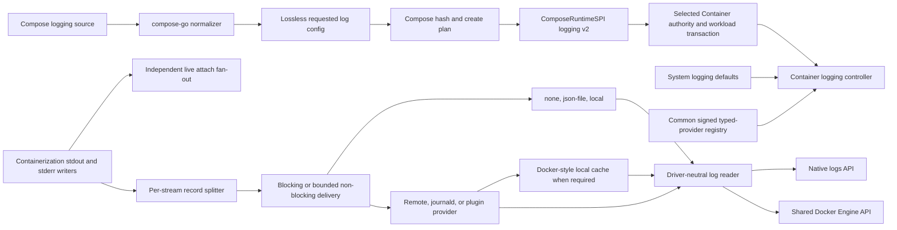

# Docker Logging Driver Semantics Design

| Item | Value |
| --- | --- |
| Status | Active overall. The current 0.14.0 stable stack retains the core logging architecture, durable native histories, maintained remote/provider implementations, exact-process attachment, public REST lifecycle, and the retained focused Docker Compose and Docker CLI certificates. The remaining external-client/provider/failure/migration/security matrix, focused GELF retry and Unix-socket validation paths, cold-runtime/resource collectors, and comparable release-artifact performance evidence remain open. |
| Scope | `container-compose`, `devcontainer`, the matched `container` fork, the matched `containerization` fork, the shared Engine API, and versioned logging providers |
| Compatibility target | Docker Compose 5.4.0 with Docker Engine 29.2.1 API 1.53 on macOS. The verified 5.3.1 logging fixtures below remain retained historical evidence. |
| Evidence host | arm64 Mac17,9, macOS 26.5.2, Colima Docker context |
| Stable release | [`container-compose` 0.14.0](https://github.com/stephenlclarke/container-compose/releases/tag/0.14.0), published 30 August 2026 after the hosted Stable Release Gate passed |
| Public-build Container revision | `6a094cd6acb53ac6d5695e7348cad7c74d8f99e2` |
| Compose checkpoints | Stable 0.14.0 source is the immutable `0.14.0` tag; earlier signed checkpoints below retain the implementation and oracle history that led to this release |
| Local Container checkpoints | Signed enhanced authority `6a668b2b5d42246efcad3316374f6d0e0d2eaf14`; signed public gateway lifecycle and discovery fix `ac1803ec555960ce49fcec1d6a5b718d781629e0`; production journald supervision/reclamation `84d160671f3ba6c265a02b49b2ff4309f6584d30`; isolated Docker-plugin lifecycle implementation `08677dc8b5a677533de80cf634fee1d14f4da069`; complete provider-generation cutover implementation `6e462443dd744bda0b605bf26e093833d7818e77`; public REST lifecycle, durable state, protected-effect reconciliation, and distributable plugin-root certificate `ac77f7a38819c4f96581220bb58d89107b51826a`; created-container attach and foreground descriptor ownership `a10ad44d8675b27a665d72fbe054f12f403f8412`; public unreadable-reader classification and exact reliability candidate `bfa8b361901e33bc427d5bb551d19b2a224ca3f2` |
| Matched Containerization checkpoints | Stable 0.14.0 revision `e5a92e86bf03eb2cc244b3b47b0413b3935abfe4`; earlier validation checkpoints remain recorded below |
| Shared Engine API | The stable Container graph resolves `container-engine-api` at `386a40c726ecd25d67a3e5933582aebbfbe4fa2f`; earlier signed handoff heads below retain the provider-control, public-lifecycle, bounded-history, framing, trust, and exact-process validation history |
| Verified Compose reliability checkpoint | Docker Compose 5.3.1 and the exact signed stack at Compose `c7a50e28438ca0c5bd5a668d3b8e87db25c4a176`, Container `bfa8b361901e33bc427d5bb551d19b2a224ca3f2`, Containerization `38d9c695e7a6915e5ce45d12c893dc323a661af7`, and Engine API `c7973ac641fb6f6e07df1358114f36222bd9ca59` pass one identical Dockerfile/Compose/Bash CLI fixture for readable/`none` non-TTY foreground output, successful empty static `none` history, restart retention, three replicas, tails, signal forwarding, disconnect isolation, and exact cleanup; 19 focused Swift tests and three Bash-harness regressions pass |
| Logging handoff checkpoints | Signed local Container heads `170b8769e3105169b4a01d99ac3bc93cd860d6fc`, `8005bf8fb8036da0b15d63763d5f51dff12cd5eb`, `0808fa92fcfa3e2a2b3a4c5b05e0057e83edf6ba`, `4e426116968e8382317e9cb3ac17821c9e6733af`, `08e7324b1dc89d0d1acd91680562d9223d807d56`, `16a3419ae31bb5c18a934571c69348767a89233e`, and `62455f657e8d22233736eec7c2438ca7a14553ce` implement and verify destination staging/re-resolution, protected receipt, abort compensation, signed promotion, Complete-only activation, immutable history publication, cursor adoption, the provider-neutral devcontainer payload, the real coordinator's possession/export/manifest/object-transfer/root-commit/promotion/activation transaction, public imported-history read-back plus a greater-sequence writer, staged-abort compensation replay across coordinator reconstruction, strict complete chunk-set validation, ordered one-active-file publication, constant-auxiliary-memory order validation, exact publication beyond 4096 stores, and native framed-file source/destination transport; signed local `devcontainer` heads `385cf69878a87e67589eb36fff2bc3c9dd66695f` and `63d2b4a122dfa0eb187ae82e48d14dc21b73c79e` add quiesced Apple Container history export, durable provider identity/key enrollment, root-scoped trust, object transport, source contribution replay, and authenticated private-session wiring; focused framed-transport evidence passes 8/8 Engine codec, 2/2 Engine gateway, and 7/7 Container transactions on the MBP, and the latest plugin suite remains 10/10 |
| Verified Syslog UDP/TCP public-socket certificates | Signed local Container `5ebce8a2aa90bf96775285e1a79ac48b375f69c5` fixes native macOS routing of `host.docker.internal` for the fork-only Syslog provider while retaining TCP/TLS identity. Its signed successor `b82e34874b944d2b9ecc65d4068aee5d7b46905e` reconstructs a stopped cache-disabled native Syslog logger before returning the Docker unreadable-history error. The focused provider suite passes 8/8 with 10/10 executable new-method lines covered. Docker CLI 29.7.1 / Engine 29.2.1 and two exact candidates prove UDP delivery and the TCP second empty connection after `docker logs`, including ordering, facility/severity, tag, inspect, unreadable history, native authority, and cleanup. UDP candidates are 3.08×/2.31× Docker; TCP candidates are 2.07×/1.72×. These completed durations are retained for the post-functional performance phase only. [LOGGING-SYSLOG-UDP-REST-01](../parity/handoffs/LOGGING-SYSLOG-UDP-REST-01.md) and [LOGGING-SYSLOG-TCP-REST-01](../parity/handoffs/LOGGING-SYSLOG-TCP-REST-01.md) retain the exact scope and fingerprints. |
| Last documentation review | 30 August 2026 against the 0.14.0 immutable release graph |

## Goal

Deliver the [Docker logging parity contract](https://github.com/stephenlclarke/container-compose/issues/271) without equating schema acceptance with runtime support, collapsing distinct drivers onto one file writer, or making foreground output depend on historical log readability. Completion means that the Container family:

- preserves an omitted driver, every explicit driver name, and the complete string option map from Compose source to the authoritative runtime;
- resolves and persists system defaults once at container creation, with Docker-compatible inheritance and recreation behaviour;
- implements genuinely distinct `none`, `json-file`, and `local` drivers;
- supports blocking and non-blocking delivery, exact bounded-buffer overflow behaviour, driver-specific options, metadata selection, and tag templates;
- implements Docker-style dual logging for drivers without native read support;
- supplies the maintained Docker built-ins and an arbitrary-name logging-provider/plugin contract with deterministic availability errors;
- separates live attach from driver/cache read-back so `up`, foreground `run`, and `attach` remain useful with `none` or an unreadable driver;
- preserves logs, rotation state, and driver configuration across stop/start and automatic restart;
- exposes Docker-shaped inspect and logs behaviour through the shared Engine API without leaking credentials through routine diagnostics; and
- passes paired behavioural, failure, security, and performance oracles against the pinned Docker reference.

The compatibility contract is observable Docker Compose and Engine behaviour. It does not require Container to copy Moby's private implementation or private `local` on-disk encoding.

## Scope

### In scope

- Compose `logging.driver` and `logging.options`, including omission, arbitrary installed-provider names, string/number/null normalisation, legacy fields retained for existing project compatibility, hashing, dry-run, and recreation.
- Per-user logging defaults equivalent to Docker daemon `log-driver` and `log-opts`.
- Generic `mode`, `max-buffer-size`, common metadata/tag options, dual-cache options, and every option supported by the maintained built-ins.
- `none`, `json-file`, `local`, `syslog`, `journald`, `fluentd`, `gelf`, `awslogs`, `splunk`, and `gcplogs` on the maintained macOS stack.
- Logging manifests in the common signed typed-provider registry and a Docker logging-plugin protocol adapter, including optional plugin `ReadLogs` capability.
- stdout/stderr capture, TTY merging, long-line partial records, timestamps, ordering, blocking/backpressure, non-blocking drop-new buffering, driver lifecycle, cache lifecycle, and failure reporting.
- Static and followed logs with stream selection, `tail`, `since`, `until`, timestamps, details, Docker multiplexing, rotation/compression, and stopped-container behaviour.
- Docker-compatible Engine inspect, info, logs, attach, and event integration.
- Migration of existing `stdio.log`/`stdio.jsonl` containers without destructive conversion.

### Explicitly out of scope

- Capturing application files that are not written to stdout or stderr.
- Shipping or administering every third-party logging plugin. Arbitrary installed providers and the protocol are supported; plugin distribution, trust approval, upgrade, and removal remain plugin-management responsibilities.
- Reintroducing the removed `logentries` built-in. Docker deprecated it in Engine 24 and removed it in Engine 25 after the service shut down; a third-party provider may still use that name.
- Windows-only `etwlogs` on macOS. It remains a platform-gated provider name with the reference-equivalent unavailable-driver result.
- Byte-for-byte compatibility with Docker's private `local` file format. Rotation, compression, read-back, metadata, failure, and retention behaviour are required; the private bytes are not an API.
- Making a raw logging option a Compose secret. The Compose schema has no secret-reference form for logging options; the runtime can protect persisted material and diagnostics but cannot make source-visible plaintext disappear.
- A lower-runtime rewrite before evidence shows one is required. The pinned Containerization synchronous writer already supplies the required host-side backpressure point.

## Normative Terms

`MUST`, `MUST NOT`, `SHOULD`, and `MAY` describe implementation requirements in this document. An oracle is a black-box comparison against the pinned Docker Compose and Engine versions on the same Mac. Moby source and Docker documentation explain behaviour, but a versioned executable oracle decides disagreements.

## Published Logging Boundary

The current 0.14.0 immutable release requires
`io.github.stephenlclarke.container.logging-drivers.v1` and ships the Compose,
Container, Engine API, Containerization, SwiftNIO SSL, and builder inputs named
in [Runtime Capability Contract](runtime-capabilities.md#logging-capability). It
retains the functional subset first published in 0.11.0, and its Stable Release
Gate passed. The remaining blockers are certification and parity gaps beyond
that released functional subset: the complete
external-client/provider/failure/migration/security matrix, the focused GELF
retry and Unix-socket validation paths, cold-resource collection, and
comparable release-artifact performance.

## Retained Pre-Release Evidence and Open Work

The table and checkpoint narrative below preserve the implementation evidence
that led to 0.11.0. Any consequence phrased as waiting for synchronized
publication is historical and was superseded by 0.11.0; the open evidence and
behavior gaps remain authoritative where they also appear in
[STATUS.md](../project/STATUS.md).

This gap crosses Compose policy, the production create path, Container persistence, runtime capture, read-back, and live attachment. A Compose-only projection cannot close it.

| Layer | Current boundary | Consequence |
| --- | --- | --- |
| Compose normalisation | The 0.11.0 source preserves the lossless optional driver and complete compose-go-normalised option map. | Retain config/hash regressions when provider contracts evolve. |
| Compose policy | The 0.11.0 release carries every requested driver and option through config, hashing, create planning, and required `io.github.stephenlclarke.container.logging-drivers.v1` negotiation. | Keep capability/version changes fail-closed and coordinated with the release manifest. |
| Compose runtime SPI | The released SPI carries exact requested driver/options plus separate driver-neutral historical-read and live-output attachment contracts. | Retain compatibility tests while completing the external-client/provider matrix. |
| Production create | The released typed `ContainerCreate`/`ContainerRun` path suppresses embedded CLI output, carries the exact logging request, and passes the pinned TTY and Compose 5.3.1 reliability fixtures. | Complete the remaining external-client/provider/failure/migration/security/performance evidence. |
| Container authority/model | The matched Container authority persists lossless requested and resolved v2 state, durable lifecycle projection, system defaults, protected options/effects, provider identity/generation, read policy, and delivery mode. Direct typed and CLI requests share the same resolver. The enhanced provider projects complete `SystemInfo` and `ContainerInspect`, and public Docker create/start/stop/delete use the same typed authority. Its advertised catalogue is side-effect free; start still requires concrete provider readiness. | Routine native inspection remains redacted. The common public gateway selects this authority locally; the remaining external-client route matrix must prove that no second authority appears. |
| Native writers | Distinct `none`, append-safe canonical `json-file`, and compact indexed/compressed `local` stores are selected by the authority. Rotation, partial records, bounded non-blocking delivery, and restart-safe state have focused tests. | The remaining gate is paired sustained rotation/restart/performance evidence, not another shared legacy writer. |
| Delivery and reads | Generation-fenced lifecycle ledgers, blocking/non-blocking delivery, dual cache, canonical native readers, bounded follow, unsupported-reader errors, and provider recovery are implemented in Container. | Final slow/failing-sink, sustained cache, migration, shutdown, and whole-stack performance oracles remain. |
| Foreground attachment | The 0.11.0 release attaches to the exact process handle before start, so foreground `up`, non-interactive `run`, `pre_start`, dependency restart, and `attach --no-stdin` do not depend on persisted history. The paired TTY oracle passes resize, detach, re-attach, exit, EOF, and cleanup. The Docker Compose 5.3.1 reliability fixture additionally passes readable/`none` non-TTY foreground output, restart retention, three replicas, tails, signal forwarding, and disconnected-client logging. | Comparable-performance and the remaining external-client/provider/failure/migration/security evidence remain. |
| Remote providers | The released stack includes Syslog, Fluentd, GELF, Splunk HEC, AWS Logs, Google Cloud Logs, Journald, and Docker logging-plugin contracts with authority activation, recovery, protected state, readiness gating, and focused semantic tests. | The release and dependency trust boundary is complete for 0.11.0. Paired Docker provider certification and the complete external-client, failure, migration, security, and programme-level lifecycle evidence remain. |
| Shared Engine API | Released `container-engine-api` 0.3.5 at `78cb4cb5781d6dbe9f0d34a1b925ee8dcaacdc98` implements the hardened listener, generated API 1.44 through 1.53 route ledger, shared executable/gateway, gateway-owned `GET`/`HEAD /_ping`, exclusive provider identity, deterministic private-session shutdown, starvation-free framed I/O, WebSocket framing, resize dispatch, and fail-closed complete-response composition. Signed local Engine API `fe4094d0d7a2372ad586d177aea3f9b0e299ebcb` scopes gateway/trust Keychain state to the selected provider root, `9008251c444af483a60ff95efa4a9d745a444ed5` adds typed public create/start/stop/delete routes, and `c7973ac641fb6f6e07df1358114f36222bd9ca59` removes repeated strict code validation while retaining an exact-process/executable-image cache key and per-connection identity comparison. Signed Container `ac77f7a38819c4f96581220bb58d89107b51826a` binds public lifecycle routes to the logging authority, and `a10ad44d8675b27a665d72fbe054f12f403f8412` closes created-container attach and live descriptor ownership. | The enhanced provider advertises and live-proves the logging, inspection, attachment, resize, and basic lifecycle surface. The API-socket grant, exact provenance for several broader lifecycle fields, comparable terminal-session performance, and the complete external-client route/provider matrix remain unimplemented or uncertified. |
| Containerization | Its pinned synchronous throwing writer receives host-vsock stdout/stderr; TTY is already merged to stdout. | This is sufficient for a blocking writer or a host-side bounded queue. No initial guest protocol change is justified. |

Installed-system evidence now covers protected discovery of a deterministic
third-party readable plugin, two native lifecycle cycles, one public Docker
REST create/start/stop/delete cycle, exact FIFO history, independent Docker
`info`, `inspect`, and `logs`, and stopped-state projection as `exited`.
Earlier installed evidence additionally retains history and same-ID
delete/recreate across API-service/shared-sandbox restarts. Signed Container
`ac77f7a38819c4f96581220bb58d89107b51826a` binds lifecycle state and logging
effects to durable container identity, reconciles protected references before
store use, and uses a protected read-only directory root for the installed
plugin.

The public lifecycle, stale-state projection, protected-effect exhaustion,
and provider-root trust investigations are closed locally by signed Container
`ac77f7a38819c4f96581220bb58d89107b51826a`, Engine API
`fe4094d0d7a2372ad586d177aea3f9b0e299ebcb` and
`9008251c444af483a60ff95efa4a9d745a444ed5`, and devcontainer
`63d2b4a122dfa0eb187ae82e48d14dc21b73c79e`. The corresponding owned-repository
issues are commented and closed. The Container and Engine work is included in
the 0.11.0 matched graph; the remaining devcontainer end-to-end proof is
recorded in the [logging parity backlog](../project/BACKLOG.md#docker-logging-semantics).

The current Docker rotated-tail fixture is useful evidence rather than an implementation gate: at the same 2 KiB/three-file settings it retains 40 `json-file` lines and 61 `local` lines. [`DockerComposeLogFixtureTests.swift`](../../Tests/ComposeCoreTests/DockerComposeLogFixtureTests.swift) only verifies captured reference text; it does not exercise Container Compose.

The versioned Engine and Compose oracle is maintained by [`capture-docker-logging-driver-oracle.py`](../../Tools/parity/capture-docker-logging-driver-oracle.py) and documented in [Docker logging-driver oracle](../parity/docker-logging-driver-oracle.md). Its deterministic Engine 29.2.1 and Compose 5.3.1 fixture freezes default/explicit identity, validation phases and residue, the `none` option quirk, inspect paths, native and cached reads, disabled-cache failure, framing, raw `json-file` records, restart retention, sustained built-in rotation/compression, non-blocking pressure/drop invariants, and foreground output independent of historical readability. VM-local receivers freeze Syslog, Fluentd, direct-Engine GELF UDP-default-gzip/TCP-NUL payload contracts, direct-Engine GELF address/compression/reconnect create-validation, and selected tag/environment/label metadata behavior. The retained Fluentd Docker CLI reference additionally proves cache-disabled `host.docker.internal` TCP delivery, selected tag/environment/label fields, Fluent Forward EventTime record shape, per-event chunk ACKs, unreadable remote history, and cleanup. Wire, configuration, and metadata component tests pass against the exact local graph via an identity-preserving editable SwiftPM overlay. Exact candidate Docker CLI/public-socket lanes pass for `local`, narrow cache-disabled GELF UDP/TCP delivery, cache-disabled Syslog UDP delivery, stopped-container Syslog TCP logger reconstruction, one forced GELF TCP peer-loss/reconnect path, initially unavailable/zero-budget TCP failure behavior, canonical Docker create identity, narrow Fluentd TCP/ACK, and the TLS trust-failure alert-control contract. The TCP/ACK candidates preserve the leading-slash Forward name, tag/metadata, EventTime records, ACKs, unreadable history, authority and cleanup through two fresh namespace-aware roots; their `6.525×` and `5.527×` timings are retained as post-functional performance evidence, not comparable-or-better proof. [LOGGING-FLUENTD-TLS-TRUST-FAILURE-REST-01](../parity/handoffs/LOGGING-FLUENTD-TLS-TRUST-FAILURE-REST-01.md) now verifies Darwin `bad_certificate` alert control through two fresh public candidates. [RUNTIME-ISOLATED-PUBLIC-SOCKET-01](../parity/handoffs/RUNTIME-ISOLATED-PUBLIC-SOCKET-01.md) verifies that a namespace-aware candidate can stop only its own services while the user-owned `devcontainer-engine` stays healthy. The positive-budget two-reset delayed-retry relay remains `Queued`; its candidate timing has not run. [DOCKER-CREATE-ID-REST-01](../parity/slice-ledger.md#docker-create-id-rest-01) verifies immutable 64-hex IDs, requested names, full/short-ID aliases, and GELF/Docker-plug-in metadata projection through two exact public candidates. Blocking slow-sink backpressure, the complete retry/failure matrix, sustained dual-cache rotation, plugins, cloud providers, and remaining candidate/external-client lanes remain separate required oracle additions.

Status correction, 8 August 2026: the positive-budget two-reset delayed-retry relay is now `Blocked`, not `Queued`. Direct guest-VSOCK and reverse host-VSOCK exact candidates both failed the Docker start after the protected GELF workload reached `running`, before any receiver peer or result. A concrete protected-service bootstrap/dial diagnostic is required before one further correction; timing remains non-gating unless liveness fails.

The separate [Fluentd TLS trust-failure contract](../parity/handoffs/LOGGING-FLUENTD-TLS-TRUST-FAILURE-REST-01.md) is `Verified`: signed local SwiftNIO SSL `a9d648535c62e640d1df258a70c9117a8ddea43e` selects `bad_certificate` only for the Darwin internal verifier, while public custom-verifier behaviour remains unchanged. Signed Container `4933786122ea2e62069d0fbaa6eccc41925bd2ba` supplies the coherent package graph. Two fresh public candidates match Docker's exact rejection, `created` state, low-level alert, cleanup, and user-runtime health. Their duration evidence is retained for the post-functional performance phase.

## Retained Implementation History

The 0.11.0 stable release published the core logging architecture and exact
matched graph. The dated work-package bullets below retain how that result was
assembled. Publication blockers inside those historical bullets are superseded
by 0.11.0; incomplete provider, external-client, failure, migration, security,
and performance evidence remains open.

- The Docker Compose 5.3.1 static `none` history and signal/log reliability contract is Verified on the exact matched MBP stack. Static history for an unreadable driver succeeds with an empty stream and does not suppress readable services, while follow and direct Container/Engine reads preserve the unsupported-reader error. The same Dockerfile/Compose/Bash CLI fixture passes readable/`none` non-TTY foreground output, restart retention, three-replica aggregation with complete identifiers, long and filtered tails, signal forwarding, disconnected-client persistence, and exact cleanup. The focused Swift gate passes 19 tests in two suites and the harness unit gate passes three tests. A separate exact-candidate Docker-CLI Bash certificate now passes the public REST lanes for `json-file`, `local`, and `none`: non-TTY create/start/inspect/static/follow/tail/second-start/stop/delete behavior, Docker's blank `local` `LogPath`, direct `none` errors, one native authority, and exact cleanup.
- Work package 1 has deterministic Engine 29.2.1 and Compose 5.3.1 fixtures for the locally stable core cases plus Syslog, Fluentd, and direct-Engine GELF UDP-default-gzip/TCP-NUL wire, address/compression/reconnect validation, and selected tag/environment/label metadata semantics. Wire/configuration/metadata provider-component regressions pass on the exact local graph through an identity-preserving editable SwiftPM overlay. Fresh candidate public-socket Docker CLI certificates additionally verify the `local` built-in lifecycle, narrow cache-disabled GELF UDP/TCP delivery, cache-disabled Syslog UDP delivery, stopped-container Syslog TCP logger reconstruction, a bounded forced GELF TCP peer-loss/reconnect path, and narrow cache-disabled Fluentd TCP/ACK delivery with strict output order, metadata/tag, inspect, unsupported history, native authority, and cleanup. Container `359e14e4f991db0f3729d44651b9f82d9ab1b0ed` preserves the Docker alias dial boundary and corrects the Forward `container_name` leading slash; the direct configuration regression passes `8/8` with the changed executable line run 13 times. Two source-built-guest candidates pass the Fluentd gate in `2.768545625s` and `2.345302459s` versus Docker's `0.424317541s`; that is functional evidence only, not comparable-or-better performance. The positive-budget GELF delayed-retry relay remains `Queued`. These proofs do not certify the complete TCP retry/failing-sink matrix or the remaining provider runtime/external-client matrix. The representative paired performance harness now covers attached/detached startup to first log, fixed stdout/stderr/mixed writers, exact 16 KiB/1 MiB records, blocking slow-sink backpressure, three non-blocking queue sizes with drop assertions, compressed `json-file`/`local` rotation, tail/since/until/follow reads, dual-cache delivery/read, and 1/10/50-service aggregation with counterbalanced schedule evidence, semantic digests, median/P95 ratios, and separate comparable-or-better and regression results. Cold-runtime CPU/RSS/I/O collectors, production plugins, cloud-provider reference oracles, and a release-artefact performance run remain open.
- Current correction: the positive-budget GELF delayed-retry relay is `Blocked` after two exact transport variants failed the same Docker start before delivery; see [LOGGING-GELF-TCP-RETRY-DELAY-01](../parity/handoffs/LOGGING-GELF-TCP-RETRY-DELAY-01.md). It must first retain a concrete bootstrap/dial diagnostic, then make one fresh corrective candidate. Performance remains a post-functional concern unless liveness fails.
- Work package 2 is implemented on the development head: logging survives compose-go normalisation, Swift decoding, offline config, stable hashing, planning, capability negotiation, and lossless typed execution. It remains `in progress` in the programme register until an already accepted immutable head can be referenced by a later checkpoint.
- Work packages 3 through 5 have authority-owned defaults/request/resolution, protected state, native driver stores/readers, bounded delivery, dual cache, generation fencing, provider activation/recovery, and stopped-reader semantics. Their remaining work is the complete failure/migration/oracle matrix and accepted release evidence.
- Work package 6 has production Syslog, Fluentd, GELF, Splunk HEC, AWS Logs, and Google Cloud Logs providers. The GCP slice is pinned at signed Container commit `2a79b4553a342e33411666a88ad20ccd2ce46551`; its official client and Moby semantics run inside the generation-scoped signed helper with Application Default Credentials. The helper suite passes at 81.6% statement coverage, its focused lifecycle and authority-plane tests pass, `make check` passes, and the 1,768-test full Container gate passes on the programme MacBook Pro. The matched Compose check and 922 launch/orchestrator tests also pass. AWS remains pinned in that commit's ancestry at signed commit `39a36e287b3462227f83a33ec0bf7a9299051f1e`.
- Work package 7 has a complete local production journald path and an isolated production Docker logging-plugin service. Signed Container commits `887848ed719a05836d2f846b69a22749e61f2f62`, `20071d97d10b386c2a24c84c51bca0e37c0280aa`, `a42ecf2fe1ffa582e34cfa74f6cf1ddba8505368`, `bed5de1686bc005ad77ab63025a5582f37601738`, `79c89babc7399c0cc1d4f800bd5ec092cc6c153d`, `dcefedba2b3b5806953c32e35ca2edaea24658a0`, and `e8cc75f001d24896144a5e44e33d1f7a5d1e5729` establish the Moby codec, direct journald reader, generation-fenced lifecycle, bounded replay-safe Swift/Go protocol, restart-safe backend/checkpoints, and pinned Linux/arm64 systemd workload. Signed commit `84d160671f3ba6c265a02b49b2ff4309f6584d30` adds installed asset and exact digest verification, separate protected protocol/journal mounts, shared-sandbox supervision, exact sandbox/workload-generation service routing, terminal readiness withdrawal/rematerialization, catalog probing, protocol-v2 terminal writer/reader reclamation, and safe sandbox-generation rollover. Signed commit `08677dc8b5a677533de80cf634fee1d14f4da069` adds the closed installed-plugin manifest, exact OCI materializer, read-only bounded workload, protected HMAC key, persistent pooled transport, durable writer/reader claims and replay, real Linux FIFOs, direct `ReadLogs`, and authority-gated dynamic discovery. Signed commit `6e462443dd744bda0b605bf26e093833d7818e77` completes protected multi-generation stage/quiesce/migrate/cutover/reclaim recovery: configuration and protected references are resealed, direct history obtains a replay-stable receipt, every writer/reader/cleanup/removal effect is proved terminal, and exact workload stop reconciles a lost response before final reclamation. The current focused gate passes 63 tests in 9 registry/provider/wire/runtime/ledger/authority suites; the scoped package gate passes 1,868 Swift Testing tests in 216 suites plus 94 XCTest tests under warnings-as-errors; macOS Go race/vet passes at 70.7% coverage; and pinned Linux/arm64 Go race passes at 74.3%. The lifecycle implementation is complete. Signed Container `ac77f7a38819c4f96581220bb58d89107b51826a` adds a protected plan-bound read-only runtime root, and the isolated distributable-plugin certificate now passes two native cycles plus one public REST cycle with exact readable history. Work package 7 remains `in progress` only until synchronized accepted-head publication, paired Docker evidence, and final programme-level lifecycle evidence pass.
- Work package 8 has the logging-specific Docker REST/streaming routes plus released `container-engine-api` 0.3.5 at `78cb4cb5781d6dbe9f0d34a1b925ee8dcaacdc98`. Signed Container `ac1803ec555960ce49fcec1d6a5b718d781629e0` integrates the canonical stopped replay and lossless active follow, exact-process fallback, bounded no-drop hijack and WebSocket sessions, detach keys/events, terminal resize, complete `SystemInfo`, and complete `ContainerInspect`; packages/signs the common gateway; and registers its launch, status, health probe, and ordered shutdown with the Container system lifecycle. Signed Container `08677dc8b5a677533de80cf634fee1d14f4da069` routes direct readable-plugin sessions through that same authority, and `6e462443dd744bda0b605bf26e093833d7818e77` recovers and reclaims exact provider generations. The provider declaration derives exact Engine version 0.3.5 from the package pin, and `/info` uses side-effect-free advertised catalogues rather than materialising journald or an installed plugin. The current scoped gate passes 1,868 Swift Testing tests in 216 suites plus 94 XCTest tests. An isolated signed package passes public `/_ping` in 0.000940 seconds, `/info` in 0.004817 seconds, Docker CLI unversioned and `/v1.53/info`, exact provider revision reporting, and clean service/socket shutdown. Signed local Engine API `9008251c444af483a60ff95efa4a9d745a444ed5` and Container `ac77f7a38819c4f96581220bb58d89107b51826a` add and bind typed public create/start/stop/delete routes; Engine API `fe4094d0d7a2372ad586d177aea3f9b0e299ebcb` isolates trust state per provider root. The public lifecycle certificate passes on the MBP. Signed Container `267991f22171ce6e438703f68a12159c1c57839c` closes the Docker-matched `LogPath` create/start phase, and Compose `eb9b43c0` adds the paired Docker-CLI non-TTY REST certificate. TTY resize/detach/re-attach and non-TTY static/follow/retention/stop/delete now pass; exact broader lifecycle-field provenance, devcontainer Engine API adoption, Testcontainers, and the remaining external-client suites remain.
- Work package 9 is Implemented locally through signed Compose `eb9b43c0` and Container `267991f22171ce6e438703f68a12159c1c57839c`. Lossless normalisation, optional capability negotiation, typed Container launches, exact-process live output, and Docker-compatible static unreadable history are active. The paired TTY oracle, Docker Compose 5.3.1 non-TTY/restart/scale/tail/signal/disconnect fixture, and Docker-CLI non-TTY REST certificate pass against the exact matched local graph. Work package 9 is not Verified as a whole until the provider-wide external-client matrix and synchronized publication pass.
- Work package 10 is in progress. Signed local Engine API head `12cafed46d2af379b456e5cbd70723edd97836f3` supplies the authenticated provider-control protocol, destination-key proof, crash-replayable source contributions, signed manifest assembly, content-addressed sealed objects, and canonical ordered 8 MiB Docker `json-file` history stores above the former 64 MiB aggregate ceiling. Signed local devcontainer head `385cf69878a87e67589eb36fff2bc3c9dd66695f` exports stopped, quiesced Apple Container stdout/stderr history including rotations and wires durable provider key enrollment plus the source responder into both private and embedded provider sessions. Signed local Container head `170b8769e3105169b4a01d99ac3bc93cd860d6fc` provides the production destination controller: collision-free staging and local re-resolution, protected-option resealing and exact receipt, signed-commit promotion, immutable local/provider-history adoption, new cursor epoch, signed-Complete activation, and abort compensation/replay. Signed head `8005bf8fb8036da0b15d63763d5f51dff12cd5eb` drives the provider-neutral devcontainer package through stage, exact-replay promotion and activation. Signed head `0808fa92fcfa3e2a2b3a4c5b05e0057e83edf6ba` drives the production logging source and destination responders through the real gateway coordinator with separate object stores, two destination-key proofs, replay-stable source export, one source signature, closed-inventory manifest assembly, streamed transfer, prepared roots, a validated signed commit, reconciliation, promotion, signed-Complete activation, and idempotent replay. Signed head `4e426116968e8382317e9cb3ac17821c9e6733af` rematerializes the imported Docker JSON history on the public bundle path, reads it through the production reader, adopts epoch 8 with the next sequence at 42, appends a later record through the production writer, and proves signed staged-abort compensation twice with exact terminal replay after constructing a new coordinator over the durable store. Signed head `08e7324b1dc89d0d1acd91680562d9223d807d56` rejects malformed or incomplete portable chunk sets before effects and publishes complete ordered sets into one active Docker JSON file. Signed Engine API `da59cff5b11ba4049f631c886ac3b09b0c3108d6` and Container `16a3419ae31bb5c18a934571c69348767a89233e` remove the fixed 4096-store/32 GiB ceiling, avoid count-sized validation allocation, and pass exact 4097-store encode/decode/publication proofs. Signed Engine API `331ae39219b7c09a87f56acc9d7016c234afa06d` and Container `62455f657e8d22233736eec7c2438ca7a14553ce` move source sealing, immutable-object publication, and destination opening to 4 MiB independently authenticated file-backed frames while retaining v1 compatibility and exact lineage digests. Engine API `44010b991cc5015e59ff81d2fa9917ae879d39d8` and `0d008475bfb711f7b295e44342b98d1535ab3f12`, devcontainer `b428031e4f1cc1bf2ede37a2b658962309e6e4c7`, and Container `8683e35e93c345fe823c94dfea396ae268cd3556` plus `60b5d5c1482a0f7edad03c72f4777f0d5fb6635f` close the remaining aggregate paths: portable and native acquisition, canonical record opening, destination decode/staging/promotion, and immutable publication now use private files, one mapped segment at a time, and 64 KiB copies. Focused MBP evidence passes 8/8 Engine codec, 6/6 portable payload, 7/7 Container payload, 8/8 staging/reconciliation, 7/7 transactions, and 4/4 native-source regressions under warnings-as-errors. Signed Engine API `fe4094d0d7a2372ad586d177aea3f9b0e299ebcb` and devcontainer `63d2b4a122dfa0eb187ae82e48d14dc21b73c79e` bind both sides to provider-root-scoped trust. Remaining work is synchronized dependency publication and the complete external-client/failure/migration/security/performance matrix.
- Work package 11 reached the 0.11.0 publication checkpoint: the immutable matched package and hosted Stable Release Gate passed, and the earlier Containerization composition and C04 functional blockers are closed. The counterbalanced 29-fixture harness and retained certificates remain functional/performance inputs rather than a comparable-performance claim. Security, migration, cold-resource, complete external-client/provider, focused GELF retry and Unix-socket validation, and comparable release-artifact evidence remain open.

## Docker Reference Contract

### Compose model and default resolution

Compose accepts a driver string and an options map. Option values may be string, number, or null; compose-go stringifies numbers and converts null to an empty string. Booleans are schema errors. Compose does not maintain a closed driver enum and does not validate provider availability during `config`.

An absent logging block reaches Engine as an empty `LogConfig`. At container create, Engine:

1. replaces an empty driver with the system default, which is `json-file` unless configured otherwise;
2. creates an empty option map when required;
3. when the selected driver equals the system default, merges missing system default options while preserving per-container values;
4. merges system `cache-*` defaults for every selected driver;
5. resolves the built-in or installed provider and performs create-phase validation; and
6. persists the resolved driver and option map as immutable container configuration.

A later default change affects only newly created containers. Normal Compose convergence includes logging in the service hash and recreates a changed service; `--no-recreate` deliberately leaves the existing resolved configuration in place.

Container MUST expose equivalent defaults through one system-owned configuration, provisionally:

```toml
[logging]
driver = "json-file"
```

The built-in option map is empty: `json-file` therefore retains Docker's
unlimited/one/uncompressed default. `max-size` and `max-file` appear only when
an operator explicitly configures non-default retention. The Container service
loads this configuration at system start, publishes the effective default
through its capability/info API, and resolves it authoritatively at create.
Compose never reads the file itself.

### Validation and failure phases

Validation MUST remain staged.

| Phase | Required work | Observable failure boundary |
| --- | --- | --- |
| Compose model | Validate only schema/merge/interpolation and scalar normalisation. Preserve unknown driver names/options. | `config` failure with no runtime contact. |
| Container create | Resolve defaults; locate provider; validate generic option combinations, option names, platform, and provider create-safe syntax. | Create fails before container persistence or sandbox/resource allocation with the Docker-compatible category/message fragment. |
| Container start | Construct a fresh session; parse deferred regex/templates; open files; read certificates/credentials; resolve endpoints; connect or verify as the driver requires. | Start fails with a stopped inspectable container and `failed to initialize logging driver: ...`; workload does not start. |
| Runtime delivery | Deliver, buffer, retry, cache, and report failures according to the selected driver/mode. | Driver errors do not kill the workload; blocking can apply backpressure, non-blocking can drop. |
| Read | Open the live session or a stopped-container reader, applying native-reader/cache capability. | Unsupported read returns `configured logging driver does not support reading`; dead/removing state follows lifecycle design. |

`none` is an Engine driver with no logger. Current Moby returns before option validation, so arbitrary options are retained and ignored. The pinned black-box oracle MUST freeze that quirk before implementation; the present Container Compose rejection is not authoritative.

### Stream framing and TTY

The runtime captures container stdout and stderr only.

- Non-TTY processes retain distinct stdout and stderr sources.
- TTY processes have one terminal output stream; stderr is merged into stdout before logging. A stdout-only log query returns both and a stderr-only query returns none.
- The copier processes stdout and stderr concurrently with independent partial-record state. It removes line-feed delimiters from its internal record.
- A line without a delimiter is emitted when the per-driver buffer fills, 16 KiB by default. All chunks share a generated partial ID and the timestamp of the first chunk; ordinals begin at one; the terminating chunk has `last = true`.
- A final unterminated record is flushed at EOF. Partial state MUST NOT cross streams, process generations, container restarts, or driver sessions.
- The Engine API emits raw merged bytes for TTY and Docker multiplexed stdout/stderr frames for non-TTY.

`json-file` re-adds a newline only for an ordinary or final record. `local` and logging plugins retain explicit partial metadata. Drivers such as `awslogs` MAY advertise a larger capture buffer when required by their protocol, but that is a provider capability rather than Compose policy.

### Delivery modes

`mode=blocking` is the default. A write remains on the process output path until the primary driver accepts it or returns; a stalled sink eventually backpressures the guest through existing vsock buffers. A driver error is reported and the copier continues to consume later records.

`mode=non-blocking` wraps the primary in a bounded per-container message queue. Exact target behaviour is:

- default capacity is 1,000,000 payload bytes;
- `max-buffer-size` is valid only with non-blocking mode;
- capacity accounts for message line bytes, not object overhead;
- when the queue is non-empty and the next record would exceed capacity, the new record is silently dropped; the oldest record is never evicted;
- one oversized record is admitted if the queue is empty;
- enqueue/drop returns success to the upstream copier; and
- close drains queued records until the first underlying driver error, then releases the remaining records and closes the provider.

Container MAY add counters, rate-limited warnings, and health diagnostics because Docker's lack of such inspect fields is not required behaviour. Those diagnostics MUST NOT change delivery, expose message bodies, or appear in Docker-compatible inspect output.

### Dual logging and read-back

`json-file`, `local`, `journald`, and a plugin advertising `ReadLogs` are direct readers. A non-reader driver is wrapped with a `local` cache by default. In pinned Engine 29.2.1, that cache uses the local driver's fixed five 20 MiB files with compression enabled. `cache-disabled` controls whether the wrapper is installed. The Engine retains `cache-max-size`, `cache-max-file`, and `cache-compress` in inspect state but does not strip their prefix before calling the local driver, so those values are ignored rather than changing the cache defaults.

Wrapper order is observable and MUST match the pinned oracle:

1. non-blocking mode, if selected, wraps the primary driver;
2. a local cache wraps the resulting non-reader;
3. a record is submitted to the primary first and then to cache.

Consequences:

- A blocking primary error prevents the record from entering cache.
- A non-blocking primary enqueue/drop returns success, so the cache can contain a record that the remote destination dropped.
- Cache delivery is asynchronous when mode is omitted or non-blocking and synchronous only when mode is explicitly blocking.
- `cache-disabled=true` leaves a non-reader unreadable and logs return the exact unsupported-reader error.
- Direct readers do not expose or use the dual cache.

This retained-but-ignored behaviour is an intentional compatibility requirement even though Docker documentation describes the prefixed values as controls. The versioned Engine 29.2.1 oracle and pinned Moby source, rather than the documentation, are authoritative for this implementation.

### Driver lifecycle

Create persists requested and resolved logging configuration but starts no driver session. Every container start or automatic restart creates a new provider session, transport/client, metadata snapshot, splitter state, and queue from the same resolved configuration. Local driver paths and rotation state are reused; credentials, certificate files, endpoints, and provider generation are re-resolved at start as Docker does.

The lifecycle-owned `ProcessExitFinalizationV1` performs this ordered sequence
for natural exit, stop, kill, and automatic/explicit restart only when
`containerID`, logging `leaseGeneration`, `activeProcessGeneration`,
`providerID`, `providerGeneration`, optional `activeSandboxGeneration`, and
`sessionID` all match:

1. stop accepting new process output;
2. close the process-side streams;
3. wait up to the oracle-confirmed ten-second copier deadline;
4. flush independent partial records;
5. drain/close delivery and cache wrappers;
6. close the primary provider; and
7. retain files, cache, and immutable configuration for restart/read.

The copier deadline is not permission to forget an uncertain writer. At the
deadline, Container records that logs may be truncated, discards any remaining
session-owned queue/partial state, and asks the authority-owned adapter to
irrevocably fence every process input, FIFO, IPC stream, and provider-session
write capability for that exact tuple. Exit finalisation may acknowledge the
logging controller only after that local fence is durable. A responsive
provider close records `complete`; a deadline fence records
`deadlineTruncated` and moves only the still-needed protected-effect reference
and fence receipt into a separate non-writer cleanup record. Raw token material
remains in the owning controller's protected store until the exact cleanup
call. If the adapter cannot prove the fence, the
session remains `recoveryRequired` and the common lifecycle contract blocks the
next process generation. Container deletion, not process exit or stop, removes
driver/cache state after all readers, writer activations, and detached cleanup
records have closed. Replay for the same complete activation tuple is
idempotent and cannot reopen a provider session, close a newer session, or
duplicate a partial record.

For a running container, logs use the live driver reader. Docker reconstructs a driver for a stopped container, which can re-trigger remote or plugin initialisation even when reading a cache, and suppresses follow for that temporary reader. The maintained oracle MUST freeze this unusual failure behaviour. Container MUST not silently return local files through a path Docker would fail.

### Foreground output is not historical read-back

Docker Compose catches an unsupported logs reader during foreground `up` and falls back to live attach. Thus `driver: none` can display output in `docker compose up`; a later static `docker compose logs` succeeds with an empty stream, while direct Engine reads and Compose follow retain the unsupported-reader failure.

Container Compose MUST introduce a live attach SPI distinct from `ComposeRuntimeLogManaging`:

- foreground `up` establishes output attachment before starting each container when the selected driver/cache is unreadable;
- non-interactive foreground `run` uses live output attachment rather than persisted-log follow;
- `attach --no-stdin` uses output-only attachment;
- static `compose logs` remains a driver/cache historical operation but converts the unsupported-reader category to an empty stream and continues other selected services;
- followed `compose logs --follow` preserves the unsupported-reader failure;
- driver errors never suppress a chunk already available to live attach;
- disconnecting an attached client never disables persistent logging; and
- using a readable cache and live attach MUST not duplicate output.

The Docker fallback selection and timing MUST be captured for readable remote caches, unreadable providers, early startup output, restart, scaled services, and TTY/non-TTY sessions.

## Built-in Driver Contract

### Capability matrix

| Driver | Required placement | Read source | Required semantics |
| --- | --- | --- | --- |
| `none` | Container core | None | No files/session/cache; live attach remains independent; arbitrary options follow pinned validation oracle. |
| `json-file` | Container core | Native file reader | Public NDJSON record shape, public `LogPath`, unlimited/one/uncompressed defaults, rotation/compression constraints, metadata attributes. |
| `local` | Container core | Native indexed reader | Private compact store, blank public `LogPath`, 20 MiB/five/compressed defaults, fast rotation/read/tail/follow, metadata attributes. |
| `syslog` | Signed first-party provider | Dual local cache | UDP/TCP/TCP+TLS/Unix variants, facilities, RFC formats, TLS files/verification, tags/attributes. |
| `fluentd` | Signed first-party provider | Dual local cache | TCP/TLS/Unix address, synchronous/async start, retries, acknowledgements, internal buffer, reconnect and read/write timeouts. |
| `gelf` | Signed first-party provider | Dual local cache | Required UDP/TCP address, UDP chunk/compression behaviour, TCP reconnect; no invented TCP TLS. |
| `awslogs` | Signed first-party provider | Dual local cache | Group/stream lifecycle, region/endpoint, credential chain, batching/flush, multiline or datetime grouping, create controls, JSON/EMF. |
| `splunk` | Signed first-party provider | Dual local cache | HEC URL/token, TLS/CA, connection verification, format, gzip, batching, metadata, optional index acknowledgement. |
| `gcplogs` | Signed first-party provider | Dual local cache | ADC/metadata/project resolution, instance metadata fields, Cloud Logging batching/flush and provider queue behaviour. |
| `journald` | Signed Linux service provider | Native journal reader | Docker fields/priorities, partial metadata, tag/attributes, tail/follow/time filters, persistent journal store. |
| Installed plugin name | Native or isolated Linux provider adapter | Plugin reader or dual cache | Arbitrary config, capability handshake, Start/Stop/Read protocol, exact FIFO/protobuf framing where binary compatibility is declared. |

The first-party remote-provider implementation SHOULD live in a separately versioned provider package so cloud SDKs, TLS clients, and protocol dependencies do not expand the Container core or its default startup cost. The package and its manifest are pinned in the same stack source of truth as Container and Containerization.

Linux-only `journald` and binary-compatible Docker logging plugins run as protected service workloads/namespaces in the foundational `EngineLinuxSandbox` defined by [the coherent Container-family architecture](coherent-container-family-parity-design.md). The sandbox is shared with ordinary workloads and is not a second or conditional provider VM; only the provider workload starts lazily when selected. It retains journal/provider state independently of a user workload stop and exposes a controlled query path. Native `none`/`json-file`/`local` writers may remain a macOS-side fast path and pay no provider-process cost.

The service namespace protects providers from ordinary workloads, not from a Docker-privileged workload that intentionally controls the Engine Linux host. The hard outer boundary is the macOS Container authority/VM. Privilege still never implies an Engine-socket grant.

### Complete option families

Every provider publishes a generated option contract with accepted keys, value grammar, defaults, create/start validation phase, platform, secret classification, and reader capability. At minimum the maintained built-ins cover:

| Family | Keys |
| --- | --- |
| Generic delivery | `mode`, `max-buffer-size` |
| Dual cache | `cache-disabled`, `cache-max-size`, `cache-max-file`, `cache-compress` |
| Common metadata | `tag`, `labels`, `labels-regex`, `env`, `env-regex` where supported by that driver |
| Local files | `max-size`, `max-file`, `compress` |
| Syslog | `syslog-address`, `syslog-facility`, `syslog-tls-ca-cert`, `syslog-tls-cert`, `syslog-tls-key`, `syslog-tls-skip-verify`, `syslog-format` |
| Fluentd | `fluentd-address`, `fluentd-async`, `fluentd-async-reconnect-interval`, `fluentd-buffer-limit`, `fluentd-max-retries`, `fluentd-request-ack`, `fluentd-retry-wait`, `fluentd-sub-second-precision`, `fluentd-read-timeout`, `fluentd-write-timeout` |
| GELF | `gelf-address`, `gelf-compression-type`, `gelf-compression-level`, `gelf-tcp-max-reconnect`, `gelf-tcp-reconnect-delay`, plus common `tag`, `labels`, `labels-regex`, `env`, and `env-regex` |
| AWS | `awslogs-group`, `awslogs-stream`, `awslogs-region`, `awslogs-endpoint`, `awslogs-create-group`, `awslogs-create-stream`, `awslogs-datetime-format`, `awslogs-multiline-pattern`, `awslogs-credentials-endpoint`, `awslogs-force-flush-interval-seconds`, `awslogs-max-buffered-events`, `awslogs-format` |
| Splunk | `splunk-url`, `splunk-token`, `splunk-source`, `splunk-sourcetype`, `splunk-index`, `splunk-capath`, `splunk-caname`, `splunk-insecureskipverify`, `splunk-format`, `splunk-verify-connection`, `splunk-gzip`, `splunk-gzip-level`, `splunk-index-acknowledgment` |
| Google Cloud | `gcp-project`, `gcp-log-cmd`, `gcp-meta-zone`, `gcp-meta-name`, `gcp-meta-id` |

This table is a coverage floor, not a hand-maintained parser. The generated contract and paired oracles are authoritative because driver keys and quirks can change between Engine versions.

### Metadata and tag templates

Each start builds a Docker-shaped immutable `LogDriverInfo` containing container ID/name, entrypoint/arguments, image ID/name, creation time, daemon name, environment, and labels. Metadata behaviour MUST include:

- comma-separated exact-name and regular-expression selection;
- environment values overriding labels on the same selected key;
- Go/RE2-compatible regular-expression behaviour rather than a subtly different Foundation regex dialect;
- Docker tag-template fields and functions, including identifiers, name, command, image, hostname, and daemon name as exposed by the target; and
- start-time validation and snapshot timing.

Renaming a running container does not rewrite already emitted records. A later restart takes the metadata snapshot at the Docker-oracled point. Plugins receive the full Docker `Info` payload, including environment, labels, and arguments, because that is protocol compatibility; their trust boundary is therefore explicit.

## Target Architecture



The selected Container authority owns driver resolution, configuration persistence, delivery, caching, read-back, and the logging child transaction. Providers own driver-specific validation, endpoint/client state, record encoding, retry, and optional reads through the common registry. Containerization transports process bytes and backpressure but does not know Compose, driver names, options, cloud credentials, or file formats. Compose owns source policy and presentation but never opens a driver file or endpoint.

## Canonical Models

### Compose request

```swift
public struct ComposeLogConfiguration: Codable, Equatable, Sendable {
    public var driver: String?              // nil means use the runtime default
    public var options: [String: String]    // complete compose-go-normalised map
}
```

Projection rules:

1. Preserve `nil` separately from explicit `json-file` or `local`.
2. Preserve arbitrary names and all option keys/values without early driver parsing.
3. Give structured `logging` the pinned Docker precedence over retained legacy `log_driver`/`log_opt`; freeze exact merge behaviour with existing compatibility tests.
4. Include the canonical request in the service hash.
5. Render the requested source in `config`; do not render system defaults or provider-resolved values into source output.
6. Remove the current unsupported-field gate only after the target runtime capability is negotiated.

### Container requested and resolved state

```swift
public struct ContainerLogRequest: Codable, Equatable, Sendable {
    public var driver: String?
    public var options: [String: String]
}

public struct ResolvedContainerLogConfiguration: Codable, Equatable, Sendable {
    public var schemaVersion: Int
    public var leaseGeneration: UInt64
    public var driver: String
    public var safeOptions: [String: String]
    public var protectedOptionReference: ProtectedBlobReference?
    public var delivery: LogDeliveryConfiguration
    public var readPolicy: LogReadPolicy
    public var providerIdentity: ProviderIdentity
    public var providerGenerationAtResolution: UInt64
    public var contractDigest: String
}

public enum LoggingSessionState: String, Codable, Sendable {
    case active
    case draining
    case recoveryRequired
    case closed
    case tombstoned
}

public enum LoggingSessionCloseDispositionV1: String, Codable, Sendable {
    case complete
    case deadlineTruncated
}

public enum LoggingDetachedCleanupStateV1: String, Codable, Sendable {
    case pending
    case recoveryRequired
    case complete
    case tombstoned
}

public enum LoggingReaderSessionStateV1: String, Codable, Sendable {
    case active
    case closing
    case recoveryRequired
    case closed
    case tombstoned
}

public enum LoggingReaderSourceV1: Codable, Equatable, Sendable {
    case stoppedContainer
    case activeWriter(
        sessionID: String,
        writerProviderID: String,
        writerProviderGeneration: UInt64,
        activeProcessGeneration: UInt64,
        activeSandboxGeneration: UInt64?
    )
}

public struct ProtectedLoggingEffectReferenceV1: Codable, Equatable, Sendable {
    public var schemaVersion: UInt32
    public var effectID: String
    public var owningControllerID: String
    public var providerID: String
    public var providerGeneration: UInt64
    public var protectedStoreObjectID: String
    public var integrityDigest: String
}

public struct LoggingSessionPreparationV1: Codable, Equatable, Sendable {
    public var schemaVersion: UInt32
    public var operationGeneration: UInt64
    public var idempotencyKey: String
    public var semanticRequestDigest: String
    public var sessionID: String
    public var containerID: String
    public var leaseGeneration: UInt64
    public var candidateProcessGeneration: UInt64
    public var providerID: String
    public var providerGeneration: UInt64
    public var candidateSandboxGeneration: UInt64?
    public var effectTokenReference: ProtectedLoggingEffectReferenceV1
}

public struct LoggingSessionActivationV1: Codable, Equatable, Sendable {
    public var schemaVersion: UInt32
    public var sessionID: String
    public var containerID: String
    public var leaseGeneration: UInt64
    public var activeProcessGeneration: UInt64
    public var providerID: String
    public var providerGeneration: UInt64
    public var activeSandboxGeneration: UInt64?
    public var effectTokenReference: ProtectedLoggingEffectReferenceV1?
    public var closeDisposition: LoggingSessionCloseDispositionV1?
    public var state: LoggingSessionState
}

public struct LoggingDetachedCleanupV1: Codable, Equatable, Sendable {
    public var schemaVersion: UInt32
    public var cleanupID: String
    public var sessionID: String
    public var containerID: String
    public var leaseGeneration: UInt64
    public var activeProcessGeneration: UInt64
    public var providerID: String
    public var providerGeneration: UInt64
    public var activeSandboxGeneration: UInt64?
    public var writerFenceReceiptDigest: String
    public var effectTokenReference: ProtectedLoggingEffectReferenceV1?
    public var providerCloseOutcomeDigest: String?
    public var state: LoggingDetachedCleanupStateV1
}

public struct LoggingReaderPreparationV1: Codable, Equatable, Sendable {
    public var schemaVersion: UInt32
    public var operationGeneration: UInt64
    public var idempotencyKey: String
    public var semanticRequestDigest: String
    public var readerSessionID: String
    public var containerID: String
    public var leaseGeneration: UInt64
    public var providerID: String
    public var providerGeneration: UInt64
    public var source: LoggingReaderSourceV1
    public var effectTokenReference: ProtectedLoggingEffectReferenceV1
}

public struct LoggingReaderSessionV1: Codable, Equatable, Sendable {
    public var schemaVersion: UInt32
    public var readerSessionID: String
    public var containerID: String
    public var leaseGeneration: UInt64
    public var providerID: String
    public var providerGeneration: UInt64
    public var source: LoggingReaderSourceV1
    public var effectTokenReference: ProtectedLoggingEffectReferenceV1?
    public var terminalOutcomeDigest: String?
    public var state: LoggingReaderSessionStateV1
}
```

`ProtectedLoggingEffectReferenceV1` is the complete common protected-effect
binding rather than a portable provider token. `effectID` is exactly the writer
`sessionID` or reader `readerSessionID`, `owningControllerID` identifies the
selected logging-controller incarnation, the provider tuple exactly matches the
enclosing preparation/session/cleanup record, and `protectedStoreObjectID` is
meaningful only in that controller's protected store. `integrityDigest` is the
authority-lineage HMAC over the bounded raw provider material and its
effect/provider binding. Substituting any field, detaching the reference from
its enclosing tuple, or resolving it through another controller/provider
generation fails before a provider call.

Requested state supports Docker-compatible inspect and reconciliation. Resolved state is the logging controller's durable ledger child: `leaseGeneration` changes only when that container-owned logging intent is replaced or materially revised. It freezes defaults, parsed generic policy, the selected `providerGenerationAtResolution`, safe option projection, and protected material. At every start the controller queries the current `providerGeneration`: the same generation may open a session directly; a changed generation must explicitly accept the frozen `contractDigest` and return an equivalent resolved contract or the start fails without fallback. An intentional durable provider-contract migration updates `providerGenerationAtResolution` and `contractDigest` in a ledger transaction and increments `leaseGeneration`; a live session separately records the generation it actually uses. `providerGeneration`, `contractDigest`, per-process `sessionID`, process/sandbox generations, and record sequence remain separate clocks; none substitutes for `leaseGeneration`. The provider contract digest detects incompatible upgrades without silently reinterpreting an existing container.

Every active writer/forwarder has one `LoggingSessionActivationV1`. Host-native drivers use the common core provider identity and leave sandbox generation nil; journald or plugin workers inside the Engine Linux sandbox require the exact current value. Start reserves a unique session ID and durably writes the complete `LogDriverStartRequestV1` in the common operation ledger before the provider call. `LoggingSessionPreparationV1` is created only after the returned effect token is sealed; it is operation-local, bound to `candidateProcessGeneration`, and neither inspectable nor live. The successful process-start commit atomically creates the activation, copies the candidate to `activeProcessGeneration` (and sandbox value to the active field), and transfers the protected effect reference. A failed candidate reconciles/closes that exact preparation and can never create an activation. Provider responses, close, recovery, and exit finalisation must match every field, so a stale process-N callback cannot close process N+1. A stopped-container read session has a different reader-session ID and no process generation; it never mutates or masquerades as the live writer activation.

Session transitions are `absent -> active` only in the process-start commit,
`active -> draining -> closed -> tombstoned`, and
`active|draining -> recoveryRequired` on uncertain ownership. Recovery returns
to `active` only when the exact current process/session is proved the sole
writer; otherwise it resumes drain/close. `closeDisposition` is nil before
`closed` and is exactly one of `complete` or `deadlineTruncated` in
closed/tombstoned state. `deadlineTruncated` is allowed only after the
authority-owned adapter durably proves every local input/FIFO/IPC write path is
irrevocably fenced. A close acknowledgement clears the protected effect
reference. A deadline fence atomically transfers the byte-equivalent protected
reference and stable fence-receipt digest to a `LoggingDetachedCleanupV1`, after
which the activation is no longer a writer and cannot block the next
generation. The raw provider token never moves through either durable record;
it remains in the owning logging controller's protected store and is resolved
just in time only inside the exact generation-fenced cleanup provider call.
Failure to prove either result remains
`recoveryRequired` and blocks the next generation. Detached cleanup transitions
`pending -> complete -> tombstoned` or enters `recoveryRequired`; it can retry
provider cleanup but can never accept records or become an activation. Closed
becomes tombstoned only after finaliser/read dependencies and any protected
effect-reference transfer are durable; tombstoned is terminal and never
reopened. Every restart
uses a new session ID. Same key/digest returns the same preparation/session/
outcome; a mismatch conflicts, and a stale tuple is rejected/no-op. Driver
`none` creates neither preparation nor activation.

Provider readers have their own operation and state. The authority reserves a
unique `readerSessionID`, persists the complete `LogDriverReaderOpenRequestV1`
in the common operation ledger before effects, and creates
`LoggingReaderPreparationV1` only after sealing the stable provider receipt.
It commits `LoggingReaderSessionV1` from that preparation. Reader
transitions are `absent -> active -> closing -> closed -> tombstoned`, with
`active|closing -> recoveryRequired` on uncertainty. Recovery may return to
`active` only for the exact provider receipt and reader ID; otherwise it resumes
close. Client cancellation/disconnect and natural stream completion run the
same idempotent close. A stopped-container reader uses `.stoppedContainer` and
has no process generation. A reader over a live native/provider writer uses
`.activeWriter` and binds the exact writer session/process/sandbox tuple; it
also records the writer provider ID/generation separately from the reader's
provider (for example, when a remote writer is read through the core cache) and
still cannot mutate or close that writer. Closed readers clear their protected
effect reference and retain only a terminal outcome digest through the common
retry window. Provider update, container deletion, and handoff quiescence wait
for active/recovery reader operations to close; they never infer closure from a
client connection disappearing.

Raw secret-bearing options such as `splunk-token` are placed in a mode-`0600`, current-user-owned protected blob or Keychain-backed record at create, with an HMAC fingerprint in ordinary state. The full-authority Docker Engine inspect endpoint returns the exact resolved option map because Docker does; routine Container diagnostics and logs redact known secret keys. A future provider can declare additional secret keys. No driver message body or protected value enters daemon diagnostics.

### Driver-neutral records

```swift
public struct ContainerLogRecord: Sendable {
    public var stream: ContainerLogStream
    public var timestamp: ContinuousClock.Instant
    public var wallClockTimestamp: Date
    public var payload: Data
    public var partial: PartialLogMetadata?
    public var sequence: UInt64
    public var attributes: [String: String]
    public var processGeneration: UInt64
}
```

Sequence is runtime-internal and stabilises local cache/read merge; Docker-compatible output remains ordered according to its observable stream contract. Drivers receive bytes, not forced UTF-8 strings. Per-stream splitters own partial state. TTY has only `.stdout`.

## Runtime and Provider Contracts

### Registry and capabilities

Container adds `io.github.stephenlclarke.container.logging-drivers.v1` to its runtime capability manifest. Logging providers use the coherent architecture's common signed registry, trust root, manifest store, `providerGeneration`, health, timeout/cancellation, and error taxonomy while retaining their typed option/read/delivery capabilities. A versioned query returns:

- registered names and aliases;
- platform/placement requirements;
- option-contract digest and supported delivery/cache features;
- native read capability and read-filter support;
- provider identity/version/trust status;
- create/start availability; and
- whether the Docker plugin protocol is supported.

Compose may query this catalogue for non-authoritative planning diagnostics, but
it MUST NOT turn catalogue discovery into an earlier command failure, alter
cross-domain error precedence, or remove project network/volume residue that
the pinned Docker command leaves. The Container create/start transactions
repeat authoritative resolution for every caller at the oracle-matched phase.
`config` never queries the catalogue. The catalogue is dynamic and cannot
become a closed enum in Compose.

A provider update stages N+1, stops new writer/reader sessions on N, and keeps
every N writer, reader, detached cleanup, token, and history operation routed to
N while it drains. Durable resolved configurations and any provider-owned
history reference are explicitly revalidated/migrated under the frozen
`contractDigest`; an incompatible record blocks the update rather than being
reinterpreted. Only after all N sessions, cleanup effects, readers, and durable
references are terminal or explicitly migrated does the registry atomically
switch aliases. N+1 never handles an N session ID or opaque token. Crash
recovery resumes the recorded drain/migration phase and cannot make both
generations selectable.

### Provider lifecycle

```swift
public struct LogDriverOpaqueEffectTokenV1: Sendable {
    public init(validating bytes: Data) throws
    public func withUnsafeBytes<Result>(
        _ body: (UnsafeRawBufferPointer) throws -> Result
    ) rethrows -> Result
}

public struct LogDriverStartRequestV1: Codable, Sendable, Equatable {
    public var schemaVersion: UInt32
    public var operationGeneration: UInt64
    public var idempotencyKey: String
    public var semanticRequestDigest: String
    public var sessionID: String
    public var containerID: String
    public var leaseGeneration: UInt64
    public var candidateProcessGeneration: UInt64
    public var providerID: String
    public var providerGeneration: UInt64
    public var candidateSandboxGeneration: UInt64?
}

public struct LogDriverStartReceiptV1: Sendable {
    public var request: LogDriverStartRequestV1
    public var effectTokenMaterial: LogDriverOpaqueEffectTokenV1
}

public enum LogDriverStartReconciliationV1: Sendable {
    case absent
    case prepared(StartedLogDriverSessionV1)
    case conflict
    case uncertain
}

public enum LogDriverSessionFenceV1: Codable, Sendable, Equatable {
    case candidate(operationGeneration: UInt64,
                   candidateProcessGeneration: UInt64,
                   candidateSandboxGeneration: UInt64?)
    case active(activeProcessGeneration: UInt64,
                activeSandboxGeneration: UInt64?)
}

public struct LogDriverSessionCallV1: Sendable {
    public var schemaVersion: UInt32
    public var sessionID: String
    public var containerID: String
    public var leaseGeneration: UInt64
    public var providerID: String
    public var providerGeneration: UInt64
    public var fence: LogDriverSessionFenceV1
    public var effectTokenMaterial: LogDriverOpaqueEffectTokenV1
}

public enum LogDriverSessionObservationV1: String, Codable, Sendable {
    case active
    case draining
    case writerFenced
    case closed
    case absent
    case uncertain
}

public struct LogDriverSessionAcknowledgementV1: Sendable {
    public var call: LogDriverSessionCallV1
    public var observation: LogDriverSessionObservationV1
    public var writerFenceReceiptDigest: String?
}

public struct StartedLogDriverSessionV1: Sendable {
    public var receipt: LogDriverStartReceiptV1
    public var session: any ContainerLogDriverSession
}

public struct LogDriverReaderOpenRequestV1: Codable, Sendable, Equatable {
    public var schemaVersion: UInt32
    public var operationGeneration: UInt64
    public var idempotencyKey: String
    public var semanticRequestDigest: String
    public var readerSessionID: String
    public var containerID: String
    public var leaseGeneration: UInt64
    public var providerID: String
    public var providerGeneration: UInt64
    public var source: LoggingReaderSourceV1
    public var read: ContainerLogReadRequest
}

public struct LogDriverReaderOpenReceiptV1: Sendable {
    public var request: LogDriverReaderOpenRequestV1
    public var effectTokenMaterial: LogDriverOpaqueEffectTokenV1
}

public enum LogDriverReaderOpenReconciliationV1: Sendable {
    case absent
    case prepared(StartedLogDriverReaderV1)
    case conflict
    case uncertain
}

public struct LogDriverReaderCallV1: Sendable {
    public var schemaVersion: UInt32
    public var readerSessionID: String
    public var containerID: String
    public var leaseGeneration: UInt64
    public var providerID: String
    public var providerGeneration: UInt64
    public var source: LoggingReaderSourceV1
    public var effectTokenMaterial: LogDriverOpaqueEffectTokenV1
}

public enum LogDriverReaderObservationV1: String, Codable, Sendable {
    case active
    case closing
    case closed
    case absent
    case uncertain
}

public struct LogDriverReaderAcknowledgementV1: Sendable {
    public var call: LogDriverReaderCallV1
    public var observation: LogDriverReaderObservationV1
    public var terminalOutcomeDigest: String?
}

public struct StartedLogDriverReaderV1: Sendable {
    public var receipt: LogDriverReaderOpenReceiptV1
    public var reader: any ContainerLogReader
}

protocol ContainerLogDriverProvider: Sendable {
    var manifest: LogDriverManifest { get async throws }
    func validateCreate(_ request: LogDriverCreateRequest) async throws -> ValidatedLogDriverRequest
    func start(_ request: LogDriverStartRequestV1) async throws -> StartedLogDriverSessionV1
    func reconcileStart(_ request: LogDriverStartRequestV1) async throws -> LogDriverStartReconciliationV1
    func reconcileSession(_ request: LogDriverSessionCallV1) async throws -> LogDriverSessionAcknowledgementV1
    func fenceSession(_ request: LogDriverSessionCallV1) async throws -> LogDriverSessionAcknowledgementV1
    func closeSession(_ request: LogDriverSessionCallV1) async throws -> LogDriverSessionAcknowledgementV1
    func openReader(_ request: LogDriverReaderOpenRequestV1) async throws -> StartedLogDriverReaderV1
    func reconcileReaderOpen(_ request: LogDriverReaderOpenRequestV1) async throws -> LogDriverReaderOpenReconciliationV1
    func reconcileReader(_ request: LogDriverReaderCallV1) async throws -> LogDriverReaderAcknowledgementV1
    func closeReader(_ request: LogDriverReaderCallV1) async throws -> LogDriverReaderAcknowledgementV1
}

protocol ContainerLogDriverSession: Sendable {
    func write(_ record: ContainerLogRecord) async throws
    func flush(deadline: ContinuousClock.Instant) async throws
    func close(deadline: ContinuousClock.Instant) async throws
}
```

The production implementation may use a synchronous core adapter for the
Containerization writer, but cancellation, deadlines, ownership, and errors
remain explicit at the controller boundary. The start request carries the exact
operation/idempotency identity, logging `leaseGeneration`,
`candidateProcessGeneration`, selected `providerID`/`providerGeneration`,
optional `candidateSandboxGeneration`, and authority-reserved unique
`sessionID`. Before creating a FIFO, client, file handle, or connection, the
provider durably claims the full request identity and semantic digest. Replaying
the identical request returns the same logical session and byte-identical effect
receipt; reusing its scope with another digest returns `conflict` and can never
create a second effect. `reconcileStart` is tokenless and returns a new local
adapter for that same logical session plus the identical receipt, or `absent`,
`conflict`, or `uncertain`, so response loss after provider mutation is
recoverable before the authority has token material. An absent result permits
one retry of the same request; an uncertain result blocks a fresh session. The
authority seals the returned bounded private-wire token before acknowledging
preparation. Token material deliberately has no general persistence/logging
encoder.

After token sealing, close/reconcile use an explicit candidate or
committed-active fence and every acknowledgement echoes the whole call.
`fenceSession` is implemented by the authority-owned adapter around the provider
and returns `writerFenced` only after it has irrevocably removed every input,
FIFO, IPC, and session write capability for that tuple. A provider's unauthenticated
claim alone is not sufficient. The acknowledgement includes a stable fence
receipt digest. A close response may report `closed`/`absent`; uncertainty after
a durable writer fence atomically moves only the unchanged protected-effect
reference and fence-receipt digest to detached cleanup rather than keeping a
live activation. The cleanup worker resolves the raw token from the owning
controller's protected store only for the exact provider call and immediately
drops the in-process view; the raw token is never copied into the cleanup
record, operation ledger, or acknowledgement. Without a fence acknowledgement,
the session remains recovery-required and a later process generation cannot
start.

Reader open follows the same claim-before-effect rule. The provider persists the
full `readerSessionID`, operation/key/digest, logging lease/provider tuple,
source, and read request before creating a reader. Identical open or tokenless
`reconcileReaderOpen` returns a new local adapter for the same logical reader
plus the identical effect receipt; a conflicting digest is rejected and
uncertainty blocks another reader with that ID. Once the authority seals the
token, all reads, reconciliation, and close remain routed to that exact provider
generation. Close echoes the call and records a terminal outcome digest before
token destruction. Provider processes use authenticated, versioned IPC with
bounded messages. A provider crash fails only its exact writer and reader
sessions visibly; it never causes fallback to another driver.

### Docker logging-plugin adapter

The adapter implements the official `LogDriver.Capabilities`, `StartLogging`, `StopLogging`, and optional `ReadLogs` contract. Each start:

1. resolves and acquires the installed provider;
2. calls `Capabilities`;
3. creates a unique private FIFO in the provider's protected service namespace inside the common Engine Linux sandbox;
4. calls `StartLogging` with Docker-shaped `Info`; and
5. streams four-byte big-endian length-prefixed protobuf `LogEntry` messages containing payload, timestamp nanoseconds, stream, and partial metadata.

Stop calls `StopLogging` before closing/removing the FIFO and releasing the provider. The plugin must drain before returning. A plugin advertising `ReadLogs` owns tail/follow/since/until and bypasses cache; a plugin without it receives dual logging. Compatibility is claimed only for the Linux/FreeBSD protocol in a protected service namespace inside the common sandbox, not by approximating a FIFO with an unrelated macOS pipe.

### Local file drivers

`json-file` writes exactly one canonical NDJSON representation with Docker keys and time format. It uses Docker's file permissions, counts encoded bytes for rotation, can exceed a threshold by the target's one-record rule, retains the target suffix order, and compresses only when the target permits. `LogPath` exposes only its active public path.

`local` writes one private indexed representation with a crash-consistent record boundary, native partial metadata, fast backward tail, rotation, and compression. Its path is never exposed as a stable API. It must match Docker defaults and visible results but may use a Container-owned encoding.

Neither driver writes a second raw sidecar. Static/follow readers derive bytes and structured records from the canonical store. Open is append/resume across restart of the same immutable container ID; only a new container incarnation with a new `containerID` starts an empty store.

### Read API

The Container logs API becomes record-based and driver-neutral:

```swift
public struct ContainerLogReadRequest: Codable, Equatable, Sendable {
    public var stdout: Bool
    public var stderr: Bool
    public var follow: Bool
    public var tail: Int?
    public var since: Date?
    public var until: Date?
    public var timestamps: Bool
    public var details: Bool
}
```

It returns stream identity, payload, timestamp, attributes, TTY mode, and terminal completion/error. The native CLI and Compose formatter apply prefixes, colour, service/replica labels, timestamps, and Docker multiplexing at their boundary. Reader responsibilities include rotated/compressed replay, backward tail without corrupting long records, time filters, follow termination after container stop, and cancellation.

`ComposeRuntimeLogManaging` consumes this API rather than `FileHandle`. A new attach collaborator owns live output. The shared Engine API maps the same record source to Docker API parameters and framing, ensuring native, Compose, devcontainer, and Docker HTTP clients do not maintain divergent readers.

## Migration and Compatibility

Existing persisted configurations cannot reveal whether their flattened `.local` originated from omission, `json-file`, or `local`. Migration MUST preserve known behaviour rather than invent history:

- Decode the old `{storage,maxSizeInBytes,maxFileCount}` schema as internal `legacy-local-v1`.
- Retain its existing `stdio.log`/`stdio.jsonl` files and a read-only legacy reader until container deletion.
- Do not convert or truncate files in place.
- Reopen legacy state without `O_TRUNC` on a stop/start during the compatibility window.
- Keep existing containers on `legacy-local-v1`; do not reinterpret them when the new system default becomes `json-file`.
- Normal Compose recreation produces a new container with the source-requested/current-default driver and new canonical storage.
- An explicit migration command MAY export/recreate after a dry-run and backup, but is not required for closure.

The Container CLI keeps `--log-driver` and repeated `--log-opt` as lossless inputs. It no longer parses arbitrary provider options in a hard-coded switch. Compose production create moves to the direct typed Container API; CLI rendering remains diagnostics/dry-run and is covered so it cannot silently diverge.

### Devcontainer authority handoff

<a id="current-devcontainer-release-composition-blocker"></a>

#### Devcontainer release-composition status

**State: dependency composition resolved; full proof incomplete (15 August 2026).** The original 5 August blocker was recorded against signed devcontainer
`fe9e8a5b1a094d09f8c0266fd22be5d539845b68`, which added a narrow record-client
and handoff-client seam around the existing Apple Container export. On this MBP,
the exact local graph of Engine API
`4949e743675f00ec102f7acacdb4e990409e383f`, Container
`259878a427de7021b52e40e759d3b261150cc514`, and Containerization
`77f06d4c44341e04241941072fb69e2b85a6f5c1` compiles the adapter and proves:

- `AppleContainerRuntimeLoggingHandoffTests`: 11/11 passed with 90.67% line
  coverage of `AppleContainerRuntimeLoggingHandoff.swift`;
- `ServiceCommandIntegrationTests`: 2/2 passed, starting the generated engine
  executable through both the public Docker socket and the private provider
  socket, checking provider fingerprint/capability handoff and clean shutdown;
- an isolated marker-protected SwiftPM root, temporary mode-0700 test roots,
  and exact SHA-256 fingerprints for `devcontainer-engine`
  `6d887f1792ab5634e0111b74e2e99dc6a928d4a2b99d76fa0207e89fcb32ded5`
  and the test bundle
  `c3cc056df0168da8cd963752f66652923504a983851880fe5b8ab4d86f0ae758`.
  The integration test removes its generated roots after the proof.

That certificate remains valid historical implementation evidence, but its
dependency blocker no longer describes the current graph. Devcontainer `main`
at `84e261fbc14fcc9d62c0e0c25e968dc5c6b777f8` resolves Engine API
`5e6e24d017691596783515285e1ff56d29701235`, Container
`b62df248d324883ddd64d4de1ed013230476a235`, Containerization
`7f62f5b940630811573a34f70cdd6f3fa11d014d`, and SwiftNIO SSL
`a9d648535c62e640d1df258a70c9117a8ddea43e` from Stephen-owned URLs without
local overrides. Engine API now provides
`ProviderHandoffPortableLoggingContainerV1`,
`ProviderHandoffPortableLoggingContainerSourceV2`, and
`ProviderHandoffPortableLogRecordV1`; the matched Container fork supplies
`ContainerLogRecord`, `ContainerLogReplayOptions`, and
`ContainerClient.logRecordStream`. The handoff sources are present on `main`,
and the declared graph passes current devcontainer CI.

Composition is therefore no longer the blocker. Closure still requires the
Docker-facing external-provider and Testcontainers paths plus the remaining
failure, migration, security, cold-resource, and comparable-performance
evidence against one immutable declared graph. Until those gates pass, the
devcontainer code is an adopted handoff implementation rather than complete
cross-client logging parity or a substitute for broader release certification.

Logging state is exactly one `.logging` part and one immutable canonical payload
object in the coherent design's complete `ProviderHandoffManifestV1`. It carries
immutable container ID, the exact provider-neutral requested configuration,
source resolved configuration as signed provenance, source logging
`leaseGeneration`, source provider identity/`providerGenerationAtResolution`,
source contract digest, safe options, ordered protected-option entry
descriptors/value frames, and a per-store history disposition. Source provider
identity, generation, contract, protected references, and lease generation are
authority-local provenance and are never installed as destination truth.
File/cache/`legacy-local-v1` history is represented by inode-safe manifests,
rotation metadata, content digests, and a per-store import/retain disposition.
Compatible verified history is always imported; any other outcome requires an
explicit operator resolution and is not a parity-preserving handoff.
Provider-owned remote history is referenced only when that provider exposes a
verified export contract.

The payload never contains an operation ledger, generic retry/idempotency
record, active writer session, detached cleanup, reader session, FIFO, queue,
open file, provider connection, process/sandbox activation, source protected
reference, or live attach stream. The common `identityLifecycleEvents` part
alone carries generic operation outcomes and retry/idempotency tombstones.
Quiescence requires every writer, detached cleanup, follow/static reader, and
provider migration operation to have a durable terminal acknowledgement;
disappearance of a client, process, or FIFO is not evidence of closure. Before
snapshot, provider-bound terminal writer/reader/cleanup records are compacted to
a bounded protected source audit/history disposition containing only aggregate
counts, terminal-category digests and retention outcome, with no session ID,
operation key or replay outcome. It cannot be decoded as a destination session
and does not duplicate the generic ledger tombstone.

```swift
public struct ProtectedLoggingOptionHandoffEntryV1: Codable, Sendable, Equatable {
    public var entryID: String
    public var containerID: String
    public var sourceStateRootUUID: String
    public var sourceAuthorityLineageUUID: String
    public var sourceLineageKeyVersion: UInt64
    public var sourceBlobIdentityDigest: String
    public var sourceProtectedContentDigest: String
    public var boundedValueByteLength: UInt64
}

public struct ImportedProtectedLoggingOptionV1: Codable, Sendable, Equatable {
    public var entryID: String
    public var destinationReference: ProtectedBlobReference
    public var destinationProtectedContentDigest: String
}

public struct LoggingProtectedOptionStagingReceiptV1: Codable, Sendable {
    public var schemaVersion: UInt32
    public var handoffTokenID: String
    public var handoffManifestID: String
    public var handoffManifestDigest: String
    public var partKind: ProviderHandoffPartKindV1
    public var bundleObjectID: String
    public var payloadDescriptorDigestSHA256: String
    public var verifiedCanonicalContentDigest: String
    public var importedEntries: [ImportedProtectedLoggingOptionV1]
    public var receiptDigestSHA256: String
}
```

The source sorts protected entries by container ID then entry ID and rejects a
duplicate entry ID or duplicate `(containerID, sourceBlobIdentityDigest)` pair.
Each descriptor's bounded value frame
exists only inside the dedicated handoff encoder's destination-sealed canonical
plaintext. No protected value is a manifest field, ordinary `Codable` object,
per-entry envelope object, log, or diagnostic. The complete logging package,
including zero, one, or many protected entries and accepted history segments,
has one common `bundleObjectID`, byte length, transport digest, protected
canonical digest, and signed `ProviderHandoffPayloadDescriptorV1`.

Before opening any protected source material, the coordinator durably reserves
one token/manifest/`.logging` part-build operation, not a bundle object ID. It
then builds, destination-seals, writes and fsyncs the complete package, derives
the common content-addressed object ID and digests from the immutable result,
and compare-and-swaps the completed descriptor into the still-unsigned manifest
build record. The coordinator signs and token-binds the manifest only after
every descriptor and candidate disposition is final. Recovery adopts only
those exact bytes/digests or destroys the incomplete private build before
retry; another package digest conflicts. No per-entry ID is ever used as
`bundleObjectID`.

The implemented v2 transport seals that canonical package as deterministic
4 MiB plaintext frames. Each XChaCha20-Poly1305 frame has a nonce derived from
the random 24-byte base nonce and its unsigned frame index, and authenticates
the base associated-data digest, frame index/count, aggregate canonical byte
length, and exact frame plaintext length. The signed descriptor fixes the
aggregate plaintext and transport lengths, protection algorithm, key ID,
ephemeral public key, base nonce, content digest, and transport SHA-256, so a
reordered, duplicated, truncated, extended, or boundary-shifted frame fails
before package import. Source publication and destination opening use private,
symlink-safe regular files and no more than one 4 MiB frame plus bounded object
chunks in heap memory. The v1 single-frame payload remains accepted for
compatibility.

The large-history memory contract is now implemented end to end. Portable and
native Container sources copy pinned history to private files in 64 KiB chunks,
canonical history records remain individually file-backed, and the destination
extracts each nested history byte string to a private mode-0600 file. Staging,
validation, immutable promotion, and publication map at most one bounded
segment at a time; the complete package and complete history set are never
reconstructed as one aggregate `Data` value. The v1 materializing opener
remains available only as a compatibility API.

The immutable signed package never acquires a destination reference or mutable
state. The logging controller stores the ordered entry-to-destination-reference
map only in a protected `LoggingProtectedOptionStagingReceiptV1`, keyed by the
common token, manifest, `.logging` part and bundle object. The generic
`ProviderHandoffPartStagingRecordV1` stores that SHA-256 only in
`stagedImportReceiptDigestSHA256`; its general `Codable` representation never
contains a protected reference. After common `contentVerified`, the logging
controller atomically seals the protected receipt before the common record may
become `imported`. Repeating stage verifies the same package and protected
receipt and returns the same complete map; response loss leaves the common
record at `contentVerified` or re-verifies the identical receipt before the
`imported` compare-and-swap. It never destructively opens a value or creates
another package/reference. On pre-commit abort, the common record moves through
`compensationRequired -> compensated` only after the logging controller destroys
the receipt's exact staged references. The signed authoritative commit decision
only authorises forward promotion; it does not publish the mapped references.
After the token reaches `reconciling`, the logging controller re-verifies the
frozen descriptor/receipt expectation and promotes the exact mapped references
in its own controller transaction. They become available to ordinary public
logging APIs only after the signed Complete outcome makes the destination
active. The common part record does not acquire focused `committed`,
`recoveryRequired`, or `aborted` states.

`partKind` is valid only as `.logging`; imported entries are in the exact source
descriptor order, unique by entry ID, and their protected content digests match
the destination references before `receiptDigestSHA256` is sealed.

`receiptDigestSHA256` is the coherent design's domain digest over the
deterministic-CBOR receipt projection with only `receiptDigestSHA256` omitted,
using domain `container-handoff-logging-protected-staging-receipt-v1`. The
token, manifest, part, object, descriptor and verified-content fields must
exactly equal the common staging record before its
`stagedImportReceiptDigestSHA256` compare-and-swap; a mismatch is a collision,
never a repair or replacement receipt.
Zero protected entries still seal one empty ordered receipt and therefore one
non-nil common staged-import receipt digest.

`explicitResolutionRequired` is a candidate part disposition chosen before the
coordinator signs or token-binds a manifest. Pre-sign capability, secure-import,
credential, exclusion, history, or collision analysis may select it and emit
its required evidence object, but that manifest is deliberately non-committable.
Once a manifest is signed, destination validation never changes its disposition
or descriptor. A newly discovered secure-import, capability, collision, or
semantic failure records only the bounded common staging failure class, stops
before `imported`, compensates every tentative effect, releases any prepare
records, and aborts the token. After explicit credential re-entry, container
exclusion/removal, `retainOffline`, or another operator resolution, the
coordinator starts a cryptographically new token and builds and signs a new
manifest containing that resolved candidate disposition and evidence. No
resolved attempt reuses or repairs the failed manifest.

Destination validation first performs no effects: it checks container/request
identity, source provenance, same-ID/different-request conflicts, driver
capability, protected package/entry ownership, file/inode/content collisions,
cross-domain lifecycle references, and history format/export compatibility.
The destination then resolves the requested driver and options through its own
selected provider generation, defaults, protected reference, and current option
contract. It creates a new destination-owned resolved configuration,
`contractDigest`, and logging `leaseGeneration` only inside the private,
compensatable common staging transaction. Commit is permitted only when this
resolution reproduces the required Docker-visible driver/options and every
accepted history/read behaviour. A mismatch in a signed attempt follows the
abort/compensate/new-token rule above; it never turns that immutable part into
`explicitResolutionRequired`. Equal source/destination numeric generations or
contract digests never prove portability.

Imported trustworthy history remains private staged migration material until
the destination reader proves its exact format, digest, stream identity,
timestamps, partial metadata and ordering. The signed commit decision makes
promotion mandatory but does not expose the segments. During `reconciling`, the
logging controller promotes the verified segments as immutable historical input
under its frozen receipt; only after Complete can the same
stopped/running-container `logs` request return the original records in their
original order. They are never fed through a destination writer,
re-sequenced, delivered again to a remote sink, or emitted as new Docker log or
container events; migration creates no synthetic record or action. A signed
attempt that cannot prove that read contract aborts as above. An operator may
select an explicitly recorded `retainOffline` candidate in a new manifest, but
the implementation never selects `retainOffline` automatically; a handoff
claiming preserved Docker-visible read behaviour cannot commit while dropping
it.

The imported manifest records the terminal source history epoch and maximum
internal sequence. A later destination writer appends a new epoch after that
tail and allocates only greater internal sequences; it never interleaves new
records into imported storage by wall-clock timestamp. Docker `since`/`until`
still filter the preserved record timestamps, while tail/follow walk the
canonical segment/epoch order.

The logging part cannot switch the active writer, start a destination
session/reader, close source streams, or tombstone/archive the source
independently. Those actions occur only under the coherent Wave 8 exclusive
token. The signed commit decision transfers authority irreversibly, controller
promotion and source tombstoning occur only while `reconciling`, and an ordinary
destination writer/reader can start only after Complete. A pre-commit failure
compensates private staging and leaves the source authoritative, while a
post-decision failure rolls forward through destination reconciliation without
dual writers.

## Security and Failure Atomicity

- Driver options, tag templates, selected environment, full plugin `Info`, message bodies, cloud credentials, TLS keys, and remote error bodies are sensitive data surfaces.
- Provider diagnostics identify driver, container ID, phase, endpoint class, and redacted error. They never include the record payload or protected option values, even where Moby currently does.
- Cloud providers use daemon/service identity and standard credential chains at start. Container environment variables are not silently reused as daemon credentials.
- Certificate/key paths are opened through an inode-checked read-only broker at start; providers receive an FD or sealed copy, not arbitrary reusable host filesystem access.
- GELF TCP's lack of TLS and plaintext/default transport choices produce an explicit warning without changing requested behaviour.
- Third-party plugins execute only after trust approval and, where binary-compatible Docker plugins are used, inside a protected service namespace in the common sandbox. Plugins still receive Docker's full `Info` payload; documentation states that authority and that a Docker-privileged workload is not strongly isolated from the Linux host plane.
- The native file root is current-user-owned, private, symlink-safe, and quota-accounted. `local` paths and cache paths never appear in public inspect.
- Create validation is side-effect free. Start allocates a session
  transactionally: a proved failure closes transport/FIFO/files, releases
  provider references, records a stopped state, and leaves no running workload;
  a lost/uncertain response runs tokenless start reconciliation and cannot
  allocate another session while the first outcome is unknown.
- `ProcessExitFinalizationV1` waits for the exact logging
  lease/process/provider/sandbox/session tuple's writer drain. It acknowledges
  either exact close or a durable authority-owned writer fence plus transferred
  protected reference/fence receipt in detached cleanup; it never treats a
  deadline alone as closure. Delete
  additionally waits for readers and detached cleanup and removes only
  `leaseGeneration`/inode-matched durable state.
- Disk-full, corrupt rotation, permission, provider crash, network partition, and cancellation paths preserve live attach and container lifecycle while reporting logging degradation.

## Inspection, Events, and Diagnostics

Docker-compatible inspect exposes the resolved driver and full option map to the holder of the full-authority Engine socket. Top-level `LogPath` is populated only for `json-file`. `docker info` reports the effective default and registered driver names.

Native diagnostics additionally expose redacted:

- requested versus resolved driver;
- provider name/version/`providerGeneration`;
- writer session state, close disposition, detached-cleanup state, reader
  session counts/states, and last transition;
- queue capacity/current bytes/drop count;
- cache enabled/read source;
- records/bytes accepted, delivered, cached, failed, and dropped;
- last redacted failure category/time; and
- rotation/compression usage.

These are not injected into Docker inspect fields. Logging session health uses the canonical event journal from [the lifecycle design](docker-lifecycle-states-actions-design.md), with provider-specific entries namespaced and ineligible for Docker `/events` projection so they cannot be confused with Docker container actions.

## Performance Contract

The default `json-file` and explicit `local` paths remain host-native and add no provider process, cloud SDK, or extra record copy beyond framing and the single canonical writer. `none` performs no persistence. Capability manifests are cached by `providerGeneration`. Remote/provider service workloads start only when selected; they reuse the already foundational Engine Linux sandbox.

The matrix is designed with the implementation, but is a post-functional
optimization and release-quality phase. A behavior contract may be
`Verified` once its Docker oracle and exact functional evidence pass even when
the corresponding performance row has not run or does not yet meet its target.
An unexpected hang, timeout, or liveness-bound breach remains a functional
blocker and must be fixed before that contract can be verified.

Paired warmed/cold benchmarks record median and P95 for:

- detached and attached startup to first output;
- sustained stdout, stderr, and mixed throughput for small lines and 16 KiB/1 MiB records;
- blocking slow-sink backpressure latency;
- non-blocking enqueue/drop throughput at several buffer sizes;
- `json-file` and `local` write/rotation/compression CPU, RSS, bytes, and fsync behaviour;
- tail 10/1,000/all, since/until, and follow across rotation;
- dual-cache remote delivery and cache-only reads;
- 1/10/50-service foreground aggregation; and
- idle Container/provider CPU and RSS.

When the post-functional release-optimization phase begins, the representative
logging lane must be comparable to or better than Docker Compose in each
metric's declared direction outside the noise band. Behavioural parity and
performance are reported separately with raw samples, environment, repetitions,
timeouts, and comparison method; only a liveness failure blocks the preceding
functional certificate.

The current `docker-compose-performance-matrix` implements the warm fixed-work subset for detached and attached startup to first readable log, stdout/stderr/mixed small records, exact 16 KiB and 1 MiB records, blocking slow-sink backpressure, 64 KiB/1 MiB/4 MiB non-blocking buffers with observed-drop assertions, compressed `json-file` and `local` rotation writes with exact retained reads, tail 10/1,000/all, exact since/until boundaries, follow across forced rotation, dual-cache remote delivery/read, and 1/10/50-service foreground aggregation. It alternates Docker-first and candidate-first repetitions, records schedule position and direction in the raw TSV, retains semantic output digests and sink summaries, requires every declared fixture/repetition, and reports median/P95 ratios with a configurable noise band separately from the 10× regression guard. Cold runtime resets, provider/Container CPU/RSS/I/O and fsync collectors, idle resource sampling, production remote-provider lanes, and release-artefact runs remain required before the performance contract is complete.

## Cross-Design Dependencies

| Dependency | Contract used here | Direction |
| --- | --- | --- |
| [Coherent Container-family architecture](coherent-container-family-parity-design.md) | One selected Container authority, common registry/workload transaction, foundational Engine Linux sandbox, canonical event journal, and devcontainer adoption. | Foundation before remote provider/plugin release. |
| [Non-local volumes, advanced mounts, and API socket](non-local-volumes-advanced-mounts-api-socket-design.md) | Shared Engine API/router, protected socket authority, provider trust model, and persistent service plane. | Engine logs/inspect routes and provider packaging share this foundation. |
| [Docker lifecycle states and actions](docker-lifecycle-states-actions-design.md) | Start/stop/restart/removing/dead transitions, canonical events, stopped-container read rules, and cleanup ordering. | Lifecycle foundation before final driver reconciliation. |
| [Shared namespaces and privileged isolation](shared-namespaces-privileged-isolation-design.md) | Protected service namespaces, per-workload identity, and the explicit privileged Linux-host boundary. | Required for binary-compatible Linux plugins and journald, not for core file drivers. |
| [Model-runner services](model-runner-services-design.md) | Runner stdout/stderr and health may reuse low-level bounded buffering, redaction, rotation, and metrics primitives only. They remain protected host diagnostics with their own sequence/retention, never service logging-driver streams or the container event journal. | Shared diagnostic primitives may land first; the two public lifecycle/logging models remain separate. |

No initial Containerization change is a prerequisite. After functional
verification, a cancellable/fair writer extension is added only if the
blocking/non-blocking performance and shutdown oracles prove the pinned
synchronous callback cannot meet the release-performance contract.

## Implementation Work Packages

| Stable ID | Owner | Work package | Exit evidence |
| --- | --- | --- | --- |
| <a id="logging-wp-01"></a>`LOGGING-WP-01` | Docker oracle harness | Freeze model normalisation, default merge, error phases, option quirks, framing, cache wrapper order, stopped reads, and foreground fallback on Engine 29.2.1. | Versioned fixtures and black-box probes fail when reference behaviour drifts. |
| <a id="logging-wp-02"></a>`LOGGING-WP-02` | `container-compose` | Add lossless `ComposeLogConfiguration`, source/hash preservation, dynamic capability preflight, and separate live-attach SPI; retain gates until runtime v2 is present. | Config/dry-run/hash/early-output tests pass without runtime side effects during `config`. |
| <a id="logging-wp-03"></a>`LOGGING-WP-03` | `container` | Add system logging defaults, v2 request/resolved models, protected options, capability registry, provider contracts, direct create validation, and legacy decode/reader. | Direct API/CLI create tests prove omission/identity/options/migration and no-side-effect errors. |
| <a id="logging-wp-04"></a>`LOGGING-WP-04` | `container` | Replace raw-plus-sidecar writer with splitters, independent attach fan-out, `none`, canonical `json-file`, canonical `local`, native readers, append/restart, and rotation/compression. | Golden records, restart retention, TTY/partial/binary/failure tests and Docker file-driver oracles pass. |
| <a id="logging-wp-05"></a>`LOGGING-WP-05` | `container` | Implement blocking delivery, exact non-blocking ring, dual local cache, read-capability routing, generation-fenced writer/reader session ledgers, complete protected-effect composite references, counters, close/drain, deadline fencing, reference-only detached cleanup with just-in-time raw resolution, and stopped-reader semantics. | Slow/failing sink, lost response, protected-reference substitution, raw-material leak, overflow, cache ordering, disabled read, reader close/recovery, and shutdown tests pass. |
| <a id="logging-wp-06"></a>`LOGGING-WP-06` | Provider package | Implement syslog, fluentd, GELF, AWS, Splunk, and Google Cloud providers from the generated option contract. | Fake endpoint/credential/TLS/retry/batching plus paired live-provider oracles pass. |
| <a id="logging-wp-07"></a>`LOGGING-WP-07` | Provider plane and `container` | Implement journald and Docker logging-plugin adapter, stable writer/reader receipts, tokenless open reconciliation, capability/read handshake, FIFO/protobuf stream, authoritative fencing, crash recovery, and trust isolation. | Journal query and readable/unreadable plugin conformance suites pass, including response loss without duplicate sessions. |
| <a id="logging-wp-08"></a>`LOGGING-WP-08` | Shared Engine API and lifecycle | Map info/inspect/logs/attach/framing/events to the same controller and event journal. | Docker CLI, Compose V5, Testcontainers, devcontainer, and native clients see one state/read source. |
| <a id="logging-wp-09"></a>`LOGGING-WP-09` | `container-compose` | Switch production service create/run from lossy CLI projection to typed API and enable each driver only when negotiated. | Real `up`, `run`, `logs`, `attach`, recreate, and `none` foreground tests pass. |
| <a id="logging-wp-10"></a>`LOGGING-WP-10` | `devcontainer`, gateway, and `container` | Prepare one immutable `.logging` payload containing provider-neutral request/history and ordered protected entries, keep the protected import map in a logging-controller staging receipt with only `stagedImportReceiptDigestSHA256` in the common record, make resolution dispositions final before signing, re-resolve destination state, and separate signed commit authorisation, reconciling-time promotion, and Complete visibility. | Multiple protected entries use one bundle object, retries return one protected destination-reference receipt without references in the generic record, generic tombstones remain in `identityLifecycleEvents`, a newly discovered signed-manifest failure compensates and uses a new token/manifest, verified history stays private until Complete and remains readable without replay/events, no active session imports, and interrupted handoff is recoverable. |
| <a id="logging-wp-11"></a>`LOGGING-WP-11` | Whole stack | Post-functional security review, migration rehearsal, same-host performance matrix, docs/status, stack pins, release and rollback. | No secret/path leak, no orphan session/file/FIFO, comparable performance, exact published heads/assets. This is a release-quality gate, not a prerequisite for an otherwise complete functional contract; liveness failures remain functional blockers. |

## Required Test and Evidence Matrix

### Model, defaults, and create

- Structured and legacy logging, omission, explicit empty driver, arbitrary plugin name, number/null/string options, rejected booleans, interpolation, merge, profiles, one-off `run`, replicas, and `--no-recreate`.
- System default `json-file`, custom default, option inheritance, explicit same-default driver, non-default driver, per-container precedence, cache-default merge, and default changes affecting only new containers.
- Unsupported name, platform-gated name, unknown key, invalid generic combination, create-safe invalid driver value, and missing provider/plugin with exact phase/message/HTTP status. Create-phase cases leave no container/controller-owned resource residue; project-level network/volume residue matches the pinned command oracle.
- Deferred template/regex, credential, certificate, endpoint, and connection failures occur at start, leave the Docker-matched stopped inspectable container and create-owned state, and leave no live logging session or workload process.
- Provider start response loss before/after effect creation and before/after
  receipt sealing proves tokenless reconciliation or identical-request replay
  returns one session/receipt, conflicting digest fails, and no duplicate
  FIFO/client/file writer exists.
- Direct Container API and CLI clients repeat all authoritative checks; Compose preflight cannot be bypassed.

### Framing and delivery

- stdout, stderr, mixed concurrency, TTY merge, empty lines, CRLF, no final newline, NUL/non-UTF-8, exact 16 KiB boundaries, multi-megabyte line, partial ID/ordinal/last/timestamp, and independent stream/process-generation state.
- Blocking slow sink proves application backpressure; immediate driver error proves continued process/attach output and observable logging degradation.
- Non-blocking default/custom/zero/tiny buffers prove byte accounting, drop-new, no oldest eviction, one oversized empty-queue admission, asynchronous failure, counters, and close-drain-first-error behaviour.
- Attach client disconnect/failure, driver failure, and cache failure are independently isolated.

### Local files and read-back

- Exact `json-file` NDJSON shape/time/newline/attrs/mode/path/defaults and `local` visible defaults/private path.
- Rotation threshold, one-record overshoot, suffix order, max-file one/many, compression eligibility, corrupt/truncated final record, disk full, permission loss, interrupted rename/write, and recovery.
- Stop/start, automatic restart, runtime service restart, host reboot reconciliation, container rename, and delete.
- Stale process-N/provider responses and finalisation after process N+1 starts cannot close or mutate the newer session tuple.
- stdout/stderr selection, TTY, details, timestamp presentation, tail zero/one/all/large, since/until boundaries, follow across rotation, cancellation, stop termination, and stopped/dead/removing states.
- Live and stopped provider-reader open response loss, identical retry,
  conflicting digest, client disconnect, cancellation, provider crash,
  tokenless reconciliation, exact close, and tombstone retention produce one
  reader session and never mutate the writer activation.
- Legacy raw/sidecar read, interleaved partial streams, no destructive conversion, and recreation to v2.

### Dual cache and providers

- Primary success/cache success; primary fail; cache fail; non-blocking primary drop with cached record; explicit blocking versus omitted mode cache delivery; disabled cache/read error.
- Cache default and every `cache-*` option against Engine 29.2.1, including the current documentation/source discrepancy.
- Local fake syslog UDP/TCP/TLS/Unix, fluentd TCP/TLS/Unix, GELF UDP/TCP, AWS CloudWatch, Splunk HEC, and Google Cloud endpoints with exact payloads, reconnect, timeout, batching, retry, credentials, TLS, rate limits, and shutdown.
- Journald fields/priorities/partial metadata/query and provider-plane restart.
- Plugin capability true/false, arbitrary options, full `Info`, Start/Stop ordering, slow/non-draining FIFO, protobuf framing, ReadLogs filters, crash/restart, missing plugin, and exact `providerGeneration` change.
- Copier deadline with responsive close, durable forced writer fence, detached
  cleanup, and unprovable fence proves respectively complete, truncated, and
  recovery-required outcomes; only the first two permit lifecycle
  acknowledgement, and neither can accept later-generation records. The fence
  path atomically transfers only the complete protected-effect reference and
  fence receipt; raw token bytes appear in no durable cleanup/ledger/receipt
  encoder and are resolved only inside the exact cleanup provider call.
- Provider N to N+1 update with active writer and reader sessions, durable configurations/history, crash during drain or migration, old-token routing, atomic alias switch, and stale-generation rejection.
- Protected-effect tests substitute the effect ID, controller ID, provider ID,
  provider generation, protected-store object ID, and integrity digest in every
  writer, reader, and cleanup state and require rejection before raw resolution
  or a provider call.

### Compose and Engine clients

- Foreground `up`, foreground non-interactive `run`, and `attach --no-stdin` with `none`, readable file driver, cached remote driver, and cache-disabled remote driver; early output, no duplicate output, exact exit/signal/TTY behaviour.
- Static `compose logs` succeeds with an empty stream for `none` or another unreadable driver and continues readable selected services; direct Container/Engine reads and followed Compose logs preserve the exact unsupported-reader result.
- Service logging changes recreate; unchanged config reuses; `--no-recreate` retains old effective config.
- Docker Engine `info`, inspect `HostConfig.LogConfig`, top-level `LogPath`, logs query/framing, attach/hijack, and API-version negotiation.
- Cross-client create/read/restart/delete through Compose, native Container, devcontainer, and Docker HTTP with one container ID and one event/log source.

### Security and performance

- Splunk token, cloud credentials, TLS keys, selected/all environment, tag `.Command`, plugin `Info`, message payload, remote error body, cache path, and provider IPC fuzzing with explicit leak assertions.
- Malicious symlink/permissions; stale logging `leaseGeneration`, `activeProcessGeneration`, `activeSandboxGeneration`, `providerGeneration`, or `sessionID`; oversized option/record; provider impersonation; hostile plugin; decompression bomb; disk exhaustion; connection exhaustion; and cancellation.
- Devcontainer handoff covers source-provider provenance versus destination
  re-resolution, equivalent and incompatible contracts, new destination lease
  identity, zero/one/many protected entries in exactly one immutable logging
  bundle object, package response loss/replay/HMAC mismatch, common staged
  protected import receipt/common domain digest, receipt/common identity or
  digest collision, `compensationRequired -> compensated`
  abort cleanup, pre-sign `explicitResolutionRequired`, newly discovered
  signed-manifest failure followed by compensation and a new token/manifest,
  signed commit authorisation without visibility, reconciling-time promotion,
  Complete-only public history/session access, file/inode/content collision,
  legacy history disposition, and cross-domain lifecycle references.
- Generic operation/retry/idempotency tombstones occur only in
  `identityLifecycleEvents`; the logging payload contains no operation key or
  duplicate replay outcome, and compact source audit evidence cannot be decoded
  as a destination writer/reader/cleanup record.
- Verified imported `json-file`, `local`, cache, plugin-export and legacy
  segments return the original bytes, streams, timestamps, partial metadata and
  order through destination logs; a new writer appends a greater sequence in a
  later epoch without a second provider delivery, synthetic record, or Docker
  event. Tail/follow and since/until cross the epoch boundary correctly.
  Unprovable formats first require explicit resolution; retain-offline is only
  an explicitly recorded operator choice, never an automatic substitute for
  readable history.
- A crash before the signed Wave 8 decision proves no writer, reader,
  detached-cleanup import, historical-record replay/redelivery, independent
  logging writer switch, or source tombstone. A crash after the decision keeps
  both writers fenced until forward reconciliation promotes the exact logging
  receipt and completes the required source tombstone before Complete.
- Paired median/P95 benchmark matrix from [Performance Contract](#performance-contract), with reference/test raw timings retained separately from semantic results.

Existing [`scripts/capture-docker-compose-log-fixtures.sh`](../../scripts/capture-docker-compose-log-fixtures.sh), [`check-compose-create-options.sh`](../../Tools/parity/check-compose-create-options.sh), and [`check-compose-signal-log-reliability.sh`](../../Tools/parity/check-compose-signal-log-reliability.sh) become required paired implementation gates rather than reference-only or optional checks.

## Definition of Done

| Area | Required proof |
| --- | --- |
| Lossless model | Omission, arbitrary driver identity, and every option survive config, hash, SPI, production create, inspect, and restart without flattening. |
| Defaults | System default/options/cache merge and immutable resolved configuration match the pinned Engine, including recreation semantics. |
| File drivers | `json-file` and `local` have distinct encodings/defaults/rotation/read/path behaviour and preserve state across restart. |
| Delivery | Blocking backpressure and exact non-blocking drop-new queue semantics pass failure/close tests. |
| Dual logging | Reader capability, primary/cache ordering, cache options/defaults, disabled error, and remote-drop/cache behaviour match the oracle. |
| Providers | Every maintained macOS built-in in this design and arbitrary installed plugin names have staged validation, lifecycle, failure, and option conformance evidence. |
| Framing | stdout/stderr, TTY, binary, long/partial/final records, timestamps, and multiplexing match. |
| Read/attach | Historical read is driver/cache based; every effectful live/stopped reader has one generation-fenced, retry-safe session and terminal close; live attach is independent; `none` foreground output works, static Compose history succeeds empty, and direct/follow reads remain unsupported. |
| Lifecycle | Create/start/stop/restart/delete, stable lost-response receipts, authoritative writer fencing, explicit close disposition, protected-reference/fence-receipt-only detached cleanup with just-in-time raw resolution, stopped reads, provider/service crash, rotation, and cleanup are durable and reconciled without duplicate sessions. |
| Migration | Existing legacy logs remain readable and are never destructively reinterpreted or truncated. |
| Authority handoff | One immutable `.logging` object carries portable request/history plus ordered protected entries; candidate resolution dispositions are final before signing and any newly discovered signed-manifest failure compensates then uses a new token/manifest; logging-controller staging owns the retry-safe protected reference map while the common record stores only `stagedImportReceiptDigestSHA256`; signed commit authorises, `reconciling` promotes, and Complete alone exposes public state; generic retry/idempotency tombstones remain solely in `identityLifecycleEvents`, the destination creates its own equivalent resolved contract/lease, verified history remains readable without replay/redelivery/events, no live writer/reader/cleanup transfers, and one writer exists before and after cutover. |
| Engine API | Docker CLI/Compose inspect, info, logs, and attach use the same authoritative controller as native clients. |
| Security | Protected options, complete effect/controller/provider/object/integrity reference bindings, just-in-time raw-token resolution, provider isolation, path/FIFO safety, redacted diagnostics, and deliberate full-authority inspect exposure pass substitution and leak tests. |
| Performance | Full logging median/P95 lane is comparable to or better than Docker Compose in each metric's declared direction outside the noise band. |
| Documentation | STATUS, runtime capabilities, examples, help, provider manifests, migration/rollback, and stack/release pins match the shipped behaviour. |

The STATUS row closes only when every row above is backed by maintained executable evidence. Accepting driver names, writing generic local files, or making only happy-path remote delivery work is not closure.

## Primary References

- [Compose Specification logging model](https://compose-spec.github.io/compose-spec/spec.html#logging)
- [Docker Compose 5.3.1 service create mapping](https://github.com/docker/compose/blob/v5.3.1/pkg/compose/create.go)
- [Docker logging configuration and delivery modes](https://docs.docker.com/engine/logging/configure/)
- [Docker dual logging](https://docs.docker.com/engine/logging/dual-logging/)
- [Docker `json-file` driver](https://docs.docker.com/engine/logging/drivers/json-file/)
- [Docker `local` driver](https://docs.docker.com/engine/logging/drivers/local/)
- [Docker logging tags and attributes](https://docs.docker.com/engine/logging/log_tags/)
- [Docker logging-driver plugin protocol](https://docs.docker.com/engine/extend/plugins_logging/)
- [Moby 29.2.1 logging configuration resolution](https://github.com/moby/moby/blob/6bc6209b88a7a834c91f77d848e025c79e0227a1/daemon/logs.go)
- [Moby 29.2.1 logger factory and validation](https://github.com/moby/moby/blob/6bc6209b88a7a834c91f77d848e025c79e0227a1/daemon/logger/factory.go)
- [Moby 29.2.1 stream copier and partial records](https://github.com/moby/moby/blob/6bc6209b88a7a834c91f77d848e025c79e0227a1/daemon/logger/copier.go)
- [Moby 29.2.1 non-blocking ring](https://github.com/moby/moby/blob/6bc6209b88a7a834c91f77d848e025c79e0227a1/daemon/logger/ring.go)
- [Moby 29.2.1 local-cache wrapper](https://github.com/moby/moby/blob/6bc6209b88a7a834c91f77d848e025c79e0227a1/daemon/logger/loggerutils/cache/local_cache.go)
- [Docker logging-driver deprecations](https://docs.docker.com/engine/deprecated/#logentries-logging-driver)
- [Container Compose logging example](../../examples/logging/compose.yml)
- [Current stable functionality](../project/STATUS.md)
