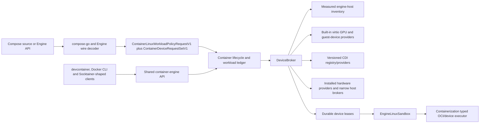

# Local Deploy Device and Resource Subset Design

| Item | Value |
| --- | --- |
| Status | Implementation underway. The stable stack maps local CPU/memory/PID limits, memory reservation, GPU reservation metadata, and ordinary `replicated-job`/`global-job` restart, detached-start, and readiness behavior. CPU/generic reservation preservation and the common DeviceBroker path for every valid non-GPU device request remain. |
| Scope | `container-compose`, the matched `container` and `containerization` forks, the shared Engine API and `devcontainer` runtime providers |
| Compatibility target | Docker Compose 5.3.1 with Docker Engine 29.2.1 API 1.53 on macOS |
| Stable 0.11.0 Container revision | `9aa1803223e8573f169c2a2effa657392b4d6e30` |
| Stable 0.11.0 Containerization revision | `f0bc99d26cd27ed58b06236421a298d9e4acd5c1` |
| Matched compose-go revision | `v2.14.0` |
| Docker Compose embedded compose-go | `v2.13.0`; focused Deploy schema/device sources are equivalent, but the programme retains the broader parser skew as a Wave 0 differential gate |
| Design date | 31 July 2026 |
| Last documentation review | 15 August 2026 against the 0.11.0 release and current STATUS evidence |

## Goal

Deliver the [Local Deploy reservation parity contract](https://github.com/stephenlclarke/container-compose/issues/276) by matching Docker Compose's local, non-Swarm projection exactly. Docker Compose local mode does not schedule CPU, PID, or generic-resource reservations, and the Compose schema does not accept reservation PIDs or device/generic resource limits. The missing runtime mapping is the complete set of `deploy.resources.reservations.devices` requests, including non-GPU requests. Compose-layer corrections must also preserve or ignore valid scheduler metadata. The job-mode wait and restart correction is `Verified`: the exact main graph builds, its five focused regressions pass, and the strict Docker and CLI certificate passes.

Completion means that the stack:

- maps Deploy CPU, memory, and PID limits to the same ordinary per-container controls as Docker Compose 5.3.1;
- maps Deploy memory reservation to the existing soft-memory control;
- preserves but does not enforce CPU and generic-resource reservations or other scheduler-only Deploy fields;
- sends every valid Deploy device reservation to one lossless DeviceBroker contract rather than rejecting non-GPU requests;
- preserves Docker Engine's ordered OR-of-AND `DeviceRequest` capability model through Compose, the shared Engine API, Container, devcontainer, providers, CDI, and inspection;
- resolves devices from measured engine-host inventory, holds generation-safe leases, applies complete guest/OCI edits, and reports unsupported hardware truthfully;
- retains the working single Apple virtio-GPU subset as a built-in provider while allowing non-GPU and CDI providers;
- keeps service `devices`, service `gpus`, Deploy reservations, privileged inventory, volumes, and Model Runner on coherent, non-conflicting ownership paths; and
- removes local scheduler and normalizer rejection behaviour that Docker Compose does not have.

This design does not add a Swarm scheduler, invent local reservation guarantees, or claim that every macOS device can be passed through.

## Scope

### In scope

- Docker Compose 5.3.1 local projection of `deploy.resources.limits` and `deploy.resources.reservations`.
- Preservation and local no-op behaviour for CPU reservations, generic resources, mode, placement, update/rollback, endpoint mode, and Deploy labels.
- Removal of current valid-schema `unsupportedDeployFields` rejection gates and local job-mode orchestration.
- Typed Compose and Engine `DeviceRequest` models, including ordered OR-of-AND capabilities, driver, count, device IDs, and opaque options.
- One Container-owned DeviceBroker with provider discovery, inventory, CDI, selection, leases, activation, release, recovery, and effective device plans.
- Integration with the shared `EngineLinuxSandbox`, workload ledger, Docker-compatible Engine API, stock/enhanced runtime-provider boundary, and devcontainer.
- Requested/effective inspection, capability reporting, diagnostics, security, migration, failure recovery, behavioural oracles, and performance evidence.

### Explicitly out of scope

- Swarm placement, node constraints, spread preferences, service VIPs, rolling updates, rollbacks, jobs, cluster admission, or generic-resource scheduling.
- Treating `deploy.resources.reservations.cpus` as a cgroup guarantee. Docker Compose local mode does not do so.
- Implementing reservation PIDs, device limits, or generic-resource limits. Those are not valid Compose 5.3.1 schema fields at those locations.
- Making unsupported NVIDIA, CUDA, TPU, USB, PCI, accelerator, or other host hardware appear successful without a provider and live guest evidence.
- Completing every service-level `devices`, CDI, vendor GPU, multiple-GPU, or arbitrary macOS hardware case in the separate Devices and GPU parity row. This design supplies the common primitive, but each advertised provider still needs its own hardware oracle.
- Assigning host Metal resources to Docker Model Runner from a service Deploy GPU reservation. Model Runner has a distinct host-accelerator policy and lease.
- Treating DeviceBroker possession as Docker Engine socket authority or granting the Engine socket to a device-enabled or privileged workload.

## Normative Terms

`MUST`, `MUST NOT`, `SHOULD`, and `MAY` describe implementation requirements. The behavioural oracle is Docker Compose 5.3.1 with Docker Engine 29.2.1 API 1.53. “Engine host” means the Linux host implemented by the shared per-user `EngineLinuxSandbox`; it does not mean the macOS host. A requested device is source/Engine metadata. An effective device is a provider-resolved, leased artefact that has been proved available to the relevant `sandboxGeneration` and, while active, the verified `processGeneration`.

## Corrected Compatibility Boundary

### Exact local resource projection

Docker Compose 5.3.1 builds ordinary Engine `HostConfig.Resources` in this order:

1. apply service-level scalar CPU, memory, PID, block-I/O, and device-cgroup values;
2. overwrite non-zero matching values from `deploy.resources.limits`;
3. apply Deploy memory reservation and append every Deploy reservation device request;
4. append a single aggregated CDI request for qualified service `devices`; and
5. append service `gpus` requests.

The exact Deploy subset is:

| Compose field | Docker Compose 5.3.1 local behaviour | Required Container behaviour |
| --- | --- | --- |
| `deploy.resources.limits.cpus` | Non-zero value sets Engine `NanoCpus`. | Reuse the existing fractional CPU/cgroup v2 quota primitive. Zero remains no limit. |
| `deploy.resources.limits.memory` | Non-zero value sets Engine `Memory`. | Reuse the existing byte-accurate hard-memory limit. |
| `deploy.resources.limits.pids` | Positive value sets Engine `PidsLimit`; zero or negative is not projected. | Reuse the existing positive PIDs cgroup limit and preserve non-positive source values without applying them. |
| `deploy.resources.reservations.memory` | Non-zero value sets Engine `MemoryReservation`. | Reuse the existing soft-memory reservation. |
| `deploy.resources.reservations.cpus` | Preserved in the Compose model and ignored by local Engine projection. | Preserve in `config`, `convert`, source hash, and diagnostics; make no cgroup, VM-sizing, admission, or provider call. |
| `deploy.resources.reservations.generic_resources` | Preserved and ignored by local Compose. | Preserve in source order and hash; make no DeviceBroker or scheduler call. |
| `deploy.resources.reservations.devices` | Every request is appended to Engine `DeviceRequests`. | Preserve every request and route it through DeviceBroker. Do not split the field into supported GPU and rejected non-GPU lists. |
| `deploy.resources.reservations.pids` | Rejected by the Compose 5.3.1 schema. | Leave the compose-go schema error authoritative. Do not create a runtime gap or custom rejection. |
| `deploy.resources.limits.devices` | Rejected by the Compose 5.3.1 schema. | Leave the compose-go schema error authoritative. |
| `deploy.resources.limits.generic_resources` | Rejected by the Compose 5.3.1 schema. | Leave the compose-go schema error authoritative. |

The `types.Resource` Go struct can hold fields that the schema does not permit under `limits` or `reservations`. That implementation detail MUST NOT be turned into a public runtime requirement. Docker Compose 5.3.1 embeds compose-go 2.13.0 while this repository pins 2.14.0; the relevant Deploy schema, `types/device.go`, and `transform/devices.go` contracts are equivalent for this focused design, so their schema result—not the broad Go struct—defines accepted input here. That equivalence does not waive the coherent Wave 0 differential gate for 2.14.0 changes to interpolation, include, extends, or project loading.

### Scheduler-only Deploy fields

Docker Compose local mode accepts and preserves the following but does not implement their Swarm scheduling meaning:

- `deploy.mode`;
- `deploy.labels`;
- `deploy.endpoint_mode`;
- `deploy.placement`;
- `deploy.update_config`;
- `deploy.rollback_config`;
- CPU reservations; and
- generic-resource reservations.

These values remain in `config`/`convert` output and, except for replicas, participate in Docker Compose's service configuration hash. A change can therefore trigger ordinary local container recreation even though the effective resource plan is unchanged. Container Compose MUST preserve that distinction: ignored at runtime does not mean removed from requested state or hashing.

`deploy.replicas` remains the local scale input and is omitted from the service hash. `deploy.restart_policy` remains mapped to the ordinary container restart policy. All other scheduler fields above are metadata only.

In particular, local Docker Compose does not wait for `replicated-job` or `global-job` containers, alter their restart handling, or implement one task per node. With no explicit replica count, those modes follow the normal local scale of one. The local path now preserves that behavior: the prior job-specific wait and restart-policy rejection paths are removed and verified by the exact-graph focused regression and Docker/CLI certificate.

### Device request ordering

Engine `HostConfig.DeviceRequests` order is observable and MUST be retained:

1. all Deploy reservation device requests in source order;
2. one `Driver: "cdi"` request containing all qualified service `devices` in service-device order; and
3. all service `gpus` requests in source order.

Static non-CDI service device mappings remain in `HostConfig.Devices`; `device_cgroup_rules` remain in their separate field. The current Compose implementation combines service GPUs before Deploy GPUs and loses the general Engine request shape. That ordering and representation must be corrected.

## Current Evidence and Blockers

| Layer | Current boundary | Consequence |
| --- | --- | --- |
| Current status | [STATUS.md](../project/STATUS.md) records CPU/generic reservations as valid values that are incorrectly rejected instead of preserved/ignored, non-GPU device reservations as blocked on DeviceBroker, reservation PIDs plus device/generic limits as schema-invalid, and job-specific wait/restart handling as verified removed. | The design-time correction removes the earlier Swarm/runtime conflation without claiming that the remaining implementation exists. |
| Normalizer | [`main.go`](../../Tools/compose-normalizer/main.go) retains raw Deploy data but derives only `DeployGPURequests` and an `UnsupportedDeployFields` list. | Valid generic reservations and non-GPU device reservations are rejected instead of preserved or mapped. |
| Local jobs | `deploy.mode` now follows ordinary local service convergence and restart projection. | The prior extra job-completion wait and restart rejection are verified removed; per-node scheduling remains out of scope. |
| Compose model | [`NormalizedProject.swift`](../../Sources/ComposeCore/NormalizedProject.swift) stores service/Deploy GPU requests as generic values and no general runtime `DeviceRequest`. | Capabilities, defaults, source order, and Engine OR alternatives cannot share one typed contract. |
| Compose projection | [`ComposeOrchestratorRuntimeSupport.swift`](../../Sources/ComposeCore/ComposeOrchestratorRuntimeSupport.swift) converts requests to `--gpus` strings and validates only the single virtio-GPU subset. | Non-GPU, CDI, multiple provider, and Engine API request semantics cannot pass losslessly. |
| Container transport | The matched `LinuxRuntimeData` carries flat `LinuxGPURequest` plus direct guest device mappings. | It cannot carry an Engine OR-of-AND capability request or provider lease identity. |
| Container runtime | The matched runtime knows a short fixed list of guest pseudo-devices and one virtio-GPU/DRM path. | Metadata can be constructed, but there is no discoverable engine inventory, provider resolution, CDI registry, capacity decision, or durable lease. |
| Containerization | The matched lower layer can create typed OCI device nodes/cgroup rules and discover selected guest paths. | It is a suitable plan executor, but it must not become a provider registry or macOS hardware authority. |
| Shared Engine/devcontainer | The Docker-compatible router must accept API `DeviceRequests`, but devcontainer cannot own a second inventory, lease database, or event source. | All clients need the same Container authority and requested/effective record. |

The working CPU, hard/soft memory, PIDs, block-I/O, direct guest-device, and single virtio-GPU paths are retained. This design does not reopen their lower primitives merely because they also appear under `deploy`.

## Canonical Data Model

### Requested Deploy resources

The normalizer continues to retain the complete raw `deploy` object for rendering, hashing, extensions, and future schema evolution. It additionally emits only the typed values needed for local projection:

```swift
public struct ComposeDeployResourceProjection: Codable, Sendable, Equatable {
    public var limits: ComposeLocalResourceLimits
    public var memoryReservationInBytes: Int64?
    public var deviceRequests: ContainerDeviceRequestSetV1
}

public struct ComposeLocalResourceLimits: Codable, Sendable, Equatable {
    public var nanoCPUs: Int64?
    public var memoryInBytes: Int64?
    public var pids: Int64?
}
```

CPU and generic reservations need no typed runtime projection because they remain in the raw requested model only. Their presence MUST NOT produce `unsupportedDeployFields`.

### Lossless Engine device request

```swift
public struct ContainerDeviceRequest: Codable, Sendable, Equatable {
    public var driver: String
    public var count: Int64
    public var deviceIDs: [String]
    public var capabilityAlternatives: [[String]]
    public var options: [String: String]
}

public struct ContainerDeviceRequestProvenanceV1: Codable, Sendable, Equatable {
    public var requestIndex: Int
    public var origin: DeviceRequestOrigin
    public var sourceOrdinal: Int
}

public struct ContainerDeviceRequestSetV1: Codable, Sendable, Equatable {
    public var requests: [ContainerDeviceRequest]
    public var provenance: [ContainerDeviceRequestProvenanceV1]?
}
```

`capabilityAlternatives` is an ordered OR list whose members are ordered AND lists. For example, `[["gpu", "vendor-compute"], ["tpu"]]` means a device/driver may satisfy either both `gpu` and `vendor-compute`, or `tpu`. It does not mean any one of the three strings.

`requests` is the complete Docker-observable value. `provenance` is a non-Docker diagnostic sidecar: when present it has exactly one entry for every request index, contains no duplicate or out-of-range index, and records the source ordinal before request lists are combined. The trusted Compose adapter supplies it. The Docker HTTP adapter always synthesises `.engineAPI` for every decoded request and does not accept a client-supplied origin. A native/legacy request with no trusted sidecar remains `.unknownLegacy`; it MUST NOT be relabelled as Engine API input. Compose provenance may be reconstructed only from verified retained Compose source metadata whose projection digest matches the exact requested list. Provenance never changes HostConfig inspection, config hashing, matching, allocation, provider options, or lease identity.

### Capability identifiers

The shared runtime manifest advertises these independent neutral contracts:

- `io.github.stephenlclarke.container.device-request.v1` guarantees the exact
  nested `ContainerDeviceRequest` wire/persistence/inspect round trip; and
- `io.github.stephenlclarke.container.device-broker.v1` guarantees provider
  discovery, measured inventory, durable `DeviceLease` ownership, CDI/OCI edit
  application, activation/release, and recovery.

A broad sandbox, namespace, or legacy GPU flag never implies either contract.
Missing `device-request.v1` rejects a nested or otherwise non-lossless request
before container mutation; an explicitly negotiated older client may use the
legacy adapter only when the complete request has one exactly representable
GPU-compatible AND member. Missing `device-broker.v1` rejects a brokered
request before container mutation. Once the contract exists, current provider
inventory/capacity/CDI failures retain their separately pinned Docker start
phase rather than being promoted to capability-preflight failures. Providers
report protocol version and provider/inventory generation independently of
these stable capability IDs.

Compose Deploy supplies one flat capability list, so the normalizer wraps it as one AND member. Service `gpus` likewise becomes one AND member after Docker Compose appends the generic `gpu` capability. Engine HTTP clients may supply multiple alternatives, which MUST survive decoding, persistence, provider selection, inspection, and re-encoding unchanged.

Other invariants are:

- capability strings and driver-specific names are case-sensitive and are never globally normalised;
- request order, outer alternative order, inner capability order, device-ID order, and duplicate values are preserved where the Engine preserves them;
- omitted Compose `count` and `device_ids` is defaulted by compose-go to `count: -1` (`all`);
- Compose `count` and `device_ids` exclusivity remains a compose-go validation error. Raw Engine validation rejects only a non-zero `count` combined with non-empty IDs: zero plus IDs selects those IDs, while zero with no IDs remains a valid zero-member request visible to the named provider;
- `count: -1` means all devices selected by the provider, positive count requests that many, and raw Engine zero remains zero rather than being silently changed to one;
- `driver` empty is distinct from an explicitly named provider; and
- `options` is an opaque string map owned by the selected provider. Compose and the shared router do not interpret or redact it by guessing key names.

The runtime records an internal origin for diagnostics but does not expose it as Docker HostConfig:

```swift
public enum DeviceRequestOrigin: String, Codable, Sendable {
    case deployReservation
    case serviceGPU
    case serviceCDI
    case engineAPI
    case unknownLegacy
}

public enum DeviceLogicalOriginV1: String, Codable, Sendable {
    case deployReservation
    case serviceGPU
    case serviceCDI
    case serviceDevice
    case engineAPI
    case privilegedInventory
    case unknownLegacy
}
```

### Inventory, resolution, and lease

```swift
public struct DeviceDescriptor: Codable, Sendable, Equatable {
    public var providerID: String
    public var providerGeneration: UInt64
    public var deviceID: String
    public var driver: String
    public var capabilities: [String]
    public var cdiQualifiedNames: [String]
    public var sharing: DeviceSharingClass
    public var health: DeviceHealth
    public var inventoryGeneration: UInt64
}

public struct DeviceProviderIdentity: Codable, Sendable, Equatable {
    public var providerID: String
    public var providerGeneration: UInt64
}

public enum DeviceLeaseState: String, Codable, Sendable {
    case prepared
    case activating
    case active
    case deactivating
    case deactivated
    case releasing
    case recoveryRequired
    case released
}

public struct ProtectedDeviceTokenReferenceV1: Codable, Sendable, Equatable {
    public var schemaVersion: UInt32
    public var effectID: String
    public var owningControllerID: String
    public var controllerGeneration: UInt64
    public var providerID: String?
    public var providerGeneration: UInt64?
    public var protectedStoreObjectID: String
    public var integrityDigest: String
}

public enum DeviceLogicalSourceReferenceV1: Codable, Sendable, Equatable {
    case deviceRequest(index: Int)
    case directDeviceMapping(index: Int)
    case privilegedInventory
}

public struct DeviceLogicalReferenceV1: Codable, Sendable, Equatable {
    public var source: DeviceLogicalSourceReferenceV1
    public var origin: DeviceLogicalOriginV1
    public var sourceOrdinal: Int
}

public struct DeviceResolvedAllocationV1: Codable, Sendable, Equatable {
    public var allocationID: String
    public var logicalReference: DeviceLogicalReferenceV1
    public var selectedDeviceIDs: [String]
}

public struct DeviceRequestResolutionV1: Codable, Sendable, Equatable {
    public var resolutionID: String
    public var leaseGeneration: UInt64
    public var owningControllerID: String
    public var controllerGeneration: UInt64
    public var providerID: String
    public var providerGeneration: UInt64
    public var ownerContainerID: String
    public var allocations: [DeviceResolvedAllocationV1]
    public var physicalLeaseIDs: [String]
    public var allocationInventoryGeneration: UInt64
    public var resolutionContractDigest: String
    public var activeActivationID: String?
    public var activeProcessGeneration: UInt64?
    public var activeSandboxGeneration: UInt64?
    public var providerReceiptReference: ProtectedDeviceTokenReferenceV1?
    public var providerReceiptDigest: String
    public var state: DeviceLeaseState
}

public struct DeviceLease: Codable, Sendable, Equatable {
    public var leaseID: String
    public var leaseGeneration: UInt64
    public var resolutionID: String
    public var resolutionLeaseGeneration: UInt64
    public var providerID: String
    public var providerGeneration: UInt64
    public var ownerContainerID: String
    public var activeActivationID: String?
    public var activeProcessGeneration: UInt64?
    public var activeSandboxGeneration: UInt64?
    public var logicalReferences: [DeviceLogicalReferenceV1]
    public var selectedDeviceID: String
    public var inventoryGeneration: UInt64
    public var state: DeviceLeaseState
}

public enum EffectiveDeviceMountSourceV1: Codable, Sendable, Equatable {
    case sandboxAttachment(attachmentID: String, guestPath: AbsoluteGuestPath)
    case verifiedGuestPath(path: AbsoluteGuestPath, contentDigest: String)
}

public struct EffectiveDeviceMountEditV1: Codable, Sendable, Equatable {
    public var source: EffectiveDeviceMountSourceV1
    public var target: AbsoluteGuestPath
    public var readOnly: Bool
    public var options: [String]
}

public struct OCIEnvironmentEditV1: Codable, Sendable, Equatable {
    public var allocationID: String
    public var editOrdinal: Int
    public var name: String
    public var value: String
}

public struct EffectiveDevicePlan: Codable, Sendable, Equatable {
    public var leaseIDs: [String]
    public var sandboxAttachments: [SandboxDeviceAttachment]
    public var linuxDevices: [LinuxDeviceNode]
    public var deviceCgroupRules: [LinuxDeviceCgroupRule]
    public var mounts: [EffectiveDeviceMountEditV1]
    public var environment: [OCIEnvironmentEditV1]
    public var hooks: [GuestOCIHook]
    public var annotations: [String: String]
    public var cdiSpecDigests: [String]
}
```

Provider receipts/tokens are secrets. One provider resolution covers the ordered logical allocations sent to the same provider for one workload activation and owns zero or more unique physical `DeviceLease` members. This means a named-driver `count: 0` can retain request-level provider edits without fabricating a device, while count/all and explicit-ID requests are prepared atomically and apply common options/edits exactly once. DeviceBroker coalesces compatible duplicate physical selections inside that resolution before the provider call.

The authority atomically seals the provider's opaque group receipt in its protected store and persists both the non-dereferenceable `providerReceiptReference` and audit digest in `DeviceRequestResolutionV1`; only the selected authority can resolve it for an authenticated provider call. `ProtectedDeviceTokenReferenceV1` is the complete common protected-effect binding. `effectID` is an authority-reserved, globally unique identity for that exact prepared receipt, activation effect, or replacement receipt; two references returned by one activation have different effect IDs. The controller tuple identifies the durable DeviceBroker incarnation, and the provider fields are both present and equal the enclosing exact provider tuple for every device-provider effect. A nil/non-nil mismatch, partial provider pair, or tuple mismatch is invalid.

`protectedStoreObjectID` is meaningful only in the named controller generation's protected store. `integrityDigest` is the authority-lineage HMAC over the canonical reference fields other than `integrityDigest`, the SHA-256 of the bounded raw material, and its immutable resolution/activation/action binding. The controller verifies that HMAC and the complete enclosing tuple before opening the object; detachment, substitution, cross-controller use, and cross-provider-generation replay fail before raw resolution or a provider call. `providerReceiptDigest` remains a non-secret audit digest of the provider outcome and is not a substitute for this integrity binding.

The reference is non-nil in every pre-released state, including recovery-required, and is cleared atomically with exact-generation release acknowledgement. Raw receipts, host file descriptors, privileged handles, and macOS paths never enter Compose state, public Docker inspection, labels, events, or logs. Protected material is retained through uncertain recovery and until that acknowledgement; it is then destroyed while the released resolution/lease tombstones and digest remain for the advertised retry window.

One `DeviceLease` represents one physical `(providerID, providerGeneration, deviceID)` member and may carry several logical references after coalescing. A count/all allocation therefore binds one `.deviceRequest(index:)` reference to several physical leases; one physical lease may simultaneously be referenced by an explicit request, a `.directDeviceMapping(index:)`, and `.privilegedInventory`. This retains `HostConfig.DeviceRequests` and `HostConfig.Devices` as separate Docker-observable lists without fabricating request indexes for direct or privileged expansion. Logical references preserve explanation and compensation/source merge order but do not participate in provider allocation identity.

Each logical source/origin pair is validated: `.deviceRequest(index:)` uses one of the five `DeviceRequestOrigin`-equivalent logical origins, `.directDeviceMapping(index:)` uses `.serviceDevice`, `.engineAPI`, or `.unknownLegacy`, and `.privilegedInventory` uses only `.privilegedInventory`. Contradictory pairs fail internal plan validation rather than producing misleading diagnostics.

## Target Architecture



Container is the canonical owner of requested device records, inventory snapshots, provider identity, leases, effective plans, recovery, and inspection. Containerization applies typed guest/OCI changes and reports what exists in the Linux sandbox. Compose only selects and projects source fields. Devcontainer and Docker HTTP clients use the same Engine authority and cannot retain router-local device state.

The DeviceBroker runs inside the selected enhanced provider or behind its versioned provider protocol. A stock-Apple provider that cannot implement the required device class reports that capability unavailable and fails the corresponding start truthfully. It does not launch a second enhanced daemon or proxy to Docker Desktop/Colima.

## DeviceBroker Contract

### Provider SPI

```swift
public struct DeviceProviderQueryContextV1: Codable, Sendable, Equatable {
    public var schemaVersion: UInt32
    public var providerID: String
    public var providerGeneration: UInt64
    public var requestID: String
}

public enum DeviceProviderEffectActionV1: String, Codable, Sendable, Equatable {
    case resolve
    case prepare
    case activate
    case compensateStagedActivation
    case deactivate
    case release
    case reconcile
}

public struct DeviceProviderOperationContextV1: Codable, Sendable, Equatable {
    public var schemaVersion: UInt32
    public var owningControllerID: String
    public var controllerGeneration: UInt64
    public var providerID: String
    public var providerGeneration: UInt64
    public var ownerContainerID: String
    public var operationID: String
    public var operationGeneration: UInt64
    public var action: DeviceProviderEffectActionV1
    public var idempotencyKey: String
    public var semanticRequestDigest: String
    public var actionRequestDigest: String
}

public struct DeviceProviderOpaqueTokenV1: Sendable {
    public init(validating bytes: Data) throws
    public func withUnsafeBytes<Result>(
        _ body: (UnsafeRawBufferPointer) throws -> Result
    ) rethrows -> Result
}

public struct DeviceProviderCapabilitiesV1: Codable, Sendable {
    public var context: DeviceProviderQueryContextV1
    public var protocolVersion: UInt32
    public var supportedDrivers: [String]
    public var supportsCDI: Bool
    public var contractDigest: String
}

public struct DeviceInventoryRequestV1: Codable, Sendable {
    public var context: DeviceProviderQueryContextV1
}

public struct DeviceInventorySnapshotV1: Codable, Sendable {
    public var context: DeviceProviderQueryContextV1
    public var inventoryGeneration: UInt64
    public var devices: [DeviceDescriptor]
}

public struct ContainerDirectDeviceMappingV1: Codable, Sendable {
    public var source: AbsoluteGuestPath
    public var target: AbsoluteGuestPath
    public var permissions: String
}

public enum DeviceProviderAllocationSourceV1: Codable, Sendable {
    case deviceRequest(index: Int, request: ContainerDeviceRequest)
    case directDeviceMapping(index: Int, mapping: ContainerDirectDeviceMappingV1)
    case privilegedInventory
}

public struct DeviceProviderAllocationIntentV1: Codable, Sendable {
    public var allocationID: String
    public var logicalReference: DeviceLogicalReferenceV1
    public var source: DeviceProviderAllocationSourceV1
}

public struct DeviceProviderResolvedAllocationV1: Codable, Sendable {
    public var allocationID: String
    public var logicalReference: DeviceLogicalReferenceV1
    public var source: DeviceProviderAllocationSourceV1
    public var selectedDeviceIDs: [String]
}

public struct DeviceResolveRequestV1: Codable, Sendable {
    public var context: DeviceProviderOperationContextV1
    public var expectedInventoryGeneration: UInt64
    public var allocations: [DeviceProviderAllocationIntentV1]
}

public struct DeviceResolveResultV1: Codable, Sendable {
    public var request: DeviceResolveRequestV1
    public var resolvedAllocations: [DeviceProviderResolvedAllocationV1]
    public var resolutionContractDigest: String
}

public struct DeviceLeaseReservationV1: Codable, Sendable {
    public var leaseID: String
    public var leaseGeneration: UInt64
    public var selectedDeviceID: String
}

public struct DevicePrepareRequestV1: Codable, Sendable {
    public var context: DeviceProviderOperationContextV1
    public var resolutionID: String
    public var resolutionLeaseGeneration: UInt64
    public var preparedReceiptEffectID: String
    public var allocations: [DeviceProviderResolvedAllocationV1]
    public var physicalLeases: [DeviceLeaseReservationV1]
    public var expectedInventoryGeneration: UInt64
    public var resolutionContractDigest: String
}

public struct PreparedDeviceResolutionV1: Sendable {
    public var request: DevicePrepareRequestV1
    public var allocationInventoryGeneration: UInt64
    public var receiptMaterial: DeviceProviderOpaqueTokenV1
}

public struct DeviceResolutionIntentV1: Codable, Sendable {
    public var context: DeviceProviderOperationContextV1
    public var resolutionID: String
    public var resolutionLeaseGeneration: UInt64
    public var allocations: [DeviceProviderResolvedAllocationV1]
    public var physicalLeases: [DeviceLeaseReservationV1]
    public var allocationInventoryGeneration: UInt64
    public var resolutionContractDigest: String
    public var activeActivationID: String?
    public var receiptReference: ProtectedDeviceTokenReferenceV1
}

public struct DeviceResolutionCallV1: Sendable {
    public var intent: DeviceResolutionIntentV1
    public var receiptMaterial: DeviceProviderOpaqueTokenV1
}

public struct DeviceActivationIntentV1: Codable, Sendable {
    public var activationID: String
    public var activationEffectID: String
    public var replacementReceiptEffectID: String
    public var resolution: DeviceResolutionIntentV1
    public var candidateProcessGeneration: UInt64
    public var sandboxGeneration: UInt64
}

public struct DeviceActivateRequestV1: Sendable {
    public var intent: DeviceActivationIntentV1
    public var preparedReceiptMaterial: DeviceProviderOpaqueTokenV1
}

public struct ProviderDeviceEditFragmentV1: Codable, Sendable {
    public var sandboxAttachments: [SandboxDeviceAttachment]
    public var linuxDevices: [LinuxDeviceNode]
    public var deviceCgroupRules: [LinuxDeviceCgroupRule]
    public var mounts: [EffectiveDeviceMountEditV1]
    public var environment: [OCIEnvironmentEditV1]
    public var hooks: [GuestOCIHook]
    public var annotations: [String: String]
    public var cdiSpecDigests: [String]
}

public struct ProviderSourceDeviceEditsV1: Codable, Sendable {
    public var allocationID: String
    public var edits: ProviderDeviceEditFragmentV1
}

public struct ProviderPhysicalDeviceEditsV1: Codable, Sendable {
    public var leaseID: String
    public var selectedDeviceID: String
    public var edits: ProviderDeviceEditFragmentV1
}

public struct ProviderDeviceEditsV1: Codable, Sendable {
    public var sourceEdits: [ProviderSourceDeviceEditsV1]
    public var physicalDeviceEdits: [ProviderPhysicalDeviceEditsV1]
}

public struct EffectiveDeviceEditsV1: Sendable {
    public var request: DeviceActivateRequestV1
    public var activationEffectTokenMaterial: DeviceProviderOpaqueTokenV1
    public var committedReceiptMaterial: DeviceProviderOpaqueTokenV1
    public var edits: ProviderDeviceEditsV1
}

public enum DeviceProviderEffectAttemptPhaseV1: String, Codable, Sendable {
    case requestPersisted
    case responseSealed
    case compensating
    case recoveryRequired
    case committed
    case complete
}

public struct DevicePrepareAttemptV1: Codable, Sendable {
    public var schemaVersion: UInt32
    public var request: DevicePrepareRequestV1
    public var preparedReceiptReference: ProtectedDeviceTokenReferenceV1?
    public var preparedReceiptDigest: String?
    public var phase: DeviceProviderEffectAttemptPhaseV1
}

public struct DeviceActivationAttemptV1: Codable, Sendable {
    public var schemaVersion: UInt32
    public var intent: DeviceActivationIntentV1
    public var activationEffectReference: ProtectedDeviceTokenReferenceV1?
    public var replacementReceiptReference: ProtectedDeviceTokenReferenceV1?
    public var activationEffectDigest: String?
    public var replacementReceiptDigest: String?
    public var editsDigest: String?
    public var phase: DeviceProviderEffectAttemptPhaseV1
}

public enum DevicePrepareObservationV1: String, Codable, Sendable {
    case prepared
    case absent
    case uncertain
}

public struct DevicePrepareReconcileResultV1: Sendable {
    public var request: DevicePrepareRequestV1
    public var observation: DevicePrepareObservationV1
    public var prepared: PreparedDeviceResolutionV1?
}

public enum DeviceActivateObservationV1: String, Codable, Sendable {
    case activated
    case absent
    case uncertain
}

public struct DeviceActivateReconcileResultV1: Sendable {
    public var request: DeviceActivateRequestV1
    public var observation: DeviceActivateObservationV1
    public var activated: EffectiveDeviceEditsV1?
}

public struct DeviceDeactivateRequestV1: Sendable {
    public var resolution: DeviceResolutionCallV1
    public var activeProcessGeneration: UInt64
    public var activeSandboxGeneration: UInt64
}

public struct DeviceCompensateStagedActivationRequestV1: Sendable {
    public var resolution: DeviceResolutionCallV1
    public var activationID: String
    public var candidateProcessGeneration: UInt64
    public var sandboxGeneration: UInt64
    public var activationEffectTokenMaterial: DeviceProviderOpaqueTokenV1
}

public struct DeviceReleaseRequestV1: Sendable {
    public var resolution: DeviceResolutionCallV1
}

public struct DeviceReconcileRequestV1: Sendable {
    public var resolution: DeviceResolutionCallV1
    public var expectedActiveProcessGeneration: UInt64?
    public var expectedActiveSandboxGeneration: UInt64?
    public var stagedActivationID: String?
    public var stagedCandidateProcessGeneration: UInt64?
    public var stagedSandboxGeneration: UInt64?
    public var stagedActivationEffectTokenMaterial: DeviceProviderOpaqueTokenV1?
}

public enum DeviceProviderObservedStateV1: String, Codable, Sendable {
    case prepared
    case active
    case deactivated
    case absent
    case uncertain
}

public struct DeviceProviderAcknowledgementV1: Sendable {
    public var resolution: DeviceResolutionCallV1
    public var observedState: DeviceProviderObservedStateV1
}

public struct DeviceDeactivateAcknowledgementV1: Sendable {
    public var resolution: DeviceResolutionCallV1
    public var activeProcessGeneration: UInt64
    public var activeSandboxGeneration: UInt64
    public var observedState: DeviceProviderObservedStateV1
}

public struct DeviceStagedCompensationAcknowledgementV1: Sendable {
    public var resolution: DeviceResolutionCallV1
    public var activationID: String
    public var candidateProcessGeneration: UInt64
    public var sandboxGeneration: UInt64
    public var activationEffectTokenMaterial: DeviceProviderOpaqueTokenV1
    public var observedState: DeviceProviderObservedStateV1
}

public struct DeviceReconcileResultV1: Sendable {
    public var request: DeviceReconcileRequestV1
    public var observedState: DeviceProviderObservedStateV1
    public var observedProcessGeneration: UInt64?
    public var observedSandboxGeneration: UInt64?
}

public protocol ContainerDeviceProvider: Sendable {
    var identity: DeviceProviderIdentity { get }

    func capabilities(_ context: DeviceProviderQueryContextV1) async throws -> DeviceProviderCapabilitiesV1
    func inventory(_ request: DeviceInventoryRequestV1) async throws -> DeviceInventorySnapshotV1
    func resolve(_ request: DeviceResolveRequestV1) async throws -> DeviceResolveResultV1
    func prepare(_ request: DevicePrepareRequestV1) async throws -> PreparedDeviceResolutionV1
    func reconcilePrepare(
        _ request: DevicePrepareRequestV1
    ) async throws -> DevicePrepareReconcileResultV1
    func activate(_ request: DeviceActivateRequestV1) async throws -> EffectiveDeviceEditsV1
    func reconcileActivate(
        _ request: DeviceActivateRequestV1
    ) async throws -> DeviceActivateReconcileResultV1
    func deactivate(_ request: DeviceDeactivateRequestV1) async throws -> DeviceDeactivateAcknowledgementV1
    func compensateStagedActivation(_ request: DeviceCompensateStagedActivationRequestV1) async throws -> DeviceStagedCompensationAcknowledgementV1
    func release(_ request: DeviceReleaseRequestV1) async throws -> DeviceProviderAcknowledgementV1
    func reconcile(_ request: DeviceReconcileRequestV1) async throws -> DeviceReconcileResultV1
}
```

Providers are installed through the shared signed/allowlisted provider registry. A Compose file can name a driver and pass options, but it cannot select an executable path, load an unsigned bundle, alter the provider search path, or grant a provider new macOS entitlements.

Every response repeats its complete request, including action, operation,
controller/provider, resolution, reserved effect and member-lease identities,
ordered allocations, semantic and action digests, and relevant generation
fields. Any mismatch is a provider protocol fault and cannot change durable
state. In particular, deactivate
acknowledgement repeats the committed active process/sandbox tuple,
staged-compensation acknowledgement repeats the candidate tuple and effect
token, and release acknowledgement is resolution-scoped.

`DeviceProviderOpaqueTokenV1` is a bounded private-provider-wire value only:
its throwing initializer enforces the protocol's non-empty maximum size, its
scoped byte accessor lets an external provider consume it without a public
stored property, and the authenticated provider transport supplies its only
codec. It deliberately has no general `Codable` conformance and is rejected by
every durable persistence, inspect, event, and logging encoder. Codable intents
hold only `ProtectedDeviceTokenReferenceV1`; the authority first matches its
effect/controller/provider fields to the immutable request and verifies its
lineage HMAC, then resolves it immediately before the matching authenticated
call and zeroises the raw bytes afterwards. Provider idempotency records
likewise retain raw output only in a provider-private sealed store and persist
complete references/digests in their general reservation table.

For side-effect-free resolve, the semantic digest covers the canonical ordered
allocation intents and expected inventory generation. For later effects it
covers controller/provider/container identity, ordered resolved allocations,
exact controller, inventory and resolution/member generations, reserved output
effect IDs, and `resolutionContractDigest`. The action digest additionally
covers the method action, stable `operationID`, exact resolution or
`activationID`, process/sandbox fence, and every complete protected input
reference including its integrity digest. Raw token bytes, provider output,
timestamps, retry counters, and diagnostic provenance are excluded. The
provider independently recomputes both digests. Reuse of a scoped idempotency
key or effect ID with a different action or digest is a conflict, not another
operation.

`operationGeneration` remains the parent lifecycle/create/start/removal ledger
attempt defined by the common taxonomy. `operationID` and the provider
idempotency key are stable controller-action identities derived beneath that
attempt; they do not mint another client operation or replace its canonical
idempotency record. The focused semantic digest is derived from the parent's
semantic digest plus the exact device contract fields above.

`activeActivationID`, `activeProcessGeneration`, and
`activeSandboxGeneration` are one closed durable tuple. They are all nil for a
prepared, activating, deactivated, releasing, or released resolution/member and
all non-nil for active/deactivating state. An activation intent requires the
resolution tuple nil and supplies its candidate `activationID` separately;
committed deactivate/reconcile calls carry the exact published active tuple.

The allocation-source enum prevents the common broker from inventing a
`DeviceRequest` index for direct mappings or privileged expansion. `resolve` is
side-effect free, receives every unchanged request/options payload plus the
exact inventory generation, and returns selected IDs for each allocation while
echoing the request. This lets a named provider interpret opaque
options/count/IDs before the authority reserves IDs; a stale inventory or
malformed/duplicate selection rejects the result. The provider's contract
digest covers its exact request, inventory generation, selected allocations,
and resolution contract. The authority persists it and requires it unchanged
in prepare/activate/reconcile/release; a changed digest forces fresh
side-effect-free resolution rather than reinterpreting prepared state.

Before `prepare`, the authority reserves the resolution, every physical lease
ID/generation, `preparedReceiptEffectID`, and one stable
operation/idempotency identity. It writes the byte-canonical
`DevicePrepareRequestV1` and a `requestPersisted` attempt to the common ledger
before calling the provider. The provider durably reserves the tuple
`(controllerGeneration, providerGeneration, resolutionID,
resolutionLeaseGeneration, preparedReceiptEffectID, action, operationID,
idempotencyKey, semanticRequestDigest, actionRequestDigest)`, assigns its stable
provider reservation ID, and commits that record before its first allocation
effect. It tags every created effect with the reservation, resolution, receipt
effect, and member IDs before or atomically with making the effect visible. A
provider whose substrate cannot do that must first persist an equally stable
effect-handle mapping and cannot advertise the path otherwise. It then persists
the complete `PreparedDeviceResolutionV1` in its protected outcome store before
replying. An exact `prepare` retry reopens the same reservation and sealed opaque
receipt and returns that byte-identical response, including the same receipt
bytes.

If the prepare reply is lost before the authority receives or seals its
receipt, `reconcilePrepare` accepts the original persisted request and no token.
It returns the same prepared response, proved `absent`, or `uncertain`.
`prepared` requires the response and exact echoed request; `absent` and
`uncertain` require nil. A prepared response's
`allocationInventoryGeneration` must equal the request's expected generation.
Proved absence permits the same request to resume or the attempt to abort
durably; uncertainty blocks both another prepare key and another resolution for
those members. Provider recovery reopens its reservation and tagged effects
rather than scanning hardware or allocating again.

After validating a prepared response, the authority seals the receipt under a
reference whose effect ID exactly equals the request's
`preparedReceiptEffectID` and whose controller/provider tuple matches its
context, then atomically advances the attempt to `responseSealed`; the following
commit transfers, rather than copies, that protected reference into the new
`prepared` resolution. One prepare call covers the complete ordered logical
allocation group and zero-or-more de-duplicated authority-reserved physical
leases. Every allocation has an authority-assigned globally unique
`allocationID`; source ordinals remain diagnostic and can collide across origin
classes. The later activation response returns exactly one common fragment
keyed by each allocation ID plus at most one per-device fragment keyed by the
authority lease ID and selected ID; it never changes authority identity.

DeviceBroker validates exact one-time coverage and computes total merge order itself: allocation-array order first, each allocation's source fragment next, and each unique physical fragment at its first selected-ID reference in that allocation's original device order. If several logical allocations first reference the same coalesced member, the earliest allocation-array entry owns that fragment; every environment edit in it carries that allocation's ID and a contiguous fragment-local ordinal. Arrays inside a fragment retain provider order, so duplicate keys are not lost in a dictionary. The broker resolves collisions, attaches its own lease IDs, and produces the one `EffectiveDevicePlan`. Provider mounts are already-authorised effective guest/OCI edits and cannot re-enter host-path or mount-provider resolution.

Provider methods use bounded input/output, deadlines, cancellation, exact
action/idempotency digests, `providerGeneration`, and resolution/member
`leaseGeneration` checks, with structured errors. Inventory selection and a new
`prepare` require the current exact `inventoryGeneration`; an inventory advance
invalidates a side-effect-free candidate and causes re-resolution. Recovery of
an already reserved prepare/activation, deactivate, release, and general
reconcile carry the recorded allocation inventory generation as provenance but
MUST NOT reject recovery/cleanup merely because a later inventory snapshot
exists. The exact provider generation, resolution/member identities and
generations, and protected receipt route calls safely, including a zero-member
resolution.

A live handle is additionally fenced by its paired
`activeProcessGeneration` and `activeSandboxGeneration`. Before `activate`, the
authority reserves `activationID`, distinct `activationEffectID` and
`replacementReceiptEffectID` values, and an action-specific
operation/idempotency identity, then persists `DeviceActivationIntentV1` and a
`requestPersisted` attempt. Neither reserved output effect ID may equal the
other or the prepared receipt's effect ID. That durable intent contains only
the complete protected prepared-receipt reference. The non-Codable wire request
resolves that existing receipt and carries no unprotected durable token.

The provider assigns and persists a stable activation reservation under the
complete action/operation/idempotency/digest identity plus `activationID`, both
distinct output effect IDs, and the exact candidate process/sandbox tuple before
its first attachment or guest/OCI effect. It tags the effect with that
reservation, activation identity, and `activationEffectID` before or atomically
with visibility under the same tag/handle rule, then persists the complete
edits, staged-compensation token under `activationEffectID`, and replacement
committed receipt under `replacementReceiptEffectID` in its protected outcome
store before replying. An exact `activate` retry reopens that reservation and
those sealed outputs and returns the same byte-identical
`EffectiveDeviceEditsV1`, including both token byte strings. A crash between
effect and response persistence reopens the reservation and tagged effect; it
cannot attach a second handle.

If the activation reply is lost, `reconcileActivate` accepts the exact original
activation request using the already-owned prepared receipt but no activation
effect token or replacement receipt. It returns the same activated response,
proved `absent`, or `uncertain`. `activated` requires the exact response and
request echo; `absent` and `uncertain` require nil. Absence permits only the same
activation request to resume or a durable abort; uncertainty blocks a new
activation key, process candidate, and start commit.

In this activation lost-reply contract, “tokenless” means independent of both
missing output tokens; the provider still authenticates the already-owned
prepared receipt that predates the activation call. It cannot demand either
output as the key for discovering whether that call took effect.

The authority requires the two returned references to carry the two distinct
reserved effect IDs and the same controller/provider tuple, and seals both
returned tokens and the edits digest together before advancing the activation
attempt to `responseSealed`. A failed candidate uses
the original prepared resolution receipt plus its distinct candidate
tuple/effect token. Exact compensation acknowledgement invalidates the
replacement candidate receipt before those candidate references are destroyed.
The successful process-start commit atomically transfers the replacement
receipt into the resolution, publishes `activationID` plus the active
process/sandbox tuple in the resolution/member leases, records the edits digest,
destroys the authority's staged-only effect token and superseded prepared
receipt material. Its immutable attempt intent retains only the old complete
reference as non-dereferenceable audit evidence after its protected-store object
is tombstoned. The provider's
sealed read-only replay outcome remains through the advertised retry window but
cannot authorise a new effect. Committed deactivate/reconcile therefore use the
new resolution receipt and exact active tuple; no active handle is stranded. A
durable deactivated resolution has all three active fields nil.

Attempt field combinations are closed. `requestPersisted` has no output
reference/digest. A prepare `responseSealed` attempt has exactly its prepared
receipt reference/digest; an activation `responseSealed` attempt has both token
references, both token digests, and `editsDigest`. `compensating` retains every
candidate reference needed for exact cleanup. `recoveryRequired` retains the
complete field set of the interrupted phase. `committed` transfers the live
receipt reference to `DeviceRequestResolutionV1` and retains only audit digests
plus the complete non-dereferenceable references in its immutable request after
their protected-store objects are tombstoned;
`complete` owns no live protected record. An optional cannot be cleared merely
to make an attempt appear earlier or terminal.

Staged compensation, committed deactivation, and release use the same
request-before-effect rule. The activation attempt or lifecycle/removal step
persists the canonical resolution intent, exact candidate/active tuple, action
identity, and protected token digests before resolving raw material. The
provider persists an action reservation before detaching/releasing and its
terminal acknowledgement before replying. An exact retry or general
`reconcile` returns the same `deactivated`/`absent` outcome or `uncertain`; only
the exact terminal acknowledgement permits the authority to destroy references
or advance release. A lost cleanup reply cannot admit another action key or
target a newer activation.

Legal durable resolution transitions are `prepared -> activating -> active ->
deactivating -> deactivated`, `activating -> prepared` only after exact
staged-effect compensation acknowledgement, `prepared|deactivated -> releasing
-> released`, and any non-terminal state to `recoveryRequired`. Member leases
change in the same atomic authority commit: every member names the same
resolution/generation, no member may be active when its resolution is not
active, and a resolution cannot become released until every member is released.
Compatible duplicate selections are represented as several logical references
on one member within the resolution, never as cross-resolution ownership. The
resolution and every member have the same activation/process/sandbox tuple or
all three fields nil. A zero-member resolution follows the same state machine.

Method/action combinations are closed: `resolve`, `prepare`, `activate`, staged
compensation, deactivate, release, and general reconcile accept only their
matching context action. `reconcilePrepare` accepts only the byte-identical
original `.prepare` request; `reconcileActivate` accepts only the original
`.activate` intent and prepared receipt. The staged fields of a general
reconcile are activation ID, process generation,
sandbox generation, and activation token—and are all nil or all non-nil because
the two tokenless lost-reply windows use their distinct methods. An active
general reconcile has the resolution's non-nil `activeActivationID`, both
expected active generations, and no staged fields. A staged reconcile has a nil
active tuple and all four staged fields. Prepared/deactivated reconciliation
has neither tuple, and mixed shapes fail before observation. An `active` result
has both observed generations matching the request; every other observation
has both nil. Every result echoes its complete request before an observation
can commit. Every wire token must match the content digest of the protected
reference in its intent before the provider may act.

Recovery may move to a non-terminal state only after provider/guest proof of
that exact resolution/member/activation state; it otherwise proceeds to
generation-routed staged compensation or release. Provider reservations and
cached outcomes are retained through the advertised retry window. `released`
is a terminal authority/provider idempotency tombstone. A retry joins or returns
the recorded transition and exact response; it never creates a second
resolution, activation, or physical lease.

A provider update is deliberately drain-only. It stages a new
`providerGeneration`, stops admitting new allocations to the old generation,
and continues routing every old receipt/resolution/member/attempt operation to
that exact old generation. Every non-terminal prepare or activation attempt
must reconcile and commit/compensate, all active users must stop/finalise, and
every prepared, deactivated, or recovery-required old-generation
resolution—including zero-member—and every member lease must reach
acknowledged `released`; every legacy-live blocker described below must also
clear. Only then may aliases switch atomically and new resolution begin. There
is no implicit token or live-lease migration SPI. A new generation never
interprets, activates, deactivates, reconciles, or releases an old generation's
receipt. Update recovery resumes from the durable drain phase and cannot make
both generations selectable.

### Inventory is hardware truth

Inventory is obtained from actual engine-host/guest/provider observation, not inferred from Compose capabilities. A descriptor is advertised only when the provider can produce the required sandbox attachment and guest edits on the current host/kernel/provider generation.

- A missing Linux guest node is unavailable, even if a macOS API reported a device.
- A device that Virtualization.framework or the guest transport cannot expose is absent from the Engine inventory.
- A stale or unhealthy descriptor cannot satisfy a new request.
- NVIDIA/CUDA, TPU, USB, block, graphics, and vendor-specific claims require provider-specific live probes.
- Privileged expands to the same measured Engine inventory. It never scans or forwards arbitrary macOS `/dev` entries.

Every provider oracle verifies behaviour from inside the workload: device type, major/minor where applicable, permissions, driver/library visibility, I/O or computation, detach, and recovery. Inspect metadata alone is insufficient.

### Matching and allocation

For a request with no explicit driver, DeviceBroker evaluates providers in a stable authority-defined priority order and tests capability alternatives in their original outer order. A descriptor satisfies an AND member only when it has every exact capability in that member. The first provider/alternative that can satisfy the complete request is selected. Provider ordering and selected alternative are recorded in protected diagnostics so a change cannot occur silently after upgrade.

For an explicitly named driver, the matching provider receives the unchanged request. As in Moby, capability matching does not select another provider behind an explicit driver; the named provider remains responsible for validating or interpreting the request.

Allocation rules are:

- all requests in the ordered list are cumulative and must succeed;
- explicit IDs must resolve within the selected provider and retain source order;
- a positive count allocates the requested number under provider share/exclusive rules;
- `-1` snapshots and leases all matching devices at the allocation generation;
- raw zero with explicit IDs selects those IDs; raw zero without IDs remains a provider-visible zero-member logical resolution that may return request-level edits;
- replicas allocate independently, so an exclusive device may allow replica one and reject replica two;
- local mode never queues for another node, moves a workload, or waits for cluster capacity; and
- failure of any request compensates leases created by that activation attempt in reverse order.

Privileged inventory expansion and explicit `DeviceRequests` are cumulative in
policy but not duplicate physical allocation. Within one container activation,
DeviceBroker coalesces the same `(ownerContainerID, providerID,
providerGeneration, deviceID)` into one physical
`DeviceLease`/`leaseGeneration` and records every logical request reference on
it. Explicit provider options and CDI environment/mount/hook edits still
apply exactly once in source order. Incompatible option selections, CDI edits,
sharing modes, or provider identities for the same physical device fail at the
pinned phase rather than self-conflicting or silently winning. Docker inspect
retains the original ordered requested `DeviceRequests`; native effective
inspection separately shows the de-duplicated privileged inventory and logical
request-to-lease mapping.

Provider options participate in request identity and lease idempotency. They are passed once to the selected provider and are not translated into unrelated Container or Virtualization.framework flags.

### Built-in providers

The first implementation registers:

- the existing single virtio-GPU/DRM path as the `virtio` GPU provider, retaining its supported `all`, count one, device ID `0`, no-option, generic-`gpu` subset;
- the existing known Linux guest device path resolver as a guest-device provider rather than a hard-coded Compose exception;
- the CDI provider/registry described below; and
- provider test fixtures that exercise non-GPU capabilities, counts, IDs, sharing, disappearance, and failure without pretending that fixture metadata is real production hardware.

The existing GPU path becomes one provider behind the common request model. Only non-GPU reservation requests require genuinely new provider coverage to close this specific row, but keeping a separate GPU-only transport would preserve the current data loss and conflict with Engine API, privileged, CDI, and future vendor providers.

## Create, Start, Stop, and Recovery Semantics

Device intent and active hardware are different lifecycle resources. This design refines the common workload transaction accordingly:

1. container create validates the request shape and persists the exact requested `HostConfig.DeviceRequests` with the stopped workload;
2. provider compatibility, current inventory, allocation, CDI resolution, and OCI injection create or reconcile a `leaseGeneration`, then persist domain-owned handles in the DeviceBroker's protected store and place only their protected references/digests in the operation ledger against `activationID`, `candidateProcessGeneration`, and the verified `sandboxGeneration`; the durable lease's active triple is published only by the successful process-start commit;
3. a start failure records the Docker-compatible error and compensates every uncommitted lease without erasing requested HostConfig;
4. pause retains leases and effective device state;
5. explicit and automatic restart clear the old `activeActivationID`, `activeProcessGeneration`, and `activeSandboxGeneration`; during automatic-restart backoff they may retain only a deactivated ownership reservation with all three fields nil when the provider proves that safe, then reconcile and bind it to the verified new activation/process/sandbox tuple before exposing the process as running;
6. a terminal exit with no restart deactivates/releases every `DeviceRequestResolutionV1` (including zero-member) and all of its physical members while retaining requested HostConfig;
7. ordinary stop performs that resolution/member release only after the process can no longer use request-level or physical effects, while retaining requested HostConfig for a later start;
8. removal verifies every resolution receipt and member deactivation/release as part of the lifecycle `removing` transaction; a failure leaves a recoverable `dead` record rather than losing ownership; and
9. authority or guest restart first resumes every persisted prepare/activation attempt through its exact normal or tokenless reconcile contract, then reconciles provider truth, sandbox attachments, effective OCI state, and lease records before admitting new allocations.

For an active resolution, `ProcessExitFinalizationV1.activationRecordID` is its
exact `activeActivationID`. The focused activation digest covers the resolution
and every member ID/generation, provider/inventory clocks, active
activation/process/sandbox tuple, contract/edits digest, and current provider
receipt reference/digest. The device controller persists the corresponding
deactivate action before its provider effect and clears the active triple only
after an acknowledgement matching that complete snapshot. A stale finaliser
cannot detach a later activation even when it reuses the same physical device.

Moby resolves general DeviceRequests while creating the OCI spec for container start, not while accepting ContainerCreate. The oracle lane MUST pin exact error phase and residual state for missing drivers, CDI errors, unavailable IDs, and capacity conflicts. Container Compose MUST NOT restore its current pre-create non-GPU rejection merely to make failures earlier.

During Docker-public `restarting`, the old process has exited but the container
remains a running lifecycle owner. Live handles and physical allocation are
always deactivated/released after exit. Only the explicitly safe deactivated
ownership reservation described above may remain during restart backoff to
prevent another workload taking the exclusive device; it binds to no process
until reconciliation with the verified next `processGeneration`.

Every lease uses immutable container ID, not mutable name. Rename does not affect ownership. A config-hash change that recreates a container obtains a new immutable ID and new leases through the ordinary replacement transaction.

## CDI Integration

Docker Compose treats a service `devices` entry as CDI when source equals target and the value is a qualified CDI name. It aggregates those names into one Engine request with `Driver: "cdi"`, zero count, no options, and the names in `DeviceIDs`. Other service device entries remain direct-path-shaped in the Compose model, HostConfig, and Docker inspection, but the enhanced effective path resolves them through DeviceBroker's built-in guest-device provider. That provider acquires a domain `DeviceLease`, participates in privileged coalescing and rootfs/volume block-identity conflict checks, and then emits the exact requested node/cgroup mapping; “direct” never means an unowned executor bypass.

The shared CDI implementation MUST:

- pin one supported CDI specification/library version with its Engine compatibility matrix;
- load configured static and provider-generated CDI specs into an atomic registry snapshot;
- retain spec digest, provider identity, validation errors, and inventory generation;
- apply common and per-device container edits, including device nodes, cgroup permissions, mounts, environment, hooks, and annotations in specification order;
- merge CDI edits with service mounts, environment, security, volume, and direct-device plans using Docker/CDI conflict or overwrite behaviour established by oracle;
- pin running leases to the resolved spec digest so a registry refresh cannot mutate an existing workload;
- make new starts/restarts resolve the oracle-confirmed current snapshot;
- surface malformed, duplicate, missing, or unavailable qualified names at the correct start phase; and
- report CDI registry health through protected Engine diagnostics without leaking provider paths or credentials.

CDI paths and hooks are interpreted in the provider/Engine Linux host context. A Linux CDI hook is never executed as an unrestricted macOS process. Host device handles and paths are converted to brokered sandbox attachments; guest OCI hooks run only in the controlled Linux runtime context. If a CDI edit cannot be represented securely on this platform, activation fails rather than dropping that edit.

## Resource and Scheduling Semantics

### Ordinary limits remain ordinary cgroup controls

Deploy limits do not create a second resource controller. CPU, memory, memory reservation, and PIDs values are folded into the same neutral requested `ContainerLinuxResourcePolicyRequestV1` as their service-level equivalents and resolve to the canonical effective `LinuxWorkloadResourceConfiguration`. compose-go already checks consistency when both source forms are present. The resolved cgroup values, warnings, live update support, OOM state, and inspection belong to [the remaining resource and security controls design](remaining-resource-security-controls-design.md) and [the lifecycle design](docker-lifecycle-states-actions-design.md).

In the shared sandbox, these controls apply to each private workload cgroup. They do not resize the VM for every service or reserve capacity against other projects. Sandbox capacity policy may reject an impossible hard limit for host safety, but it MUST NOT reinterpret a Compose CPU reservation as admission.

### Ignored reservations stay requested only

CPU and generic reservations:

- remain byte/value/order exact in the normalised Compose model;
- remain visible in `config` and `convert`;
- participate in the service hash exactly as the reference does;
- do not enter effective `LinuxWorkloadResourceConfiguration` cgroup fields;
- do not create DeviceBroker, volume, model, or generic-resource leases;
- do not change replica placement or start ordering; and
- do not generate unsupported warnings in normal local mode.

There is no local “generic resource provider”. Adding one would create scheduler semantics that Docker Compose local mode intentionally does not use.

## Cross-Design Interactions

| Area | Required contract |
| --- | --- |
| Service `devices` | Direct path mappings preserve their Docker source/inspect shape but resolve through the built-in guest-device provider and a DeviceBroker lease before creating exact nodes/cgroup rules. Qualified CDI selectors route through the same broker. An access rule alone never provisions hardware. |
| Service `gpus` | Converts to ordinary DeviceRequests after Deploy reservation requests. The existing virtio subset is a provider, not a separate flattened protocol. |
| Privileged | Privileged receives all measured Engine-host inventory plus wildcard device policy as defined by [the shared namespace/privileged design](shared-namespaces-privileged-isolation-design.md). Explicit DeviceRequests are still processed for provider/CDI edits. Privileged does not expose unbroked macOS devices. |
| Shared namespaces | Devices are workload leases inside one `EngineLinuxSandbox`. PID/IPC/network donors do not automatically share device leases. A provider that can attach only at sandbox boot must be represented as sandbox inventory before workloads start. |
| Lifecycle | Immutable IDs own resolutions/leases/effect attempts; process commit transfers only response-sealed activation ID/process/sandbox state; finalisation matches that full tuple plus receipt digest; restarting retains only safe deactivated reservations; stop/removal release every request-level resolution receipt, including zero-member, plus physical leases; failed or uncertain effect/cleanup participates in recovery and `dead`. Resource-update success commits a new effective revision; a pinned running application failure rolls back effective state but still emits `update`, while earlier validation failure emits none. |
| Volumes and rootfs | The workload ledger rejects a block device, NBD export, rootfs, or volume attachment being allocated independently as both storage and a DeviceRequest. CDI mounts use the common typed mount planner. |
| Security/user namespaces | Device node UID/GID, cgroup/BPF permission, mounts, hooks, capabilities, and ID mapping are resolved as one effective plan. A user namespace cannot gain an unmapped device by metadata alone. |
| Logging | Provider lifecycle diagnostics use protected structured logs and never a container's selected log driver. Opaque options are omitted from routine logs; host paths are redacted. No synthetic Docker device event is invented. |
| Model Runner | Host-native Docker Model Runner uses a distinct host Metal/accelerator admission path. A service Deploy GPU reservation controls only that service workload and does not schedule a model backend. |
| Engine API/devcontainer | The neutral Engine wire model carries nested capabilities losslessly. The selected Container provider owns inventory/leases. Devcontainer's router and SQLite store hold no second device authority. |
| Socktainer direction | Socktainer-shaped Docker clients and guest socket relays are conformance inputs to the shared Engine API. They call the same DeviceBroker-backed authority rather than an embedded Socktainer restart/device database. |

## Requested and Effective Inspection

Docker inspection returns the requested `HostConfig.Resources`, including exact `DeviceRequests`. The shared Engine API MUST round-trip:

- empty or named driver;
- count, including `-1` and zero;
- device IDs;
- nested capability alternatives;
- options; and
- request ordering.

Selected physical IDs for count/all requests, provider tokens, CDI source paths, macOS handles, and security-sensitive edits are not substituted into HostConfig. They are effective authority state. A protected native diagnostic surface MAY report provider ID and `providerGeneration`, selected opaque IDs, lease state, `inventoryGeneration`, health, and spec digest to the current user.

`docker info`/capability reporting identifies installed drivers and CDI health only where the pinned API exposes it. A provider being installed is not proof that a request will succeed; start-time inventory remains authoritative.

No Docker container action exists solely for device allocation. Device provider events remain namespaced internal diagnostics. Container `create`, `start`, `die`, `stop`, `update`, `destroy`, and OOM actions continue to come from the central lifecycle journal.

## Security and Failure Containment

- Provider registration is current-user scoped, signed or explicitly allowlisted, versioned, and independent of Compose source.
- Device options are bounded opaque strings. They never become shell fragments, environment keys, paths, hooks, or XPC selectors without provider-owned parsing.
- Provider output is schema/version validated and constrained to typed sandbox/OCI edits.
- macOS device opens, entitlements, USB access, block handles, and similar authority remain in narrow brokers. Workloads receive revocable opaque guest projections.
- CDI spec files are opened without symlink/path races, size bounded, schema validated, digested, and snapshotted before use.
- Guest-originated requests cannot acquire or release a host device without an authority-issued container/generation transaction.
- User-supplied device IDs, CDI names, driver names, capabilities, and options are escaped and redacted in logs and errors as appropriate.
- A malicious or crashed provider cannot mutate another provider's lease namespace or make the authority mark an unproved device healthy.
- Slow providers have bounded concurrency and cannot block lifecycle/event locks or unrelated device-free container starts.
- Device-free workloads take no provider call and no material latency regression.

## Persistence, Recovery, and Migration

### Schema migration

Add a versioned device-request/lease schema to Container and the neutral Engine protocol. Existing records decode as follows:

- `LinuxGPURequest.capabilities: [String]` becomes one capability AND member;
- the current driver, count, IDs, and options are retained exactly;
- existing direct `LinuxDeviceMapping` values retain their requested/inspect shape; a stopped legacy mapping acquires the built-in guest-device provider lease on its next start, while an already-running legacy mapping remains migration-only until stop/finalisation and a later start or Docker replacement rather than gaining a fabricated live lease;
- no lease or selected physical ID is fabricated for a stopped legacy container;
- a running legacy GPU container remains on its legacy effective plan until deliberate stop/finalisation and a later start or Docker replacement; and
- existing privileged containers are not silently widened to the new all-inventory policy.

Requested data is dual-readable during one compatibility window. Only the selected Container authority writes active leases. Old clients receive the compatible flattened GPU projection only when the request has exactly one GPU-compatible AND member and no information would be lost; otherwise capability negotiation fails before mutation.

Because a running legacy GPU/direct-device workload has no trustworthy v2 lease, migration also creates a durable `LegacyLiveDeviceUseV1` blocker from positively observed legacy runtime state. It records immutable container ID, legacy runtime identity, device-use class, observed process/VM identity, observation revision, and `draining|finalising|cleared|recoveryRequired`; it never fabricates a provider ID, selected device ID, token, or lease generation. Provider alias change and authority handoff require both the v2 lease table and this blocker inventory to prove no active/uncertain use. Crash recovery resumes the legacy owner and observation/finalisation path until a stopped workload is proved clear; absence of a v2 lease is never treated as that proof.

### Remove false rejection state

The Compose migration removes:

- `UnsupportedDeployFields` as a gate for valid Compose 5.3.1 Deploy input;
- `unsupportedDeployLimitFields` and impossible reservation-PID checks;
- generic reservation rejection;
- GPU/non-GPU splitting as the runtime ownership boundary;
- `validateDeploySupport` errors for schema-valid scheduler metadata; and
- any remaining copy of the prior local `replicated-job`/`global-job` wait and restart restrictions; their removal is already verified.

compose-go remains the sole schema validator. A temporary decoder may accept the old derived fields in cached/test JSON, but newly normalised projects no longer emit them.

### Authority and devcontainer cutover

Devcontainer's selected Apple provider adopts the neutral nested `ContainerDeviceRequest` DTO and calls the shared Container authority. Any devcontainer-local resource/event/device metadata is audited only when it can be tied to one immutable Container ID.

The device part of `ProviderHandoffManifestV1` carries only portable requested `HostConfig.Devices`/`DeviceRequests`, their exact order and options, and provenance that is proved by trusted source metadata. Unknown provenance remains `.unknownLegacy`. It explicitly excludes physical leases, selected device IDs, provider-local IDs, inventory generations as destination truth, protected/raw provider tokens, activation IDs, active process/sandbox generations, macOS handles, guest paths, resolved CDI source paths, and effective OCI edits. Every non-terminal prepare/activation attempt and every running or uncertain device user, including every `LegacyLiveDeviceUseV1`, must be reconciled, compensated/finalised, and proved clear before the source checkpoint can become quiesced.

The destination validates and stages requested intent only. Before the candidate manifest is signed, a missing or unmappable provider, required CDI content, or required hardware makes that candidate part `explicitResolutionRequired`/`retainOffline` and prevents a false runnable import. Once the manifest is signed, its disposition is immutable: a newly discovered staging failure aborts and compensates that token before a new manifest is built. The signed common commit only fences the sources and moves the destination to `destinationReconciling`; it does not publish device state or admit ordinary resolution. During `reconciling`, the controller promotes the frozen requested intent through its ordinary controller transaction and tombstones the old source metadata as part of the common completion proof, without selecting hardware or creating a provider effect. Only after the signed Complete outcome makes the destination `destinationActive` may an ordinary start resolve current destination provider identity/inventory, create destination-owned lease IDs and protected-effect references, and activate them for that start. Later hardware drift produces the exact runtime-unavailable/recovery result and never rewrites the signed part. The device part cannot switch aliases, archive, or tombstone independently of the coherent Wave 8 token/manifest/commit/reconciliation sequence. Source metadata covered by the Complete outcome MUST NOT remain a live lease store. Stock and enhanced providers cannot both mutate the same Engine authority lineage.

## Implementation Work Packages

| Stable ID | Owner | Work package | Exit evidence |
| --- | --- | --- | --- |
| <a id="deploy-wp-01"></a>`DEPLOY-WP-01` | Oracle/Compose | Freeze Compose 5.3.1 config, hash, Engine HostConfig, start-error, job-mode, and request-order fixtures. | Versioned black-box corpus proves mapped, ignored, and schema-rejected fields. |
| <a id="deploy-wp-02"></a>`DEPLOY-WP-02` | Normalizer/ComposeCore | Add typed local resource projection and general DeviceRequests; remove false unsupported fields and local job semantics. | Normalizer/config/hash tests match the pinned reference byte-for-value and no valid scheduler field is rejected. |
| <a id="deploy-wp-03"></a>`DEPLOY-WP-03` | Engine API/SPI | Add the lossless nested DeviceRequest to `container-engine-api`, `ComposeRuntimeSPI`, direct create plans, inspect, and capability negotiation. | HTTP/native round-trip tests retain all fields and ordering, including multi-alternative capabilities. |
| <a id="deploy-wp-04"></a>`DEPLOY-WP-04` | Container authority | Implement DeviceBroker inventory, provider registry, selection, leases, durable effect attempts, complete protected-effect bindings, tokenless prepare/activate reconciliation, and protected diagnostics. | Provider crash/cancel/lost-reply/replay and effect/controller/provider/reference substitution tests return the exact cached response or proved absence, reject before raw resolution, and leave no duplicate or leaked lease. |
| <a id="deploy-wp-05"></a>`DEPLOY-WP-05` | Container/Containerization | Convert built-in guest devices and virtio GPU to providers; add typed effective attachment/OCI edit application in `EngineLinuxSandbox`. | Existing GPU/device live tests remain green through the broker with no metadata-only success. |
| <a id="deploy-wp-06"></a>`DEPLOY-WP-06` | CDI/providers | Land the pinned CDI registry and complete typed edits, plus at least one live non-GPU provider path and negative unavailable-hardware cases. | Qualified selector, device node, mount, env, hook, refresh, invalid-spec, and real I/O probes pass. |
| <a id="deploy-wp-07"></a>`DEPLOY-WP-07` | Lifecycle/ledger | Split create intent from start activation; persist every device effect request before its call; integrate pause/restart/stop/remove/dead recovery and storage/device conflicts. | Failure injection around request persistence, provider effect, response sealing, process commit, and compensation proves exact residual state and reverse compensation. |
| <a id="deploy-wp-08"></a>`DEPLOY-WP-08` | Compose/client integration | Apply exact resource/request ordering for `up`, `create`, and `run`; prepare Docker API/devcontainer/Socktainer-shaped client paths and the sole canonical `.devices` part package, promote frozen intent only during coherent Wave 8 reconciliation, and admit the ordinary writer only after signed Complete. | Cross-client create/inspect/start/stop sees one ID, HostConfig, lease set, and event stream; committed/reconciling roots expose no ordinary device resolution or partial cutover. |
| <a id="deploy-wp-09"></a>`DEPLOY-WP-09` | Release/STATUS | Run integrated security/performance/oracle gates, update STATUS and capability manifests, and pin all matched component revisions together. | No row is closed without live hardware, matched Engine, recovery, and release-build evidence. |

Work packages 1 to 3 can begin before the full sandbox implementation, but DeviceBroker activation and privileged inventory land against the common `EngineLinuxSandbox`, not the legacy one-VM-per-container path as a new permanent architecture.

## Behavioural Oracle Matrix

### Schema, config, and hash

- Limits: CPU/memory/PIDs omitted, zero, positive, negative, units, service-equivalent consistency, and invalid values.
- Reservations: CPU, memory, generic resources, devices, combinations, extensions, multi-file merge, profiles, and selected services.
- Schema rejection: reservation PIDs, limit devices, limit generic resources, missing capabilities, count plus IDs, invalid count, and unknown fields.
- Scheduler metadata: replicated/global/job modes, Deploy labels, endpoint mode, placement constraints/preferences, update/rollback values, and no local scheduler side effects.
- Hash: every ignored scheduler field changes the service hash as Docker does; replicas do not; resulting recreation order remains ordinary local convergence.
- Job modes: no special local wait, completion status, restart restriction, or per-node behaviour.

### HostConfig projection

- Service and Deploy CPU/memory/PIDs precedence and zero handling.
- Memory reservation projection and CPU/generic reservation omission.
- Multiple Deploy device requests retain source order.
- Deploy requests precede aggregated service CDI and service GPU requests.
- Compose flat capabilities become one Engine AND group.
- Engine API nested alternatives round-trip unchanged.
- Empty/named driver, `all`, positive/zero counts, explicit IDs, empty lists, opaque options, case-sensitive vendor capabilities, duplicates, and multiple cumulative requests.
- `config`, `create`, `up`, one-off `run`, inspect, recreate, and dry-run projections.

### Provider and lease behaviour

- No explicit driver with first/second capability alternative matches.
- Explicit driver, missing driver, driver unavailable, no matching capability, provider rejects options, and provider returns malformed edits.
- Count one/many/all, explicit IDs, unknown/duplicate IDs, shareable/exclusive devices, two replicas, two projects, and concurrent starts.
- Device disappears before prepare, between prepare/activate, while running, during restart, and before release.
- Cancellation, timeout, provider crash, authority crash, guest crash, host restart, duplicate request replay, and stale inventory generation.
- Prepare lost-response injection before provider reservation, after reservation, after durable tag/handle mapping but before effect visibility, after allocation effect, after provider response persistence, before authority receipt sealing, and before prepared-resolution commit; exact retry or tokenless `reconcilePrepare` returns the same receipt, proved absence, or uncertainty without a second key/effect.
- Activate lost-response injection before provider reservation, after durable tag/handle mapping but before effect visibility, after attachment effect, after exact edits/token/replacement-receipt persistence, before authority token sealing, and before process commit; exact retry or tokenless `reconcileActivate` returns the same output, proved absence, or uncertainty, and failed-start compensation removes only that candidate.
- Lost staged-compensation, deactivation, release, and general-reconcile replies replay the exact terminal outcome under their original action identity; uncertainty retains every protected reference and blocks a newer activation/key.
- Same scoped key with a different action/semantic/action digest, mismatched response echo, malformed observation/optional combination, and attempted raw-token persistence all fail closed.
- Protected-reference fixtures substitute each effect ID, owning controller ID/generation, provider optional-pair shape, provider ID/generation, protected-store object ID, and integrity digest. They also swap the prepared receipt, activation effect, and replacement receipt within one action. Every case fails before protected-object opening or a provider call, and the two activation outputs always have distinct authority-reserved effect IDs.
- In authority protected state, successful activation leaves only the replacement receipt record dereferenceable and failed-start compensation preserves only the original prepared receipt; provider-private replay outcomes remain read-only, and stale staged/superseded references cannot authorise a later call.
- Provider upgrade with an active lease, crash during drain, old-token release routed to the old generation, legacy-live blockers, zero-use proof before atomic alias switch, and stale `providerGeneration` rejection.
- Inventory refresh while a lease is active invalidates stale new selection but does not block exact provider/lease/token-routed deactivate, reconcile, or release.
- Sandbox replacement and stale process-N finalisation after process N+1 activation prove that only the exact resolution/member/provider/activation/sandbox/process/receipt tuple can clear a live handle.
- Pause retains each resolution and physical lease; stop or terminal exit releases request-level effects/receipts and every member; automatic-restart backoff releases live handles and physical allocation, may retain only a provider-proven safe deactivated resolution/reservation, and reconciles it before the next process; remove/dead retry completes exactly once, including zero-member resolution cleanup.
- Device-free 1/10/50-service starts make no provider calls.

### CDI and effective guest proof

- Qualified service `devices` aggregation and direct Deploy `driver: cdi` request.
- Common and per-device edits, multiple devices from one spec, multiple specs, missing name, duplicate name, malformed spec, unsupported version, refresh, and digest pinning.
- Device nodes, type, major/minor, mode, UID/GID, cgroup/BPF access, mounts, environment, annotations, and guest OCI hooks.
- Collisions with direct device targets, service environment, volume/CDI mount targets, rootfs block devices, and another provider lease.
- Linux hook paths never execute on macOS; path/symlink/size attacks fail without side effects.
- Live workload I/O or computation proves the selected non-GPU/GPU device, not merely `/dev` metadata.

### Integrated interactions

- Direct `devices`, user `device_cgroup_rules`, Deploy requests, service GPUs, and privileged in one workload.
- Baseline private workload cannot access another workload's leased exclusive device.
- Privileged inventory equals measured Engine-host inventory and excludes unavailable macOS hardware.
- Shared PID/IPC/network namespaces do not imply device sharing.
- Rootfs/volume/device block conflict is rejected before activation and leaves no storage/device leak.
- Model Runner Metal use is unaffected by service DeviceRequests and vice versa.
- Compose, native Container, Docker HTTP, devcontainer, and guest socket relay inspect and operate the same request/lease owner.
- Docker input synthesises `.engineAPI`; verified Compose metadata retains its source; native/legacy missing provenance remains `.unknownLegacy` through migration and protected diagnostics.
- Wave 8 exports only requested device intent/proved provenance, drains every physical and legacy-live user, keeps the committed/reconciling destination free of public device leases/effects, promotes frozen intent during reconciliation, and permits new provider-local allocation only on an ordinary start after signed Complete and `destinationActive`.

### Performance

Retain release-build median/P95 and raw samples for:

- device-free 1/10/50-service create/up/down;
- warm/cold inventory refresh;
- one and multiple shareable/exclusive requests;
- CDI registry load and cached resolution;
- concurrent replicas/projects;
- provider unavailable/error paths; and
- authority/guest recovery.

Run every affected lane as paired/counterbalanced samples against the pinned Docker Compose/Engine reference with equivalent requests, warm/cold state, concurrency, and failure conditions. For provider/CDI paths that cannot use identical physical hardware on both runtimes, use the same deterministic fake provider, inventory size, CDI edits, guest probe, and injected latency/failure fixture; retain the live hardware lane as separate functional evidence rather than using incomparable hardware to waive the performance gate.

Behavioural parity and performance are judged separately. The candidate median and P95 for device-free, resolution, provider/CDI, concurrency, and recovery lanes MUST be comparable to or better than Docker in each metric's declared direction outside the same-host noise band. A bounded absolute overhead without the paired reference verdict cannot close the slice.

## Definition of Done

| Area | Completion evidence |
| --- | --- |
| Compatibility statement | STATUS remains aligned with the current preserve/ignore, schema-invalid, missing-DeviceBroker, and job-mode divergence boundaries, then changes only when the corresponding implementation evidence lands. |
| Schema | compose-go alone accepts/rejects the exact Compose 5.3.1 fields; no valid scheduler metadata is rejected by the normalizer/orchestrator. |
| Local projection | Limits CPU/memory/PIDs, reservation memory, device requests, replicas, and restart policy match Docker Compose's HostConfig/local behaviour. |
| Preserve/ignore | CPU/generic reservations and scheduler-only fields render/hash correctly and create no effective scheduler/admission/device state. |
| Device model | Nested OR-of-AND capabilities and every DeviceRequest field/order round-trip through Compose, Engine API, Container, storage, inspect, and devcontainer. |
| DeviceBroker | Provider discovery, inventory, exact matching, counts/IDs/options, request-before-effect attempts, provider reservation/outcome persistence, complete protected-reference binding, exact-response retry, tokenless prepare/activate reconciliation, transactional leases, recovery, and diagnostics pass deterministic tests. |
| Generations and updates | Selection is inventory-fenced; cleanup remains possible after inventory refresh; provider updates drain every exact-generation lease and legacy-live blocker before one alias switch. |
| Hardware truth | The retained virtio GPU and at least one non-GPU provider have live guest functional evidence; unavailable hardware fails without a false success. |
| CDI | Qualified selectors and complete supported CDI edits pass positive, conflict, malformed, refresh, security, and recovery oracles. |
| Lifecycle | Create/start error phase, pause/restart/stop/remove/dead lease behaviour and failure compensation match the pinned Engine; every prepare/activate crash window resolves without a duplicate effect or untracked token. |
| Privilege/isolation | Explicit requests and privileged inventory compose correctly; baseline workloads cannot access unleased devices; no macOS `/dev` scan or implicit socket grant exists. |
| Cross-resource | Storage/rootfs/device conflicts and mount/env/security merges are deterministic and leak-free. |
| One authority | Compose, Container, Docker HTTP, devcontainer, and Socktainer-shaped relay clients observe one ID, HostConfig, effective owner, and event journal. |
| Authority handoff | Only portable requested device intent and proved provenance transfer; all live/uncertain uses drain, source-local IDs/tokens/handles never transfer, committed state remains token-fenced, frozen intent promotes only during reconciliation, and destination resolution/effects begin only after signed Complete and `destinationActive`. |
| Performance | Paired/counterbalanced matched release-build median/P95 evidence shows every affected device-free and equivalent provider/CDI/recovery lane is comparable to or better than Docker in each metric's declared direction outside the noise band, with raw samples retained. |
| Delivery | Component pins, capability manifests, tests, help/config output, STATUS, and all linked designs describe the same final behaviour. |

## STATUS Alignment

[STATUS.md](../project/STATUS.md) now records the corrected current-state boundary: local CPU/memory/PID limits and memory/GPU reservations are mapped; valid CPU/generic reservations are still rejected instead of preserved/ignored; non-GPU device reservations do not yet reach DeviceBroker; and `replicated-job`/`global-job` use verified ordinary local restart, detached-start, and readiness behavior. Reservation PIDs and device/generic limits are Compose schema errors, not missing runtime mappings.

Only after this design's implementation definition of done passes may the Local Deploy gap row be replaced with the following supported-state substance:

> Docker Compose local Deploy maps CPU, memory, and PID limits, memory reservation, replicas, restart policy, and all device reservations. CPU and generic-resource reservations plus Swarm scheduler fields are accepted, preserved, and ignored locally. Reservation PIDs and device/generic limits are not Compose 5.3.1 schema fields. Device reservations resolve through the shared DeviceBroker; unsupported providers or hardware fail truthfully at container start.

The broader Devices and GPU parity row remains partial until its separately advertised vendor GPU, multiple GPU, CDI breadth, and arbitrary hardware providers pass their own live oracles. Closing this Local Deploy row must not be used to overstate that broader hardware coverage.

## Primary References

- [Docker Compose 5.3.1 local resource projection (`getDeployResources`, `setReservations`, and `setLimits`)](https://github.com/docker/compose/blob/v5.3.1/pkg/compose/create.go#L634-L763)
- [Docker Compose 5.3.1 service hash](https://github.com/docker/compose/blob/v5.3.1/pkg/compose/hash.go#L27-L45)
- [Docker Compose Deploy Specification](https://docs.docker.com/reference/compose-file/deploy/)
- [Docker Compose service `devices`, CDI, `gpus`, and resource consistency](https://docs.docker.com/reference/compose-file/services/)
- [compose-go 2.14.0 Deploy resource types](https://github.com/compose-spec/compose-go/blob/v2.14.0/types/types.go#L355-L416)
- [compose-go 2.14.0 DeviceRequest and count decoding](https://github.com/compose-spec/compose-go/blob/v2.14.0/types/device.go)
- [compose-go 2.14.0 default device count transformation](https://github.com/compose-spec/compose-go/blob/v2.14.0/transform/devices.go)
- [Docker Engine DeviceRequest OR-of-AND model](https://github.com/moby/moby/blob/docker-v29.2.1/api/types/container/hostconfig.go)
- [Moby device-driver capability matching and OCI injection](https://github.com/moby/moby/blob/docker-v29.2.1/daemon/devices.go)
- [Moby CDI integration](https://github.com/moby/moby/blob/docker-v29.2.1/daemon/cdi.go)
- [Docker daemon CDI configuration](https://docs.docker.com/reference/cli/dockerd/#configure-cdi-devices)
- [CNCF Container Device Interface specification](https://github.com/cncf-tags/container-device-interface/blob/main/SPEC.md)
- [OCI Runtime Specification Linux devices and resources](https://github.com/opencontainers/runtime-spec/blob/main/config-linux.md)
- [Apple Virtualization framework device model](https://developer.apple.com/documentation/virtualization)
- [`container` matched Linux runtime data](https://github.com/stephenlclarke/container/blob/88460ab2ab0ca2f3fa9f91b2911b3b77647596c1/Sources/Services/RuntimeLinux/Client/LinuxRuntimeData.swift)
- [`container` matched device/GPU resolution](https://github.com/stephenlclarke/container/blob/88460ab2ab0ca2f3fa9f91b2911b3b77647596c1/Sources/Services/RuntimeLinux/Server/RuntimeService.swift)
- [`containerization` matched guest device application](https://github.com/stephenlclarke/containerization/blob/d7377b962af724f8d7c2b640f3ab12184d33f1af/Sources/Containerization/LinuxContainer.swift)
- [Coherent Container-family parity design](coherent-container-family-parity-design.md)
- [Shared namespaces and privileged isolation design](shared-namespaces-privileged-isolation-design.md)
- [Remaining resource and security controls design](remaining-resource-security-controls-design.md)
- [Docker lifecycle states and actions design](docker-lifecycle-states-actions-design.md)
- [Non-local volumes, mounts, and API socket design](non-local-volumes-advanced-mounts-api-socket-design.md)
- [Model-runner services design](model-runner-services-design.md)
