# Non-Local Volumes, Advanced Mounts, and API Socket Parity Design

| Item | Value |
| --- | --- |
| Status | Design complete; implementation in progress—the current 0.13.0 matched stack provides the neutral Engine API, public gateway, logs/inspect/info/hijack/WebSocket/resize, discovery, unauthenticated image pull/tag/delete, and an `Implemented` Docker `VolumeCreate` route through Container's native authority. The route has focused public-socket Docker CLI proof but not a normal-graph full-service/guest fingerprint. Devcontainer now consumes the coherent Engine API and fork package graph; enhanced-authority cutover, registry credentials, push/build sessions, full route closure, socket grants, full volume providers, advanced mounts, complete external-client proof, and `use_api_socket` remain. |
| Scope | `container-compose`, the matched `container` and `containerization` forks, first-class `devcontainer`, the runtime-neutral `container-engine-api`, and the common Engine Linux sandbox |
| Compatibility target | Docker Compose 5.4.0 with Docker Engine 29.2.1 API 1.53 on macOS. Retained 5.3.1 citations below identify original source or evidence checkpoints. |
| Evidence host | arm64 Mac17,9, macOS 26.5.2, Colima Docker context |
| Matched Container checkpoints | Image mutation `259878a427de7021b52e40e759d3b261150cc514`; fail-closed volume-driver component `fcec20e20a34b9e8b9a8cf2b23823ce8a065cdb4`; public Engine volume-create route `8b7c0ef8a911288783883b18b2519225829c4e21` is `Implemented` pending a normal-graph whole-service fingerprint |
| Matched Containerization checkpoints | Exact image-mutation runtime `38d9c695e7a6915e5ce45d12c893dc323a661af7`; published provenance `77f06d4c44341e04241941072fb69e2b85a6f5c1` |
| Matched Engine API checkpoint | Image-mutation routes and neutral contract `4949e743675f00ec102f7acacdb4e990409e383f`; volume-create route `987f05119c0fd6cc8e17c707ffd0c94fbd7d997e` |
| Original devcontainer evidence | `b31e80b2b9c09ecc73bb3badf9cd5cf16550a538`; implementation extraction requires a clean reviewed accepted head |
| Design date | 31 July 2026 |
| Last documentation review | 25 August 2026 against the 0.13.0 release and current devcontainer graph |

## Goal

Deliver the [non-local volume and advanced-mount parity contract](https://github.com/stephenlclarke/container-compose/issues/269) and the [Engine API contract](https://github.com/stephenlclarke/container-compose/issues/270) without metadata-only success, unsafe storage sharing, an incomplete Docker API facade, or a performance regression. Completion means that Container Compose:

- selects a real volume provider by driver name and fails before mutation when that provider is unavailable;
- gives named `local` volumes Docker-compatible multi-container sharing instead of attaching one writable ext4 image to several per-container virtual machines;
- passes opaque driver options to the selected provider and implements Docker's built-in `local` driver forms used for bind, NFS, CIFS, and block-backed storage;
- creates, inspects, reuses, reconciles, attaches, detaches, recovers, and removes volumes with Docker-compatible lifecycle, ownership, and error behavior;
- carries bind recursion, propagation, consistency, read-only, SELinux, subpath, copy-up, tmpfs, and image-mount semantics through typed APIs to the guest kernel;
- applies `use_api_socket` as Docker Compose's exact project transformation, including the Docker socket, resolved credential snapshot, config target, and `DOCKER_CONFIG` rule;
- exposes that socket through a user-owned Docker-compatible Engine API backed by the same Container runtime state used by Container Compose and devcontainer;
- treats API-socket access as engine-administrator-equivalent authority and gives every socket and credential artifact a bounded, auditable lifecycle; and
- records the maintained same-host storage, mount, API, and lifecycle workloads and raw durations during functional work, then completes comparable-or-better optimisation in the post-functional performance phase; a hang, timeout, or liveness-bound breach blocks functional acceptance.

The compatibility contract is observable Docker Compose and Docker Engine behavior on the pinned reference stack. It is not an assertion that Apple's storage architecture must match Docker's internal implementation.

## Scope

### In scope

- Top-level volume `name`, `external`, `driver`, `driver_opts`, labels, ownership labels, configuration hash, and lifecycle, plus service-level `volume_driver` for anonymous and image-declared volumes.
- Named, anonymous, external, inherited `volumes_from`, and image-declared volume behavior across create, start, stop, restart, recreate, `run`, `rm -v`, and `down -v`.
- A versioned native volume-provider registry plus a Docker VolumeDriver protocol adapter for explicitly installed endpoints.
- A built-in `local` provider that supports shareable managed directories and Docker-compatible `type`, `o`, and `device` options, including remote filesystems.
- Typed host-directory, local block, network block, and guest-filesystem attachment descriptors.
- Bind `create_host_path`, propagation, recursive policy, consistency, read-only behavior, and `z`/`Z` handling on a Linux guest hosted by macOS.
- Volume `nocopy`, `subpath`, labels, copy-up, image `subpath`, and tmpfs size/mode/read-only behavior for every compatible provider attachment.
- The complete `use_api_socket` project transformation, credential-helper resolution, Docker Engine HTTP protocol, Unix listener, per-container socket grant, guest relay, and cleanup.
- Migration of existing Container Compose ext4 volumes and devcontainer managed-directory volumes without data loss or split-brain ownership.
- Differential conformance, failure-injection, security, and performance gates on this Mac.

### Explicitly out of scope

- Bundling every third-party storage backend. Full parity means a complete provider boundary, Docker-compatible lifecycle, at least one real non-local provider, and deterministic installed/missing-provider behavior; it does not mean shipping every vendor's implementation.
- Installing Linux Docker managed-plugin image bundles directly on macOS. Plugin installation and sandbox distribution are Engine administration concerns. The in-scope Docker VolumeDriver adapter supports registered protocol endpoints; Compose files never supply executable paths.
- Passing through a Docker Desktop, Colima, Socktainer, or another host Docker socket. The neutral `container-engine` owns the canonical endpoint and exactly one selected stock or enhanced provider owns runtime state.
- A project-scoped or endpoint-allowlisted substitute for `use_api_socket`. Docker grants access to the underlying user Engine, so restricting the socket while claiming parity would be a semantic difference.
- Windows `npipe` mounts and Swarm `cluster` mounts on the maintained Linux-on-macOS runtime. Container Compose must match the pinned Docker-on-macOS success or error result rather than invent a local implementation.
- Enabling SELinux inside the Apple guest solely for `z` or `Z`. On the maintained non-SELinux platform those options are accepted and ignored exactly as Docker documents; an SELinux-enabled future runtime requires a separate live relabeling implementation.
- Replacing the already supported config, secret, image, tmpfs, subpath, and copy-up behaviors except where the new typed path is required to preserve them for provider-backed volumes.

## Normative Terms

`MUST`, `MUST NOT`, `SHOULD`, and `MAY` describe implementation requirements in this document. An oracle is an executable comparison against the pinned Docker Compose and Engine versions on the same Mac.

## Current Evidence and Blockers

This is a cross-repository gap. Passing more strings from Compose cannot close it.

| Layer | Current boundary | Consequence |
| --- | --- | --- |
| Compose normalization | [`Tools/compose-normalizer/main.go`](../../Tools/compose-normalizer/main.go) preserves `use_api_socket`, bind creation/propagation, volume `nocopy`/`subpath`/labels, image subpath, and tmpfs options, but marks consistency, SELinux, and recursive bind fields unsupported. | Valid source data is rejected before a capable runtime can evaluate it. |
| Compose model | [`ComposeMount`](../../Sources/ComposeRuntimeSPI/ComposeRuntimeDiscovery.swift) is a flat collection of optional strings and booleans. | Invalid combinations are easy to represent, requested and effective state are conflated, and lower layers receive no lossless typed plan. |
| Service volume driver | The normalized service retains `volume_driver`, but validation accepts only `local` and no provider choice reaches anonymous/image-declared volume creation. | Docker's per-container default volume driver cannot select a provider for Engine-created volumes. |
| Compose mount handoff | [`appendMount`](../../Sources/ComposeCore/ComposeOrchestratorMountsContainersVolumes.swift) emits comma-delimited CLI arguments. | Advanced semantics cannot be carried safely or capability-negotiated; commas and backend-specific source descriptors are not representable. |
| Compose volume SPI | [`ComposeRuntimeResourceManaging`](../../Sources/ComposeRuntimeSPI/ComposeRuntimeResources.swift) exposes create/list/delete only. | There is no exact inspect, provider resolution, attachment lease, path, health, capability, ownership, or recovery contract. |
| Compose reconciliation | [`ComposeOrchestratorVolumesAndResources.swift`](../../Sources/ComposeCore/ComposeOrchestratorVolumesAndResources.swift) skips external creation and treats create success/already-exists as enough. | A missing external volume can reach a lower layer that auto-creates it; a same-name incompatible volume can be silently reused; hash drift is not reconciled like Docker Compose. |
| Container volume service | Signed Container `8b7c0ef8a911288783883b18b2519225829c4e21` and Engine API `987f05119c0fd6cc8e17c707ffd0c94fbd7d997e` route Docker `VolumeCreate` through the same `VolumesService`: omitted/empty `local` normalizes and unsupported drivers fail before persistence, directory, or ext4 allocation. An isolated public Unix-socket Docker CLI proof is green. | The false local-ext4 success and missing public create adapter are closed at the focused boundary. Typed provider registry, remote driver/options, shared-volume model, inspect/list/remove, and a dependency-compatible full runtime certificate remain. |
| Container attachment model | Writable native volume images are attached as virtual block devices to one VM per container. | Docker's common concurrent read-write named-volume use is unsafe: multi-attach can fail or corrupt a filesystem with no shared lock manager. |
| Container persistence | Volume state has no provider ID/`providerGeneration`, requested/effective split, `resourceRevision`, config hash, attachment `leaseGeneration`, health, or recovery marker. | Provider crashes, daemon restarts, interrupted mounts, and delete-in-use behavior cannot be reconciled deterministically. |
| Containerization mounts | The matched mount path parses basic strings and top-level read-only state. Propagation names are not mapped completely to Linux flags; a share always becomes a basic bind; recursive read-only has no `mount_setattr(AT_RECURSIVE)` path. | Rendering propagation is not evidence that the guest kernel received it, and all four recursive modes cannot be implemented truthfully. |
| Containerization storage | The matched revision already supports `nbd://`, `nbds://`, `nbd+unix://`, and `nbds+unix://` virtual block attachments. | A useful non-local block data plane exists, but no volume provider owns its credentials, access mode, health, or lease lifecycle. |
| API socket | Released `container-engine-api` 0.3.5 at signed commit `78cb4cb5781d6dbe9f0d34a1b925ee8dcaacdc98` supplies neutral Docker wire types, the generated 107-operation API 1.44 through 1.53 ledger, hardened Unix listener, shared `container-engine` executable, gateway-owned `GET`/`HEAD /_ping` and WebSocket transport, exclusive provider identity, fail-closed response composition, and private out-of-process provider sessions. Signed local Container `ac1803ec555960ce49fcec1d6a5b718d781629e0` provides the enhanced operations, packages/signs the common executable, and installs, supervises, probes, reports, and stops the public gateway. Isolated `/_ping`, unversioned Docker CLI `info`, and `/v1.53/info` pass. | The complete handler profile, credentials, typed guest grant, auth/push/build sessions, authority handoff, and complete external-client certification remain before `use_api_socket`. |
| Devcontainer | Current `main` at `84e261fbc14fcc9d62c0e0c25e968dc5c6b777f8` resolves Engine API `5e6e24d017691596783515285e1ff56d29701235`, Container `b62df248d324883ddd64d4de1ed013230476a235`, Containerization `7f62f5b940630811573a34f70cdd6f3fa11d014d`, and SwiftNIO SSL `a9d648535c62e640d1df258a70c9117a8ddea43e` from Stephen-owned URLs. It uses the shared router/provider-session contracts and carries the logging handoff implementation, while its bounded provider still owns separate state and deliberately omits unsupported routes. | Engine API dependency adoption and the earlier C04 functional blocker are closed. Enhanced-authority cutover, image push/auth/build sessions, complete external-client and real-VS-Code evidence, and the typed guest socket-grant lifecycle remain before `use_api_socket`. |
| Socket relay | The matched Container/Containerization stack can relay a host Unix socket into a guest, but the interface is inferred from a generic bind and carries mode without an explicit guest UID/GID contract. | The transport exists; the typed authorization/lifecycle and non-root access semantics do not. |

Fail-closed provider selection now reaches the focused public Engine boundary.
Signed Container `8b7c0ef8a911288783883b18b2519225829c4e21` and Engine API
`987f05119c0fd6cc8e17c707ffd0c94fbd7d997e` ensure a non-`local` driver MUST
NOT create an ext4 volume under another name or label, even when requested by
the Docker CLI over the candidate public socket. This is `Implemented`, not
`Verified`, until the normal dependency graph and full service/guest
fingerprint prove the same contract.

The original devcontainer evidence was revision `b31e80b2b9c09ecc73bb3badf9cd5cf16550a538`:

- [`ManagedVolumeStore.swift`](https://github.com/stephenlclarke/devcontainer/blob/b31e80b2b9c09ecc73bb3badf9cd5cf16550a538/Sources/DevContainerAppleRuntime/ManagedVolumeStore.swift) implements current-user-owned roots, validated volume names, an `_data` directory, atomic metadata, rollback, and shareable bind projection because Apple block volumes cannot be mounted read-write by several per-container VMs.
- [`EngineServer.swift`](https://github.com/stephenlclarke/devcontainer/blob/b31e80b2b9c09ecc73bb3badf9cd5cf16550a538/Sources/DevContainerService/EngineServer.swift) provides a private-parent, mode-`0600`, owner-checked Unix listener with an `O_NOFOLLOW`/`flock` singleton lock, bounded requests, streaming, hijack, half-close handling, connection tracking, and safe shutdown.
- [`DevContainerDockerAPI`](https://github.com/stephenlclarke/devcontainer/tree/b31e80b2b9c09ecc73bb3badf9cd5cf16550a538/Sources/DevContainerDockerAPI) supplies Docker HTTP types, API-version routing, error shapes, streams, containers, images, networks, volumes, events, exec, logs, and archives.
- [`RuntimeProvider.swift`](https://github.com/stephenlclarke/devcontainer/blob/b31e80b2b9c09ecc73bb3badf9cd5cf16550a538/Sources/DevContainerRuntimeSPI/RuntimeProvider.swift) demonstrates narrow runtime-neutral capability contracts.

Those components were inputs to the extraction, not proof of closure. The accepted implementation now lives in the clean `stephenlclarke/container-engine-api` repository: signed release 0.3.5 is revision `78cb4cb5781d6dbe9f0d34a1b925ee8dcaacdc98`, and the 0.13.0 graph resolves later compatible revision `386a40c726ecd25d67a3e5933582aebbfbe4fa2f`. The package provides the reusable gateway lifecycle, shared executable/gateway, checksum-pinned generated route ledger, private framed provider session with pull streams and bidirectional hijack, provider-owned state-root identity migration, bounded large-body streaming, gateway ping ownership, WebSocket attach framing, resize routing, and fail-closed whole-response composition. Current devcontainer `main` consumes that coherent graph and retains a bounded provider rather than becoming the enhanced Container authority. Signed Engine API `4949e743675f00ec102f7acacdb4e990409e383f` and Container `259878a427de7021b52e40e759d3b261150cc514` add native-authority system/container/image discovery and public unauthenticated image pull/tag/delete; signed Engine API `987f05119c0fd6cc8e17c707ffd0c94fbd7d997e` and Container `8b7c0ef8a911288783883b18b2519225829c4e21` add public Docker volume creation through that authority. The paired Docker CLI mutation certificate passes on the exact matched release stack, and its cached pull/tag/inspect/remove sequence is 17.79% faster than Docker. Dependency adoption and C04 functional behavior are closed; enhanced-authority cutover plus whole-stack external-client, security, migration, and comparable-performance proof remain incomplete.

`STORAGE-WP-02` remains **in progress**, not complete. The neutral listener/wire protocol, generated API 1.44 through 1.53 ledger, stock/enhanced capability profiles, immutable state-root identity, canonical SHA-256 provider fingerprint, shared `container-engine` executable, fail-closed gateway, private out-of-process provider session, devcontainer provider adapter, enhanced Container logging/inspection/discovery/image-mutation/volume-create adapter, ping, WebSocket attach, resize, and local public service lifecycle now exist. Remaining exit evidence is complete route profiles and external-client conformance, registry credential transformation, immutable authority handoff, typed guest grant, full volume lifecycle, and whole-stack performance proof. Devcontainer's capability set still truthfully omits image push/auth/build sessions, and the managed-volume store still supports only the local directory case.

## Docker Reference Contract

The implementation MUST follow the pinned behavior, including phase, warning, inspection, and failure details. Schema acceptance alone is not the contract.

### Volume resource behavior

| Behavior | Docker Compose 5.4.0 / Engine 29.2.1 result | Required Container result |
| --- | --- | --- |
| Omitted driver | Engine resolves the volume to `local`. | Resolve to the built-in `local` provider without changing source `config` output. |
| Unavailable driver | Volume creation fails because the named plugin is not found. | Fail provider resolution before state creation, ext4 allocation, container mutation, or credential use. |
| Driver options | Compose passes the complete string map to Engine, which passes it to the selected driver. | Preserve values and pass them once to the selected provider; never interpret them in ComposeCore. |
| Basic local volume | Engine creates storage with one Linux-kernel filesystem and mount semantics shared by containers. | Select a backend only after the complete semantic/coherence oracle passes. Managed-directory VirtioFS is a candidate fast path; a shared Linux storage/sandbox authority is the compatibility path if it is not equivalent. |
| Local `type`/`o`/`device` | The local driver applies mount-like bind, NFS, CIFS, and block options or returns the mount error. | Parse the Docker option grammar in the built-in provider and produce a real typed attachment or matching error; never fall back to an empty local volume. |
| Same-name create, same driver | Engine returns the existing volume idempotently. | Reuse the inspected provider record without invoking destructive create. |
| Same-name create, different driver | Engine reports a driver/name conflict when create reaches Engine. | The volume controller returns the matching conflict; Compose-level hash reconciliation still follows the separate rules below. |
| External with `driver`, `driver_opts`, or labels | compose-go rejects the declaration during model loading; only `name` is valid alongside `external: true`. | Fail in the model phase before runtime resolution, matching compose-go 2.14.0. |
| Missing external volume | Compose fails with `external volume ... not found`. | Inspect by exact resolved name/ID and fail before any lower layer can auto-create it. |
| Existing valid external volume | Compose reuses it. | Never create, mutate, hash-reconcile, relabel, or delete the resource. |
| Existing non-external without Compose project label | Compose warns that it was not created by Compose and can reuse it. | Emit the same warning and preserve the pinned reuse behavior; do not silently relabel it. |
| Existing non-external with another project label | Compose warns and can reuse it. | Match the warning and reuse path exactly. |
| Missing/equal config-hash label | Compose reuses the volume. | Reuse the inspected stable ID and its provider; do not recreate merely because provider defaults changed. |
| Divergent config hash | Compose prompts to recreate, stops and removes affected containers on confirmation, force-removes the old volume, and creates the requested one. | Reproduce prompt/noninteractive behavior, dependency selection, destructive ordering, and failure state. |
| `down -v` | Compose skips external volumes and force-removes every declared non-external volume name, even if creation previously emitted an ownership warning. | Match this explicit destructive behavior using the resolved stable ID; normal `down` MUST retain named volumes. |
| Anonymous volume lifecycle | Containers own anonymous resources; recreate retains or renews according to flags, while `rm -v` and `down -v` remove selected anonymous resources. | Preserve the current deterministic per-replica/one-off identity and apply provider leases and cleanup consistently. |
| Service `volume_driver` | Compose passes the value as the container's default `HostConfig.VolumeDriver`; it governs anonymous/Engine-created volumes, not named top-level volume resources. | Select that provider for anonymous and image-declared volume intents for services, replicas, and one-off `run`; named volumes retain their top-level driver. |
| Plugin attach | Engine calls `Mount` with a caller ID for each container start and `Unmount` for each stop; the plugin maintains reference counts. | Acquire and release a durable attachment lease using the stable container ID and reconcile leaked/incomplete calls after restart. |
| Remove in use | Engine rejects removal while active references remain, including a force request when the driver cannot detach safely. | Refuse provider removal until all guest publications and provider leases are gone; translate the matching conflict. |

Docker Compose computes a canonical volume hash after resolving an omitted driver to `local`, stores it in `com.docker.compose.config-hash`, and sends the name, driver, driver options, user labels, and custom labels to Engine. The source is [Docker Compose 5.3.1 `create.go`](https://github.com/docker/compose/blob/v5.3.1/pkg/compose/create.go#L1585-L1703) and [`hash.go`](https://github.com/docker/compose/blob/v5.3.1/pkg/compose/hash.go#L54-L63).

### Mount behavior

| Field or mode | Reference behavior | Required implementation |
| --- | --- | --- |
| Bind source creation | Short syntax and long syntax default `create_host_path: true`; long-form `false` rejects a missing source. | Resolve relative paths from the Compose project directory, validate type, and create only during the Docker-matched phase. |
| Bind propagation | `private`, `rprivate`, `shared`, `rshared`, `slave`, and `rslave` are passed to the Linux mount implementation. | Map every value to the correct `MS_PRIVATE`, `MS_SHARED`, or `MS_SLAVE` plus `MS_REC` behavior and prove it through live nested mounts. |
| Recursive `enabled` or omitted | Include submounts. For a read-only bind, recursively make them read-only when supported; on an older kernel the reference can leave submounts writable. | Use recursive bind, probe recursive-read-only support, and reproduce the reference fallback. |
| Recursive `disabled` | Exclude submounts. | Use non-recursive bind and prove nested mounts are absent. |
| Recursive `writable` | Include submounts but keep them writable when the top mount is read-only. | Apply top-level read-only without recursively changing child mounts. |
| Recursive `readonly` | Include submounts and require recursive read-only; fail on a kernel that cannot enforce it. | Use `mount_setattr(AT_RECURSIVE)` or an equivalent guest primitive and fail instead of weakening the request. |
| Consistency | Engine accepts `default`, `consistent`, `cached`, and `delegated`; behavior is platform/backend-specific and the value is returned in inspect. | Preserve the requested value separately from effective policy. Use coherent VirtioFS only if the pinned oracle proves that stronger coherence is valid; never map it to unrelated VZ block cache flags. |
| `z`/`Z` | Relabeling is ignored on platforms without SELinux. | Accept and retain requested state, perform no relabel on the maintained guest, and test that the live result matches Docker on macOS. |
| Volume copy-up | An empty volume mounted over an image path receives the image-path contents unless `nocopy` is true. | Populate transactionally before mount shadowing for every provider capable of staging, preserving filesystem metadata and never reseeding a populated volume. |
| Volume subpath | The subpath must already exist and is mounted instead of the root. | Resolve beneath the provider root with no traversal/symlink escape; preserve the current no-copy-up behavior for subpath mounts. |
| Volume labels | Service-mount labels apply to anonymous volume creation; top-level labels apply to named resources. | Keep those distinct through provider create and inspect. |
| Tmpfs | Size, mode, and read-only flags are applied to the guest tmpfs. | Retain the working typed behavior and validate live mount options. |
| Image mount | The selected image path is mounted read-only, with optional subpath. | Retain the working secure staging and teardown behavior. |
| `npipe` and `cluster` | Availability depends on Windows or Swarm/CSI prerequisites. | Return the same pinned macOS error/result at the same phase; do not classify parsing alone as support. |

Docker Compose's typed projection is visible in [Docker Compose 5.3.1 `buildMountOptions`](https://github.com/docker/compose/blob/v5.3.1/pkg/compose/create.go#L1242-L1300). Moby's bind-recursive behavior is documented in [Docker bind mounts](https://docs.docker.com/engine/storage/bind-mounts/#recursive-mounts).

### `use_api_socket` behavior

Docker Compose 5.4.0 implements `use_api_socket` as a client-side project transformation, not an Engine create flag. If any service enables it, Compose:

1. rejects a Windows Engine;
2. resolves all Docker CLI credentials, including credential-helper entries, with `GetAllCredentials()`;
3. serializes a generated project config named `#apisocket` containing only those resolved auth configs;
4. appends a bind from `/var/run/docker.sock` to `/var/run/docker.sock` for every enabled service;
5. checks presence of the `DOCKER_CONFIG` environment key and sets it to `/run/secrets/docker` only when the key is absent; and
6. attaches the generated config at `/run/secrets/docker/config.json` even when the service supplied its own `DOCKER_CONFIG` value.

The generated config uses ordinary Compose-config injection semantics, including the default read-only file mode. The transform is applied to one-off `run` as well as project create. Container Compose MUST oracle the exact failure ordering for credential-helper errors, read-only root filesystems, target conflicts, existing socket mounts, and config-name collisions before enabling the field.

The reference implementation is [Docker Compose 5.3.1 `apiSocket.go`](https://github.com/docker/compose/blob/v5.3.1/pkg/compose/apiSocket.go). Docker's service reference describes this as access to the underlying container engine for operations such as pulling and pushing images. Possession of the socket therefore grants broad Engine control; it is not a read-only credential convenience.

## Design Decisions

### Separate protocol ownership from runtime ownership

One per-user runtime-neutral `container-engine` service owns the Docker-compatible Unix listener, wire/router behaviour, API negotiation, connection lifecycle, and exclusive provider fingerprint. Exactly one selected provider owns containers, images, networks, volumes, lifecycle, logs, and canonical events for the associated state root.

The enhanced profile uses a `ContainerAuthorityAdapter` to the matched Container service, which remains the canonical resource authority used by native XPC and Compose. The standalone stock profile uses a devcontainer-supplied adapter linked to exact upstream Apple packages. A process/XPC boundary is mandatory because the stock and enhanced packages have conflicting SwiftPM identities/revisions.

Container Compose MUST NOT proxy to Docker Desktop, Colima, Socktainer, an independently running devcontainer listener, or a second database. A missing selected provider fails explicitly; it never triggers fallback, federation, or simultaneous writers. Cross-client tests create and mutate each enhanced resource through devcontainer, native Container, Compose, and Docker HTTP and assert one stable ID and ordered event stream.

Devcontainer remains capable of running without Container Compose or Stephen's forks. When its enhanced profile is selected it discovers the shared gateway/Container authority and starts no listener or Apple resource store of its own. When its stock profile is selected the same gateway routes exclusively to the stock adapter. Profile switching requires explicit drain, collision-aware import, fingerprint change, and reconciliation.

### Promote devcontainer work; do not fork it

Create a runtime-neutral Swift package in a dedicated source-of-truth repository, provisionally `stephenlclarke/container-engine-api`, by extracting code with history from devcontainer. It has no dependency on ComposeCore, DevContainerCore, or either Apple runtime package, avoiding conflicting stock/fork package identities. The package uses semantic releases; container, devcontainer, and Container Compose pin the same exact revision through their stack manifests and update it in one coordinated compatibility lane.

The package exposes four library products plus the `container-engine` executable target:

- `ContainerEngineWire`: version parsing, Docker HTTP request/response types, error encoding, JSON streams, raw streams, multiplexing, hijack, archive transfer, and route metadata generated from the pinned Engine OpenAPI description;
- `ContainerEngineRouter`: generated versioned route matching and dispatch into the neutral runtime SPI, with field-preserving request envelopes and an explicit per-route capability ledger;
- `ContainerUnixHTTPServer`: the hardened NIO Unix listener, streamed/spooled request bodies, connection limits, backpressure, ordered pipelining, half-close handling, inode-safe cleanup, owner checks, singleton lock, and raw/h2c session upgrades; and
- `ContainerEngineRuntimeSPI`: narrow async operations and capability descriptions consumed by the router without importing an Apple runtime.
- `container-engine`: the single per-user listener process, exclusive provider selector, discovery endpoint, and provider-session owner.

Extract and adapt devcontainer's `EngineServer.swift`, `EngineServerLimits.swift`, `DockerHTTPTypes.swift`, and corresponding Engine server tests. The current bounded `DockerRouter.swift` remains a conformance input, not the complete shared router: supported handlers migrate deliberately while unknown-field and missing-route behavior is corrected against the generated ledger. The existing devcontainer tests move with their implementation and remain green before either consumer switches. Devcontainer adopts the extracted package first, proving no wire/performance regression. Copy-pasting the current source into Container Compose is prohibited.

Move only the ownership, path-validation, metadata, and rollback primitives from devcontainer's `ManagedVolumeStore` into the Container local-provider implementation. The full store is not a generic provider or proof of Linux storage equivalence; neither Compose nor devcontainer keeps a private duplicate after the selected local backend lands.

### Keep requested and effective state separate

Requested state is the normalized Compose model used for `config`, hashing, diagnostics, and reconciliation. Effective state is the provider-resolved volume, attachment, mount policy, or API-socket grant used by a live container. Provider defaults, canonicalized paths, allocated attachment IDs, ignored SELinux flags, and resolved consistency policy belong only in effective state.

Inspect surfaces return both when Docker exposes both concepts. A raw provider secret, host-only socket path, helper path, or backend-private NBD credential never enters requested state or Compose output.

### Replace string mounts with a typed plan

CLI rendering remains a dry-run and diagnostics surface, not the runtime transport. ComposeCore produces a versioned mount plan, Container resolves provider resources and socket grants, and Containerization applies only typed filesystem and socket primitives. Each layer rejects unknown required enum cases before side effects.

### Use the common Linux sandbox and qualify every fast path

The coherent parity topology always includes one durable per-user `EngineLinuxSandbox`; it is the same Linux host used for shared namespaces, guest networking, resource/security enforcement, privileged mode, and Linux logging providers. A Linux-native sparse storage pool is attached once when that sandbox is initialised. New `local` volumes are created dynamically as isolated directories/subvolumes and bind-projected into private workload mount namespaces, with no VZ device hot-plug or unrelated-workload restart.

Devcontainer's current-user-owned managed directory remains a candidate optimisation for eligible volumes because it avoids unsafe writable ext4 multi-attach and is inexpensive to project through VirtioFS. It is not presumed equivalent and does not replace the sandbox topology. Before selection, live oracles must prove cache coherence, case sensitivity, ownership/mode changes, Linux xattrs/ACLs, mmap, sparse files, hard links, `flock`/`fcntl` locks, inotify/fsnotify, atomic rename/stat/statfs, FIFOs/devices, and Unix-socket behaviour against Docker local volumes.

Remote NFS/CIFS filesystems and provider NBD devices are connected dynamically inside the authority through the guest agent. Existing host ext4 images are exposed by an authenticated host block broker as ephemeral NBD devices, so they can be mounted once without VZ hot-plug. A single authority-startup host-filesystem transport supports dynamically registered, FD-authorized bind grants beneath opaque guest paths; it does not expose the macOS home directory or root broadly. Grant creation/removal changes only the broker namespace, not VM hardware. Every dynamic mount is fenced by its exact provider, lease, process, and sandbox generations and can be added while unrelated containers keep running.

Managed-directory VirtioFS MAY remain an opt-in or automatically selected optimisation only after its advertised semantic class passes every relevant oracle and uses the same authority/lease model. Native ext4 attached to an independent legacy VM remains an explicit migration-only read-write-once backend, not the default Docker local-volume claim.

### Treat the API socket as full authority

Setting `use_api_socket: true` is the authorization decision. Per-container grants make access revocable and auditable but do not silently filter the API to the current project. The boundary is protected by current-user host ownership, private Unix sockets, explicit guest projection, bounded protocol handling, and short-lived container ownership—not by behavior that a standard Docker client can distinguish as a restricted pseudo-engine.

## Target Architecture

```mermaid
flowchart LR
    Source["Compose source"] --> Normalizer["compose-go normalizer"]
    Normalizer --> Requested["Lossless requested volume and mount model"]
    Requested --> Compose["Compose validation, hash, and reconciliation"]
    Compose --> RuntimeSPI["ComposeRuntimeSPI v2"]
    RuntimeSPI --> Container["Selected Container resource authority and workload journal"]
    Container --> StorageCoordinator["storage attachment and conflict coordinator"]
    StorageCoordinator --> VolumeController["volume and mount controller"]
    StorageCoordinator --> RootfsController["rootfs storage controller"]
    VolumeController --> Registry["Common signed typed-provider registry"]
    RootfsController --> RootfsProviders["typed rootfs storage providers"]
    Registry --> Local["Built-in local provider/backend selector"]
    Registry --> Remote["Native or Docker VolumeDriver provider"]
    Local --> Managed["Oracle-qualified managed directory"]
    Local --> Shared["Common EngineLinuxSandbox and storage pool"]
    Managed --> Descriptor["Ephemeral typed attachment"]
    Shared --> Descriptor
    Remote --> Descriptor
    RootfsProviders --> WritableLayer["typed writable-layer plan"]
    Descriptor --> MountPlan["Resolved container mount plan"]
    WritableLayer --> MountPlan
    MountPlan --> Containerization["EngineLinuxSandbox typed dynamic mount API"]
    Containerization --> Guest["Private workload mount namespace"]
    Compose --> Credential["Resolved credential snapshot"]
    Container --> Adapter["Enhanced runtime-authority adapter"]
    Adapter --> Engine["One neutral container-engine Unix service"]
    Engine --> Grant["Per-container socket grant"]
    Grant --> Relay["Host-to-guest Unix relay"]
    Relay --> GuestSocket["Guest /var/run/docker.sock"]
```



The Container volume controller owns domain persistence, leases, recovery, and error translation under the common workload transaction and immutable identity. Providers own storage realisation and option interpretation through the common registry. Containerization owns generic attachment, mount, and socket mechanics inside the shared sandbox. ComposeCore owns Docker Compose policy and never opens storage devices or provider endpoints. The neutral Engine gateway projects the selected provider; it owns no duplicate volume state.

## Canonical Compose Model

The normalizer must project the compose-go model without flattening mutually exclusive mount kinds or discarding source values.

```swift
struct ComposeVolumeSpec: Codable, Equatable, Sendable {
    var logicalName: String
    var resolvedName: String
    var external: Bool
    var driver: String?
    var driverOptions: [String: String]
    var labels: [String: String]
}

struct ComposeServiceStorageSpec: Codable, Equatable, Sendable {
    var volumeDriver: String?
    var mounts: [ComposeMountSpec]
}

struct ComposeMountSpec: Codable, Equatable, Sendable {
    var target: String
    var readOnly: Bool
    var consistency: ComposeMountConsistency?
    var source: ComposeMountSource
}

enum ComposeMountSource: Codable, Equatable, Sendable {
    case bind(ComposeBindMountSpec)
    case volume(ComposeVolumeMountSpec)
    case tmpfs(ComposeTmpfsMountSpec)
    case image(ComposeImageMountSpec)
    case namedPipe(source: String?)
    case cluster(source: String?, options: [String: String])
}

struct ComposeBindMountSpec: Codable, Equatable, Sendable {
    var source: String
    var createHostPath: Bool
    var propagation: ComposeBindPropagation?
    var recursive: ComposeBindRecursivePolicy?
    var selinux: ComposeSELinuxRelabel?
    var fileOwnerUID: UInt32?
    var fileOwnerGID: UInt32?
}

enum ComposeBindRecursivePolicy: String, Codable, Sendable {
    case enabled
    case disabled
    case writable
    case readonly
}

enum ComposeBindPropagation: String, Codable, Sendable {
    case `private`
    case recursivePrivate = "rprivate"
    case shared
    case recursiveShared = "rshared"
    case slave
    case recursiveSlave = "rslave"
}

enum ComposeMountConsistency: String, Codable, Sendable {
    case `default`
    case consistent
    case cached
    case delegated
}

struct ComposeVolumeMountSpec: Codable, Equatable, Sendable {
    var source: String?
    var noCopy: Bool
    var subpath: String?
    var labels: [String: String]
}

struct ComposeTmpfsMountSpec: Codable, Equatable, Sendable {
    var sizeBytes: Int64?
    var mode: UInt32?
}

struct ComposeImageMountSpec: Codable, Equatable, Sendable {
    var reference: String
    var subpath: String?
}
```

`ComposeService.useAPISocket` remains an explicit Boolean in requested service state. The generated socket bind, environment entry, and `#apisocket` config are effective transformation artifacts, not user-authored mounts that leak back into `config` output.

Required projection rules:

1. Preserve absent versus explicit values; apply Docker defaults only during effective projection.
2. Validate that options belong to their mount kind through enum construction instead of storing unrelated optional fields.
3. Preserve consistency and recursive policy through `config`, `convert`, hashing, and dry-run before the runtime supports them.
4. Resolve relative bind paths using compose-go's project working directory and retain the canonical source used for effective creation separately.
5. Preserve platform-specific types and fields even when the maintained runtime will later return the Docker-matched unavailable result.
6. Keep volume driver options opaque strings. ComposeCore may canonicalize map-key order for hashing but MUST NOT parse mount options.
7. Keep service-mount labels distinct from top-level volume labels.
8. Preserve service `volume_driver` separately from every named top-level volume driver. Apply it only to anonymous and image-declared volumes that Docker assigns through the container host configuration.
9. Reject `external: true` combined with `driver`, `driver_opts`, or labels in the compose-go model phase; only `name` can accompany an external volume.
10. Remove advanced fields from `unsupportedFields` only after the lossless projection exists; behavior remains capability-gated until the complete lower stack is present.

## Validation and Resolution Phases

### Model phase

Compose-go remains authoritative for schema, interpolation, merge, profiles, extension fields, and scalar normalization. `config` and `convert` render the complete requested model. No runtime, provider, credential helper, source path, or Engine socket is contacted.

Invalid combinations already rejected by compose-go remain model errors. In particular, an external volume may specify `name` but not `driver`, `driver_opts`, or labels. Provider availability, host-path existence, filesystem option validity, recursive-read-only kernel support, and Engine-socket availability are not model concerns.

### Volume resource phase

Resolve top-level volumes before container mutation in this order:

1. Compute the resolved runtime name and retain the logical Compose key.
2. Inspect the exact name or stable ID.
3. If the valid volume is external, return the existing record immediately or fail with the Docker-matched missing error. Do not resolve a provider.
4. If a non-external volume exists, emit Docker-matched project-label warnings, compute the requested `VolumeHash`, and follow absent/equal/divergent hash behavior.
5. On confirmed divergent recreation, identify every affected service, stop and remove its containers in Docker's order, release their attachment leases, force-remove the old provider volume, then create the replacement. Record the already-destructive state if replacement fails.
6. If no volume exists, resolve the requested driver, negotiate capabilities, validate only provider-owned options, and create through an idempotent transaction.
7. Re-inspect the stable resource and use its ID in all later mount and teardown operations.

An external or equal-hash reuse path does not require creation-only provider capabilities that Docker would never exercise. A missing provider is therefore an error only when creation or a new attachment needs it, not merely because an ignored external declaration names it.

### Service mount phase

After volumes resolve and before any container is created:

1. Expand `volumes_from` and image-declared volumes using the existing precedence rules.
2. Resolve duplicate targets and inherited read-only state exactly as Docker Compose does.
3. Canonicalize bind sources and apply `create_host_path` at the Docker-matched phase.
4. Resolve provider capabilities and keep the unowned attachment intent invocation-local with the requested access mode. Do not persist it or perform the ordinary start-time `Mount` early; it becomes durable only inside the common create request and the selected authority's atomic ID-allocation transaction.
5. When Docker's create phase requires provider access for copy-up or subpath validation, acquire a separate staging lease, perform that work, and release it at the Docker-matched boundary.
6. Validate subpaths against a staged provider root without following an escape.
7. Plan first-mount copy-up while holding the volume's population lock.
8. Resolve consistency and recursive policy against runtime capabilities.
9. Add the typed volume/mount/socket domain intent to the common `ContainerCreateRequestV2`; do not construct CLI mount strings, generate a container ID, or resolve ephemeral provider material.
10. Roll back staging leases, created anonymous volumes, created bind directories where Docker would roll them back, and generated credential artifacts according to recorded transaction ownership if any later preflight fails.

For every anonymous or image-declared volume intent, resolve the provider from the service's `volume_driver`, defaulting to `local`; apply the same rule independently to each replica and one-off container. A named mount always uses its resolved top-level volume record and ignores the service default. Unknown service providers fail at the Docker-matched container-create phase before an anonymous substitute is created.

### `use_api_socket` transform phase

Apply the transform at the pinned command-specific boundary: project create/`up` performs it after images, networks, and volumes are ensured and before observed-state reconciliation; one-off `run` performs it before dependency startup and one-off construction. Resolve credentials once per transformed project invocation. The effective generated mount, config, and environment entry participate in service reconciliation so changing `use_api_socket` recreates the affected container.

Credential-helper resolution and config serialization fail before container creation, as in Docker Compose. Later container/config/relay failures reproduce the pinned command's observable residue: Docker may leave an inspectable stopped container after `ContainerCreate` succeeds but config injection fails, so Container Compose MUST oracle and match that boundary instead of mandating broader rollback. No path may report success with a missing socket, empty config, or falsely advertised API. Capability gating uses a truthful negotiated Engine API range plus the maintained-client conformance matrix, not an unnecessary exact-1.53 requirement.

## Compose Runtime SPI v2

Add an additive SPI next to the existing resource interface. Existing simple callers continue through adapters until migration completes.

```swift
public protocol ComposeRuntimeVolumeManagingV2: Sendable {
    func capabilities() async throws -> ComposeVolumeRuntimeCapabilities
    func listVolumes(filters: ComposeVolumeFilters) async throws -> [ComposeVolumeRecord]
    func inspectVolume(reference: String) async throws -> ComposeVolumeRecord
    func createVolume(_ request: ComposeVolumeCreateRequestV2) async throws -> ComposeVolumeRecord
    func removeVolume(id: String, force: Bool) async throws
}

public protocol ComposeRuntimeContainerCreatingV2: Sendable {
    func createContainer(
        _ request: ContainerCreateRequestV2,
        protectedPayloads: SensitiveArtifactPayloadSidecarV1
    ) async throws -> ComposeContainerRecord
}

public struct ComposeVolumeCreateRequestV2: Codable, Sendable {
    public var name: String
    public var driver: String
    public var driverOptions: [String: String]
    public var labels: [String: String]
    public var idempotencyKey: String
    public var requestedConfigHash: String
}

public struct ComposeVolumeRecord: Codable, Sendable {
    public var id: String
    public var name: String
    public var driver: String
    public var driverOptions: [String: String]
    public var labels: [String: String]
    public var scope: ComposeVolumeScope
    public var status: ComposeVolumeStatus
    public var createdAt: Date
}

```

`SensitiveArtifactPayloadSidecarV1` and its non-`Codable`, bounded payload
element are the single common definitions in the coherent design. This SPI does
not declare a second byte-bearing form or admit protected bytes to the durable
resource request.

`ContainerResourceIntentV2` is only the `resources` field of the one coherent
`ContainerCreateRequestV2` defined by the [common workload contract](coherent-container-family-parity-design.md#workload-plan-and-ledger), not a second or partial public create type. The shared request carries a requested canonical name/labels plus a client idempotency key, never a client-generated immutable ID. The selected authority atomically reserves the name, allocates the immutable ID, and binds every domain intent to that owner in the first durable transaction phase; a retry with the same key returns the same create outcome. Only then does the authority construct its internal effective `ContainerCreatePlanV2` containing the assigned ID and resolved leases.

Compose sees volume resource identity and capabilities but never acquires or releases a live attachment. Its durable request carries volume IDs, access/population intent, mount options, generated-config artifact IDs, and Engine-socket intent alongside the other workload domains. Sensitive bytes travel only in the authenticated create call and are excluded from Codable logging/state encoders. Container owns identity allocation, staging leases, start/stop provider calls, ephemeral attachment resolution, artifact storage, and rollback for every client, including Docker HTTP clients that bypass Compose.

Grouping those intents in one create request does not create one handoff part.
Export follows the coherent manifest's canonical owners: named-volume resources,
mount intent, population state, and inactive durable attachment leases contribute
only to `volumesAndMounts`; artifact metadata, sealed bytes, and protected
digests contribute only to `rootfsConfigsAndSecrets`; socket grant intent,
grant-domain revocation/audit state, and artifact-ID references contribute only
to `socketGrants`. Each kind occurs exactly once and has one immutable signed
payload package; no exporter may emit a combined volume/mount/socket/artifact
part or duplicate a record across them.

`identityLifecycleEvents` is the sole canonical owner of the generic operation
ledger, client idempotency key, retry state, cached outcome, generic tombstone,
lifecycle finaliser, and canonical event/audit disposition. A record in any of
the three domain parts may reference only the immutable generic operation ID; it
never copies those generic fields. Socket audit in `socketGrants` is limited to
the grant's own issue/revoke/use evidence and is not an event-history or generic
operation record.

Required capability identifiers include:

- `io.github.stephenlclarke.container.volume-providers.v1`;
- `io.github.stephenlclarke.container.volume-attachments.v1`;
- `io.github.stephenlclarke.container.mount-plan.v2`;
- `io.github.stephenlclarke.container.bind-recursive.v1`;
- `io.github.stephenlclarke.container.bind-propagation.v1`;
- `io.github.stephenlclarke.container.mount-consistency.v1`;
- `io.github.stephenlclarke.container.inbound-unix-socket.v1`; and
- `io.github.stephenlclarke.container.engine-api-socket.v1`.

Capabilities include a semantic version, supported enum cases, guest-kernel requirements, Engine API minimum/maximum, and `providerGeneration`. Boolean feature flags are insufficient because an older implementation can understand only a subset of recursive or attachment modes.

## Container Volume Controller v2

### Persistent records

Container owns two separate durable values:

```swift
struct VolumeProviderIdentity: Codable, Sendable, Equatable {
    var providerID: String
    var canonicalName: String
    var providerGeneration: UInt64
}

enum VolumePopulationDispositionV1: String, Codable, Sendable {
    case uninitialised
    case populating
    case initialisedCopied
    case initialisedWithoutCopy
    case notApplicableSubpath
    case recoveryRequired
}

struct VolumePopulationState: Codable, Sendable {
    var disposition: VolumePopulationDispositionV1
    var populationRevision: UInt64
    var operationGeneration: UInt64?
    var sourceContentDigest: String?
    var committedContentDigest: String?
}

struct VolumeRecordV2: Codable, Sendable {
    var schemaVersion: UInt32
    var id: String
    var requested: VolumeRequestedSpec
    var provider: VolumeProviderIdentity
    var providerVolumeID: String
    var scope: VolumeScope
    var capabilities: VolumeCapabilitiesSnapshot
    var status: VolumeLifecycleStatus
    var resourceRevision: UInt64
    var specHash: String
    var createdAt: Date
    var population: VolumePopulationState
    var legacy: LegacyVolumeCompatibility?
}

enum VolumeAttachmentStateV1: String, Codable, Sendable {
    case inactive
    case mountingCandidate
    case mountedCandidate
    case publishingCandidate
    case publishedCandidate
    case unpublishingCandidate
    case unmountingCandidate
    case active
    case unpublishingActive
    case unmountingActive
    case releasing
    case released
    case recoveryRequired
}

enum VolumeAttachmentKindV1: String, Codable, Sendable {
    case hostDirectory
    case localBlock
    case networkBlock
    case guestFilesystem
}

enum VolumeAttachmentRecoveryReasonV1: String, Codable, Sendable {
    case providerOutcomeUnknown
    case providerReceiptMismatch
    case publicationOutcomeUnknown
    case publicationReceiptMismatch
    case effectTupleMismatch
    case staleGeneration
    case cleanupOutcomeUnknown
}

struct ProviderMountEffectIdentityV1: Codable, Sendable, Equatable {
    var schemaVersion: UInt32
    var effectID: String
    var providerID: String
    var providerGeneration: UInt64
    var providerVolumeID: String
    var leaseID: String
    var leaseGeneration: UInt64
    var callerID: String
    var purpose: VolumeLeasePurpose
    var operationGeneration: UInt64
}

struct ProviderMountReceiptV1: Codable, Sendable, Equatable {
    var schemaVersion: UInt32
    var effect: ProviderMountEffectIdentityV1
    var providerReceiptID: String
    var providerStateRevision: UInt64
    var attachmentKind: VolumeAttachmentKindV1
    var attachmentContractDigest: String
}

struct VolumeMountPublicationReceiptV1: Codable, Sendable, Equatable {
    var schemaVersion: UInt32
    var publicationID: String
    var leaseID: String
    var leaseGeneration: UInt64
    var containerID: String
    var operationGeneration: UInt64
    var processGeneration: UInt64?
    var sandboxGeneration: UInt64
    var publicationRevision: UInt64
    var providerReceiptID: String
    var attachmentContractDigest: String
    var targetPlanDigest: String
}

struct VolumeAttachmentLeaseV1: Codable, Sendable {
    var id: String
    var volumeID: String
    var providerID: String
    var providerVolumeID: String
    var providerGeneration: UInt64
    var containerID: String
    var callerID: String
    var purpose: VolumeLeasePurpose
    var accessMode: VolumeAccessMode
    var state: VolumeAttachmentStateV1
    var leaseGeneration: UInt64
    var leaseRevision: UInt64
    var candidateOperationGeneration: UInt64?
    var candidateProcessGeneration: UInt64?
    var candidateSandboxGeneration: UInt64?
    var providerMountEffect: ProviderMountEffectIdentityV1?
    var providerMountReceipt: ProviderMountReceiptV1?
    var publicationEffectID: String?
    var publicationReceipt: VolumeMountPublicationReceiptV1?
    var cleanupOperationGeneration: UInt64?
    var guestUnpublishEffectID: String?
    var providerUnmountEffectID: String?
    var activeProcessGeneration: UInt64?
    var activeSandboxGeneration: UInt64?
    var recoveryReason: VolumeAttachmentRecoveryReasonV1?
    var createdAt: Date
    var lastReconciledAt: Date?
}
```

`VolumeRequestedSpec` contains the exact driver, options, and labels visible through inspect. `LegacyVolumeCompatibility` preserves the pinned v1 `format`, `source`, `sizeInBytes`, `size`, and `journal` semantics until the selected provider can represent them. A durable atomic name-to-ID index preserves current `id == name` lookup for old clients while new records use opaque IDs. Persisted container mounts are migrated from names to stable IDs transactionally, and delete-in-use scans consult both representations during the transition.

`VolumeCapabilitiesSnapshot` is the provider response used when the volume was created; startup reconciliation resolves the record's exact `providerID` plus `providerGeneration` and compares that generation's contract without silently following a current alias. If that exact generation is absent, the record becomes degraded/recovery-required until explicit provider restoration or migration; another generation never interprets its opaque volume ID. `VolumeRecordV2.resourceRevision` is the optimistic-concurrency revision for the independent named volume resource; it is not a workload lease or provider generation. `VolumeLifecycleStatus` is the named resource's aggregate availability/removal state; it never tries to collapse several concurrent attachment states into one mount state. `VolumeAttachmentStateV1` is the sole durable attachment state machine.

A lease stores the exact provider identity/generation, provider volume ID, controller caller ID, purpose, domain `leaseGeneration`, monotonic per-record `leaseRevision`, candidate and active workload generations, and non-secret effect/publication receipts. It never stores a mountpoint, path, URL, file descriptor, credential, opened secret, TLS material, or prepared attachment. `leaseGeneration` identifies one durable lease incarnation and is captured in every provider-effect identity. Each state compare-and-swap increments `leaseRevision`; retries of the same committed state do not. Replacing the owner, volume, provider, purpose, or access contract creates a new lease generation rather than editing an active effect in place.

The legal workload-attachment transitions are exact:

```text
inactive -> mountingCandidate -> mountedCandidate
mountedCandidate -> publishingCandidate -> publishedCandidate
publishedCandidate -> active
mountingCandidate|mountedCandidate|publishingCandidate|publishedCandidate
  -> unpublishingCandidate -> unmountingCandidate -> inactive
active -> unpublishingActive -> unmountingActive -> inactive
inactive -> releasing -> released
any non-released state with an unprovable external outcome -> recoveryRequired
recoveryRequired -> the single provider/guest-proved matching state only
```

Field presence is also normative:

| State | Required durable evidence | Forbidden or cleared evidence |
| --- | --- | --- |
| `inactive` | Lease identity/generation/revision and durable mount intent. | Candidate/active tuples, mount/publication effects and receipts, cleanup IDs. |
| `mountingCandidate` | Candidate operation and sandbox, optional purpose-appropriate process generation, complete provider mount effect. | Mount/publication receipts, active tuple, cleanup IDs. |
| `mountedCandidate` | Candidate tuple, mount effect and matching provider receipt. | Publication receipt, active tuple, cleanup IDs. |
| `publishingCandidate` | Candidate tuple, mount effect/receipt and fsynced `publicationEffectID`. | Publication receipt until acknowledged, active tuple, cleanup IDs. |
| `publishedCandidate` | Candidate tuple, mount effect/receipt, publication effect and matching publication receipt. | Active tuple and cleanup IDs. |
| `active` | Mount effect/receipt, publication effect/receipt and exact active process/sandbox tuple. | Candidate tuple and cleanup IDs. |
| Candidate cleanup | Original candidate/effect evidence plus cleanup operation and both cleanup effect IDs; receipts remain when they ever existed. | Active tuple. |
| Active cleanup | Original active/effect/receipt evidence plus cleanup operation and both cleanup effect IDs. | Candidate tuple. |
| `recoveryRequired` | Every last durable tuple, effect, receipt, revision, cleanup intent and closed recovery reason; nothing uncertain is discarded. | New candidate/effect IDs or optimistic absence. |
| `releasing`/`released` | No live effect; `released` retains the final outcome tombstone. | All candidate/active/effect/receipt/cleanup fields. |

Recovery never chooses a state from process existence alone. With the original
effect/publication identities and lifecycle transaction fixed, the only exits
from `recoveryRequired` are: both effects proved absent to `inactive` when no
matching running commit exists; provider mounted and guest absent to
`mountedCandidate` when the candidate never committed; either exact observed
combination to its persisted candidate/active cleanup state when cleanup was
already committed; or both exact effects present to `publishedCandidate` when
the running commit never occurred and `active` when that atomic commit already
exists. A matching running commit with either effect absent, guest present while
provider is absent, or either unknown outcome remains `recoveryRequired` and
drives lifecycle dead/recovery handling. No reconciliation path manufactures a
receipt, changes an effect ID, or promotes candidate state without the
corresponding durable lifecycle commit.

The lifecycle controller reserves a candidate operation/process/sandbox tuple before `mountingCandidate`. It commits `publishedCandidate -> active` in the same authority transaction that commits that process generation as running; that commit moves the candidate process/sandbox values to the active fields without changing the provider effect or publication receipts. No provider-mounted or guest-published candidate becomes active merely because a provider call returned. Create-time copy-up and subpath staging use the same states with a purpose-bound operation generation and optional process generation, then always compensate back to `inactive`; they never transition to `active`.

If any mount in a workload start fails, compensation walks all candidates in reverse dependency order. It first reconciles and removes any exact guest publication, then unmounts the exact provider effect, and only after both acknowledgements clears receipts/candidate fields and returns the lease to `inactive`. A new start generation cannot enter `mountingCandidate` while an older candidate, active effect, or `recoveryRequired` record exists. `released` is a retained tombstone for the lease retry window; it is never reactivated.

`populationRevision` is controller-owned, monotonic, and scoped to one volume's population record. It starts at zero in `uninitialised` and advances exactly once in the same compare-and-swap commit as each material disposition/operation/digest change; reads, waiting contenders, and retry of the same committed outcome do not advance it. Legal transitions are `uninitialised -> populating -> initialisedCopied|initialisedWithoutCopy|notApplicableSubpath`; an uncertain effect moves to `recoveryRequired`, which resumes the same operation generation or proves safe cleanup before another `populating` revision. A revision is never reused or reset and is independent of `resourceRevision`, provider generation, and attachment `leaseGeneration`. No initialised disposition commits until root contents and required provider durability are proved.

Every domain mutation uses a stable controller-action idempotency key derived
beneath its immutable parent generic operation ID and exact
`operationGeneration`, plus the relevant `resourceRevision`, `leaseGeneration`,
and `leaseRevision` preconditions, atomic record replacement, and an explicit
recovery marker. The action key neither copies nor replaces the generic client
idempotency key/retry/outcome owned by `identityLifecycleEvents`. The controller
creates and fsyncs one immutable
`ProviderMountEffectIdentityV1` before calling `mount`. Its `effectID` is stable,
non-secret volume-controller operation metadata, not a bearer token or raw
provider effect. The common workload ledger records that domain operation ID plus
only the protected-effect reference and integrity digest. Any provider-specific
bearer value, credential, secret or request material remains in the volume
controller's protected store and is resolved only at the exact provider call;
it never enters the lease, common ledger, handoff package, inspect, event, log or
diagnostic. A service restart uses the persisted reference/digest to reopen the
protected material and reconciles the same effect identity before replay or
compensation. It never issues a fresh effect ID, follows a current provider
alias, treats a timeout as absence, or assumes that process death detached
storage.

### Attachment descriptors

After acknowledging one durable mount effect, the provider returns a typed,
bounded descriptor in memory for that staging/start operation. The descriptor
is deliberately not `Codable` and is never embedded in a durable container or
volume record:

```swift
enum PreparedVolumeAttachment: Sendable {
    case hostDirectory(HostDirectoryAttachment)
    case localBlock(LocalBlockAttachment)
    case networkBlock(NetworkBlockAttachment)
    case guestFilesystem(GuestFilesystemAttachment)
}

struct HostDirectoryAttachment: Sendable {
    var openedDirectory: OpenedDirectoryHandle
}

struct LocalBlockAttachment: Sendable {
    var openedDevice: BrokeredFileDescriptor
    var format: String?
    var readOnly: Bool
}

struct NetworkBlockAttachment: Sendable {
    var resolvedEndpoint: ResolvedNetworkBlockEndpoint
    var transport: NetworkBlockTransport
    var synchronization: BlockSynchronizationMode
    var readOnly: Bool
}

struct GuestFilesystemAttachment: Sendable {
    var filesystemType: String
    var resolvedEndpoint: ResolvedFilesystemEndpoint
    var mountOptions: [String]
    var openedSecrets: [OpenedSecretHandle]
}
```

The provider's non-secret `ProviderMountReceiptV1` and the live
`PreparedVolumeAttachment` travel together in `ProviderMountedAttachmentV1`,
defined below. Any provider-native session handle remains inside the
non-`Codable` prepared value and is replaceable by replaying the same effect
identity. It is never the durable identity used for recovery or unmount.

Provider-derived endpoints, opened secret handles, file descriptors, TLS keys, and helper paths never enter persisted records, inspect output, labels, or logs. User-authored `driver_opts`, including secrets placed there by the user, remain persisted and Docker-visible by contract; routine logs redact them but storage cannot claim they are absent. `attachmentContractDigest` covers only a canonical, non-secret description of the attachment kind and provider contract; it cannot be a raw hash of a mountpoint, URL, credential, key, or opened handle.

Container owns a `VolumeAttachmentResolver` that converts provider references and secret handles into `PreparedVolumeAttachment` immediately before activation. Replaying `mount` with the identical effect identity after an acknowledgement obtains fresh ephemeral handles without adding a second provider reference. The full-parity path calls the common sandbox's dynamic guest attachment factory, which opens NFS/CIFS or an in-guest NBD device through a credential/block broker without changing VM hardware. A legacy independent-VM adapter may still construct the concrete VZ URL/FD/filesystem object accepted by the pinned Containerization API during migration, but it cannot advertise shared-volume parity. Container owns delegate/session lifetimes and reports redacted health changes to the lease controller. Containerization never consults provider registries or persists provider handles.

The matched Containerization NBD implementation is the data plane for `networkBlock`, including TCP, TLS, Unix, timeout, synchronization, and read-only modes. Container adds the attachment delegate above so recoverable reconnects, nonrecoverable failures, and health changes update the durable lease and protected namespaced diagnostics. They enter Docker `/events` only if the pinned Engine oracle exposes an exact eligible public action.

The guest publication boundary has the same lost-response discipline:

```swift
struct VolumeMountPublishRequestV1: Codable, Sendable {
    var schemaVersion: UInt32
    var publicationID: String
    var leaseID: String
    var leaseGeneration: UInt64
    var expectedLeaseRevision: UInt64
    var containerID: String
    var operationGeneration: UInt64
    var processGeneration: UInt64?
    var sandboxGeneration: UInt64
    var providerMountReceipt: ProviderMountReceiptV1
    var targetPlanDigest: String
}

struct PreparedVolumeMountPublishCallV1: Sendable {
    var request: VolumeMountPublishRequestV1
    var attachment: PreparedVolumeAttachment
}

struct VolumeMountPublishAcknowledgementV1: Codable, Sendable {
    var schemaVersion: UInt32
    var publication: VolumeMountPublicationReceiptV1
}

struct VolumeMountPublicationReconcileRequestV1: Codable, Sendable {
    var schemaVersion: UInt32
    var publicationID: String
    var leaseID: String
    var leaseGeneration: UInt64
    var containerID: String
    var processGeneration: UInt64?
    var sandboxGeneration: UInt64
    var expectedPublicationRevision: UInt64?
}

enum VolumeMountPublicationObservedStateV1: String, Codable, Sendable {
    case absent
    case published
    case unknown
}

struct VolumeMountPublicationReconcileResultV1: Codable, Sendable {
    var schemaVersion: UInt32
    var publicationID: String
    var leaseID: String
    var leaseGeneration: UInt64
    var containerID: String
    var processGeneration: UInt64?
    var sandboxGeneration: UInt64
    var observedState: VolumeMountPublicationObservedStateV1
    var publication: VolumeMountPublicationReceiptV1?
    var safeReason: VolumeAttachmentRecoveryReasonV1?
}

struct VolumeMountUnpublishRequestV1: Codable, Sendable {
    var schemaVersion: UInt32
    var publication: VolumeMountPublicationReceiptV1
    var unpublishEffectID: String
    var operationGeneration: UInt64
    var expectedLeaseRevision: UInt64
}

enum VolumeMountUnpublishDispositionV1: String, Codable, Sendable {
    case unpublished
    case alreadyAbsent
}

struct VolumeMountUnpublishAcknowledgementV1: Codable, Sendable {
    var schemaVersion: UInt32
    var publication: VolumeMountPublicationReceiptV1
    var unpublishEffectID: String
    var disposition: VolumeMountUnpublishDispositionV1
}
```

For publication reconciliation, `.absent` requires a nil receipt, `.published`
requires one receipt matching every request identity and digest field, and
`.unknown` requires a closed non-nil recovery reason and cannot carry a receipt
that is treated as authoritative. Every other combination is a protocol error
and leaves the lease recovery-fenced.

Container creates and fsyncs `publicationEffectID` before
`publishingCandidate`, uses that exact value as the request's `publicationID`,
and passes the prepared attachment only in
`PreparedVolumeMountPublishCallV1`.
Containerization indexes publication by the complete lease/container/process/
sandbox tuple. Replaying the same publication returns the same receipt without
creating another guest mount. A lost publish response is reconciled by that
tuple: proved `published` advances to `publishedCandidate`, proved `absent`
allows the same request to be replayed, and `unknown` or receipt drift requires
recovery. Candidate compensation and active exit finalisation similarly persist
one cleanup operation generation and distinct guest/provider cleanup effect IDs
before unpublish/unmount. Cleanup acknowledgements must echo those IDs; a late
response for another sandbox, process, lease, or cleanup effect is ignored and
cannot clear current state.

### Access modes and leases

Native providers declare `readWriteOnce`, `readOnlyMany`, and `readWriteMany` independently, plus whether the scope is local or global. A standard Docker VolumeDriver reports only local/global scope, so its transparent default is `providerManaged`: Container forwards Docker-compatible `Mount` calls and lets the plugin accept or reject concurrency. An administrator manifest MAY assert a stricter access mode for safety, but that is an installed policy extension and not claimed as information returned by `/VolumeDriver.Capabilities`.

The controller enforces known modes before calling the provider:

- the built-in local provider advertises read-write-many only when its selected managed-directory or shared-Linux backend has passed that semantic/access-mode matrix;
- a writable ext4 or ordinary block attachment advertises read-write-once unless a real clustered filesystem/provider says otherwise;
- a read-only block image may advertise read-only-many when the backend supports safe multi-attach; and
- network filesystems advertise only modes the selected mount/options can realize; and
- `providerManaged` preserves repeated caller-ID mount requests and translates the plugin's decision.

The provider `Mount`/`Unmount` caller identity is the stable container ID, not a transient PID or Compose service name. Create-time staging for copy-up/subpath and ordinary start-time attachment are distinct reference-counted purposes, following oracle evidence for exact call count and ordering. A repeated start with the same candidate tuple joins or returns the same state; a later process generation creates a new effect only after the prior lease is proved `inactive`.

Lifecycle `ProcessExitFinalizationV1` owns active teardown after natural exit,
stop, kill, failed restart, or explicit restart. Its volume-controller item
carries the exact lease ID/generation/revision, provider effect/receipt,
publication receipt, active process/sandbox tuple, cleanup operation generation,
and guest/provider cleanup effect IDs. The controller compare-and-swaps
`active -> unpublishingActive`, reconciles or removes only that exact guest
publication, persists the acknowledgement, advances to `unmountingActive`, and
then reconciles or unmounts only that provider receipt. Only the final
acknowledged transition to `inactive` clears active fields and live receipts;
the finaliser records that acknowledgement before a restart candidate may use
the lease, while the common operation ledger retains the compact effect/cleanup
outcome for its advertised retry window. A stale finaliser or late
provider/guest response cannot clear a newer candidate or active tuple.

Failed start uses the equivalent
`publishedCandidate|publishingCandidate|mountedCandidate|mountingCandidate ->
unpublishingCandidate -> unmountingCandidate -> inactive` path under the failed
candidate's operation generation. If absence cannot be proved at either
external boundary, the state is `recoveryRequired`, the container remains
stopped/failed as the lifecycle oracle requires, and capacity remains reserved.
Container removal verifies finalisation before `inactive -> releasing ->
released`. Volume deletion refuses every non-`released` staging lease and every
workload lease in a candidate, active, cleanup, or recovery-uncertain state.

### Controller operations

The controller exposes:

1. provider discovery and capability inspection;
2. create, exact inspect, filtered list, and remove;
3. attachment acquire, effect-identity creation, mount/reconcile, candidate
   publication, atomic activation, finaliser-driven unpublish/unmount, and
   release;
4. first-mount population locking and state;
5. provider and data-plane health;
6. startup/provider-reconnect reconciliation; and
7. stable event emission for native XPC and Docker HTTP clients.

Composition policy such as project labels and prompts remains in Compose. Storage safety, provider identity, access modes, and leases remain in Container so direct Engine/API clients receive the same guarantees.

## Volume Provider Contract

### Registry and discovery

The common signed typed-provider registry from [the coherent design](coherent-container-family-parity-design.md) recognises the built-in `local` alias and explicitly installed providers. Network, IPAM, volume, logging, and device providers share one trust root, manifest store, launch controls, `providerGeneration`, health, timeout/cancellation, and error taxonomy while retaining closed typed capability payloads. Compose files name a driver only; they cannot specify an executable, socket, launch arguments, environment, entitlement, or signature override.

Extend Container's `DaemonPluginType` and `PluginConfig` with an additive `.volume` kind and a versioned volume-provider XPC protocol. A native provider identifier matching `[a-z0-9][a-z0-9._-]{0,127}` maps only to the launchd/Mach service `io.github.stephenlclarke.container.volume-provider.<identifier>`. Registered Docker-protocol endpoints use a distinct manifest transport kind and are never launched as native plugins.

The private Container state root contains a mode-`0700`, current-user-owned common provider registry with a typed `.volume` manifest kind. Each mode-`0600` manifest contains a canonical provider name, aliases, transport kind, protocol version, signed executable plus designated requirement or owner-checked endpoint identity, scope, option-schema metadata, attachment kinds, optional administrator access-mode policy, health timeout, and `providerGeneration`. `container volume provider install|update|remove` validates and atomically writes manifests; Compose cannot call those operations implicitly.

The schema is versioned and closed: `schemaVersion`, `name`, `aliases`, `transport` (`nativeMachService`, `dockerUnix`, or `dockerHTTPS`), `protocolVersion`, `codeRequirement` or endpoint identity, `scope`, `attachmentKinds`, `optionSchemaDigest`, optional `accessModePolicy`, `timeoutMilliseconds`, and `providerGeneration`. Unknown required keys/enum cases fail registration. Unix endpoints are absolute paths recorded only by the administrator command and revalidated for owner/type on every connect; HTTPS endpoints require a pinned trust identity and client credential handle rather than inline secrets.

An update stages a new `providerGeneration`, stops new volumes and leases on the
old generation, and continues routing every old volume ID, protected-effect
reference, and lease operation to that exact old generation. It drains or
explicitly migrates every durable volume and all active or uncertain leases
before switching aliases atomically. A new generation never interprets an old
generation's opaque provider volume ID or resolves its protected-effect
reference. Removal is refused while any volume or uncertain lease references the
generation, and crash recovery resumes the durable drain/migration phase without
making both generations selectable. Built-in aliases cannot be shadowed without
an explicit administrator override outside Compose. Launchd identity, endpoint
ownership, signature, protocol, and alias collisions are revalidated at every
activation.

Container resolves a provider singleton before creating state. An unknown name returns the Docker-matched plugin-not-found category. Protocol mismatch, bad ownership/signature, timeout, malformed response, or unavailable attachment capability fails closed with no local fallback.

### Native provider SPI

```swift
struct ProviderMountRequestV1: Codable, Sendable {
    var schemaVersion: UInt32
    var effect: ProviderMountEffectIdentityV1
    var providerVolumeName: String
    var accessMode: VolumeAccessMode
    var expectedVolumeResourceRevision: UInt64
    var expectedLeaseRevision: UInt64
}

enum ProviderMountDispositionV1: String, Codable, Sendable {
    case mounted
    case alreadyMounted
}

struct ProviderMountAcknowledgementV1: Codable, Sendable {
    var schemaVersion: UInt32
    var effect: ProviderMountEffectIdentityV1
    var disposition: ProviderMountDispositionV1
    var receipt: ProviderMountReceiptV1
}

struct ProviderMountedAttachmentV1: Sendable {
    var acknowledgement: ProviderMountAcknowledgementV1
    var attachment: PreparedVolumeAttachment
}

struct ProviderUnmountRequestV1: Codable, Sendable {
    var schemaVersion: UInt32
    var mountEffect: ProviderMountEffectIdentityV1
    var mountReceipt: ProviderMountReceiptV1
    var unmountEffectID: String
    var operationGeneration: UInt64
    var expectedLeaseRevision: UInt64
}

enum ProviderUnmountDispositionV1: String, Codable, Sendable {
    case unmounted
    case alreadyAbsent
}

struct ProviderUnmountAcknowledgementV1: Codable, Sendable {
    var schemaVersion: UInt32
    var mountEffect: ProviderMountEffectIdentityV1
    var providerReceiptID: String
    var unmountEffectID: String
    var disposition: ProviderUnmountDispositionV1
    var providerStateRevision: UInt64
}

struct ProviderMountReconcileRequestV1: Codable, Sendable {
    var schemaVersion: UInt32
    var effect: ProviderMountEffectIdentityV1
    var expectedReceiptID: String?
}

enum ProviderMountObservedStateV1: String, Codable, Sendable {
    case absent
    case mounted
    case unknown
}

struct ProviderMountReconcileResultV1: Codable, Sendable {
    var schemaVersion: UInt32
    var effect: ProviderMountEffectIdentityV1
    var observedState: ProviderMountObservedStateV1
    var receipt: ProviderMountReceiptV1?
    var providerStateRevision: UInt64
    var safeReason: VolumeAttachmentRecoveryReasonV1?
}

protocol ContainerVolumeProvider: Sendable {
    func activate(_ request: ProviderActivationRequest) async throws -> ProviderCapabilities
    func create(_ request: ProviderCreateRequest) async throws -> ProviderVolume
    func get(id: String) async throws -> ProviderVolume
    func list() async throws -> [ProviderVolume]
    func remove(id: String) async throws
    func mount(_ request: ProviderMountRequestV1) async throws -> ProviderMountedAttachmentV1
    func path(volume: ProviderVolumeReference) async throws -> ProviderPathResult?
    func unmount(_ request: ProviderUnmountRequestV1) async throws -> ProviderUnmountAcknowledgementV1
    func reconcileMount(_ request: ProviderMountReconcileRequestV1) async throws -> ProviderMountReconcileResultV1
    func reconcileVolume(_ request: ProviderReconcileRequest) async throws -> ProviderReconcileResult
}
```

For provider reconciliation, `.absent` requires a nil receipt, `.mounted`
requires a complete receipt whose effect exactly equals the request, and
`.unknown` requires a closed non-nil recovery reason and supplies no
authoritative receipt. Any other combination is a protocol error and cannot
advance or compensate the lease.

`ProviderMountEffectIdentityV1` is controller-created, immutable, and globally
unique within the authority lineage. A provider indexes the effect by its full
identity, not just by a process-local request. The request carries the exact
provider volume name/ID, controller-chosen caller ID, access mode, lease
incarnation, operation generation, and both revision preconditions. The
acknowledgement must echo the complete effect and return one stable,
non-secret receipt. A receipt ID is safe to persist and diagnose only as an
opaque identifier; a provider that cannot separate it from a credential or
session secret does not satisfy this protocol.

`expectedLeaseRevision` is the authority dispatch compare-and-swap, not part of
provider effect identity. It advances as acknowledgements commit. A replay uses
the current expected lease revision with the unchanged effect, volume, caller,
purpose, access mode, and resource revision; changing any semantic field is a
conflict rather than another view of the same mount.

`ProviderMountedAttachmentV1` is intentionally non-`Codable` because it pairs
that durable acknowledgement with current-process FDs, opened secrets, or
session handles. Replaying `mount` with the identical effect after a committed
acknowledgement must return `.alreadyMounted`, the byte-equivalent durable
receipt, and a fresh usable prepared attachment without adding a provider
reference. `path` remains keyed by the volume reference, matching Docker's
name-keyed `Path`, not by a fabricated mount ID.

Every provider request carries the canonical `providerID` and exact `providerGeneration`; operations on a volume or attachment also carry the expected `resourceRevision`, `leaseGeneration`, and current `leaseRevision` where applicable. Dispatch routes old-generation reconciliation, unmount, and removal to the recorded `providerGeneration` even while an update is draining. A mismatched response or stale provider, resource, lease, state revision, operation generation, effect ID, caller ID, or purpose fails closed and cannot update the durable record.

Lost-response recovery is deterministic:

1. In `mountingCandidate`, call `reconcileMount` for the persisted effect before
   retrying anything.
2. A proved `absent` permits replay of the same `ProviderMountRequestV1`; it
   never permits a new effect ID.
3. `mounted` is valid only with the same complete effect and either the expected
   receipt ID or, when no acknowledgement was ever persisted, one valid receipt
   that the provider will return unchanged on replay. The controller persists
   it and advances to `mountedCandidate`, then replays `mount` only to obtain a
   fresh non-`Codable` prepared attachment.
4. `unknown`, a missing receipt for `mounted`, receipt drift, or any tuple/
   generation mismatch moves the lease to `recoveryRequired`. It cannot be
   treated as absent, unmounted, or available for another container.
5. `unmountingCandidate` and `unmountingActive` with a mount receipt replay the
   persisted `unmountEffectID`. `.unmounted` and `.alreadyAbsent` are both
   terminal acknowledgements for that exact cleanup. A lost unmount response
   is first reconciled against the original mount effect; only proved absence
   clears the receipt.

When a candidate failed before a mount or publication receipt existed, an exact
reconcile result proving that effect absent is itself the cleanup
acknowledgement; no unmount/unpublish request is sent and no receipt is
fabricated. Active cleanup always has both receipts by the `active` field
invariant.

The contract maps directly to Docker VolumeDriver create/get/list/remove/mount/path/unmount semantics while adding typed attachment results, structured capability negotiation, secret handles, cancellation, health, and crash reconciliation. Create, mount, and unmount are idempotent for their complete effect identities. Provider errors use versioned categories: not found, already exists, driver conflict, invalid option, unavailable, permission denied, in use, access-mode conflict, timeout, unhealthy, protocol mismatch, and internal failure.

Provider calls are size-bounded, cancellable, timed, and never shell-expanded. Provider responses are schema-validated. A provider process is a singleton or shared service, never one process per Compose volume or API request.

### Docker VolumeDriver adapter

Container is the protocol client: the adapter calls the standard HTTP endpoints `/Plugin.Activate`, `/VolumeDriver.Create`, `/VolumeDriver.Remove`, `/VolumeDriver.Mount`, `/VolumeDriver.Path`, `/VolumeDriver.Unmount`, `/VolumeDriver.Get`, `/VolumeDriver.List`, and `/VolumeDriver.Capabilities` on a registered owner-checked Unix or mutually authenticated HTTPS endpoint. Activation must return `Implements: ["VolumeDriver"]`; any other capability set fails registration/activation.

It preserves Docker request names, options, controller caller IDs, local/global scope, repeated mount/unmount calls, reference counts, and error strings. `Mount` receives `{Name, ID}` and returns a mountpoint; `Unmount` receives the same `{Name, ID}`; `Path` receives `{Name}`. The adapter durably maps the controller's complete mount effect to that exact `{Name, ID}` before calling the plugin. Replaying a pending or acknowledged effect uses the same pair, never increments the logical reference twice, and returns an adapter receipt whose stable non-secret ID is bound to the controller effect; the plugin mountpoint remains ephemeral and is reopened/validated beneath the configured export root. A pending call with no provable response is replayed only under the plugin's required same-ID idempotency contract. If the adapter/plugin cannot prove mounted or absent after recovery, reconciliation returns `unknown` rather than guessing from `Path` alone. The unmount mapping and cleanup effect remain until `.unmounted`/`.alreadyAbsent` is durable.

`/VolumeDriver.Capabilities` supplies scope only, so concurrency defaults to `providerManaged` unless the administrator manifest adds a stricter local policy. Activation and capability data are cached by `providerGeneration`; calls retain Docker's retry/cancellation envelope without blocking other providers.

A standard plugin returns a host-visible mountpoint. The adapter accepts it only when the installed manifest grants a canonical export root and the returned path resolves beneath that root without symlink, mount, or ownership escape. It then emits `hostDirectory`. A plugin requiring Linux managed-plugin packaging or returning a path in an inaccessible daemon namespace is unavailable until an administrator installs a compatible bridge; Container MUST NOT reinterpret that path as a macOS host path.

This adapter supplies protocol compatibility for registered remote volume plugins. It does not claim that arbitrary Linux plugin bundles execute natively on macOS.

### Built-in `local` provider

The provider has one Docker-visible driver and an evidence-selected internal backend. Common metadata behavior generalizes devcontainer's safe store:

- a current-user-owned root is mode `0700` and rejects group/world-writable ancestors;
- each validated Docker volume name maps to an immutable opaque ID directory, not direct untrusted path concatenation;
- metadata is atomic, mode `0600`, and records name, driver/options, labels, `resourceRevision`, `providerGeneration`, creation time, hash, population state, and controller-owned `populationRevision`;
- creation uses exclusive directory/file operations and rolls back only inode-verified artifacts it created; and
- removal verifies identity, ownership, absence of active leases, and exact `providerGeneration` before recursive deletion.

With no options, backend selection follows these rules:

1. `engineLinuxSandbox` is the compatibility default. It creates the volume dynamically inside the durable per-user Linux-native pool and bind-projects it into isolated workload mount namespaces.
2. `managedDirectoryVirtioFS` uses an `_data` root and devcontainer's ownership/path pattern only as an authority-managed optimisation after the complete local-volume semantic/coherence matrix passes. The evidence records filesystem format, macOS filesystem behaviour, VirtioFS version, guest kernel, and every supported inode/mount operation.
3. `legacyBlock` adopts existing ext4 volumes and explicitly advertises read-write-once outside the shared sandbox during migration. Inside the sandbox it is exposed dynamically by the host block broker, mounted once, and bind-projected; it is never writable multi-attached to independent VMs.
4. An internal backend is not exposed as a different Compose driver and cannot change for an existing volume without an offline, verified migration transaction.

The common Engine Linux sandbox has one stable per-user ID and one Linux-native storage-pool attachment established at first initialisation. New volume directories/subvolumes, loop files, NFS/CIFS mounts, host-brokered NBD devices, and bind grants are created dynamically through versioned guest-agent calls. A new container can use any combination of existing/new volumes without changing VM hardware or stopping another container. The sandbox mounts each volume once, creates the required shared/slave peer groups, and bind-projects them into private workload mount namespaces. Its VM may remain warm or stop when idle, but its pool and mount ledger are durable and startup reconciliation restores mounts before containers restart.

Containerization's existing experimental multi-container primitives are only a starting point. Closure requires production per-container network lifecycle and isolation inside this authority plus dynamic guest mount/block/bind-broker RPCs; placing workloads in one namespace or restarting unrelated containers merely to share storage would trade one parity failure for another.

The provider parses Docker local-driver options only when present:

| Form | Effective attachment |
| --- | --- |
| `type=none`, `o=bind` or `rbind`, `device=/absolute/path` | Canonical owner-authorized host file/directory attachment with the requested bind policy. |
| `type=nfs` or `nfs4` | Linux-filesystem plan using the Docker-parsed device/export and ordered mount options, mounted once in the shared authority when cross-container kernel semantics require it. |
| `type=cifs` | Linux-filesystem plan using the share endpoint, security options, and opaque credential handles, mounted once in the shared authority when required. |
| Supported block filesystem/device | Brokered local-block or NBD attachment with explicit format, read-only, and access-mode constraints. |
| Existing Container `size`/`journal` extension | Preserve the v1 block-backed semantics or migrate only to a provider that represents them exactly; never discard the settings during v2 adoption. |
| Unsupported/invalid type or option | Docker-matched mount or invalid-option error; no managed-directory fallback. |

The parsing grammar, default option ordering, DNS/address handling, retry behavior, and error phase are differential-tested against the pinned Engine. Compose-specific extensions such as `size` and `journal` remain namespaced runtime extensions; they cannot alter an otherwise Docker-defined option silently.

A guest-filesystem attachment mounts once in the common sandbox and is bind-projected into each owning workload namespace. A legacy independent-VM direct mount remains a migration-only read-write-once path and cannot be the full-parity backend.

A real NFS fixture on this Mac and a deterministic NBD provider are release requirements. Together with the remote VolumeDriver fixture, they prove that non-local data is operational rather than metadata-only.

### First-mount population

Copy-up is a controller transaction, not a local-ext4 special case:

1. Acquire the durable volume population lock.
2. Inspect the provider root and durable `populationRevision`.
3. If `nocopy` is true, persist the initialized-without-copy state and continue.
4. If `subpath` is present, require it to exist securely and skip root copy-up.
5. If the root is non-empty or already initialized, do not copy.
6. Prepare the container root filesystem and stage the provider attachment at a hidden guest path before the target is shadowed.
7. Copy the image target using an archive path that preserves mode, UID/GID, timestamps, xattrs, ACLs where supported, symlinks, hard-link identity, devices/FIFOs according to Docker behavior, and directory root metadata.
8. Fsync or provider-commit as required, persist the population marker, and only then publish at the target.
9. On failure, retain a recovery record, remove only transaction-created destination entries when that can be proven safe, and never mark the volume initialized.

Other containers trying the same new volume wait on the population lock and observe the committed result. A remote provider that cannot expose a staging path or equivalent population operation declares that capability missing and fails before container start; it does not mount an unpopulated volume while claiming parity.

## Typed Container Resource Plan v2

Compose projects durable source intent into a versioned Container request after resources and capabilities resolve:

```swift
struct ContainerResourceIntentV2: Codable, Sendable {
    var schemaVersion: UInt32
    var mounts: [ContainerMountIntentV2]
    var configs: [ContainerConfigArtifactIntentV1]
    var inboundSockets: [InboundUnixSocketIntentV1]
}

struct ContainerMountIntentV2: Codable, Sendable {
    var target: AbsoluteGuestPath
    var readOnly: Bool
    var requestedConsistency: ContainerMountConsistency?
    var source: ContainerMountSourceIntentV2
}

enum ContainerMountConsistency: String, Codable, Sendable {
    case `default`
    case consistent
    case cached
    case delegated
}

enum ContainerMountSourceIntentV2: Codable, Sendable {
    case bind(BindMountIntentV2)
    case volume(VolumeMountIntentV2)
    case tmpfs(TmpfsMountIntentV2)
    case image(ImageMountIntentV2)
}

struct BindMountIntentV2: Codable, Sendable {
    var hostAuthorizationID: String
    var expectedFileIdentity: HostFileIdentity
    var propagation: BindPropagation
    var recursive: BindRecursivePolicy
    var selinux: SELinuxEffectivePolicy
    var fileOwnership: BindFileOwnership?
}

struct VolumeMountIntentV2: Codable, Sendable {
    var volumeID: String
    var accessMode: VolumeAccessIntent
    var noCopy: Bool
    var subpath: SecureRelativePath?
    var populationPolicy: VolumePopulationPolicy
}

enum ContainerArtifactContentDispositionV1: String, Codable, Sendable {
    case existingSealedArtifact
    case newInlineSensitiveContent
}

struct ContainerConfigArtifactIntentV1: Codable, Sendable {
    var artifactID: String
    var contentDisposition: ContainerArtifactContentDispositionV1
    var target: AbsoluteGuestPath
    var mode: UInt16
    var uid: UInt32
    var gid: UInt32
}

enum ProtectedArtifactDigestAlgorithmV1: String, Codable, Sendable {
    case lineageHMACSHA256V1
}

struct ProtectedArtifactContentDigestV1: Codable, Sendable, Equatable {
    var algorithm: ProtectedArtifactDigestAlgorithmV1
    var authorityLineageUUID: String
    var keyVersion: UInt64
    var digestHex: String
}

struct ContainerArtifactRecordV1: Codable, Sendable {
    var schemaVersion: UInt32
    var artifactID: String
    var protectedContentDigest: ProtectedArtifactContentDigestV1
    var artifactContentRevision: UInt64
    var target: AbsoluteGuestPath
    var mode: UInt16
    var uid: UInt32
    var gid: UInt32
    var protectedFileIdentity: HostFileIdentity
}

struct InboundUnixSocketIntentV1: Codable, Sendable {
    var kind: InboundSocketKind
    var target: AbsoluteGuestPath
    var inspectSource: String
}
```

An intent with `newInlineSensitiveContent` requires exactly one payload with
the same artifact ID in `SensitiveArtifactPayloadSidecarV1`; an
`existingSealedArtifact` requires none and must resolve to an authority-owned,
inode-verified record. Missing, duplicate, unexpected, or cross-intent payload
IDs fail before public identity or resource effects. The sidecar is consumed
and sealed before the create commit and never becomes a provider input.

The `ComposeMount*` types remain inside ComposeCore for source rendering,
hashing, and diagnostics. Compose projects them losslessly into these neutral
`Container*Intent` types; Docker HTTP, native, and devcontainer clients produce
the same neutral resource request without importing ComposeCore. These shared
request types, including `ContainerMountConsistency`, live in
`container-engine-api`.

For `use_api_socket`, `kind` is `.engineAPI`, `target` and Docker-compatible `inspectSource` are both `/var/run/docker.sock`, and the generated credential artifact targets `/run/secrets/docker/config.json`. The private macOS broker path never appears in durable intent or inspect.

`artifactContentRevision` is controller-owned and monotonic per stable artifact ID. Initial verified sealing commits revision one; only replacement of the plaintext bytes under that same ID increments it, in the same compare-and-swap that promotes the new sealed inode and versioned protected digest. Read/projection, stop/start, unchanged reseal, destination-key rewrap, or metadata-only verification does not increment the content clock. An authority-lineage/key-version rewrap recomputes the protected digest in the same staged handoff transaction without exposing or persisting a raw plaintext hash. Ordinary force recreation normally creates a new container-owned artifact ID at revision one; if the pinned oracle requires in-place replacement, the caller supplies the exact prior revision and the authority verifies a different protected digest after consuming the new sidecar. Every open/replace/remove checks artifact ID, expected content revision, complete protected digest tuple, and protected file identity. A failed replacement leaves the prior tuple authoritative or enters explicit recovery; it never advances the revision without durable new bytes. Protected-store/wrapping revisions remain separate and cannot substitute for this content clock.

The protected digest is HMAC-SHA-256 over canonical content framing with a
lineage-scoped non-exportable key. The durable tuple always carries algorithm,
authority lineage, and key version; no public inspect/event/diagnostic surface
or provider receives it, and no raw plaintext hash/fingerprint is stored. Its
CAS, retry, and handoff treatment is the common coherent lineage-key contract,
including destination-sealed key envelopes for unexpired ancestral retries.

Create-time copy-up or subpath validation may resolve a
`VolumeMountIntentV2` into a temporary in-memory `PreparedVolumeAttachment`
under a staging lease, but it never publishes a workload mount or creates an
`ActivatedContainerMountPlan`. At each actual start, Container revalidates the
durable intent, computes effective consistency, resolves a fresh prepared
attachment, and produces the non-Codable `ActivatedContainerMountPlan` for
immediate Containerization/workload-namespace activation inside the existing
`EngineLinuxSandbox`. It disposes that live plan after activation and recreates
it for a later start. Durable leases contain only stable provider/controller
references and state.

The target is normalized once as an absolute Linux path. Duplicate targets are resolved before serialization. `noCopy`, population policy, subpath, requested consistency, and access intent remain available for restart and native/Docker inspect. An old Container service rejects schema v2 with a capability error before creating the container; it cannot reinterpret the payload as an old CLI string.

### Bind source safety

The host-side resolver:

- expands and canonicalizes relative/tilde source paths using the Compose project working directory;
- uses `openat`/`fstatat`-style no-follow traversal or a security-scoped equivalent instead of a check-then-open pathname;
- records a file identity handle so replacement by a symlink or different inode before workload mount activation fails;
- distinguishes regular file, directory, and Unix socket instead of treating all binds as VirtioFS directories;
- creates a missing directory only for Docker's `create_host_path: true` path and records transaction ownership;
- rejects FIFO/device/socket sources for ordinary binds unless a dedicated typed primitive supports the type; and
- applies user authorization/bookmark policy before provider, sandbox-broker, or workload side effects.

An Engine API socket never reaches this resolver as an ordinary user bind. It uses the socket-grant path below.

### Recursive and propagation behavior

Containerization adds a versioned Linux bind operation rather than interpreting Compose strings:

```swift
struct LinuxBindMountOptionsV2: Sendable {
    var recursive: BindRecursivePolicy
    var propagation: BindPropagation
    var readOnly: Bool
    var recursiveReadOnlyFallback: RecursiveReadOnlyFallback
}
```

Application order is normative:

1. Resolve and stage the host share or provider source in an authority namespace capable of the requested propagation semantics.
2. Establish the source mount's peer/master relationship in that authority namespace before binding the target; target flags alone do not create a propagation path.
3. Use `MS_BIND` for `disabled` and `MS_BIND | MS_REC` for every inclusive recursive policy.
4. Apply propagation with the correct `MS_PRIVATE`, `MS_SHARED`, or `MS_SLAVE` operation and `MS_REC` only for an `r*` value.
5. For a writable target, stop.
6. For `writable`, remount only the top bind read-only and retain writable child mounts.
7. For `readonly`, call `mount_setattr` with `AT_RECURSIVE` and `MOUNT_ATTR_RDONLY`; return the Docker-matched unsupported-kernel error if unavailable.
8. For default/`enabled`, attempt the reference recursive-read-only behavior and apply the pinned fallback on kernels without the required primitive.
9. For `disabled`, remount only the non-recursive top bind read-only.

Containerization's mount-option dictionary must map every propagation flag instead of forwarding unrecognized words as filesystem data. Teardown walks child publications before their backing share and is idempotent after partial setup.

VirtioFS projections alone do not create Linux mount peer groups. If the pinned macOS Docker oracle propagates mount events between a source/daemon namespace and two containers, those binds use the common Engine Linux sandbox mount authority and dynamic host-bind broker. If the pinned backend rejects or does not realise a mode, Container Compose returns the same result at the same phase. It never claims shared propagation from target flags alone.

Tests use nested mounts created inside a controlled Linux authority, inspect `/proc/self/mountinfo` and `findmnt -J`, mutate both sides, and verify propagation between the source authority, container A, and container B in both directions. The current config/dry-run test is retained but cannot satisfy this gate.

### Consistency policy

`consistency` is a bind/share consistency contract, not VZ disk `CacheMode` or `SynchronizationMode`. The resolver records requested and effective values:

```swift
enum EffectiveMountConsistency: Codable, Sendable {
    case coherent
    case hostPreferredCached
    case guestPreferredDelegated
    case providerSpecific(name: String, version: String)
}
```

Before implementation, the oracle measures visibility, metadata updates, rename, truncate, fsync, inotify, and write ordering for all four values on the pinned Colima context and, as a secondary reference, the maintained Docker Desktop version if installed. If the pinned Engine treats values identically, coherent VirtioFS is a valid effective implementation and inspect still returns the requested value. If a reference value permits or requires observably different caching, Container/Containerization must add that share policy before enabling it.

Stronger coherence can satisfy a hint only when the oracle and Docker contract allow it; the implementation document records that evidence. No field is marked supported merely because the backend ignores it.

### SELinux, tmpfs, image, and subpaths

On the maintained non-SELinux guest, `z` and `Z` are retained in requested state and resolve to an explicit `ignoredPlatformNotApplicable` effective policy. If SELinux becomes active, `z` must implement shared labeling and `Z` private labeling through a trusted relabel service with rollback and inode-safe traversal before the capability is advertised.

Tmpfs size/mode/read-only, image subpath, and volume subpath continue through existing secure staging but move to the v2 plan. Every subpath is normalized as a relative path, cannot contain an absolute root or escape, must exist, and is bind-mounted from a securely staged backing root. Subpath teardown precedes provider release.

## Docker-Compatible Engine API Service

### Ownership and process model

The runtime-neutral persistent per-user `container-engine` service owns one Docker-compatible Unix listener under a mode-`0700`, current-user-owned directory. The root is a deterministic short path whose encoded socket and broker names are preflighted against Darwin's effective `sockaddr_un.sun_path` limit before state mutation. The socket is mode `0600` unless the oracle requires a different host mode and is never exposed over TCP. A mode-`0600` `O_NOFOLLOW` lock prevents concurrent owners.

Startup validates every parent, lock, and socket component with `lstat`/`fstat`; it replaces only a current-user-owned socket from a dead recorded owner. Shutdown remembers the bound socket's device/inode and unlinks only that exact object, improving on path-only cleanup. A changed or hostile path fails closed.

The shared `ContainerUnixHTTPServer` supplies transport behaviour. Exactly one immutable selected-provider fingerprint is active for the socket/state root. In enhanced mode, a Container adapter behind `ContainerEngineRuntimeSPI` calls the same canonical resource/image/container/network/volume/lifecycle controllers used by native XPC; in standalone devcontainer mode, a stock-Apple adapter provides its explicitly narrower authority without importing the fork packages. All enhanced mutations emit the Container authority's one canonical event stream. The gateway keeps no restart manager, resource inventory, or synthetic event database.

Provider failure never causes automatic fallback. A profile switch requires explicit drain, collision-aware migration, exclusive handoff, fingerprint commit, and reconciliation. Separate CI/migration endpoints are distinct Docker contexts and cannot claim the canonical state root.

### API compatibility contract

The service advertises only an Engine API minimum/maximum for which its route and DTO conformance gate is green. Paths with `/vN.NN` and unversioned negotiation, headers, status codes, warnings, error JSON, filter encoding, date/duration parsing, multiplexed streams, raw hijack, half-close, cancellation, and chunking match the pinned Engine.

Large build contexts, image loads, archives, and request bodies stream with backpressure or spool to an inode-verified private file; they are not aggregated under devcontainer's current in-memory body limit. The server implements the Docker `/session` transport using h2c/gRPC or a differential-tested raw-session bridge, including connection upgrade, cancellation, and concurrent stream flow control. Multi-gigabyte upload/download and BuildKit session fixtures are mandatory before advertising their routes.

Build a generated route ledger from the Docker Engine API 1.53 OpenAPI description. Every route is classified as:

- behaviorally implemented and differentially green;
- intentionally unavailable with the same pinned platform/prerequisite result; or
- blocking advertisement of that API version.

An unimplemented route that succeeds on the pinned Docker context cannot return generic `501` while the service advertises API 1.53. Unknown request fields cannot be silently decoded away when Docker preserves or validates them. A lower maximum API version is acceptable during migration but `use_api_socket` remains capability-gated until the maintained Docker CLI and complete route ledger are green for the selected profile. The stock profile may retain a narrower Dev Containers compatibility claim but cannot enable `use_api_socket` merely because its bounded routes work.

At minimum, release evidence covers the standard client operations behind:

- ping, version, info, disk usage, auth, and events;
- container list/create/inspect/start/stop/restart/kill/wait/remove/rename/pause/unpause/update/stats/top/changes/export/logs/attach/exec/archive/commit/prune;
- image list/inspect/pull/push/tag/remove/load/save/history/prune and registry authentication;
- network create/list/inspect/connect/disconnect/remove/prune;
- volume create/list/inspect/remove/prune; and
- build/session endpoints and every system/plugin/Swarm route with the pinned success result or exact prerequisite/unavailable result.

Image push with registry credentials is a hard gate because the Compose documentation explicitly uses pull/push as the `use_api_socket` use case. Devcontainer's current router does not implement it and therefore cannot be mounted unchanged.

### Per-container socket grants

Container materializes the durable `InboundUnixSocketIntentV1` as an internal grant record:

```swift
struct EngineSocketGrantRecordV1: Codable, Sendable {
    var grantID: String
    var containerID: String
    var guestPath: AbsoluteGuestPath
    var guestMode: UInt16
    var guestUID: UInt32
    var guestGID: UInt32
    var leaseGeneration: UInt64
    var activeProcessGeneration: UInt64?
    var activeSandboxGeneration: UInt64?
    var state: EngineSocketGrantState
}
```

The Container resource API exposes idempotent `prepare`, `activate`, `deactivate`, `revoke`, and `inspect` operations for inbound sockets. Create persists the container-owned intent/grant and Docker-compatible inspect projection with both active generation fields nil; it does not require a live workload or relay. Start stages a private inode-tracked broker socket and `.into` Unix-socket relay for the lifecycle controller's candidate process and verified sandbox generations, then marks the grant active only when that exact workload tuple starts successfully. A failed start compensates the staged relay. Lifecycle `ProcessExitFinalizationV1` tears down only the relay/broker matching `containerID`, socket `leaseGeneration`, `activeProcessGeneration`, and `activeSandboxGeneration`, clears both active fields, and marks the grant inactive after natural exit, stop, kill, or restart while retaining the durable stopped-container intent. Remove verifies finalisation, revokes the grant, and deletes the record.

`use_api_socket` lowers directly to the typed grant. An ordinary bind lowers to it only when the source resolves to a recognised canonical alias, inode, and active-authority identity for the selected gateway. Merely targeting `/var/run/docker.sock` is insufficient: an arbitrary user socket bound there remains an ordinary bind. Read-only bind syntax does not make the Engine API read-only.

The grant provides audit and revocation, but not a project-only API view. All Engine operations execute as the owning macOS user. Authority/sandbox recovery reconstructs only intended grants for existing container IDs. It reactivates a relay only after the lifecycle authority proves that the recorded `activeProcessGeneration` is currently running in the recorded `activeSandboxGeneration`; otherwise the durable grant remains inactive. It never treats the shared sandbox VM merely being up as evidence that a workload is running, and it refuses stale process, socket-lease, or sandbox generations. Gateway ownership is instead verified through the selected Engine provider fingerprint/state-root UUID and any in-progress handoff token; a typed-plugin `providerGeneration` is not a socket-grant clock.

Guest UID/GID/mode are service-computed effective fields, never user-supplied API values. After image/rootfs resolution, Container resolves image `USER`, service `user`, `group_add`, supplementary groups, and user-namespace mappings, then applies the Docker-oracled socket owner/group/mode policy. Name/group lookup failure occurs at the matching create/start phase. If Docker leaves a non-root user unable to open its socket, Container matches that failure; if Docker projects an accessible group/owner, extend `UnixSocketConfiguration` and the guest agent to do the same. A root-only test cannot establish the general result.

### Exact credential transformation

ComposeCore gains a Docker CLI configuration abstraction equivalent to `configFile().GetAllCredentials()`. It locates the caller's selected Docker config, invokes configured credential helpers without shell expansion, resolves every auth entry, and serializes only the resulting `auths` object into the generated config.

Credential-helper execution occurs in a bounded child process with a sanitized environment, timeout, output limit, executable ownership checks where applicable, and redacted errors. Exact helper lookup and failure messages are oracle-tested. Container Compose does not mount the raw host Docker config because helper binaries and unrelated settings do not belong in the guest.

The generated content lifecycle matches Docker container semantics:

1. Create one in-memory `#apisocket` content value for the project transformation.
2. Send the bytes once as one `SensitiveArtifactPayloadV1` element in the authenticated create call's `SensitiveArtifactPayloadSidecarV1`. Container writes them atomically to a private container-artifact store under a mode-`0700` directory and mode-`0600` inode, optionally sealed with a per-user Keychain-backed key. Durable JSON/SQLite stores only artifact ID, protected HMAC/content digest, controller-owned `artifactContentRevision`, target metadata, and file identity.
3. Project that artifact at `/run/secrets/docker/config.json` with Compose config's default read-only guest mode. The artifact is reopened by verified inode/FD on every start; it is never backed by a transient file that was already unlinked. If Docker's injection copies into the rootfs or leaves a stopped container on read-only-root/config failure, reproduce that observable behavior while retaining the sealed artifact as the container-owned source.
4. Record no plaintext in normalized JSON, labels, dry-run output, diagnostics, logs, crash reports, or event payloads.
5. Set `DOCKER_CONFIG=/run/secrets/docker` only when the environment key is absent; an explicitly empty key counts as present.
6. Retain the container-owned credential snapshot for stop/start exactly as Docker retains a container config. A force-recreate atomically installs a new artifact; a simple restart does not silently rotate it unless the Docker oracle does.
7. On failed create at the oracle-matched boundary or container removal, close all artifact FDs, verify device/inode and ownership, unlink it, and remove an empty container artifact directory. Debug archives enumerate only a redacted placeholder.

Sealing or filesystem protection at rest may strengthen the host implementation only if the guest-visible behavior remains exact.

### Failure and reconciliation

Create and start are separate transactions. Create requires a truthful Engine capability handshake, persists mount/config/socket intent, installs the sealed artifact, and creates the Docker-visible stopped container. It does not activate provider start leases, workload mount publications, broker sockets, a sandbox workload, or a guest relay. If Docker's post-create config-injection path leaves that stopped container on failure, Container Compose leaves the same inspectable residue and recovery metadata; otherwise it removes only transaction-owned artifacts.

Start verifies the current sandbox generation, drives every volume lease through
the exact candidate mount/publication state machine above, materialises the
remaining workload namespaces/cgroup/rootfs, binds the broker, projects the
credential artifact, and starts the relay before workload init proceeds. It
never boots or reconfigures a VM merely for that workload. The lifecycle running
commit atomically promotes all `publishedCandidate` volume leases and the socket
grant for the same candidate process/sandbox tuple; it cannot publish a running
state with only a subset active. A failed start closes connections, deactivates
the grant, removes the exact broker socket, reconciles and compensates each
candidate publication/provider effect in reverse order, and retains the stopped
container's durable intent/artifact as Docker does.

Lifecycle `ProcessExitFinalizationV1` performs the acknowledged
`active -> unpublishingActive -> unmountingActive -> inactive` sequence only for
matching domain lease, effect/receipt, process, sandbox, provider, cleanup
operation, and cleanup-effect identities after natural exit, stop, kill, or
restart while retaining intent. Remove verifies finalisation, then revokes
records and deletes the inode-verified artifact. Any unprovable volume effect
holds the container in stopped/dead recovery as the lifecycle contract requires;
it is not hidden by completing the socket or container cleanup independently.

If the Engine service dies while a container is running, the relay returns a connection failure rather than redirecting to another daemon. Restart binds the same private authority, reconciles grants, and new guest connections succeed; in-flight HTTP/hijack streams terminate as Docker-daemon failure streams do. Health and restart state is observable through protected namespaced diagnostics without exposing grant paths; Docker `/events` receives only oracle-eligible volume/container actions.

## Ownership, Hashing, and Lifecycle

The canonical volume hash follows Docker Compose 5.4.0 exactly: default an empty driver to `local`, then JSON-encode the compose-go `VolumeConfig` fields that participate—resolved `Name`, `Driver`, `DriverOpts`, `External`, and user `Labels`. `CustomLabels` and `Extensions` are tagged out of JSON and therefore MUST NOT affect the hash. Golden fixtures compare Container Compose output byte-for-byte with the pinned Go implementation before hashing.

Resolution and teardown rules are normative:

1. External volumes resolve by exact name or ID and are never created, mutated, hash-reconciled, or removed.
2. Existing declared non-external volumes emit Docker's label warnings and follow absent/equal/divergent hash behavior; warnings do not silently become stricter refusal.
3. Provider identity belongs to the inspected stable volume. Reuse never switches a live record to the currently requested provider merely because names match.
4. A confirmed divergent recreation stops/removes affected containers, releases all leases, removes the old volume, creates the new volume, and recreates services. Failure after removal is preserved as a recovery-visible destructive result rather than hidden rollback fiction.
5. Anonymous identities remain scoped to service replica, target, and one-off container as today. Renew/remove flags delete by stable ID after lease release.
6. `down` without `--volumes` retains named and anonymous volumes according to Docker rules. `down --volumes` skips external declarations and force-removes declared non-external names plus selected anonymous volumes, including an unlabelled volume explicitly adopted by that declaration, matching the pinned reference.
7. Provider removal and filesystem deletion occur only after guest unpublish, subpath teardown, provider unmount, and durable lease release.
8. Concurrent create uses one exact-name re-inspection after conflict; concurrent attach uses exact `leaseGeneration` checks; no mutation deletes by unresolved glob or path.

The Container volume controller protects all clients from unsafe in-use deletion and access-mode conflicts. Compose preserves Docker's higher-level warnings, prompt, selection, and explicit destructive flags.

## Migration and Compatibility

Implementation is additive and data-preserving:

1. Land v2 Codable types, custom decoding, inspect fields, and capability identifiers without changing execution.
2. Select a clean reviewed immutable devcontainer head, then extract
   `container-engine-api` with history and move its tests. Establish the neutral
   `container-engine` listener, generated API 1.53 route ledger, immutable
   provider fingerprint, mutually exclusive stock/enhanced authority adapters,
   and devcontainer stock-package consumption before resource-plane work or
   another consumer switches. Routes whose enhanced handlers are not yet built
   return their pinned prerequisite/unavailable result and are not advertised
   as functional.
3. Land the Container volume controller, concrete `.volume` provider registry, name-to-ID index, lease store, and read-only adoption of v1 volume plus container-mount records.
4. Land Containerization typed mount/socket primitives and capability negotiation while old raw mounts remain available for simple callers.
5. Land the common Engine Linux sandbox and storage pool. Run the complete local-volume semantic/coherence oracle and select managed-directory VirtioFS only as an authority-managed optimisation if it passes.
6. Adopt existing ext4 records as `legacyBlock` without copying or deleting data; preserve `format`, `source`, `sizeInBytes`, `size`, `journal`, name lookup, and stopped-container references.
7. Switch simple local volumes and basic mounts to v2 and prove behavior/performance stability.
8. Enable provider-backed volumes and advanced mount fields only when all required capabilities are present.
9. Fill the storage/socket and remaining enhanced handlers behind the existing
   route ledger, then complete large-stream, authentication, no-fallback, and
   pre-cutover verification without changing listener or provider ownership.
10. Execute the coherent design's one quiesced Wave 8 handoff, not a
    storage-specific cutover. Stop the old devcontainer listener under the
    common exclusive token; capture lifecycle/events, containers, resources,
    devices/security/namespaces, model settings/routes, logs, networks, managed
    volumes/mounts, rootfs/config/secret/artifact content, socket grants, image
    records/content, and build/cache in the one versioned manifest. Before the
    manifest is signed, freeze every known collision, capability, export, and
    import disposition in its unsigned candidate. Produce exactly one immutable
    signed payload package for each canonical part and import each through its
    separate mutable `ProviderHandoffPartStagingRecordV1` plus controller-private
    token-owned protected tentative state. Import only digest/identity-verified
    data; explicitly retain, re-pull, or rebuild state that cannot be exported
    safely; refuse same-name/different-data and same-tag/different-digest
    collisions. The signed Commit is only the authority decision: it selects the
    enhanced `ContainerAuthorityAdapter`, permanently transfers source authority,
    and leaves the destination token-fenced in `destinationReconciling`.
    Controller transactions then promote every destination part and tombstone
    every corresponding source. Only the signed Complete outcome makes the
    destination `destinationActive`, clears the token, and admits ordinary public
    listener, writer, and index visibility. Preserve the isolated standalone
    stock adapter throughout.
11. Enable `use_api_socket` only after the route ledger, credential transform, artifact store, socket grants, and Docker CLI oracle matrix are green.
12. Remove v1 write paths only in a future compatibility window after every supported bundle reads v2.

The three parts below each have exactly one immutable
`ProviderHandoffPayloadPackageV1`, described by exactly one immutable
`ProviderHandoffPayloadDescriptorV1` in the signed manifest. A package contains
only its canonical durable records and immutable cross-part ID references. It is
not an upload-progress record, tentative-effect journal, mutable receipt, or
public destination record:

- `volumesAndMounts` owns named-volume resources and provider provenance,
  population state, mount intent, and drained inactive durable attachment
  leases. A provider's ordinary opaque volume ID is scoped to the exact provider
  identity and `providerGeneration`; it is provenance, not a portable ID and not
  a protected-effect reference. The exact source ID can remain effective only
  when that exact provider generation and complete backing state transfer through
  a versioned, digest-verified export/import contract. Otherwise the destination
  maps requested driver/options/capabilities to an explicitly selected provider,
  allocates new destination-owned IDs and durable lease records in tentative
  state, and imports data through verified content/metadata transfer. A
  data-bearing volume that cannot be exported losslessly is fixed as
  `retainOffline` or `explicitResolutionRequired`; it is never replaced by an
  empty successful volume. Active or staged attachment leases, mount effects or
  receipts, publication receipts, cleanup effects, and prepared attachment
  handles never enter the package and must drain before quiescence. No
  destination provider reinterprets a source opaque ID.
- `rootfsConfigsAndSecrets` owns rootfs-storage leases/backing/content
  disposition, artifact metadata, sealed content, and protected digests.
  Destination rewrapping creates destination-owned store references only in the
  rootfs/artifact controller's token-owned protected tentative namespace. Raw
  plaintext, bearer material, encryption keys, opened handles, and provider
  request bodies never enter the package or common ledger.
- `socketGrants` owns only durable inbound/Engine socket grant intent and its
  grant-domain issue, revoke, and use audit state, plus immutable artifact-ID
  references. It contains no artifact metadata/digest/bytes, volume or mount
  record, generic operation/event history, live broker/relay handle, socket path,
  bearer, or active connection.

Each of those immutable packages has one separate mutable, token/manifest/part-
scoped `ProviderHandoffPartStagingRecordV1`. The common staging record carries
only its schema-required identity, retrieval, and verification progress plus one
opaque controller-verifiable staged import-receipt digest; it never carries a
provider ID, provider receipt, raw effect, protected-store object ID, key,
credential, bearer, private path, or request material. Generated provider IDs,
tentative effects, and the complete controller receipt instead live in
controller-private token-owned protected state outside public indexes and
authoritative controller revision vectors. A
complete protected-effect reference is a stable effect ID, owning controller and
provider generation, opaque protected-store object ID, and integrity digest. It
is distinct from an ordinary generation-scoped provider ID and is the most that
the common operation ledger may retain. Only the owning controller resolves the
raw value just in time inside the exact provider call or bounded session; it is
never serialised into a package, common staging/ledger, log, event, diagnostic,
or inspect response.

The coordinator validates the complete immutable-ID cross-part graph before
signing, and the destination revalidates it after every part has staged without
copying a referenced record. A missing, duplicated, wrong-owner, or revision-
mismatched target is a collision/import failure, never permission to repair one
part independently.

All known collision, capability, export, and import outcomes are fixed in the
unsigned candidate before signing. Signing and binding the manifest digest to
the token freezes every package byte, descriptor, disposition, and cross-part
reference. A conflict or missing proof discovered after that binding but before
a valid signed Commit cannot relabel or replace the part: the coordinator must
CAS the token to `aborting`, compensate every controller-private tentative
effect, prove absence, record the abort outcome, obtain explicit resolution, and
start with a new single-use token and manifest. Required unsupported or
`explicitResolutionRequired` parts cannot commit. After a valid signed Commit,
abort is illegal; any reconciliation failure remains fenced and recovers
forward from the signed decision without restoring a source writer or exposing
partial destination state.

`identityLifecycleEvents` is the sole owner of every generic operation,
idempotency key, retry/outcome/tombstone record, lifecycle finaliser, and
canonical event/audit disposition. A record in one of these three domain parts
may carry only its own terminal domain evidence and an immutable generic
operation ID reference; import rejects any copied generic record. Old
devcontainer public event history never appears in these packages or merges into
Docker `/events`. The identity part may retain trustworthy history only through
its canonical protected migration/audit disposition. Cutover closes old public
streams, starts a new empty `engineEventEpoch`, and emits no synthetic or
replayed `create`, `start`, or resource action. “One event source” after cutover
means one future writer, not a union of historical public rings.

The default legacy migration is no-copy adoption. A writable ext4 image remains `legacyBlock`/read-write-once while the legacy VM is drained, then is exported through the authenticated host block broker and mounted exactly once by the common sandbox's in-guest NBD client. It is never writable multi-attached or dependent on VZ hot-plug merely to make migration appear complete.

An optional file-level migration requires no active lease and can target managed-directory storage only after that backend proves every inode and metadata feature present in the source is representable. A trusted Linux worker produces a manifest covering inode type, mode, UID/GID, timestamps, xattrs/ACLs, links, sparse extents, devices/FIFOs, case collisions, and content; copies into a transaction-owned destination; round-trips and compares the manifest; fsyncs; and atomically switches the record. The original image remains an inode-identified rollback backup for a documented release/retention window and is removed only by a later explicit garbage-collection transaction. Any unsupported inode or mismatch leaves the source authoritative.

When devcontainer and Container roots contain the same Docker name with different identities or content, automatic merge is prohibited. The migration reports both stable locations and requires an explicit import/rename/delete choice outside Compose before the manifest is signed. Before the signed Commit decision, every destination effect is controller-private token-owned staging that can be compensated only through the common abort path while the source remains quiesced and authoritative. The signed Commit moves sources to `sourceTransferred` and the destination to `destinationReconciling`; it does not by itself promote a controller record, tombstone source data, or expose a public writer/listener/index. Reconciliation rolls forward, promotes each controller's exact staged receipt through ordinary controller transactions, and tombstones its matching source. Only the signed Complete outcome changes the destination to `destinationActive` and admits public access. After Commit, reversal is an explicit offline reverse handoff through a new complete manifest/token/commit following successful completion, never local rollback or dual writers. Once enhanced migration completes, devcontainer and Container Compose resolve through one controller and the old listener/state root refuses startup.

Old raw mount records decode to v2 only when every option is lossless. Unknown new enum cases and advanced requests to old servers fail before container mutation. Simple old clients continue through a v1 adapter during the transition.

Old v1 list/inspect clients receive name-stable projections for every v2 volume. Fields representable by v1 retain their exact values. A directory, NBD, or guest-filesystem volume can be listed/inspected, but an old client attempting an attachment it cannot encode receives a capability error before mutation; it is never handed a fake ext4 `source`. Existing `size`/`journal` requests continue selecting their preserved block semantics until an explicit compatible migration.

## Security and Failure Atomicity

### Provider and storage boundary

- Only built-in code or explicitly installed, signed/owner-checked providers can execute. A Compose file cannot register or launch one.
- Provider names, volume names, opaque IDs, option maps, mount responses, and error strings are untrusted and size-bounded.
- Host paths use canonical handles and no-follow traversal; returned provider paths must remain under their manifest-granted export root.
- Raw Compose driver options are visible through Docker-compatible inspect and may therefore contain user-supplied secrets exactly as they do in Docker. They are redacted from routine logs and progress output, but the implementation MUST NOT promise secrecy that the Docker-visible model does not provide. Native providers SHOULD use out-of-band secret handles for new integrations.
- Block devices are brokered through a privileged boundary that opens the device and supplies an opaque handle. The unprivileged provider and Compose process never receive a reusable privileged path.
- Writable block attachments enforce access modes before sandbox-level block/NBD attachment or workload publication. Uncertain lease state is treated as attached, not optimistically free.
- Recursive removal validates the volume identity and every parent immediately before deletion. Symlink replacement, mountpoint substitution, or ownership drift stops cleanup.
- Provider timeouts and crashes leave durable recovery-required records; they never trigger fallback to another provider.

### API and credential boundary

- The Engine listener and broker sockets are Unix-only, current-user-owned, and located under a private directory. No TCP listener, world/group-writable socket, or environment-provided broad path is allowed.
- A socket grant is durable under a stable `containerID` and domain `leaseGeneration`, with an optional live relay bound to one verified `processGeneration` and `sandboxGeneration`. Possession grants the same broad Engine authority as Docker; documentation and `config` diagnostics say so explicitly.
- Host peer credentials are verified where the platform supplies them. Guest access reaches only the grant's vsock relay and cannot nominate another host socket.
- The protocol server enforces header/body/pending-request/connection limits, stream backpressure, cancellation, archive path safety, and decompression limits without breaking Docker-compatible large image/build operations.
- Registry authorization headers, Docker credential snapshots, provider secret handles, and hijacked stream bytes are redacted from logs, events, crash reports, and metrics.
- Generated auth content is never stored in project hashes or state databases. Only a non-secret `artifactContentRevision` and container-owned artifact identity are persisted.
- Revocation closes listeners and active forwarding connections before unlinking the inode-verified broker socket.

### Transaction boundaries

Failure injection is mandatory after every durable/external boundary:

- provider resolve, create, and create-response persistence;
- lease intent/effect fsync, provider mount before/after response, receipt commit,
  ephemeral attachment replay, publication intent, sandbox-level block/broker
  attachment, guest publish before/after response, candidate commit, and every
  candidate-compensation boundary;
- population lock, partial copy, metadata copy, fsync, and initialized marker;
- container create, sensitive-artifact persistence, socket-grant persistence, broker bind, relay start, credential projection, and command-specific final commit;
- exit-finaliser acknowledgement, guest unpublish before/after response,
  provider unmount before/after response, inactive/release commit, volume
  remove, and metadata/data deletion;
- Engine listener bind, lock acquisition, active request, service death, and
  restart reconciliation; and
- handoff package finalisation, manifest sign/token bind, every part-staging
  receipt, pre-decision abort compensation, root prepare, signed Commit decision,
  each post-Commit header repair, each controller promotion and matching source
  tombstone, and immediately before and after signed Complete/public
  listener-writer-index admission.

Each injected crash must converge to one safe state after restart: committed and inspectable, the Docker-oracled stopped-container residue, cleanly absent, or explicitly recovery-required without duplicate provider references, guest publications, mounts, unintended data deletion, credential leakage, or false success. Lost responses are reconciled by the persisted effect/publication identities; neither a timeout nor a missing in-memory descriptor proves absence.

## Inspection, Events, and Diagnostics

Volume inspect returns Docker-compatible name, driver, labels, options, scope, mountpoint representation, creation time, and status fields. Backend-private paths, handles, credentials, and helper identities are omitted. Where Docker expects a mountpoint but the provider has no host path, the Engine adapter returns the provider's Docker-compatible path representation while native inspect separately reports the typed attachment kind and health without a secret.

Container inspect returns each requested mount's type/source/target/read-only/consistency and Docker-shaped options, plus native effective diagnostics behind a namespaced extension. It never rewrites a guest-filesystem or NBD attachment as an ordinary bind.

One authority journal orders Docker actions and typed protected diagnostics for
provider lifecycle, volume create/remove, container mount/unmount, Engine-socket
health, and operations initiated over Docker HTTP. The Docker `/events`
projection includes only actions eligible under the pinned Engine ledger;
provider lifecycle, mount-controller, and socket-health entries remain
namespaced/protected diagnostics. All entries expose stable IDs and redacted
errors, not local paths or auth material.

`container compose config` remains source-only. `--dry-run` can describe that a provider, advanced mount, or API socket would be used, but never resolves credentials or prints backend-private handles. User-authored driver options retain their existing source-visible rendering because Docker also exposes them; provider secret handles remain redacted. A separate explicit diagnostic command MAY show provider/capability availability without mutation.

## Performance Contract

The common path must become safer without regressing the relevant performance metric against Docker Compose. One warm Engine Linux sandbox amortises its VM/kernel across all enhanced workloads, creates local volumes inside its already attached pool, and mounts each external volume once; it does not restart for a new volume or start a helper per request/attachment. If managed-directory VirtioFS passes the complete semantic gate, eligible volumes use one metadata lookup and existing authority-managed share with no storage helper after first population. Provider capability manifests are cached by `providerGeneration`. The Engine API uses one persistent event-loop service, pooled runtime clients, streaming backpressure, and no process per request. Per-container grant forwarding adds no JSON decode/re-encode hop beyond the shared router.

Release benchmarks use optimized builds, identical images/workloads, isolated storage roots, the same Mac, and alternating candidate/reference order. Cold and warm samples are separated. Each case records median, P95, CPU time, RSS, bytes copied, VM count, helper count, and storage/stream throughput.

The maintained matrix includes:

- create/inspect/remove of 1, 10, and 50 basic local volumes;
- first copy-up and reused-volume start for empty, 10 MiB, 1 GiB, and metadata-heavy image trees;
- one local volume mounted read-write by 1, 2, 10, and 50 containers, with concurrent correctness and throughput;
- NFS and NBD provider create/attach/start/stop/restart/remove, including reconnect;
- bind startup at 1, 10, and 50 mounts for each recursive/propagation/consistency class;
- project `up`/`down`, recreate, `run`, and `down -v` with mixed volume types;
- Engine `_ping`, version, list/inspect, high-rate events, logs, archive, attach/exec hijack, pull, push, and build stream latency/throughput; and
- idle provider, Engine listener, and socket-grant CPU/RSS.

The primary gate is the repository definition of comparable: no material regression outside the declared same-host noise band, and candidate median and P95 comparable to or better than Docker Compose for each maintained class. A large timeout multiplier is only a hang detector and cannot establish performance parity. Any intentional slower provider-specific result requires evidence that Docker performs equivalent remote work and must not regress the basic local fast path.

## Cross-Design Dependencies

| Design | Shared contract |
| --- | --- |
| [Coherent Container-family architecture](coherent-container-family-parity-design.md) | One neutral Engine gateway, exclusive stock/enhanced provider, common registry/create plan/workload journal, and first-class devcontainer migration. |
| [Lifecycle states/actions](docker-lifecycle-states-actions-design.md) | Immutable identity/name, generation-bound socket/volume leases, canonical events, and removing/dead recovery. |
| [Shared namespaces/privileged isolation](shared-namespaces-privileged-isolation-design.md) | Foundational Engine Linux sandbox, private workload mount namespaces, `/dev/shm`, donor leases, and privilege separate from socket grants. |
| [Resource/security controls](remaining-resource-security-controls-design.md) | User-namespace ownership for mounts/socket UID/GID, rootfs storage policy, and security/profile interactions. |
| [Logging drivers](docker-logging-driver-semantics-design.md) | Complete Engine logs routes and the common provider trust/service plane. |
| [Advanced network/IPAM](advanced-network-ipam-design.md) | Same sandbox/workload transaction and guest-agent recovery; socket/model routes use controlled networking. |

`use_api_socket` is an umbrella feature and is enabled last: it depends on the full Engine route ledger, immutable identity, user mapping, sensitive artifacts, guest relay, canonical lifecycle/events, revocation, and selected-provider recovery.

## Implementation Work Packages

| Stable ID | Repository | Work package | Exit condition |
| ---: | --- | --- | --- |
| <a id="storage-wp-01"></a>`STORAGE-WP-01` | `container-compose` | Record pinned Docker volume/mount/API oracles and correct optimistic propagation status | Phase, error, inspect, lifecycle, non-root, credential, and live-mount evidence is checked in before implementation claims. |
| <a id="storage-wp-02"></a>`STORAGE-WP-02` | New shared package, gateway, and `devcontainer` | Select a clean accepted head; extract `ContainerEngineWire`, `ContainerEngineRouter`, `ContainerUnixHTTPServer`, runtime SPI, `container-engine`, tests, and benchmarks with history. Establish the one neutral listener, exclusive provider fingerprint/profiles, and generated API 1.53 route ledger; unimplemented enhanced handlers return their pinned prerequisite/unavailable result and are not advertised as functional. | Devcontainer's stock adapter consumes the package with no behaviour/performance regression; listener/fingerprint/route-ledger conformance passes and no Apple or Compose package dependency leaks into it. |
| <a id="storage-wp-03"></a>`STORAGE-WP-03` | `container-compose` | Lossless volume/mount/service-`volume_driver` models and generated `use_api_socket` intent | All fields round-trip through `config`/`convert`/hashing; invalid external attributes fail in model phase; behavior remains gated. |
| <a id="storage-wp-04"></a>`STORAGE-WP-04` | `container` | Volume records v2, common registry `.volume` manifests, immutable owner/name index, capabilities, stable inspect, exact attachment state/effect/receipt contracts, child lease transactions, events, and recovery | Unknown drivers fail before effects; v1 volume/container references dual-read; every lost mount/unmount response reconciles by stable effect; each `providerGeneration` drains safely; injected restarts converge without leaked leases. |
| <a id="storage-wp-05"></a>`STORAGE-WP-05` | `container` and `containerization` | Establish the common Engine Linux sandbox with preattached pool/dynamic workload mount namespaces and host bind/block broker primitives, built-in local oracle, legacy-block adoption, and optional verified migration. | Sandbox/private-mount isolation, storage-pool recovery, and migration tests pass before any live cross-container attachment claim. |
| <a id="storage-wp-06"></a>`STORAGE-WP-06` | `containerization` and `container` | Add the typed ephemeral attachment resolver, idempotent publication/reconcile API, bind recursion/source-peer propagation/read-only, secure subpath, guest-filesystem, NBD health, and inbound-socket lifecycle APIs on the sandbox from step 5. | Live guest/cross-container tests prove every mode, no FDs/secrets persist, candidate publication commits atomically with process start, failed candidates compensate exactly, resources attach without unrelated-workload restart, and old-client adapters fail safely. |
| <a id="storage-wp-07"></a>`STORAGE-WP-07` | `container` | Docker-compatible local options, exact native mount/reconcile/unmount SPI, registered VolumeDriver effect adapter, NFS/NBD/reference providers | Real non-local data paths, opaque options, access modes, lost-response recovery, candidate/active finalisation, provider restart, and plugin effect/reference-count fixtures are green. |
| <a id="storage-wp-08"></a>`STORAGE-WP-08` | `container-compose` | Resource-only volume SPI v2, exact external/ownership/hash/prompt/recreate/down behavior, service default driver, and provider-aware copy-up | Complete named/anonymous/external/inherited lifecycle matches Docker; golden hashes match Go; no Compose-owned live lease or name-only fallback remains. |
| <a id="storage-wp-09"></a>`STORAGE-WP-09` | `container-compose`, `container`, and `containerization` | End-to-end advanced mount projection | Recursive, propagation, consistency, SELinux-on-macOS, subpath, tmpfs, image, and platform-error oracles are green. |
| <a id="storage-wp-10"></a>`STORAGE-WP-10` | Shared package and both adapters | Fill the storage/socket and remaining resource handlers behind the generated route ledger from step 2; retain one listener and the pinned provider fingerprint/profile. | Every route in the truthfully advertised range is implemented or returns the pinned prerequisite result; push/auth/build, large streams, h2c/session, short paths, and no-fallback tests are green. |
| <a id="storage-wp-11"></a>`STORAGE-WP-11` | `devcontainer`, gateway, and `container` | Prepare exactly one immutable signed payload package for each of `volumesAndMounts`, `rootfsConfigsAndSecrets`, and `socketGrants`, with the exact canonical ownership above. Give each part one separate mutable `ProviderHandoffPartStagingRecordV1`; keep complete receipts/tentative effects in controller-private token-owned protected state and only opaque receipt/protected-effect digests in common state. Freeze dispositions before signing; use abort, compensation, explicit resolution, and a new token/manifest for a post-bind pre-Commit conflict. Implement signed Commit as authority selection into `destinationReconciling`, controller promotion/source tombstoning as forward reconciliation, and signed Complete as the sole public listener/writer/index gate. | Exact package count/ownership and cross-part reference integrity, immutable-manifest/mutable-staging separation, raw-material exclusion and just-in-time resolution, wrong-owner generic-operation/event rejection, pre-sign/post-bind collision behavior, and crash recovery at every Commit/promotion/tombstone/Complete boundary pass. No source or destination becomes independently writable, partial destination state remains private, no historical public event is duplicated, and the standalone stock adapter remains isolated. |
| <a id="storage-wp-12"></a>`STORAGE-WP-12` | `container-compose` and lower stack | Exact `use_api_socket` transform, sealed credential artifacts, socket grants, create/start reconciliation, and security review | Unmodified Docker clients match root/non-root and failure-residue oracles; credentials/sockets have no leak; opt-out has zero artifacts. |
| <a id="storage-wp-13"></a>`STORAGE-WP-13` | All repositories | Migration drills, full differential matrix, performance release gate, docs, and stack-pin update | All definition-of-done rows pass on the matched release stack with comparable-or-better median/P95. |

Every behavior-changing Container or Containerization slice requires a matched issue and pull-request handoff document, exact revision update in [`Tools/release/stack-refs.json`](../../Tools/release/stack-refs.json), package-resolution consistency, and green stock-Apple comparison lanes where the repository requires them.

## Required Test and Evidence Matrix

### Normalization and rendering

- Omitted, local, custom, and external top-level drivers; service `volume_driver`; empty and populated driver-option maps; labels and explicit names.
- Every mount kind and valid/invalid option combination.
- All propagation, recursive, consistency, and SELinux values, including absent versus explicit defaults.
- `nocopy`, volume/image subpaths, service-mount labels, tmpfs size/mode, read-only, and duplicate-target precedence.
- `use_api_socket` false/true, omitted, inherited/merged services, profiles, replicas, one-off `run`, and explicit empty/non-empty `DOCKER_CONFIG`.
- `config` and `convert` preserve requested fields without contacting providers, paths, helpers, or the Engine service.
- External plus driver/options/labels fails in the compose-go model phase; valid external plus name resolves without provider creation.
- Golden volume hashes cover exact name/defaulted-driver/options/external/user-label inputs and prove custom labels/extensions are excluded.
- Hash fixtures prove every behavior-affecting service/API-socket transformation recreates the same services as Docker.

### Volume resource and ownership

- Missing provider fails before volume/container state, ext4 allocation, or directory creation.
- Same-name same-driver create, same-name different-driver conflict, concurrent create, and exact stable-ID inspection.
- External existing/missing and model-phase rejection of conflicting creation attributes.
- Unlabelled and other-project warnings, equal/absent/divergent hash, prompt accept/decline/noninteractive behavior, and affected-service removal.
- Normal `down`, `down -v`, `rm -v`, renew-anonymous, orphan, one-off, scaled, image-declared, and `volumes_from` lifecycles, including service `volume_driver` selection/conflict/inspect.
- Provider create/remove idempotency, option forwarding, response validation, timeouts, crash recovery, `providerGeneration` upgrade/drain/migration, old-generation operation routing, and in-use deletion.
- Every legal attachment-state transition and every illegal skip/reordering;
  compare-and-swap conflicts prove stale lease revisions cannot advance state.
- Crash/lost-response injection before and after mount effect, receipt commit,
  prepared-handle replay, guest publication, candidate-to-active commit,
  candidate compensation, active unpublish, provider unmount, and finaliser
  acknowledgement. Recovery produces no duplicate provider reference or guest
  publication and never treats `unknown` as absent.
- Late provider/guest acknowledgements and stale exit finalisers for process,
  sandbox, provider, lease, operation, or cleanup generation N cannot clear or
  alter candidate/active generation N+1.
- Startup with the record's exact provider generation present/absent proves no current-alias upgrade or reinterpretation of an opaque volume ID.
- Local/global scope and read-write-once/read-only-many/read-write-many conflict matrices, plus standard Docker plugin `providerManaged` concurrency.

### Provider data planes

- Authority-managed VirtioFS candidate across two and fifty private workload mount namespaces, plus a separate stock-provider cross-VM comparison: cache visibility, case sensitivity, chmod/chown, xattrs/ACLs, mmap, sparse extents, hard links, `flock`/`fcntl`, inotify/fsnotify, atomic rename/stat/statfs, FIFOs/devices, Unix sockets, and restart. Any Docker-visible failure blocks the optimisation for that semantic class.
- Common Engine Linux sandbox: separate workload namespaces, preattached storage pool, dynamic local/legacy/NFS/CIFS/NBD/bind addition with unrelated workloads continuously running, two/fifty-container concurrency, Unix sockets, locks, inotify, propagation peer groups, sandbox restart/reconciliation, and isolation.
- Local `type=none,o=bind,device=...` path/type/recursive/error cases.
- Real NFS and CIFS when available, including ordered options, DNS loss, reconnect, permissions, read-only, and credential redaction.
- Deterministic NBD over TCP, TLS, Unix, and TLS-over-Unix where supported; timeout, synchronization, read-only, reconnect, nonrecoverable delegate, and teardown.
- Registered Docker VolumeDriver activation including `Implements`, create/get/list, `{Name, ID}` mount/unmount, name-keyed path, remove/capabilities, reference counts, provider-managed access, local/global scope, endpoint restart, malformed response, and export-root escape.
- Native-provider and Docker-adapter mount calls prove stable effect/receipt
  replay: the same effect returns an equivalent receipt plus fresh in-memory
  handles, another effect remains distinct, and restart between plugin effect
  and adapter acknowledgement neither increments nor loses the logical
  `{Name, ID}` reference.
- Prepared descriptors containing FDs, opened secret handles, endpoints, TLS
  material, and mountpoints fail every generic persistence/log/inspect encoder;
  only non-secret effect, receipt, contract digest, and publication metadata are
  durable. The common ledger contains only the protected-effect reference/digest;
  missing, substituted, wrong-generation or digest-mismatched protected material
  fails before a provider call and never causes a new effect identity.
- A provider unavailable because its Linux managed-plugin namespace is inaccessible returns an explicit unavailable result, never a fake host path.

### Copy-up and subpaths

- Empty/populated named and anonymous roots with default copy and `nocopy`.
- Missing/empty/file/directory image targets and image-declared volumes.
- Mode, UID/GID, timestamps, xattrs, ACLs where reference-supported, symlinks, hard links, devices/FIFOs, and directory root metadata.
- Concurrent first starts, provider delay/crash, partial archive, disk-full, cancellation, and restart reconciliation.
- Volume/image subpath success, missing path, absolute path, `..`, symlink escape, mount replacement race, read-only, and teardown ordering.
- Remote/guest-filesystem population or exact capability failure before start.

### Live advanced mounts

- Missing bind source with create true/false, relative resolution, file versus directory, ownership, and replacement races.
- Six propagation modes with source peer/master setup and nested bidirectional visibility among the authority namespace, container A, and container B.
- Four recursive modes with writable/read-only parent and child combinations, kernel capability probe, fallback, and required failure.
- `default`, `consistent`, `cached`, and `delegated` visibility, metadata, rename, fsync, inotify, latency, and inspect output.
- `z`/`Z` accepted no-op on the maintained guest and live relabeling only if an SELinux runtime advertises it.
- Tmpfs size exhaustion, mode, ownership, read-only, and inspect; image mount read-only/subpath; duplicate-target mount order.
- Pinned macOS results for `npipe` and `cluster`.

### `use_api_socket`

- No host/guest socket, grant, helper call, config, or environment change when false/omitted.
- Exact `/var/run/docker.sock` inspect projection, `/run/secrets/docker/config.json`, generated `#apisocket` content, default file mode, and `DOCKER_CONFIG` absent/present/empty behavior without exposing a private broker path.
- Docker config-directory selection, inline auth, global/per-registry helper, helper failure, malformed output, duplicate registry, logout/rotation, and all-credentials snapshot equivalence.
- Root and non-root service users, image/service user resolution, supplementary `group_add`, name-resolution failure, read-only rootfs, user namespace/rootless cases where supported, replicas, stopped create, start/stop/restart, recreate, one-off `run`, and target conflicts.
- Unmodified maintained Docker CLI negotiation and every route-ledger class, including pull, tag, authenticated push to a local registry, build, create/start/inspect/logs/attach/exec/archive/events/network/volume/remove.
- Native API mutation visible through the guest Docker client and guest Docker mutation visible through Compose/native inspect with one event stream.
- Versioned/unversioned paths, unknown fields, filters, warnings, status/error bodies, chunked JSON, multiplexing, hijack, half-close, backpressure, cancellation, and server restart.
- Multi-gigabyte build/image/archive request streaming or private spooling, BuildKit `/session` h2c/gRPC flow control, cancellation, and Darwin socket-path length preflight.
- Hostile socket/lock/symlink ownership, cross-user access, guessed grant ID, stale socket `leaseGeneration`, `activeProcessGeneration`, or `activeSandboxGeneration`, relay escape, oversized request/archive/decompression, and rate/connection exhaustion.
- Credential-helper pre-create failures and post-ContainerCreate config/relay failures reproduce Docker's exact residual-container boundary.
- Stop/restart/remove/down/crash cleanup proves no stale broker, relay, connection, plaintext log/state/diagnostic, or alternate daemon fallback; stopped containers retain only their inode-verified sealed artifact and inactive intent.

### Migration

- Every historical Container volume record fixture dual-reads and migrates without changing data, labels, name, or timestamps beyond Docker-observable rules.
- v1 name/source/format/size/journal fields, stored mount-name references, and delete-in-use behavior migrate through the name-to-ID index without semantic loss.
- Default ext4 migration is no-copy legacy-block adoption; optional file copy rejects unrepresentable trees and retains an intact rollback image through the documented retention window.
- Active legacy volumes refuse offline migration safely.
- Devcontainer-only volume/resource import, Container-only resource, identical shared record, same-name/different-data collision, listener handoff, authority discovery failure, and one cross-client event stream.
- The manifest contains exactly one immutable
  `ProviderHandoffPayloadPackageV1` and descriptor for each of
  `volumesAndMounts`, `rootfsConfigsAndSecrets`, and `socketGrants`; combined,
  duplicate, missing, and wrong-owner entries fail. Mutation of a separate
  `ProviderHandoffPartStagingRecordV1` cannot alter signed bytes, a disposition,
  or a cross-part reference.
- Immutable artifact, volume, container, and provider/profile references resolve
  only to the canonical owner after all parts stage; missing targets, duplicated
  targets, wrong revisions, and collision with network/container/profile records
  fail before Commit without copying a target into another part.
- Wrong-owner fixtures put a generic operation/idempotency/retry/outcome,
  tombstone/finaliser, or canonical event/audit disposition into each domain
  part and prove rejection. Socket grant-domain audit remains accepted, while an
  imported historical public event appears only in the identity part's canonical
  protected disposition and is never replayed or duplicated.
- Common packages/staging/ledger contain no raw key, bearer, credential, private
  path, provider request, provider receipt, protected-store object, or live
  handle. Complete protected-effect references have stable effect ID, owning
  controller/provider generation, protected-store object ID, and integrity
  digest; wrong-owner/generation/object/digest fixtures fail before the owner-only
  just-in-time provider call.
- A known unmappable/unexportable or collision case fixes its disposition before
  signing. The same discovery after token/manifest binding but before Commit
  proves CAS-abort, complete tentative-effect compensation, explicit resolution,
  and a fresh token/manifest; it never mutates or relabels the signed part.
- Crash fixtures cover every part receipt, signed Commit before/after each root
  CAS, each controller promotion and source tombstone, and before/after signed
  Complete. A valid Commit always recovers forward through
  `destinationReconciling`; no source writer returns, and no ordinary listener,
  writer, inspect/list index, or event surface exposes destination records before
  Complete.
- Exact provider-state export preserves only digest-verified backing state.
  Destination-provider mapping creates new generation-scoped opaque IDs and
  controller-private receipts with verified data; an unmappable or unexportable
  data-bearing volume is fixed as offline/unresolved before signing and cannot
  commit while unresolved.
- Old client/new server, new client/old server, downgraded server, unknown `providerGeneration`, old-generation release routing, and partial migration restart.

### Performance

- Every case in the Performance Contract records candidate and Docker reference samples in a machine-readable artifact.
- Correctness checks execute inside the timed workload but setup/download noise is separated.
- Regression reports distinguish Compose orchestration, provider, VM start, copy-up, mount, API serialization, relay, and data-plane time.
- The release gate fails on a material median or P95 regression even if the old broad timeout guard passes.

## Definition of Done

The STATUS gap can be marked complete only when every row has durable evidence on the matched release stack.

| Gap | Closure evidence |
| --- | --- |
| Driver resolution | Unknown driver fails before effects; installed native and Docker-protocol providers receive the exact name/options and expose stable inspect state. |
| Non-local volumes | Real NFS and NBD/reference-provider data survives attach, multi-container use according to access mode, stop/start, daemon/provider restart, reconnect, and removal. |
| Local volume semantics | The common Engine Linux sandbox supplies the Linux-native default; managed-directory VirtioFS is used only as an oracle-qualified authority-managed optimisation; legacy ext4/devcontainer data is adopted or verified without loss. |
| Service default volume driver | `volume_driver` selects providers for anonymous and image-declared volumes across replicas and one-off runs without overriding top-level named drivers. |
| Local driver options | Bind, NFS, CIFS, and supported block forms perform real storage operations or return Docker-matched errors with no local fallback. |
| Ownership/reconciliation | External, same-name warnings, hash reuse/divergence, prompt, affected-container replacement, explicit `down -v`, and concurrent create match Docker. |
| Provider lifecycle | Create/path/remove plus the exact attachment state machine, stable non-secret mount/unmount effect identities, common-ledger protected-effect references/digests with controller-only just-in-time raw resolution, receipts, request/ack/reconcile DTOs, provider-ID/generation routing, Docker `{Name, ID}` mapping, candidate activation/compensation, active exit finalisation, reference counts, health, and lost-response recovery produce no leaked/duplicate effect, stale-generation mutation, persisted FD/secret, or alias reinterpretation. |
| Copy-up and subpaths | Every provider path either passes metadata-complete transactional population and secure subpath tests or fails capability preflight before start. |
| Bind propagation | All six modes have live source-authority/container-A/container-B peer-group evidence or the exact pinned unsupported result; config/CLI rendering and target-only flags are insufficient. |
| Recursive bind | Enabled/disabled/writable/readonly, read-only fallback, and unsupported-kernel failure match Docker with nested live mounts. |
| Consistency | Requested values round-trip and effective visibility/order behavior is justified by pinned oracle evidence; no unrelated block-cache substitution exists. |
| Platform mount fields | SELinux `z`/`Z`, `npipe`, and `cluster` produce the pinned macOS behavior and phase without false support claims. |
| Engine API service | One neutral user-owned short-path Unix service and exactly one provider fingerprint pass API 1.53 route, Docker CLI, large-stream, h2c/session, push/auth/build, limits, restart, and no-fallback tests. |
| API-socket transform | Socket/config/environment transformation matches Docker for services and one-off runs, including explicit `DOCKER_CONFIG` behavior and recreation hashing. |
| API-socket security | Full-authority warning, per-container grants, peer/path ownership, non-root oracle, revocation, credential-helper isolation, and no-secret/leak tests pass. |
| Authority handoff | `volumesAndMounts`, `rootfsConfigsAndSecrets`, and `socketGrants` each have exactly one immutable signed package and one separate mutable common staging record containing only schema identity/retrieval/verification state plus an opaque controller-receipt digest; controller-private token-owned state holds complete tentative receipts/effects and raw material is resolved only by its owner just in time. Canonical ownership and cross-part reference validation reject copied generic operation, historical event, or referenced domain records. Known dispositions freeze before signing; a post-bind pre-Commit conflict aborts/compensates and requires explicit resolution plus a new token/manifest. Signed Commit yields transferred sources and token-fenced `destinationReconciling`; forward-only controller promotion/source tombstoning precedes signed Complete, which alone admits destination public listener/writer/index visibility. Crash and wrong-owner fixtures prove every boundary, and reverse movement is a new offline handoff. |
| Unified state | Enhanced Compose/devcontainer/native/Docker clients observe Container's one stable resource/event authority; standalone devcontainer uses the exclusive stock adapter; neither profile starts a fallback listener/store. |
| Performance | Same-host release-build median and P95 storage, mount, API, and lifecycle results are comparable to or better than Docker Compose. |

No field may be described as supported solely because it parses, renders, is passed through, appears in inspect, or receives a local substitute. The requested data-plane behavior or Docker-equivalent failure must be covered by an executable oracle.

## Primary References

- [Coherent Container-family parity architecture](coherent-container-family-parity-design.md)
- [Shared namespaces and privileged isolation](shared-namespaces-privileged-isolation-design.md)
- [Compose volumes reference](https://docs.docker.com/reference/compose-file/volumes/)
- [Compose service volumes reference](https://docs.docker.com/reference/compose-file/services/#volumes)
- [Compose `use_api_socket` reference](https://docs.docker.com/reference/compose-file/services/#use_api_socket)
- [Docker Compose 5.3.1 API-socket transformation](https://github.com/docker/compose/blob/v5.3.1/pkg/compose/apiSocket.go)
- [Docker Compose 5.3.1 mount projection](https://github.com/docker/compose/blob/v5.3.1/pkg/compose/create.go#L1178-L1300)
- [Docker Compose 5.3.1 volume reconciliation](https://github.com/docker/compose/blob/v5.3.1/pkg/compose/create.go#L1585-L1703)
- [Docker volume driver plugins](https://docs.docker.com/engine/extend/plugins_volume/)
- [Docker bind mounts and recursive behavior](https://docs.docker.com/engine/storage/bind-mounts/)
- [Docker Engine API](https://docs.docker.com/reference/api/engine/)
- [Docker daemon attack surface](https://docs.docker.com/engine/security/#docker-daemon-attack-surface)
- [Socktainer API and socket-relay comparison](https://github.com/socktainer/socktainer)
- [Devcontainer managed-volume implementation at the audited revision](https://github.com/stephenlclarke/devcontainer/blob/b31e80b2b9c09ecc73bb3badf9cd5cf16550a538/Sources/DevContainerAppleRuntime/ManagedVolumeStore.swift)
- [Devcontainer Engine Unix server at the audited revision](https://github.com/stephenlclarke/devcontainer/blob/b31e80b2b9c09ecc73bb3badf9cd5cf16550a538/Sources/DevContainerService/EngineServer.swift)
- [Devcontainer Docker API package at the audited revision](https://github.com/stephenlclarke/devcontainer/tree/b31e80b2b9c09ecc73bb3badf9cd5cf16550a538/Sources/DevContainerDockerAPI)
- [Apple Container documentation](https://apple.github.io/container/documentation/)
- [Apple Containerization mount documentation](https://apple.github.io/containerization/documentation/containerization/mount/)
- [Apple Containerization Unix socket documentation](https://apple.github.io/containerization/documentation/containerization/unixsocketconfiguration/)
- [Current macOS parity and performance review](../reviews/MACOS-COMPOSE-PARITY-AND-PERFORMANCE-REVIEW-2026-07-30.md)
