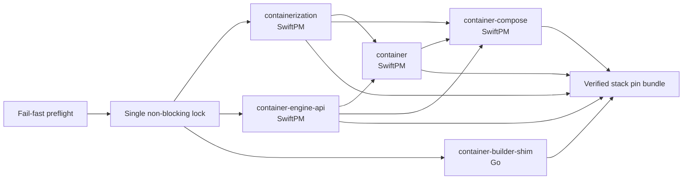
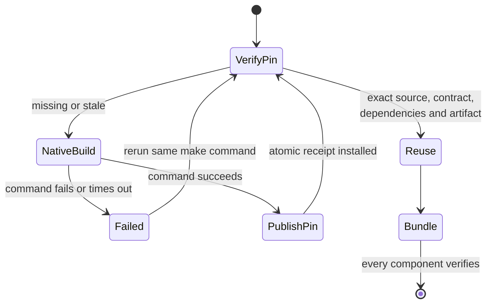
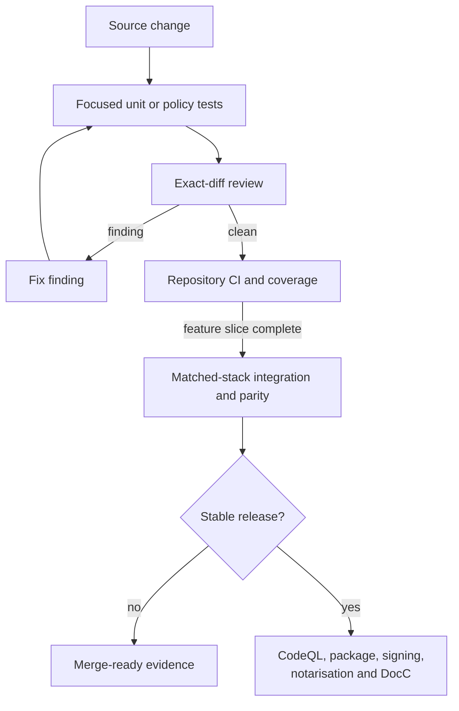
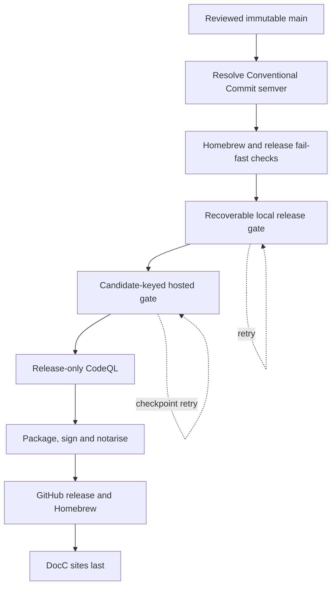

# Recoverable Container-Family Builds

## Decision

Make declares the Container-family repository graph. SwiftPM builds the Swift
packages, and Go builds `container-builder-shim`. There is no second build
graph or separate workflow runtime.

The default command builds the complete local stack:

```sh
make
```

Use `make local-build` for a quick repository-local Compose build. Use
`make stack-status` to verify retained output without rebuilding it.

## Build Workflow

The three independent roots start concurrently. A consumer starts only after
its dependencies have published and verified exact build pins.



Generated state defaults to
`/Volumes/SSD/github/.container-compose-build`. If that development volume is
not mounted, the fallback is `.build/stack`. SwiftPM scratch directories, Go
artifacts, pins, timing logs, and the final bundle all live below that managed
state root rather than in source checkouts.

Every compiler command has a wall-clock deadline and complete process-session
cleanup. Every full invocation records concurrency-safe JSONL timing evidence
under `timings/`. The log includes the end-to-end `stack-total` duration and
the duration and exit status of each native build and bin-path query. This
makes clean, resumed, and warm no-op runs directly comparable.

The first real cold and recovered runs are recorded in
[Recoverable build workflow timings](../reviews/CONTAINER-FAMILY-BUILD-WORKFLOW-TIMINGS-2026-09-09.md).

## Recovery Contract

A marker prevents the build from claiming an arbitrary state directory, and
one `lockf` lock prevents concurrent writers. Each successful repository build
atomically publishes a durable JSON pin containing:

- canonical source path, exact commit, Git tree, and origin;
- exact dependency-pin receipts;
- artifact paths, modes, and SHA-256 digests;
- successful native command, duration, and completion time; and
- a build-contract digest covering configuration, toolchain, effective target,
  SDK identity, relevant environment, host, Python runtime, and the dedicated
  build-controller contract.

The controller identity hashes a narrow manifest and two marked Makefile
sections containing only stack configuration and recipes. Unrelated Make
targets therefore do not invalidate native caches, while any stack recipe
change automatically changes the contract. Tooling that enforces or records
the contract is itself hashed into the build identity.

Pins are flushed and atomically renamed only after success. Before reuse,
`Tools/build/stack-pin.py` recursively verifies its own digest, clean source
identity, dependencies, and artifacts. Source, dependency, artifact, toolchain,
SDK, environment, or controller drift invalidates only the affected transitive
path.



After a failure, run `make` again. Successful independent roots are reused;
the failed stage continues from its retained native cache; downstream work is
rebuilt only when its verified input changed. If final bundle publication was
interrupted, component pins are reused and only the bundle is republished. A
live previous invocation makes the lock fail immediately.

## Test Workflow

Development keeps feedback proportional to the change. Release-only work does
not run during ordinary builds.



`make stack-self-test` executes the complete five-repository graph with fake
native builders. It proves fail-once recovery, transitive invalidation,
parallel-root reuse, external Compose scratch storage, final bundle
publication, and timing evidence. `Tools/build/test_stack_pin.py` separately
covers receipt and artifact integrity, including real macOS SDK metadata in the
Swift build contract.

## GitHub Actions And Release

Conventional Commit history selects the next semantic version:

- `fix`, `perf`, or `revert` produces a patch;
- `feat` produces a minor;
- `!` or a `BREAKING CHANGE:` footer produces a major; and
- documentation, test, build, CI, and maintenance commits alone do not release.

Non-conventional first-parent commits fail closed. For GitHub merge commits,
the wrapper subject is ignored and the Conventional pull-request title on the
first body line remains the authority. Use `make release-version` to inspect
the decision. An explicit
`VERSION_SELECTOR` remains available for a reviewed maintenance release or an
exact recovery retry.



The hosted gate stores stage checkpoints below the immutable release-candidate
commit. Each checkpoint records exact inputs, status, duration, output name,
and output digest. A corrected retry starts at the first missing or invalid
stage. The stable-release authority receipt binds component commits to the
verified checkpoint and log.

## Unattended Operation

Build recipes disable Git credential prompting, SSH askpass, inherited shell
hooks, and dynamic-loader injection. Ordinary builds do not sign applications,
start VMs, read removable volumes, access the Keychain, publish artifacts, run
CodeQL, build DocC, or record performance benchmarks.

Release signing receives an explicit 40-character Developer ID fingerprint at
its release-only boundary. Missing credentials or privacy grants fail with a
diagnostic rather than opening an approval dialog during an unattended build.

## Verification

Run the focused build-system proof with:

```sh
make stack-self-test
python3 -m unittest Tools.ci.test_release_stage_git_history
python3 -m unittest Tools.release.test_stable_release_authority
```

The final release still runs the repository CI, matched-stack integration,
Docker parity, CodeQL, packaging, Homebrew, and DocC gates required by the
release workflow.
