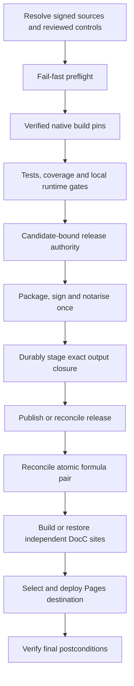

# Build and release resilience: review and implementation design

## Status and scope

Design and local implementation record, 10 September 2026. The implementation
is authorised by the user; publication and mutation of existing releases remain
outside this document's authority.

Reviewed checkout: `/Volumes/SSD/github/container-compose-release-0.14.3`.
Reviewed head: `8861c73b9dad6933b54c56d796fbdd8f03df21c5`.
Change baseline: `4c023f68fe8ac69460aa7d504e0ae4f01aec8b42`.
The worktree was clean at the start of this review.

Additional user requirement: everything worth retaining must live on the
internal/local drive, separate from disposable data on `/Volumes/SSD`.
Tidying external workspaces, branches and build attempts must preserve built
artifacts and reusable evidence/caches and must not force unnecessary rebuilds.
Section J makes this a mandatory storage contract, superseding the current
single-root external-state default in the earlier build architecture document.

The review covers all eleven files changed by the head commit and the
surrounding Make, build-pin, checkpoint, CI selection, release authority,
asset publication, Homebrew, documentation and test contracts. It is not a
complete audit of Compose application features, all sibling repositories,
live signing infrastructure or GitHub repository settings. Failure scenarios
below are distinguished from reproduced failures and measured performance.

The head improves guest-asset recovery, distinguishes package and tap-repair
runs, preserves independently successful documentation jobs, and separates
the gate's historical tap snapshot from the live publication destination.
Those are useful changes. It does **not** yet provide end-to-end idempotent
recovery: several paths mistake historical success for current completeness,
and the release checkpoint layers still do not share the native build
controller's artifact-verification contract. The earlier claim that all
resilience issues were fixed was too strong.

This design extends, rather than replaces,
[Recoverable Container-family builds](https://github.com/stephenlclarke/container-compose/blob/8861c73b9dad6933b54c56d796fbdd8f03df21c5/docs/architecture/recoverable-container-family-builds.md).
Make remains the execution graph; SwiftPM and Go remain the builders. No
Nextflow revival or second build scheduler is proposed.

## Executive findings

P1 means resolve before relying on unattended release recovery. P2 means an
important correctness, efficiency or operability follow-up. These are review
priorities, not claims that every scenario has occurred in production.

| ID | Priority | Finding | Origin |
| --- | --- | --- | --- |
| F01 | P1 | Runtime skips have no evidence baseline and can strand Current | Changed CI policy interacting with existing classifier |
| F02 | P1 | Historical successful repair suppresses a currently needed repair | New reuse branch |
| F03 | P1 | Missing stable binaries are routed to a publisher that refuses existing releases | New routing versus existing immutability contract |
| F04 | P2 | Formula probe and final verifier disagree about correctness | New partial probe |
| F05 | P1 | Dispatch lookup races main movement and masks API errors | Partly new matching logic; existing dispatch pattern |
| F06 | P1 | Recovery still depends on local state and expiring Actions evidence | Existing dependency, not fixed by new reuse |
| F07 | P1 | Release checkpoints verify logs/input stamps, not produced artifacts | Existing gap, not addressed in head |
| F08 | P2 | DocC caches lack complete identity, integrity and invalid-cache recovery | New caching |
| F09 | P2 | Different releases can race to overwrite the same Pages destination | Existing deployment gap |
| F10 | P2 | Broad fingerprints and repeated Make invocations waste reusable work | Existing architecture gap |
| F11 | P2 | Tests prove wiring more than recovery; workflow lint is not green | Incomplete validation of changes |
| F12 | P2 | No unified read-only recovery/status plan or durable dispatch journal | Existing functional gap |
| F13 | P1 | Current finalization deletes the release before replacement succeeds | Existing publication interruption window |
| F14 | P1 | Retained outputs and transient scratch share the external drive and checkout identities | Existing layout conflicts with the new retention requirement |

## Findings and evidence

All source line numbers in this section refer to the reviewed head, not to a
future implementation. Repository-relative paths identify source locations.

### F01 — Unsafe runtime selection and a Current readiness dead end

Evidence: `.github/workflows/ci.yml:45`, `:239`, `:768`, `:904`;
`Tools/ci/classify-ci-changes.py:50`; `.github/workflows/prebuilt-binaries.yml:294`;
`scripts/CONTAINER_STACK_RELEASE.sh:409`.

Runtime validation is now selected only by the changed-file classifier, even
on main. Main CI still cancels its previous run. Consider runtime commit A,
followed by documentation-only B before A finishes: A can be cancelled, B
skips runtime, and packaging explicitly skips runs with skipped runtime
validation. There is no successful equivalent baseline lookup to recover the
missing evidence. This scenario follows directly from the workflow conditions;
it was not dispatched against GitHub during this review.

The release controller also expects Current to identify exact main. Even
when A was fully validated, a tools/docs-only B can leave Current at A and
block that readiness check. Merely changing the readiness check to accept an
ancestor would weaken authority without proving equivalence.

Executable classifier probe confirmed that `Tools/release/stack-refs.json`
and `Tools/build/stack-pin.py` select tools but not runtime. Not every change
to those files needs every runtime test, but dependency pins and build recipes
cannot be dismissed without a stage-input comparison.

Required fix: typed stage fingerprints and an authenticated evidence resolver.
Until that exists, restore conservative main runtime selection. A cancelled,
missing or unreadable baseline must cause execution, not a successful skip.

### F02 — A successful run is not an idempotency key for mutable outputs

Evidence: `scripts/CONTAINER_STACK_RELEASE.sh:6302`, especially the completed
success branch around `:6338`, and resume routing at `:6586`.

Resume detects formula drift and selects tap repair. The dispatcher then finds
an older successful repair for the same version/control SHA, skips dispatch,
and calls the verifier. If the tap drifted after that success, verification
fails and every retry follows the same path.

Reproduced with the real dispatcher and isolated mocked external boundaries:
the historical run was `123/completed/success`; current verification returned
17. The function returned 17 without calling dispatch. Output was:

```text
container-compose stable tap repair workflow already passed for the exact release controls: 123
CURRENT FORMULA STILL DRIFTED
```

Required fix: make current postconditions authoritative. Reuse historical
evidence for immutable assets, but re-observe mutable destinations and execute
the smallest needed repair. Repeated repair of an already-correct tap must
produce zero commits; a newly drifted tap must not be blocked by past success.

### F03 — Missing stable assets cannot be repaired by the package path

Evidence: `scripts/CONTAINER_STACK_RELEASE.sh:6241`, `:6606`;
`Tools/release/publish-github-release.sh:198`.

The new binary-existence probe sends an existing stable release with a missing
archive or checksum back to ordinary packaging. A past successful package run
can suppress execution as in F02. If execution happens, the publisher rejects
an existing immutable release. Recompiling would also not establish that the
new signed archive is byte-identical to the original release artifact.

Required fix: an explicit missing-asset recovery operation consuming retained,
authenticated original bytes. Separate absent assets from conflicting assets,
authentication failures, and a platform-enforced immutable release. Never
delete/recreate a stable release or overwrite an existing conflicting asset.
If exact original bytes no longer exist, report an unrecoverable artifact
with a concrete restoration/new-version path, not an endless package retry.

### F04 — Formula repair selection has a weaker contract than verification

Evidence: `scripts/CONTAINER_STACK_RELEASE.sh:6258` versus `:6170`–`:6204`.

The probe compares only two URLs and two SHA values. The final verifier also
rejects an explicit Compose formula version and a missing dependency on the
matched runtime formula. A formula with correct URLs/checksums but either
defect is selected as healthy, then fails completion instead of being repaired.
A missing formula API response is treated like an infrastructure error rather
than a repairable absence. Both formulas are fetched separately from moving
main, so the pair need not be one atomic tap snapshot.

Required fix: one typed formula validator used by inspection, repair and final
verification, evaluated at one exact tap commit. Include generated-template
semantics, version policy, runtime dependency and any declared guest resources.
Distinguish authenticated absence from permission/network/parse failure.

### F05 — Dispatch correlation and control identity are not race-safe

Evidence: `scripts/CONTAINER_STACK_RELEASE.sh:5741`, `:6334`, `:6364`, `:6420`;
`.github/workflows/stable-release-gate.yml:80`.

The controller reads main SHA C, dispatches with `--ref main`, then searches for
a title at C. Main may advance to D before dispatch. The real run can start at
D while the controller waits for a run at C. A queued gate also rejects a head
that is no longer current main. Titles plus a 100-run history window are not
durable dispatch identities. API lookup failures are swallowed with `|| true`,
so lack of visibility can cause duplicate work.

The current GitHub REST documentation describes a dispatch response containing
the run ID and URLs; use that documented capability through an explicitly
versioned adapter rather than relying on title search. The documented dispatch
ref is a branch or tag, so do not assume a raw SHA is accepted.
[GitHub workflow dispatch API](https://docs.github.com/en/rest/actions/workflows#create-a-workflow-dispatch-event).

Required fix: persist request identity before dispatch and run identity after
acknowledgement, supply expected controls as an input, validate observed
controls at job start, and reconcile ambiguous responses without blind retries.
Preserve the reviewed-main control policy; do not bypass it using an arbitrary
temporary branch. See the dispatch protocol below.

### F06 — Successful gates and published releases are not durably recoverable

Evidence: `scripts/CONTAINER_STACK_RELEASE.sh:4292`, `:5964`, `:6420`;
`.github/workflows/prebuilt-binaries.yml:1159`;
`.github/workflows/stable-release-gate.yml:512`.

Gate reuse first needs the retained local guest digest, then accepts historical
workflow success without validating that the receipt artifact still exists.
Packaging independently rejects expired/missing Actions artifacts. Published
recovery still requires a check-run and the referenced successful workflow;
it does not authenticate from the durable published authority bundle alone.

The new guest fallback works when the archive is already on the release and
the local archive variable is unset. It cannot recover missing remote bytes
after local loss. A stale explicitly configured local path also prevents the
fallback. That last behavior is defensible fail-closed policy, but needs an
actionable diagnostic distinguishing an explicit override from a persisted hint.

Required fix: persist all original release outputs and signed evidence before
public visibility. Treat Actions as transport/observation, not the sole
long-term authority store. Artifact availability and digest must be part of
gate reuse eligibility. Keep signed source, controls and guest identity checks.

### F07 — Nested checkpoint success can survive missing build products

Evidence: `Tools/ci/run-release-checkpoint.py:130`, `:330`, `:350`;
`Tools/ci/run-stack-release-validation.sh:548`–`:585`.

The outer checkpoint's `output_sha256` is the captured `.log` digest, not a
manifest of binaries, coverage files, test reports or packages. Inner stages
reuse a matching input stamp without an output manifest. Deleting a product
while retaining the log/stamp does not itself invalidate success. Some downstream
checks will fail closed, but can then fail repeatedly instead of regenerating
the missing producer; other consumers must not infer product availability from
these checkpoints.

The native `Tools/build/stack-pin.py` contract already verifies exact artifacts
and transitive dependencies. Preserve that stronger behavior and extend its
principles to release/test receipts. A tests-only receipt need not retain every
intermediate binary, but must explicitly declare its durable test evidence and
must not advertise artifacts it no longer retains.

Required fix: typed output manifests, explicit producer/consumer contracts,
atomic receipts and transitive invalidation. Rename log fields to make their
meaning unambiguous. Existing schema-4 receipts cannot silently become proof
of artifact completeness.

### F08 — DocC caching is opportunistic, not verified recovery

Evidence: `.github/workflows/docs.yml:224`–`:243`, `:304`–`:319`.

SwiftPM cache keys omit Xcode/Swift/SDK identity and use a broad site restore
prefix. Final-site keys include the entire control SHA and release version,
invalidating otherwise equivalent sibling docs, while omitting an explicit
toolchain contract. A cache hit bypasses generation after checking only
`index.html` and `theme-settings.json`; missing documentation payload can pass.
Invalid exact caches have no rebuild path.

The combined cache action normally saves after successful job completion. A
failure after generation but before job completion can lose reusable output.
Separate restore/save actions allow verified output to be saved earlier.
[Actions cache documentation](https://github.com/actions/cache#usage).

Required fix: separate dependency acceleration from verified site artifacts;
key site reuse by exact semantic inputs and toolchain, verify a signed or
trusted-producer-bound output manifest, explicitly persist each completed site,
and rebuild invalid caches. Preserve fail-fast false for independent sites.

### F09 — Per-version serialization does not protect a shared Pages site

Evidence: `.github/workflows/docs.yml:31`, `:376` onward;
`Tools/release/documentation-authority.py:87`.

Different version groups can deploy to the same GitHub Pages destination.
An older slow build can finish after a newer one. The before/after authority
checks prove each release's pinned inputs, not that it remains the designated
release for the destination. Historical docs workflow success also does not
prove that those docs are still deployed now.

Required fix: independent site builds, one serialized deployment boundary per
destination, and an in-lock destination-selection check. Preserve immutable
versioned site artifacts even when deployment is superseded. Keep the existing
explicitly allowed pinned k8s prerelease authority; do not accidentally require
all sibling documentation releases to be stable.

### F10 — Work is still invalidated and invoked too broadly

Evidence: `Makefile:250`, `:274`, `:726`; nested target loop in
`Tools/ci/run-stack-release-validation.sh:590`.

The release-level fingerprint includes all component trees, tap state, many
tools and settings. Unrelated changes can invalidate expensive stages. Each
nested Make target is invoked separately, so shared prerequisites may run
again. Native incremental builds may reduce recompilation, but they do not
eliminate repeated graph planning, prerequisites and test invocations.

The existing five-repository build already has independent parallel roots and
verified pins. Do not replace it with indiscriminate scratch-directory sharing.
The historical timing record demonstrates a 5.747-second native no-op versus
a 282.796-second cold build, not an end-to-end release speedup.
[Retained timing evidence](https://github.com/stephenlclarke/container-compose/blob/8861c73b9dad6933b54c56d796fbdd8f03df21c5/docs/reviews/CONTAINER-FAMILY-BUILD-WORKFLOW-TIMINGS-2026-09-09.md).

Required fix: stage-local contracts, reuse compatible products within one Make
graph, and measure invocation counts. Investigate repeated Container DocC build
planning with pinned sibling scripts before choosing a multi-target generation
change. No percentage speedup is justified yet.

### F11 — Validation misses the recovery contract and has a tooling mismatch

Evidence: `Tools/ci/test_documentation_workflow.py:39`;
`Tools/release/test_container_stack_release.py:9328` onward.

Several new tests assert YAML strings or stub the actual inspectors/verifiers.
They do not combine historical success with present drift, missing artifacts,
expired evidence, ambiguous dispatch or invalid caches. During this review,
13 classifier/documentation tests passed while the F02 reproduction failed as
described above.

Installed actionlint 1.7.12 rejected `queue` in all three changed workflows.
This is not proof that GitHub rejects the syntax: GitHub now documents queued
concurrency. It is an unresolved local validator compatibility gap. Queues are
bounded, so queuing alone cannot promise that every request will execute.
[GitHub concurrency controls](https://docs.github.com/en/actions/how-tos/write-workflows/choose-when-workflows-run/control-workflow-concurrency).

Required fix: behavioral state-machine tests plus a pinned compatible workflow
validation strategy. Retain structural policy checks as supplementary tests;
do not equate their success with a working recovery path.

### F12 — Recovery lacks a unified operator-facing plan

Evidence: dispatch polling in `scripts/CONTAINER_STACK_RELEASE.sh:6385`;
separate build status, checkpoint logs and workflow lookups across the tools.

There is no single read-only command that explains the active release, what
is reusable, why a stage invalidated, which run is queued, which output is
missing, or whether resuming will mutate a release/tap/Pages. The repeated
status questions in this task illustrate the usability gap, but are not a
measurement of process liveness.

Required fix: a shared inspection/plan model, durable event journal, phase
timings and concise status output. Waiting is an explicit state, not failure;
unknown external state must never be rendered as success or absence.

### F13 — Current publication has a destructive interruption window

Evidence: `Tools/release/publish-github-release.sh:212`–`:220`;
`.github/workflows/prebuilt-binaries.yml:1850`–`:1930`.

Current finalization deletes and recreates the release to refresh its
`published_at` timestamp. A failure between deletion and creation leaves the
release unavailable after the tap may already have moved. Staged local files
are not an adequate machine-loss recovery guarantee. This predates the head
commit and is distinct from stable-release immutability.

Required fix: preserve the Current release object, upload uniquely named
candidate assets first, and publish pointers through a resumable transaction.
Use an explicit build timestamp in metadata instead of deleting the release
for display freshness. If refreshing `published_at` is a hard product
requirement, document the unavoidable availability tradeoff and provide durable
restoration before retaining that behavior.

### F14 — Storage lifetime and cleanup boundaries are not separated

Evidence: `Makefile:207`–`:222`, `:554`–`:570`, `:677`–`:697`;
`scripts/CONTAINER_STACK_RELEASE.sh:283`, `:3546`, `:3945`;
`Tools/build/stack-pin.py:552` onward.

`STACK_STATE_ROOT` currently defaults to
`/Volumes/SSD/github/.container-compose-build`, with pins, timings, scratch and
artifacts beneath it. Swift build pins point directly into the scratch binary
directory rather than a separately retained product store. The release evidence
root also doubles as build scratch. A host-restoration journal defaults to
`/private/tmp`, although it can be essential after interruption. Native receipt
verification couples source authority to a concrete checkout path.

These defaults mean that deleting build scratch can delete the pinned binary;
removing the external drive can make both retained artifacts and their evidence
unavailable. A recreated worktree at another path can also defeat reuse even
when its source commit is unchanged. That is directly contrary to the user's
requested clean separation. Disk inspection confirms `/Users/sclarke` and
`/Volumes/SSD` are on different filesystems on this host.

Required fix: two independently marked roots, immutable promoted products and
durable recovery state on the internal drive, disposable execution data on the
external drive, and explicit source-versus-workspace identities. Do not simply
move the existing mixed tree and call it separation. See section J.

## Target contract and recovery invariants

One observable contract governs the work:

> An interrupted build or release resumes from the smallest missing or invalid
> stage, preserves authenticated equivalent work, never substitutes new bytes
> for an immutable published artifact, and reports its exact remaining work.

The following invariants are mandatory:

1. A run conclusion is observation, not proof of current destination state.
2. A cache is acceleration, not release authority.
3. Every reusable product has a content manifest and authenticated provenance.
4. Every reusable test result names the exact tested artifacts, tests, policy
   and relevant environment; coverage and sanitizer configurations are distinct.
5. Mutable side effects are reconciled against current state under their own
   serialization boundary. No global atomicity across GitHub, tap and Pages
   is claimed.
6. Authorization, source identity and execution-control identity remain
   distinct. Narrow compatibility proofs never rewrite source provenance.
7. Missing, invalid, conflicting and unknown are different states.
8. Loss of both original artifacts and every authenticated replica is an
   explicit recovery limit, not permission to fabricate equivalent bytes.
9. Normal workspace/build/branch cleanup cannot delete retained artifacts,
   evidence, journals or reusable cache snapshots. The internal store remains
   usable for inspection and artifact consumption with `/Volumes/SSD` absent.

## Architecture and interfaces

### A. Extend the existing graph with typed receipts

Add a reusable Python receipt/inspection module under `Tools/release/` and
share low-level content-manifest validation with `Tools/build/stack-pin.py`.
Do not change the native build-pin wire schema just to rename it. Make declares
stage dependencies; the module verifies evidence and determines eligibility.

Conceptual dependency graph:



Keep full docs generation release-only and after the package/tap boundary for
the first implementation, matching current policy. Do cheap source/toolchain
and documentation-manifest preflight early. Overlapping full DocC with
packaging is a later policy/performance decision, not a prerequisite for
correct recovery.

A release-stage receipt should have a new schema version with these fields:

```json
{
  "schema": 5,
  "stage": "compose-test",
  "input_digest": "sha256:<canonical-stage-inputs>",
  "contract_digest": "sha256:<stage-recipes-and-policy>",
  "source_manifest_digest": "sha256:<exact-source-manifest>",
  "dependencies": [{"stage": "compose-build", "receipt_digest": "sha256:<digest>"}],
  "execution": {
    "control_sha": "<full-commit>",
    "toolchain_digest": "sha256:<digest>",
    "environment_class": "macos-arm64-unit",
    "run_id": "<optional-hosted-run-id>",
    "attempt": 1
  },
  "outputs": [{
    "role": "test-report",
    "path": "reports/compose-tests.json",
    "sha256": "<64-hex>",
    "size": 1234,
    "mode": "0644"
  }],
  "log": {"path": "logs/compose-test.log", "sha256": "<64-hex>"},
  "status": "succeeded",
  "completed_at": "<UTC-time>",
  "duration_seconds": 12.3
}
```

The JSON is illustrative, not a valid receipt to install. Define strict JSON
schemas and canonical serialization in tests. Receipt digest covers the
payload excluding its signature/digest envelope. A self-hash detects accidental
corruption, not malicious replacement: hosted/published receipts also require
a trusted producer identity or signature binding their exact digest.

Reuse algorithm:

1. Compute only the selected stage's declared inputs and dependency receipts.
2. Load a supported receipt and validate schema, provenance and input digest.
3. Verify required outputs are regular files under the managed root, with
   expected size, mode and content digest. Reject escaping paths, unsafe
   symlinks, duplicate archive entries and special files during restore.
4. For tests, require the complete selected-test set and compatible environment
   class. For VM/parity tests, include runtime/guest/oracle identities and
   relevant host capabilities. Always rerun lifecycle cleanup/preflight that
   is deliberately not checkpointable.
5. Reuse if all conditions hold; otherwise report the precise invalidation and
   schedule that producer plus affected consumers. Preserve independent roots.
6. Publish outputs, flush them, then atomically publish the success receipt
   with file and directory fsync. A crash must never expose success first.

Verification receipts and product receipts have different output requirements.
Rehydrating a byte-identical binary can preserve a compatible test receipt;
rebuilding to a different binary invalidates dependent test evidence. A
different host need not invalidate portable static evidence, but cannot inherit
VM authority merely because its CPU architecture matches.

### B. Separate build identity from policy and publication identity

Use a small explicit stage-input inventory, with fail-closed handling of new
unclassified inputs. It drives classifier tests and receipt fingerprints.

| Identity | Includes | Must not automatically include |
| --- | --- | --- |
| Native build | Source closure, dependencies, compiler/SDK, target, flags, build recipes | Live tap head, docs deployment state |
| Unit/coverage | Exact tested build, test selection, instrumentation, test harness, quality policy | Release queue position, unrelated formula edits |
| Runtime/parity | Tested runtime/guest hashes, oracle, capabilities, isolation and runtime harness | Unrelated documentation controls |
| DocC site | Source/dependency closure, DocC toolchain, flags, targets, hosting path, relevant scripts | Entire unrelated control commit |
| Package | Input products, archive recipe, signing/notarization provenance, naming/version inputs | Current live tap commit |
| Publication | Artifact manifest, release identity, lane, current destination snapshot, mutation policy | Compiler scratch paths |

Record full source/control SHAs for audit even when semantic contract digests
permit reuse. Do not remove host/path identity where tools are not relocatable.
Separate scheduling deadlines from output identity: a prior result may satisfy
a tighter maximum-duration policy only if its recorded duration satisfies it;
runtime startup deadlines that affect tested behavior remain semantic inputs.

### C. Main CI equivalence and Current behavior

Initial safe change: restore the previous conservative main runtime condition
while introducing an evidence resolver in shadow mode.

For each new head H, the resolver computes build/test identities, finds a
trusted successful baseline with matching identities, verifies its receipts
and required retained outputs, and emits one of:

- `execute`: changed identity, missing/invalid baseline or unsupported schema;
- `reuse`: verified equivalent evidence with a named source run and digest;
- `unknown`: transient authority failure; bounded retry or fail, never skip.

Changed-file classification is only a fast hint. In particular, a short push
diff is not proof that all earlier runtime changes were validated. An aggregate
job must report `runtime-executed` or `runtime-evidence-reused`, not infer
success from `skipped`. Packaging must consume that explicit contract.

Keep exact Current-to-main readiness initially. A controls-only main commit can
reuse compilation/tests but still needs a current-head publication envelope;
do not relabel an artifact containing an older embedded commit/version as H.
Separate source-version-sensitive assembly from expensive compatible compile
work. If that separation cannot preserve provenance, build the affected product.
Changing readiness to artifact-equivalent Current is a separate explicit
policy change requiring revised soak and release-authority tests.

Acceptance includes A runtime -> B docs while A is cancelled: B must acquire
valid runtime evidence and a valid Current decision, never silently lose both.

### D. Dispatch and recovery journal

Proposed interfaces in `Tools/release/release-state.py`:

```text
inspect --version VERSION --format json|text
plan --version VERSION --format json|text
resume --version VERSION --expected-plan-digest DIGEST
```

Inspection/plan perform no remote mutations and start no builds. The existing
shell entry point remains the user-facing compatibility wrapper. The planner
is not another executor: it produces decisions consumed by existing Make and
workflow operations.

Persist an atomic transaction record below the new internal retained root
specified in section J: source tag object/commit, release manifest digest, expected controls,
stage contract, request UUID, mode, attempt, run ID, run attempt and timestamps.
Replicate operation receipts with durable candidate evidence; a lost local
journal must be reconstructible from trusted remote records.

Dispatch protocol:

1. Inspect current postconditions and outstanding exact requests first.
2. Write `dispatch-intent` with a stable request UUID before sending anything.
3. Dispatch through a versioned REST adapter, retaining the returned run ID.
   Validate response structure; capability-test supported server/API behavior.
4. Pass `request_id`, `expected_control_sha` and manifest digest to the workflow.
   The first job records observed identity and rejects mismatches before costly
   or mutating work. Request ID is correlation, not authentication.
5. If the HTTP result is ambiguous, enter `dispatch-unknown`; reconcile using
   the exact request ID and authenticated workflow identity. Do not dispatch
   again solely because a title search or API query failed. For deployments
   lacking run-ID responses, use paginated request-ID reconciliation, not the
   newest 100 titles.
6. Follow the acknowledged run, including a control-mismatch rejection. If
   main advanced, replan under the existing reviewed-control policy; never wait
   forever for the pre-dispatch SHA. Any permitted redispatch has a bounded
   attempt count and its own recorded attempt ID.
7. After success, verify required artifact receipts and current side effects.
   A missing postcondition schedules repair, not reuse of the same stale run.

Local locking avoids duplicate local controllers. Remote serialization plus
an in-lock state recheck prevents duplicate mutations from different hosts.
GitHub concurrency is not a distributed idempotency database: queued/cancelled
requests remain in the journal until reconciled. Use bounded backoff with
jitter and server retry hints for transient reads; do not retry authentication,
signature, schema or artifact conflicts as transient faults.

Failed-job reruns may be used only with the original exact controls and valid
retained outputs. They are not a way to pick up workflow fixes; GitHub reruns
retain the original SHA/ref and have a limited rerun window.
[GitHub rerun behavior](https://docs.github.com/en/actions/how-tos/manage-workflow-runs/re-run-workflows-and-jobs).

### E. Publication as postcondition reconciliation

Define a typed inspection result for each output:

```text
verified | absent | invalid | conflicting | unavailable | superseded
```

For every result include expected identity, observed identity, evidence origin
and repairability. `unavailable` covers network/auth/unknown state and must
never fall through to `absent`.

| Observed state | Planned operation | Forbidden shortcut |
| --- | --- | --- |
| Everything currently verifies | No publication; verify final status | Rebuild because no recent workflow title matches |
| Formula pair drift/absence, artifacts verify | Render and commit pair from one pinned tap snapshot | Repackage binaries |
| Missing sidecar, original archive verifies | Recreate expected sidecar and upload if permitted | Change archive bytes |
| Missing archive, authenticated original retained | Upload exact retained bytes if permitted | Re-sign or rebuild replacement under the same stable identity |
| Existing asset digest conflicts | Stop with conflict details | Clobber or delete published asset |
| Receipt transport expired, durable receipt valid | Restore authenticated evidence transport | Repeat expensive tests just to recreate a log |
| No authentic authority or original bytes | Explicit blocked restoration/new-version plan | Treat release metadata or self-signed cache as authority |
| Existing owned candidate draft | Verify transaction ownership and complete staged closure | Delete unknown drafts or publish unrelated contents |
| Platform-enforced immutable release lacks asset | Report platform restriction and supported recovery path | Assume uploads are allowed |
| Older maintenance release | Repair its immutable closure only | Move default stable formula pair or default Pages |

Use a single asset download per inspection transaction, stored by verified
digest in a bounded managed content store. Pass validated paths/manifests
through guest publication and final verification rather than re-downloading
the same guest archive in each function. Revalidate local integrity before use
and remote asset identity around mutation; never trust filename alone.

For new releases, stage complete binaries, guest archive, checksums, authority
bundle and provenance in a transaction-owned draft before public visibility.
Verify that staged bytes can be downloaded and authenticated independently of
the local host. Only then finalize the release. Draft ownership and source tag
object must be explicit; an arbitrary existing draft remains a conflict.

A published authority bundle needs an independently verifiable signature or
trusted attestation over the complete release manifest, not just a guest hash
or an expiring check summary. Bind original source tag object, source commits,
component pins, control SHA, stage receipts, exact asset digests, signer and
notarization evidence. Avoid circular hashes: sign the payload manifest, then
store its envelope alongside it. Preserve validation rules for existing schema-2
stable authority; introduce a new schema only for this expanded contract.

Finalized release assets are a remote durable copy; always retain an
authenticated copy in the internal retained store for local disaster recovery.
Platform immutability and replica retention must be checked during deployment
of this design. No storage system can promise recovery after all copies are
deleted. Older releases without a complete signed manifest require a strictly
validated migration or explicit operator restoration, not invented authority.

### F. Homebrew and Current mutation boundaries

Homebrew inspection resolves one tap commit T and reads both formulas at T.
Generate expected formula content using the existing pinned templates and
verified release metadata. Share this semantic validator between the cheap
probe and final verifier; do not execute untrusted downloaded Ruby to inspect it.

Keep both formula files in one commit. Existing non-force push already prevents
blind overwrites; add bounded conflict reconciliation: fetch new T, re-evaluate
lane eligibility, render again and retry only if the new state remains valid.
Preserve unrelated tap edits. A newer stable release supersedes an older
default-lane repair; maintenance backfills may not roll the pair back.

For Current, keep the existing release object. Stage immutable candidate-named
assets and verify them before moving the Current tag, formula pair and visible
metadata. Record each operation and re-observe freshness inside the publication
lock. A restart completes only the still-eligible candidate; a stale candidate
must not supersede a newer publication. Prefer roll-forward reconciliation;
never blindly roll back another publisher's successful state.

No cross-service atomic commit exists here. Readers may briefly observe a
transition, but all referenced URLs must already resolve to complete verified
artifacts. Keep prior referenced assets through a retention grace period. Use
an explicit `built_at` value instead of recreating Current for a timestamp.

### G. Documentation artifacts and deployment

Two layers have separate contracts:

1. Dependency/native acceleration: exact Xcode build, Swift, SDK, runner
   architecture, lockfile, package identity and compilation configuration.
   Broad fallback is allowed only for safe dependency downloads within the same
   compatibility class. Do not restore mutable `.swiftpm` edit/config state as
   authoritative dependency selection.
2. Site artifact: exact source and dependency closure, documentation toolchain,
   relevant scripts, target list, source-link base, static hosting path and flags.
   Store a full file manifest plus required entry routes and module indexes.

Pin/select Xcode explicitly and record its fingerprint before restore. Enforce
locked resolution consistently across sibling generators where supported;
verify source/lockfiles remain exact after generation. Any sibling script
change must land there first and flow into the matched pins last.

Restore a matching verified site artifact first, then use cache-assisted build
on absence or invalidity. Treat a bad cache as an invalid candidate, not a
terminal workflow failure: quarantine the restored directory, rebuild, persist
the verified result as a new artifact, and avoid republishing under an immutable
bad cache entry. Use an explicit cache generation/repair key with bounded
retention rather than deleting broad cache collections.

Persist each site immediately after validation, before aggregate assembly or
deployment. Site artifacts remain independently reusable when another site
fails. Artifact identity includes site digest; attempt-specific upload names
avoid collisions during failed-job reruns. A signed release-level manifest
maps logical site names to exact artifact digests.

At the Pages boundary, use a destination-wide serialized deploy job and recheck
the selected default release while holding that boundary. Proposed default
policy: the latest eligible stable Compose release owns the root portal;
maintenance rebuilds retain artifacts without moving it. Its pinned k8s
release can remain a prerelease as allowed today. If product policy instead
requires versioned published URLs, design explicit per-version routing before
changing the root portal's meaning.

Publish a deployment manifest containing release ID/tag object, site digests,
deployment ID and expected route probes. Validate actual served routes and
manifest after deployment with a bounded propagation allowance. Historical
workflow success cannot substitute for this observation. A superseded build
ends successfully as `artifact-ready/deployment-superseded`, not as a rollback.

### H. Faster builds and tests without reducing coverage

Preserve parallel native roots. Share scratch state only for compatible
package/toolchain/configuration identities and never allow concurrent writers
to the same native scratch directory. Coverage, sanitizers, debug and signed
release builds are separate compatibility classes unless proved otherwise.

Convert nested independent target invocations into Make producer/consumer
targets backed by verified receipts. A component checkpoint should build the
required test bundle once and run selected tests from it when the native tool
supports that mode. CLI smoke tests consume a named verified binary instead of
reinvoking the build prerequisite. Keep runtime lifecycle transitions outside
reusable stamps and serialize VM/parity/signing resources unless isolation is
proved.

Before changing Container DocC generation, capture per-invocation command,
target, duration, input identity and symbol-graph output at the pinned source.
Test whether one multi-target invocation or shared symbol-graph extraction can
produce the exact existing routes and public symbols. Require an output
equivalence check; fewer log lines are not a performance proof.

Profile the Python tool suites by test duration and subprocess count. Use fake
clocks/API state for polling/retry policy tests, but retain real bounded process
tests for signal propagation and process-tree cleanup. Partition long suites
only across isolated fixtures; preserve coverage aggregation and the same test
inventory. Do not paper over flaky behavior with more retries.

### I. Status, telemetry and retention

Proposed `make release-status VERSION=...` and `make release-plan VERSION=...`
wrap the read-only model. Text output should answer:

```text
Release 0.x.y: recovering
Source: <tag object / commit>  Controls: <commit>
Verified: build, tests, signed assets, guest
Needs repair: Homebrew pair (observed tap <sha>, dependency missing)
Waiting: none
Next mutation: one atomic tap commit; no builds or tests
Last progress: <UTC>  Evidence: <local receipt / run URL>
```

Emit JSONL events for inspected, invalidated, restored, started, waiting,
completed, failed, superseded and blocked states. Record queue time separately
from execution; include cache hit/miss, bytes transferred and compiler/test
invocation counts. Provide a bounded log tail while preserving full logs.

Retention distinguishes disposable caches, resumable candidate outputs,
published authority and artifacts still referenced by Current/tap/Pages.
Retained-store garbage collection is mark-and-sweep from those live manifests, supports a
read-only plan and grace period, and never deletes an active transaction or
the last authenticated recovery copy. It requires a separate explicit operation
and retention policy; ordinary tidying never invokes it. Implement GC
separately from resume and transient cleanup.

### J. Internal retention, external execution and safe tidying

This section is a user requirement, not an optional optimization. Proposed
defaults on this Mac are:

```text
/Users/sclarke/Library/Application Support/ContainerFamily/retained/
  .container-family-retained-root
  objects/sha256/                 immutable binaries, bundles and archives
  manifests/                     product/dependency/output manifests
  receipts/                      test, build, signing and release evidence
  transactions/                  dispatch and host-restoration journals
  releases/                      named references to retained object digests
  docs/                          verified sites and deployment manifests
  caches/                        reusable dependency/compiler cache snapshots
  sources/                       retained source objects/bundles and lockfiles
  reports/                       completed logs, profiles, timings and designs
  locks/                         store publication and transaction locks
  incoming/                      uncommitted durable-publication transactions

/Volumes/SSD/cf/
  .container-family-transient-root
  workspaces/                    disposable clones and Git worktrees
  builds/                        mutable SwiftPM/Go build-attempt directories
  tmp/                           tool scratch, extraction and packaging attempts
  downloads/                     incomplete/unverified transfer data
  r/                             short runtime/socket/VM attempt directories
  attempts/                      live logs and uncommitted test outputs
```

Use the actual user application-support directory on other Macs rather than
hardcoding this username. Do not use the OS `Caches` or temporary directory for
the only copy of anything required for recovery. Both roots are outside source
worktrees and are neither ancestors nor descendants of one another. The
retained root must resolve to the internal filesystem; `/Volumes/SSD` must be
the expected mounted external volume, not an accidentally created mountpoint
directory on the system disk.

Proposed configuration:

```text
CONTAINER_FAMILY_RETAINED_ROOT=<internal application-support path>
CONTAINER_FAMILY_TRANSIENT_ROOT=/Volumes/SSD/cf
```

Resolve these once in a shared path-policy module and pass explicit derived
paths into Make and subprocesses. Deprecate the ambiguous `STACK_STATE_ROOT`;
do not let it place both lifetimes together. Compatibility handling should
diagnose an old mixed-root override and offer migration, not silently move or
delete its contents.

#### What is retained versus transient

| Data | Internal retained location | External transient location |
| --- | --- | --- |
| Completed executable, dylib, app bundle, resource bundle, dSYM | Complete product closure in immutable objects | Active compiler/linker output only |
| Signed/notarized tar/OCI/package and checksum | Original verified bytes plus provenance | Staging and verification scratch |
| Build/test/coverage/authority receipts | Immutable receipts and necessary evidence | In-progress report generation |
| DocC site and module manifests | Verified full site artifacts | Symbol-graph/build/assembly scratch |
| SwiftPM/Go/dependency caches worth reusing | Verified compatible snapshots/download cache | Writable per-attempt materialization |
| Git source identity and unmerged work worth keeping | Authenticated source objects and explicitly preserved work | Disposable checkouts and review worktrees |
| Release/dispatch/host recovery state | Durable journals, including interrupted attempts | Disposable process-local state only |
| Diagnostics needed to understand a failure | Retained completed/failure logs and useful profiles | Live streams and throwaway fixture outputs |
| Temporary sockets, VM test disks and extracted test data | None by default | Owned attempt under the short external root |

Successful native compiler state can save substantial incremental work and
therefore belongs in the retained cache class, even though it is not release
authority. Keep a verified snapshot on the internal drive and materialize a
writable copy on SSD for active work. Measure transfer cost versus rebuild
savings and deduplicate by compatible cache identity. Do not let ordinary
`clean` erase the retained snapshot. A tool's path-sensitive cache may require
stable materialization paths or a measured migration; do not remove path checks
without proving compatibility.

The complete runtime closure matters: copying only the top-level executable
is insufficient if resources, libraries or helper programs still resolve into
an external `.build` tree. Product manifests must enumerate those files,
preserve required permissions/signatures/extended attributes, and verify that
runtime dependencies do not escape to disposable storage. Never hard-link a
retained object to writable build output or retain a symlink pointing to SSD.

#### Atomic cross-volume promotion

Promotion is copy-and-verify, not a cross-filesystem rename:

1. Build in an explicitly owned external attempt directory.
2. Enumerate the finished output closure and compute its expected manifest.
3. Copy into a unique `incoming` transaction on the internal filesystem;
   preserve required metadata and verify hashes, modes, bundle signatures and
   closure. `incoming` is a narrowly scoped durable commit protocol, not a
   general temporary build area. This small internal staging boundary is
   required for atomic publication across disks.
4. Flush local files, atomically rename within the internal store, then publish
   the receipt/reference and fsync its directory. Consumers only follow
   committed references. Resume or explicitly discard incomplete incoming
   transactions; do not expose them as complete artifacts.
5. Only after that commit may the external attempt be deleted. Disk-full,
   disconnect or copy failure leaves the source attempt intact and reports
   `retention-incomplete`; it must not claim a safely disposable successful build.

Source provenance is content/repository identity, while checkout path is an
execution detail. Extend build-pin verification with a retained-artifact mode
that validates source objects/receipts without requiring a deleted checkout.
The build-input mode still proves the requested live checkout is exact and
clean before execution. Retain necessary Git objects through explicit retained
refs/bundles independent of disposable branch names, without weakening signed
source-tag authority or preserving every abandoned branch forever.

#### Cleanup must not mean artifact deletion

Provide separate commands with a shared, typed cleanup plan:

- `clean`: remove only this owned inactive external build attempt.
- `workspace-prune --dry-run`: list eligible external workspaces/worktrees;
  execution requires their normal clean/merged/unique-work checks.
- `transient-prune --dry-run`: list owned inactive external attempts with
  committed retention or an explicit discard decision for failed scratch.
- `retained-gc --dry-run`: separate inventory of retained candidates; deletion
  requires explicit scope and policy, and is never called by any command above.

Every destructive target is resolved and checked against its expected marker,
owner, device/volume identity, canonical parent and live lease. Reject symlink
escapes, mount changes, broad roots, active attempts and any target reaching the
retained store. Use filesystem-safe traversal that cannot follow a replaced
symlink during cleanup. Never use a repository-wide recursive deletion as a
substitute for `git worktree remove`, and never delete a branch with unique
unpreserved work. Branch deletion is independent of artifact retention: no
artifact directory is keyed solely by a branch name.

Existing `make clean`, clean-related scripts, worktree cleanup, `git clean`
wrappers, `TMPDIR` use, language caches, DocC scratch, CodeQL state and test
fixture roots all need an audit. Tool-managed transient paths must resolve to
SSD. Durable cache/evidence roots must remain internal even when external
workspace configuration changes. Use `PYTHONDONTWRITEBYTECODE` or an explicitly
external bytecode cache where relevant; do not scatter generated state into
retained source/control checkouts.

#### Platform constraints are explicit, never silent fallbacks

If SSD is absent, allow internal status, artifact verification and use of an
already-retained product, but fail preflight before new transient work. Do not
silently fall back to `.build`, `/private/tmp` or an internal workspace.

The current release code intentionally stages runtime input locally because
launchd-managed services can be denied removable-volume access
(`scripts/CONTAINER_STACK_RELEASE.sh:3910`). Retained executable/guest inputs
will now be local naturally. Writable runtime data and sockets should use the
short external root, but must be validated against macOS access rules and
Unix socket path limits on the actual host. If a required service cannot use
external writable state, report that incompatibility and obtain an explicit
exception; do not silently violate the storage requirement. OS-owned launchd,
Keychain or system service metadata is not relocatable application scratch and
must be disclosed as such, not moved by this controller.

GitHub-hosted runners do not have this Mac's physical drives. Their execution
is transient, while every required hosted artifact/receipt must be imported and
verified into the internal local store before a locally managed transaction is
marked retention-complete or its workspace is pruned. Remote release/artifact
storage is an additional replica, not a replacement for the requested local
copy. Apply the two-root policy directly to local/self-hosted MBP execution.

#### Non-destructive migration

Inventory legacy mixed roots read-only. Copy valid products, full closures,
receipts, logs, journals, required source objects and useful caches to the local
store first. Verify old and new copies independently, write new location-aware
manifests, and retain legacy provenance rather than editing a signed receipt.
Prove a consumer works from retained local bytes before offering old external
copies for cleanup. Do not clean external source workspaces while they contain
the only copy of this review/design or uncommitted work. Keep an interrupted
migration journal so copying can resume without restarting completed objects.

Storage acceptance tests must include disconnecting SSD after promotion,
pruning every disposable workspace/branch/build attempt, recreating an exact
source workspace at a different path, and verifying zero unnecessary native
build/test invocations. Test internal disk-full during promotion, retained-root
symlinks, replaced mountpoints, source/retained path overlap, concurrent cleanup,
metadata/signature preservation and incomplete local imports of hosted output.

## Implementation sequence and ownership boundaries

These work packages are one coherent contract, not a requirement for repeated
full builds, PRs or releases after each row.

| Package | Main files/components | Deliverable and dependencies |
| --- | --- | --- |
| WP0: storage lifetime boundary | Make roots, build-pin promotion, release evidence/journals, cleanup helpers | Internal retained store and external attempts; non-destructive migration and cleanup proof; prerequisite to enabling broader cleanup/reuse |
| WP1: regression and safe CI selection | CI classifier/workflow; release helper tests | Reproduce F01–F06; conservative main policy; no dependency |
| WP2: inspection and dispatch identity | Release-state module, shell wrapper, three workflows | Typed inspection, run-ID adapter, journal, mutable postconditions; follows WP1 |
| WP3: durable receipts and authority | Checkpoint runner, nested validator, stable authority, build-pin shared utilities | Output manifests, schema migration, durable authority; may develop alongside WP2 but integrate before reuse expansion |
| WP4: recoverable publication | Publisher, package workflow, formula renderer/validator | Draft staging, exact-byte asset recovery, atomic pair reconciliation, non-deleting Current; depends on WP2/WP3 |
| WP5: verified documentation | Docs workflow, authority module, pinned sibling generators | Toolchain keys, verified per-site artifacts, deployment serialization and probes; depends on WP3/WP4 |
| WP6: precise reuse and speed | Make graph, classifier/evidence resolver, build/test harnesses | Shadow then enforced equivalence; measured removal of repeated work; depends on WP3 |
| WP7: operational closure | Status CLI, timing summaries, docs, validator setup | Operator commands, fault matrix, final exact-head review; integrates all packages |

Implementation should concentrate Python logic in small modules rather than
adding another large block of state-machine logic to the release shell script.
Keep shell at process/environment boundaries. Reuse existing publication and
authority validators before creating parallel implementations.

## Acceptance and fault-injection matrix

Use the real planner, receipt validator and shell adapters with a stateful fake
GitHub/tap/artifact boundary. Count actual requested builds/tests/uploads/
dispatches. Do not mock the decision being tested.

| Scenario | Required result |
| --- | --- |
| Unchanged completed release, local checkout recreated | Zero compile/test/sign/dispatch/upload; verify retained evidence and current destinations |
| Prior successful tap repair followed by drift | Exactly one needed repair; zero package builds; second resume no-op |
| Correct formula URLs/SHA but bad version/dependency | Classified repairable and repaired by same validator used at completion |
| Missing formula versus 403/timeout/malformed response | Absence repairable only when authenticated; unknown errors cause no mutation |
| Published binary or checksum removed | Restore exact authenticated bytes if permitted; otherwise precise blocked state |
| Conflicting published archive digest | Fail closed; zero overwrite/delete/re-sign |
| Local guest missing; remote original present | Restore once and verify source-qualified OCI/digest; no guest rebuild |
| Every original guest copy missing | Explicit unrecoverable artifact; no automatic substitute |
| Successful gate but Actions artifact expired | Use durable authenticated receipt or regenerate only invalid evidence; never stale-success loop |
| Main changes before dispatch or during queue | Follow acknowledged run, reject wrong controls before work, bounded replan |
| Dispatch response lost; run actually created | Reconcile exact request ID; no blind duplicate mutation |
| More than 100 intervening runs | Persisted run/request lookup still works |
| Two hosts resume same release | In-lock reinspection; at most one effective mutation per required postcondition |
| A runtime commit cancelled by B docs-only commit | B executes or proves equivalent runtime evidence; Current decision remains valid |
| Dependency pin/build recipe/toolchain changes | Relevant stages invalidate even if directory classifier originally said tools-only |
| Build artifact deleted but log/stamp intact | Producer restored/rebuilt; no false product readiness |
| Crash before/after receipt atomic rename | No partial success; completed unaffected stages reused |
| Same sources, changed instrumentation/runtime authority | Relevant tests rerun; incompatible coverage/parity never reused |
| DocC cache has entry HTML but missing module payload | Reject, rebuild only that site, preserve other sites |
| Site succeeds; sibling/upload/deployment fails | Successful site survives retry without generation |
| Older and newer docs finish out of order | Only eligible destination owner deploys; no old-root overwrite |
| Maintenance backfill | No default formula or Pages rollback |
| Current failure after each individual remote write | Prior release stays available; resume rolls forward only eligible candidate |
| SIGTERM/deadline during native/VM work | Owned process tree cleaned; no foreign service killed; no success receipt |
| Queue overflow/cancellation/API outage | Journal reports actionable waiting/failure; no silent completion |
| Cache path traversal/symlink or forged receipt | Rejected before extraction/execution/publication |
| External workspaces, branches and build attempts pruned | Internal artifacts/receipts/caches untouched; retained binaries still usable |
| SSD unmounted after successful artifact promotion | Local status/verification/retained product works; new transient work fails preflight |
| Internal disk fills midway through promotion | No committed receipt; external source retained; resume copies only missing data |
| Exact checkout recreated at another path | Retained artifact verification independent of old checkout; path-sensitive native cache reuse proved or explicitly invalidated |
| Cleanup races an active build/import or mount replacement | Refuse cleanup; no crossing roots or deleting last retained copy |

Validation cadence:

1. Run the new deterministic regression cases while implementing each affected
   contract, with small compatible fixture bundles.
2. Run component tooling suites once at a coherent checkpoint. Use one final
   full review-to-clean loop; changes after that review invalidate it.
3. Run `make check`, build self-tests and authority/receipt contract suites for
   the final implementation head, not after every documentation edit.
4. Run one matched-stack integration/parity checkpoint for any changed runtime
   authority/build semantics, retaining exact tested artifact identities.
5. Validate actual hosted queue/dispatch/artifact/Pages behavior in an explicitly
   authorised non-production rehearsal; mocks cannot prove platform behavior.
6. Do not dispatch or rebuild an existing production release merely to test the
   controller. Signing, publication and destructive drills require their normal
   authorised release boundary.

## Performance experiment and success criteria

Measure cold, warm no-op, one-component change, one failed independent stage,
machine restart with retained artifacts, and docs-only retry. Keep source pins,
toolchain, host load and configuration equivalent; report medians and spread
from repeated comparable samples, not a single elapsed run.

Primary acceptance is deterministic work counts:

- Unchanged resume: zero native build/test/signing invocations.
- Formula-only repair: zero builds/tests and at most one effective tap commit.
- One invalid DocC site: exactly one site generation, zero sibling regeneration.
- One changed producer: only affected transitive consumers rebuild/retest.
- One inspection: at most one payload download per required digest, absent
  network retry or deliberate remote mutation verification.
- Read-only status: no builds, downloads of large archives or external writes;
  expose verification freshness when using prior local observations.

Provisional latency targets, to validate rather than promise: retain native
warm verification in roughly the existing single-digit-second range; make
local-only status sub-second for a small manifest; bound remote status by
explicit API deadlines. Set release/DocC speedup targets only after equivalent
baseline traces exist. Queue time, service propagation and unavailable runners
must be reported separately from controller performance.

## Migration, rollback and remaining decisions

Existing stable source tags and artifacts remain untouched. Read old receipts
for diagnostics and explicitly supported legacy authority checks, but do not
upgrade input/log stamps into artifact proof. Native build pins continue to
work. New release-stage receipts use a separate schema/key namespace, and old
DocC caches may accelerate dependency fetching only after compatibility checks.

The storage migration in section J precedes external cleanup. The old
single-root `STACK_STATE_ROOT` arrangement is not an acceptable final state
under the user's requirement. Retained data must be verified on the internal
disk before an old external copy becomes eligible for removal.

Deploy the inspector first in read-only/shadow mode and compare its decisions
with current behavior. Enable postcondition-driven repairs before enabling
broader cross-head evidence reuse. Keep conservative main runtime execution as
the fallback throughout rollout. A rollback disables new reuse and runs the
required work; it must not reintroduce stable overwrites or Current deletion.

Decisions to confirm during implementation, not silently assume:

- Whether root Pages means latest stable only or supports selectable versioned
  sites; this design defaults to latest stable with retained version artifacts.
- Repository/platform immutability settings, draft permissions, trusted signing
  identities and the retention owner for the second recovery replica.
- A compatible pinned actionlint release/build or a narrowly scoped documented
  schema adapter with separate queue validation. Do not globally suppress YAML
  errors or downgrade queue behavior merely to make an old validator pass.
- Which test/build environments are genuinely reusable across hosts; default
  to rerunning environment-sensitive evidence when equivalence is not proved.
- Whether `published_at` freshness is a hard Current requirement; the proposed
  reliable default uses explicit build metadata instead.

## Implementation status

The resilience implementation now establishes the required lifetime boundary:
native scratch and release transactions use `/Volumes/SSD`, while completed
binaries, pins, timing records, release assets, signed authority bundles, DocC
sites, dispatch journals and recovery evidence use the internal retained root.
Artifact promotion is content-addressed and atomic; cleanup is marker-protected,
allowlisted, symlink-safe, and cannot select the retained root. Exact checkout
relocation no longer invalidates an otherwise matching retained product.
The live self-hosted runner work tree was migrated to `/Volumes/SSD`, eight
verified legacy 0.14.3 source bundles were retained on the internal disk, and
six clean retired release workspaces were isolated in an external cleanup
quarantine after their recovery objects were verified reachable.

The P1 recovery paths now execute runtime validation conservatively on `main`,
reject stale-success reuse for a newly required tap repair, restore missing
stable members only from exact retained/published bytes, and preserve the
Current release object during finalization. Dispatch writes intent before the
request, requires an exact returned run ID, and records ambiguous responses as
`dispatch-unknown` rather than retrying blindly. The three dispatched workflows
bind the request UUID and expected control SHA.

The cheap stable formula probe and final package verifier now call the same
typed formula-pair validator, so URL, checksum, derived-version, dependency and
plugin-registration rules cannot drift between repair selection and the final
postcondition.

Stable recovery retains and validates the authority archive against the signed
source/guest authority, exact component refs, hosted receipt digest, checkpoint
and output. When check history is unavailable it requires the durable GitHub
artifact attestation. Release checkpoints can declare product files; reuse then
requires each product's path, mode, size and digest in addition to the durable
log and exact inputs.

DocC reuse includes toolchain and semantic source inputs, verifies a complete
site manifest, rebuilds an invalid cache, and retains each successful site
archive locally. Pages deployment is destination-serialized and rechecks the
latest stable owner after acquiring that boundary. The local actionlint adapter
validates the supported queued-concurrency extension separately and runs pinned
actionlint over all remaining workflow structure.

Both published and historical benchmark workflows now put downloads, prepared
distributions, worktrees, fixtures and compiler scratch on `/Volumes/SSD`, but
write evidence, provenance and prepared-distribution manifests to the internal
retained root before transient cleanup. Historical fixture archives and exact
`cctl` builds are verified and reused from retained caches. Docker applications
remain permitted only in the explicitly isolated parity/benchmark oracle lane;
normal build, release and shipped-product paths do not acquire a Docker
application dependency. Benchmark execution remains guarded by the quiet-host
preflight.

Operators can use `make release-status VERSION=X.Y.Z` and
`make release-recovery-plan VERSION=X.Y.Z` for a read-only view of retained
assets, remote release state, acknowledged/unknown dispatches and the next safe
action. These commands never build, dispatch, upload, or mutate a release.

Focused deterministic fault tests cover artifact relocation and cleanup,
missing/conflicting release bytes, durable authority validation, ambiguous
dispatch, invalid DocC archives/caches, superseded Pages deployment policy,
product-deleted checkpoint invalidation and non-deleting Current finalization.
No production workflow, release, tap commit or Pages deployment was started.
Performance timings and real runtime/parity validation remain deliberately
deferred until the Mac is quiet and the coordinated Container/Compose changes
have reached immutable commits; historical timings are not presented as proof
for this implementation.
