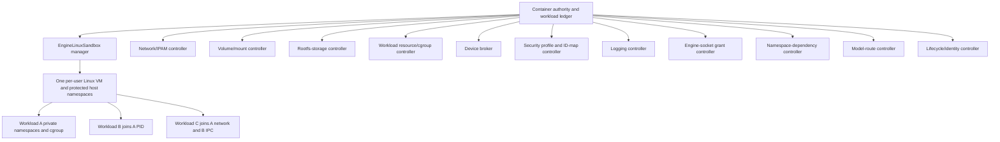

# Shared Namespaces and Docker-Complete Privileged Isolation Design

| Item | Value |
| --- | --- |
| Status | Design complete; implementation not started |
| Scope | `container-compose`, the matched `container` and `containerization` forks, the shared Engine API, devcontainer, and the common Linux workload sandbox |
| Compatibility target | Docker Compose 5.3.1 with Docker Engine 29.2.1 API 1.53 on macOS |
| Matched Container revision | `88460ab2ab0ca2f3fa9f91b2911b3b77647596c1` |
| Matched Containerization revision | `d7377b962af724f8d7c2b640f3ab12184d33f1af` |
| Design date | 31 July 2026 |

## Goal

Deliver the [shared-namespace and privileged-isolation parity contract](https://github.com/stephenlclarke/container-compose/issues/267). Completion means that Container provides one Docker-host-equivalent Linux kernel in which workloads are isolated by default but can independently:

- use private, engine-host, shareable, or donor PID, IPC, and network namespaces with Docker-compatible validation and lifecycle;
- retain per-workload mount/rootfs isolation, while UTS, user, and cgroup namespaces remain private unless their supported host mode is explicitly selected;
- join donors by immutable container identity without collapsing unrelated network or cgroup isolation;
- implement the effective Docker privileged policy for capabilities, devices, cgroups, `/sys`, system paths, security profiles, and read-only root filesystems;
- expose the real risk boundary: privileged controls the per-user Linux engine host and sibling workloads, but does not inherently control macOS or receive the Docker socket; and
- use the same sandbox, identity, resource transaction ledger, and selected Engine authority across Compose, native Container, Docker HTTP, and devcontainer clients.

This requires a topology change. Exact namespace parity cannot be added to the production one-VM-per-container runtime because two containers in different kernels cannot share a Linux namespace.

## Scope

### In scope

- `network_mode: service:NAME` and `container:NAME`, `pid: service:NAME` and `container:NAME`, `ipc: shareable`, `service:NAME`, `container:NAME`, `host`, `private`, and accepted `none` forms; the discriminator also routes arbitrary custom-name network modes to the owning-endpoint contract in the [advanced network design](advanced-network-ipam-design.md), never to a namespace donor.
- Docker's engine-host meaning for host PID, IPC, network, UTS, cgroup, and user namespace choices, bounded by the macOS VM. Container mount namespaces and root filesystems remain per-workload; bind propagation is handled by the mount plane and is not a namespace-join mode.
- Donor resolution, validation, immutable references, namespace handles, dependency reconciliation, restart/recreate/remove semantics, and inspect projection.
- Productionisation of Containerization's experimental multi-container primitives into one per-user `EngineLinuxSandbox` with complete per-workload configuration.
- Per-workload cgroups, namespaces, rootfs/mounts, processes, network endpoints, devices, logging, and lifecycle in the shared kernel.
- Docker-complete privileged create and exec semantics, including explicit-profile and read-only-rootfs interactions.
- Device-broker expansion for all engine-host devices and wildcard device-cgroup policy.
- Security, crash recovery, migration, observability, and performance evidence.

### Explicitly out of scope

- Joining macOS kernel namespaces; none exist for Linux containers to join.
- Making privileged safe from other workloads in the same Engine Linux host.
- Implicitly granting a Docker/Engine socket, host Keychain, macOS home directory, XPC service, or administrator credential.
- Windows process/Hyper-V isolation and `credential_spec`.
- Swarm task namespace scheduling or sharing across remote hosts.
- Live-moving a running workload between different donor namespaces.
- Treating one pod-wide pause process as an exact substitute for arbitrary Docker donor graphs.

## Normative Terms

`MUST`, `MUST NOT`, `SHOULD`, and `MAY` describe implementation requirements. “Host” in Docker namespace or privileged semantics means the selected Engine's Linux host, implemented here by the per-user Linux sandbox. “macOS host” is explicitly different. A donor is the immutable container whose active namespace is joined.

## Decisive Topology Constraint

Docker permits one new container to join PID donor A, IPC donor B, and network donor C, including donors created by another Compose project or directly through the Engine API. Those namespace objects must exist in the same Linux kernel.

The supported topology therefore becomes one per-user `EngineLinuxSandbox`:

- one durable VM and Linux kernel per selected enhanced Container authority;
- private PID, IPC, network, UTS, cgroup, and mount namespaces per workload by default, with user namespaces resolved from the Engine ID-map policy;
- per-workload rootfs, cgroup, process supervisor, device policy, mounts, logs, and lifecycle identity;
- engine-host namespaces owned by a protected sandbox init/service namespace;
- namespace FDs/handles fenced by joiner ID/process generation, sandbox generation, dependency `leaseGeneration`, and donor ID/process generation; and
- VM-level capacity and backhaul separate from workload resource limits and endpoints.

This sandbox is also the Linux storage/workload authority required by advanced volumes, the guest network substrate required by advanced IPAM, and the service plane used by journald/plugin logging workers. It is not an additional optional VM beside those designs.

## Current Evidence and Blockers

| Layer | Current boundary | Consequence |
| --- | --- | --- |
| Production topology | Container creates one VM per container. | PID, IPC, and network namespace sharing is physically impossible across containers. |
| Experimental topology | Containerization `LinuxPod` can share selected PID/IPC namespaces under one pause process. | It over-shares one pod-wide selection, lacks arbitrary donor graphs, has narrow workload configuration, and has no complete per-workload network lifecycle. |
| Networking | VZ/vmnet attachment is modelled at workload-VM creation. | A joiner cannot delegate all endpoint identity to a donor, and dynamic endpoints cannot be created as VZ hardware per Linux namespace. |
| Resources | Container configuration conflates VM capacity with workload cgroup controls. | Shared-sandbox workloads could resize or describe the VM instead of receiving isolated quota/weight/cpuset/memory/PIDs. |
| Identity | Existing paths often conflate mutable name and ID. | A namespace join can silently retarget after rename/recreate. |
| Privileged | Current code restores all capabilities and clears standard restricted paths. | Devices, wildcard cgroup access, writable `/sys`/cgroups, profile defaults, userns conflicts, and complete inspect truth remain missing. |
| Devices | Runtime inventory is a hard-coded guest list plus one virtio GPU subset. | “All host devices” and provider-specific device injection cannot be expressed truthfully. |
| Lifecycle | No durable namespace-dependency lease/transaction exists. | Donor removal/recreate, authority crash, and dependent cleanup can leak handles or produce stale references. |

Containerization's `LinuxPod` is the implementation seed, not the public Docker abstraction. It must be refactored around full `LinuxContainer.Configuration`-equivalent workload plans and arbitrary namespace selections.

## Namespace Contract

### Typed selection

```swift
public enum NamespaceSelection: Codable, Sendable {
    case engineDefault
    case `private`
    case host
    case join(containerID: String)
    case shareable
    case none
}

public enum UserNamespaceSelection: Codable, Sendable {
    case engineDefault
    case host
}

public struct LinuxNamespacePolicy: Codable, Sendable {
    public var pid: NamespaceSelection
    public var ipc: NamespaceSelection
    public var uts: NamespaceSelection
    public var cgroup: NamespaceSelection
    public var user: UserNamespaceSelection
}
```

`UserNamespaceSelection.engineDefault` is the empty Engine `UsernsMode`: the authority applies its
configured `LinuxIDMapPolicy`, which may be identity/no-remap or a private
remapped namespace. `host` is the exact Engine exemption from configured
remapping. Moby 29.2.1 accepts only empty or `host`; Compose 5.3.1 forwards a
literal `userns_mode: private`, so that spelling is retained by source/config
but fails at the Docker-matched container-create phase rather than becoming a
third runtime selection. The current identity-mapped `private` implementation
is migration-only legacy state as defined by the resource/security design.
Custom UID/GID ranges are Engine administration, not a Compose namespace value.

`LinuxNamespacePolicy` is the sole wire source for PID, IPC, UTS, cgroup, and
user selections. Only its IPC field accepts `shareable` and `none`; the model
validator rejects other invalid type/mode combinations before allocation.
Network namespace/endpoint selection exists only in
`RuntimeNetworkModeIntentV2`, so the create envelope cannot encode a conflicting
second network mode. Its donor case is consumed jointly by the namespace
dependency and network controllers: the former owns the donor lease and the
latter allocates no endpoint. Mount namespaces remain private for Docker
containers even when another namespace is joined. The effective plan holds
opaque namespace handles, not a donor name or guest path.

For PID, IPC, UTS, and cgroup, `engineDefault` preserves an omitted/empty
Docker mode while `private` preserves an explicit private request. The
authority resolves each to a separately stored effective selection at start;
it does not rewrite omission to an explicit mode in requested inspection or
re-encoding. This matters in particular for the Engine-dependent cgroup
namespace default. Oracle fixtures pin the effective default for the supported
Engine version and configuration, while the requested record remains empty.

| Field | Allowed requested cases |
| --- | --- |
| PID | `engineDefault`, `private`, `host`, `join(containerID:)` |
| IPC | `engineDefault`, `private`, `host`, `join(containerID:)`, `shareable`, `none` |
| UTS | `engineDefault`, `private`, `host` |
| cgroup | `engineDefault`, `private`, `host` |
| user | `engineDefault`, `host` |
| network | Solely `RuntimeNetworkModeIntentV2`: ordinary attachments, built-in bridge, host, none, donor, or unresolved custom-existing |

### Compose and Engine resolution

Docker Compose 5.3.1 resolves `service:X` to the first sorted target replica ID for network, IPC, and PID sharing. It rewrites the create request to the equivalent immutable `container:<id>` target. If the service has no eligible replica, create fails at the reference phase.

Raw Engine `container:name-or-id` requests are resolved and canonicalised to the donor's immutable ID before container creation. The persistent request records that ID and a durable namespace dependency lease; it does not freeze a live donor process generation at create. The start activation selects and records the exact live donor generation. Rename cannot retarget a dependant.

Compose also treats service namespace references as reconciliation dependencies. When a donor is recreated with a new ID, Compose cascade-recreates dependants; it does not live-retarget an existing workload or preserve a stale name reference.

### Validation and effective semantics

| Namespace | Join preconditions | Effective behaviour |
| --- | --- | --- |
| PID | Donor exists, is running, is not in an unusable restart/removal state, and is in the same selected engine sandbox. | Joiner sees/signals processes according to capabilities and UID mapping; it retains its own cgroup, mount, IPC, network, and UTS namespaces. |
| IPC | Donor exists/runs and its IPC mode is shareable where Docker requires it. | Joiner shares System V/POSIX IPC and the donor's `/dev/shm`; it does not receive donor mounts generally. |
| Network | Donor exists/runs and owns a network namespace. | Joiner allocates no interfaces, addresses, routes, DNS identity, hostname network identity, exposed endpoints, or port forwards. All traffic uses the donor namespace. |
| Custom network name/ID | The selected Engine network controller resolves one existing network at the Docker-matched create phase. | Workload owns a normal endpoint lease on the immutable resolved network ID; this is not namespace sharing and never grants ownership of the network resource. |
| Host | Selected sandbox host namespace exists and the particular mode is accepted. | Join the protected Engine Linux host namespace, never macOS. |
| Private | No donor. | Create a new per-workload namespace and required objects. |
| IPC none | No donor. | Create the Docker-oracled no-IPC/minimal effective configuration. |

A network joiner cannot connect/disconnect an additional network, publish independent ports, request its own MAC/static IP/interface name, or own DNS aliases that imply a separate endpoint. Conflict validation matches Compose/model and Engine create phases exactly.

Under engine user-namespace remapping, joining PID/IPC/network may require the Docker-oracled user-namespace relationship. The ID-map controller resolves this with the same effective mapping; it never guesses by numeric UID alone.

### Runtime lifecycle

The donor owns each namespace object. The authority stores a namespace lease with the exact domain field `leaseGeneration` for every dependant and keeps a required namespace handle alive according to Docker behaviour. Donor `processGeneration` and sandbox generation are separate live-handle validity clocks.

Durable dependency intent and a live namespace activation are separate records:

```swift
public enum LinuxNamespaceKind: String, Codable, Sendable {
    case pid
    case ipc
    case uts
    case cgroup
    case user
    case network
}

public enum NamespaceDependencyLeaseState: String, Codable, Sendable {
    case retained
    case releasing
    case recoveryRequired
    case released
}

public enum NamespaceActivationState: String, Codable, Sendable {
    case active
    case deactivating
    case recoveryRequired
    case released
}

public struct NamespaceHandleReferenceV1: Codable, Sendable, Equatable {
    public var schemaVersion: UInt32
    public var effectID: String
    public var owningControllerID: String
    public var controllerGeneration: UInt64
    public var providerID: String?
    public var providerGeneration: UInt64?
    public var protectedStoreObjectID: String
    public var integrityDigest: String
}

public struct ProtectedNamespaceEffectReferenceV1: Codable, Sendable, Equatable {
    public var schemaVersion: UInt32
    public var effectID: String
    public var owningControllerID: String
    public var controllerGeneration: UInt64
    public var providerID: String?
    public var providerGeneration: UInt64?
    public var protectedStoreObjectID: String
    public var integrityDigest: String
}

public struct NamespaceDependencyLeaseV1: Codable, Sendable, Equatable {
    public var schemaVersion: UInt32
    public var leaseID: String
    public var leaseGeneration: UInt64
    public var namespaceKind: LinuxNamespaceKind
    public var joinerContainerID: String
    public var donorContainerID: String
    public var state: NamespaceDependencyLeaseState
}

public enum NamespaceGuestEffectActionV1: String, Codable, Sendable, Equatable {
    case materialise
    case compensateCandidate
    case deactivate
    case reconcile
}

public struct NamespaceEffectOperationIdentityV1: Codable, Sendable, Equatable {
    public var operationID: String
    public var operationGeneration: UInt64
    public var actionID: String
    public var idempotencyKey: String
    public var semanticRequestDigest: String
    public var actionRequestDigest: String
}

public struct NamespaceActivationCandidateV1: Codable, Sendable, Equatable {
    public var schemaVersion: UInt32
    public var activationID: String
    public var owningControllerID: String
    public var controllerGeneration: UInt64
    public var operation: NamespaceEffectOperationIdentityV1
    public var namespaceKind: LinuxNamespaceKind
    public var joinerContainerID: String
    public var candidateProcessGeneration: UInt64
    public var sandboxGeneration: UInt64
    public var dependencyLeaseID: String?
    public var leaseGeneration: UInt64?
    public var donorContainerID: String?
    public var donorProcessGeneration: UInt64?
    public var handleReference: NamespaceHandleReferenceV1
    public var effectReference: ProtectedNamespaceEffectReferenceV1
}

public struct NamespaceActivationV1: Codable, Sendable, Equatable {
    public var schemaVersion: UInt32
    public var activationID: String
    public var owningControllerID: String
    public var controllerGeneration: UInt64
    public var namespaceKind: LinuxNamespaceKind
    public var joinerContainerID: String
    public var activeProcessGeneration: UInt64
    public var activeSandboxGeneration: UInt64
    public var dependencyLeaseID: String?
    public var leaseGeneration: UInt64?
    public var donorContainerID: String?
    public var donorProcessGeneration: UInt64?
    public var handleReference: NamespaceHandleReferenceV1
    public var effectReference: ProtectedNamespaceEffectReferenceV1
    public var state: NamespaceActivationState
}

public struct NamespaceGuestEffectRequestV1: Codable, Sendable, Equatable {
    public var schemaVersion: UInt32
    public var action: NamespaceGuestEffectActionV1
    public var activationID: String
    public var owningControllerID: String
    public var controllerGeneration: UInt64
    public var handleEffectID: String
    public var receiptEffectID: String
    public var operation: NamespaceEffectOperationIdentityV1
    public var namespaceKind: LinuxNamespaceKind
    public var joinerContainerID: String
    public var candidateProcessGeneration: UInt64?
    public var candidateSandboxGeneration: UInt64?
    public var activeProcessGeneration: UInt64?
    public var activeSandboxGeneration: UInt64?
    public var dependencyLeaseID: String?
    public var leaseGeneration: UInt64?
    public var donorContainerID: String?
    public var donorProcessGeneration: UInt64?
    public var handleReference: NamespaceHandleReferenceV1?
    public var effectReference: ProtectedNamespaceEffectReferenceV1?
}

public enum NamespaceAuthorityEffectAttemptPhaseV1: String, Codable, Sendable, Equatable {
    case requestPersisted
    case responseSealed
    case committing
    case compensating
    case deactivating
    case reconciling
    case recoveryRequired
    case committed
    case complete
}

public struct NamespaceAuthorityEffectAttemptV1: Codable, Sendable, Equatable {
    public var schemaVersion: UInt32
    public var request: NamespaceGuestEffectRequestV1
    public var returnedHandleReference: NamespaceHandleReferenceV1?
    public var returnedEffectReference: ProtectedNamespaceEffectReferenceV1?
    public var acknowledgementDigest: String?
    public var phase: NamespaceAuthorityEffectAttemptPhaseV1
}

public enum NamespaceGuestEffectDispositionV1: String, Codable, Sendable {
    case materialised
    case active
    case absent
    case deactivated
    case uncertain
}

public struct NamespaceGuestEffectTokenV1: Sendable {
    public init(boundedPrivateWireBytes: Data) throws
    public func withUnsafeBytes<Result>(
        _ body: (UnsafeRawBufferPointer) throws -> Result
    ) rethrows -> Result
}

public struct NamespaceGuestHandleMaterialV1: Sendable {
    public init(boundedPrivateWireBytes: Data) throws
    public func withUnsafeBytes<Result>(
        _ body: (UnsafeRawBufferPointer) throws -> Result
    ) rethrows -> Result
}

public struct NamespaceGuestEffectCallV1: Sendable {
    public var request: NamespaceGuestEffectRequestV1
    public var handleMaterial: NamespaceGuestHandleMaterialV1?
    public var effectToken: NamespaceGuestEffectTokenV1?
}

public struct NamespaceGuestEffectAcknowledgementV1: Sendable {
    public var request: NamespaceGuestEffectRequestV1
    public var materialisedHandleMaterial: NamespaceGuestHandleMaterialV1?
    public var disposition: NamespaceGuestEffectDispositionV1
    public var effectToken: NamespaceGuestEffectTokenV1?
}

public protocol NamespaceGuestEffectingV1: Sendable {
    func materialise(
        _ call: NamespaceGuestEffectCallV1
    ) async throws -> NamespaceGuestEffectAcknowledgementV1
    func compensateCandidate(
        _ call: NamespaceGuestEffectCallV1
    ) async throws -> NamespaceGuestEffectAcknowledgementV1
    func deactivate(
        _ call: NamespaceGuestEffectCallV1
    ) async throws -> NamespaceGuestEffectAcknowledgementV1
    func reconcile(
        _ call: NamespaceGuestEffectCallV1
    ) async throws -> NamespaceGuestEffectAcknowledgementV1
}
```

Joined candidates/activations require every optional dependency/donor field;
private and host forms omit them. Only PID, IPC, and network can own donor
dependency leases; UTS, cgroup, and user records can represent private/host
activation only. Create stages dependency intent inside its operation and
publishes a `retained` lease only with the container-create commit. Start
creates the operation-local, non-authoritative candidate above with the complete
materialise operation identity. The successful process-start commit atomically
copies its candidate process/sandbox values into a new `active`
`NamespaceActivationV1`; a failed candidate remains in the operation ledger and
compensates only its exact handle.

`NamespaceHandleReferenceV1` and `ProtectedNamespaceEffectReferenceV1` are
complete common protected-effect bindings for, respectively, the guest handle
material and the guest receipt/token. Their `effectID` values are globally
unique authority-reserved identities and are always distinct for one
activation. `owningControllerID` and `controllerGeneration` identify the
durable namespace-controller incarnation; this generation is not the parent
operation, guest process, or sandbox generation. The provider fields are a
closed optional pair: both are nil for the built-in guest namespace controller,
and both are present and immutable if a future selected namespace provider owns
the effect.

Each `protectedStoreObjectID` is meaningful only in its named controller
generation's protected store. `integrityDigest` is the authority-lineage HMAC
over the canonical reference fields other than `integrityDigest`, the SHA-256
of the bounded raw handle or token material, and the immutable
activation/action/reservation tuple. Before opening either object, the
controller matches both complete references to the request and verifies their
HMACs. Detachment, swapping the handle and receipt, a partial provider pair,
cross-controller use, and cross-provider-generation replay therefore fail
before raw resolution or a guest/provider call.

The semantic request digest binds `activationID`, namespace kind, immutable
joiner identity, exact controller generation, distinct handle/receipt effect
IDs, exact dependency/donor lease tuple where present, and the candidate or
active process/sandbox fence. The action digest additionally binds the method
action, stable `actionID`, complete handle/effect references when present, and
every optional-field disposition. Raw handle/token bytes, retry counters,
timestamps, and observations are excluded. Reusing an idempotency key,
`actionID`, or effect ID with a different action/digest conflicts.

`operationGeneration` is the parent lifecycle start/finalisation/removal
attempt from the common taxonomy. `actionID` and its guest idempotency key are
stable controller-action identities derived beneath that attempt; they neither
mint a second client operation nor replace the parent's idempotency record. The
namespace semantic digest derives from the parent semantic digest plus the
focused tuple above.

Before every new guest action, the authority durably writes the complete
canonical `NamespaceGuestEffectRequestV1` and a `requestPersisted` action
attempt to the common ledger. A retry or lost-reply reconcile reuses that exact
record rather than creating another action. The initial materialise action first
reserves `activationID`, distinct `handleEffectID` and `receiptEffectID` values,
and its own action-specific operation/idempotency identity. Its request has both
candidate fields, no active fields, and no handle/effect reference. The
non-Codable call carries neither handle nor token material.

For a new candidate-compensation, active-deactivation, or new-state reconcile
action, a second durable transition advances that exact attempt from
`requestPersisted` to `compensating`, `deactivating`, or `reconciling`
respectively before the guest call. The first tokenless reconcile of a lost
materialise reply is not a new action: it reuses the original materialise
attempt and byte-identical request. No effect or observation begins from an
unpersisted or action-ambiguous phase.

Before creating, retaining, or joining a namespace, the guest persists the
exact request reservation under `(owningControllerID, controllerGeneration,
activationID, handleEffectID, receiptEffectID, action, actionID, operationID,
idempotencyKey, actionRequestDigest)` and assigns its stable guest reservation
ID in that commit. The guest effect primitive tags the resulting namespace
object/reference with `activationID`, `handleEffectID`, and that reservation ID
before or atomically with making the effect visible; a substrate that cannot do
so first persists an equally stable handle mapping and is otherwise
unsupported. After the effect it persists the immutable handle material and a
guest-private sealed token outcome under their distinct IDs before replying. An
exact materialise retry returns the byte-identical acknowledgement, including
the same handle and token bytes. A guest crash after the effect but before
outcome persistence reopens the reservation and tagged object; it never scans
by container name or creates a second namespace.

The acknowledgement echoes the complete durable request. The authority seals
the bounded handle material and token under references carrying the two exact
reserved effect IDs and one matching controller/provider tuple, then atomically
writes both complete references into the `responseSealed` attempt before
acknowledging that response. The next ledger transition marks the attempt
`committing`; the following atomic transaction transfers those fields into
`NamespaceActivationCandidateV1` and marks the materialise attempt committed
before later start effects. A first reconcile after a lost materialise reply
resends the byte-identical persisted request with no handle/token material; the
guest returns the same handle/token bytes, proved `absent`, or `uncertain`.
Until that result is resolved, the authority cannot admit another materialise
key, activation, or process candidate.

Candidate compensation, active deactivation, and a new-state reconciliation
each receive their own stable `actionID`, idempotency key, action digest, and
durable authority attempt while retaining the original `activationID`,
`handleEffectID`, and `receiptEffectID`; cleanup cannot mint replacement effect
identities.
Candidate compensation carries the exact candidate process/sandbox tuple,
immutable handle reference, and protected receipt reference, with no active
fields. Deactivate has the exact active tuple and both complete references, with
no candidate fields. A `.reconcile` request carries exactly the candidate or
active tuple proved by the durable phase and the known references. The
non-`Codable` call resolves and carries both matching raw materials just in time.

The guest persists each compensation/deactivation/reconcile action reservation
and phase before mutation or observation. It persists the exact terminal
outcome before replying, so a lost cleanup reply replays the same `deactivated`
or `absent` acknowledgement. A crash after detaching but before outcome
persistence proves the tagged object absent under that reservation; it cannot
detach another activation. A conflicting action remains blocked until the
current action is committed, compensated, or recovery-required and reconciled.

Each request has dependency lease ID/generation and donor ID/process generation
either all present for a join or all nil for an owning namespace. The guest
rejects mixed tuples, changed digests, reused stable IDs, and stale sandbox or
donor generations. Every acknowledgement echoes the complete request fields; a
mismatch produces `uncertain`, never success.

`NamespaceGuestEffectCallV1` and acknowledgements are non-`Codable`
private-wire envelopes. Materialise and the first reconcile of its lost reply
carry no handle/token material. Candidate compensation, deactivate, and
reconciliation after receipt persistence resolve both durable protected
references and carry the bounded private handle and token. Raw material cannot
enter the authority or guest general state store, logs, events, diagnostics, or
public inspection; each side persists only complete protected references and
audit digests. The guest validates both materials against the action, request,
reservation, and protected-reference integrity digests and never accepts a
reference alone as authority.

Method/action combinations are closed. `materialise`, `compensateCandidate`,
and `deactivate` accept only their named actions and field shapes. `reconcile`
accepts either the byte-identical original `.materialise` request with no raw
material after a lost first reply, or `.reconcile` with an exact candidate/active tuple,
both references, and both raw materials. No other method/action combination is
valid.

Acknowledgement fields are also closed. `materialised` requires exact handle
material and one token only when the request has no protected references;
otherwise it returns neither. `active` requires the request's exact references
and returns no new material. `absent`, `deactivated`, and `uncertain` require no
returned material. Only `materialised`, `active`, `absent`, or `deactivated`
with a matching request can advance a phase; `uncertain` retains all protected
state and blocks commit or destruction.

Authority-attempt fields are closed. `requestPersisted` has no returned
handle/reference or acknowledgement digest. A materialise `responseSealed`
attempt has all three; a non-materialising response has only its acknowledgement
digest because its input handle/reference remains in the request. `committing`,
`compensating`, `deactivating`, and `reconciling` retain exactly the references
required by their request/last complete response. `recoveryRequired` retains
the complete field set of the interrupted phase. `committed` transfers a
materialised handle/reference into the candidate and keeps only audit digest;
`complete` owns no dereferenceable protected record even though its immutable
request retains the now-tombstoned complete references as audit evidence. An
optional cannot be cleared merely to look terminal.

This two-sided reservation closes both effect-to-outcome and
outcome-to-authority-persistence windows. After successful process commit the
same handle is represented by `NamespaceActivationV1`;
finalisation/deactivation must match its full tuple. Exact
candidate-compensation or active-deactivate acknowledgement is the only point
at which the authority may destroy both protected references.

Dependency transitions are `retained -> releasing -> released`; any
non-terminal state may become `recoveryRequired`, which returns to `retained`
only after exact donor/reference proof or resumes release. Activation
transitions are `active -> deactivating -> released`; an uncertain effect moves
to `recoveryRequired`, then returns to `active` only after proving the exact
current live tuple or resumes deactivation. Released records are terminal
tombstones retained through the common retry window. Same-action/key/digest
retries join or return the same staged/published effect and response; a
different action or digest conflicts. The guest retains each reservation,
tag/handle mapping, and sealed exact outcome through that advertised window;
successful authority acknowledgement alone cannot garbage-collect the only
copy needed to replay a delayed response.

`ProcessExitFinalizationV1` clears an activation only when activation ID,
namespace kind, joiner ID, active process generation, active sandbox
generation, dependency lease ID and `leaseGeneration`, donor ID/process
generation, immutable handle reference, and protected effect reference all
match. It first persists the exact action-specific deactivate request and clears
the activation only after its matching terminal acknowledgement. A handle or
effect reference cannot change during an activation; refresh creates a new
activation ID under a new start/recovery commit. Recovery treats any partial or
mismatched tuple as uncertain until reconciled with the guest; it never guesses
from a container name or current donor process alone.

- Donor rename does not affect the lease.
- Donor natural exit may leave a joined namespace alive for an already-running joiner.
- Donor exit releases only the donor owner's live reference. An already-running joiner retains its recorded old handle and donor process generation until that joiner exits.
- A new/restarted joiner resolves the donor's current active namespace and fails if it is unavailable.
- Donor restart may create a new namespace/process generation while an old joiner retains the old handle. Generation N and N+1 are distinct handles, and a stale finaliser for N cannot close N+1; exact per-namespace behaviour is frozen by the oracle.
- Donor recreate produces a new immutable ID; Compose recreates service dependants rather than retargeting them.
- Donor remove validates or coordinates dependant leases using Engine-compatible force/conflict behaviour.
- Dependant removal releases only its lease; it cannot tear down the donor namespace.

The lifecycle journal records dependency resolution/release internally. It emits only Docker actions that the pinned Engine exposes.

## Production Linux Sandbox

### Sandbox and workload split



`EngineLinuxSandboxManager` owns only VM capacity, boot, guest-agent channel, kernel/capability fingerprint, protected host namespaces, backhaul, storage-pool attachment, service namespace, reconciliation, and idle policy.

`WorkloadPlanResolver` composes leases from specialised controllers and asks Containerization to materialise one effective workload. Containerization owns generic Linux namespace/cgroup/process/rootfs mechanics; it does not parse Docker/Compose strings or choose providers.

### Per-workload requirements

Every workload retains:

- stable immutable container/workload ID and process generation;
- separate rootfs and mount namespace;
- separate cgroup leaf with resources, freezer, OOM counters, and device BPF/cgroup policy;
- requested namespace selections and resolved donor handles;
- OCI process, environment, capabilities, rlimits, seccomp/AppArmor/label policy;
- device nodes/mounts/hooks resolved by the device broker;
- logging endpoints and attach/exec sessions; and
- network endpoint ownership or an explicit donor delegation.

Starting, stopping, pausing, updating, OOM-observing, restarting, or removing one workload MUST NOT operate on the entire sandbox or unrelated workloads.

### Network substrate correction

VZ/vmnet is a VM-level backhaul, not a per-container endpoint. The sandbox guest requires a production network controller that creates per-workload Linux network namespaces, veth/TAP endpoints, bridges/routes, proxy ARP/NDP as needed, DNS forwarding, firewall/NAT state, and port-forward ownership dynamically.

The macOS authority retains IPAM and provider identity; the guest applies an authenticated effective endpoint plan. A network joiner receives no endpoint plan and delegates inspection/traffic to the donor ID. See [the advanced network/IPAM design](advanced-network-ipam-design.md).

## Docker-Complete Privileged Contract

### Requested DTOs

```swift
public struct ContainerPrivilegeIntentV2: Codable, Sendable {
    public var schemaVersion: UInt32
    public var privileged: Bool
    public var capAdd: [String]?
    public var capDrop: [String]?
    public var readOnlyRootfs: Bool
    public var maskedPaths: [AbsoluteGuestPath]?
    public var readOnlyPaths: [AbsoluteGuestPath]?
}

public struct ExecPrivilegeIntentV1: Codable, Sendable {
    public var schemaVersion: UInt32
    public var privileged: Bool
}
```

`nil` versus an explicit empty capability/path list remains distinct. Requested
capability order, duplicates, spelling, and path order survive to authority
validation and Docker inspect projection; only the effective plan canonicalises
capability sets. `ContainerPrivilegeIntentV2` is immutable container-create
policy and is the common create envelope's sole privilege field.

`ExecPrivilegeIntentV1` belongs only to an exec-create request. It changes the
new exec process at the Docker-oracled boundary but never mutates the
container's persisted privilege policy, creates device/mount/namespace leases,
or grants an Engine socket. The oracle freezes the exact capability/profile
effect and failure residue for privileged exec in privileged and unprivileged
containers.

### Effective policy

For a privileged workload, the resolver applies:

- every Linux capability available to the Engine Linux host;
- every device exposed to that host by the DeviceBroker;
- wildcard `rwm` device-cgroup access;
- device nodes/mounts required by the engine-host inventory;
- writable `/sys` and, normally, writable cgroup mounts under the oracle's cgroup-v2/userns rules;
- cleared default OCI masked and read-only system-path lists;
- default seccomp, AppArmor, and SELinux isolation disabled/unconfined;
- ignored device-specific `rwm` restrictions because wildcard policy supersedes them; and
- Docker-compatible writable proc/sys mount treatment and inspect projection.

Privilege does not automatically select host PID, IPC, network, UTS, user, or cgroup namespaces. On cgroup v2, the default cgroup namespace remains private where Docker does. A caller requests host modes independently.

An explicitly supplied seccomp, AppArmor, or label profile remains effective even with privileged when the reference applies it. An explicit read-only root filesystem remains read-only. No-new-privileges/profile/userns conflicts follow the pinned Engine rather than a blanket privileged override.

### Create and exec

Service/container privileged is part of the immutable/effective workload policy. `docker compose exec --privileged` and Engine Exec privileged alter the exec process's capability/security/device access only to the extent supported by an already-created container and Docker's oracle; they do not retroactively change the container namespace, rootfs mount, device inventory, or Engine-socket grants.

The runtime MUST distinguish requested privilege from effective capabilities/devices/profile state for inspect and diagnostics. It MUST fail unavailable mandatory device/profile operations rather than label a partial container privileged.

### Security boundary

A privileged process can deliberately damage or observe the per-user Engine Linux host and sibling workloads to the extent Docker privilege permits. The design does not market this as strong tenant isolation.

The outer boundary is:

- the macOS per-user Container authority and process credentials;
- the VM/hypervisor boundary;
- authenticated guest-agent protocols with host-authoritative operations;
- narrow host bind/block/device brokers using explicit leases; and
- an Engine socket that is absent unless separately granted.

The guest stores no broad macOS credential, Keychain material, arbitrary XPC capability, or administrative host handle. Guest-originated requests cannot create host resources without an authority-issued workload transaction and exact lease.

## DeviceBroker Dependency

The device broker provides an engine-host inventory and resolves typed requests to sandbox- and workload-level artefacts. Privileged expands to every inventory entry plus wildcard policy. It does not scan or forward arbitrary macOS `/dev` paths.

Each device lease can contain:

- VM/sandbox attachment (graphics, USB, block, broker transport);
- workload OCI device node and ownership/mode;
- cgroup/BPF permission;
- mount, environment, hook, annotation, or CDI edit;
- exclusivity/shareability, health, `providerGeneration`, `inventoryGeneration`, `leaseGeneration`, and one optional `activeActivationID`/`activeProcessGeneration`/`activeSandboxGeneration` tuple whose fields are all set or all nil; and
- idempotent release/recovery data.

If host APIs cannot expose a device to Linux, it is not in the Engine host inventory. Privileged cannot claim it. NVIDIA/CUDA or unsupported vendor hardware fails truthfully rather than becoming metadata-only success.

## Workload Transactions and Recovery

Docker create and process start are separate ledger transactions. Create MUST
NOT acquire a live process-generation resource merely because a later start may
need it.

Before opening the public create transaction, the selected authority performs
all side-effect-free create preflights in Docker error-precedence order. This
includes request/version/name shape, cross-domain conflicts, logging
default/provider/create-safe option validation, namespace/network resolution
shape, resource/security/rootfs/device capability shape, and model/socket
intent. A failed preflight may retain only a protected idempotency/attempt
result; it allocates no public container ID, holds no name reservation, creates
no resource, and exposes no inspectable container.

After preflight, the create transaction:

1. begins the `operationGeneration`, allocates the candidate immutable ID, and
   reserves the canonical name under the same uncommitted operation;
2. persists exact requested lifecycle, namespace, network, privilege,
   resource/security/rootfs, device, logging, socket, and model-route intent;
3. resolves durable donor identity/dependency intent and requested effective
   network ownership without acquiring a live namespace handle;
4. snapshots create-owned profile/ID-map references and allocates only those
   endpoint/address, rootfs, volume reference, generated-artifact, or other
   durable resources that the pinned Docker oracle proves are create-time
   effects;
5. stages non-live route/socket/logging/device dispositions and stopped inspect
   state; and
6. atomically publishes the ID/name/container record, commits create, and emits
   its event. Failure before this point compensates transaction-owned effects
   and releases the uncommitted name; the attempt record alone may remain.

That commit is the generic `ContainerCreate` boundary, not necessarily the end
of a higher-level Compose command. An oracle-proven post-create configuration or
artifact-projection phase runs after it. If that phase fails where Docker keeps
the created object, the authority retains the inspectable stopped container,
sealed artifact, and recovery metadata; it does not roll the committed identity
back. Failure to store/seal a create-owned artifact before the commit still
compensates with no public container. Each focused design identifies which side
of this boundary its failure occupies.

The start transaction:

1. reserves an `operationGeneration` and candidate `processGeneration`, then
   validates the current `sandboxGeneration`, provider/inventory generations,
   donor dependency, and every persisted create-time lease;
2. acquires the live namespace/cgroup/profile/ID-map materialisation and stages
   owning-endpoint or donor-delegation activation;
3. resolves and stages physical device leases, mounts/volume attachments,
   logging session, and explicit Engine-socket relay; validates/reconciles the
   existing `.ready` `ModelRouteLease` with no activation and stages only its candidate-process
   activation. Each uses its existing/new domain `leaseGeneration` as
   appropriate; start never allocates a second durable model-route lease;
4. materialises the rootfs, namespaces, cgroup, devices, mounts, network, and
   process configuration in dependency order;
5. after the effective network is ready, activates the model route and readies
   the logging writer and Engine-socket relay;
6. starts the process and atomically commits `processGeneration` plus the live
   activation handles; and
7. publishes `start` only after that commit.

A failed start compensates only effects created or activated for its candidate
generation, retains the stopped container and all Docker-retained create intent,
and never publishes a false running state. The lifecycle design's
`ProcessExitFinalizationV1` clears old-generation activation handles after
natural exit, stop, kill, and automatic/explicit restart; ordinary start
re-resolves them and cannot begin until finalisation is durable.
Automatic-restart backoff may retain only the safe deactivated reservations or
reference-counted donor handles explicitly allowed by the focused controller
contracts.

The model-route reservation occurs only after endpoint ownership or donor
delegation identifies the effective network namespace. Create persists a
`.ready` route lease with no activation; start activates/reconciles it only
after the effective network is materialised, and process-exit finalisation
deactivates it. `network_mode: none` records an intentionally unreachable
disposition and allocates no route. Failure and removal release the model-route
lease before endpoint or namespace teardown and never unload global model
content.

The ledger records owner, exact canonical request/action digests and generation
fields, protected external-effect reference, and completion for every phase;
raw tokens remain outside the general ledger. Failure compensates in reverse
order using stable lease IDs. Authority or guest restart resumes every durable
action attempt and reconciles its exact guest reservation/tag against actual
sandbox state before replay or another namespace effect. Removal uses the
lifecycle design's `removing`/`dead` transaction and does not release a donor or
shared device owned by another workload.

One authority and ledger do not imply one god controller. Lifecycle/identity,
network/IPAM, volume/mount, rootfs-storage, workload resource/cgroup,
DeviceBroker, security-profile/ID-map, logging, Engine-socket,
namespace-dependency, and model-route services remain separately testable
controllers behind their canonical typed policies or leases.

## Migration and Compatibility

- Advertise independent versioned capabilities:
  `io.github.stephenlclarke.container.linux-sandbox.v1` for the production
  shared-kernel topology,
  `io.github.stephenlclarke.container.shared-namespaces.v1` for the canonical
  donor/shareable namespace contract,
  `io.github.stephenlclarke.container.container-privilege.v2` for complete
  create-time `ContainerPrivilegeIntentV2`, and
  `io.github.stephenlclarke.container.exec-privilege.v1` for complete
  `ExecPrivilegeIntentV1`. Clients require only the capability for the feature
  they use and fail before mutation when it is absent; no broad sandbox or
  donor flag implies complete privileged create or exec behaviour.
- Introduce the shared sandbox alongside the legacy one-VM runtime for migration only. The one selected authority may serially drive legacy drain and v2 staging beneath the coherent migration lock, but no independent/parallel legacy writer or second daemon may mutate that Engine state root.
- Existing legacy container records are imported to stable v2 IDs and later rematerialise their runtime in the sandbox under that same ID; a running VM is drained/stopped, never live-imported by pretending its namespaces survive. Only an ordinary Docker/Compose replacement creates a new container ID.
- Import stable IDs/names/storage/network/volume metadata through the central authority. Preserve data and explicit ownership; namespace handles/process generations are not migratable.
- Provider selection is exclusive. devcontainer's enhanced provider discovers the same `container-engine` service/sandbox; its stock provider remains a separate explicit profile and never joins enhanced runtime namespaces.
- Make the sandbox's durable Linux storage pool foundational even if some managed-directory mounts retain an optimised host path.
- Stack pins for Container, Containerization, guest `vminitd`, Compose, Engine API, and devcontainer API package move together.
- Rollback drains shared-sandbox workloads or retains the prior complete stack; it cannot project a donor graph back into independent VMs.

### Wave 8 namespace handoff

The `.namespaces` part of `ProviderHandoffManifestV1` contains each container's exact requested `LinuxNamespacePolicy`, requested network donor intent, immutable joiner/donor container IDs, committed authority-owned dependency lease ID/generation/state, and terminal released namespace dependency/activation tombstones needed as namespace-domain evidence. Retained dependency identities survive the authority-lineage transfer because they describe durable intent and contain no provider-local handle. Releasing or recovery-required dependencies must reconcile before quiescence. Each namespace-domain record may reference its generic lifecycle operation by immutable operation ID, but the generic operation/idempotency key, retry state, cached outcome, and generic outcome/tombstone exist solely in `identityLifecycleEvents` and are never copied into `.namespaces`.

A released tombstone projection contains only its stable dependency lease ID/generation or activation ID, namespace/joiner/donor identities, terminal release-evidence digest, and immutable generic operation-ID reference. It contains no generic operation fields or outcome and cannot be used to reactivate a namespace.

The part excludes every namespace FD/opaque handle, every live or non-terminal `NamespaceActivationV1`, `NamespaceAuthorityEffectAttemptV1`, candidate/active process generation, sandbox generation, and observation/session token. A released activation contributes only its terminal namespace-domain tombstone projection, with no handle/effect reference or process/sandbox generation. All non-terminal namespace action attempts reconcile/compensate, and all running, paused, or restarting processes are drained with their activation finalisers complete before the source checkpoint. Destination validation proves the complete donor graph is closed over included immutable IDs and compatible user-map/sandbox policy; an excluded, renamed, colliding, or unresolved donor makes the part `explicitResolutionRequired` and prevents commit.

The signed common commit only fences the sources and makes the destination `destinationReconciling`; it does not publish namespace state or admit an ordinary start. During `reconciling`, the namespace controller promotes the frozen dependency intent and terminal tombstones through ordinary controller transactions, without resolving a sandbox handle or creating a guest effect. Only after the signed Complete outcome makes the destination `destinationActive` may an ordinary later start re-resolve engine defaults and host/private policy against its sandbox, reserve fresh handle/receipt effect IDs, and create a candidate/activation. The namespace part cannot independently change a lease ID/generation, retarget a donor, switch a writer, or tombstone the source.

## Observability

Protected inspection includes sandbox ID/kernel/capability fingerprint, immutable `containerID`, active `processGeneration`, relevant domain `leaseGeneration` values, requested/effective namespace selections, donor IDs, cgroup path, endpoint ownership/delegation, requested/effective privilege, device inventory/leases, profile digests, and recovery phase. Public Docker inspect exposes only fields/actions matching the API target.

Metrics cover active/private/joined namespaces, donor fan-out, leaked/reconciled handles, sandbox boot/reconnect time, workload create/start latency, device lease contention, privileged counts, controller rollback, and endpoint operations. Labels use bounded provider/state values, never container names, host paths, or profile contents.

## Performance Contract

The topology should remove per-container VM boot and hardware configuration overhead while retaining isolation. It must not replace that cost with serial global locks or a guest call per inspect field.

- Warm sandbox workload creation is incremental.
- Namespace/network/mount/device plans are applied in bounded parallel phases when independent.
- Reads use the authority's committed snapshot, not synchronous guest scans.
- Per-workload cgroup/network observations stream or batch.
- Keyed locks scope to workload/resource/donor; the sandbox lifecycle lock is not held across ordinary container start.

Paired release-build median/P95 evidence covers cold/warm sandbox, 1/10/50 private workloads, each donor mode, mixed donor graphs, privileged create/exec, restart/remove, device allocation, and authority/guest recovery. Behavioural parity and performance remain separate judgements.

## Cross-Design Dependencies

| Design | Shared contract |
| --- | --- |
| [Coherent Container-family architecture](coherent-container-family-parity-design.md) | Makes the Engine Linux sandbox, selected provider, shared Engine service, workload resolver, and transaction ledger foundational. |
| [Advanced network/IPAM](advanced-network-ipam-design.md) | VM-level backhaul plus guest per-workload endpoints; network joiner delegates all endpoint identity. |
| [Volumes/mounts/API socket](non-local-volumes-advanced-mounts-api-socket-design.md) | One durable storage/workload sandbox, dynamic mount namespaces, socket grant independent of privilege. |
| [Lifecycle states/actions](docker-lifecycle-states-actions-design.md) | Stable IDs/generations, donor dependencies, pause/OOM, restart/recreate, removing/dead recovery, and events. |
| [Resource/security controls](remaining-resource-security-controls-design.md) | Per-workload cgroups, engine ID maps, profile snapshots, writable cgroups, and requested/effective state. |
| [Local Deploy subset](local-deploy-device-resource-subset-design.md) | Shared DeviceBroker and leases; scheduler-only fields remain ignored locally. |
| [Logging drivers](docker-logging-driver-semantics-design.md) | Logging workers live in protected service namespaces; privilege is not a boundary from those Linux services. |
| [Model-runner services](model-runner-services-design.md) | Host-native runner stays outside sandbox; guest inference reachability follows donor network namespace. |

## Implementation Work Packages

| Stable ID | Owner | Work package | Exit evidence |
| --- | --- | --- | --- |
| <a id="namespace-wp-01"></a>`NAMESPACE-WP-01` | Oracle harness | Pin create/inspect/error/lifecycle semantics for every namespace and privileged/profile/device combination. | Versioned Docker/Compose black-box corpus plus guest probes. |
| <a id="namespace-wp-02"></a>`NAMESPACE-WP-02` | Shared Engine/provider contracts | Add namespace/security DTOs, capability negotiation, and selected-adapter gateway routes without advertising a production sandbox. | Stock/enhanced adapters round-trip requested policy without owning resource state. |
| <a id="namespace-wp-03"></a>`NAMESPACE-WP-03` | `container` | Add immutable identity, lifecycle record, workload transaction ledger, action-specific namespace effect request/phase attempts, complete protected handle/receipt bindings, specialised controller leases, and recovery contracts. | Every request and pre-effect action phase is durable before its guest call; effect/controller/provider/store/HMAC substitution fails before raw resolution; donors and leases have stable owners; and crash injection leaves no orphan or false success. |
| <a id="namespace-wp-04"></a>`NAMESPACE-WP-04` | `containerization` | Refactor `LinuxPod`/`LinuxContainer` into production `EngineLinuxSandbox` with full per-workload configuration and compatibility wrappers, consuming the identity/ledger contract from step 3. | Private workload isolation and independent lifecycle tests pass. |
| <a id="namespace-wp-05"></a>`NAMESPACE-WP-05` | Guest/network | Add dynamic per-workload cgroups, namespaces, veth/TAP endpoints, routing/DNS, mount/rootfs APIs, and namespace handle management. | 1/10/50 workload and fault tests show no cross-workload operation. |
| <a id="namespace-wp-06"></a>`NAMESPACE-WP-06` | `container`/guest | Implement donor resolution, namespace joins, shareable IPC/`/dev/shm`, dependency leases, distinct handle/receipt effect IDs, guest reservation/tag/outcome persistence, tokenless first-reply reconciliation, and recreate/remove rules. | PID/IPC/network oracle, lost-reply, action-idempotency, protected-reference, and donor lifecycle matrices pass without duplicate, swapped, or untracked handles/receipts. |
| <a id="namespace-wp-07"></a>`NAMESPACE-WP-07` | Device/security | Implement DeviceBroker inventory/all-device expansion, wildcard cgroup policy, `/sys`/cgroup mounts, profile defaults/overrides, and inspect truth. | Privileged positive/negative oracle passes. |
| <a id="namespace-wp-08"></a>`NAMESPACE-WP-08` | `container-compose` | Replace CLI-shaped namespace/privilege hand-off with typed policy and exact dependency reconciliation. | Compose service/container forms and exec privileged pass. |
| <a id="namespace-wp-09"></a>`NAMESPACE-WP-09` | `devcontainer`, gateway, and `container` | Prepare the sole canonical `.namespaces` part package and client path, promote its frozen intent only during coherent Wave 8 reconciliation, and admit the ordinary writer only after signed Complete; retain the isolated standalone stock profile. | Cross-client identity/donor/event sequence is singular, committed/reconciling roots expose no ordinary namespace effect, no partial cutover occurs, and stock mode remains independent. |
| <a id="namespace-wp-10"></a>`NAMESPACE-WP-10` | Whole stack | Legacy migration, rollback, security/fault/performance evidence, docs/status, pins, and release. | Definition of Done passes on matched release stack. |

## Required Test and Evidence Matrix

### Namespace behaviour

- Every omitted/default/private/host/shareable/none/service/container form, case/error syntax, name/ID/prefix resolution, first sorted replica, cross-project and direct Engine donors; requested inspection/re-encoding retains omission separately from explicit private.
- PID visibility, signalling, `/proc`, init exit/restart, user mapping, capabilities, and independent cgroup/resource updates.
- System V/POSIX IPC, semaphore/shared-memory lifecycle, `/dev/shm` identity/size/content, donor not shareable.
- Network interfaces, routes, addresses, DNS/hostname, port ownership, host/none/IPv4/IPv6, connect/disconnect rejection, and no duplicate endpoint allocation.
- Mixed donor graph A/B/C, rename, pause, stopped/restarting donor, natural exit, restart, recreate, remove, force remove, dependant restart/remove, and authority reboot.
- Crash before authority request persistence, after authority persistence, after each action-specific compensating/deactivating/reconciling phase, after guest reservation, after durable tag/handle mapping but before effect visibility, after guest materialisation but before outcome persistence/reply, before authority token sealing, after `responseSealed`/`committing`, after candidate persistence, and after process commit; exact tokenless reconcile proves the same handle/token, absence, or uncertainty, and no duplicate handle survives.
- Lost compensation/deactivate/reconcile replies before and after guest terminal-outcome persistence replay the same acknowledgement; same action/key/digest joins, changed action/digest conflicts, and no cleanup can target another activation.
- Delayed exact retries before retry-window expiry, including after guest and authority restart, return the same sealed outcome; garbage collection cannot shorten the advertised replay contract.
- Every invalid method/action, mixed candidate/active/dependency/donor tuple, disposition/optional-field combination, raw-token persistence attempt, and acknowledgement mismatch fails closed as recovery-required.
- Protected-reference fixtures substitute each handle/receipt effect ID, owning controller ID/generation, provider optional-pair shape, provider ID/generation, protected-store object ID, and integrity digest; swap the two references; and replay them across sandbox/provider generations. Every case fails before protected-object opening or a guest/provider call, and materialise always uses two distinct authority-reserved effect IDs.
- Stale joiner-N finalisation after joiner N+1 starts; donor N exit/restart while an old joiner retains N and a new joiner binds N+1; exact tuple/effect-reference reconciliation after authority/guest restart prevents either old finaliser from clearing N+1.

### Isolation and failure

- Private workloads cannot see/signal/read IPC/sniff interfaces/mount files/cgroup-control/devices of peers under baseline policy.
- Pause/update/OOM/restart/remove of one workload does not affect another.
- Guest-agent/authority/VM crash and reconnect at every authority-attempt and guest reservation/effect/outcome phase; namespace handle and donor refcount reconciliation never scans by mutable name.
- Malicious guest request, stale generation, forged donor ID, symlink/path/device escape, and interrupted rollback.

### Privileged

- Complete capability set, engine inventory devices, wildcard device access, `/sys`, cgroup v2 mount/control, masked/read-only paths, proc/sys behaviour, rootfs read-only, and inspect projection.
- Default versus explicit seccomp/AppArmor/label profiles; no-new-privileges/userns/cgroup namespace conflicts; service create and exec privileged differences.
- Privileged does not implicitly join host PID/IPC/network/user/cgroup namespaces.
- Privileged does not access macOS host paths, other users, XPC/Keychain, model management, or Engine socket without explicit grants.
- Unavailable device/profile/capability fails or warns exactly as Docker; never partial silent success.

### Cross-client and performance

- Native Container, Compose, Engine API, Docker CLI, and devcontainer create/join/inspect/restart/remove the same IDs and observe one state/event sequence.
- Handoff fixtures accept released namespace dependency/activation tombstones only in `.namespaces`, accept their generic operation/idempotency outcome or tombstone only in `identityLifecycleEvents`, resolve the immutable cross-part operation ID after staging, and reject a wrong-owner or duplicate record before commit.
- Handoff phase fixtures prove commit produces only a token-fenced `destinationReconciling` root, reconciliation promotes frozen dependency intent without handle/effect creation, and ordinary namespace materialisation remains unavailable until the signed Complete transition to `destinationActive`.
- Cold/warm sandbox and 1/10/50 private/joined/privileged release-build median/P95 with raw evidence retained.

## Definition of Done

| Area | Required proof |
| --- | --- |
| Topology | One production per-user Linux sandbox supports isolated workloads and arbitrary same-kernel donor graphs. |
| Defaults | Every workload has independent PID/IPC/UTS/user/cgroup/network/lifecycle state unless an allowed host/donor mode is selected; mount namespaces and rootfs remain per-workload under all supported namespace modes. |
| Resolution | Service/name references canonicalise to immutable IDs; replica selection and dependency recreation match Compose. |
| PID/IPC/network | Join semantics, validation, donor lifecycle, inspect, and conflicts pass the pinned oracle. |
| Network isolation | Dynamic guest endpoints preserve private workload isolation; joiners allocate/delegate exactly once. |
| Privileged | Capabilities, all devices, wildcard cgroup, `/sys`/cgroups, paths, profiles, read-only rootfs, and inspect pass. |
| Boundary | Documentation/tests prove Linux-host danger while macOS/socket/credentials remain outside without explicit grants. |
| Recovery | Durable action requests/phases, complete protected handle/receipt bindings with distinct effect IDs, guest reservations plus visibility-atomic tags, exact outcome replay, tokenless first-reply reconciliation, leases, and reverse compensation survive authority, guest, VM, and controller failures without leaks; every reservation-to-effect, effect-to-outcome, outcome-to-authority-persistence, and cross-generation-substitution window closes without namespace scans. |
| Shared authority | Compose, Container, Docker HTTP, and devcontainer use one selected sandbox/identity/journal. |
| Migration | Legacy VM and devcontainer data migration/rollback preserve stable resources or stop safely; namespace-domain released tombstones live only in `.namespaces`, generic operation/idempotency outcomes and tombstones live only in `identityLifecycleEvents`, wrong-owner/duplicate records fail before commit, and no dual writer exists. |
| Authority handoff | Commit leaves the destination token-fenced and non-public; only reconciliation promotes immutable namespace intent without live effects; signed Complete activates the ordinary writer; no candidate, handle, or receipt is created before that boundary, and no signed disposition changes after manifest binding. |
| Performance | Release-build lifecycle and namespace metrics are comparable to or better than Docker in each metric's declared direction outside the noise band. |

## Primary References

- [Compose network mode reference](https://docs.docker.com/reference/compose-file/services/#network_mode)
- [Compose PID reference](https://docs.docker.com/reference/compose-file/services/#pid)
- [Compose IPC reference](https://docs.docker.com/reference/compose-file/services/#ipc)
- [Docker privileged mode](https://docs.docker.com/engine/containers/run/#runtime-privilege-and-linux-capabilities)
- [Docker Compose 5.3.1 shared-namespace resolution](https://github.com/docker/compose/blob/v5.3.1/pkg/compose/convergence.go)
- [Docker Compose 5.3.1 dependency reconciliation](https://github.com/docker/compose/blob/v5.3.1/pkg/compose/reconcile.go)
- [Moby 29.2.1 namespace canonicalisation](https://github.com/moby/moby/blob/6bc6209b88a7a834c91f77d848e025c79e0227a1/daemon/daemon_unix.go)
- [Moby 29.2.1 privileged OCI handling](https://github.com/moby/moby/blob/6bc6209b88a7a834c91f77d848e025c79e0227a1/daemon/oci_linux.go)
- [Pinned Containerization LinuxPod](https://github.com/stephenlclarke/containerization/blob/d7377b962af724f8d7c2b640f3ab12184d33f1af/Sources/Containerization/LinuxPod.swift)
- [Current runtime namespace support](../../Sources/ComposeCore/ComposeOrchestratorRuntimeSupport.swift)
- [Current stable functionality](../project/STATUS.md)
