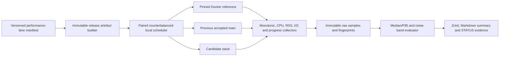

# Remaining macOS Parity Closure Design

> [!NOTE]
> This 31 July 2026 programme review is archived. Its live backlog role was
> superseded on 15 August 2026 by
> [BACKLOG.md](../project/BACKLOG.md) and the cross-repository GitHub issue
> hierarchy rooted at [issue #266](https://github.com/stephenlclarke/container-compose/issues/266).
> It remains here only as historical design and audit evidence.

| Item | Value |
| --- | --- |
| Status | Archived; superseded as a live programme tracker by BACKLOG.md and GitHub issue #266. |
| Scope | Residual gaps between [`STATUS.md`](../project/STATUS.md) and the focused Container-family parity designs |
| Compatibility target | Docker Compose 5.3.1 with Docker Engine 29.2.1 API 1.53 on macOS |
| Primary execution host | Local MBP, using matched non-debug release artefacts |
| Design date | 31 July 2026 |
| Last documentation review | 15 August 2026 against the 0.11.0 release and current STATUS/help ledger |

## Outcome

The focused designs cover nearly every functional row in the authoritative
STATUS short list. Excluding provider-specific hardware success that cannot be
claimed on an incapable host, only one confirmed macOS-local parity gap lacks a
focused implementation design: **complete comparable-or-better performance
evidence and optimisation**.

Other STATUS concerns must be resolved, but they must not be turned into
speculative feature work:

1. links and external-link discovery text is internally inconsistent and needs
   a pinned Docker oracle before any implementation decision;
2. identity/process/profile and Dockerfile/build rows are marked partial without
   naming a missing behaviour, while the detailed register says the feasible
   Build surface is complete;
3. `userns_mode: private` is described as compatible despite the pinned
   empty/`host` Engine contract and must be reconciled without blessing the
   migration-only identity-map path;
4. `attach`, `logs`, `run`, and `up` retain partial markers after the released
   live-attach/history split because their complete external-client, provider,
   failure, migration, security, and comparable-performance evidence remains;
5. Windows-only `credential_spec` must not be worded as a macOS runtime gap;
   and
6. stock Apple release support depends on APIs outside this programme's control
   and is a compatibility/adoption lane, not a defect in the supported enhanced
   provider.

This design closes those residual design gaps. It does not replace the
[coherent Container-family architecture](../architecture/coherent-container-family-parity-design.md)
or any focused design. It supplies the performance implementation plan,
machine-checkable STATUS coverage, hardware/provider feasibility rules, and
oracle-first reconciliation needed to decide when the parity ledger can
truthfully become green.

## Goals

- Account for every partial or blocking STATUS row as implemented, covered by a
  focused design, an actionable residual, an oracle-reconciliation item, an
  evidenced platform non-goal, or an external compatibility dependency.
- Build a local-first, release-grade performance harness covering every missing
  representative lane and optimise each material regression until it is
  comparable to or better than Docker in the metric's declared direction.
- Separate generic DeviceBroker/CDI semantics from provider-specific hardware
  feasibility so unavailable NVIDIA, multi-GPU, or arbitrary passthrough
  hardware is never faked and does not hide actionable non-GPU work.
- Resolve stale or unexplained partial markers from executable oracle evidence,
  not prose judgement.
- Keep `STATUS.md`, help, design progress, capability manifests, and retained
  evidence derived from the same exact-head requirement ledger.
- Preserve the enhanced matched stack as the full parity target while keeping
  the stock Apple devcontainer provider truthful, independent, and eligible to
  adopt future upstream primitives.

## Non-Goals

- Reimplementing work already owned by the focused network, storage, logging,
  lifecycle, resource/security, model, namespace, or Local Deploy designs.
- Claiming NVIDIA/CUDA, multiple physical GPUs, arbitrary USB/PCI passthrough,
  or accelerated rendering on a Mac/provider that cannot expose them.
- Implementing Docker Swarm scheduling, Windows container behaviour, Windows
  `credential_spec`/`npipe`, or cluster/CSI orchestration as local macOS Compose
  features.
- Treating stock Apple API acceptance as a prerequisite for parity on the
  explicitly supported enhanced provider.
- Submitting issues, discussions, commits, or pull requests to Apple upstreams.
- Starting production implementation from this design change.

## STATUS Coverage Audit

### Authoritative short-list mapping

| STATUS row | Design owner | Residual disposition |
| --- | --- | --- |
| Comparable performance evidence | This design plus the [development cycle](../architecture/container-family-development-cycle.md) | Confirmed actionable residual. Implement the harness and optimisation plan below. |
| Shared namespaces and Docker-complete privileged isolation | [Shared namespaces and privileged isolation](../architecture/shared-namespaces-privileged-isolation-design.md) | Fully designed. |
| Advanced network and IPAM semantics | [Advanced network and IPAM](../architecture/advanced-network-ipam-design.md) | Fully designed; the links oracle reconciliation below may add fixtures, not another network authority. |
| Non-local volumes, advanced mounts, and `use_api_socket` | [Volumes, mounts, and API socket](../architecture/non-local-volumes-advanced-mounts-api-socket-design.md) | Fully designed. |
| Docker logging-driver semantics | [Docker logging drivers](../architecture/docker-logging-driver-semantics-design.md) | Fully designed. Performance lanes are supplied here. |
| Devices and GPU parity | [Local Deploy and DeviceBroker](../architecture/local-deploy-device-resource-subset-design.md) plus [privileged inventory](../architecture/shared-namespaces-privileged-isolation-design.md) | Generic request, CDI, lease, inventory, non-GPU, and truthful-unavailable behaviour are designed. Provider-specific positive support is conditional on the feasibility contract below. |
| Remaining resource and security controls | [Resource and security controls](../architecture/remaining-resource-security-controls-design.md) | Fully designed. Unsupported cgroup-v2 behaviour still requires Docker-matched warning/error evidence, not fake enforcement. |
| Docker lifecycle states and actions | [Docker lifecycle](../architecture/docker-lifecycle-states-actions-design.md) | Fully designed, including exit finalisation, auto-remove, waits, removal/dead recovery, and events. |
| Model-runner services | [Model Runner](../architecture/model-runner-services-design.md) | Fully designed. |
| Local Deploy device/resource subset | [Local Deploy subset](../architecture/local-deploy-device-resource-subset-design.md) | Fully designed. |
| Stock Apple `container` release support | This design and coherent stock-provider boundary | External compatibility dependency. It remains visible but does not block enhanced-provider parity. |

### Surface-table inconsistencies

The audit found four unresolved apparent gaps that are not safe implementation
inputs. It also found and corrected one logging-command projection mismatch;
that resolved row remains below as a regression guard:

| STATUS location | Inconsistency | Required resolution |
| --- | --- | --- |
| Dependencies and links | The service row says dynamic `external_links` and no legacy environment injection match Compose 5.3.1, while the runtime register still asks for legacy link environment semantics and says discovery is incomplete. | Run the links oracle matrix below. Correct the ledger if current behaviour is already exact; implement only a demonstrated delta. |
| Identity, image, process, and profile attributes | The row is partial but names no missing behaviour. | Bind every listed attribute to an existing executable requirement; turn green if all pass, or add the exact missing behaviour and owner before implementation. |
| Dockerfile instruction set and Build Specification | The instruction and aggregate rows are partial but name no missing instruction, while the runtime register says no macOS-feasible Build gap remains. | Reconcile the generated instruction/directive/Build attribute inventory against the pinned reference, then turn green or record a concrete failing requirement. |
| User namespaces | STATUS calls `userns_mode: private` compatible, but the canonical shared-namespace contract records that Moby 29.2.1 accepts only empty/`host` and treats today's identity-mapped private path as migration-only state. | Re-run the pinned raw Engine and Compose oracle, retain the source spelling/config/hash, require the exact create result, and do not treat the legacy mapping as proof of parity. |
| `attach`, `logs`, `run`, and `up` command rows | Resolved in the current ledger: all four rows are partial and name the separate live-attach or driver/cache read gap; the CLI projection is 40 yes, 6 partial, and 0 unsupported. | Keep the affected command requirements partial until the logging oracle passes, and use the generated coverage/projection check below to prevent the aggregate counts or command rows drifting back to complete early. |

`credential_spec` is Windows-specific in the resource/security register and must
not remain described as an unqualified macOS device/credential runtime gap.
CLI command and option aggregate counts are projections of their detailed
requirements and must change automatically when the underlying lifecycle,
privileged, or logging rows close.

## Classification Contract

Every parity requirement has exactly one current classification:

| Classification | Meaning | Closure rule |
| --- | --- | --- |
| `implemented` | Behaviour is present on the supported lane. | Green executable oracle at the exact accepted head, plus required performance evidence. |
| `designed` | A focused design owns the missing implementation. | Remains partial until the design's Definition of Done is verified. |
| `actionableResidual` | No focused implementation design previously owned it. | This document supplies an owner, work package, tests, and acceptance evidence. |
| `oracleReconciliation` | STATUS statements conflict or do not name a failing behaviour. | No source work until a pinned reference fixture proves a delta. |
| `providerConditional` | Generic semantics exist, but positive support depends on installed/exposable hardware or a provider. | Advertise only providers that pass positive live tests; otherwise return the pinned unavailable result. |
| `platformNonGoal` | The same-host Docker reference cannot exercise the behaviour and the host/platform cannot provide it. | Retain exact reference/host/API evidence and a deterministic negative oracle; re-open if the supported host matrix changes. |
| `externalDependency` | Closure requires a released API or decision outside the supported enhanced lane. | Keep visible with upstream evidence; do not block enhanced parity or fabricate a workaround. |

A missing implementation primitive is not a platform non-goal merely because it
is difficult. If Docker succeeds on a supported Mac configuration, the row
remains actionable or provider-conditional. An exclusion is valid only for the
recorded hardware/OS/provider fingerprint and must be re-evaluated when that
matrix changes.

## Machine-Checked Parity Coverage

### Single coverage manifest

Stable requirement and work-package identifiers remain in their focused
designs. `STATUS.md` is the single current gap-only programme projection, while
the affected design or handoff record owns exact accepted-head evidence.
`CLOSURE-R0` extends this control to detailed STATUS/capability requirement
coverage and generated aggregate projections described below; no duplicate
progress register can upgrade or contradict that projection.

Add a versioned `ParityCoverageManifestV1` as the source for STATUS aggregates,
help markers, and design-progress checks. Each entry contains:

```text
requirementID
statusSection and surfaceKey
pinnedComposeVersion and engineAPIVersion
classification
focusedDesign and requirementAnchor
capabilityIDs
oracleTarget and expectedResultClass
implementationState
exactAcceptedHead and evidencePaths
performanceLaneIDs
platformFingerprint or externalDependency, when applicable
lastReviewedAt and reviewDisposition
```

The manifest stores no claimed result without an exact commit and retained
evidence. `design complete` is not `implemented`; an absent hosted check is not
green; and a platform exclusion without reference plus host/API evidence fails
the consistency check.

### Generated documentation rules

- Generate aggregate yes/partial/no markers and CLI counts from detailed
  requirement entries; do not hand-maintain contradictory totals.
- Keep explanatory STATUS prose human-written, but validate every partial or
  blocking claim against at least one manifest entry.
- Reject a green row if any macOS-applicable child requirement is designed,
  actionable, unknown, blocked, or lacks current evidence.
- Reject a partial row that names no open child requirement.
- Reject an implementation requirement without a focused design/work package,
  or a focused design requirement absent from the progress record.
- Require `platformNonGoal` entries to identify the same-host Docker result,
  macOS/hardware fingerprint, unavailable host API/provider fact, and review
  date.
- Require `externalDependency` entries to identify the supported-lane
  alternative and why the external item does not change its parity verdict.
- Validate all documentation links/anchors and ensure the full documentation
  inventory is reviewed at each slice, following the development cycle.

### State transitions

Only these transitions are automatic:

```text
designed -> implemented
actionableResidual -> designed -> implemented
oracleReconciliation -> implemented
oracleReconciliation -> actionableResidual
providerConditional -> implemented (for one advertised provider fingerprint)
providerConditional -> platformNonGoal (for one evidenced host fingerprint)
externalDependency -> designed/implemented (only after a usable released API)
```

Each transition is one reviewed exact-head change containing the oracle,
manifest update, STATUS/help/docs update, and retained evidence. A result may
move backwards when the pinned Docker version, host matrix, or implementation
changes.

## Links and External Discovery Reconciliation

### Oracle before implementation

Freeze Docker Compose 5.3.1/Engine 29.2.1 behaviour for:

- `links` with and without an alias on default and named networks;
- zero, one, and multiple target replicas;
- target absent at source start, then create/start/stop/remove/recreate;
- direct service name, canonical container name, short/full ID, and invalid or
  ambiguous external reference;
- source and target sharing zero, one, or several networks;
- target address change without source recreation;
- collisions with `extra_hosts`, service aliases, external links, and
  case-variant names;
- source environment before/after target appearance, proving whether any
  legacy variables are injected; and
- `config`, create request, inspect, DNS, events, errors, and residue for every
  case.

Capture both success and negative results. Do not infer modern Compose
behaviour from historical Docker links documentation.

### Conditional implementation

If current behaviour matches the oracle, delete the stale runtime-register gap
and turn the detailed row green. If a delta exists, extend the advanced-network
controller rather than creating another discovery plane:

- resolve only through the selected authority's immutable container/name index;
- project source-scoped aliases onto the source's Docker-oracled shared network
  set;
- retain target absence/reappearance semantics without static host-file
  injection unless the oracle requires it;
- bind dynamic alias targets to endpoint `leaseGeneration` and lifecycle
  observation, not mutable names or PIDs;
- make source removal release only its alias record;
- preserve collision/error phase and command residue; and
- emit no synthetic Docker event for an internal DNS-alias refresh.

Environment variables, if unexpectedly required by the pinned oracle, are a
create-time Compose projection and never a substitute for dynamic DNS. The
oracle must define their exact names, values, ordering, and stale-value
behaviour before that branch is designed further.

## Comparable-or-Better Performance Design

### Acceptance target

Performance is a per-lane parity gate, not one aggregate score. Every lane
compares the pinned Docker reference, previous accepted Container-family main,
and candidate on the same MBP with identical inputs and controlled state.

The performance architecture, lanes, metrics, and noise rules are designed
alongside functional work, but comparative optimisation is deliberately a
post-functional phase. A narrow behavioural contract can become `Verified`
once its Docker oracle, focused proof, exact candidate evidence, cleanup, and
clean checkpoint pass even when its comparable-performance result is still
outstanding. Only a hang, timeout, deadlock, liveness/resource leak, or other
execution failure that prevents functional proof blocks that contract. The
programme does not claim complete parity until this design's release-grade
lanes also pass.

For every metric, the lane declares before sampling:

- unit and direction (`lowerIsBetter` or `higherIsBetter`);
- cold/warm/reset state;
- warm-up and measured repetition counts;
- the paired noise/equivalence method;
- correctness assertions that must pass before timing is considered; and
- the maximum accepted median and P95 regression outside the measured noise
  band.

No faster result can compensate for a semantic, durability, isolation,
security, or output regression. No average may hide one materially slower
metric or scale.

### Harness architecture



The builder produces signed or checksum-identified non-debug bundles once per
exact component set. All lanes reuse those immutable artefacts; a timed run
never rebuilds. The scheduler runs locally under the shared macOS runtime lock,
checks power/thermal pressure, free disk/memory, indexing/backup activity, and
unrelated VMs, then alternates/counterbalances reference and candidate order.
It records but does not hide environmental rejection or outliers.

The default release-grade sample policy is at least three untimed warm-ups and
30 measured paired repetitions per condition. The evaluator uses a declared
paired bootstrap confidence method for median, P95, and deltas, and continues
sampling adaptively until the confidence interval and variance satisfy that
lane's predeclared precision/noise rule or its reviewed maximum sample budget
is reached. A lane that reaches the maximum without a stable P95 verdict is
inconclusive and cannot pass. Reducing the minimum or changing the confidence
rule requires a reviewed evidence-backed manifest change. Raw monotonic samples
remain authoritative. Summaries include median, P95, paired deltas/ratios,
dispersion, confidence/noise result, sample-stop reason, and every rejected
sample with reason.

### Required lanes

| Lane | Conditions | Primary metrics and proof |
| --- | --- | --- |
| Lifecycle | 1, 10, and 50 services; cold/warm; up/down/recreate/restart | End-to-end and first-progress latency, CPU, peak RSS, VM boots, XPC/Engine calls, correctness/events/cleanup. |
| Attached and detached logs | Small/long/binary records; 1/10/50 writers; follow/tail/since/until; local and one bounded remote driver | First record, steady throughput, CPU/RSS, copied/allocated bytes, drops/backpressure, flush/teardown and exact output. |
| `develop.watch` | Initial sync, one-file edit, burst edits, rename/delete, ignored tree, many-small and one-large file fixtures | Initial/incremental latency, throughput, scanned/copied bytes, CPU/RSS, coalescing and exact filesystem result. |
| Build-context transfer | Cold/warm BuildKit; ignored tree; many-small and large-file contexts; local and remote Dockerfile cases | First progress, pack/transfer/build-start latency, throughput, CPU/RSS, bytes read/copied/transferred and exact context digest. |
| Archive/copy | Sparse, hard-link, xattr/ACL, many-small and large files in both directions | Latency/throughput, CPU/RSS, allocation/copy bytes, sparse preservation and complete metadata/content proof. |
| Network/discovery | Bridge, named DNS, links/external links, multi-network, 1/10/50 services | Start/readiness latency, DNS convergence, CPU/RSS, endpoint operations and exact discovery. |
| Storage/socket/model/provider | Affected focused-slice cold/warm operations | Per-design latency/throughput plus provider calls, copies, helper starts, correctness and cleanup. |

The existing debug, one-repetition, default-10x lifecycle matrix remains a
development diagnostic only. It cannot supply a release verdict.

### Artefact contract

Each run retains under a unique exact-head result directory:

- canonical lane manifest and fixture digest;
- host model, CPU, RAM, storage, power mode, macOS build, thermal snapshots, and
  relevant background-service disposition;
- Docker Compose/Engine and every Container-family revision/capability/provider
  fingerprint;
- bundle checksums/signatures and build configuration;
- ordered raw sample TSV/JSONL with monotonic timestamps and rejection reasons;
- CPU/RSS/I/O/allocation/progress traces;
- semantic assertion and cleanup results;
- evaluator version, declared direction/noise rule, median/P95 calculations,
  JUnit, and human-readable summary; and
- profiler captures for every material candidate regression.

Reports link to raw evidence. They never replace it.

### Optimisation work packages

Optimisation follows measurement and targets causes, not benchmark assertions:

1. **Startup and 10/50-service scale:** reuse one warm
   `EngineLinuxSandbox`, persistent gateway/provider sessions, batched immutable
   capability snapshots, bounded dependency-safe create/start concurrency, and
   no process-per-field or VM-per-service overhead.
2. **Teardown and exit finalisation:** batch independent controller
   acknowledgements, close high-authority relays immediately, run only
   dependency-independent cleanup concurrently, and avoid serial polling or
   redundant guest round trips.
3. **Logs:** retain one canonical framing/copy path, bounded zero/low-copy
   buffers, asynchronous non-blocking delivery, and no remote provider process
   unless selected.
4. **Watch:** maintain an incremental path/inode index, coalesce bounded event
   bursts, hash only changed candidates, and stream one delta without full-tree
   rescans or temporary copies.
5. **Build context:** apply ignore filtering during one streaming walk, preserve
   reusable content hashes, avoid archive materialisation where the builder
   supports streaming, and respect backpressure.
6. **Archive/copy:** retain sparse/link metadata, use streaming and bounded
   buffers, eliminate duplicate encode/decode/copy stages, and keep security
   checks on opened handles rather than repeated full-tree walks.
7. **Observation paths:** serve list/inspect/events from committed local
   snapshots and one journal/ring; do not query each workload or VM for every
   read.

Each change uses a targeted lane during development, the complete affected
matrix at slice closure, and the whole release matrix at wave closure. Profile
work can run while unrelated builds complete, following the local-first
development cycle.

## Device and GPU Feasibility Boundary

### Split the STATUS row

The current combined Devices/GPU row must become four independently evidenced
requirements:

1. generic lossless `ContainerDeviceRequest`, CDI, provider discovery,
   DeviceBroker lease, conflict, inspect, and recovery semantics;
2. positive support for each installed and advertised provider/hardware class;
3. deterministic Docker-matched missing-driver, missing-device, capacity, and
   unsupported-host behaviour; and
4. explicit host-scoped platform non-goals.

The first and third are actionable and already owned by the Local Deploy and
shared-namespace designs. The second is provider-conditional. The fourth is an
evidence classification, not an implementation shortcut.

### Provider feasibility probe

Before designing or advertising a concrete provider, record:

- exact MBP/macOS/architecture and physical device inventory;
- Docker reference result for the exact request on that same host;
- macOS/Virtualization.framework/DriverKit or broker API capable of exposing
  the device safely;
- guest kernel/driver support and a real workload proof;
- exclusivity/shareability, reset, hot-plug/restart, sleep/wake, and failure
  behaviour;
- required entitlements/signing/distribution feasibility;
- security boundary and whether the device can escape per-user authority; and
- performance relative to the Docker reference where positive support exists.

If the reference succeeds, inability to implement remains a visible gap. If
the reference and platform cannot exercise it on that fingerprint, retain a
negative oracle and classify only that host/provider case as a platform
non-goal. Never create metadata-only success.

### Current categories

| Capability | Disposition |
| --- | --- |
| Nested OR-of-AND requests, driver/options/IDs, CDI, non-GPU Deploy reservations, leases, and coalescing | Actionable and covered by the Local Deploy design. |
| Direct guest devices and privileged measured inventory | Actionable through the built-in guest-device provider and shared sandbox. |
| Existing virtio GPU/DRM subset | Advertise only after a real guest rendering/compute or Docker-matched functional oracle; metadata under `/dev/dri` is insufficient. |
| NVIDIA/CUDA on an Apple-silicon MBP without that hardware | Candidate host-scoped platform non-goal after exact same-host Docker and API evidence. |
| Multiple physical GPUs or vendor accelerators | Provider-conditional; requires an evidence host and exposable devices before positive design/claim. |
| Arbitrary PCI/USB/macOS hardware passthrough | No blanket claim. Evaluate one provider/device class at a time through the feasibility probe. |

Model Runner Metal acceleration remains a host-native model-service concern and
is not proof of a Docker workload GPU provider.

## Stock Apple Compatibility Lane

The enhanced provider is the supported parity authority. Stock Apple support
is a separately negotiated devcontainer/provider profile:

- it uses the same neutral gateway/server package but its own isolated provider
  fingerprint and state root;
- it advertises only lifecycle/resource/API ranges it completely implements;
- missing enhanced capabilities fail before mutation without fallback;
- it never reads or merges enhanced Container state; and
- it does not block an enhanced parity release merely because released Apple
  APIs lack the required primitives.

Periodically inspect Apple issues, pull requests, discussions, and releases for
equivalent generic primitives. If one becomes available, prepare a local
adoption slice and rerun stock/enhanced behavioural and performance lanes. Do
not post or submit upstream. Fork changes that could be handed back remain
Apple-shaped signed commits with complete local handoff documentation.

## Delivery Order

| Stable ID | Coherent dependency | Work | Exit evidence |
| --- | --- | --- | --- |
| <a id="closure-r0"></a>`CLOSURE-R0` | Before implementation Wave 0 | Add the coverage manifest schema and requirement IDs; reconcile links, identity, Build, userns, logging command/count, and credential wording through pinned oracles and generated ledger projections. | No partial marker lacks a concrete open requirement; command counts match detailed rows; no implementation is started from contradictory prose. |
| <a id="closure-r1"></a>`CLOSURE-R1` | Coherent Waves 0-1 | Land the local release-artefact builder, scheduler, collectors, raw schema, evaluator, and current-main baselines. | Reproducible local smoke lanes produce immutable raw/JUnit/summary evidence without claiming parity. |
| <a id="closure-r2"></a>`CLOSURE-R2` | Coherent Waves 2-7 | Attach requirement/progress/performance IDs to each focused vertical slice; implement a links delta only if R0 proves one. | Each slice updates exact STATUS/design evidence and its targeted performance lane. |
| <a id="closure-r3"></a>`CLOSURE-R3` | Coherent Wave 5 | Run provider feasibility probes and implement only host-feasible advertised providers behind DeviceBroker. | Positive live proof or exact negative/platform classification per provider fingerprint. |
| <a id="closure-r4"></a>`CLOSURE-R4` | Coherent Wave 9 | Optimise all material regressions and run the complete paired release matrix. | Every required median/P95 metric is comparable or better outside its noise band and all semantic gates pass. |
| <a id="closure-r5"></a>`CLOSURE-R5` | After usable Apple releases | Adopt equivalent stock APIs without changing enhanced authority or submitting upstream. | Truthful stock capability expansion with isolated-state and performance evidence. |

## Validation Matrix

### Coverage and documentation

- Every STATUS partial/blocker maps to one manifest requirement and design
  anchor.
- Aggregate counts regenerate deterministically and match help output.
- Removing a requirement/evidence/design anchor makes consistency checks fail.
- Design-progress states and complete documentation inventories are exact-head
  and cannot claim implementation from prose alone.
- Links, identity, Build, userns, and logging command/read/attach reconciliation
  fixtures produce one unambiguous ledger disposition; `credential_spec`
  remains classified as Windows-only and aggregate command counts match their
  detailed rows.

### Performance

- Counterbalanced order, warm/cold reset, host quiescence rejection, interrupted
  run resume, candidate/reference crash, cleanup failure, and raw-result
  integrity.
- Median/P95/noise calculations have golden data, direction-aware comparison,
  boundary equality, missing sample, and high-variance tests.
- Every required lane exercises semantic assertions before accepting timing.
- Previous-main, Docker, and candidate artefacts are immutable and fingerprinted.
- A deliberately faster but incorrect fixture fails the semantic gate.

### Provider feasibility

- Installed/absent provider, absent device, wrong architecture, entitlement
  failure, guest-driver absence, provider upgrade/drain, sleep/wake, and
  authority/sandbox recovery.
- Positive advertised providers execute a real workload and release cleanly.
- Negative results match the pinned Docker phase/error/residue and do not create
  a lease or metadata-only device.
- Platform exclusions fail consistency if host/reference/API evidence is stale
  or missing.

### Stock and cross-client

- Enhanced native, Compose, Docker HTTP/CLI, and devcontainer clients observe
  one authority and the same requirement/evidence version.
- Stock discovery never starts an enhanced writer or reads enhanced state.
- Missing stock capability and provider failure do not fall back.
- A newly available Apple primitive must pass the same oracles and performance
  lanes before the external dependency changes classification.

## Definition of Done

| Area | Required proof |
| --- | --- |
| Coverage | Every macOS-applicable STATUS item is implemented or has one explicit non-green owner; no unexplained partial marker or contradictory aggregate remains. |
| Ledger reconciliation | Pinned oracles resolve links, Build, identity, and userns inconsistencies; logging command rows/counts derive from the read/attach requirements; Windows-only credential wording is consistent; implementation exists only for a demonstrated delta. |
| Performance harness | All required release lanes, metrics, raw artefacts, local scheduling, evaluator tests, and exact fingerprints are maintained. |
| Performance result | Every candidate median and P95 is comparable to or better than Docker in its declared direction outside the noise band, with correctness unchanged. |
| Devices | Generic broker/CDI/non-GPU semantics pass; each advertised provider has positive live proof; absent/impossible hardware has exact negative or platform evidence. |
| Supported lane | Enhanced Container-family parity is not blocked by unavailable stock Apple APIs. |
| Stock lane | Capabilities remain truthful and isolated; future adoption is evidence-gated and no Apple upstream submission occurs. |
| Documentation | STATUS, README, BUILD, help, capability docs, designs, progress, performance reports, and upstream handoffs agree at the exact accepted head. |
| Delivery | The full documentation/design change passes review until clean and is committed/pushed to `main` before another MBP starts implementation. |

## Primary References

- [Current parity ledger](../project/STATUS.md)
- [Coherent Container-family parity architecture](../architecture/coherent-container-family-parity-design.md)
- [Container-family development cycle](../architecture/container-family-development-cycle.md)
- [Current macOS Compose parity and performance review](../reviews/MACOS-COMPOSE-PARITY-AND-PERFORMANCE-REVIEW-2026-07-30.md)
- [Runtime capability contract](../architecture/runtime-capabilities.md)
- [Advanced network and IPAM design](../architecture/advanced-network-ipam-design.md)
- [Local Deploy and DeviceBroker design](../architecture/local-deploy-device-resource-subset-design.md)
- [Docker lifecycle states and actions design](../architecture/docker-lifecycle-states-actions-design.md)
