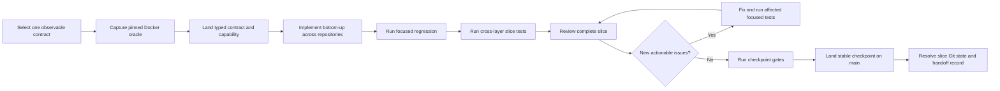

# Container-Family Parity Development Cycle

| Item | Value |
| --- | --- |
| Status | Active; one user-visible contract at a time, focused implementation feedback, immutable checkpoint proof, transactional Git hygiene, and silent Slack instruction polling are the adopted delivery workflow |
| Applies to | `container-engine-api`, `container-engine`, `container`, `containerization`, `container-compose`, `container-builder-shim`, `devcontainer`, and matched supporting repositories |
| Architecture | [Coherent Container-family parity architecture](coherent-container-family-parity-design.md) |
| Primary goal | Observable Docker parity with comparable or better performance |
| Design date | 31 July 2026 |

## Outcome

The parity programme is delivered as a sequence of substantial, reviewable vertical slices across the Container family. Each slice groups related functionality across the affected layers instead of treating individual fixes or administrative checkpoints as slices. A slice begins with a pinned Docker oracle and ends only when the same behaviour, identity, lifecycle, events, errors, cleanup, security boundaries, and liveness are proved through every affected client and runtime layer.

Work is local-first. Focused tests provide fast feedback while a change is being shaped; broader regression, fault, security, and migration gates run once at coherent checkpoints rather than after every edit. Each contract still records its performance workload and retains raw duration evidence, but comparative performance optimisation and the full performance gate run after functional parity is complete. Ordinary timing differences do not block functional delivery; a hang, timeout, or other bounded-liveness failure does and must be fixed before the contract can be accepted. Long-running validation executes from an immutable verification worktree so independent useful work can continue without invalidating the result.

Every completed slice receives a full final review. Findings are fixed, the affected focused tests are rerun, and the complete slice is reviewed again. The review loop ends only when a full pass finds no new actionable issue, all earlier findings and `@codex` queries have explicit resolutions, and the applicable slice gates pass.

This document describes how already-authorised implementation and publication work proceeds. It does not independently authorise a destructive operation, release, branch-protection change, or external submission. During development, generic Apple-ready work is retained as an Apple-shaped commit series with complete handoff documentation. No Apple issue, pull request, comment, branch, or push is created until every planned programme development wave and the integrated gates are complete; that later programme-wide publication step still requires explicit authorisation.

## Delivery Model

The dependency waves in the [coherent architecture](coherent-container-family-parity-design.md#dependency-graph-and-delivery-order) remain normative:

| Cycle | Work | Exit condition |
| --- | --- | --- |
| 0. References and evidence | Freeze exact Docker, Apple stack, guest, Model Runner, Socktainer, and accepted devcontainer references. Build reusable behavioural and performance oracles. | Reproducible reference results cover success, failure phase, inspection, events, cleanup, security, and timing. |
| 1. Shared gateway | Extract the neutral Engine protocol/router/socket package and add exclusive stock/enhanced provider selection. | Both lanes use one gateway without changing resource authority or silently falling back. |
| 2. Runtime authority | Add immutable identity, lifecycle state, event journal, generations, and workload transaction ledger. | One canonical state/event authority recovers safely across process failure. |
| 3. Linux sandbox | Productionise the common Engine Linux sandbox and isolated workload namespaces/cgroups/root filesystems/processes. | Multiple isolated workloads and protected services recover correctly in one sandbox. |
| 4. Resource planes | Develop networking, storage, and resource/security planes against the frozen sandbox and ledger contracts. | Integrated create/remove fault tests leave no partial state or leaked lease. |
| 5. Shared semantics | Add DeviceBroker, namespace donors, complete privilege, and Local Deploy resource projection. | Cross-resource conflicts and dependency lifecycle match Docker. |
| 6. Services | Add logging pipelines and host-native Model Runner supervision/routing. | Host/provider services keep distinct lifecycle; per-container logging and model-route leases remain workload-ledger children. |
| 7. Compose projection | Move Compose from CLI-shaped handoff to typed policies, capability preflight, and coherent reconciliation. | Compose exercises the same authority/controllers without manufacturing state. |
| 8. Devcontainer cutover | Migrate devcontainer to shared-gateway discovery and perform exclusive collision-aware state migration. | All clients see one resource identity/state/event stream and the old writer cannot restart. |
| 8b. Engine-socket enablement | Enable Compose `use_api_socket` only after the singular gateway/authority cutover and prove broad-authority relay, credentials, revocation and recovery. | Root/non-root Docker clients use the one authority; opt-out has zero artefacts and no duplicate writer can return. |
| 9. Integrated gates | Run complete fault, security, migration, rollback, compatibility, and performance matrices. | The matched published stack satisfies the integrated definition of done. |

Cycles 0 to 3 are dependency-ordered. After the shared contracts freeze, independent parts of cycles 4 to 6 may proceed concurrently. Parallel work must not create competing definitions of identity, capabilities, leases, events, providers, or runtime topology.

## Critical-Path Execution Contract

A goal is implemented as one coherent critical-path stream until its user-visible vertical contract is Verified or a concrete dependency prevents further useful local work. Work-package identifiers partition design and evidence; they do not require separate implementation pauses, full regression runs, documentation passes, branches, pull requests, or releases. In particular, an unfinished cross-stack contract must not be split into small administrative slices merely to produce green intermediate checkpoints.

Every selected contract records its behaviour, explicit non-goals, pinned Docker oracle, exact repositories and revisions, affected pins, focused proof, completion criteria, blocker criteria, and safe handoff point before implementation begins. Every other objective is Queued. The only permitted delivery states are `Queued`, `Active`, `Implemented`, `Verified`, `Blocked`, and `Handed off`; code, commits, tests, reports, or a local implementation alone do not make a contract Verified.

The following rules are mandatory:

1. Keep one Active implementation stream for the selected contract and keep every other objective Queued. A development slice is a substantial related vertical contract covering its lower-runtime behaviour, authority transaction, client projection, recovery, and focused tests; a small fix, test rerun, documentation update, status pass, Git administration, or hygiene action is supporting work rather than a separate slice unless it directly unblocks the contract.
2. During implementation, run only the narrow deterministic unit or component tests needed to shape the current code and prove the directly affected boundary. Batch related edits before running a component test.
3. Accumulate several related Implemented contracts before running repository-wide, matched-stack, security, and migration gates once against their immutable checkpoint head. Design each affected performance workload and retain duration evidence during functional work, but defer comparative optimisation and the full performance gate until the post-functional performance phase. Ordinary performance differences are not functional blockers; a hang, timeout, or other bounded-liveness failure is. Run a broad gate earlier only when a dependency boundary makes later implementation unsafe, and repeat it only when a subsequent maintained-source, generated-output, dependency, or runtime-fingerprint change invalidates that evidence.
4. Reconcile programme-wide status, capability tables, handoffs, exact heads, issue comments, and release records at the coherent checkpoint. Do not interrupt active implementation for repeated prose-only refreshes that cannot change a support claim.
5. Treat repository hygiene as part of each Git transaction. A necessary issue, branch, pull request, or linked worktree is created with its owner and terminal condition already known, and it is commented, closed or retained with evidence, and cleaned up in the same close-out transaction. Do not defer a pile of branch, pull-request, issue, or filesystem cleanup to a later maintenance cycle.
6. Prefer `main` for authorised Stephen-owned integration work where review policy permits it. Use a topic branch only for an active review or isolated upstream handoff; Apple-bound work uses an `upstream/` prefix and remains local until the programme-wide publication boundary.
7. Report progress against the Active contract and its remaining critical path. The primary metric is newly Verified contracts; implementation activity, test counts, commits, and reports are supporting evidence rather than completion metrics.
8. If two consecutive work periods produce no implementation or new blocker-evidence delta, or an unexplained failure survives two evidence-based correction attempts or two hours, stop that loop. Record a structured Blocked or Handed off result with exact evidence, then select an independent safe Queued contract or request direction instead of repeatedly rebuilding, restarting, testing, or reporting.
9. Use one Slack-check workflow that reads new user messages in `#codex` every five minutes and again before each slice START or END update. A slice START is a new top-level channel message whose timestamp is retained as the slice thread identifier; that slice's END is a reply in the exact START message thread. Execute every unhandled authorised instruction and reply with its concrete result in the originating instruction message thread by using that message's `thread_ts`; never report a Slack-originated request as a new channel message or in a different thread. The poll remains silent when there is no new instruction and must not repeat completed work.
10. Before runtime validation, prove that the source SHA, dependency revisions, built binaries, guest/init image, and test root share one exact fingerprint. Runtime tests use isolated, marker-protected disposable roots and retain enough evidence to reproduce a failure.

These rules do not weaken the exit criteria. They move expensive proof to the point where it can establish completion once, while preserving focused failure feedback during development.

## Vertical Slice Contract

A slice is one externally observable Docker contract, not one repository layer. Examples include `network_mode: service:db`, a `journald` delivery failure, a CDI device reservation, `stop` during `restarting`, or a non-root Engine-socket grant.

Before work begins, its record identifies:

- the user-visible behaviour and explicit non-goals;
- the pinned Docker/Compose oracle and expected error phase;
- every affected repository and current immutable head;
- prerequisite capabilities and provider/sandbox fingerprints;
- requested, effective, observed, and ignored state;
- identity, lifecycle, event, migration, security, and cleanup consequences;
- the smallest focused regression that proves the change;
- the broader slice, wave, and release gates it can invalidate; and
- the performance workloads and noise method that apply.

If the behaviour cannot be expressed and tested at this boundary, the slice is too broad or the underlying contract is not ready.

## Slice Workflow



### 1. Establish clean, current inputs

Before editing:

1. Fetch all remotes with pruning and no tag expansion unless a pinned tag is required.
2. Record branch, upstream divergence, worktrees, dirty state, exact stack pins, toolchain, host, guest, and Docker reference.
3. Preserve unrelated changes. Use a clean linked worktree or detached verification worktree rather than modifying another workstream.
4. Recheck relevant upstream issues, pull requests, discussions, and merged commits before designing around an assumed gap.
5. Select a clean, reviewed, immutable devcontainer extraction head before any shared Engine extraction. A dirty checkout is never source evidence.

### 2. Capture the reference oracle

Run the narrow behaviour against the pinned Docker reference before implementation. Retain the request/configuration, output, errors/warnings, create/start failure phase, inspection, event order, filesystem/network/process/device observations, restart/recovery behaviour, cleanup residue, and timing.

Docker Engine remains the normative behavioural oracle. Record the exact component versions embedded in the reference, including Docker Compose's compose-go version; a newer locally pinned parser is a candidate that needs differential evidence, not an implicit reference upgrade. Socktainer, compose-go source, Moby source, Apple issues, and existing project tests are supporting evidence, not substitutes for the observed contract.

### 3. Land contracts before behaviour

Add the typed request/effective-state model, capability identifier, protocol revision, provider contract, and conformance tests additively. Existing clients remain functional through adapters while a slice is incomplete.

No layer may advertise support because a value parses, renders, round-trips through inspection, or is ignored by the backend. Missing capability must fail before an unsafe side effect and at the Docker-matched phase.

### 4. Implement from the bottom up

The normal dependency path is:

```text
Containerization generic primitive
    -> Container controller, persistence, events, and recovery
    -> enhanced provider and Docker Engine route projection
    -> Container Compose policy and reconciliation
    -> devcontainer shared-gateway adoption
```

Each lower-layer change is independently tested and remains narrow enough to hand back or replace. Provider-specific policy does not leak into Containerization; Compose strings do not cross into runtime primitives; the Engine router does not manufacture resource state.

### 5. Use focused feedback while shaping the change

Run the smallest deterministic test that can fail for the current edit. A parser change runs its parser tests; a lifecycle transition runs that transition and journal recovery tests; a provider fix runs its protocol fixture; a documentation change runs Markdown/link checks.

When several related fixes affect the same component, keep them in the same substantial development slice, make the coherent batch, and run the component gate once. Do not define every fix as its own slice, and do not run the full stack regression after each small edit merely because it exists.

Maintained code aims for at least 90% line coverage overall and new or substantially changed code aims for at least 90% focused line coverage. Coverage is reported from an instrumented run and is never inferred from a green test count. An evidence-backed lower result remains visible with its reason and follow-up; low-value tests are not added merely to inflate the percentage.

Where Docker-based integration is applicable, retain a repository-owned `Dockerfile`, `compose.yaml`/`compose.yml`, or focused Bash harness that invokes the built CLI through the same user-visible path as the Docker reference. Unit-only proof is insufficient for a CLI/runtime contract that can be exercised through such a fixture.

### 6. Integrate across the actual boundary

After component tests are green, exercise the vertical slice through all affected layers. Compare native Container, Docker HTTP/CLI, Container Compose, and devcontainer as applicable. Confirm one stable ID, name, state, event stream, resource result, error phase, and cleanup outcome.

Integration runs use exact local dependency revisions. Stack pins move together only after the lower repositories and consumers pass their compatibility tests.

### 7. Complete the review-to-clean loop

Review the entire slice, including source, generated output, tests, migrations, security boundaries, documentation, performance impact, failure recovery, and removal of superseded paths. Do not review only the latest fixup.

Every finding is recorded and resolved as one of:

- fixed in maintained source with an appropriate focused regression;
- disproved with concrete evidence;
- proved genuinely unrelated or pre-existing, then recorded separately with concrete evidence, owner, and follow-up; or
- exposed as a dependency that blocks the slice until another slice lands.

A genuine issue in the original contract or acceptance criteria cannot be accepted, reclassified, or scoped away merely to close the slice. The original contract may change only through an explicit programme-owner decision based on new product evidence, and that decision cannot mark an unfixed parity issue complete. A blocking dependency leaves the slice safely handed off but incomplete.

After fixes, rerun the directly affected tests and then perform another complete review of the final diff. Structural or cross-contract fixes invalidate the previous review pass. The loop closes only after one full review discovers no new actionable issue and no prior finding remains unanswered.

Use an independent fresh-context reviewer for the final pass wherever practical. Do not continue accumulating changes over a focused test, build, or analysis failure that remains red or unexplained.

### 8. Run checkpoint gates

Run the broader gates justified by the final change. The final slice gate uses a clean immutable commit/worktree, not a moving development directory. Fault injection, security, and migration evidence is added when the changed contract can affect those properties. Record the applicable performance workload and duration now; run comparative optimisation evidence in the dedicated post-functional performance phase. A hang, timeout, or other bounded-liveness failure remains a functional failure and must be fixed before acceptance.

If a checkpoint gate causes any maintained-source, generated-output, migration, or contract change, rerun the affected focused tests and repeat the complete final review against the new exact head before accepting the gate.

### 9. Land, hand off, and clean up

Land a reviewed coherent checkpoint on `main`, update the matched stack manifest/pins last, and retain exact validation evidence. Merge completed slice-owned pull requests, close superseded ones, and record any deliberately blocked one with an owner/next-review date. Delete verified obsolete slice-owned remote branches, remove clean slice worktrees, prune metadata, and run the ordinary worktree audit. Report unrelated candidates without changing them. Reserve the repository-wide strict audit for a coordinated maintenance pass that has authority to resolve every candidate it reports.

Update `STATUS.md` only when the capability is genuinely available on the matched stack. Design completion, parsing, local unit tests, or an unmerged dependency are not support closure.

## Efficient Validation Ladder

| Tier | Purpose | Typical trigger | Container Compose examples |
| --- | --- | --- | --- |
| 0. Edit feedback | Prove the line or local behaviour being changed. | Every meaningful edit or related edit batch. | One Swift test/filter, one Go package test, one parity script, Markdown lint for touched documents, `git diff --check`. |
| 1. Component | Prove the changed package/controller and its immediate contracts. | Before sharing a local checkpoint or changing another layer. | `make check`, selected Swift suite, `make go-test`, provider fixtures, recovery tests. |
| 2. Vertical slice | Prove the behaviour through affected repositories and clients. | When the slice first works and after review fixes affecting the contract. | Selected Docker parity target, runtime integration test, cross-client state/event comparison. |
| 3. Repository | Detect unrelated regressions in each changed repository. | At the checkpoint after several related slices; earlier only when a dependency boundary makes continued implementation unsafe. | `make ci-fast` for an early dependency gate, `make ci` for the final repository checkpoint. |
| 4. Matched stack | Prove exact pins and cross-repository compatibility. | Checkpoint after several related slices; wave checkpoint. | Stack consistency, runtime tests, selected/full parity, fault and migration matrix. |
| 5. Release | Prove the publishable artefact and exact-head GitHub-recorded authorities. | Release candidate only. | Release gate, packaging/signing/notarisation, full parity/performance, SonarQube, CodeQL, install and rollback. |

### Test selection rules

- A small fix first reruns the test that previously failed or the narrowest new regression.
- Several related changes should be batched before one component or slice gate when the batch can be reviewed coherently.
- A shared DTO, persistence schema, transaction boundary, security boundary, dependency pin, build/test harness, or runtime topology change immediately invalidates reusable broad evidence. Run the complete affected regression once at the next coherent green batch before dependent integration or merge.
- Otherwise, full repository and stack regressions wait for the next coherent slice/wave checkpoint.
- A passing result may be reused only when commit, dependency heads, generated inputs, toolchain, runtime fingerprint, and relevant environment are unchanged.
- Build once and reuse the exact immutable artefact with `--skip-build` or the repository equivalent when later tiers do not require a different build configuration.
- Final evidence always names the exact commit tested. A result from a superseded commit is historical evidence, not proof of the final head.
- Test concurrency must not violate shared launchd/XPC/runtime locks or contaminate state. Correctness suites may run concurrently only when their roots and authorities are isolated.
- Performance runs require a quiet machine and never overlap compilation, sanitizers, scanners, indexing, backups, or another benchmark.

## Local-First Execution

All executable work runs directly on the local MBP unless a technical or
authoritative requirement makes that impossible. This includes builds, unit
and integration tests, Docker oracles, parity comparisons, documentation,
packaging dry runs, static analysis, Sonar scanning, CodeQL database/query work,
migration rehearsals, and every reproducible release-gate step.

The execution order is mandatory:

1. run the underlying command directly in an isolated local MBP worktree;
2. when a GitHub Actions execution/check record is required, dispatch the job
   to the trusted self-hosted GitHub worker on the MBP; and
3. use GitHub-hosted compute only when the action genuinely cannot run on the
   MBP or GitHub itself is the required authority, recording the exact reason.

GitHub remains necessary for branch protection, pull-request review state, server-side check conclusions, release and Pages publication, security-alert ingestion, and evidence whose authority is GitHub itself. When a GitHub workflow is required for trusted project work, its executable jobs should use a dedicated self-hosted MBP runner rather than wait for a GitHub-hosted machine wherever the action and security model support macOS/ARM64.

### MBP GitHub worker contract

The family needs a general trusted-CI runner lane in addition to the existing release labels. Before treating this workflow as implemented:

1. Provision dedicated self-hosted labels for trusted container-family CI and keep signing/release labels separate.
2. Route macOS/ARM64 build, test, parity, Sonar, supported CodeQL, packaging, and documentation jobs to the MBP lane. Use a pinned local Linux executor on the MBP when Linux semantics are required.
3. Never execute untrusted fork pull-request code on a persistent self-hosted runner. Use a GitHub-hosted or disposable isolated worker with no repository secrets for that exceptional lane.
4. Use a clean per-job workspace, exact checkout SHA, pinned actions/tools, bounded caches keyed by dependency fingerprint, and cleanup that removes only verified job-owned credentials and marker-protected job-owned runtime state.
5. Serialize jobs sharing launchd service names, runtime stores, VMs, signing identities, Docker oracles, or performance hardware. Run independent compile/static/documentation jobs concurrently when safe.
6. Record runner identity, host/toolchain fingerprint, job log, artefacts, and cleanup outcome with the tested commit.
7. Keep the runner current and health-checked; a missing/offline runner is diagnosed promptly rather than left as an unexplained queue.
8. If an action cannot run safely on the MBP, first reproduce its underlying command locally or in a local container. A GitHub-hosted exception must state the technical reason and remains the fallback, not the default.

Runner labels describe stable capabilities, not a particular MBP hostname, so an authorised handoff can move work without editing workflow source. Devcontainer and every other family runner must acquire the same Container runtime lock before touching the shared per-user services.

The shared runtime lock protects only cooperating jobs. Before authoritative runtime or parity validation, quiesce authorised cooperating local or self-hosted Container/devcontainer workers that can replace the same per-user launchd/XPC services, then restore them after the controlled run. Never stop an unrelated user session merely because it is visible.

The current repository routes only selected release work to its self-hosted MBP labels; ordinary CI and CodeQL still use hosted runners. General MBP CI routing and a supported local CodeQL target are therefore implementation prerequisites, not capabilities this design assumes already exist.

## Productive Work During Long Operations

Long gates should run against a committed snapshot in a clean verification worktree. Development continues in a separate worktree only on work that cannot alter the running gate's inputs.

| Waiting on | Productive work that may proceed |
| --- | --- |
| Compilation or unit suite | Review another repository in the same slice, prepare the next focused test, improve deterministic fixtures, or document the proven contract. |
| Runtime/parity suite | Inspect the immutable diff, prepare non-executing failure cases, analyse prior timings, review documentation, or inspect upstream evidence. Do not run any work that can touch Container/devcontainer services until independent service namespaces are proved. |
| SonarQube or CodeQL | Triage existing local findings, review changed-code hotspots, prepare fixes on a separate worktree, or inspect dependency/upstream changes. |
| GitHub workflow | Use the MBP runner log, prepare review/handoff material, or advance an independent local slice. Do not passively wait in a hosted queue when the job can be dispatched locally. |
| Release/package build | Verify documentation, checksums/signing expectations, install/rollback procedure, and final stack heads without modifying the candidate. |

Do not create artificial parallelism that makes results untrustworthy. Runtime authorities, performance tests, destructive migration drills, signing keychains, and shared service names are serial resources unless the workflow proves isolation.

Any operation capable of touching the Container/devcontainer runtime must acquire the same family lock. State-root separation alone is insufficient while stable per-user launchd/XPC service names remain shared.

## Git, Main Checkpoints, and MBP Handoff

`main` is the current integration branch for the Stephen-owned Container-family repositories. Stable reviewed progress should reach `main` frequently enough that a machine failure or handoff does not strand a large private delta.

Any branch that carries a change intended for an upstream fork must use the
`upstream/` prefix. Product integration, local parity, and release branches do
not use that prefix merely because their repository has an upstream remote.
Before a branch is retained or handed off, classify its destination from its
unique commits and rename a misclassified branch without rewriting those
commits. Record any deliberately retained upstream branch and its exact head in
the handoff.

`container-compose` treats `main` as releasable, and a successful main push can trigger Current packaging and Homebrew movement. A main checkpoint is therefore a completed, exact-head-reviewed slice boundary, not a time-based backup. Preserve incomplete progress on a short-lived topic branch/draft pull request containing signed commits instead.

Required durability/checkpoint points are:

- after a complete vertical slice passes review and its applicable gates;
- after an independently useful additive foundation is consumed successfully by its first client;
- before an instructed handoff to another MBP;
- before beginning a risky migration or broad refactor; and
- at the end of a long implementation session only when the state is complete, releasable, reviewable, and green.

At each point, complete/releasable work uses the reviewed `main` pull request; incomplete work uses the topic branch/draft pull request and a safe handoff. The checkpoint trigger never relaxes the main acceptance bar.

Complete, releasable human-authored work lands on `main` through its exact-head-reviewed pull request. Incomplete or knowingly broken work does not go to `main` merely to create a backup; preserve it on a remote topic branch/draft pull request containing signed commits with an exact handoff record, then close that branch promptly after the coherent slice lands. Merging the reviewed pull request is the periodic main checkpoint; direct unreviewed pushes are not a shortcut. The sole existing exception is the deterministic `container` package-pin commit generated and published by release automation under [BUILD.md](../BUILD.md)'s exact ancestry/file allowlist, local checks, remote-head verification, and assembled-stack gate. The helper signs newly generated candidates; a retained pre-existing candidate also requires trusted signature/provenance verification. The exception is not available to ordinary slices, hand-written changes, or handoffs.

For a multi-repository slice:

1. Keep lower-layer changes additive and backward compatible while consumers migrate.
2. Validate each local candidate SHA, then publish and merge the generic lower-layer pull request first after its existing consumers remain green.
3. Pin authority/provider and client pull requests only to reachable immutable lower-layer heads, validate those consumer candidates locally, and merge them in dependency order.
4. Update `Package.swift`, `Package.resolved`, and the common stack manifest together in the final integration pull request.
5. Run exact-head GitHub-recorded gates after each merge. Fix forward or revert promptly if a published head fails; never leave `main` pointing at an unavailable or known-broken revision.

An MBP handoff records every repository path, branch, upstream, exact SHA, dirty/untracked state, selected provider/runtime fingerprints, completed and pending tests, active build/run identifiers, known findings, next safe command, rollback point, and whether any local-only artefact is still required. A clean exact-head handoff is preferred; unresolved dirty state is called out explicitly and never overwritten on the destination machine.

## Pull Requests and Review Hygiene

Use a short-lived pull request for every human-authored change, as required by the repository contribution policy. Keep it draft only while work is actively changing; runtime, security, migration, release, and cross-repository changes receive explicit maintainer review before merge. The tightly allowlisted release-generated package-pin exception above has no pull request and cannot carry feature/source changes; every pull request that does exist follows the requirements below.

Every pull request must:

1. Use a focused Conventional Commit title and signed, reviewable commits.
2. State the Docker contract, oracle, affected repositories/pins, risks, tests, performance evidence, and migration/rollback impact.
3. Request a literal `@codex review` against the current exact SHA.
4. Respond to every `@codex` question or finding with a fix plus evidence, a concrete explanation, or an explicit recorded decision.
5. Rerun the affected tests after fixes and request a new exact-SHA `@codex review` whenever the reviewed diff changes.
6. Immediately before merge, fetch all review threads/comments again, confirm the reviewed SHA is still the pull-request head, and resolve every query.
7. Repeat until the final complete-diff review produces no new actionable query and all conversations are resolved.
8. Merge or deliberately close/supersede the pull request as soon as it reaches a terminal state.

After merge or closure, preserve any unique patch in the accepted commit or a named handoff, delete obsolete slice-owned remote branches, remove clean slice-owned worktrees/local branches, prune worktree metadata, and run `make worktree-audit` or the sibling repository equivalent. Report unrelated audit candidates without modifying them. Run `make worktree-audit-strict` only during a coordinated repository-wide maintenance pass after every reported candidate has been accounted for. A deliberately retained blocked pull request needs an owner, blocker, next action, and next-review date; otherwise close or supersede it after preserving its work.

At every wave and release checkpoint, inventory open pull requests, remote branches, local branches, and worktrees across the family. Account for each retained item as active, deliberately blocked, immutable upstream archive, or named handoff; close/remove every obsolete item. After that coordinated scope has authority to resolve all reported candidates, the strict audit in each repository must pass.

Do not delete a branch merely because its remote disappeared. Account for unique commits first, and retain deliberately immutable `upstream-pr-*` archive branches managed by the upstream handoff process.

## SonarQube, CodeQL, and Static Quality

Static quality is part of slice acceptance, not end-of-programme cleanup.

### SonarQube

- Run local compiler/linter/static checks continuously at the focused level.
- After a substantial code batch, refresh coverage and run the local scanner with `make sonar` or use `make coverage` followed by `make sonar-scan` when the reports can be reused.
- Use an explicit unique `SONAR_BRANCH` for a non-main local scan so a detached verification worktree cannot be misattributed. Treat the resulting compute task and warnings as fast feedback, not the final branch quality gate.
- On the exact canonical `main` head, `SONAR_BRANCH=main SONAR_QUALITYGATE_WAIT=true make sonar-scan` selects the canonical analysed branch and waits for its gate after reusable coverage exists. Retain the task/result URL with the exact SHA.
- Wait for the quality gate at main/release checkpoints when credentials permit. Do not run a full coverage/Sonar cycle after every small fix if the affected focused test is sufficient.
- Check new-code findings, security hotspots, duplication, coverage, reliability, and maintainability periodically during an active slice and again before it lands on `main`.
- Treat a local short-branch scan as fast feedback. The exact-head SonarCloud analysis/quality gate remains the publication authority where the repository requires it.
- A network or service outage is recorded as missing external evidence, not converted into a passing result.

### CodeQL

- `container-compose` currently applies CodeQL to the Go normalizer; it does not claim Swift CodeQL coverage. Until a supported local target exists, record local CodeQL as unavailable rather than claiming a scan.
- Add a reproducible family-level local target, such as `make codeql-local`, that pins the CodeQL CLI/query-pack versions, creates the database from the same build command, runs the family quality contract, and retains SARIF. The contract must fail on every new applicable alert in maintained source and retain an explicitly reviewed baseline/disposition for pre-existing alerts. Once available, run it before relying on the GitHub result.
- When the GitHub CodeQL workflow is enabled and required, route its supported trusted job to the self-hosted MBP runner and upload the exact-commit result to GitHub.
- Inspect and resolve new alerts periodically during the slice and before main/release checkpoints. A suppressed alert needs a narrow documented justification.
- As of this design, the repository CodeQL workflow is manually disabled. Its absence is not a pass, this workflow does not silently re-enable it, and release evidence that requires an exact GitHub CodeQL authority remains blocked until the owner enables it or explicitly approves another authority.

## Upstream Surveillance and Apple Handoffs

Review relevant upstream issues, pull requests, releases, commits, and discussions at slice start, weekly during a long-running active wave, before selecting or changing a pin/fork primitive, and before a wave or release checkpoint. Monitor Apple Container/Containerization/builder projects, Docker Compose/Moby/Model Runner, compose-go, Socktainer, and any provider protocol used by the slice.

Use the existing read-only/local-check controls where applicable:

```sh
make upstream-divergence-report
make upstream-divergence-check
make upstream-divergence-release-check
make fork-classifications-check
make upstream-handoff-registry-check
python3 Tools/upstream/verify-pr-archive.py
```

After changing a local handoff or its registry row, regenerate and verify the reader view:

```sh
make upstream-handoff-registry-update
make upstream-handoff-registry-check
```

The divergence tools inspect Git refs, commit classifications, and mergeability; they do not search upstream issues, pull requests, or discussions. A separate read-only upstream-watch ledger/tool is required so each monitored query, exact result, relevance decision, and last-checked time is durable rather than dependent on memory.

Each relevant upstream change is classified and acted on by:

- adopting a merged fix and removing the replaced fork delta after parity proof;
- rebasing the local design or oracle around a changed upstream contract;
- adding or updating a regression for a confirmed upstream defect;
- retaining a narrow fork primitive with current justification;
- updating the provider/capability or migration plan; or
- recording why no action is required.

During every development wave, do not open an issue, pull request, discussion, comment, or push to an Apple upstream remote. Configure Apple upstream push URLs as disabled where practical. Monitoring is read-only. This freeze is lifted only by the programme-wide upstream publication gate after all development and integrated validation are complete, never by completing one feature or wave.

Any change that could be handed to Apple is kept Apple-shaped:

- one generic runtime problem and primitive per commit series;
- no Compose types, Docker-specific policy, Stephen-only package pins, or unrelated fork cleanup in the primitive;
- Apple naming, API, formatting, documentation, licence-header, concurrency, error, and test conventions;
- focused tests that pass in the appropriate Apple-shaped repository boundary;
- signed commits that can be reviewed or replayed independently of the Container-family integration; and
- a handoff document under `docs/upstream/` describing the problem, upstream evidence, design, exact patch/commit sequence, tests, performance, compatibility, risks, and replay instructions.

Update the generated upstream handoff registry whenever a handoff is added or changed. The handoff remains local or in Stephen's forks throughout development. A later Apple submission is considered only in the final programme-wide publication step, after all planned development and integrated gates are complete and explicit authorisation is given.

## Parity and Performance Discipline

The primary product gate is both observable Docker parity and comparable or better performance. Neither compensates for the other, but the delivery order is functional compatibility first and comparative optimisation second.

### Behaviour

- Compare against pinned Docker Compose/Engine with the same fixture, image state, inputs, and failure conditions.
- Preserve exact requested/effective/observed state, errors, warnings, events, lifecycle residue, and cleanup.
- Do not weaken a semantic probe, add a retry that hides a race, or parallelise reference/candidate work differently merely to improve timing.

### Performance

- Design the paired same-host workload, metrics, and noise method before changing an affected hot path; capture the release-grade baseline during the post-functional performance phase unless the active work itself needs a liveness diagnosis.
- Use non-debug release builds, raw monotonic timings, exact heads, host/toolchain/runtime fingerprints, controlled warm/cold state, declared repetitions, median/P95, and a documented noise band.
- Compare Docker, the previous accepted `main`, and the candidate where an existing Container-family implementation is available; retain elapsed time plus material CPU, memory, and I/O observations.
- During functional development, retain the ordinary focused-run duration and run a targeted benchmark only when it helps diagnose a liveness issue. Run the complete affected slice matrix after functional contracts close and the full maintained matrix at wave/release closure.
- Run reference and candidate under equivalent load and without concurrent builds, scans, indexing, backups, or unrelated VMs.
- Declare the direction and equivalence rule for every metric before sampling: lower is better for latency, CPU, RSS, bytes/copies and other costs; higher is better for throughput; correctness, durability, isolation and output quality cannot decline. Never average opposing metrics into a score that hides a material regression.
- Profile and fix material regressions in the post-functional performance phase. A completed functional contract remains `Verified` while its comparative performance result is outstanding; only a hang, timeout, deadlock, liveness/resource leak, or comparable failure that prevents the functional proof keeps that contract open.
- Optimisation must preserve correctness, isolation, durability, and diagnostic evidence. A faster approximation is not parity.

The current `make docker-compose-performance-matrix` is a diagnostic guard, not release evidence: it builds the debug product, permits a default 10x median ratio, and covers only warm-image 1/10/50-service startup/teardown. It must be replaced or extended to use matched release binaries, paired/counterbalanced sampling, the comparable-or-better noise-band gate, and the missing logs, `develop.watch` sync, and build-context lanes before it can close a performance slice.

## Slice Evidence Record

Each slice keeps a compact durable record that another MBP or maintainer can resume without reconstructing context:

| Field | Required content |
| --- | --- |
| Contract | User-visible behaviour, non-goals, Docker oracle, expected phase/state/events. |
| Inputs | Exact repository heads, pins, provider/sandbox fingerprints, toolchain and host. |
| Implementation | Changed repositories/commits, capability revisions, migrations and feature gates. |
| Design progress | Every affected design requirement/work-package ID, previous/new state (`Queued`, `Active`, `Implemented`, `Verified`, `Blocked`, or `Handed off`), exact evidence, and any still-open acceptance row. |
| Documentation | Complete documentation inventory reviewed; every changed page/help/schema/example/status/release/handoff item, or an explicit evidence-backed `unchanged`/`not applicable` disposition. |
| Validation | Focused, component, cross-client, fault, security, migration and full gates with exact result locations. |
| Review | Review passes, findings/resolutions, `@codex` queries/responses, unrelated findings/blockers and final clean pass. |
| Quality | Coverage, SonarQube and supported CodeQL result or explicit missing-authority blocker. |
| Performance | Reference/candidate raw evidence, repetitions, median/P95, noise method and verdict. |
| Upstream | Issues/PRs/discussions reviewed, divergence result, adopted changes and Apple handoff location. |
| Delivery | Main/PR heads, stack pin commit, rollback point, branch/worktree cleanup and handoff status. |

## Documentation and Design-Progress Control

The design set is a living delivery contract. Every slice reviews the complete
documentation inventory and updates all affected material in the same reviewed
change as the behaviour. At minimum this inventory covers focused and coherent
designs, `STATUS.md`, README/build/install/contribution guidance, API and schema
documentation, generated references, CLI help, examples, compatibility and
capability manifests, test/performance instructions, migration/rollback notes,
upstream handoffs, and release notes. An item that remains unchanged is recorded
as reviewed with a reason; silence is not evidence that it is current.

Each focused design keeps stable requirement/work-package identifiers and its
own exact implementation, test, review, quality, migration, and performance
evidence. [STATUS.md](../STATUS.md) is the single current programme projection
and lists only remaining compatibility or performance gaps. A row closes only
when its design acceptance and pinned executable evidence are complete; local
code or a design checkbox alone never upgrades support.

If implementation evidence changes a design decision, update the focused
design, coherent architecture, dependency/order map, `STATUS.md`, tests,
and user-facing documentation together after an explicit review decision. Do
not preserve a known-stale design as historical truth inside the active spec;
move genuinely superseded material to a clearly marked decision/history record.
Markdown, link, generated-reference, example, and CLI-help checks are part of
the affected slice gate.

Exact accepted heads remain in the affected design or upstream handoff record,
where they can describe the actual repository set and evidence boundary without
self-reference. Update every affected documentation surface and `STATUS.md` in
the implementation slice. `make check` continues to validate active source,
documentation, stack consistency, and the handoff registry; it does not accept
a stale generated status projection as programme truth.

## Development-Cycle Definition of Done

A slice is complete only when:

- its pinned Docker oracle and focused regression exist;
- typed contracts and capabilities fail safely when unavailable;
- affected lower layers, authority, Engine route, Compose, and devcontainer projections agree;
- one immutable identity, lifecycle state, event stream, resource result, and cleanup outcome are observed across clients;
- failure injection converges without duplicate state, leaked leases, corruption, secret exposure, or false success;
- applicable security, migration, rollback, and compatibility tests pass;
- a complete final-diff review finds no new actionable issue after every earlier issue was resolved;
- every `@codex` PR query has an explicit response and every reviewed-diff change received a new exact-SHA review;
- local static analysis, SonarQube, supported CodeQL, and every required exact-head external authority is green;
- maintained code aims for at least 90% overall line coverage, new or substantially changed code has focused coverage evidence aimed at 90%, and every evidence-backed exception is explicit;
- applicable Docker integration uses a retained Dockerfile, Compose file, or Bash harness that exercises the built CLI through the user-visible contract;
- every affected executable lane has paired release-build median/P95 comparable to or better than Docker outside the declared noise band; a demonstrably non-executable slice records `not applicable` with rationale and cannot close a performance gap;
- exact stack pins, documentation, compatibility manifests, and `STATUS.md` agree with the delivered behaviour;
- every documentation surface has a recorded review disposition, `STATUS.md` agrees with the remaining gaps, and affected design or handoff records point to exact final-head evidence;
- the stable exact-head-reviewed checkpoint is on `main`; and
- no obsolete slice-owned pull request, remote branch, local branch, worktree, runtime state, or unregistered/machine-local completed handoff is left dangling.

## Safe Incomplete Handoff

Work that cannot meet the definition of done because publication is not authorised, a dependency is missing, or an external authority is unavailable is Blocked or Handed off, never Verified. Preserve it safely with exact commits on a short-lived topic branch or, where already authorised, a draft pull request; record the original acceptance criteria, current blocker/owner, completed and missing evidence, active run identifiers, rollback point, next command, and next-review date. This is valid handoff evidence but never a parity/support completion claim.

## Initial Workflow Enablers

Before large-scale implementation begins, add and prove these workflow capabilities:

1. <a id="workflow-enabler-01"></a>`WORKFLOW-ENABLER-01` — A trusted general container-family self-hosted MBP runner lane, separate from release/signing labels.
2. <a id="workflow-enabler-02"></a>`WORKFLOW-ENABLER-02` — Local and MBP-runner equivalents for each required GitHub workflow step, with documented hosted-only exceptions.
3. <a id="workflow-enabler-03"></a>`WORKFLOW-ENABLER-03` — **Complete — reproducible local CodeQL and exact SARIF upload.** The sole supported sourced Bash/Zsh boundary disables every inherited command function before caller-shadowable lookup, unexports the inherited environment with explicit builtins, and starts isolated absolute Python without exposing credentials in arguments. The Python launcher removes inherited Make makefiles/flags/eval text, Python startup configuration, shell hooks, and executable wrappers, then execs an explicit absolute repository Makefile. The inner recipes and script shebang use isolated `/usr/bin/python3`, defer unrelated discovery to absolute system Git, preserve configurable CodeQL inputs as literal values, and export them without shell interpolation. Evidence Git commands ignore global/system configuration and replacement objects, override executable local settings such as `core.fsmonitor`, hooks, credential helpers, and external protocols, and perform canonical remote inspection outside checkout-local configuration. Cleanliness verification bypasses Git status/diff conversion machinery and compares the exact HEAD tree, index, and raw worktree values directly, preventing local filter commands and `.git/info/attributes` from executing. The launcher's `codeql-local` goal checksum-pins CodeQL `2.26.2`, `codeql/go-queries@1.6.7`, official Go `1.26.3`, and official GitHub CLI `2.96.0` archives for every supported host. Persistent cache state contains only downloaded archives; each operation copies and authenticates the selected archive inside a randomized private directory, retains the private CodeQL and Go executables through analysis, and deletes them afterwards. It builds the hosted `linux/amd64` target in an isolated detached clone of the exact commit through recorded absolute Git, archive, download, GNU Make, and Go tools, using a fixed system `PATH`, an allowlisted environment, no toolchain fallback, and fresh temporary module/build caches with read-only checksum-database-verified proxy resolution and no VCS fallback. It revalidates that snapshot after database creation, retains commit-keyed SARIF and its database/manifest, and fails unreviewed or stale result dispositions. Separate dry-run and upload goals require a clean exact checkout plus matching canonical origin, remote ref, full commit, and retained evidence before using the existing secret-backed GitHub credential. Retained ignored files are inspectable evidence, not upload authentication: real upload regenerates the analysis with the verified bundle, carries its expected digests in memory, privately re-extracts CodeQL and the pinned GitHub CLI, revalidates the evidence, sends a private hash-checked SARIF snapshot, and keeps both clients private through receipt confirmation. Post-upload polling follows only GitHub's unique validated SARIF receipt and its matching `sarif_id` analysis URL, then requires one exact analysis with matching version/rule/result/category metadata and no warning or error; a concurrent same-commit upload cannot satisfy it. The hosted workflow remains owner-disabled and is neither enabled nor represented as passed. The implementation, first zero-result end-to-end upload, and evidence are recorded in `docs/upstream/container-compose/ISSUE-181.md` and `PR-181.md`.
   The exact analysis clone owns and strictly verifies its Git objects before and after analysis; it uses neither local hardlinks nor mutable alternates from the contributor checkout. Caller temporary-root variables are discarded; analysis work, verified tools, credential tools, and upload snapshots use a fixed root-owned sticky/non-writable system temporary parent, while the retained projection remains explicitly untrusted and is immediately re-authenticated. Unauthenticated archive/build operations may retain allowlisted network infrastructure, but before token selection the canonical remote-ref lookup and credential path both remove inherited proxy and custom certificate-root variables and use direct system trust through mutation and receipt confirmation. Upload evidence records the remote-identity and credential environment policies separately.
   Because inherited shell tracing and traps can run before a sourced function body begins, the supported caller is trap-free, has Bash xtrace/functrace/errtrace disabled, and contains neither `GITHUB_TOKEN` nor `GH_TOKEN`. The entry clears inherited Bash `DEBUG`/`RETURN`/`ERR` handlers, disables their inheritance modes, captures and atomically disables Zsh `TRAP*` functions, and rejects the recorded unsafe state before starting Python. The privately extracted pinned GitHub CLI reads the authenticated keyring only after traps, tracing, functions, and the inherited environment have been removed, then supplies one credential to upload and receipt confirmation.
4. <a id="workflow-enabler-04"></a>`WORKFLOW-ENABLER-04` — Local wrapper targets for SwiftLint, SwiftFormat, `actionlint`, Address Sanitizer, and Thread Sanitizer so the Quality workflow can be reproduced without a hosted runner; `make check` alone does not currently run those checks.
5. <a id="workflow-enabler-05"></a>`WORKFLOW-ENABLER-05` — A release-build performance harness with paired sampling, comparable-or-better median/P95 gates, and startup, teardown, logs, watch-sync, and build-context lanes; retain the current 10x/debug matrix as diagnostic only until then.
6. <a id="workflow-enabler-06"></a>`WORKFLOW-ENABLER-06` — A shared slice ledger and exact-head evidence layout covering every repository in the matched stack, including a read-only issue/pull-request/discussion watch record.
7. <a id="workflow-enabler-07"></a>`WORKFLOW-ENABLER-07` — A test-impact map from contract/controller/file areas to focused, component, slice, stack, and release targets.
8. <a id="workflow-enabler-08"></a>`WORKFLOW-ENABLER-08` — Immutable verification worktrees and artefact naming keyed by commit and dependency fingerprint.
9. <a id="workflow-enabler-09"></a>`WORKFLOW-ENABLER-09` — A family-wide runner/runtime concurrency policy that protects shared launchd/XPC services, state roots, VMs, Docker references, and performance hardware.
10. <a id="workflow-enabler-10"></a>`WORKFLOW-ENABLER-10` — A one-time branch, pull-request, worktree, and dirty-state baseline review that preserves unique/user work but closes or removes verified obsolete state before implementation creates more parallel lanes.
11. <a id="workflow-enabler-11"></a>`WORKFLOW-ENABLER-11` — Fail-closed release-helper verification of the trusted signature and exact generator provenance for any pre-existing `container` package-pin recovery candidate, with tests that reject unsigned or lookalike commits before publication.
12. <a id="workflow-enabler-12"></a>`WORKFLOW-ENABLER-12` — **Complete — upstream-handoff registry baseline.** The performance-matrix issue and pull-request records are classified through the documented archive lifecycle, the reader view is regenerated, and `make upstream-handoff-registry-check` and the exact-stack `make check` pass. The implementation and evidence are recorded in `docs/upstream/container-compose/ISSUE-180.md` and `PR-180.md`; this baseline no longer blocks repository-wide programme evidence.
13. <a id="workflow-enabler-13"></a>`WORKFLOW-ENABLER-13` — **Complete — exact-head-reviewed Compose promotion.** The release helper proves the open pull request still names the locally gated full commit, requires every existing Codex thread to have a later Stephen response and be resolved, posts a literal `@codex review`, and accepts only the connector's thumbs-up on that exact request or its explicit no-major-issues comment naming the expected commit prefix. A query after the request, head drift, malformed or truncated evidence, or timeout fails closed and requires a fresh invocation; any diff therefore receives a new request. Pull-request checks run only after the clean decision. The helper immediately revalidates the exact head, all query threads, and the clean signal before a head-matched normal merge and again before the optional checked-admin merge. Auto-merge is never enabled. Deterministic stale-head, unanswered-query, timeout, clean-comment merge, pagination, and stale-review tests are recorded in `docs/upstream/container-compose/ISSUE-182.md` and `PR-182.md`.
14. <a id="workflow-enabler-14"></a>`WORKFLOW-ENABLER-14` — **Complete — PR-only Compose source promotion.** `CONTAINER_STACK_RELEASE_COMPOSE_MAIN_PROMOTION_MODE=pr` is the sole accepted mode. The retired `direct` value fails before any GitHub or Git mutation, and the direct push branch has been removed. Maintenance, milestone, and security classifications do not bypass exact-head review or pull-request checks. The focused direct-mode and clean-merge regressions prove only the reviewed PR path can promote Compose source; implementation and evidence are recorded with Enabler 13 in `docs/upstream/container-compose/ISSUE-182.md` and `PR-182.md`.
15. <a id="workflow-enabler-15"></a>`WORKFLOW-ENABLER-15` — **Superseded — gap-only programme status.** Stable requirement/work-package IDs remain in focused designs, while `STATUS.md` is the single current gap-only projection. The duplicate generated register was retired after it drifted far behind implemented work and produced misleading programme counts.

The release helper now enforces Enablers 13 and 14 before any programme source
promotion. Its checked-admin option handles only GitHub's solo-maintainer review
requirement after the same exact-head Codex authority and PR checks have passed;
it is not a bypass.

For non-interactive Container Compose verification, use `HAWKEYE_AUTO_INSTALL=1 make ci`. Because the repository Markdown target discovers tracked files, lint a newly created untracked document explicitly until it is staged or committed.

These enablers are themselves small reviewed slices. They must not delay oracle capture or contract design that can proceed independently.

## Primary References

- [Coherent Container-family parity architecture](coherent-container-family-parity-design.md)
- [Remaining macOS parity closure design](remaining-macos-parity-closure-design.md)
- [Container Compose contributor workflow](../CONTRIBUTING.md)
- [Build, validation, and release workflow](../BUILD.md)
- [Runtime capability negotiation](runtime-capabilities.md)
- [Current parity ledger](../STATUS.md)
- [Apple upstream handoff records](upstream/README.md)
