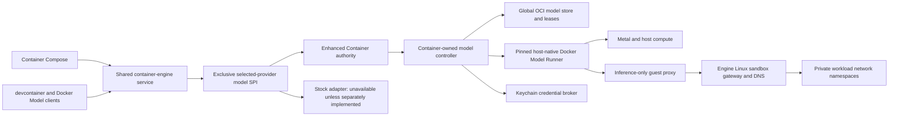

# Model-Runner Services Design

| Item | Value |
| --- | --- |
| Status | Design complete; implementation not started |
| Scope | `container-compose`, the matched `container` and `containerization` forks, `devcontainer`, the shared Engine API, and an upstream Docker Model Runner integration |
| Compatibility target | Docker Compose 5.3.1, Docker Model Runner 1.2.1, and Docker Engine 29.2.1 API 1.53 on macOS |
| Matched Container revision | `88460ab2ab0ca2f3fa9f91b2911b3b77647596c1` |
| Matched Containerization revision | `d7377b962af724f8d7c2b640f3ab12184d33f1af` |
| Reference Model Runner revision | `b4ba47bb1ae49e13681888fda732ee0cf4144c3c` |
| Design date | 31 July 2026 |

## Goal

Close the model-runner services row in [STATUS.md](../STATUS.md) by supporting Compose `models` through one host-native, per-user model service owned by the enhanced Container authority and reached by Container Compose, Docker-compatible Engine clients, and devcontainer through the selected-provider gateway. Completion means that the stack:

- accepts and preserves the complete Compose model schema;
- performs Docker Compose's list, conditional pull, configure, status, and environment-injection sequence at the same command boundaries;
- runs the pinned upstream Docker Model Runner rather than creating a second inference implementation;
- uses host Metal acceleration and a global OCI model store without placing a runner in every workload sandbox;
- exposes a stable, container-reachable inference endpoint while keeping management, credentials, and host paths outside workloads;
- maintains deterministic durable state/recovery while reproducing the pinned command's nondeterministic concurrent progress/error interleavings; and
- exposes one model service through the shared Engine authority instead of creating a devcontainer-owned socket or model database.

Compose remains the project orchestrator. It does not own model content, inference processes, registry credentials, or a private model lifetime.

## Scope

### In scope

- Top-level short and long model syntax, service list and mapping bindings, `name`, `model`, `context_size`, ordered `runtime_flags`, `endpoint_var`, and `model_var`.
- Exact Docker Compose 5.3.1 selection, call ordering, progress, error, cancellation, and environment-injection behaviour.
- A pinned and audited Docker Model Runner distribution with host-native Metal support.
- Global OCI content, configuration, leases, concurrent pull deduplication, recovery, and explicit administration.
- A stable guest-facing inference endpoint and Docker-compatible hostname/routing.
- Docker Model CLI/plugin or equivalent Engine extension compatibility behind the shared per-user Engine service.
- Stock-Apple and enhanced Container-family runtime-provider integration without two competing listeners.
- Security, observability, migration, performance, and oracle evidence required to remove the parity exception.

### Explicitly out of scope

- Implementing a new LLM inference engine or model format in Compose.
- Making model state project-local or deleting model content during `compose down`.
- Treating a model binding as an authorisation rule when the Docker-compatible endpoint is intentionally shared.
- Scheduling a model onto a service container GPU through `deploy.resources`; Model Runner owns host compute policy.
- Blocking container creation until first inference is warm when the pinned runner only acknowledges configuration asynchronously.
- Swarm model distribution, remote multi-host scheduling, cloud inference brokerage, or prompt evaluation.
- Passing registry credentials, model-management routes, or arbitrary host filesystem access into a workload sandbox.

## Normative Terms

`MUST`, `MUST NOT`, `SHOULD`, and `MAY` describe implementation requirements. The Docker oracle is Docker Compose 5.3.1 plus Docker Model Runner 1.2.1 at the revisions above. Model identity below distinguishes the Compose key, optional display name, OCI reference, and immutable content digest; these values MUST NOT be conflated.

## Current Evidence and Blockers

| Layer | Current boundary | Consequence |
| --- | --- | --- |
| Normalisation | [`NormalizedProject.swift`](../Sources/ComposeCore/NormalizedProject.swift) retains top-level models as untyped values. | Validation, hashing, selection, and environment derivation cannot use one complete contract. |
| Service binding | Only `endpoint_var` and `model_var` survive as partially typed binding data. | The top-level artifact and runtime configuration are not connected to service intent. |
| Runtime validation | [`ComposeOrchestratorValidation.swift`](../Sources/ComposeCore/ComposeOrchestratorValidation.swift) rejects services with models. | No native execution path exists. |
| Parser | The compose-go normaliser already preserves `model`, `name`, `context_size`, ordered `runtime_flags`, and list/mapping binding syntax. | The input layer is ahead of the runtime; replacing it would add risk without closing parity. |
| Runtime service | There is no shared model manager, OCI model store, Metal-backed runner, or guest endpoint. | Compose cannot implement models by translation alone. |
| Engine boundary | There is no common Docker Model route/CLI integration shared with devcontainer. | A local devcontainer implementation would create another socket, model store, and authority. |
| Test host | The ordinary Docker CLI on the evidence host has no `docker model` plugin. | Final behavioural evidence needs an explicit Docker Desktop/Model Runner oracle lane; absence on this host is not a specification. |

## Docker Compose Reference Contract

### Command boundaries

Docker Compose 5.3.1 calls model preparation in two places:

- `create`: after service images are available and before networks, volumes, and container reconciliation; and
- `run`: after dependency and image preparation and before the one-off container is created.

It does not prepare models for `start`, `restart`, `stop`, `down`, `pull`, or `config`. The implementation MUST retain these boundaries. A failed create can therefore leave pulled service images, and a failed run can leave prepared or started dependencies. Rollback MUST NOT delete globally cached model content.

### Ensure sequence and concurrency

Compose first discovers the Docker Model CLI/plugin and version, then attempts
to list local model tags as JSON once. Compose 5.3.1 does not propagate a list
command/JSON error: it continues with an empty snapshot, so every selected model
attempts pull then configure and any later task error becomes the command result.
The implementation reproduces that observable behaviour deliberately without
reproducing Compose's shared-variable data race. It next creates one cancellation-linked task
group containing:

- one `model status --json` task that parses the container endpoint and writes
  every selected service's model/endpoint variables; and
- one concurrent task per selected top-level model. Each compares its OCI
  reference with the list snapshot, pulls only when absent, then configures that
  model every time. Context size is passed only when greater than zero; runtime
  flag order is retained and flags follow `--` only for plugin versions at least
  1.0.6.

Model-map iteration, task scheduling, progress, configuration completion, and
which concurrent error becomes visible first are not deterministic. The first
returned error cancels the shared task-group context, but sibling pulls,
accepted configurations, status, or progress may already have observable side
effects. The implementation preserves those Docker-oracled races and never
serialises models merely to make output stable.

The native runtime API MAY avoid spawning the CLI, but its observable calls,
concurrency, progress, errors, cancellation, and side effects MUST match.
Baseline selected-provider/model protocol negotiation completes before a pull
or configuration side effect; it does not move the feature failure earlier than
the command boundary described above.

### Selection

Only models bound by services selected for the command are ensured. Profile and service selection follows the already normalised Compose project. The controller deduplicates selected top-level keys within a command but does not promise project-order task starts or progress.

A binding to an undefined model is rejected by normalisation/validation before runtime calls. An unused top-level model has no runtime side effect.

### Variable derivation

For model key `key`:

- uppercase the key;
- replace hyphens, and only hyphens, with underscores;
- default the model variable to `<KEY>_MODEL`;
- default the endpoint variable to `<KEY>_URL`;
- use explicit `model_var` or `endpoint_var` instead when present;
- set the model value to the configured OCI reference, not the key or display name; and
- set the endpoint value to the opaque endpoint returned by runner status.

Model injection overwrites an existing environment entry without a warning, matching the reference. Tests MUST cover punctuation other than hyphen rather than applying a broader sanitiser. Empty, invalid, or colliding names follow the pinned parser/oracle response.

The top-level `name` is display/progress metadata. It does not replace the OCI reference used for pull, configuration, content identity, or injection.

### Persistence and readiness

Model content and runner configuration are global to the selected enhanced provider/state root, not to a Compose project and not across provider fingerprints. `compose down` does not unload, unconfigure, or delete a model. A later project using that authority may reuse the same digest.

The runner configure API acknowledges accepted work asynchronously. A successful `202 Accepted` means configuration was accepted, not that preload or first inference is warm. Compose requires the concurrent `model status --json` call to succeed and yield parseable endpoint metadata; it does not probe that inference endpoint or wait for it to serve. The command also waits for every pull/configure task at the oracle-confirmed boundary. It MUST NOT claim endpoint, model, preload, or first-inference readiness from those results.

## Canonical Data Model

```swift
public struct ComposeModelDefinition: Codable, Sendable {
    public var key: String
    public var displayName: String?
    public var artifactReference: String
    public var contextSize: Int?
    public var runtimeFlags: [String]
    public var extensions: [String: ComposeValue]
    public var sourcePresence: ModelFieldPresence
}

public struct ComposeServiceModelBinding: Codable, Sendable {
    public var key: String
    public var endpointVariable: String?
    public var modelVariable: String?
    public var extensions: [String: ComposeValue]
}

public struct ModelEndpointRequestV1: Codable, Sendable, Equatable {
    public var schemaVersion: UInt32
    public var commandID: String
    public var commandCreateWindowID: String
    public var authenticatedCallerNamespace: String
    public var bindingSelectionDigest: String
    public var idempotencyKey: String
    public var semanticRequestDigest: String
}

public struct ModelRouteIntent: Codable, Sendable, Equatable {
    public var schemaVersion: UInt32
    public var commandID: String
    public var commandCreateWindowID: String
    public var routeBindingID: String
    public var expiresAtUnixNanoseconds: UInt64
    public var authorityBindingDigest: String
    public var authorityMAC: Data
}

public struct ModelEndpointDescriptor: Codable, Sendable {
    public var url: URL
    public var routeIntent: ModelRouteIntent
}

public enum ModelEndpointClaimStateV1: String, Codable, Sendable {
    case reserved
    case issued
    case rejected
    case recoveryRequired
    case tombstoned
}

public enum ModelEndpointTerminalDispositionV1: String, Codable, Sendable {
    case issued
    case rejected
}

public enum ModelEndpointRecoveryTargetV1: String, Codable, Sendable {
    case resolveOriginalClaim
}

public struct ModelEndpointFailureV1: Codable, Sendable, Equatable {
    public var request: ModelEndpointRequestV1
    public var routeBindingID: String
    public var redactedErrorCategory: String
    public var terminalOutcomeDigest: String
}

public struct ModelEndpointClaimV1: Codable, Sendable {
    public var schemaVersion: UInt32
    public var request: ModelEndpointRequestV1
    public var routeBindingID: String
    public var privateResolutionRecordDigest: String?
    public var descriptor: ModelEndpointDescriptor?
    public var descriptorDigest: String?
    public var failure: ModelEndpointFailureV1?
    public var terminalDisposition: ModelEndpointTerminalDispositionV1?
    public var terminalOutcomeDigest: String?
    public var recoveryTarget: ModelEndpointRecoveryTargetV1?
    public var state: ModelEndpointClaimStateV1
}

public enum ModelEndpointReconciliationV1: Sendable {
    case absent
    case issued(ModelEndpointDescriptor)
    case rejected(ModelEndpointFailureV1)
    case conflict
    case uncertain
}
```

Field presence distinguishes omission from an explicit zero or empty value where compose-go does. Runtime-flag order and extension values participate in the normalised project hash. The typed decoder is populated from existing compose-go JSON; Compose does not add a competing YAML interpretation.

The gateway constructs `ModelEndpointRequestV1` from its authenticated caller identity and the immutable selected-binding projection; a client cannot choose another caller namespace. `semanticRequestDigest` covers every request field except itself plus the endpoint operation semantics. The claim scope is exactly `(commandID, commandCreateWindowID, authenticatedCallerNamespace, idempotencyKey)`. The endpoint authority reserves a unique `routeBindingID` and durably writes the complete request and `.reserved` claim before status/endpoint resolution or private binding allocation. It then atomically persists either the private provider/endpoint resolution, complete descriptor/digest, `.issued` disposition and claim-level terminal outcome digest, or a redacted stable `ModelEndpointFailureV1`, `.rejected` disposition and matching claim-level terminal outcome digest, before replying. An identical scoped key and digest returns the byte-equivalent descriptor or failure; another digest conflicts. `containerEndpoint` throws the versioned failure on rejection. After response loss, tokenless `reconcileContainerEndpoint` returns the issued descriptor, rejection, proved absence, conflict, or uncertainty. `absent` permits only an identical retry; `uncertain` records `.recoveryRequired` with target `.resolveOriginalClaim`, resumes only that claim, and cannot mint a second binding.

Endpoint claims transition `reserved -> issued|rejected -> tombstoned`, with `reserved -> recoveryRequired -> reserved|issued|rejected` for uncertain resolution of the original claim. The states are closed and validate as follows:

- pending `.reserved` has nil private resolution, descriptor, descriptor digest, failure, terminal disposition, terminal outcome digest, and recovery target;
- `.recoveryRequired` has only `.resolveOriginalClaim` as its non-nil recovery target and has every terminal/output field nil;
- ready `.issued` has complete digest-matched private resolution, descriptor and descriptor digest, terminal disposition `.issued`, a non-nil issued-outcome digest, and nil failure/recovery target;
- failed `.rejected` has only the complete failure, terminal disposition `.rejected`, a claim-level terminal outcome digest equal to the failure digest, and nil private resolution/descriptor/descriptor digest/recovery target; and
- `.tombstoned` retains the request, binding ID, terminal disposition and terminal outcome digest while every private resolution, descriptor, descriptor digest, failure and recovery field is nil.

A proved absent resolution may return to `.reserved` for the one identical retry. Ready/failed details remain until the command create window and retry retention close; tombstoning then removes the descriptor/MAC or detailed failure without losing the terminal disposition/digest. Any other field combination fails decode/reconciliation, and no terminal or recovery state can issue another `routeBindingID` for the same scoped request.

An issued claim's `terminalOutcomeDigest` is the domain digest `container-model-endpoint-issued-outcome-v1` over deterministic CBOR of the complete request, binding ID, private-resolution-record digest and descriptor digest. `ModelEndpointFailureV1.terminalOutcomeDigest` and the rejected claim's equal field use `container-model-endpoint-failure-v1` over deterministic CBOR of the complete request, binding ID and redacted error category. Reconciliation, retry and tombstoning recompute and compare the appropriate claim-level digest before accepting a stored outcome.

`ModelRouteIntent` is the authority-issued echo from that claim, not client-authored provider selection. It carries no provider fingerprint, endpoint revision, route contract, URL credential, model ACL, prompt, or host path. The lineage-scoped MAC binds schema, command ID, command-create-window ID, binding ID, expiry, authenticated caller namespace, request digest and the authority's private resolution record. Container rejects forgery, wrong lineage, expiry, replay by another command/window/caller, or a different selected provider. Its validity is exactly the persisted command create window, bounded by `expiresAtUnixNanoseconds`; that expiry is the command's own hard deadline plus its declared create-recovery allowance, never a shorter endpoint TTL that can elapse while accepted model pulls are still running. Cancellation, terminal command failure, or completion of every selected create closes the window immediately. Compose passes the echo unchanged with each authorised create in that window, while the process environment retains the opaque endpoint string required by Docker Compose. Once a create accepts it, the authority persists the resolved internal route lease so same-key recovery does not depend on the echo remaining valid. Route schema negotiation and controller-owned endpoint revision remain internal effective state.

The authority uses separate global records:

```swift
public struct ModelArtifactRecord: Codable, Sendable {
    public var reference: String
    public var resolvedDigest: String
    public var mediaType: String
    public var size: UInt64
    public var localState: ModelContentState
}

public struct ProtectedModelRuntimeFlagReferenceV1: Codable, Sendable, Equatable {
    public var protectedStoreObjectID: String
    public var lineageKeyVersion: UInt64
    public var protectedContentDigest: String
}

public enum ModelRuntimeFlagPersistenceV1: Codable, Sendable, Equatable {
    case safe(value: String)
    case protected(
        redactedName: String,
        reference: ProtectedModelRuntimeFlagReferenceV1
    )
}

public struct ModelRuntimeFlagRecordV1: Codable, Sendable, Equatable {
    public var ordinal: UInt32
    public var persistence: ModelRuntimeFlagPersistenceV1
}

public struct ModelConfigurationRecord: Codable, Sendable {
    public var digest: String
    public var originatingEffectID: String
    public var owningControllerID: String
    public var selectedProviderFingerprint: String
    public var selectedProviderGeneration: UInt64
    public var contextSize: Int?
    public var runtimeFlags: [ModelRuntimeFlagRecordV1]
    public var orderedRuntimeFlagDigest: String
    public var configurationRevision: UInt64
    public var acceptedAt: Date
    public var preloadState: ModelPreloadState
}

public struct SensitiveModelRuntimeFlagPayloadV1: Sendable {
    public var ordinal: UInt32
    public init(ordinal: UInt32, boundedBytes: Data) throws
    public func withUnsafeBytes<Result>(
        _ body: (UnsafeRawBufferPointer) throws -> Result
    ) rethrows -> Result
}

public struct SensitiveModelRuntimeFlagSidecarV1: Sendable {
    public var schemaVersion: UInt32
    public var payloads: [SensitiveModelRuntimeFlagPayloadV1]
}

public enum ModelRuntimeFlagIntentPersistenceV1: Codable, Sendable, Equatable {
    case safe(value: String)
    case protected(
        redactedName: String,
        valueNonce: String,
        boundedByteLength: UInt64
    )
}

public struct ModelRuntimeFlagIntentRecordV1: Codable, Sendable, Equatable {
    public var ordinal: UInt32
    public var persistence: ModelRuntimeFlagIntentPersistenceV1
}

public struct ModelConfigurationCommandRequestV1: Codable, Sendable, Equatable {
    public var schemaVersion: UInt32
    public var commandID: String
    public var authenticatedCallerNamespace: String
    public var selectedModelTaskID: String
    public var operationGeneration: UInt64
    public var idempotencyKey: String
    public var artifactReference: String
    public var contextSize: Int?
    public var runtimeFlags: [ModelRuntimeFlagIntentRecordV1]
    public var orderedRuntimeFlagIntentDigest: String
    public var semanticIntentDigest: String
}

public struct ModelConfigurationCommandCallV1: Sendable {
    public var request: ModelConfigurationCommandRequestV1
    public var protectedRuntimeFlags: SensitiveModelRuntimeFlagSidecarV1
}

public struct ModelConfigurationEffectRequestV1: Codable, Sendable, Equatable {
    public var schemaVersion: UInt32
    public var effectID: String
    public var owningControllerID: String
    public var selectedProviderFingerprint: String
    public var selectedProviderGeneration: UInt64
    public var commandRequest: ModelConfigurationCommandRequestV1
    public var semanticRequestDigest: String
    public var configurationKeyDigest: String
    public var resolvedArtifactDigest: String
    public var runtimeFlags: [ModelRuntimeFlagRecordV1]
    public var orderedRuntimeFlagDigest: String
    public var configurationSequence: UInt64
    public var predecessorEffectID: String?
    public var expectedPriorConfigurationRevision: UInt64?
}

public struct ModelConfigurationEffectCallV1: Sendable {
    public var request: ModelConfigurationEffectRequestV1
    public var protectedRuntimeFlags: SensitiveModelRuntimeFlagSidecarV1
}

public struct ModelConfigurationEffectReceiptV1: Codable, Sendable, Equatable {
    public var request: ModelConfigurationEffectRequestV1
    public var priorConfigurationRevision: UInt64?
    public var configurationRevision: UInt64
    public var runnerAcceptanceDigest: String
    public var acceptedAtUnixNanoseconds: UInt64
}

public struct ModelConfigurationEffectFailureV1: Codable, Sendable, Equatable {
    public var request: ModelConfigurationEffectRequestV1
    public var unchangedConfigurationRevision: UInt64?
    public var redactedErrorCategory: String
    public var terminalOutcomeDigest: String
}

public struct ModelConfigurationCommandReceiptV1: Codable, Sendable, Equatable {
    public var request: ModelConfigurationCommandRequestV1
    public var effectOutcomeDigest: String
    public var resolvedArtifactDigest: String
    public var configurationSequence: UInt64
    public var configurationRevision: UInt64
    public var runnerAcceptanceDigest: String
    public var acceptedAtUnixNanoseconds: UInt64
}

public struct ModelConfigurationCommandFailureV1: Codable, Sendable, Equatable {
    public var request: ModelConfigurationCommandRequestV1
    public var effectOutcomeDigest: String
    public var configurationSequence: UInt64
    public var unchangedConfigurationRevision: UInt64?
    public var redactedErrorCategory: String
    public var terminalOutcomeDigest: String
}

public enum ModelConfigurationEffectStateV1: String, Codable, Sendable {
    case reserved
    case dispatching
    case accepted
    case rejected
    case recoveryRequired
    case tombstoned
}

public struct ModelConfigurationEffectV1: Codable, Sendable {
    public var request: ModelConfigurationEffectRequestV1
    public var receipt: ModelConfigurationEffectReceiptV1?
    public var failure: ModelConfigurationEffectFailureV1?
    public var commandReceipt: ModelConfigurationCommandReceiptV1?
    public var commandFailure: ModelConfigurationCommandFailureV1?
    public var state: ModelConfigurationEffectStateV1
}

public enum ModelConfigurationEffectReconciliationV1: Sendable {
    case absent
    case accepted(ModelConfigurationEffectReceiptV1)
    case rejected(ModelConfigurationEffectFailureV1)
    case conflict
    case uncertain
}

public enum ModelConfigurationCommandReconciliationV1: Sendable {
    case absent
    case accepted(ModelConfigurationCommandReceiptV1)
    case rejected(ModelConfigurationCommandFailureV1)
    case conflict
    case uncertain
}

public protocol ModelRunnerConfigurationEffectingV1: Sendable {
    func configureEffect(
        _ call: ModelConfigurationEffectCallV1
    ) async throws -> ModelConfigurationEffectReceiptV1
    func reconcileEffect(
        _ request: ModelConfigurationEffectRequestV1
    ) async throws -> ModelConfigurationEffectReconciliationV1
}
```

`ModelConfigurationEffectRequestV1` plus each protected runtime-flag reference
is the normative enclosing common protected-effect composite. Its `effectID`,
`owningControllerID`, selected provider fingerprint/generation, each
`protectedStoreObjectID`, lineage key version and protected-content integrity
digest are one indivisible binding. Only that controller generation can resolve
those object IDs, and it does so just in time inside the exact runner call.
`ModelConfigurationRecord` copies the same originating effect, owner/provider
tuple and references only after acceptance; a provider/controller upgrade must
explicitly migrate or revalidate them. Each `protectedContentDigest` is the
authority-lineage HMAC over the bounded raw value and that complete effect,
controller, provider, object, lineage-key-version and ordinal binding.
Substitution, cross-effect detachment, or a mismatched enclosing tuple fails
before raw value resolution. Raw values remain solely in the controller's
protected store and the non-`Codable` sidecar used for that call.

`ModelRunnerConfigurationEffectingV1` is private to the selected model controller and runner adapter. The gateway exposes only the caller-command methods in `ContainerEngineModelProviderSPI` below.

Compose keys and display names do not become global content keys. Tags resolve to digests through the runner/store. Credentials are references into the credential broker and never fields in either record.

The gateway constructs `ModelConfigurationCommandRequestV1` from the authenticated caller, selected command task and provider-neutral desired configuration. Its claim scope is exactly `(commandID, authenticatedCallerNamespace, selectedModelTaskID, operationGeneration, idempotencyKey)`. `semanticIntentDigest` covers every command-request field except itself, including ordered safe values and a fresh opaque nonce plus bounded byte length for each protected value. The protected sidecar has exactly those protected ordinals and lengths. On first claim the authority binds each nonce to its lineage-HMAC content digest; reuse of a nonce with different bytes conflicts. No raw or unkeyed digest of a potentially low-entropy protected value enters the caller-visible request. A different intent digest in the same scope conflicts before any model-controller or runner effect. The caller retains this complete non-secret request, so response-loss reconciliation never depends on an authority-assigned effect ID or sequence it did not receive.

`orderedRuntimeFlagIntentDigest` covers the ordered caller-visible safe values and protected nonce/length descriptors. After protected import, `ModelConfigurationEffectRequest.orderedRuntimeFlagDigest` covers the ordered safe values and authority-lineage protected-content digests; an accepted `ModelConfigurationRecord` copies only that internal digest. Neither digest canonicalises away source order.

`configurationKeyDigest` is the domain digest `container-model-configuration-key-v1` of the selected runner's canonical global configuration-slot identity: its configuration-contract version, canonical artifact reference and resolved artifact digest. It deliberately excludes command/caller identity and desired context/flag values, so two different desired configurations for the same runner slot contend on one ordered queue rather than escaping into separate keys. The full desired values remain in `semanticRequestDigest`.

Compose preserves the exact ordered source strings for config/hash rendering in
its command-local model. At the neutral provider boundary, the pinned runner's
versioned option schema explicitly allowlists values safe for durable plaintext;
every value-bearing unknown or sensitive flag is protected by default. The
gateway sends those bytes in a bounded non-`Codable` sidecar. The authority
stores only the ordinal, redacted option name, opaque reference and lineage-HMAC digest, and
reconstructs exact order only inside the authenticated runner call. A caller
cannot label a value safe. Same-key retry compares the complete ordered safe
values plus protected digests, and routine diagnostics never emit protected
bytes.

Every selected model task creates a new `effectID`, even when an earlier command requested identical global configuration, because Docker Compose configures on every command. The selected model controller also freezes its controller ID and the gateway-selected provider fingerprint/generation; none is caller-authored. It resolves the exact command-scoped pull result, validates and seals the protected sidecar, then atomically maps the complete command-request scope/digest to one `ModelConfigurationEffectV1` while linearising that effect with one durable compare-and-swap on the `configurationKeyDigest`'s next monotonic `configurationSequence`. The winner records the complete internal request as `.reserved` and links the immediately preceding queued effect ID when one exists; a contender re-reads that committed record and claims only the next sequence. An identical command-request replay joins that record, while changed intent conflicts. No two effects can acquire the same position, and the persisted sequence/predecessor chain, never task response timing or map traversal during recovery, is the sole conflict and latest-configuration order.

Protected references are first staged under that exact command and controller/provider scope. The winning claim atomically adopts them; an identical replay reuses the adopted references, and a losing/conflicting or abandoned staging owner destroys only its own references. Restart reconciliation completes adoption or exact cleanup before dispatch. The runner adapter resolves raw values only after the complete enclosing composite and sidecar HMAC/length/order match, and drops those in-process bytes when that one call returns.

With no predecessor, `expectedPriorConfigurationRevision` is the exact current revision or nil when none exists. With a predecessor it is nil and dispatch derives the prior revision from that predecessor's terminal receipt/outcome, so concurrently reserved requests never guess a future revision. Recovery and replay always follow the persisted total order. Different configuration keys may dispatch concurrently. Effects for the same key dispatch in sequence order, and a later one cannot pass an earlier `reserved`, `dispatching`, or `recoveryRequired` effect.

The internal `semanticRequestDigest` covers every effect-request field except itself, including the complete embedded command request and intent digest, resolved artifact digest, ordered persistent safe values and protected reference/content digests, effect identity, configuration key, predecessor, expected prior revision and reserved sequence; it excludes receipt time and diagnostic provenance. Reuse of an effect ID, sequence or command scope with any different field conflicts before a runner call.

The runner adapter claims `(effectID, commandRequest claim scope, semanticRequestDigest, configurationSequence)` before its first external call. This is the compare-and-swap from `.reserved` to `.dispatching` in the same selected-authority `ModelConfigurationEffectV1`, not a second adapter ledger. It persists either the complete stable acceptance receipt or a terminal redacted rejection in that record before replying. An identical effect retry returns that exact result; changed request content conflicts. If the runner response is lost, the controller invokes tokenless, read-only `reconcileEffect` with the byte-equivalent internal request. Proved absence permits one identical dispatch; uncertainty blocks later configuration for that key until reconciliation completes. A receipt lost after `202 Accepted` therefore cannot cause a second logical configuration revision or let a later configuration hide its result.

After the internal effect is terminal, the controller atomically publishes the configuration revision when accepted and seals the matching public `ModelConfigurationCommandReceiptV1` or `ModelConfigurationCommandFailureV1` before replying. That projection echoes the complete caller request and binds the internal result by digest, but exposes no effect ID, predecessor or protected reference. Same-scope replay returns the byte-equivalent public receipt/failure.

`effectOutcomeDigest` is the domain digest `container-model-configuration-effect-outcome-v1` over deterministic CBOR of the tagged complete internal receipt or failure. Both public outcome forms copy that recomputed digest; it never substitutes the runner's own acceptance or terminal-outcome digest.

`configure` returns the command receipt on acceptance. A terminal configure rejection throws the versioned provider error carrying the redacted command failure; response-loss reconciliation returns that same failure as `.rejected` rather than substituting a new error.

The public tokenless `reconcileConfiguration` accepts the caller's original `ModelConfigurationCommandRequestV1`, verifies its scope/digest, looks up the one mapped effect and returns accepted, rejected, proved absent, conflict or uncertain. It never asks the caller for the internal effect ID, protected reference, resolved digest, predecessor or sequence. `absent` is valid only when no command-to-effect claim or runner effect exists and permits an identical configure retry; uncertainty keeps the command and later same-key effects in recovery.

The adapter MUST use a pinned runner request identity and exact-result query when available. If the pinned runner lacks them, it may prove acceptance from the serialised per-key queue and an exact canonical effective-configuration digest only while no later sequence has dispatched. Reissuing an identical runner configure call is allowed only after the oracle proves that call is effect-idempotent. Otherwise the implementation must add a narrow request-ID/reconcile shim at the pinned runner boundary or remain `recoveryRequired`; current latest configuration alone is never proof of an earlier uncertain effect. Accepted/rejected records become compact tombstones only after the common retry window, and protected sidecar bytes are destroyed after the adapter has durably recorded the outcome.

Configuration effects transition `reserved -> dispatching -> accepted|rejected -> tombstoned`; uncertain dispatch or response ownership enters `recoveryRequired` and resumes reconciliation for that original request. In `accepted`, the internal and command receipts are non-nil and both failures are nil; in `rejected`, both failures are non-nil and both receipts are nil; all four are nil before a terminal outcome. The command outcome digest must match the canonical internal outcome. `accepted` atomically publishes the new global `ModelConfigurationRecord` revision in sequence order. A rejected or recovery-required effect never advances that revision, and a later sequence cannot make an earlier uncertain record look accepted.

## Target Architecture



In the enhanced profile there is one per-user model controller owned and supervised by the selected Container authority and stored beneath that provider's state root. `container-engine` only negotiates and dispatches the versioned model SPI to the exclusively selected provider; it never supervises the runner, opens the credential store, or persists model state.

The runner is a host-native service because macOS Metal and the global model store are host concerns. It is not an `EngineLinuxSandbox` service workload and does not inherit a Compose log driver, restart policy, network, volume, or container lifecycle.

The enhanced and stock adapters implement the same neutral SPI contract, but they do not share or bypass one another's state. The enhanced adapter routes to the Container-owned controller. The stock adapter reports the model capability unavailable unless it separately implements an isolated provider-owned controller and state root with the full contract. Devcontainer and Docker Model clients use the gateway and selected provider; none may start a private model service alongside it. Model capability failure occurs at Docker Compose's ensure-model boundary after any reference-permitted image/dependency effects but before network, volume, model-route, or container side effects. Gateway/provider protocol incompatibility still fails earlier during the command's initial authority negotiation.

## Runtime Contracts

### Model manager SPI

```swift
public protocol ContainerEngineModelProviderSPI: Sendable {
    func capabilities() async throws -> ModelRunnerCapabilities
    func status() async throws -> ModelRunnerStatus
    func listLocalModels() async throws -> [LocalModel]
    func pull(_ request: ModelPullRequest,
              progress: @escaping @Sendable (ModelProgress) -> Void) async throws
    func configure(
        _ call: ModelConfigurationCommandCallV1
    ) async throws -> ModelConfigurationCommandReceiptV1
    func reconcileConfiguration(
        _ request: ModelConfigurationCommandRequestV1
    ) async throws -> ModelConfigurationCommandReconciliationV1
    func containerEndpoint(
        _ request: ModelEndpointRequestV1
    ) async throws -> ModelEndpointDescriptor
    func reconcileContainerEndpoint(
        _ request: ModelEndpointRequestV1
    ) async throws -> ModelEndpointReconciliationV1
}
```

This neutral protocol and its DTOs live in `container-engine-api` and contain no
Compose service/key/hash types. `ComposeRuntimeSPI` may expose a thin
`ComposeRuntimeModelManaging` façade inside Container Compose, but that façade
only orchestrates Compose selection/progress and delegates to this protocol; it
does not redeclare the provider wire contract or own model state.

Capabilities include protocol version, runner version, ordered-runtime-flag support, context-size support, endpoint families, host-native backend, management availability, stable configure-effect reconciliation, and endpoint-claim reconciliation. Every effectful request includes the immutable project command and authenticated caller/idempotency identity needed for cancellation and recovery, but the global content/configuration records are not project-owned.

### `ensureModels` orchestration

The orchestration phase:

1. selects and types the command's model definitions and bindings;
2. negotiates model capability with no side effect;
3. attempts to list local tags once per command snapshot, treating command or
   decode failure as an empty snapshot without surfacing the list error;
4. reserves one command create window, constructs its complete endpoint
   request, and starts the cancellation-linked endpoint-descriptor operation
   concurrently with one task per model;
5. in each model task, joins/starts a digest/reference single-flight pull when
   the list snapshot lacks the reference, forwards progress as it arrives, then
   submits that model's caller-owned configuration command; the selected
   authority durably claims and orders its internal effect;
6. lets the endpoint task obtain/validate the typed descriptor, including its
   opaque URL and complete route intent, without probing inference serving;
   response loss rejoins/reconciles the same persisted endpoint claim;
7. waits for the whole task group with Docker-matched first-error cancellation
   and already-started side effects;
8. after success, derives one environment overlay per service from the endpoint
   result and verifies that the durable command create window remains open; and
9. hands the overlay plus `ModelRouteIntent` to container creation without
   mutating the normalised source project.

If two concurrent commands request the same reference, they share transfer work but keep independent cancellation. Cancelling one waiter does not cancel a transfer still leased by another. A failed pull/configuration is reported against the selected Compose model key while retaining a redacted underlying runner error.

Within one command, single-flight may coalesce identical references but MUST
retain the progress/error/cancellation observations required for each selected
model task. The concurrency oracle covers status failure while pull/configure
continues, pull failure while status/configuration succeeds, simultaneous
failures, partial accepted configuration, and cancellation after a side effect.
Each selected task still owns a distinct configuration effect and sequence;
single-flight never coalesces the configure call that Docker would make.

### Runner supervision and store

The controller owns:

- version-pinned runner discovery, launch, health, restart, upgrade, and rollback;
- content-addressed downloads with digest verification, atomic promotion, resumable staging, and bounded concurrency;
- global tag/reference indexes and configuration revisions;
- active inference/configuration/download leases plus host-accelerator admission/lease accounting;
- credential lookup and registry challenge handling;
- backend selection and Metal capability diagnostics; and
- explicit administrator list/remove/GC operations outside Compose lifecycle.

An authority restart reconciles runner status, staged downloads, content digests, and configuration receipts before accepting mutations. It does not turn an accepted but unfinished preload into success. Conflicting configurations for the same digest/reference use the pinned runner's global latest-configuration semantics; they are not silently copied per project.

### Endpoint and network contract

The endpoint returned by the runner is opaque to Compose. The network controller provides the Docker-compatible route and hostname, including the oracle-confirmed equivalent of `model-runner.docker.internal`, from each workload namespace.

After `ensureModels`, Compose passes the derived process-environment overlay and a typed `ModelRouteIntent` in the common workload plan. The neutral records are:

```swift
public enum ModelRouteLeaseState: String, Codable, Sendable {
    case reserving
    case ready
    case releasing
    case recoveryRequired
    case tombstoned
}

public enum ModelRouteDispositionV1: String, Codable, Sendable {
    case routed
    case delegated
    case intentionallyUnreachable
}

public enum ModelRouteActivationStateV1: String, Codable, Sendable {
    case active
    case deactivating
    case recoveryRequired
    case released
}

public enum ModelRouteActivationPreparationStateV1: String, Codable, Sendable {
    case reserved
    case preparing
    case prepared
    case activated
    case compensating
    case recoveryRequired
    case compensated
}

public struct ProtectedModelRouteEffectReferenceV1: Codable, Sendable, Equatable {
    public var schemaVersion: UInt32
    public var effectID: String
    public var owningControllerID: String
    public var providerFingerprint: String
    public var providerGeneration: UInt64
    public var protectedStoreObjectID: String
    public var integrityDigest: String
}

public struct ModelRouteLeaseV1: Codable, Sendable, Equatable {
    public var schemaVersion: UInt32
    public var leaseID: String
    public var leaseGeneration: UInt64
    public var containerID: String
    public var disposition: ModelRouteDispositionV1
    public var selectedProviderFingerprint: String
    public var selectedProviderGeneration: UInt64
    public var modelEndpointRevision: UInt64
    public var inferenceRouteContractDigest: String
    public var namespaceDependencyLeaseID: String?
    public var namespaceDependencyLeaseGeneration: UInt64?
    public var state: ModelRouteLeaseState
}

public struct ModelRouteActivationPreparationV1: Codable, Sendable {
    public var schemaVersion: UInt32
    public var activationID: String
    public var prepareEffectAttemptID: String
    public var compensationEffectAttemptID: String?
    public var containerID: String
    public var operationID: String
    public var operationGeneration: UInt64
    public var idempotencyKey: String
    public var semanticRequestDigest: String
    public var candidateProcessGeneration: UInt64
    public var candidateSandboxGeneration: UInt64
    public var leaseID: String
    public var leaseGeneration: UInt64
    public var disposition: ModelRouteDispositionV1
    public var selectedProviderFingerprint: String
    public var selectedProviderGeneration: UInt64
    public var modelEndpointRevision: UInt64
    public var inferenceRouteContractDigest: String
    public var namespaceDependencyLeaseID: String?
    public var namespaceDependencyLeaseGeneration: UInt64?
    public var namespaceActivationDigest: String?
    public var effectTokenReference: ProtectedModelRouteEffectReferenceV1?
    public var prepareEffectReceiptDigest: String?
    public var compensationEffectReceiptDigest: String?
    public var state: ModelRouteActivationPreparationStateV1
}

public struct ModelRouteActivationV1: Codable, Sendable, Equatable {
    public var schemaVersion: UInt32
    public var activationID: String
    public var prepareEffectAttemptID: String?
    public var deactivationEffectAttemptID: String?
    public var leaseID: String
    public var leaseGeneration: UInt64
    public var containerID: String
    public var disposition: ModelRouteDispositionV1
    public var selectedProviderFingerprint: String
    public var selectedProviderGeneration: UInt64
    public var modelEndpointRevision: UInt64
    public var inferenceRouteContractDigest: String
    public var activeProcessGeneration: UInt64
    public var activeSandboxGeneration: UInt64
    public var namespaceDependencyLeaseID: String?
    public var namespaceDependencyLeaseGeneration: UInt64?
    public var namespaceActivationDigest: String?
    public var effectTokenReference: ProtectedModelRouteEffectReferenceV1?
    public var prepareEffectReceiptDigest: String?
    public var dependencyAcknowledgementDigest: String?
    public var deactivationEffectReceiptDigest: String?
    public var state: ModelRouteActivationStateV1
}

public enum ModelRouteEffectActionV1: String, Codable, Sendable {
    case prepare
    case compensateCandidate
    case deactivate
}

public struct ModelRouteEffectRequestV1: Codable, Sendable, Equatable {
    public var schemaVersion: UInt32
    public var action: ModelRouteEffectActionV1
    public var activationID: String
    public var effectAttemptID: String
    public var containerID: String
    public var operationID: String
    public var operationGeneration: UInt64
    public var idempotencyKey: String
    public var semanticRequestDigest: String
    public var leaseID: String
    public var leaseGeneration: UInt64
    public var disposition: ModelRouteDispositionV1
    public var selectedProviderFingerprint: String
    public var selectedProviderGeneration: UInt64
    public var modelEndpointRevision: UInt64
    public var inferenceRouteContractDigest: String
    public var candidateProcessGeneration: UInt64?
    public var candidateSandboxGeneration: UInt64?
    public var activeProcessGeneration: UInt64?
    public var activeSandboxGeneration: UInt64?
    public var namespaceDependencyLeaseID: String?
    public var namespaceDependencyLeaseGeneration: UInt64?
    public var namespaceActivationDigest: String?
    public var effectTokenReference: ProtectedModelRouteEffectReferenceV1?
    public var expectedEffectReceiptDigest: String?
}

public struct ModelRouteEffectTokenV1: Sendable {
    public init(boundedPrivateWireBytes: Data) throws
    public func withUnsafeBytes<Result>(
        _ body: (UnsafeRawBufferPointer) throws -> Result
    ) rethrows -> Result
}

public struct ModelRouteEffectCallV1: Sendable {
    public var request: ModelRouteEffectRequestV1
    public var effectToken: ModelRouteEffectTokenV1?
}

public enum ModelRouteEffectDispositionV1: String, Sendable {
    case prepared
    case absent
    case deactivated
}

public struct ModelRouteEffectAcknowledgementV1: Sendable {
    public var request: ModelRouteEffectRequestV1
    public var disposition: ModelRouteEffectDispositionV1
    public var effectReceiptDigest: String
    public var effectToken: ModelRouteEffectTokenV1?
}

public struct ModelRouteEffectReconcileQueryV1: Codable, Sendable, Equatable {
    public var schemaVersion: UInt32
    public var originalRequest: ModelRouteEffectRequestV1
}

public enum ModelRouteEffectReconciliationV1: Sendable {
    case observed(ModelRouteEffectAcknowledgementV1)
    case conflict
    case uncertain
}

public protocol ModelRouteEffectingV1: Sendable {
    func prepare(
        _ call: ModelRouteEffectCallV1
    ) async throws -> ModelRouteEffectAcknowledgementV1
    func compensateCandidate(
        _ call: ModelRouteEffectCallV1
    ) async throws -> ModelRouteEffectAcknowledgementV1
    func deactivate(
        _ call: ModelRouteEffectCallV1
    ) async throws -> ModelRouteEffectAcknowledgementV1
    func reconcile(
        _ query: ModelRouteEffectReconcileQueryV1
    ) async throws -> ModelRouteEffectReconciliationV1
}
```

`ProtectedModelRouteEffectReferenceV1` is the complete common route-effect
binding. Its `effectID` is the original `prepareEffectAttemptID` that produced
the token, `owningControllerID` names the selected model-route controller,
provider fingerprint/generation exactly match the enclosing lease,
preparation, activation and request, and `protectedStoreObjectID` is meaningful
only in that controller's protected store. `integrityDigest` is the
authority-lineage HMAC over the bounded raw token and that complete binding.
The byte-equivalent reference moves from prepared candidate to active
activation; compensation and deactivation carry it only in the `Codable`
request and resolve raw bytes just in time in the non-`Codable` call.
Substituting or detaching any field, including using the right fingerprint with
the wrong provider generation, fails before resolution or a route effect.

`selectedProviderGeneration` is the common registry generation that fences the
selected provider implementation and every protected route-effect reference.
`modelEndpointRevision` is owned by the selected model controller and changes
only when the stable guest endpoint contract changes; it never substitutes for
provider, sandbox, or route `leaseGeneration`. The intent contains no
credential, model authorisation, prompt, or host path. The Container model-route
controller resolves it against the effective network namespace and returns the
durable lease through the common operation ledger.

- The guest listener exposes inference routes only.
- Model-management, pull, configuration, store, and credential routes remain host-only.
- The listener binds only to the controlled sandbox gateway/backhaul, not every macOS interface.
- A runner restart preserves the stable guest endpoint and existing container environment.
- Default/named bridge, host, shared-network-namespace, IPv4, and IPv6 cases use the same endpoint contract.
- `network_mode: none` still receives variables but cannot reach the endpoint.

The underlying inference proxy may be shared and reference-counted, but each container has one durable `ModelRouteLeaseV1` disposition identified by container ID and model-route `leaseGeneration`, so restart/recovery cannot manufacture reachability:

- `.routed` has no namespace dependency and is the only disposition that may create a provider route effect.
- `.delegated` has the donor namespace lease ID and generation and creates no independent proxy endpoint. At start, an authority-only activation binds the exact donor namespace/process activation digest, has no protected route-effect reference or raw token, and records the dependency acknowledgement digest as its receipt.
- `.intentionallyUnreachable` is used only for `network_mode: none`. It preserves Docker-visible environment injection but creates no proxy route, dependency, preparation, activation, provider call, or handoff route effect.

Namespace dependency identity and generation are both nil or both non-nil and are non-nil exactly for `.delegated`. A bare generation can never alias another dependency lease. The route-effect service rejects any request whose disposition is not `.routed`.

Create reserves the durable disposition record. For `.routed`, before a start-time effect the authority reserves `activationID` and a new action-specific `prepareEffectAttemptID`, persists the complete `.reserved` `ModelRouteActivationPreparationV1` and canonical `.prepare` request, then calls `prepare`. The route `semanticRequestDigest` covers every request field except itself and binds the HMAC digest of any raw call token through its protected reference. The service claims and deduplicates by action plus effect-attempt ID, activation ID, operation/idempotency identity, selected provider fingerprint/generation, complete remaining generation tuple and semantic digest before mutating the proxy, then persists the resulting receipt/protected-token outcome before replying. The method name and `request.action` must match. Replaying the identical action request returns the identical outcome; reusing any claimed scope with changed action or content conflicts.

Action closes every optional field. Every routed mutation has nil dependency lease fields and the exact non-nil candidate/active namespace-activation digest. `.prepare` requires candidate process/sandbox generations, nil active generations, nil protected-effect reference, nil expected prior receipt and no call token. `.compensateCandidate` requires the exact candidate tuple, prior protected-effect reference, prior prepare receipt digest and just-in-time resolved call token, with active generations nil. `.deactivate` requires the exact active tuple, current protected-effect reference, active receipt digest and just-in-time resolved call token, with candidate generations nil. Provider routing, method dispatch and reconciliation reject any other combination before an effect; they never infer an action from which optionals happen to be present.

A crash after route mutation but before authority receipt sealing is recovered with a tokenless `ModelRouteEffectReconcileQueryV1` containing the byte-equivalent original `.prepare` request. Reconcile is read-only and never changes the action to `.reconcile`, allocates another route, guesses from network state, or requires a token that only the lost response contained. It returns the persisted acknowledgement, conflict, or uncertainty. A proved `.absent` observation permits one identical prepare retry; uncertainty leaves the preparation `recoveryRequired`.

All three mutation methods use the same action-attempt claim-before-effect and persist-outcome-before-response rule. Every acknowledgement echoes the immutable original request. For `.prepare`, only `.prepared` with the stable non-nil token for that attempt or `.absent` with nil token is valid. For `.compensateCandidate` and `.deactivate`, only `.deactivated` or `.absent` is valid and the returned token is nil. Every non-conflict observation has a stable receipt digest over the original request, disposition and token-content digest or explicit absence; retry/reconcile of a prepared attempt returns byte-equivalent token material. Any method/action, owner, lease/provider/endpoint, process/sandbox, disposition, dependency, receipt, token, or digest mismatch fails closed as `recoveryRequired`.

`effectReceiptDigest` is the domain digest `container-model-route-effect-receipt-v1` over deterministic CBOR of the complete original request, disposition and either the authority-lineage HMAC of prepared token bytes or an explicit nil token marker. Raw token bytes are never part of the Codable receipt projection. The authority recomputes that digest before sealing a returned token; reconcile must reproduce it exactly.

The authority seals a valid prepare token in its protected store and commits `.prepared` with only the complete protected-effect reference. A failed candidate reserves and stores a distinct `compensationEffectAttemptID` for `.compensateCandidate` with the exact candidate tuple and reference; its exact acknowledgement digest is stored as `compensationEffectReceiptDigest`, and response loss reconciles that original compensation request. A successful process-start transaction atomically creates `ModelRouteActivationV1`, copies candidate values, `prepareEffectAttemptID` and `prepareEffectReceiptDigest` to active fields, moves the sole byte-equivalent protected-effect reference into it, clears the preparation reference, and changes the preparation to terminal `.activated`. There is never a committed state in which both records own the reference or neither does. The raw private call envelope resolves that reference only inside the matching authenticated effect-service call and is then dropped.

Lifecycle `ProcessExitFinalizationV1` reserves and stores a distinct `deactivationEffectAttemptID` for a routed activation, calls `.deactivate` with the complete active tuple, and accepts only an exact acknowledgement. It stores that digest separately as `deactivationEffectReceiptDigest`, destroys the exact protected-store token object, sets the optional reference nil, and retains both immutable route-effect receipt digests in the terminal `.released` activation tombstone for the common retry window. Delegated activations keep every route-effect attempt/receipt field nil, store only `dependencyAcknowledgementDigest`, and release only that exact donor dependency; intentionally unreachable leases have no activation to finalise. A stale process-N finaliser or endpoint response cannot affect N+1. Remove releases the durable disposition lease only after matching activation/dependency finalisation. These actions never unload, unconfigure, or delete global model content.

Lease transitions are `absent -> reserving -> ready` and `ready -> releasing -> tombstoned`. `reserving` can reach `tombstoned` only after proved compensation; any uncertain effectful phase becomes `recoveryRequired` and resumes the ledger-recorded target phase. Routed release requires no live activation and exact effect acknowledgement; delegated release requires the exact dependency record to be clear; intentionally unreachable release is authority-local. Start/exit do not change `ready`. Routed preparation transitions are `reserved -> preparing -> prepared -> activated` on successful process commit or `reserved|preparing|prepared -> compensating -> compensated` on a failed/cancelled candidate. A proved absent prepare can be compensated locally without a protected-effect reference; an uncertain prepare must reconcile before that transition. Activation transitions are `active -> deactivating -> released`, with uncertain ownership entering `recoveryRequired` until the exact live tuple is proved or deactivation resumes.

Preparation reference/receipt invariants are state-dependent: `reserved`/`preparing` have no reference or receipt, `prepared` has exactly one complete protected-effect reference and prepare receipt digest, `activated` has no reference because the matching activation owns it but retains the immutable prepare receipt digest as evidence, and `compensated` has no reference and retains its proved prepare outcome plus any external-compensation outcome. Compensation attempt/receipt fields stay nil when a proved-absent prepare is compensated locally; otherwise the attempt becomes non-nil when `.compensateCandidate` is reserved and its receipt only after acknowledgement. A routed active activation has exactly one complete reference and non-nil prepare attempt/receipt fields; its deactivation attempt/digest become non-nil only as that action is reserved/acknowledged, and its dependency digest is nil. A delegated activation has no reference, every route-effect attempt/receipt field nil and one non-nil donor-dependency acknowledgement; every released activation has no reference. Activated/compensated preparations, tombstoned leases, and released activations are terminal and retain identity, generation, action-specific receipt/outcome, attempt and disposition through the common retry window. Same scoped key/digest/action rejoins the same receipt/outcome; a different digest/action conflicts and stale generations reject.

Namespace joiners therefore inherit the donor's network reachability without a second endpoint, while `network_mode: none` has an inspectable durable no-route disposition without allocating or importing a route.

### Engine and Docker Model compatibility

The runtime-neutral `container-engine-api` package provides shared DTOs, routing, streaming progress, and provider negotiation. The one per-user `container-engine` service can expose Docker Model-compatible management to authorised host clients by forwarding to the controller.

Guest Docker-socket relay carries full Engine authority and therefore may reach model-management APIs if the pinned Docker surface exposes them. This is an explicit socket grant, not an implication of a model binding. See [the coherent Container-family design](coherent-container-family-parity-design.md).

## Security and Privacy

- Store registry credentials and refresh tokens in the shared Keychain/credential broker; persist only opaque credential references.
- Never put credentials, authorisation headers, prompt/response bodies, sensitive runtime-flag values, or arbitrary host paths in routine logs, progress, events, inspect, or Compose errors.
- Validate OCI references, manifests, digests, media types, size limits, redirects, and decompression bounds before promotion.
- Use private current-user directories, no-follow file operations, atomic rename, and ownership-scoped cleanup for store content.
- Expose only inference through the controlled guest gateway. Management Unix sockets remain host-only with current-user permissions and peer checks.
- Do not treat ignored OpenAI-compatible `Authorization` headers as authentication. Document that Docker-compatible network reachability may allow other workloads to invoke loaded models.
- Model bindings do not imply ACL isolation. A future opt-in policy proxy is separate from the parity surface and MUST NOT change default behaviour.
- Validate runtime flags through the pinned runner. Compose preserves their order/content but redacts values classified as sensitive in diagnostics.
- Apply download concurrency, total-store, individual-artifact, memory-pressure, and admission limits at the model controller. Service `deploy.resources` does not govern host Model Runner compute.

## Failure and Recovery Semantics

| Failure point | Required result |
| --- | --- |
| Capability/plugin discovery | Fail before model or container side effects; retain already documented image/dependency side effects only where Compose ordering permits them. |
| List | Match Compose 5.3.1's observable quirk: command/JSON failure becomes an empty snapshot, selected models proceed through pull/configure, and the list error itself is not returned. Implement this deterministically without the Go shared-variable race. |
| Pull before promotion | Preserve resumable/private staging or clean it by exact lease; never expose corrupt content as local. |
| Digest mismatch | Quarantine/delete staged content, report verification failure, retain no tag mapping. |
| Configure rejection | Fail the command; retain valid global content and prior global configuration according to runner semantics. |
| Configure acceptance response lost | Tokenlessly reconcile with the caller-owned command request, recover its exact claimed effect and stable receipt, block later same-key sequences while uncertain, and never infer the result from a later global configuration. |
| Accepted asynchronous preload later fails | Keep configure receipt, expose degraded diagnostics, and let inference return the pinned runner error; do not rewrite the completed Compose command. |
| Status/endpoint metadata absent or unparseable | Fail before container creation for that command. A syntactically valid status endpoint may be non-serving or report a non-running backend; inference availability is not a create precondition. |
| Endpoint descriptor/failure response lost | Reconcile the original command/caller/binding request and return its exact descriptor or stable rejection; do not mint a second route binding or use an endpoint TTL shorter than the durable command create window. |
| Runner exits with live containers | Restart under supervision; preserve stable endpoint and environment; surface temporary inference failure. |
| Authority exits during transfer | Reconcile staged digest and leases; join/resume or safely discard, without duplicate promotion. |
| Compose cancellation | Cancel only that waiter/progress stream; preserve shared transfer/configuration required by another client. |

Model operations do not enter Docker container public lifecycle states or the container event journal. Protected service diagnostics have their own sequence and retention. A runner failure never fabricates a container `die`, `health_status`, or restart event.

## Migration and Compatibility

- Introduce `io.github.stephenlclarke.container.model-runner.v1` before removing the current validation rejection.
- Decode existing normalised model data into typed definitions without changing project hashes except for a versioned canonical-hash migration.
- Keep a lossless raw/extension representation for future Compose fields.
- Pin the runner binary/source, model-store schema, and protocol together in the stack manifest.
- Import an existing compatible runner store only after digest and ownership verification; never infer trust from filenames or tags.
- The stock-Apple provider may report model capability unavailable while remaining usable for non-model devcontainers. It MUST fail a model-bearing request before container creation rather than silently omit injection.
- Runner downgrade that cannot read the store/configuration schema is rejected before switching the active provider/version; rollback retains the prior service and store.

### Devcontainer authority handoff

If devcontainer has provider-local model state, `.modelsAndRoutes` is exactly one immutable canonical payload object in the coherent Wave 8 manifest. It contains verified settings/configuration revisions, tag-to-digest indexes, content manifests or explicit retain/re-pull disposition, each container's portable requested model bindings and exact Docker-visible environment overlay, source resolution provenance, ordered protected-runtime-flag entry descriptors/value frames, and protected diagnostic-history disposition. It contains no operation ledger, generic retry/idempotency record, runner process, transfer/configuration/inference lease, accelerator admission, route activation, credential, open store handle, or public event history. The common `identityLifecycleEvents` part alone carries generic operation outcomes and retry/idempotency tombstones.

```swift
public struct ModelRouteSourceProvenanceV1: Codable, Sendable, Equatable {
    public var containerID: String
    public var sourceProviderFingerprint: String
    public var sourceProviderGeneration: UInt64
    public var sourceModelEndpointRevision: UInt64
    public var sourceInferenceRouteContractDigest: String
    public var sourceDisposition: ModelRouteDispositionV1
}

public struct ProtectedModelRuntimeFlagHandoffEntryV1: Codable, Sendable, Equatable {
    public var entryID: String
    public var sourceStateRootUUID: String
    public var sourceAuthorityLineageUUID: String
    public var sourceLineageKeyVersion: UInt64
    public var configurationDigest: String
    public var configurationRevision: UInt64
    public var ordinal: UInt32
    public var sourceProtectedContentDigest: String
    public var boundedValueByteLength: UInt64
}

public struct ImportedProtectedModelRuntimeFlagV1: Codable, Sendable, Equatable {
    public var entryID: String
    public var destinationReference: ProtectedModelRuntimeFlagReferenceV1
    public var destinationProtectedContentDigest: String
}

public struct ModelsAndRoutesProtectedStagingReceiptV1: Codable, Sendable {
    public var schemaVersion: UInt32
    public var handoffTokenID: String
    public var handoffManifestID: String
    public var handoffManifestDigest: String
    public var partKind: ProviderHandoffPartKindV1
    public var bundleObjectID: String
    public var payloadDescriptorDigestSHA256: String
    public var verifiedCanonicalContentDigest: String
    public var importedEntries: [ImportedProtectedModelRuntimeFlagV1]
    public var receiptDigestSHA256: String
}
```

`ModelRouteSourceProvenanceV1` is diagnostic evidence only. It deliberately has no source lease ID, source `leaseGeneration`, route handle, namespace lease, effect reference, or activation tuple and is never decoded as destination authority. Protected entry descriptors are sorted by configuration digest/revision then ordinal and reject a duplicate entry ID or duplicate `(configurationDigest, configurationRevision, ordinal)` tuple. Their bounded value frames exist only inside the dedicated handoff encoder's destination-sealed canonical plaintext; no protected value is a manifest field, ordinary `Codable` object, per-entry bundle object, log, or diagnostic. The entire `.modelsAndRoutes` payload has one common `bundleObjectID` and one signed descriptor regardless of the number of models, configurations, or protected flags.

The coordinator completes the destination-sealed package, derives its
content-addressed object ID and descriptor, and finalises the candidate part
disposition before signing or token-binding the manifest. An
`explicitResolutionRequired` candidate carries its required evidence object but
is deliberately non-committable. Once signed, neither its descriptor nor its
disposition can be repaired or replaced in that token.

The immutable signed payload never acquires a destination reference or mutable import state. The model controller stores the ordered entry-to-destination-reference map only in a protected `ModelsAndRoutesProtectedStagingReceiptV1`, keyed by token, manifest, `.modelsAndRoutes` part and bundle object. The generic `ProviderHandoffPartStagingRecordV1` stores that SHA-256 only in `stagedImportReceiptDigestSHA256`; its general `Codable` representation never contains a protected reference. After common `contentVerified`, the model controller atomically seals the protected receipt before the common record may become `imported`. Repeating stage verifies the same package and protected receipt and returns the same complete map; response loss leaves the common record at `contentVerified` or re-verifies the identical receipt before the `imported` compare-and-swap. It never opens values destructively or creates another object/reference. On pre-commit abort, the common record moves through `compensationRequired -> compensated` only after the model controller destroys the receipt's exact staged references. The signed authoritative commit decision only authorises forward promotion; it does not publish those references. Once the token reaches `reconciling`, the model controller re-verifies the frozen descriptor/receipt expectation and promotes the exact mapped references and destination-owned records in its controller transaction. Ordinary model APIs can observe them only after the signed Complete outcome makes the destination active. The common part record does not acquire focused `committed`, `recoveryRequired`, or `aborted` states. `partKind` is valid only as `.modelsAndRoutes`; entries retain exact descriptor order and unique IDs, and destination protected digests match before sealing `receiptDigestSHA256`.

`receiptDigestSHA256` is the coherent design's domain digest over the deterministic-CBOR receipt projection with only `receiptDigestSHA256` omitted, using domain `container-handoff-models-protected-staging-receipt-v1`. The token, manifest, part, object, descriptor and verified-content fields must exactly equal the common staging record before its `stagedImportReceiptDigestSHA256` compare-and-swap; a mismatch is a collision, never a repair or replacement receipt.
Zero protected entries still seal one empty ordered receipt and therefore one non-nil common staged-import receipt digest.

A secure-import, capability, schema, collision, or semantic problem discovered
after signing records only the bounded common staging failure class and stops
before `imported`; it never changes the signed part to
`explicitResolutionRequired`. The coordinator compensates every tentative
effect, releases any prepare records, and aborts that token. After explicit
value re-entry, `retainOffline`, provider/network/donor selection, collision
resolution, or another operator decision, it starts a cryptographically new
token and builds and signs a new manifest containing the resolved candidate
disposition and evidence. A secure import failure cannot commit a runnable
configuration, and no resolved attempt reuses or repairs the failed manifest.

Destination validation is side-effect free. It resolves the prospective selected provider fingerprint/generation, endpoint revision, inference-route contract and portable network/donor references for every binding without creating a lease, protected reference, runner, or route. Only after every part validates may the common private transaction import protected entries and create new destination-owned `.ready` disposition records:

- `.routed` stages a new destination lease with no activation; a later ordinary start creates its first route effect.
- `.delegated` stages only the resolved donor dependency and creates no independent endpoint/effect.
- `.intentionallyUnreachable` stages the no-route intent and Docker-visible environment only; it creates no route effect during handoff or later start.

All staged records are invisible to clients, bound to the manifest/token and destination writer epoch, and removed on pre-commit abort. The signed commit decision makes their exact promotion mandatory, `reconciling` performs that promotion, and Complete alone makes them publicly visible. An unavailable capability, unresolved network/donor reference, source/destination semantic difference, ownership/content collision, same-tag/different-digest, same-digest/different-configuration, schema/runner mismatch, or protected import failure in a signed attempt follows the abort/compensate/new-token rule above rather than mutating the part. The part cannot select a provider, start a runner, activate a route, switch a writer, or tombstone the source independently. Devcontainer retains no private enhanced model service after Complete.

## Observability

Protected diagnostics include runner version/backend, service health, endpoint health, transfer/configuration IDs, digest, byte progress, duration, cache hit, configuration revision, preload state, lease counts, and redacted failure category. Metrics use bounded labels and digest prefixes only where safe.

User-facing Compose progress follows Docker Compose phases and model display identity. `docker compose config` remains side-effect free. Native/Engine status distinguishes:

- service reachable;
- configuration accepted;
- preload pending/ready/failed/unknown; and
- inference request success/failure.

No single `ready` boolean collapses these states.

## Performance Contract

- One list/status snapshot per Compose command, not one subprocess/request per binding.
- Single-flight downloads and content-addressed sharing across projects.
- Streaming progress with bounded subscriber buffers and no transfer blockage from a slow client.
- Host-native runner and Metal path; no guest proxy copies of full model artefacts.
- Stable connection pooling between guest proxy and runner with bounded requests and backpressure.

Paired tests record cold pull, warm cache, configure acknowledgement, endpoint discovery, first inference, steady inference, runner restart recovery, concurrent identical/different pulls, and 1/10/50-binding Compose create overhead. Behavioural parity and performance remain separate conclusions.

## Cross-Design Dependencies

| Design | Shared contract |
| --- | --- |
| [Coherent Container-family architecture](coherent-container-family-parity-design.md) | One Engine listener, selected provider, identity/authority boundary, caller-command versus authority-effect ownership, devcontainer integration, and host-service supervision. |
| [Advanced network/IPAM](advanced-network-ipam-design.md) | Stable sandbox gateway, internal DNS, IPv4/IPv6 routing, network-none isolation, and namespace-donor reachability. |
| [Volumes/mounts/API socket](non-local-volumes-advanced-mounts-api-socket-design.md) | Model content is authority-managed host state, not a Compose volume; Engine socket grants remain separate. |
| [Lifecycle states/actions](docker-lifecycle-states-actions-design.md) | Runner lifecycle is not container lifecycle; container restart reuses injected reference/endpoint. |
| [Resource/security controls](remaining-resource-security-controls-design.md) | Host model admission and Metal policy remain distinct from per-container cgroups. |
| [Local Deploy subset](local-deploy-device-resource-subset-design.md) | Compose device reservations do not schedule Model Runner compute. |
| [Shared namespaces/privileged isolation](shared-namespaces-privileged-isolation-design.md) | Guest route visibility follows the workload network namespace; privilege does not grant host model management. |
| [Logging drivers](docker-logging-driver-semantics-design.md) | Runner diagnostics are protected host logs, not service logging-driver streams. |

## Implementation Work Packages

| Stable ID | Owner | Work package | Exit evidence |
| --- | --- | --- | --- |
| <a id="model-wp-01"></a>`MODEL-WP-01` | Oracle harness | Pin Compose/Model Runner and record selection, CLI/API calls, variables, ordering, progress, errors, persistence, readiness, and endpoint behaviour. | Versioned black-box fixtures and a runnable small-model lane. |
| <a id="model-wp-02"></a>`MODEL-WP-02` | `container-compose` normaliser/model | Add lossless typed definitions/bindings, presence, hashing, selection, and validation. | Compose config corpus round-trips with no field/order loss. |
| <a id="model-wp-03"></a>`MODEL-WP-03` | Shared Engine | Add neutral model SPI, endpoint request/claim/reconcile DTOs with claim-level terminal outcome/tombstone invariants, caller-owned configure-command DTOs, authority-owned effect/receipt DTOs, capabilities, progress streams, and exclusive selected-provider routing without model state or supervision in the gateway. | Mock stock/enhanced providers prove command/caller/window binding, ready/failed/tombstoned endpoint field closure, callers never author provider sequence/effect fields, exact retry, response-loss recovery, unavailable stock capability, and no cross-state-root access. |
| <a id="model-wp-04"></a>`MODEL-WP-04` | `container` host service | Pin/audit runner; implement supervisor, OCI store, digest verification, credentials, leases, pull single-flight, command-to-effect claiming, complete configuration protected-effect composites, per-key configuration sequencing, stable acceptance receipts, internal/public tokenless reconciliation, and recovery. | Cold/warm/concurrent/configure-response-loss/restart/security and owner/provider/object/digest substitution tests pass without duplicate logical revisions or raw protected values outside the exact runner call. |
| <a id="model-wp-05"></a>`MODEL-WP-05` | `container`, network, and sandbox | Add routed/delegated/intentionally-unreachable model-route dispositions, provider-generation-bound complete route-effect references, original-request reconciliation, atomic preparation-to-activation reference transfer, just-in-time raw-token resolution, stable inference-only proxy, gateway route, internal DNS, IPv4/IPv6, and management isolation. | Reachability/isolation/recovery and protected-reference substitution matrices pass all network modes; none creates no route effect and namespace joiners create no duplicate endpoint. |
| <a id="model-wp-06"></a>`MODEL-WP-06` | `container-compose` orchestration | Implement exact ensure boundary, durable command create window, endpoint-claim recovery, progress, cancellation, environment derivation/overwrite, and error mapping. | Compose create/run oracle passes through slow pulls and response loss; other commands remain side-effect free. |
| <a id="model-wp-07"></a>`MODEL-WP-07` | `container-engine` and devcontainer | Prepare one authorised Docker Model-compatible route and one immutable `.modelsAndRoutes` payload with ordered protected entries and source provenance only; store the protected import map in the model controller and only `stagedImportReceiptDigestSHA256` in common staging; finalise resolution dispositions before signing; and separate signed commit authorisation, reconciling-time controller promotion, and Complete visibility. | Cross-client store/config/endpoint identity is singular, no source lease or live route transfers, protected import is retry-safe without references in the generic record, newly discovered signed-manifest failures compensate and use a new token/manifest, no partial/public pre-Complete cutover occurs, and stock cannot access enhanced state. |
| <a id="model-wp-08"></a>`MODEL-WP-08` | Whole stack | Migration, upgrade/rollback, security/fault/performance evidence, docs/status, pins, and release. | Definition of Done and comparable performance pass. |

## Required Test and Evidence Matrix

### Schema and selection

- Short/long top-level forms; list/mapping service forms; `model`, `name`, omitted/zero/positive context size; ordered/empty flags; extensions; profiles; selected services; unused definitions; undefined references.
- Stable normalised hash and config output; key punctuation; default/custom variable names; collision and overwrite; value is OCI reference; endpoint is opaque status result.
- Plugin/protocol below and at runtime-flag support boundary.

### Orchestration and failure

- Create and run exact phase ordering; start/restart/stop/down/pull/config have no model calls.
- Local list hit/miss; pull/list/configure/status/auth/network/digest failures; cancellation at each phase; oracle-matched nondeterministic progress interleavings and redaction.
- Failed command and malformed-JSON list both become an empty snapshot, trigger per-model pull/configure attempts, and never surface the discarded list error unless a later operation independently returns it.
- Status runs concurrently with each model's pull-then-configure task; cover every first-error/cancellation race and accepted partial side effect without imposing map-order serialisation.
- Every selected model task receives a distinct configuration effect/sequence even for identical desired configuration; same-effect retry replays while a later command still performs its Docker-required configure call.
- Configure callers supply only the authenticated command request and protected sidecar; attempts to author effect ID, owning controller/provider tuple, resolved digest, predecessor, sequence, protected reference, or caller namespace are impossible at the SPI boundary.
- Image/dependency side effects follow the reference; rollback never removes global content.
- Configure accepted versus preload pending/failure and first-inference behaviour; successful parseable status is not misreported as a serving endpoint or warm model.

### Store, concurrency, and recovery

- Same reference/digest across projects; concurrent same/different pulls; tag moves; interrupted/resumed transfer; digest mismatch; configuration conflict; active lease versus GC; persistence across down and reboot.
- Authority/runner crash before and after staging, promotion, configure command-to-effect claim, runner acceptance/internal receipt, public command-receipt sealing, endpoint claim/private resolution/publication, and command-window closure.
- Configure response loss returns the exact stable acceptance/rejection by tokenless caller-command reconciliation without requiring unseen provider fields; internal runner reconciliation uses the byte-equivalent claimed effect, simultaneous same-key claims cannot acquire the same sequence, persisted predecessor order survives restart, per-key sequences cannot overtake an uncertain effect, current latest state cannot misattribute an older effect, and a new command still configures again. The accepted configuration record retains the originating effect/controller/provider-generation/protected-object/integrity composite. Substituting any component in either the effect or accepted record fails before raw runtime-flag resolution or the runner call.
- Endpoint response loss returns the same descriptor/binding or stable failure for the exact command/caller/window/binding/key/digest; pending, ready, failed, recovery and tombstoned field combinations are exhaustive; ready/failed claim-level outcome digests survive detail tombstoning; conflict and uncertainty cannot mint another binding; and slow pulls cannot outlive an independently shorter endpoint TTL.
- Route-effect crash before request dispatch, after proxy mutation but before receipt sealing, after preparation persistence, during atomic protected-reference transfer/process commit, and during deactivation; reconcile embeds the immutable original action request, action-specific attempt scopes cannot alias, prepare/compensation/deactivation receipts cannot overwrite one another, candidate compensation is idempotent, exactly one preparation/activation owns the complete reference, and raw token material exists only in the exact non-`Codable` provider call.
- Forged/expired/wrong-command/window/caller `ModelRouteIntent`, same binding with another lineage/provider, request-digest/action-attempt conflict, stale provider/process/sandbox/namespace tuple, substituted effect/controller/provider-generation/protected-object/integrity reference field, and mismatched acknowledgement all fail closed before raw resolution and without a second route.
- Upgrade/downgrade/store migration and failed provider handoff.
- Devcontainer handoff packages zero/one/many protected flags into one immutable `.modelsAndRoutes` object; repeated model-controller staging returns the same protected entry/reference receipt while the generic record retains only its domain digest; receipt/common identity or digest mismatch conflicts; `explicitResolutionRequired` is fixed before signing; a newly discovered signed-manifest failure compensates and requires a new token/manifest; abort removes staging exactly; signed commit authorises without publishing; `reconciling` promotes; Complete alone exposes model state; source route leases appear in no handoff part; generic tombstones appear only in `identityLifecycleEvents`; and crash at every phase proves no independent model-service switch or source tombstone.

### Network and security

- Default/named bridge, host, shared network namespace, none, IPv4-only, IPv6-only, dual stack, runner restart, and DNS/gateway change; none persists `.intentionallyUnreachable` with no preparation/activation/effect, while joiners persist `.delegated` with no independent endpoint.
- Sandbox/process N stale finalisation after N+1 route activation, endpoint revision change, and donor namespace lease replacement cannot clear or retarget the newer route.
- Workload can use inference but cannot list, pull, configure, read credentials/store, or escape through proxy routes.
- Explicit Docker-socket grant has documented full-authority behaviour; model binding alone does not.
- Protected runtime flags cover missing/duplicate ordinals, length mismatch, nonce replay with identical/different bytes, low-entropy values, enclosing effect/controller/provider-generation/object/integrity substitution, retry/reconcile without raw-value digests, just-in-time raw resolution, and destruction after a durable outcome.
- No secrets, prompts, responses, or sensitive flags in logs/events/progress/errors.

### Cross-client and performance

- Compose, native Container, Docker Model-compatible client, and devcontainer observe one content digest/configuration revision/endpoint.
- Cold/warm/concurrent/recovery median/P95 and first/steady inference evidence with environment, repetitions, and raw timings retained.

## Definition of Done

| Area | Required proof |
| --- | --- |
| Schema | Every Compose model field/form is typed, lossless, selected, hashed, and rendered correctly. |
| Command parity | Create/run ensure models at exact boundaries; all other commands retain reference side effects. |
| Variables | Default/custom names, hyphen-only conversion, overwrite, OCI reference value, and opaque endpoint match. |
| Runner | Pinned upstream host-native service, Metal path, supervision, upgrade/rollback, and diagnostics pass. |
| Store | Global content/configuration, digest verification, single-flight, leases, persistence, and GC pass. |
| Management effects | Endpoint issuance and every configure call have authenticated command-scoped identities, caller-intent/authority-effect separation, representable pending/ready/failed/recovery/tombstoned endpoint invariants with retained claim-level terminal outcome digests, durable claims, stable receipts, exact replay/reconciliation, and deterministic per-key recovery order. |
| Readiness | Accepted configuration is not overclaimed as warm; endpoint and preload states remain distinct. |
| Networking | Stable inference endpoint works in supported modes; routed effects use complete effect/controller/provider-generation/object/integrity bindings with atomic reference ownership and just-in-time raw resolution, delegated joiners reuse the donor without another endpoint, and intentionally unreachable none creates no route effect. |
| Security | Guest management/credential/store access is blocked; sensitive runtime-flag values use protected ordered references/envelopes bound through the complete authority-owned effect composite, raw values exist only in the exact runner call, and sensitive data is absent from durable plaintext and routine telemetry. |
| Authority | Container, Compose, Engine clients, and devcontainer route through one gateway and selected provider; enhanced Container alone owns its model controller/state and stock cannot bypass it. |
| Handoff | One immutable `.modelsAndRoutes` payload carries portable state and ordered protected entries; candidate resolution dispositions are final before signing and a newly discovered signed-manifest failure compensates then uses a new token/manifest; model-controller protected staging imports idempotently and the common record stores only `stagedImportReceiptDigestSHA256`; signed commit authorises, `reconciling` promotes, and Complete alone exposes public state; source leases never transfer; and no route effect starts during handoff. |
| Recovery | Pull/configure/endpoint/runner/authority/provider and route-effect fault matrices leave no corrupt content, reordered configuration, duplicate binding/route, double-owned protected reference, raw-token persistence, stranded receipt, premature handoff visibility, or false success. |
| Performance | Cold/warm/concurrent/recovery median/P95 measurements are comparable to or better than the pinned reference in each metric's declared direction outside the noise band. |

## Primary References

- [Compose models reference](https://docs.docker.com/reference/compose-file/models/)
- [Use models with Compose](https://docs.docker.com/ai/compose/models-and-compose/)
- [Docker Model Runner API](https://docs.docker.com/ai/model-runner/api-reference/)
- [Docker Model Runner source](https://github.com/docker/model-runner/tree/b4ba47bb1ae49e13681888fda732ee0cf4144c3c)
- [Docker Compose 5.3.1 model orchestration](https://github.com/docker/compose/tree/v5.3.1/pkg/compose)
- [Docker Engine API](https://docs.docker.com/reference/api/engine/)
- [Current normalised project model](../Sources/ComposeCore/NormalizedProject.swift)
- [Current runtime validation](../Sources/ComposeCore/ComposeOrchestratorValidation.swift)
- [Current parity ledger](../STATUS.md)
