# Non-Local Volumes, Advanced Mounts, and API Socket Parity Design

| Item | Value |
| --- | --- |
| Status | Design complete; implementation not started |
| Scope | `container-compose`, the matched `container` fork, the matched `containerization` fork, and a runtime-neutral extraction from `devcontainer` |
| Compatibility target | Docker Compose 5.3.1 with Docker Engine 29.2.1 API 1.53 on macOS |
| Evidence host | arm64 Mac17,9, macOS 26.5.2, Colima Docker context |
| Matched Container revision | `88460ab2ab0ca2f3fa9f91b2911b3b77647596c1` |
| Matched Containerization revision | `d7377b962af724f8d7c2b640f3ab12184d33f1af` |
| Reused devcontainer revision | `b31e80b2b9c09ecc73bb3badf9cd5cf16550a538` |
| Design date | 31 July 2026 |

## Goal

Close the non-local volume, advanced mount, and `use_api_socket` row in [STATUS.md](../STATUS.md) without metadata-only success, unsafe storage sharing, an incomplete Docker API facade, or a performance regression. Completion means that Container Compose:

- selects a real volume provider by driver name and fails before mutation when that provider is unavailable;
- gives named `local` volumes Docker-compatible multi-container sharing instead of attaching one writable ext4 image to several per-container virtual machines;
- passes opaque driver options to the selected provider and implements Docker's built-in `local` driver forms used for bind, NFS, CIFS, and block-backed storage;
- creates, inspects, reuses, reconciles, attaches, detaches, recovers, and removes volumes with Docker-compatible lifecycle, ownership, and error behavior;
- carries bind recursion, propagation, consistency, read-only, SELinux, subpath, copy-up, tmpfs, and image-mount semantics through typed APIs to the guest kernel;
- applies `use_api_socket` as Docker Compose's exact project transformation, including the Docker socket, resolved credential snapshot, config target, and `DOCKER_CONFIG` rule;
- exposes that socket through a user-owned Docker-compatible Engine API backed by the same Container runtime state used by Container Compose and devcontainer;
- treats API-socket access as engine-administrator-equivalent authority and gives every socket and credential artifact a bounded, auditable lifecycle; and
- remains comparable to or faster than Docker Compose on the maintained same-host storage, mount, API, and lifecycle matrices.

The compatibility contract is observable Docker Compose and Docker Engine behavior on the pinned reference stack. It is not an assertion that Apple's storage architecture must match Docker's internal implementation.

## Scope

### In scope

- Top-level volume `name`, `external`, `driver`, `driver_opts`, labels, ownership labels, configuration hash, and lifecycle, plus service-level `volume_driver` for anonymous and image-declared volumes.
- Named, anonymous, external, inherited `volumes_from`, and image-declared volume behavior across create, start, stop, restart, recreate, `run`, `rm -v`, and `down -v`.
- A versioned native volume-provider registry plus a Docker VolumeDriver protocol adapter for explicitly installed endpoints.
- A built-in `local` provider that supports shareable managed directories and Docker-compatible `type`, `o`, and `device` options, including remote filesystems.
- Typed host-directory, local block, network block, and guest-filesystem attachment descriptors.
- Bind `create_host_path`, propagation, recursive policy, consistency, read-only behavior, and `z`/`Z` handling on a Linux guest hosted by macOS.
- Volume `nocopy`, `subpath`, labels, copy-up, image `subpath`, and tmpfs size/mode/read-only behavior for every compatible provider attachment.
- The complete `use_api_socket` project transformation, credential-helper resolution, Docker Engine HTTP protocol, Unix listener, per-container socket grant, guest relay, and cleanup.
- Migration of existing Container Compose ext4 volumes and devcontainer managed-directory volumes without data loss or split-brain ownership.
- Differential conformance, failure-injection, security, and performance gates on this Mac.

### Explicitly out of scope

- Bundling every third-party storage backend. Full parity means a complete provider boundary, Docker-compatible lifecycle, at least one real non-local provider, and deterministic installed/missing-provider behavior; it does not mean shipping every vendor's implementation.
- Installing Linux Docker managed-plugin image bundles directly on macOS. Plugin installation and sandbox distribution are Engine administration concerns. The in-scope Docker VolumeDriver adapter supports registered protocol endpoints; Compose files never supply executable paths.
- Passing through a Docker Desktop, Colima, or other host Docker socket. Container owns the API endpoint and remains the authoritative runtime.
- A project-scoped or endpoint-allowlisted substitute for `use_api_socket`. Docker grants access to the underlying user Engine, so restricting the socket while claiming parity would be a semantic difference.
- Windows `npipe` mounts and Swarm `cluster` mounts on the maintained Linux-on-macOS runtime. Container Compose must match the pinned Docker-on-macOS success or error result rather than invent a local implementation.
- Enabling SELinux inside the Apple guest solely for `z` or `Z`. On the maintained non-SELinux platform those options are accepted and ignored exactly as Docker documents; an SELinux-enabled future runtime requires a separate live relabeling implementation.
- Replacing the already supported config, secret, image, tmpfs, subpath, and copy-up behaviors except where the new typed path is required to preserve them for provider-backed volumes.

## Normative Terms

`MUST`, `MUST NOT`, `SHOULD`, and `MAY` describe implementation requirements in this document. An oracle is an executable comparison against the pinned Docker Compose and Engine versions on the same Mac.

## Current Evidence and Blockers

This is a cross-repository gap. Passing more strings from Compose cannot close it.

| Layer | Current boundary | Consequence |
| --- | --- | --- |
| Compose normalization | [`Tools/compose-normalizer/main.go`](../Tools/compose-normalizer/main.go) preserves `use_api_socket`, bind creation/propagation, volume `nocopy`/`subpath`/labels, image subpath, and tmpfs options, but marks consistency, SELinux, and recursive bind fields unsupported. | Valid source data is rejected before a capable runtime can evaluate it. |
| Compose model | [`ComposeMount`](../Sources/ComposeRuntimeSPI/ComposeRuntimeDiscovery.swift) is a flat collection of optional strings and booleans. | Invalid combinations are easy to represent, requested and effective state are conflated, and lower layers receive no lossless typed plan. |
| Service volume driver | The normalized service retains `volume_driver`, but validation accepts only `local` and no provider choice reaches anonymous/image-declared volume creation. | Docker's per-container default volume driver cannot select a provider for Engine-created volumes. |
| Compose mount handoff | [`appendMount`](../Sources/ComposeCore/ComposeOrchestratorMountsContainersVolumes.swift) emits comma-delimited CLI arguments. | Advanced semantics cannot be carried safely or capability-negotiated; commas and backend-specific source descriptors are not representable. |
| Compose volume SPI | [`ComposeRuntimeResourceManaging`](../Sources/ComposeRuntimeSPI/ComposeRuntimeResources.swift) exposes create/list/delete only. | There is no exact inspect, provider resolution, attachment lease, path, health, capability, ownership, or recovery contract. |
| Compose reconciliation | [`ComposeOrchestratorVolumesAndResources.swift`](../Sources/ComposeCore/ComposeOrchestratorVolumesAndResources.swift) skips external creation and treats create success/already-exists as enough. | A missing external volume can reach a lower layer that auto-creates it; a same-name incompatible volume can be silently reused; hash drift is not reconciled like Docker Compose. |
| Container volume service | The matched Container `VolumesService` records arbitrary driver metadata but always creates a sparse local ext4 `volume.img`; only `size` and `journal` alter behavior. | `driver: anything` can falsely succeed as local ext4, which is worse than an explicit unsupported error. |
| Container attachment model | Writable native volume images are attached as virtual block devices to one VM per container. | Docker's common concurrent read-write named-volume use is unsafe: multi-attach can fail or corrupt a filesystem with no shared lock manager. |
| Container persistence | Volume state has no provider ID, requested/effective split, generation, config hash, attachment lease, health, or recovery marker. | Provider crashes, daemon restarts, interrupted mounts, and delete-in-use behavior cannot be reconciled deterministically. |
| Containerization mounts | The matched mount path parses basic strings and top-level read-only state. Propagation names are not mapped completely to Linux flags; a share always becomes a basic bind; recursive read-only has no `mount_setattr(AT_RECURSIVE)` path. | Rendering propagation is not evidence that the guest kernel received it, and all four recursive modes cannot be implemented truthfully. |
| Containerization storage | The matched revision already supports `nbd://`, `nbds://`, `nbd+unix://`, and `nbds+unix://` virtual block attachments. | A useful non-local block data plane exists, but no volume provider owns its credentials, access mode, health, or lease lifecycle. |
| API socket | Container exposes XPC/Mach services, not a Docker HTTP Unix socket. | A raw socket bind has no compatible server behind it and cannot satisfy `use_api_socket`. |
| Devcontainer | The sibling repo has hardened managed-directory volumes and a Docker-shaped Unix HTTP service, but its router intentionally implements a bounded Dev Containers subset and its executable owns separate state. | Its code and tests are valuable, but mounting that socket as-is would omit image push/auth and create split-brain state. |
| Socket relay | The matched Container/Containerization stack can relay a host Unix socket into a guest, but the interface is inferred from a generic bind and carries mode without an explicit guest UID/GID contract. | The transport exists; the typed authorization/lifecycle and non-root access semantics do not. |

The most urgent correctness change is fail-closed provider selection. Until a real provider resolves, a non-`local` driver MUST NOT create an ext4 volume under another name or driver label.

The devcontainer evidence is at revision `b31e80b2b9c09ecc73bb3badf9cd5cf16550a538`:

- [`ManagedVolumeStore.swift`](https://github.com/stephenlclarke/devcontainer/blob/b31e80b2b9c09ecc73bb3badf9cd5cf16550a538/Sources/DevContainerAppleRuntime/ManagedVolumeStore.swift) implements current-user-owned roots, validated volume names, an `_data` directory, atomic metadata, rollback, and shareable bind projection because Apple block volumes cannot be mounted read-write by several per-container VMs.
- [`EngineServer.swift`](https://github.com/stephenlclarke/devcontainer/blob/b31e80b2b9c09ecc73bb3badf9cd5cf16550a538/Sources/DevContainerService/EngineServer.swift) provides a private-parent, mode-`0600`, owner-checked Unix listener with an `O_NOFOLLOW`/`flock` singleton lock, bounded requests, streaming, hijack, half-close handling, connection tracking, and safe shutdown.
- [`DevContainerDockerAPI`](https://github.com/stephenlclarke/devcontainer/tree/b31e80b2b9c09ecc73bb3badf9cd5cf16550a538/Sources/DevContainerDockerAPI) supplies Docker HTTP types, API-version routing, error shapes, streams, containers, images, networks, volumes, events, exec, logs, and archives.
- [`RuntimeProvider.swift`](https://github.com/stephenlclarke/devcontainer/blob/b31e80b2b9c09ecc73bb3badf9cd5cf16550a538/Sources/DevContainerRuntimeSPI/RuntimeProvider.swift) demonstrates narrow runtime-neutral capability contracts.

Those components are inputs to this design, not proof of closure. The current devcontainer router has no image-push route, ignores registry-auth headers on pull, loses unknown request fields during bounded DTO decoding, and is coupled to `DevContainerRuntime`. The current managed-volume store supports only the local directory case. Both must be promoted and extended rather than copied unchanged.

## Docker Reference Contract

The implementation MUST follow the pinned behavior, including phase, warning, inspection, and failure details. Schema acceptance alone is not the contract.

### Volume resource behavior

| Behavior | Docker Compose 5.3.1 / Engine 29.2.1 result | Required Container result |
| --- | --- | --- |
| Omitted driver | Engine resolves the volume to `local`. | Resolve to the built-in `local` provider without changing source `config` output. |
| Unavailable driver | Volume creation fails because the named plugin is not found. | Fail provider resolution before state creation, ext4 allocation, container mutation, or credential use. |
| Driver options | Compose passes the complete string map to Engine, which passes it to the selected driver. | Preserve values and pass them once to the selected provider; never interpret them in ComposeCore. |
| Basic local volume | Engine creates storage with one Linux-kernel filesystem and mount semantics shared by containers. | Select a backend only after the complete semantic/coherence oracle passes. Managed-directory VirtioFS is a candidate fast path; a shared Linux storage/sandbox authority is the compatibility path if it is not equivalent. |
| Local `type`/`o`/`device` | The local driver applies mount-like bind, NFS, CIFS, and block options or returns the mount error. | Parse the Docker option grammar in the built-in provider and produce a real typed attachment or matching error; never fall back to an empty local volume. |
| Same-name create, same driver | Engine returns the existing volume idempotently. | Reuse the inspected provider record without invoking destructive create. |
| Same-name create, different driver | Engine reports a driver/name conflict when create reaches Engine. | The volume controller returns the matching conflict; Compose-level hash reconciliation still follows the separate rules below. |
| External with `driver`, `driver_opts`, or labels | compose-go rejects the declaration during model loading; only `name` is valid alongside `external: true`. | Fail in the model phase before runtime resolution, matching compose-go 2.14.0. |
| Missing external volume | Compose fails with `external volume ... not found`. | Inspect by exact resolved name/ID and fail before any lower layer can auto-create it. |
| Existing valid external volume | Compose reuses it. | Never create, mutate, hash-reconcile, relabel, or delete the resource. |
| Existing non-external without Compose project label | Compose warns that it was not created by Compose and can reuse it. | Emit the same warning and preserve the pinned reuse behavior; do not silently relabel it. |
| Existing non-external with another project label | Compose warns and can reuse it. | Match the warning and reuse path exactly. |
| Missing/equal config-hash label | Compose reuses the volume. | Reuse the inspected stable ID and its provider; do not recreate merely because provider defaults changed. |
| Divergent config hash | Compose prompts to recreate, stops and removes affected containers on confirmation, force-removes the old volume, and creates the requested one. | Reproduce prompt/noninteractive behavior, dependency selection, destructive ordering, and failure state. |
| `down -v` | Compose skips external volumes and force-removes every declared non-external volume name, even if creation previously emitted an ownership warning. | Match this explicit destructive behavior using the resolved stable ID; normal `down` MUST retain named volumes. |
| Anonymous volume lifecycle | Containers own anonymous resources; recreate retains or renews according to flags, while `rm -v` and `down -v` remove selected anonymous resources. | Preserve the current deterministic per-replica/one-off identity and apply provider leases and cleanup consistently. |
| Service `volume_driver` | Compose passes the value as the container's default `HostConfig.VolumeDriver`; it governs anonymous/Engine-created volumes, not named top-level volume resources. | Select that provider for anonymous and image-declared volume intents for services, replicas, and one-off `run`; named volumes retain their top-level driver. |
| Plugin attach | Engine calls `Mount` with a caller ID for each container start and `Unmount` for each stop; the plugin maintains reference counts. | Acquire and release a durable attachment lease using the stable container ID and reconcile leaked/incomplete calls after restart. |
| Remove in use | Engine rejects removal while active references remain, including a force request when the driver cannot detach safely. | Refuse provider removal until all guest publications and provider leases are gone; translate the matching conflict. |

Docker Compose computes a canonical volume hash after resolving an omitted driver to `local`, stores it in `com.docker.compose.config-hash`, and sends the name, driver, driver options, user labels, and custom labels to Engine. The source is [Docker Compose 5.3.1 `create.go`](https://github.com/docker/compose/blob/v5.3.1/pkg/compose/create.go#L1585-L1703) and [`hash.go`](https://github.com/docker/compose/blob/v5.3.1/pkg/compose/hash.go#L54-L63).

### Mount behavior

| Field or mode | Reference behavior | Required implementation |
| --- | --- | --- |
| Bind source creation | Short syntax and long syntax default `create_host_path: true`; long-form `false` rejects a missing source. | Resolve relative paths from the Compose project directory, validate type, and create only during the Docker-matched phase. |
| Bind propagation | `private`, `rprivate`, `shared`, `rshared`, `slave`, and `rslave` are passed to the Linux mount implementation. | Map every value to the correct `MS_PRIVATE`, `MS_SHARED`, or `MS_SLAVE` plus `MS_REC` behavior and prove it through live nested mounts. |
| Recursive `enabled` or omitted | Include submounts. For a read-only bind, recursively make them read-only when supported; on an older kernel the reference can leave submounts writable. | Use recursive bind, probe recursive-read-only support, and reproduce the reference fallback. |
| Recursive `disabled` | Exclude submounts. | Use non-recursive bind and prove nested mounts are absent. |
| Recursive `writable` | Include submounts but keep them writable when the top mount is read-only. | Apply top-level read-only without recursively changing child mounts. |
| Recursive `readonly` | Include submounts and require recursive read-only; fail on a kernel that cannot enforce it. | Use `mount_setattr(AT_RECURSIVE)` or an equivalent guest primitive and fail instead of weakening the request. |
| Consistency | Engine accepts `default`, `consistent`, `cached`, and `delegated`; behavior is platform/backend-specific and the value is returned in inspect. | Preserve the requested value separately from effective policy. Use coherent VirtioFS only if the pinned oracle proves that stronger coherence is valid; never map it to unrelated VZ block cache flags. |
| `z`/`Z` | Relabeling is ignored on platforms without SELinux. | Accept and retain requested state, perform no relabel on the maintained guest, and test that the live result matches Docker on macOS. |
| Volume copy-up | An empty volume mounted over an image path receives the image-path contents unless `nocopy` is true. | Populate transactionally before mount shadowing for every provider capable of staging, preserving filesystem metadata and never reseeding a populated volume. |
| Volume subpath | The subpath must already exist and is mounted instead of the root. | Resolve beneath the provider root with no traversal/symlink escape; preserve the current no-copy-up behavior for subpath mounts. |
| Volume labels | Service-mount labels apply to anonymous volume creation; top-level labels apply to named resources. | Keep those distinct through provider create and inspect. |
| Tmpfs | Size, mode, and read-only flags are applied to the guest tmpfs. | Retain the working typed behavior and validate live mount options. |
| Image mount | The selected image path is mounted read-only, with optional subpath. | Retain the working secure staging and teardown behavior. |
| `npipe` and `cluster` | Availability depends on Windows or Swarm/CSI prerequisites. | Return the same pinned macOS error/result at the same phase; do not classify parsing alone as support. |

Docker Compose's typed projection is visible in [Docker Compose 5.3.1 `buildMountOptions`](https://github.com/docker/compose/blob/v5.3.1/pkg/compose/create.go#L1242-L1300). Moby's bind-recursive behavior is documented in [Docker bind mounts](https://docs.docker.com/engine/storage/bind-mounts/#recursive-mounts).

### `use_api_socket` behavior

Docker Compose 5.3.1 implements `use_api_socket` as a client-side project transformation, not an Engine create flag. If any service enables it, Compose:

1. rejects a Windows Engine;
2. resolves all Docker CLI credentials, including credential-helper entries, with `GetAllCredentials()`;
3. serializes a generated project config named `#apisocket` containing only those resolved auth configs;
4. appends a bind from `/var/run/docker.sock` to `/var/run/docker.sock` for every enabled service;
5. checks presence of the `DOCKER_CONFIG` environment key and sets it to `/run/secrets/docker` only when the key is absent; and
6. attaches the generated config at `/run/secrets/docker/config.json` even when the service supplied its own `DOCKER_CONFIG` value.

The generated config uses ordinary Compose-config injection semantics, including the default read-only file mode. The transform is applied to one-off `run` as well as project create. Container Compose MUST oracle the exact failure ordering for credential-helper errors, read-only root filesystems, target conflicts, existing socket mounts, and config-name collisions before enabling the field.

The reference implementation is [Docker Compose 5.3.1 `apiSocket.go`](https://github.com/docker/compose/blob/v5.3.1/pkg/compose/apiSocket.go). Docker's service reference describes this as access to the underlying container engine for operations such as pulling and pushing images. Possession of the socket therefore grants broad Engine control; it is not a read-only credential convenience.

## Design Decisions

### Container is the single runtime authority

One per-user Container service owns volume records, provider leases, containers, networks, images, events, and the Docker-compatible API endpoint. ComposeCore remains a client. Devcontainer either connects to that same authority or embeds the shared protocol components over an adapter to the same Container services.

Container Compose MUST NOT proxy to Docker Desktop, Colima, an independently running devcontainer daemon, or a second database. Native XPC clients and Docker HTTP clients must inspect and mutate the same stable resources and observe the same event order.

For devcontainer's Apple runtime provider, this requires an implementation migration, not merely a shared library. Replace its production `AppleContainerRuntime` resource ownership with a `ContainerAuthorityRuntime` client that negotiates with the per-user Container service and uses that service for containers, images, networks, volumes, exec, archives, forwarding, and events. The devcontainer service stops binding an independent Docker Engine socket for the Apple provider and discovers/returns the Container authority's user socket after a versioned identity/capability handshake. Non-Apple devcontainer providers may keep their own authorities but cannot claim shared Container Compose state.

Migration imports devcontainer-owned resource metadata and managed volumes before the old Apple provider becomes read-only. Cross-client tests create and mutate each resource through devcontainer, native Container, Compose, and Docker HTTP in turn and assert one stable ID and one ordered event stream. If compatible authority discovery fails, devcontainer reports the provider unavailable; it does not start a second Apple state store.

### Promote devcontainer work; do not fork it

Create a runtime-neutral Swift package in a dedicated source-of-truth repository, provisionally `stephenlclarke/container-engine-api`, by extracting code with history from devcontainer. It has no dependency on ComposeCore, DevContainerCore, or either Apple runtime package, avoiding conflicting stock/fork package identities. The package uses semantic releases; container, devcontainer, and Container Compose pin the same exact revision through their stack manifests and update it in one coordinated compatibility lane.

The package exposes three products:

- `ContainerEngineWire`: version parsing, Docker HTTP request/response types, error encoding, JSON streams, raw streams, multiplexing, hijack, archive transfer, and route metadata generated from the pinned Engine OpenAPI description;
- `ContainerEngineRouter`: generated versioned route matching and dispatch into the neutral runtime SPI, with field-preserving request envelopes and an explicit per-route capability ledger;
- `ContainerUnixHTTPServer`: the hardened NIO Unix listener, streamed/spooled request bodies, connection limits, backpressure, ordered pipelining, half-close handling, inode-safe cleanup, owner checks, singleton lock, and raw/h2c session upgrades; and
- `ContainerEngineRuntimeSPI`: narrow async operations and capability descriptions consumed by the router without importing an Apple runtime.

Extract and adapt devcontainer's `EngineServer.swift`, `EngineServerLimits.swift`, `DockerHTTPTypes.swift`, and corresponding Engine server tests. The current bounded `DockerRouter.swift` remains a conformance input, not the complete shared router: supported handlers migrate deliberately while unknown-field and missing-route behavior is corrected against the generated ledger. The existing devcontainer tests move with their implementation and remain green before either consumer switches. Devcontainer adopts the extracted package first, proving no wire/performance regression. Copy-pasting the current source into Container Compose is prohibited.

Move only the ownership, path-validation, metadata, and rollback primitives from devcontainer's `ManagedVolumeStore` into the Container local-provider implementation. The full store is not a generic provider or proof of Linux storage equivalence; neither Compose nor devcontainer keeps a private duplicate after the selected local backend lands.

### Keep requested and effective state separate

Requested state is the normalized Compose model used for `config`, hashing, diagnostics, and reconciliation. Effective state is the provider-resolved volume, attachment, mount policy, or API-socket grant used by a live container. Provider defaults, canonicalized paths, allocated attachment IDs, ignored SELinux flags, and resolved consistency policy belong only in effective state.

Inspect surfaces return both when Docker exposes both concepts. A raw provider secret, host-only socket path, helper path, or backend-private NBD credential never enters requested state or Compose output.

### Replace string mounts with a typed plan

CLI rendering remains a dry-run and diagnostics surface, not the runtime transport. ComposeCore produces a versioned mount plan, Container resolves provider resources and socket grants, and Containerization applies only typed filesystem and socket primitives. Each layer rejects unknown required enum cases before side effects.

### Prove the local data plane before selecting the fast path

Devcontainer's current-user-owned managed directory is the first candidate because it avoids unsafe writable ext4 multi-attach and is inexpensive to project through VirtioFS. It is not presumed equivalent. Before it becomes the default, live oracles must prove cross-VM cache coherence, case sensitivity, ownership/mode changes, Linux xattrs/ACLs, mmap, sparse files, hard links, `flock`/`fcntl` locks, inotify/fsnotify, atomic rename/stat/statfs, FIFOs/devices, and Unix-socket behavior against Docker local volumes.

If any required behavior is not equivalent, the compatibility backend is one durable per-user Linux storage/workload authority. A Linux-native sparse storage pool is attached once when that authority VM is initialized; new `local` volumes are created dynamically as isolated directories/subvolumes inside it, with no VZ device hot-plug. Containers requiring authority-backed storage run in the same kernel with separate container mount, network, PID, IPC, UTS, cgroup, and user namespaces. Each volume is mounted once in the authority namespace and bind-projected into the required container namespaces. This preserves Linux-only inode, lock, socket, and mount-propagation behavior without restarting an existing container when a later container or volume appears.

Remote NFS/CIFS filesystems and provider NBD devices are connected dynamically inside the authority through the guest agent. Existing host ext4 images are exposed by an authenticated host block broker as ephemeral NBD devices, so they can be mounted once without VZ hot-plug. A single authority-startup host-filesystem transport supports dynamically registered, FD-authorized bind grants beneath opaque guest paths; it does not expose the macOS home directory or root broadly. Grant creation/removal changes only the broker namespace, not VM hardware. Every dynamic mount is generation-checked and can be added while unrelated containers keep running.

Managed-directory VirtioFS MAY remain an opt-in or automatically selected optimization only after its advertised semantic class passes every relevant oracle. Native ext4 attached to an independent per-container VM remains an explicit read-write-once backend, not the default Docker local-volume claim.

### Treat the API socket as full authority

Setting `use_api_socket: true` is the authorization decision. Per-container grants make access revocable and auditable but do not silently filter the API to the current project. The boundary is protected by current-user host ownership, private Unix sockets, explicit guest projection, bounded protocol handling, and short-lived container ownership—not by behavior that a standard Docker client can distinguish as a restricted pseudo-engine.

## Target Architecture

```mermaid
flowchart LR
    Source["Compose source"] --> Normalizer["compose-go normalizer"]
    Normalizer --> Requested["Lossless requested volume and mount model"]
    Requested --> Compose["Compose validation, hash, and reconciliation"]
    Compose --> RuntimeSPI["ComposeRuntimeSPI v2"]
    RuntimeSPI --> Container["Container resource authority"]
    Container --> VolumeController["Volume controller and lease store"]
    VolumeController --> Registry["Signed provider registry"]
    Registry --> Local["Built-in local provider/backend selector"]
    Registry --> Remote["Native or Docker VolumeDriver provider"]
    Local --> Managed["Oracle-qualified managed directory"]
    Local --> Shared["Durable per-user Linux authority"]
    Managed --> Descriptor["Ephemeral typed attachment"]
    Shared --> Descriptor
    Remote --> Descriptor
    Descriptor --> MountPlan["Resolved container mount plan"]
    MountPlan --> Containerization["Containerization typed mount API"]
    Containerization --> Guest["Guest mount namespace"]
    Compose --> Credential["Resolved credential snapshot"]
    Container --> Engine["Shared Docker Engine API service"]
    Engine --> Grant["Per-container socket grant"]
    Grant --> Relay["Host-to-guest Unix relay"]
    Relay --> GuestSocket["Guest /var/run/docker.sock"]
```



The Container volume controller owns identity, persistence, leases, recovery, and error translation. Providers own storage realization and option interpretation. Containerization owns generic attachment, mount, and socket mechanics. ComposeCore owns Docker Compose policy and never opens storage devices or provider endpoints.

## Canonical Compose Model

The normalizer must project the compose-go model without flattening mutually exclusive mount kinds or discarding source values.

```swift
struct ComposeVolumeSpec: Codable, Equatable, Sendable {
    var logicalName: String
    var resolvedName: String
    var external: Bool
    var driver: String?
    var driverOptions: [String: String]
    var labels: [String: String]
}

struct ComposeServiceStorageSpec: Codable, Equatable, Sendable {
    var volumeDriver: String?
    var mounts: [ComposeMountSpec]
}

struct ComposeMountSpec: Codable, Equatable, Sendable {
    var target: String
    var readOnly: Bool
    var consistency: ComposeMountConsistency?
    var source: ComposeMountSource
}

enum ComposeMountSource: Codable, Equatable, Sendable {
    case bind(ComposeBindMountSpec)
    case volume(ComposeVolumeMountSpec)
    case tmpfs(ComposeTmpfsMountSpec)
    case image(ComposeImageMountSpec)
    case namedPipe(source: String?)
    case cluster(source: String?, options: [String: String])
}

struct ComposeBindMountSpec: Codable, Equatable, Sendable {
    var source: String
    var createHostPath: Bool
    var propagation: ComposeBindPropagation?
    var recursive: ComposeBindRecursivePolicy?
    var selinux: ComposeSELinuxRelabel?
    var fileOwnerUID: UInt32?
    var fileOwnerGID: UInt32?
}

enum ComposeBindRecursivePolicy: String, Codable, Sendable {
    case enabled
    case disabled
    case writable
    case readonly
}

enum ComposeBindPropagation: String, Codable, Sendable {
    case `private`
    case recursivePrivate = "rprivate"
    case shared
    case recursiveShared = "rshared"
    case slave
    case recursiveSlave = "rslave"
}

enum ComposeMountConsistency: String, Codable, Sendable {
    case `default`
    case consistent
    case cached
    case delegated
}

struct ComposeVolumeMountSpec: Codable, Equatable, Sendable {
    var source: String?
    var noCopy: Bool
    var subpath: String?
    var labels: [String: String]
}

struct ComposeTmpfsMountSpec: Codable, Equatable, Sendable {
    var sizeBytes: Int64?
    var mode: UInt32?
}

struct ComposeImageMountSpec: Codable, Equatable, Sendable {
    var reference: String
    var subpath: String?
}
```

`ComposeService.useAPISocket` remains an explicit Boolean in requested service state. The generated socket bind, environment entry, and `#apisocket` config are effective transformation artifacts, not user-authored mounts that leak back into `config` output.

Required projection rules:

1. Preserve absent versus explicit values; apply Docker defaults only during effective projection.
2. Validate that options belong to their mount kind through enum construction instead of storing unrelated optional fields.
3. Preserve consistency and recursive policy through `config`, `convert`, hashing, and dry-run before the runtime supports them.
4. Resolve relative bind paths using compose-go's project working directory and retain the canonical source used for effective creation separately.
5. Preserve platform-specific types and fields even when the maintained runtime will later return the Docker-matched unavailable result.
6. Keep volume driver options opaque strings. ComposeCore may canonicalize map-key order for hashing but MUST NOT parse mount options.
7. Keep service-mount labels distinct from top-level volume labels.
8. Preserve service `volume_driver` separately from every named top-level volume driver. Apply it only to anonymous and image-declared volumes that Docker assigns through the container host configuration.
9. Reject `external: true` combined with `driver`, `driver_opts`, or labels in the compose-go model phase; only `name` can accompany an external volume.
10. Remove advanced fields from `unsupportedFields` only after the lossless projection exists; behavior remains capability-gated until the complete lower stack is present.

## Validation and Resolution Phases

### Model phase

Compose-go remains authoritative for schema, interpolation, merge, profiles, extension fields, and scalar normalization. `config` and `convert` render the complete requested model. No runtime, provider, credential helper, source path, or Engine socket is contacted.

Invalid combinations already rejected by compose-go remain model errors. In particular, an external volume may specify `name` but not `driver`, `driver_opts`, or labels. Provider availability, host-path existence, filesystem option validity, recursive-read-only kernel support, and Engine-socket availability are not model concerns.

### Volume resource phase

Resolve top-level volumes before container mutation in this order:

1. Compute the resolved runtime name and retain the logical Compose key.
2. Inspect the exact name or stable ID.
3. If the valid volume is external, return the existing record immediately or fail with the Docker-matched missing error. Do not resolve a provider.
4. If a non-external volume exists, emit Docker-matched project-label warnings, compute the requested `VolumeHash`, and follow absent/equal/divergent hash behavior.
5. On confirmed divergent recreation, identify every affected service, stop and remove its containers in Docker's order, release their attachment leases, force-remove the old provider volume, then create the replacement. Record the already-destructive state if replacement fails.
6. If no volume exists, resolve the requested driver, negotiate capabilities, validate only provider-owned options, and create through an idempotent transaction.
7. Re-inspect the stable resource and use its ID in all later mount and teardown operations.

An external or equal-hash reuse path does not require creation-only provider capabilities that Docker would never exercise. A missing provider is therefore an error only when creation or a new attachment needs it, not merely because an ignored external declaration names it.

### Service mount phase

After volumes resolve and before any container is created:

1. Expand `volumes_from` and image-declared volumes using the existing precedence rules.
2. Resolve duplicate targets and inherited read-only state exactly as Docker Compose does.
3. Canonicalize bind sources and apply `create_host_path` at the Docker-matched phase.
4. Resolve provider capabilities and persist an attachment intent using the future stable container ID and requested access mode; do not perform the ordinary start-time `Mount` early.
5. When Docker's create phase requires provider access for copy-up or subpath validation, acquire a separate staging lease, perform that work, and release it at the Docker-matched boundary.
6. Validate subpaths against a staged provider root without following an escape.
7. Plan first-mount copy-up while holding the volume's population lock.
8. Resolve consistency and recursive policy against runtime capabilities.
9. Build a typed `ContainerResourceIntentV2`; do not construct CLI mount strings or resolve ephemeral provider material.
10. Roll back staging leases, created anonymous volumes, created bind directories where Docker would roll them back, and generated credential artifacts according to recorded transaction ownership if any later preflight fails.

For every anonymous or image-declared volume intent, resolve the provider from the service's `volume_driver`, defaulting to `local`; apply the same rule independently to each replica and one-off container. A named mount always uses its resolved top-level volume record and ignores the service default. Unknown service providers fail at the Docker-matched container-create phase before an anonymous substitute is created.

### `use_api_socket` transform phase

Apply the transform at the pinned command-specific boundary: project create/`up` performs it after images, networks, and volumes are ensured and before observed-state reconciliation; one-off `run` performs it before dependency startup and one-off construction. Resolve credentials once per transformed project invocation. The effective generated mount, config, and environment entry participate in service reconciliation so changing `use_api_socket` recreates the affected container.

Credential-helper resolution and config serialization fail before container creation, as in Docker Compose. Later container/config/relay failures reproduce the pinned command's observable residue: Docker may leave an inspectable stopped container after `ContainerCreate` succeeds but config injection fails, so Container Compose MUST oracle and match that boundary instead of mandating broader rollback. No path may report success with a missing socket, empty config, or falsely advertised API. Capability gating uses a truthful negotiated Engine API range plus the maintained-client conformance matrix, not an unnecessary exact-1.53 requirement.

## Compose Runtime SPI v2

Add an additive SPI next to the existing resource interface. Existing simple callers continue through adapters until migration completes.

```swift
public protocol ComposeRuntimeVolumeManagingV2: Sendable {
    func capabilities() async throws -> ComposeVolumeRuntimeCapabilities
    func listVolumes(filters: ComposeVolumeFilters) async throws -> [ComposeVolumeRecord]
    func inspectVolume(reference: String) async throws -> ComposeVolumeRecord
    func createVolume(_ request: ComposeVolumeCreateRequestV2) async throws -> ComposeVolumeRecord
    func removeVolume(id: String, force: Bool) async throws
}

public protocol ComposeRuntimeContainerCreatingV2: Sendable {
    func createContainer(
        _ request: ComposeContainerCreateRequestV2,
        sensitiveArtifacts: [SensitiveArtifactPayload]
    ) async throws -> ComposeContainerRecord
}

public struct ComposeVolumeCreateRequestV2: Codable, Sendable {
    public var name: String
    public var driver: String
    public var driverOptions: [String: String]
    public var labels: [String: String]
    public var idempotencyKey: String
    public var requestedConfigHash: String
}

public struct ComposeVolumeRecord: Codable, Sendable {
    public var id: String
    public var name: String
    public var driver: String
    public var driverOptions: [String: String]
    public var labels: [String: String]
    public var scope: ComposeVolumeScope
    public var status: ComposeVolumeStatus
    public var createdAt: Date
}

public struct ComposeContainerCreateRequestV2: Codable, Sendable {
    public var containerID: String
    public var resources: ContainerResourceIntentV2
}

public struct SensitiveArtifactPayload: Sendable {
    public var artifactID: String
    public var bytes: Data
}
```

Compose sees volume resource identity and capabilities but never acquires or releases a live attachment. Its durable container request carries volume IDs, access/population intent, mount options, generated-config artifact IDs, and Engine-socket intent. Sensitive bytes travel only in the authenticated create call and are excluded from Codable logging/state encoders. Container owns staging leases, start/stop provider calls, ephemeral attachment resolution, artifact storage, and rollback for every client, including Docker HTTP clients that bypass Compose.

Required capability identifiers include:

- `io.github.container.volume-providers.v1`;
- `io.github.container.volume-attachments.v1`;
- `io.github.container.mount-plan.v2`;
- `io.github.container.bind-recursive.v1`;
- `io.github.container.bind-propagation.v1`;
- `io.github.container.mount-consistency.v1`;
- `io.github.container.inbound-unix-socket.v1`; and
- `io.github.container.engine-api-socket.v1`.

Capabilities include a semantic version, supported enum cases, guest-kernel requirements, Engine API minimum/maximum, and provider generation. Boolean feature flags are insufficient because an older implementation can understand only a subset of recursive or attachment modes.

## Container Volume Controller v2

### Persistent records

Container owns two separate durable values:

```swift
struct VolumeRecordV2: Codable, Sendable {
    var schemaVersion: UInt32
    var id: String
    var requested: VolumeRequestedSpec
    var provider: VolumeProviderIdentity
    var providerVolumeID: String
    var scope: VolumeScope
    var capabilities: VolumeCapabilitiesSnapshot
    var status: VolumeLifecycleStatus
    var generation: UInt64
    var specHash: String
    var createdAt: Date
    var population: VolumePopulationState
    var legacy: LegacyVolumeCompatibility?
}

struct VolumeAttachmentLeaseV1: Codable, Sendable {
    var id: String
    var volumeID: String
    var providerVolumeID: String
    var providerGeneration: UInt64
    var containerID: String
    var callerID: String
    var purpose: VolumeLeasePurpose
    var accessMode: VolumeAccessMode
    var state: VolumeAttachmentState
    var generation: UInt64
    var createdAt: Date
    var lastReconciledAt: Date?
}
```

`VolumeRequestedSpec` contains the exact driver, options, and labels visible through inspect. `LegacyVolumeCompatibility` preserves the pinned v1 `format`, `source`, `sizeInBytes`, `size`, and `journal` semantics until the selected provider can represent them. A durable atomic name-to-ID index preserves current `id == name` lookup for old clients while new records use opaque IDs. Persisted container mounts are migrated from names to stable IDs transactionally, and delete-in-use scans consult both representations during the transition.

`VolumeCapabilitiesSnapshot` is the provider response used when the volume was created; startup reconciliation compares it with the currently installed provider generation without silently changing semantics. `VolumeLifecycleStatus` and lease state include preparing, available, publishing, published, unpublishing, degraded, removing, failed, and recovery-required states with a redacted diagnostic. A lease stores provider identity, provider volume/name, the controller-chosen caller ID, purpose, generation, and state—not a path, URL, file descriptor, credential, or prepared attachment.

Every mutation uses an idempotency key, generation precondition, atomic record replacement, and an explicit recovery marker. State is fsynced before an external effect whose duplicate would be unsafe and advanced only after that effect succeeds. A service restart replays or compensates incomplete operations by querying the provider; it never assumes that process death detached storage.

### Attachment descriptors

The provider returns a typed, bounded descriptor in memory for one staging/start operation. It is deliberately not `Codable` and is never embedded in a durable container or volume record:

```swift
enum PreparedVolumeAttachment: Sendable {
    case hostDirectory(HostDirectoryAttachment)
    case localBlock(LocalBlockAttachment)
    case networkBlock(NetworkBlockAttachment)
    case guestFilesystem(GuestFilesystemAttachment)
}

struct HostDirectoryAttachment: Sendable {
    var openedDirectory: OpenedDirectoryHandle
}

struct LocalBlockAttachment: Sendable {
    var openedDevice: BrokeredFileDescriptor
    var format: String?
    var readOnly: Bool
}

struct NetworkBlockAttachment: Sendable {
    var resolvedEndpoint: ResolvedNetworkBlockEndpoint
    var transport: NetworkBlockTransport
    var synchronization: BlockSynchronizationMode
    var readOnly: Bool
}

struct GuestFilesystemAttachment: Sendable {
    var filesystemType: String
    var resolvedEndpoint: ResolvedFilesystemEndpoint
    var mountOptions: [String]
    var openedSecrets: [OpenedSecretHandle]
}
```

Provider-derived endpoints, opened secret handles, file descriptors, TLS keys, and helper paths never enter persisted records, inspect output, labels, or logs. User-authored `driver_opts`, including secrets placed there by the user, remain persisted and Docker-visible by contract; routine logs redact them but storage cannot claim they are absent.

Container owns a `VolumeAttachmentResolver` that converts provider references and secret handles into `PreparedVolumeAttachment` immediately before activation. For an independent VM it constructs the concrete VZ URL/FD/filesystem object accepted by the pinned Containerization API. For the durable authority it calls a new dynamic guest attachment factory that opens NFS/CIFS or an in-guest NBD device through a credential/block broker without changing VM hardware. Container owns delegate/session lifetimes and reports redacted health changes to the lease controller. Containerization never consults provider registries or persists provider handles.

The matched Containerization NBD implementation is the data plane for `networkBlock`, including TCP, TLS, Unix, timeout, synchronization, and read-only modes. Container adds the attachment delegate above so recoverable reconnects, nonrecoverable failures, and health changes update the durable lease and Engine events.

### Access modes and leases

Native providers declare `readWriteOnce`, `readOnlyMany`, and `readWriteMany` independently, plus whether the scope is local or global. A standard Docker VolumeDriver reports only local/global scope, so its transparent default is `providerManaged`: Container forwards Docker-compatible `Mount` calls and lets the plugin accept or reject concurrency. An administrator manifest MAY assert a stricter access mode for safety, but that is an installed policy extension and not claimed as information returned by `/VolumeDriver.Capabilities`.

The controller enforces known modes before calling the provider:

- the built-in local provider advertises read-write-many only when its selected managed-directory or shared-Linux backend has passed that semantic/access-mode matrix;
- a writable ext4 or ordinary block attachment advertises read-write-once unless a real clustered filesystem/provider says otherwise;
- a read-only block image may advertise read-only-many when the backend supports safe multi-attach; and
- network filesystems advertise only modes the selected mount/options can realize; and
- `providerManaged` preserves repeated caller-ID mount requests and translates the plugin's decision.

The provider `Mount`/`Unmount` caller identity is the stable container ID, not a transient PID or Compose service name. Create-time staging for copy-up/subpath and ordinary start-time attachment are distinct reference-counted purposes, following oracle evidence for exact call count and ordering. A repeated start reuses the same active lease idempotently. Stop unpublishes the guest mount and then releases the active provider lease. Container removal verifies both steps. Delete refuses any staged, published, publishing, or recovery-uncertain lease.

### Controller operations

The controller exposes:

1. provider discovery and capability inspection;
2. create, exact inspect, filtered list, and remove;
3. attachment acquire, stage, publish-confirm, unpublish-confirm, and release;
4. first-mount population locking and state;
5. provider and data-plane health;
6. startup/provider-reconnect reconciliation; and
7. stable event emission for native XPC and Docker HTTP clients.

Composition policy such as project labels and prompts remains in Compose. Storage safety, provider identity, access modes, and leases remain in Container so direct Engine/API clients receive the same guarantees.

## Volume Provider Contract

### Registry and discovery

The registry recognizes the built-in `local` alias and explicitly installed providers. Compose files name a driver only; they cannot specify an executable, socket, launch arguments, environment, entitlement, or signature override.

Extend Container's `DaemonPluginType` and `PluginConfig` with an additive `.volume` kind and a versioned volume-provider XPC protocol. A native provider identifier matching `[a-z0-9][a-z0-9._-]{0,127}` maps only to the launchd/Mach service `io.github.container.volume-provider.<identifier>`. Registered Docker-protocol endpoints use a distinct manifest transport kind and are never launched as native plugins.

The private Container state root contains a mode-`0700`, current-user-owned `providers/volume` registry. Each mode-`0600` manifest contains a canonical provider name, aliases, transport kind, protocol version, signed executable plus designated requirement or owner-checked endpoint identity, scope, option-schema metadata, attachment kinds, optional administrator access-mode policy, health timeout, and generation. `container volume provider install|update|remove` validates and atomically writes manifests; Compose cannot call those operations implicitly.

The schema is versioned and closed: `schemaVersion`, `name`, `aliases`, `transport` (`nativeMachService`, `dockerUnix`, or `dockerHTTPS`), `protocolVersion`, `codeRequirement` or endpoint identity, `scope`, `attachmentKinds`, `optionSchemaDigest`, optional `accessModePolicy`, `timeoutMilliseconds`, and `generation`. Unknown required keys/enum cases fail registration. Unix endpoints are absolute paths recorded only by the administrator command and revalidated for owner/type on every connect; HTTPS endpoints require a pinned trust identity and client credential handle rather than inline secrets.

An update installs a new generation, stops new leases on the old generation, waits for or explicitly migrates/drains existing leases, then switches aliases atomically. Removal is refused while any volume or uncertain lease references the generation. Built-in aliases cannot be shadowed without an explicit administrator override outside Compose. Launchd identity, endpoint ownership, signature, protocol, and alias collisions are revalidated at every activation.

Container resolves a provider singleton before creating state. An unknown name returns the Docker-matched plugin-not-found category. Protocol mismatch, bad ownership/signature, timeout, malformed response, or unavailable attachment capability fails closed with no local fallback.

### Native provider SPI

```swift
protocol ContainerVolumeProvider: Sendable {
    func activate(_ request: ProviderActivationRequest) async throws -> ProviderCapabilities
    func create(_ request: ProviderCreateRequest) async throws -> ProviderVolume
    func get(id: String) async throws -> ProviderVolume
    func list() async throws -> [ProviderVolume]
    func remove(id: String) async throws
    func mount(_ request: ProviderMountRequest) async throws -> PreparedVolumeAttachment
    func path(volume: ProviderVolumeReference) async throws -> ProviderPathResult?
    func unmount(_ request: ProviderUnmountRequest) async throws
    func reconcile(_ request: ProviderReconcileRequest) async throws -> ProviderReconcileResult
}
```

`ProviderMountRequest` carries the provider volume reference/name and the controller-chosen stable caller ID. The returned native attachment may contain an ephemeral native token, while the controller lease remains keyed by its own caller ID. `path` is keyed by the volume reference, matching Docker's name-keyed `Path`, not by a fabricated provider mount ID.

The contract maps directly to Docker VolumeDriver create/get/list/remove/mount/path/unmount semantics while adding typed attachment results, structured capability negotiation, secret handles, cancellation, health, and crash reconciliation. Create, mount, and unmount are idempotent for their keys. Provider errors use versioned categories: not found, already exists, driver conflict, invalid option, unavailable, permission denied, in use, access-mode conflict, timeout, unhealthy, protocol mismatch, and internal failure.

Provider calls are size-bounded, cancellable, timed, and never shell-expanded. Provider responses are schema-validated. A provider process is a singleton or shared service, never one process per Compose volume or API request.

### Docker VolumeDriver adapter

Container is the protocol client: the adapter calls the standard HTTP endpoints `/Plugin.Activate`, `/VolumeDriver.Create`, `/VolumeDriver.Remove`, `/VolumeDriver.Mount`, `/VolumeDriver.Path`, `/VolumeDriver.Unmount`, `/VolumeDriver.Get`, `/VolumeDriver.List`, and `/VolumeDriver.Capabilities` on a registered owner-checked Unix or mutually authenticated HTTPS endpoint. Activation must return `Implements: ["VolumeDriver"]`; any other capability set fails registration/activation.

It preserves Docker request names, options, controller caller IDs, local/global scope, repeated mount/unmount calls, reference counts, and error strings. `Mount` receives `{Name, ID}` and returns a mountpoint; `Unmount` receives the same `{Name, ID}`; `Path` receives `{Name}`. `/VolumeDriver.Capabilities` supplies scope only, so concurrency defaults to `providerManaged` unless the administrator manifest adds a stricter local policy. Activation and capability data are cached by endpoint generation; calls retain Docker's retry/cancellation envelope without blocking other providers.

A standard plugin returns a host-visible mountpoint. The adapter accepts it only when the installed manifest grants a canonical export root and the returned path resolves beneath that root without symlink, mount, or ownership escape. It then emits `hostDirectory`. A plugin requiring Linux managed-plugin packaging or returning a path in an inaccessible daemon namespace is unavailable until an administrator installs a compatible bridge; Container MUST NOT reinterpret that path as a macOS host path.

This adapter supplies protocol compatibility for registered remote volume plugins. It does not claim that arbitrary Linux plugin bundles execute natively on macOS.

### Built-in `local` provider

The provider has one Docker-visible driver and an evidence-selected internal backend. Common metadata behavior generalizes devcontainer's safe store:

- a current-user-owned root is mode `0700` and rejects group/world-writable ancestors;
- each validated Docker volume name maps to an immutable opaque ID directory, not direct untrusted path concatenation;
- metadata is atomic, mode `0600`, and records name, driver/options, labels, generation, creation time, hash, and population state;
- creation uses exclusive directory/file operations and rolls back only inode-verified artifacts it created; and
- removal verifies identity, ownership, absence of active leases, and provider generation before recursive deletion.

With no options, backend selection follows these rules:

1. `managedDirectoryVirtioFS` uses an `_data` root and devcontainer's ownership/path pattern only after the complete local-volume semantic and cross-VM coherence matrix passes. The evidence records filesystem format, macOS filesystem behavior, VirtioFS version, guest kernel, and every supported inode/mount operation.
2. If that matrix has any Docker-visible failure, `sharedLinuxAuthority` is the compatibility default. It creates the volume dynamically inside the durable per-user Linux-native pool and bind-projects it into isolated container mount namespaces.
3. `legacyBlock` adopts existing ext4 volumes and explicitly advertises read-write-once outside the shared authority. Inside the authority it is exposed dynamically by the host block broker, mounted once, and bind-projected; it is never writable multi-attached to independent VMs.
4. An internal backend is not exposed as a different Compose driver and cannot change for an existing volume without an offline, verified migration transaction.

The shared Linux authority has one stable per-user ID and one Linux-native storage-pool attachment established at first initialization. New volume directories/subvolumes, loop files, NFS/CIFS mounts, host-brokered NBD devices, and bind grants are created dynamically through versioned guest-agent calls. A new container can use any combination of existing/new volumes without merging VMs, changing VM hardware, or stopping another container. The authority mounts each volume once, creates the required shared/slave peer groups, and bind-projects them into member mount namespaces. Its VM may remain warm or stop when idle, but its pool and mount ledger are durable and startup reconciliation restores mounts before containers restart.

Containerization's existing experimental multi-container primitives are only a starting point. Closure requires production per-container network lifecycle and isolation inside this authority plus dynamic guest mount/block/bind-broker RPCs; placing workloads in one namespace or restarting unrelated containers merely to share storage would trade one parity failure for another.

The provider parses Docker local-driver options only when present:

| Form | Effective attachment |
| --- | --- |
| `type=none`, `o=bind` or `rbind`, `device=/absolute/path` | Canonical owner-authorized host file/directory attachment with the requested bind policy. |
| `type=nfs` or `nfs4` | Linux-filesystem plan using the Docker-parsed device/export and ordered mount options, mounted once in the shared authority when cross-container kernel semantics require it. |
| `type=cifs` | Linux-filesystem plan using the share endpoint, security options, and opaque credential handles, mounted once in the shared authority when required. |
| Supported block filesystem/device | Brokered local-block or NBD attachment with explicit format, read-only, and access-mode constraints. |
| Existing Container `size`/`journal` extension | Preserve the v1 block-backed semantics or migrate only to a provider that represents them exactly; never discard the settings during v2 adoption. |
| Unsupported/invalid type or option | Docker-matched mount or invalid-option error; no managed-directory fallback. |

The parsing grammar, default option ordering, DNS/address handling, retry behavior, and error phase are differential-tested against the pinned Engine. Compose-specific extensions such as `size` and `journal` remain namespaced runtime extensions; they cannot alter an otherwise Docker-defined option silently.

A guest-filesystem attachment MAY mount directly in one container VM only when no other attachment shares it and its full observable behavior matches Docker. Shared use and any workload requiring common Linux-kernel objects route through the shared Linux authority so the remote filesystem is mounted once and bind-projected, as Docker mounts it once in the daemon kernel.

A real NFS fixture on this Mac and a deterministic NBD provider are release requirements. Together with the remote VolumeDriver fixture, they prove that non-local data is operational rather than metadata-only.

### First-mount population

Copy-up is a controller transaction, not a local-ext4 special case:

1. Acquire the durable volume population lock.
2. Inspect the provider root and durable population generation.
3. If `nocopy` is true, persist the initialized-without-copy state and continue.
4. If `subpath` is present, require it to exist securely and skip root copy-up.
5. If the root is non-empty or already initialized, do not copy.
6. Prepare the container root filesystem and stage the provider attachment at a hidden guest path before the target is shadowed.
7. Copy the image target using an archive path that preserves mode, UID/GID, timestamps, xattrs, ACLs where supported, symlinks, hard-link identity, devices/FIFOs according to Docker behavior, and directory root metadata.
8. Fsync or provider-commit as required, persist the population marker, and only then publish at the target.
9. On failure, retain a recovery record, remove only transaction-created destination entries when that can be proven safe, and never mark the volume initialized.

Other containers trying the same new volume wait on the population lock and observe the committed result. A remote provider that cannot expose a staging path or equivalent population operation declares that capability missing and fails before container start; it does not mount an unpopulated volume while claiming parity.

## Typed Container Resource Plan v2

Compose projects durable source intent into a versioned Container request after resources and capabilities resolve:

```swift
struct ContainerResourceIntentV2: Codable, Sendable {
    var schemaVersion: UInt32
    var mounts: [ContainerMountIntentV2]
    var configs: [ContainerConfigArtifactIntentV1]
    var inboundSockets: [InboundUnixSocketIntentV1]
}

struct ContainerMountIntentV2: Codable, Sendable {
    var target: AbsoluteGuestPath
    var readOnly: Bool
    var requestedConsistency: ComposeMountConsistency?
    var source: ContainerMountSourceIntentV2
}

enum ContainerMountSourceIntentV2: Codable, Sendable {
    case bind(BindMountIntentV2)
    case volume(VolumeMountIntentV2)
    case tmpfs(TmpfsMountIntentV2)
    case image(ImageMountIntentV2)
}

struct BindMountIntentV2: Codable, Sendable {
    var hostAuthorizationID: String
    var expectedFileIdentity: HostFileIdentity
    var propagation: BindPropagation
    var recursive: BindRecursivePolicy
    var selinux: SELinuxEffectivePolicy
    var fileOwnership: BindFileOwnership?
}

struct VolumeMountIntentV2: Codable, Sendable {
    var volumeID: String
    var accessMode: VolumeAccessIntent
    var noCopy: Bool
    var subpath: SecureRelativePath?
    var populationPolicy: VolumePopulationPolicy
}

struct ContainerConfigArtifactIntentV1: Codable, Sendable {
    var artifactID: String
    var target: AbsoluteGuestPath
    var mode: UInt16
    var uid: UInt32
    var gid: UInt32
}

struct InboundUnixSocketIntentV1: Codable, Sendable {
    var kind: InboundSocketKind
    var target: AbsoluteGuestPath
    var inspectSource: String
}
```

For `use_api_socket`, `kind` is `.engineAPI`, `target` and Docker-compatible `inspectSource` are both `/var/run/docker.sock`, and the generated credential artifact targets `/run/secrets/docker/config.json`. The private macOS broker path never appears in durable intent or inspect.

At create-time staging and each actual start, Container resolves a `VolumeMountIntentV2` into an in-memory `PreparedVolumeAttachment`, computes effective consistency, and produces a non-Codable `ActivatedContainerMountPlan` for immediate Containerization/VM configuration. It disposes that plan after activation and recreates it after restart. Durable leases contain only stable provider/controller references and state.

The target is normalized once as an absolute Linux path. Duplicate targets are resolved before serialization. `noCopy`, population policy, subpath, requested consistency, and access intent remain available for restart and native/Docker inspect. An old Container service rejects schema v2 with a capability error before creating the container; it cannot reinterpret the payload as an old CLI string.

### Bind source safety

The host-side resolver:

- expands and canonicalizes relative/tilde source paths using the Compose project working directory;
- uses `openat`/`fstatat`-style no-follow traversal or a security-scoped equivalent instead of a check-then-open pathname;
- records a file identity handle so replacement by a symlink or different inode before VM start fails;
- distinguishes regular file, directory, and Unix socket instead of treating all binds as VirtioFS directories;
- creates a missing directory only for Docker's `create_host_path: true` path and records transaction ownership;
- rejects FIFO/device/socket sources for ordinary binds unless a dedicated typed primitive supports the type; and
- applies user authorization/bookmark policy before provider or VM side effects.

An Engine API socket never reaches this resolver as an ordinary user bind. It uses the socket-grant path below.

### Recursive and propagation behavior

Containerization adds a versioned Linux bind operation rather than interpreting Compose strings:

```swift
struct LinuxBindMountOptionsV2: Sendable {
    var recursive: BindRecursivePolicy
    var propagation: BindPropagation
    var readOnly: Bool
    var recursiveReadOnlyFallback: RecursiveReadOnlyFallback
}
```

Application order is normative:

1. Resolve and stage the host share or provider source in an authority namespace capable of the requested propagation semantics.
2. Establish the source mount's peer/master relationship in that authority namespace before binding the target; target flags alone do not create a propagation path.
3. Use `MS_BIND` for `disabled` and `MS_BIND | MS_REC` for every inclusive recursive policy.
4. Apply propagation with the correct `MS_PRIVATE`, `MS_SHARED`, or `MS_SLAVE` operation and `MS_REC` only for an `r*` value.
5. For a writable target, stop.
6. For `writable`, remount only the top bind read-only and retain writable child mounts.
7. For `readonly`, call `mount_setattr` with `AT_RECURSIVE` and `MOUNT_ATTR_RDONLY`; return the Docker-matched unsupported-kernel error if unavailable.
8. For default/`enabled`, attempt the reference recursive-read-only behavior and apply the pinned fallback on kernels without the required primitive.
9. For `disabled`, remount only the non-recursive top bind read-only.

Containerization's mount-option dictionary must map every propagation flag instead of forwarding unrecognized words as filesystem data. Teardown walks child publications before their backing share and is idempotent after partial setup.

Independent one-VM-per-container VirtioFS projections do not inherently share Linux mount peer groups. If the pinned macOS Docker oracle propagates mount events between a source/daemon namespace and two containers, those binds use the durable per-user Linux mount authority and dynamic host-bind broker defined for local-volume compatibility. If the pinned backend rejects or does not realize a mode, Container Compose returns the same result at the same phase. It never claims shared propagation from target flags inside isolated guests alone.

Tests use nested mounts created inside a controlled Linux authority, inspect `/proc/self/mountinfo` and `findmnt -J`, mutate both sides, and verify propagation between the source authority, container A, and container B in both directions. The current config/dry-run test is retained but cannot satisfy this gate.

### Consistency policy

`consistency` is a bind/share consistency contract, not VZ disk `CacheMode` or `SynchronizationMode`. The resolver records requested and effective values:

```swift
enum EffectiveMountConsistency: Codable, Sendable {
    case coherent
    case hostPreferredCached
    case guestPreferredDelegated
    case providerSpecific(name: String, version: String)
}
```

Before implementation, the oracle measures visibility, metadata updates, rename, truncate, fsync, inotify, and write ordering for all four values on the pinned Colima context and, as a secondary reference, the maintained Docker Desktop version if installed. If the pinned Engine treats values identically, coherent VirtioFS is a valid effective implementation and inspect still returns the requested value. If a reference value permits or requires observably different caching, Container/Containerization must add that share policy before enabling it.

Stronger coherence can satisfy a hint only when the oracle and Docker contract allow it; the implementation document records that evidence. No field is marked supported merely because the backend ignores it.

### SELinux, tmpfs, image, and subpaths

On the maintained non-SELinux guest, `z` and `Z` are retained in requested state and resolve to an explicit `ignoredPlatformNotApplicable` effective policy. If SELinux becomes active, `z` must implement shared labeling and `Z` private labeling through a trusted relabel service with rollback and inode-safe traversal before the capability is advertised.

Tmpfs size/mode/read-only, image subpath, and volume subpath continue through existing secure staging but move to the v2 plan. Every subpath is normalized as a relative path, cannot contain an absolute root or escape, must exist, and is bind-mounted from a securely staged backing root. Subpath teardown precedes provider release.

## Docker-Compatible Engine API Service

### Ownership and process model

Container's persistent per-user service owns one Docker-compatible Unix listener under a mode-`0700`, current-user-owned directory. The root is a deterministic short path whose encoded socket and broker names are preflighted against Darwin's effective `sockaddr_un.sun_path` limit before state mutation. The socket is mode `0600` unless the oracle requires a different host mode and is never exposed over TCP. A mode-`0600` `O_NOFOLLOW` lock prevents concurrent owners.

Startup validates every parent, lock, and socket component with `lstat`/`fstat`; it replaces only a current-user-owned socket from a dead recorded owner. Shutdown remembers the bound socket's device/inode and unlinks only that exact object, improving on path-only cleanup. A changed or hostile path fails closed.

The shared `ContainerUnixHTTPServer` supplies transport behavior. A Container adapter behind `ContainerEngineRuntimeSPI` calls the same internal resource/image/container/network/volume services used by XPC. All mutations emit one canonical event stream, regardless of which protocol initiated them.

### API compatibility contract

The service advertises only an Engine API minimum/maximum for which its route and DTO conformance gate is green. Paths with `/vN.NN` and unversioned negotiation, headers, status codes, warnings, error JSON, filter encoding, date/duration parsing, multiplexed streams, raw hijack, half-close, cancellation, and chunking match the pinned Engine.

Large build contexts, image loads, archives, and request bodies stream with backpressure or spool to an inode-verified private file; they are not aggregated under devcontainer's current in-memory body limit. The server implements the Docker `/session` transport using h2c/gRPC or a differential-tested raw-session bridge, including connection upgrade, cancellation, and concurrent stream flow control. Multi-gigabyte upload/download and BuildKit session fixtures are mandatory before advertising their routes.

Build a generated route ledger from the Docker Engine API 1.53 OpenAPI description. Every route is classified as:

- behaviorally implemented and differentially green;
- intentionally unavailable with the same pinned platform/prerequisite result; or
- blocking advertisement of that API version.

An unimplemented route that succeeds on the pinned Docker context cannot return generic `501` while the service advertises API 1.53. Unknown request fields cannot be silently decoded away when Docker preserves or validates them. A lower maximum API version is acceptable during migration but `use_api_socket` remains capability-gated until the maintained Docker CLI and route ledger are green.

At minimum, release evidence covers the standard client operations behind:

- ping, version, info, disk usage, auth, and events;
- container list/create/inspect/start/stop/restart/kill/wait/remove/rename/pause/unpause/update/stats/top/changes/export/logs/attach/exec/archive/commit/prune;
- image list/inspect/pull/push/tag/remove/load/save/history/prune and registry authentication;
- network create/list/inspect/connect/disconnect/remove/prune;
- volume create/list/inspect/remove/prune; and
- build/session endpoints and every system/plugin/Swarm route with the pinned success result or exact prerequisite/unavailable result.

Image push with registry credentials is a hard gate because the Compose documentation explicitly uses pull/push as the `use_api_socket` use case. Devcontainer's current router does not implement it and therefore cannot be mounted unchanged.

### Per-container socket grants

Container materializes the durable `InboundUnixSocketIntentV1` as an internal grant record:

```swift
struct EngineSocketGrantRecordV1: Codable, Sendable {
    var grantID: String
    var containerID: String
    var guestPath: AbsoluteGuestPath
    var guestMode: UInt16
    var guestUID: UInt32
    var guestGID: UInt32
    var containerGeneration: UInt64
    var state: EngineSocketGrantState
}
```

The Container resource API exposes idempotent `prepare`, `activate`, `deactivate`, `revoke`, and `inspect` operations for inbound sockets. Create persists the intent/grant and Docker-compatible inspect projection but does not require a running VM or live relay. Start creates a private, inode-tracked broker socket, activates the grant, and asks Containerization to use the existing `.into` Unix-socket relay over vsock at `/var/run/docker.sock`. Stop tears down the relay/broker and marks the grant inactive while retaining stopped-container intent. Remove revokes the grant and deletes the record. This is an explicit socket resource, not automatic detection of a bind source.

The grant provides audit and revocation, but not a project-only API view. All Engine operations execute as the owning macOS user. Service crash/restart reconstructs only intended grants for existing containers, reactivates only when their VM starts, and refuses stale container generations.

Guest UID/GID/mode are service-computed effective fields, never user-supplied API values. After image/rootfs resolution, Container resolves image `USER`, service `user`, `group_add`, supplementary groups, and user-namespace mappings, then applies the Docker-oracled socket owner/group/mode policy. Name/group lookup failure occurs at the matching create/start phase. If Docker leaves a non-root user unable to open its socket, Container matches that failure; if Docker projects an accessible group/owner, extend `UnixSocketConfiguration` and the guest agent to do the same. A root-only test cannot establish the general result.

### Exact credential transformation

ComposeCore gains a Docker CLI configuration abstraction equivalent to `configFile().GetAllCredentials()`. It locates the caller's selected Docker config, invokes configured credential helpers without shell expansion, resolves every auth entry, and serializes only the resulting `auths` object into the generated config.

Credential-helper execution occurs in a bounded child process with a sanitized environment, timeout, output limit, executable ownership checks where applicable, and redacted errors. Exact helper lookup and failure messages are oracle-tested. Container Compose does not mount the raw host Docker config because helper binaries and unrelated settings do not belong in the guest.

The generated content lifecycle matches Docker container semantics:

1. Create one in-memory `#apisocket` content value for the project transformation.
2. Send the bytes once as `SensitiveArtifactPayload` over the authenticated Container create call. Container writes them atomically to a private container-artifact store under a mode-`0700` directory and mode-`0600` inode, optionally sealed with a per-user Keychain-backed key. Durable JSON/SQLite stores only artifact ID, content hash, generation, target metadata, and file identity.
3. Project that artifact at `/run/secrets/docker/config.json` with Compose config's default read-only guest mode. The artifact is reopened by verified inode/FD on every start; it is never backed by a transient file that was already unlinked. If Docker's injection copies into the rootfs or leaves a stopped container on read-only-root/config failure, reproduce that observable behavior while retaining the sealed artifact as the container-owned source.
4. Record no plaintext in normalized JSON, labels, dry-run output, diagnostics, logs, crash reports, or event payloads.
5. Set `DOCKER_CONFIG=/run/secrets/docker` only when the environment key is absent; an explicitly empty key counts as present.
6. Retain the container-owned credential snapshot for stop/start exactly as Docker retains a container config. A force-recreate atomically installs a new artifact; a simple restart does not silently rotate it unless the Docker oracle does.
7. On failed create at the oracle-matched boundary or container removal, close all artifact FDs, verify device/inode and ownership, unlink it, and remove an empty container artifact directory. Debug archives enumerate only a redacted placeholder.

Sealing or filesystem protection at rest may strengthen the host implementation only if the guest-visible behavior remains exact.

### Failure and reconciliation

Create and start are separate transactions. Create requires a truthful Engine capability handshake, persists mount/config/socket intent, installs the sealed artifact, and creates the Docker-visible stopped container. It does not activate provider start leases, broker sockets, a VM, or a guest relay. If Docker's post-create config-injection path leaves that stopped container on failure, Container Compose leaves the same inspectable residue and recovery metadata; otherwise it removes only transaction-owned artifacts.

Start resolves provider attachments, acquires active leases, binds the broker, launches/configures the VM, projects the credential artifact, and starts the relay before init proceeds. A failed start closes connections, deactivates the grant, removes the exact broker socket, unpublishes mounts, releases active leases, and retains the stopped container's durable intent/artifact as Docker does. Stop performs the same deactivation while retaining intent; remove additionally revokes records and deletes the inode-verified artifact.

If the Engine service dies while a container is running, the relay returns a connection failure rather than redirecting to another daemon. Restart binds the same private authority, reconciles grants, and new guest connections succeed; in-flight HTTP/hijack streams terminate as Docker-daemon failure streams do. Health and restart events are observable without exposing grant paths.

## Ownership, Hashing, and Lifecycle

The canonical volume hash follows Docker Compose 5.3.1 exactly: default an empty driver to `local`, then JSON-encode the compose-go `VolumeConfig` fields that participate—resolved `Name`, `Driver`, `DriverOpts`, `External`, and user `Labels`. `CustomLabels` and `Extensions` are tagged out of JSON and therefore MUST NOT affect the hash. Golden fixtures compare Container Compose output byte-for-byte with the pinned Go implementation before hashing.

Resolution and teardown rules are normative:

1. External volumes resolve by exact name or ID and are never created, mutated, hash-reconciled, or removed.
2. Existing declared non-external volumes emit Docker's label warnings and follow absent/equal/divergent hash behavior; warnings do not silently become stricter refusal.
3. Provider identity belongs to the inspected stable volume. Reuse never switches a live record to the currently requested provider merely because names match.
4. A confirmed divergent recreation stops/removes affected containers, releases all leases, removes the old volume, creates the new volume, and recreates services. Failure after removal is preserved as a recovery-visible destructive result rather than hidden rollback fiction.
5. Anonymous identities remain scoped to service replica, target, and one-off container as today. Renew/remove flags delete by stable ID after lease release.
6. `down` without `--volumes` retains named and anonymous volumes according to Docker rules. `down --volumes` skips external declarations and force-removes declared non-external names plus selected anonymous volumes, including an unlabelled volume explicitly adopted by that declaration, matching the pinned reference.
7. Provider removal and filesystem deletion occur only after guest unpublish, subpath teardown, provider unmount, and durable lease release.
8. Concurrent create uses one exact-name re-inspection after conflict; concurrent attach uses generation-checked leases; no mutation deletes by unresolved glob or path.

The Container volume controller protects all clients from unsafe in-use deletion and access-mode conflicts. Compose preserves Docker's higher-level warnings, prompt, selection, and explicit destructive flags.

## Migration and Compatibility

Implementation is additive and data-preserving:

1. Land v2 Codable types, custom decoding, inspect fields, and capability identifiers without changing execution.
2. Extract `ContainerEngineAPI` from devcontainer with history, move its tests, and migrate devcontainer to the package before Container adopts it.
3. Land the Container volume controller, concrete `.volume` provider registry, name-to-ID index, lease store, and read-only adoption of v1 volume plus container-mount records.
4. Land Containerization typed mount/socket primitives and capability negotiation while old raw mounts remain available for simple callers.
5. Run the complete local-volume semantic/coherence oracle and select managed-directory VirtioFS only if it passes; otherwise land the shared Linux authority before changing the default.
6. Adopt existing ext4 records as `legacyBlock` without copying or deleting data; preserve `format`, `source`, `sizeInBytes`, `size`, `journal`, name lookup, and stopped-container references.
7. Switch simple local volumes and basic mounts to v2 and prove behavior/performance stability.
8. Enable provider-backed volumes and advanced mount fields only when all required capabilities are present.
9. Land the authoritative Engine API service and negotiated route ledger.
10. Import devcontainer Apple-provider resources/managed volumes and switch its production adapter plus listener ownership to `ContainerAuthorityRuntime`, refusing same-name/different-data collisions.
11. Enable `use_api_socket` only after the route ledger, credential transform, artifact store, socket grants, and Docker CLI oracle matrix are green.
12. Remove v1 write paths only in a future compatibility window after every supported bundle reads v2.

The default legacy migration is no-copy adoption. A writable ext4 image remains `legacyBlock`/read-write-once in independent-VM mode or is exported through the authenticated host block broker and mounted exactly once by the per-user Linux authority's in-guest NBD client. It is never writable multi-attached or dependent on VZ hot-plug merely to make migration appear complete.

An optional file-level migration requires no active lease and can target managed-directory storage only after that backend proves every inode and metadata feature present in the source is representable. A trusted Linux worker produces a manifest covering inode type, mode, UID/GID, timestamps, xattrs/ACLs, links, sparse extents, devices/FIFOs, case collisions, and content; copies into a transaction-owned destination; round-trips and compares the manifest; fsyncs; and atomically switches the record. The original image remains an inode-identified rollback backup for a documented release/retention window and is removed only by a later explicit garbage-collection transaction. Any unsupported inode or mismatch leaves the source authoritative.

When devcontainer and Container roots contain the same Docker name with different identities or content, automatic merge is prohibited. The migration reports both stable locations and requires an explicit import/rename/delete choice outside Compose. Once migrated, both devcontainer and Container Compose resolve through one controller.

Old raw mount records decode to v2 only when every option is lossless. Unknown new enum cases and advanced requests to old servers fail before container mutation. Simple old clients continue through a v1 adapter during the transition.

Old v1 list/inspect clients receive name-stable projections for every v2 volume. Fields representable by v1 retain their exact values. A directory, NBD, or guest-filesystem volume can be listed/inspected, but an old client attempting an attachment it cannot encode receives a capability error before mutation; it is never handed a fake ext4 `source`. Existing `size`/`journal` requests continue selecting their preserved block semantics until an explicit compatible migration.

## Security and Failure Atomicity

### Provider and storage boundary

- Only built-in code or explicitly installed, signed/owner-checked providers can execute. A Compose file cannot register or launch one.
- Provider names, volume names, opaque IDs, option maps, mount responses, and error strings are untrusted and size-bounded.
- Host paths use canonical handles and no-follow traversal; returned provider paths must remain under their manifest-granted export root.
- Raw Compose driver options are visible through Docker-compatible inspect and may therefore contain user-supplied secrets exactly as they do in Docker. They are redacted from routine logs and progress output, but the implementation MUST NOT promise secrecy that the Docker-visible model does not provide. Native providers SHOULD use out-of-band secret handles for new integrations.
- Block devices are brokered through a privileged boundary that opens the device and supplies an opaque handle. The unprivileged provider and Compose process never receive a reusable privileged path.
- Writable block attachments enforce access modes before VM configuration. Uncertain lease state is treated as attached, not optimistically free.
- Recursive removal validates the volume identity and every parent immediately before deletion. Symlink replacement, mountpoint substitution, or ownership drift stops cleanup.
- Provider timeouts and crashes leave durable recovery-required records; they never trigger fallback to another provider.

### API and credential boundary

- The Engine listener and broker sockets are Unix-only, current-user-owned, and located under a private directory. No TCP listener, world/group-writable socket, or environment-provided broad path is allowed.
- A socket grant is bound to a stable container ID and generation. Possession grants the same broad Engine authority as Docker; documentation and `config` diagnostics say so explicitly.
- Host peer credentials are verified where the platform supplies them. Guest access reaches only the grant's vsock relay and cannot nominate another host socket.
- The protocol server enforces header/body/pending-request/connection limits, stream backpressure, cancellation, archive path safety, and decompression limits without breaking Docker-compatible large image/build operations.
- Registry authorization headers, Docker credential snapshots, provider secret handles, and hijacked stream bytes are redacted from logs, events, crash reports, and metrics.
- Generated auth content is never stored in project hashes or state databases. Only a non-secret content generation and container-owned artifact identity are persisted.
- Revocation closes listeners and active forwarding connections before unlinking the inode-verified broker socket.

### Transaction boundaries

Failure injection is mandatory after every durable/external boundary:

- provider resolve, create, and create-response persistence;
- lease intent, provider mount, ephemeral attachment resolution, VM attachment, guest publish, and publish confirmation;
- population lock, partial copy, metadata copy, fsync, and initialized marker;
- container create, sensitive-artifact persistence, socket-grant persistence, broker bind, relay start, credential projection, and command-specific final commit;
- guest unpublish, provider unmount, lease release, volume remove, and metadata/data deletion; and
- Engine listener bind, lock acquisition, active request, service death, and restart reconciliation.

Each injected crash must converge to one safe state after restart: committed and inspectable, the Docker-oracled stopped-container residue, cleanly absent, or explicitly recovery-required without duplicate mounts, unintended data deletion, credential leakage, or false success.

## Inspection, Events, and Diagnostics

Volume inspect returns Docker-compatible name, driver, labels, options, scope, mountpoint representation, creation time, and status fields. Backend-private paths, handles, credentials, and helper identities are omitted. Where Docker expects a mountpoint but the provider has no host path, the Engine adapter returns the provider's Docker-compatible path representation while native inspect separately reports the typed attachment kind and health without a secret.

Container inspect returns each requested mount's type/source/target/read-only/consistency and Docker-shaped options, plus native effective diagnostics behind a namespaced extension. It never rewrites a guest-filesystem or NBD attachment as an ordinary bind.

Events use one ordered, resumable source for provider lifecycle, volume create/remove, container mount/unmount, Engine socket health, and container actions initiated over Docker HTTP. Events expose stable IDs and redacted errors, not local paths or auth material.

`container compose config` remains source-only. `--dry-run` can describe that a provider, advanced mount, or API socket would be used, but never resolves credentials or prints backend-private handles. User-authored driver options retain their existing source-visible rendering because Docker also exposes them; provider secret handles remain redacted. A separate explicit diagnostic command MAY show provider/capability availability without mutation.

## Performance Contract

The common path must become safer without becoming slower than Docker Compose. If managed-directory VirtioFS passes the complete semantic gate, it uses one metadata lookup and one existing share per mounted volume with no storage helper after first population. Otherwise one warm per-user Linux authority amortizes its VM/kernel across all authority-backed workloads, creates local volumes inside its already attached pool, and mounts each external volume once; it does not restart for a new volume or start a helper per request/attachment. Provider capability manifests are cached by generation. The Engine API uses one persistent event-loop service, pooled runtime clients, streaming backpressure, and no process per request. Per-container grant forwarding adds no JSON decode/re-encode hop beyond the shared router.

Release benchmarks use optimized builds, identical images/workloads, isolated storage roots, the same Mac, and alternating candidate/reference order. Cold and warm samples are separated. Each case records median, P95, CPU time, RSS, bytes copied, VM count, helper count, and storage/stream throughput.

The maintained matrix includes:

- create/inspect/remove of 1, 10, and 50 basic local volumes;
- first copy-up and reused-volume start for empty, 10 MiB, 1 GiB, and metadata-heavy image trees;
- one local volume mounted read-write by 1, 2, 10, and 50 containers, with concurrent correctness and throughput;
- NFS and NBD provider create/attach/start/stop/restart/remove, including reconnect;
- bind startup at 1, 10, and 50 mounts for each recursive/propagation/consistency class;
- project `up`/`down`, recreate, `run`, and `down -v` with mixed volume types;
- Engine `_ping`, version, list/inspect, high-rate events, logs, archive, attach/exec hijack, pull, push, and build stream latency/throughput; and
- idle provider, Engine listener, and socket-grant CPU/RSS.

The primary gate is the repository definition of comparable: no material regression outside the declared same-host noise band, and candidate median and P95 comparable to or better than Docker Compose for each maintained class. A large timeout multiplier is only a hang detector and cannot establish performance parity. Any intentional slower provider-specific result requires evidence that Docker performs equivalent remote work and must not regress the basic local fast path.

## Implementation Work Packages

| Order | Repository | Work package | Exit condition |
| ---: | --- | --- | --- |
| 1 | `container-compose` | Record pinned Docker volume/mount/API oracles and correct optimistic propagation status | Phase, error, inspect, lifecycle, non-root, credential, and live-mount evidence is checked in before implementation claims. |
| 2 | New shared package and `devcontainer` | Extract `ContainerEngineWire`, `ContainerEngineRouter`, `ContainerUnixHTTPServer`, runtime SPI, tests, and benchmarks with history | Devcontainer consumes the package with no behavior/performance regression; no Apple or Compose package dependency leaks into it. |
| 3 | `container-compose` | Lossless volume/mount/service-`volume_driver` models and generated `use_api_socket` intent | All fields round-trip through `config`/`convert`/hashing; invalid external attributes fail in model phase; behavior remains gated. |
| 4 | `container` | Volume records v2, `.volume` plugin/endpoint registry, name index, capabilities, stable inspect, lease ledger, events, and recovery | Unknown drivers fail before effects; v1 volume/container references dual-read; provider generations drain; injected restarts converge without leaked leases. |
| 5 | `containerization` and `container` | Typed ephemeral attachment resolver, bind recursion/source-peer propagation/read-only, secure subpath, guest-filesystem, NBD health, and inbound-socket lifecycle APIs | Live guest/cross-container tests prove every mode, no handles persist, create/start/stop split is exact, socket identity is deterministic, and old-client adapters fail safely. |
| 6 | `container` and `containerization` | Built-in local backend oracle, durable per-user Linux authority with preattached pool/dynamic guest mounts and host bind/block brokers, legacy-block adoption, and optional verified migration | New local/legacy/NFS/CIFS/NBD/bind resources attach without VZ hot-plug or unrelated-container restart; Docker filesystem/mount semantics are complete; no ext4 image is unsafe-multiattached or deleted by a lossy migration. |
| 7 | `container` | Docker-compatible local options, native provider SPI, registered VolumeDriver adapter, NFS/NBD/reference providers | Real non-local data paths, opaque options, access modes, failure/restart, and plugin protocol fixtures are green. |
| 8 | `container-compose` | Resource-only volume SPI v2, exact external/ownership/hash/prompt/recreate/down behavior, service default driver, and provider-aware copy-up | Complete named/anonymous/external/inherited lifecycle matches Docker; golden hashes match Go; no Compose-owned live lease or name-only fallback remains. |
| 9 | `container-compose`, `container`, and `containerization` | End-to-end advanced mount projection | Recursive, propagation, consistency, SELinux-on-macOS, subpath, tmpfs, image, and platform-error oracles are green. |
| 10 | Shared package and `container` | Complete Engine route ledger and authoritative Docker API service | Every route in the truthfully advertised range is implemented or returns the pinned prerequisite result; push/auth/build, large streaming bodies, h2c/session, and short socket paths are green. |
| 11 | `devcontainer` and `container` | Migrate the devcontainer Apple provider, resources, listener ownership, and events to `ContainerAuthorityRuntime` | Cross-client resources have one stable ID/state/event stream; authority discovery failure never starts a second Apple store. |
| 12 | `container-compose` and lower stack | Exact `use_api_socket` transform, sealed credential artifacts, socket grants, create/start reconciliation, and security review | Unmodified Docker clients match root/non-root and failure-residue oracles; credentials/sockets have no leak; opt-out has zero artifacts. |
| 13 | All repositories | Migration drills, full differential matrix, performance release gate, docs, and stack-pin update | All definition-of-done rows pass on the matched release stack with comparable-or-better median/P95. |

Every behavior-changing Container or Containerization slice requires a matched issue and pull-request handoff document, exact revision update in [`Tools/release/stack-refs.json`](../Tools/release/stack-refs.json), package-resolution consistency, and green stock-Apple comparison lanes where the repository requires them.

## Required Test and Evidence Matrix

### Normalization and rendering

- Omitted, local, custom, and external top-level drivers; service `volume_driver`; empty and populated driver-option maps; labels and explicit names.
- Every mount kind and valid/invalid option combination.
- All propagation, recursive, consistency, and SELinux values, including absent versus explicit defaults.
- `nocopy`, volume/image subpaths, service-mount labels, tmpfs size/mode, read-only, and duplicate-target precedence.
- `use_api_socket` false/true, omitted, inherited/merged services, profiles, replicas, one-off `run`, and explicit empty/non-empty `DOCKER_CONFIG`.
- `config` and `convert` preserve requested fields without contacting providers, paths, helpers, or the Engine service.
- External plus driver/options/labels fails in the compose-go model phase; valid external plus name resolves without provider creation.
- Golden volume hashes cover exact name/defaulted-driver/options/external/user-label inputs and prove custom labels/extensions are excluded.
- Hash fixtures prove every behavior-affecting service/API-socket transformation recreates the same services as Docker.

### Volume resource and ownership

- Missing provider fails before volume/container state, ext4 allocation, or directory creation.
- Same-name same-driver create, same-name different-driver conflict, concurrent create, and exact stable-ID inspection.
- External existing/missing and model-phase rejection of conflicting creation attributes.
- Unlabelled and other-project warnings, equal/absent/divergent hash, prompt accept/decline/noninteractive behavior, and affected-service removal.
- Normal `down`, `down -v`, `rm -v`, renew-anonymous, orphan, one-off, scaled, image-declared, and `volumes_from` lifecycles, including service `volume_driver` selection/conflict/inspect.
- Provider create/remove idempotency, option forwarding, response validation, timeouts, crash recovery, upgrade generation, and in-use deletion.
- Local/global scope and read-write-once/read-only-many/read-write-many conflict matrices, plus standard Docker plugin `providerManaged` concurrency.

### Provider data planes

- Managed-directory VirtioFS candidate across two and fifty independent VMs: cache visibility, case sensitivity, chmod/chown, xattrs/ACLs, mmap, sparse extents, hard links, `flock`/`fcntl`, inotify/fsnotify, atomic rename/stat/statfs, FIFOs/devices, Unix sockets, and restart. Any Docker-visible failure blocks it as the default.
- Durable per-user Linux authority fallback: separate container namespaces, preattached storage pool, dynamic local/legacy/NFS/CIFS/NBD/bind addition with unrelated workloads continuously running, two/fifty-container concurrency, Unix sockets, locks, inotify, propagation peer groups, authority restart/reconciliation, and isolation.
- Local `type=none,o=bind,device=...` path/type/recursive/error cases.
- Real NFS and CIFS when available, including ordered options, DNS loss, reconnect, permissions, read-only, and credential redaction.
- Deterministic NBD over TCP, TLS, Unix, and TLS-over-Unix where supported; timeout, synchronization, read-only, reconnect, nonrecoverable delegate, and teardown.
- Registered Docker VolumeDriver activation including `Implements`, create/get/list, `{Name, ID}` mount/unmount, name-keyed path, remove/capabilities, reference counts, provider-managed access, local/global scope, endpoint restart, malformed response, and export-root escape.
- A provider unavailable because its Linux managed-plugin namespace is inaccessible returns an explicit unavailable result, never a fake host path.

### Copy-up and subpaths

- Empty/populated named and anonymous roots with default copy and `nocopy`.
- Missing/empty/file/directory image targets and image-declared volumes.
- Mode, UID/GID, timestamps, xattrs, ACLs where reference-supported, symlinks, hard links, devices/FIFOs, and directory root metadata.
- Concurrent first starts, provider delay/crash, partial archive, disk-full, cancellation, and restart reconciliation.
- Volume/image subpath success, missing path, absolute path, `..`, symlink escape, mount replacement race, read-only, and teardown ordering.
- Remote/guest-filesystem population or exact capability failure before start.

### Live advanced mounts

- Missing bind source with create true/false, relative resolution, file versus directory, ownership, and replacement races.
- Six propagation modes with source peer/master setup and nested bidirectional visibility among the authority namespace, container A, and container B.
- Four recursive modes with writable/read-only parent and child combinations, kernel capability probe, fallback, and required failure.
- `default`, `consistent`, `cached`, and `delegated` visibility, metadata, rename, fsync, inotify, latency, and inspect output.
- `z`/`Z` accepted no-op on the maintained guest and live relabeling only if an SELinux runtime advertises it.
- Tmpfs size exhaustion, mode, ownership, read-only, and inspect; image mount read-only/subpath; duplicate-target mount order.
- Pinned macOS results for `npipe` and `cluster`.

### `use_api_socket`

- No host/guest socket, grant, helper call, config, or environment change when false/omitted.
- Exact `/var/run/docker.sock` inspect projection, `/run/secrets/docker/config.json`, generated `#apisocket` content, default file mode, and `DOCKER_CONFIG` absent/present/empty behavior without exposing a private broker path.
- Docker config-directory selection, inline auth, global/per-registry helper, helper failure, malformed output, duplicate registry, logout/rotation, and all-credentials snapshot equivalence.
- Root and non-root service users, image/service user resolution, supplementary `group_add`, name-resolution failure, read-only rootfs, user namespace/rootless cases where supported, replicas, stopped create, start/stop/restart, recreate, one-off `run`, and target conflicts.
- Unmodified maintained Docker CLI negotiation and every route-ledger class, including pull, tag, authenticated push to a local registry, build, create/start/inspect/logs/attach/exec/archive/events/network/volume/remove.
- Native API mutation visible through the guest Docker client and guest Docker mutation visible through Compose/native inspect with one event stream.
- Versioned/unversioned paths, unknown fields, filters, warnings, status/error bodies, chunked JSON, multiplexing, hijack, half-close, backpressure, cancellation, and server restart.
- Multi-gigabyte build/image/archive request streaming or private spooling, BuildKit `/session` h2c/gRPC flow control, cancellation, and Darwin socket-path length preflight.
- Hostile socket/lock/symlink ownership, cross-user access, guessed grant ID, stale generation, relay escape, oversized request/archive/decompression, and rate/connection exhaustion.
- Credential-helper pre-create failures and post-ContainerCreate config/relay failures reproduce Docker's exact residual-container boundary.
- Stop/restart/remove/down/crash cleanup proves no stale broker, relay, connection, plaintext log/state/diagnostic, or alternate daemon fallback; stopped containers retain only their inode-verified sealed artifact and inactive intent.

### Migration

- Every historical Container volume record fixture dual-reads and migrates without changing data, labels, name, or timestamps beyond Docker-observable rules.
- v1 name/source/format/size/journal fields, stored mount-name references, and delete-in-use behavior migrate through the name-to-ID index without semantic loss.
- Default ext4 migration is no-copy legacy-block adoption; optional file copy rejects unrepresentable trees and retains an intact rollback image through the documented retention window.
- Active legacy volumes refuse offline migration safely.
- Devcontainer-only volume/resource import, Container-only resource, identical shared record, same-name/different-data collision, listener handoff, authority discovery failure, and one cross-client event stream.
- Old client/new server, new client/old server, downgraded server, unknown provider generation, and partial migration restart.

### Performance

- Every case in the Performance Contract records candidate and Docker reference samples in a machine-readable artifact.
- Correctness checks execute inside the timed workload but setup/download noise is separated.
- Regression reports distinguish Compose orchestration, provider, VM start, copy-up, mount, API serialization, relay, and data-plane time.
- The release gate fails on a material median or P95 regression even if the old broad timeout guard passes.

## Definition of Done

The STATUS gap can be marked complete only when every row has durable evidence on the matched release stack.

| Gap | Closure evidence |
| --- | --- |
| Driver resolution | Unknown driver fails before effects; installed native and Docker-protocol providers receive the exact name/options and expose stable inspect state. |
| Non-local volumes | Real NFS and NBD/reference-provider data survives attach, multi-container use according to access mode, stop/start, daemon/provider restart, reconnect, and removal. |
| Local volume semantics | The selected default passes the complete Linux filesystem/cross-container oracle; managed-directory VirtioFS is used only if equivalent, otherwise the durable per-user Linux authority adds resources dynamically without hot-plug/restarts; legacy ext4/devcontainer data is adopted or verified without loss. |
| Service default volume driver | `volume_driver` selects providers for anonymous and image-declared volumes across replicas and one-off runs without overriding top-level named drivers. |
| Local driver options | Bind, NFS, CIFS, and supported block forms perform real storage operations or return Docker-matched errors with no local fallback. |
| Ownership/reconciliation | External, same-name warnings, hash reuse/divergence, prompt, affected-container replacement, explicit `down -v`, and concurrent create match Docker. |
| Provider lifecycle | Create/mount/path/unmount/remove, Docker `{Name, ID}` mapping, reference counts, scope/native access modes/provider-managed concurrency, health, failure injection, and restart recovery have no leaked or duplicate lease. |
| Copy-up and subpaths | Every provider path either passes metadata-complete transactional population and secure subpath tests or fails capability preflight before start. |
| Bind propagation | All six modes have live source-authority/container-A/container-B peer-group evidence or the exact pinned unsupported result; config/CLI rendering and target-only flags are insufficient. |
| Recursive bind | Enabled/disabled/writable/readonly, read-only fallback, and unsupported-kernel failure match Docker with nested live mounts. |
| Consistency | Requested values round-trip and effective visibility/order behavior is justified by pinned oracle evidence; no unrelated block-cache substitution exists. |
| Platform mount fields | SELinux `z`/`Z`, `npipe`, and `cluster` produce the pinned macOS behavior and phase without false support claims. |
| Engine API service | One authoritative user-owned short-path Unix service passes its truthfully advertised route ledger, Docker CLI compatibility, large streams, h2c/session, push/auth/build, limits, and restart tests. |
| API-socket transform | Socket/config/environment transformation matches Docker for services and one-off runs, including explicit `DOCKER_CONFIG` behavior and recreation hashing. |
| API-socket security | Full-authority warning, per-container grants, peer/path ownership, non-root oracle, revocation, credential-helper isolation, and no-secret/leak tests pass. |
| Unified state | Devcontainer's Apple provider is a client of Container authority; Compose, devcontainer, native Container clients, and Docker HTTP clients observe one stable resource/event authority with no fallback second store or proxy to Docker. |
| Performance | Same-host release-build median and P95 storage, mount, API, and lifecycle results are comparable to or better than Docker Compose. |

No field may be described as supported solely because it parses, renders, is passed through, appears in inspect, or receives a local substitute. The requested data-plane behavior or Docker-equivalent failure must be covered by an executable oracle.

## Primary References

- [Compose volumes reference](https://docs.docker.com/reference/compose-file/volumes/)
- [Compose service volumes reference](https://docs.docker.com/reference/compose-file/services/#volumes)
- [Compose `use_api_socket` reference](https://docs.docker.com/reference/compose-file/services/#use_api_socket)
- [Docker Compose 5.3.1 API-socket transformation](https://github.com/docker/compose/blob/v5.3.1/pkg/compose/apiSocket.go)
- [Docker Compose 5.3.1 mount projection](https://github.com/docker/compose/blob/v5.3.1/pkg/compose/create.go#L1178-L1300)
- [Docker Compose 5.3.1 volume reconciliation](https://github.com/docker/compose/blob/v5.3.1/pkg/compose/create.go#L1585-L1703)
- [Docker volume driver plugins](https://docs.docker.com/engine/extend/plugins_volume/)
- [Docker bind mounts and recursive behavior](https://docs.docker.com/engine/storage/bind-mounts/)
- [Docker Engine API](https://docs.docker.com/reference/api/engine/)
- [Docker daemon attack surface](https://docs.docker.com/engine/security/#docker-daemon-attack-surface)
- [Devcontainer managed-volume implementation at the audited revision](https://github.com/stephenlclarke/devcontainer/blob/b31e80b2b9c09ecc73bb3badf9cd5cf16550a538/Sources/DevContainerAppleRuntime/ManagedVolumeStore.swift)
- [Devcontainer Engine Unix server at the audited revision](https://github.com/stephenlclarke/devcontainer/blob/b31e80b2b9c09ecc73bb3badf9cd5cf16550a538/Sources/DevContainerService/EngineServer.swift)
- [Devcontainer Docker API package at the audited revision](https://github.com/stephenlclarke/devcontainer/tree/b31e80b2b9c09ecc73bb3badf9cd5cf16550a538/Sources/DevContainerDockerAPI)
- [Apple Container documentation](https://apple.github.io/container/documentation/)
- [Apple Containerization mount documentation](https://apple.github.io/containerization/documentation/containerization/mount/)
- [Apple Containerization Unix socket documentation](https://apple.github.io/containerization/documentation/containerization/unixsocketconfiguration/)
- [Current macOS parity and performance review](reviews/MACOS-COMPOSE-PARITY-AND-PERFORMANCE-REVIEW-2026-07-30.md)
