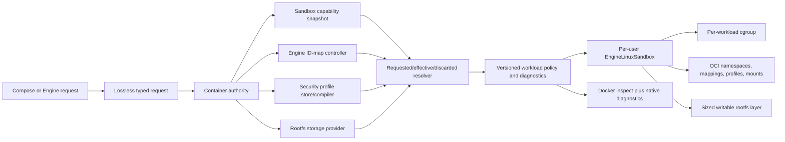

# Remaining Resource and Security Controls Parity Design

| Item | Value |
| --- | --- |
| Status | Design complete; implementation not started |
| Scope | `container-compose`, the matched `container` and `containerization` forks, the shared Engine API, and `devcontainer`'s selected runtime provider |
| Compatibility target | Docker Compose 5.3.1 with Docker Engine 29.2.1 API 1.53 on macOS |
| Evidence host | arm64 Mac17,9, macOS 26.5.2, Colima Docker context |
| Matched Container revision | `88460ab2ab0ca2f3fa9f91b2911b3b77647596c1` |
| Matched Containerization revision | `d7377b962af724f8d7c2b640f3ab12184d33f1af` |
| Design date | 31 July 2026 |

## Goal

Close the remaining resource and security controls row in [STATUS.md](../STATUS.md) without metadata-only success, invented cgroup-v1 behavior on a cgroup-v2 guest, a mutable security-profile dependency, or a storage option that silently changes meaning. Completion means that Container Compose:

- preserves realtime CPU, memory swappiness, OOM-kill, user-namespace, profile-based security, writable-cgroup, and rootfs storage requests losslessly through `config`, hashing, create, inspect, restart, and recreation;
- distinguishes requested, effective, defaulted, and capability-discarded values so a Docker warning or no-op is not presented as enforcement;
- reproduces Docker Compose and Engine validation phase, warning, error, inspection, and update behavior on the pinned reference;
- separates per-user Linux sandbox capacity from per-workload cgroup policy;
- implements Docker's engine-level user-namespace remapping model rather than inventing Compose syntax for raw UID/GID maps;
- snapshots and validates security-profile content before runtime mutation, then applies it through typed OCI policy;
- resolves `storage_opt` through the active rootfs storage provider and enforces every accepted option in the guest filesystem;
- exposes all of these controls through the same Container authority and Docker-compatible Engine API used by native clients, Container Compose, and devcontainer; and
- remains comparable to or better than Docker Compose on the maintained same-host resource, profile, storage, lifecycle, and inspection matrices.

The compatibility contract is observable Docker behavior on the pinned stack. A field can be completely implemented when Docker accepts it and deliberately discards it because a probed kernel feature is absent. Falsely reporting that such a field was enforced is a parity and security failure.

## Scope

### In scope

- Service `cpu_rt_period` and `cpu_rt_runtime`, including omission, zero, negative and boundary validation, kernel/daemon capability behavior, warnings, OCI projection where available, and inspect state.
- Service `mem_swappiness` and `oom_kill_disable`, including cgroup-v2 capability behavior and their interaction with memory limits, reservations, swap, OOM observation, and update.
- Engine-level UID/GID maps, per-container `userns_mode`, rootfs and mount ownership, namespace joins, privileged conflicts, inspection, migration, and engine capability reporting.
- `security_opt` forms for seccomp, AppArmor, SELinux labels, no-new-privileges, `systempaths=unconfined`, and `writable-cgroups`, including explicit profiles on privileged containers.
- Docker's default seccomp policy, custom inline profile compilation, profile-content persistence, capability negotiation, and applied-profile inspection.
- Rootfs `storage_opt`, including provider selection, the Docker-defined `size` behavior where supported, unknown options, allocation, enforcement, ENOSPC, update behavior, cleanup, and recovery.
- A versioned typed workload policy across ComposeRuntimeSPI, Container, Containerization, the guest agent, persistence, inspection, and the shared Engine API.
- Exact create/start/update/restart/remove phase boundaries, durable diagnostics, failure atomicity, migration, differential tests, and performance evidence.

### Explicitly out of scope

- `cpu_count`, `cpu_percent`, Windows isolation, and `credential_spec`; these are Windows-specific on the maintained Linux-on-macOS runtime.
- Emulating cgroup-v1 realtime, swappiness, or OOM-disable files on cgroup v2. The implementation reports and reproduces the pinned Docker capability result.
- Swarm placement, reservation scheduling, generic-resource admission, or cluster resource accounting. The local Deploy projection is covered by [the Local Deploy device/resource subset design](local-deploy-device-resource-subset-design.md).
- Device discovery, CDI, GPU selection, and arbitrary hardware passthrough. Those use the shared device broker in [the Local Deploy device/resource subset design](local-deploy-device-resource-subset-design.md).
- Claiming that a Docker-privileged workload is safely isolated from other workloads in the same Linux engine. Privileged grants broad engine-host authority by design; the outer boundary is the per-user macOS Container authority and VM.
- Adding raw UID/GID-map keys to the Compose model. Docker derives custom mappings from engine configuration, and per-container Compose selects the engine default or host exemption.
- Treating a Container-specific rootfs backend option as a Docker Compose field. Native extensions remain namespaced and cannot alter Docker-defined `storage_opt` silently.
- Passing through Docker Desktop, Colima, Socktainer, or another daemon's resource/security state. Container remains the selected runtime authority.

## Normative Terms

`MUST`, `MUST NOT`, `SHOULD`, and `MAY` describe implementation requirements. An oracle is an executable comparison with the pinned Docker reference on the same Mac. Requested state is the lossless user/Engine request. Effective state is the policy actually applied to a workload. A discarded setting is a valid request that Docker removes after capability evaluation, normally with a warning. A rejected setting never commits a container record unless the pinned Engine demonstrably leaves one.

## Current Evidence and Blockers

This is a cross-stack gap. The normalizer already retains most source values, but the production path rejects them or lacks an effective lower-layer projection.

| Layer | Current boundary | Consequence |
| --- | --- | --- |
| Compose normalization | [`main.go`](../Tools/compose-normalizer/main.go) preserves CPU realtime, memory swappiness, OOM-kill, `security_opt`, `storage_opt`, and `userns_mode`. | Source acceptance and `config` output exist, but they do not prove runtime behavior. |
| Compose validation | [`unsupportedCPUResourceFields`](../Sources/ComposeCore/ComposeOrchestratorRuntimeSupport.swift) rejects realtime CPU; the same file rejects swappiness, OOM-kill disable, and non-empty storage options with generic gap messages. | Docker capability warnings/no-ops are converted into unconditional Compose errors at the wrong layer and phase. |
| Security parsing | [`ComposeOrchestratorRuntimeSecurityOptions.swift`](../Sources/ComposeCore/ComposeOrchestratorRuntimeSecurityOptions.swift) maps no-new-privileges and system paths, consumes unconfined seccomp/AppArmor and `label=disable`, and rejects actual profiles. | A custom profile cannot be applied; an unsupported-kernel no-op cannot be distinguished from a profile silently ignored by Compose. |
| Typed create plan | [`ContainerServiceCreateRuntime`](../Sources/ComposeCore/ContainerServiceCreateAdapter.swift) carries block I/O, CPU shares, cgroup parent, memory reservation and swap, but not a complete resource, namespace, security, mapping, or storage policy. | Most controls still rely on Docker-shaped CLI strings and cannot preserve requested/effective distinctions. |
| Process model | [`ComposeProcessConfiguration`](../Sources/ComposeRuntimeSPI/ComposeRuntimeCreateModels.swift) stores `privileged`, no-new-privileges, OOM score and rlimits. | Container-wide device, namespace, profile, rootfs and cgroup policy is incorrectly compressed into process fields or omitted. |
| Container resources | The pinned [`ContainerConfiguration.Resources`](https://github.com/stephenlclarke/container/blob/88460ab2ab0ca2f3fa9f91b2911b3b77647596c1/Sources/ContainerResource/Container/ContainerConfiguration.swift#L244-L273) combines VM CPU/memory allocation with workload quota and has an unwired `storage` value. | A shared Linux engine cannot apply Docker cgroups accurately while VM capacity and container limits are the same field. |
| Container user namespace | The pinned Container configuration has only `privateUserNamespace: Bool`; Containerization maps it to identity ranges `0 0 4294967295`. | There is no engine remap policy, host exemption, subordinate range validation, ownership projection, or truthful Docker inspection. |
| Container privilege | Privileged currently restores all capabilities and clears default masked/read-only paths. | It does not yet coordinate security profiles, writable cgroups, `/sys`, user mappings, or full device policy; those dependencies are addressed by the coherent isolation design. |
| Containerization configuration | The pinned [`LinuxContainer.Configuration`](https://github.com/stephenlclarke/containerization/blob/d7377b962af724f8d7c2b640f3ab12184d33f1af/Sources/Containerization/LinuxContainer.swift#L81-L185) projects current limits but has no realtime, swappiness, OOM-disable, seccomp, AppArmor, arbitrary ID-map, or rootfs storage policy. | Valid OCI fields are unreachable from a typed runtime request. |
| OCI model | The matched [`Spec.swift`](https://github.com/stephenlclarke/containerization/blob/d7377b962af724f8d7c2b640f3ab12184d33f1af/Sources/ContainerizationOCI/Spec.swift) already models CPU realtime, memory swappiness/OOM disable, UID/GID maps, AppArmor and seccomp. | Much of the representation exists, but guest capability probing and production projection do not. |
| Rootfs storage | The matched [`ContainerManager`](https://github.com/stephenlclarke/containerization/blob/d7377b962af724f8d7c2b640f3ab12184d33f1af/Sources/Containerization/ContainerManager.swift#L190-L273) can create a separate sized ext4 writable overlay layer. | There is a useful enforcement primitive, but Container does not resolve Docker storage-driver semantics or wire the option. |
| Capability surface | Runtime capability negotiation is feature-ID based but has no per-controller kernel/security/storage fingerprint or warning disposition. | Compose cannot tell an applied value from a valid Docker discard and direct Engine clients cannot receive equivalent warnings. |
| Runtime topology | Production Container creates one VM per container; the coherent closure designs require a per-user shared Linux sandbox with per-workload namespaces/cgroups. | VM CPU/memory fields must be split from workload resource policy before these controls can be implemented without changing meaning. |

The checked-in matched refs remain the source of truth in [`Tools/release/stack-refs.json`](../Tools/release/stack-refs.json). Current sibling repository heads are not evidence for this design unless those exact refs are updated and the entire stack is revalidated.

## Docker Reference Contract

### Phase and observation are part of the behavior

Docker Compose 5.3.1 builds Engine resource, security, storage, and namespace requests during service create. Compose reads custom seccomp files itself; Engine validates host capabilities and storage/security backends; the OCI runtime applies effective policy at task creation. The implementation MUST retain those distinctions.

| Phase | Responsibility | Failure residue |
| --- | --- | --- |
| Compose model/config | Parse, merge, interpolate, preserve field presence and render source configuration. | No runtime contact or resource mutation. |
| Compose create projection | Resolve relative seccomp paths, compact JSON, project typed Engine-equivalent fields, and preserve warnings generated before the runtime call. | No Container resource mutation if local projection fails. |
| Container create | Resolve engine defaults, kernel/security/storage capabilities, user maps, immutable profile content, and create-time storage policy. | Match the pinned Engine's stopped-container or no-container residue exactly. |
| Workload start | Apply cgroups, namespaces, mappings, profiles, mounts, and any start-time runtime validation. | Preserve the Docker-matched stopped state, error, and allocated resources. |
| Update | Validate mutable controls and apply/reconcile them transactionally. Successful/stopped updates persist the effective revision. A running runtime-application rejection retains the prior effective state but still emits `update` at Moby 29.2.1's pinned post-validation boundary; earlier validation failures do not. | Match response, inspection, event and residue for both success and failure. |
| Inspect/info | Return Docker-shaped fields plus namespaced native requested/effective/disposition diagnostics without claiming discarded values are active. | Read-only. |

The executable oracle records API request/response JSON, warnings, inspect before and after create/start/update, cgroup files, `/proc` state, profile effects, rootfs capacity, container residue, and event order. Documentation text alone is insufficient for ambiguous platform behavior.

### CPU realtime

Docker Compose forwards non-zero `cpu_rt_period` and `cpu_rt_runtime` into Engine `HostConfig.Resources`. Their actual availability depends on the Linux realtime scheduler, cgroup mode and daemon configuration.

Required behavior:

- preserve source values and explicit field presence through `config` and hashing;
- reproduce Compose's omitted/zero projection exactly;
- validate signed range and runtime/period relationships at the same layer as Docker;
- probe the running guest and engine policy rather than assuming the OCI DTO proves support;
- on the maintained cgroup-v2 guest, reproduce the pinned Docker unsupported warning/error and inspect disposition rather than creating synthetic cgroup files;
- if a future guest genuinely exposes the controller, project `realtimePeriod` and `realtimeRuntime` to OCI and prove the scheduler effect with an RT workload; and
- never convert an unsupported request into an ordinary CFS quota or VM vCPU allocation.

The capability result is bound to the active `sandboxGeneration` and its signed canonical `capabilityDigest`, which covers the guest kernel/init image and relevant engine configuration. A cached result from another sandbox generation, VM image, or cgroup mode is invalid.

### Memory swappiness

Moby validates values in the range 0 through 100 and, when the kernel lacks memory-swappiness support, emits a capability warning and discards the effective value. The pinned reference decides how Compose's explicit zero differs from omission.

Container MUST:

- retain the requested value and presence in Compose state;
- use a signed request representation until Docker validation completes;
- expose `applied` only when the cgroup file exists and a live workload probe observes the configured value;
- record `discarded(kernelCapabilityMissing)` with the Docker warning when the maintained cgroup-v2 guest lacks the control; and
- omit the value from effective OCI/cgroup policy after discard.

It MUST NOT map swappiness to `memory.swap.max`, VM swap configuration, memory reservation, or a host macOS paging preference. Those controls are observably different.

### OOM-kill disable

`oom_kill_disable` is a requested memory-controller policy, not the lifecycle `OOMKilled` result. Docker can discard it when the kernel capability is absent and warns when disabling the OOM killer without a memory limit.

Required behavior:

- preserve explicit true/false and Compose's default projection;
- reproduce the pinned cgroup-v2 warning/discard behavior;
- where supported, apply OCI `disableOOMKiller` and prove the effective cgroup behavior under controlled pressure;
- keep lifecycle OOM detection based on `memory.events` attributed to immutable `containerID`, `processGeneration`, and `sandboxGeneration`, with effective policy truth at `policyRevision`, never this requested flag; and
- return the exact Docker-shaped effective inspect value while retaining requested/disposition data only in a namespaced native extension.

Resource pressure tests MUST have host and sandbox safety ceilings. A test that destabilizes the Mac is not acceptable evidence.

### Engine user-namespace remapping

Docker obtains arbitrary UID/GID maps from engine configuration, normally `userns-remap`. A container uses the engine mapping by default and can request `userns=host` as an exemption. Compose does not carry raw mappings.

The Container authority therefore owns one versioned per-user `LinuxIDMapPolicy`:

- ordered UID and GID ranges using container ID, engine-host ID and size;
- validated non-zero sizes, overflow safety, non-overlap and supported range counts;
- canonical `idMapRevision` and a stable policy digest;
- per-workload `.engineDefault` or `.host` selection;
- rootfs unpack/chown or idmapped-mount policy;
- volume, bind, config, secret, device and API-socket ownership projection;
- namespace-join compatibility; and
- exact privileged, host-network, host-PID and writable-cgroup conflicts.

Changing the engine mapping is a migration operation, not an ordinary live update. It is blocked while incompatible workloads or writable storage leases are active unless an offline verified ownership migration has been selected.

The current identity-mapped private namespace becomes an explicit legacy compatibility mode during migration. It MUST NOT be relabelled as Docker userns-remap or silently applied to newly created containers after the engine policy lands.

### Security options

Docker Compose 5.3.1's [`parseSecurityOpts`](https://github.com/docker/compose/blob/v5.3.1/pkg/compose/create.go#L464-L497) establishes important client-side behavior:

- `systempaths=unconfined` clears Engine masked/read-only path lists rather than remaining in `SecurityOpt`;
- a non-`unconfined`, non-`builtin` seccomp path is resolved relative to the Compose project;
- Compose reads and JSON-compacts that file before the Engine request; and
- other options retain their source spelling for Engine parsing.

The required option matrix is:

| Option | Effective policy |
| --- | --- |
| `no-new-privileges` and boolean forms | Set process no-new-privileges exactly, including explicit false behavior. |
| `systempaths=unconfined` | Clear only the standard masked/read-only path policy; do not add capabilities or grant devices. |
| `seccomp=builtin` | Select the pinned engine default profile. |
| `seccomp=unconfined` | Apply no seccomp profile. |
| `seccomp=<JSON>` | Validate, compile, persist and apply the exact inline profile content. |
| `apparmor=<name>` | Apply the named profile when AppArmor is available; reproduce the pinned Docker no-op/error when it is not. |
| `apparmor=unconfined` | Select the unconfined AppArmor policy. |
| `label=...` and `label=disable` | Reproduce the maintained SELinux-disabled result; apply real labels only on a future advertised SELinux guest. |
| `writable-cgroups` and boolean forms | Make the cgroup mount writable when Docker permits; enforce rootless/userns conflicts. |

Colon separators remain accepted or warned only where the pinned Compose/Engine versions do so. Unknown keys, missing values, invalid booleans, malformed JSON, unsupported actions/architectures/syscalls and oversized profiles fail with the pinned category and phase.

### Default and explicit profiles under privileged

Privileged is defined by [the shared namespaces and privileged isolation design](shared-namespaces-privileged-isolation-design.md), but profile behavior is owned here:

- an ordinary privileged container receives no default seccomp profile and the default AppArmor/SELinux policy becomes unconfined;
- an explicitly supplied seccomp, AppArmor, or label profile is still applied to a privileged container where Docker does so;
- no-new-privileges remains an independently requested process control;
- an explicit read-only rootfs remains read-only; and
- profile selection never grants the Docker API socket.

The outer macOS VM/service boundary remains in force. The design does not describe privileged as safe for mutually untrusted workloads in the same engine sandbox.

### Rootfs storage options

Docker stores `storage_opt` in HostConfig and delegates meaning and validation to the active rootfs storage driver/snapshotter. It is not a general-purpose volume option map.

Container supplies a `RootfsStorageProvider` contract. The built-in provider initially recognises only options for which it has both a Docker oracle and a real enforcement primitive. The expected first candidate is `size`, backed by Containerization's separate sized ext4 writable overlay layer.

The provider MUST:

- distinguish omitted options, an empty map and explicitly supplied values;
- parse Docker byte-size grammar with overflow and minimum-size checks;
- reject unknown keys and unsupported backend/filesystem capabilities before reporting success;
- persist requested options, provider identity/version and effective allocation separately;
- prove capacity and ENOSPC from inside the workload rather than from sparse-file metadata;
- preserve allocation and data across stop/start, sandbox restart, authority restart and compatible container restart;
- coordinate update behavior with the lifecycle design and never shrink destructively;
- delete only the container-owned writable layer after all mounts/processes are gone; and
- expose Docker-shaped HostConfig plus redacted native provider diagnostics.

If the pinned Docker-on-macOS backend rejects `size` because its backing filesystem lacks project quota, the release oracle records that reference result. Enabling a stronger Container backend success path requires an explicit compatibility decision and its own behavior matrix; it cannot be called identical by assertion.

`read_only: true`, image-rootfs sizing, separate writable upper size, commit/export, copy, disk-usage accounting and removal ordering are oracle-tested together. Rootfs storage does not become a named volume and cannot share a volume-provider lifecycle record.

## Design Decisions

### Requested, effective, and discarded are separate state

The persisted model MUST retain both the user request and the runtime resolution:

```swift
public enum ResourceDisposition: String, Codable, Sendable {
    case defaulted
    case applied
    case discarded
}

public struct ResolvedSetting<Value: Codable & Sendable>: Codable, Sendable {
    public var requested: Value?
    public var effective: Value?
    public var disposition: ResourceDisposition
    public var capabilityID: String?
    public var diagnosticIDs: [String]
}
```

An absent request that receives an engine default is `defaulted`. A valid request enforced by the guest is `applied`. A valid request removed after capability evaluation is `discarded`. Invalid requests fail and do not produce a successful resolved record.

Docker inspect mixes requested and daemon-adjusted HostConfig fields depending on the field and version. The Docker projection MUST follow the pinned oracle exactly. The complete distinction is exposed only through a namespaced Container diagnostic extension and never substituted for Docker fields.

### Container is the policy and state authority

Compose owns Compose-specific parsing, project-relative seccomp resolution, hashing and orchestration. Container owns engine defaults, capabilities, ID maps, profile content, storage providers, persistent requested/effective state, warnings, update and recovery. Containerization applies a resolved OCI/sandbox plan and does not parse Compose options, read host profile paths, choose storage providers, or invent warnings.

Every client uses the same Container authority:

- Container Compose through ComposeRuntimeSPI;
- native Container clients through typed XPC/API calls;
- Docker CLI and API consumers through the shared `container-engine` router; and
- devcontainer when its Container-family provider is selected.

No client-side validation result can override the authority's current signed capability snapshot for the active `sandboxGeneration`.

### Use the shared per-user Linux sandbox

The [coherent Container-family design](coherent-container-family-parity-design.md) promotes the experimental multi-workload runtime into one per-user Linux engine sandbox. This design depends on that foundation.

The sandbox has engine-level capacity and kernel/security capabilities. Each workload has its own cgroup and private namespaces by default. Consequently:

- VM `cpus` and memory are sandbox capacity, not Docker container limits;
- workload quota, shares, cpuset, memory, swap, PIDs, block I/O and future supported realtime values belong only to the workload cgroup;
- capability probing happens once per sandbox generation and is confirmed at workload application where necessary;
- ID maps and security profiles are engine policy projected per workload; and
- rootfs writable layers are workload-owned storage mounted inside that workload's mount namespace.

A fallback one-VM-per-container adapter can remain for stock Apple compatibility, but it cannot advertise the complete shared-sandbox capability or silently reinterpret per-workload controls as fixed VM resources.

### Prefer exact unsupported behavior to fake enforcement

The maintained guest uses cgroup v2. Realtime bandwidth, swappiness and OOM-kill disable have different or absent semantics there. The runtime MUST report the Docker result for that environment. Adding an unrelated approximation would make inspection and workload behavior disagree and could give users false security or availability expectations.

### Security profile content is immutable container configuration

Compose or a Docker client supplies inline seccomp content. Container validates and stores a canonical content-addressed profile object before committing the resolved configuration. Restarts use that object and digest, not a source path. AppArmor names resolve against an engine-managed profile `inventoryGeneration`. SELinux labels remain capability-dependent.

Profile garbage collection is reference-counted by immutable `containerID` and each exact `SecurityProfileLeaseV1.leaseID`/`leaseGeneration` pair. A content record's profile-resource revision remains separate. A profile is removed only after no current or recovery lease references it.

## Target Architecture



The resolution path is side-effect free until it has a complete plan or reaches a Docker phase that intentionally creates persistent state. Storage allocation and profile persistence participate in the container create transaction. Workload cgroup/profile application participates in the start transaction.

## Canonical Typed Model

### Compose projection and runtime-neutral request

ComposeCore retains its source-rich Compose model for `config`, hashing, and
diagnostics, then projects it losslessly into the following runtime-neutral
request owned by `container-engine-api`. The Docker HTTP decoder, native
clients, and devcontainer adapters produce the same neutral DTO directly; no
`Compose*` type crosses `ContainerEngineRuntimeSPI` or becomes a dependency of
the Container authority. Add this versioned container-wide policy instead of
adding fields to `ComposeProcessConfiguration`:

```swift
public struct ContainerLinuxWorkloadPolicyRequestV1: Codable, Sendable {
    public var resources: ContainerLinuxResourcePolicyRequestV1
    public var security: ContainerLinuxSecurityPolicyRequestV1
    public var rootfsStorage: ContainerRootfsStorageRequestV1
}

public struct ContainerLinuxResourcePolicyRequestV1: Codable, Sendable {
    public var cpu: ContainerLinuxCPUResourceRequestV1
    public var memory: ContainerLinuxMemoryResourceRequestV1
    public var pidsLimit: Int64?
    public var blockIO: ContainerLinuxBlockIORequestV1?
    public var cgroupParent: String?
}

public struct ContainerLinuxCPUResourceRequestV1: Codable, Sendable {
    public var quotaInMicroseconds: Int64?
    public var periodInMicroseconds: UInt64?
    public var shares: UInt64?
    public var cpuset: String?
    public var realtimePeriodInMicroseconds: Int64?
    public var realtimeRuntimeInMicroseconds: Int64?
}

public struct ContainerLinuxMemoryResourceRequestV1: Codable, Sendable {
    public var limitInBytes: Int64?
    public var reservationInBytes: Int64?
    public var swapLimitInBytes: Int64?
    public var swappiness: Int64?
    public var oomKillDisable: Bool?
}

public enum ContainerRootfsStoragePresence: String, Codable, Sendable {
    case omitted
    case presentEmpty
    case present
}

public struct ContainerRootfsStorageOption: Codable, Sendable {
    public var key: String
    public var value: String
}

public struct ContainerRootfsStorageRequestV1: Codable, Sendable {
    public var schemaVersion: UInt32
    public var presence: ContainerRootfsStoragePresence
    public var options: [ContainerRootfsStorageOption]
}
```

`storage_opt` is a map, so source map order is not a Docker semantic. The
normaliser retains omission separately from explicit `{}` and serialises every
exact key/value, including unknown options, in canonical UTF-8 key order; a
duplicate source key remains a model error rather than becoming two provider
requests. `.omitted` and `.presentEmpty` require an empty array, while
`.present` requires at least one entry. The rootfs-storage controller alone
validates/provider-resolves these entries and creates the corresponding lease;
Compose and the volume controller do not reinterpret them.

The aggregate deliberately does not serialise a second user-namespace field.
It travels beside the canonical `LinuxNamespacePolicy`, whose
`UserNamespaceSelection` is the single requested source consumed by the ID-map
controller. Resource/security resolution may reference that selection but
cannot override it.

Optional fields retain a separate presence bit where Compose distinguishes explicit zero/false from omission. The wire schema MUST NOT rely on Swift default decoding to erase that distinction.

Security policy preserves request lexemes until the authority parses them. This
is required because a known key with an invalid boolean/value must fail at the
Engine phase rather than become `nil` or an unknown option:

```swift
public enum ContainerSecurityOptionSeparator: String, Codable, Sendable {
    case equals
    case colon
}

public enum ContainerSecurityOptionEntry: Codable, Sendable {
    case raw(String)
    case inlineSeccomp(
        keySpelling: String,
        separator: ContainerSecurityOptionSeparator,
        compactJSON: Data
    )
}

public struct ContainerLinuxSecurityPolicyRequestV1: Codable, Sendable {
    public var orderedOptions: [ContainerSecurityOptionEntry]
}
```

`orderedOptions` is lossless for source order, duplicates, conflicts, key and
separator spelling, explicit/invalid boolean text, and unknown entries. Every
non-path option crosses as its exact `.raw` lexeme and is parsed once by the
authority. For a custom seccomp path, Compose replaces only that path-bearing
entry with `.inlineSeccomp`, preserving its ordinal, original key spelling, and
separator while sending bounded compact JSON; no project/host path crosses or
persists at the authority. `config` still renders the original source model.
The authority walks the ordered entries once, applies the pinned parse,
duplicate, and conflict rules, derives its internal typed effective security
configuration, and reports diagnostics in the same order. It never trusts a
second client-pre-resolved set of scalar security fields.

The common create envelope's canonical `ContainerPrivilegeIntentV2` carries
`privileged`, capability add/drop lists, read-only rootfs, and requested
masked/read-only paths. `LinuxNamespacePolicy` carries namespace choices.
Container combines those exact adjacent DTOs with `ContainerLinuxSecurityPolicyRequestV1`
in its effective security resolver; Compose cannot precompute the final
privileged profile. Exec uses the separate `ExecPrivilegeIntentV1` and never
rewrites create policy.

### Container persistent request and resolution

Container persists:

```swift
public struct RootfsStorageProviderReferenceV1: Codable, Sendable, Equatable {
    public var providerID: String
    public var providerGeneration: UInt64
}

public struct LinuxWorkloadPolicyRecordV2: Codable, Sendable {
    public var requested: LinuxWorkloadRequestedPolicy
    public var effective: LinuxWorkloadEffectivePolicy
    public var dispositions: [PolicyFieldDisposition]
    public var sandboxGenerationAtResolution: UInt64
    public var capabilityDigest: String
    public var idMapRevision: UInt64?
    public var securityProfileDigests: [String]
    public var rootfsStorageProvider: RootfsStorageProviderReferenceV1?
    public var policyRevision: UInt64
}
```

The record never stores a project-relative profile path, an open file descriptor, an unredacted provider credential, a temporary mountpoint, or a guest PID. Those are resolved from stable IDs immediately before activation. `sandboxGenerationAtResolution` is the exact sandbox incarnation whose canonical signed snapshot produced `capabilityDigest`; the digest is evidence, not another generation clock. `idMapRevision` is the canonical engine ID-map configuration revision.

### Containerization effective plan

Containerization receives only effective values:

```swift
public struct LinuxWorkloadResourceConfiguration: Codable, Sendable, Equatable {
    public var cpu: LinuxCPU
    public var memory: LinuxMemory
    public var pids: LinuxPids?
    public var blockIO: LinuxBlockIO?
    public var cgroupParent: String?
}

public struct ControllerEffectOperationIdentityV1: Codable, Sendable, Equatable {
    public var operationID: String
    public var operationGeneration: UInt64
    public var idempotencyKey: String
    public var actionID: String
    public var semanticRequestDigest: String
    public var actionRequestDigest: String
}

public struct LinuxWorkloadSecurityConfiguration: Sendable {
    public var uidMappings: [LinuxIDMapping]
    public var gidMappings: [LinuxIDMapping]
    public var seccomp: LinuxSeccomp?
    public var appArmorProfile: String?
    public var processLabel: String?
    public var mountLabel: String?
    public var noNewPrivileges: Bool
    public var writableCgroups: Bool
    public var maskedPaths: [String]
    public var readonlyPaths: [String]
}
```

Unknown required policy versions fail before workload creation. Containerization does not emit Docker warnings; it returns typed capability/application failures to Container for translation.

## Capability and Diagnostic Contract

### Sandbox capability snapshot

At engine-sandbox boot, the guest agent returns a signed/versioned snapshot covering:

- kernel release and guest image digest;
- cgroup version, mounted controllers and delegated subtree;
- CFS, cpuset, PIDs, memory, swap, block I/O and realtime controller files;
- swappiness and OOM-disable availability;
- user namespace, idmapped mount and mapping-count support;
- seccomp actions, architectures and notification support;
- AppArmor enabled state and loaded-profile inventory generation;
- SELinux enabled/enforcing state;
- writable-cgroup and recursive mount capabilities; and
- rootfs/storage filesystem and quota/enforcement capabilities.

Container validates the guest-agent protocol and associates the snapshot with the sandbox generation. A changed guest image, restarted sandbox, changed engine profile inventory or storage-provider generation invalidates affected cached resolutions.

### Stable diagnostic IDs

Warnings have stable internal IDs and Docker-compatible rendered text, for example:

- `resource.memory.swappiness.unsupported`;
- `resource.memory.oom-kill-disable.unsupported`;
- `resource.cpu.realtime.unsupported`;
- `security.seccomp.kernel-unavailable`;
- `security.apparmor.not-applied`;
- `storage.rootfs.option.unsupported`.

Docker API responses receive the exact pinned warning strings and status. Native diagnostics receive stable IDs, requested/effective values and redacted context. Routine logs do not duplicate user-supplied profile JSON or security labels.

### Feature capability IDs

Add independent manifest capabilities so clients fail only for features they use:

- `io.github.stephenlclarke.container.linux-workload-policy.v1` for the typed aggregate policy;
- `io.github.stephenlclarke.container.resource-dispositions.v1` for requested/effective/discarded inspection and warnings;
- `io.github.stephenlclarke.container.engine-userns-remap.v1` for engine ID maps and host exemption;
- `io.github.stephenlclarke.container.security-profiles.v1` for default/custom seccomp, AppArmor capability handling and profile persistence;
- `io.github.stephenlclarke.container.rootfs-storage-options.v1` for provider-resolved storage options; and
- the shared Linux sandbox capability defined by [the coherent design](coherent-container-family-parity-design.md).

Update [`runtime-capabilities.json`](../Tools/release/runtime-capabilities.json), Container's manifest, stack consistency checks and capability documentation together. A single broad “resources supported” flag is insufficient.

## Validation and Resolution Phases

### Compose model phase

The compose-go normalizer remains authoritative for schema, interpolation and merge. It preserves:

- field presence and zero/false where compose-go exposes it;
- security-option list order and spelling required for diagnostics;
- storage option key/value strings; and
- resolved `userns_mode` source state.

`config` never contacts Container, reads runtime capabilities, allocates profile objects or creates storage.

### Compose create projection

At the pinned service-create phase, before the authority's public
`ContainerCreate` transaction mutates container identity or durable workload
state, ComposeCore:

1. validates project-level static conflicts;
2. resolves custom seccomp paths exactly as Docker Compose 5.3.1 `Project.RelativePath` does: absolute paths remain absolute and relative paths, including parent-relative forms, resolve from the project working directory without an added containment rule;
3. opens that exact permitted target through a descriptor-pinned, race-safe read that permits Docker-compatible symlink resolution, enforces a bounded size, reads once, parses JSON and emits compact inline content;
4. losslessly encodes the ordered `.raw` lexemes and `.inlineSeccomp` entry without pre-parsing known scalar options or dropping invalid/unknown values;
5. preserves raw storage strings for the authority provider; and
6. submits the complete typed workload request.

This is a container-create boundary, not a promise that the whole Compose
command is residue-free. Image pulls, model ensures, and other
Docker-permitted command effects that occur at earlier pinned phases remain
intact if this projection later fails. No profile, storage staging, public
container ID, name reservation, or container-owned lease from the rejected
`ContainerCreate` transaction may remain.

The runtime authority repeats every security-sensitive validation. Compose validation is an early error-quality optimization, not an authorization boundary.

### Container resolution

Container resolves, in order:

1. selected engine, `sandboxGeneration`, and canonical capability-snapshot digest;
2. engine resource defaults and Docker capability adjustments;
3. user namespace mode and exact ID maps;
4. privileged/default/explicit security profile interaction;
5. immutable profile objects and digests;
6. rootfs storage provider and effective allocation plan; and
7. Docker warnings plus native dispositions.

Resolution is idempotent by container-create operation ID and source-config hash. If any rejected value fails, release only transaction-created profile/storage staging and do not commit a successful policy.

### Start activation

At start, Container compares both `sandboxGenerationAtResolution` and persisted `capabilityDigest` with the active sandbox snapshot, then validates `idMapRevision`, content-store profile digest/revision or the complete profile `providerID`/`providerGeneration`/`inventoryGeneration` source tuple, and relevant rootfs `providerGeneration` values. A changed sandbox generation or digest invalidates the cached resolution and triggers a side-effect-free re-resolution from the persisted requested policy. If requested/effective/disposition truth is identical, a ledger transaction refreshes only the resolving sandbox/digest evidence and leaves `policyRevision` unchanged; if effective semantics would change, start fails for explicit recreate/migration unless the pinned Docker oracle requires a different adjustment. It then:

1. ensures the shared Linux sandbox;
2. prepares rootfs and writable layer;
3. creates the workload cgroup below the validated parent;
4. applies effective resources;
5. prepares mappings, mounts and ownership;
6. applies OCI process/security profiles and system paths;
7. verifies critical effective files/profile labels; and
8. starts the workload and commits lifecycle state/events.

A start-time mismatch that Docker would reject leaves the stopped container and its create-owned resources. A semantically identical re-resolution refreshes only `sandboxGenerationAtResolution`, `capabilityDigest`, and the protected diagnostic before process start; `policyRevision` remains unchanged because no effective policy changed.

### Update

The lifecycle controller owns a typed update operation. The oracle classifies each field as:

- live mutable;
- mutable only while stopped;
- recreate required; or
- unsupported by the pinned Engine/backend.

Resource updates stage old and new cgroup values, validate the complete combination, apply in safe order, and verify. Success persists one new policy revision and emits one `update` action. A running runtime-application rejection restores prior HostConfig/effective values (or enters explicit recovery if rollback cannot be proved), never persists rejected desired values, and still emits `update` at the pinned Moby post-validation boundary with the unchanged policy revision. A failure before that boundary emits no action. The black-box oracle fixes exact error, event attributes/order, and inspect residue.

Security profile, ID-map and rootfs storage changes are expected to require recreation unless the pinned oracle proves otherwise. Compose reconciliation hashes requested policy and selects recreate consistently.

## Container Controllers

### Sandbox capacity controller

Engine sandbox capacity is configured independently of container requests. It exposes the CPUs and memory available to Docker-like workloads but does not use one container's `cpus` or `mem_limit` to resize the VM.

The controller MUST:

- configure enough vCPUs for the engine policy and expose the actual count to cpuset/NanoCPU validation;
- avoid a fixed VM memory ceiling that causes global guest OOM before a valid workload cgroup limit;
- support Docker-like overcommit rather than summing limits as reservations;
- use ballooning or another measured host policy only when it does not alter observable workload limits; and
- report engine capacity separately from every workload's effective controls.

Stock Apple's fixed one-VM adapter reports its narrower behavior and cannot advertise shared-sandbox parity.

### Workload resource controller

The guest agent creates a stable cgroup for immutable `containerID` and `processGeneration` within the current `sandboxGeneration`. It applies controllers in a deterministic order and returns read-back values; it introduces no separate cgroup-generation clock.

Every create/apply, failed-candidate compensation, live update, and process-exit
deletion is a distinct durable action rather than an unjournalled guest call:

```swift
public enum WorkloadCgroupEffectActionV1: String, Codable, Sendable {
    case prepareCandidate
    case compensateCandidate
    case updateActive
    case deactivateActive
}

public enum WorkloadCgroupEffectFenceV1: Codable, Sendable, Equatable {
    case candidate(processGeneration: UInt64, sandboxGeneration: UInt64)
    case active(processGeneration: UInt64, sandboxGeneration: UInt64)
}

public enum WorkloadCgroupActivationStateV1: String, Codable, Sendable {
    case active
    case deactivating
    case recoveryRequired
    case released
}

public struct WorkloadCgroupActivationV1: Codable, Sendable, Equatable {
    public var schemaVersion: UInt32
    public var activationID: String
    public var containerID: String
    public var policyRevision: UInt64
    public var activeProcessGeneration: UInt64
    public var activeSandboxGeneration: UInt64
    public var cgroupParentIdentityDigest: String
    public var recoveryMarkerID: String
    public var effectiveConfiguration: LinuxWorkloadResourceConfiguration
    public var readBackDigest: String
    public var state: WorkloadCgroupActivationStateV1
}

public struct WorkloadCgroupEffectRequestV1: Codable, Sendable, Equatable {
    public var schemaVersion: UInt32
    public var action: WorkloadCgroupEffectActionV1
    public var activationID: String
    public var operation: ControllerEffectOperationIdentityV1
    public var containerID: String
    public var expectedPolicyRevision: UInt64
    public var targetPolicyRevision: UInt64?
    public var fence: WorkloadCgroupEffectFenceV1
    public var cgroupParentIdentityDigest: String
    public var recoveryMarkerID: String
    public var expectedEffectDigest: String?
    public var previousConfiguration: LinuxWorkloadResourceConfiguration?
    public var targetConfiguration: LinuxWorkloadResourceConfiguration?
}

public enum WorkloadCgroupEffectDispositionV1: String, Codable, Sendable {
    case applied
    case restored
    case notApplied
    case present
    case absent
    case uncertain
}

public struct WorkloadCgroupEffectAcknowledgementV1:
    Codable, Sendable, Equatable {
    public var request: WorkloadCgroupEffectRequestV1
    public var disposition: WorkloadCgroupEffectDispositionV1
    public var effectiveConfigurationDigest: String?
    public var readBackDigest: String?
}

public enum WorkloadCgroupEffectAttemptPhaseV1: String, Codable, Sendable {
    case requestPersisted
    case effectInProgress
    case responsePersisted
    case committing
    case compensating
    case rollingBack
    case deactivating
    case reconciling
    case recoveryRequired
    case complete
}

public struct WorkloadCgroupEffectAttemptV1: Codable, Sendable, Equatable {
    public var schemaVersion: UInt32
    public var request: WorkloadCgroupEffectRequestV1
    public var phase: WorkloadCgroupEffectAttemptPhaseV1
    public var recoveryTargetPhase: WorkloadCgroupEffectAttemptPhaseV1?
    public var acknowledgement: WorkloadCgroupEffectAcknowledgementV1?
}

public struct WorkloadCgroupEffectReconcileQueryV1:
    Codable, Sendable, Equatable {
    public var schemaVersion: UInt32
    public var originalRequest: WorkloadCgroupEffectRequestV1
}

public protocol WorkloadCgroupEffectingV1: Sendable {
    func prepareCandidate(
        _ request: WorkloadCgroupEffectRequestV1
    ) async throws -> WorkloadCgroupEffectAcknowledgementV1
    func compensateCandidate(
        _ request: WorkloadCgroupEffectRequestV1
    ) async throws -> WorkloadCgroupEffectAcknowledgementV1
    func updateActive(
        _ request: WorkloadCgroupEffectRequestV1
    ) async throws -> WorkloadCgroupEffectAcknowledgementV1
    func deactivateActive(
        _ request: WorkloadCgroupEffectRequestV1
    ) async throws -> WorkloadCgroupEffectAcknowledgementV1
    func reconcile(
        _ query: WorkloadCgroupEffectReconcileQueryV1
    ) async throws -> WorkloadCgroupEffectAcknowledgementV1
}
```

Before any cgroup effect, the authority reserves the action-specific operation,
activation, candidate or active process/sandbox fence, deterministic recovery
marker, expected/target policy revisions, parent identity, and complete old/new
effective plan. It persists the byte-canonical request in the sole generic operation ledger and
the controller attempt in `.requestPersisted`; only then may it call the guest.
The semantic digest binds the immutable desired transition, including both
expected and target policy revisions. The action digest additionally binds the
action, action ID, exact request, and fence. Reusing an
operation or idempotency key with a different action or either digest conflicts.

The guest durably reserves the exact action tuple before its first mkdir,
controller write, rollback, or deletion. The reservation maps
`recoveryMarkerID` to the deterministic cgroup handle/path and is discoverable
before the effect becomes visible. It then performs only the request's complete
apply, restore, or delete plan, reads all critical surviving files, and persists
the exact acknowledgement before replying. An
exact retry returns the byte-identical cached acknowledgement. After a lost
reply, `reconcile` accepts the byte-identical original request, performs no new
mutation, and returns only the cached result, proved `notApplied`, `present`,
`absent`, or `uncertain`.
A crash after the kernel effect but before outcome persistence recovers solely
through the reserved marker, stable handle, and full fence; it never searches
by mutable container name or adopts a later policy/process generation.
Proved `notApplied` permits only the same prepare mutation to resume under its
existing reservation; it never authorises a fresh action ID or marker.
Proved present before candidate compensation or active deactivation likewise
permits only that same cleanup request to resume under its existing reservation.

Method/action and optional fields are closed. `prepareCandidate` requires a
candidate fence, nil previous configuration, a complete target, and a target
revision equal to its expected already-resolved policy revision, with nil
expected effect digest.
`compensateCandidate` requires the same candidate fence, activation, marker,
parent, expected revision, and prepared configuration as its prepare outcome,
the exact preparation effect digest, and nil target revision/configuration.
`updateActive` requires an active fence, the exact current activation digest,
complete previous and target configurations, and target policy revision exactly
one greater than the expected revision, with overflow rejected.
`deactivateActive` requires an active fence plus the complete previous
configuration/current expected revision, exact activation digest, and nil
target revision/configuration.
Applied requires target and both
matching effective/read-back digests; restored requires the old digest after a
failed or not-started update; `notApplied` is legal only for a prepare whose
reserved marker is proved to have no cgroup and has no digest; absent is legal
only for candidate compensation or active deactivation and has no digest;
present is reconcile-only for those two cleanup actions and requires both
matching old effective/read-back digests; their normal mutation methods cannot
return it as success. Uncertain carries no success digest. A mismatched echo, marker,
parent, expected or target revision, action, process, sandbox, or read-back
remains recovery-required. The authority commits the process activation or
compare-and-swap from the expected to target policy revision only after
persisting and verifying the response. The successful process-start commit
publishes exactly one `WorkloadCgroupActivationV1` from the candidate response;
candidate preparation alone is never active. It clears an old activation only
after the exact deactivation response is durable. `recoveryRequired` names its
last proven phase in `recoveryTargetPhase` and preserves the request and any
acknowledgement; it can target only the interrupted nonterminal phase, and every
other attempt phase requires that field nil. Activation transitions are exactly
`active -> deactivating -> released`, with uncertainty moving to
`recoveryRequired` until the same request is reconciled. Released remains a
terminal marker through the retry/finalisation window.

For a running update, the guest compares the observed old digest before the
first write, applies the new plan in deterministic order, and verifies it. A
failed partial application restores and verifies the complete old plan under
the same reservation; failure to prove either target or restoration returns
`uncertain` and blocks another update, restart, or removal shortcut. For exit,
the cgroup finalisation step is created atomically with the lifecycle exit
record, persists `.deactivateActive` before deletion, and the lifecycle wrapper
echoes finalisation ID/order plus the persisted cgroup acknowledgement digest.
Its activation
digest covers the cgroup activation ID, marker, policy revision, parent,
effective plan, and active process/sandbox tuple. No later process generation
can start until that exact step is complete, and a stale finaliser cannot delete
a later generation's cgroup.

A failed start never invokes active deactivation for its uncommitted cgroup.
The start operation first persists the exact `.compensateCandidate` request,
then proves the candidate cgroup absent before discarding its preparation or
admitting another candidate. Compensation participates in reverse start-effect
order with rootfs/profile/device/namespace candidate cleanup, and an uncertain
result keeps the failed candidate operation recovery-required. It cannot set an
active fence, emit a process-exit acknowledgement, or satisfy a later
`ProcessExitFinalizationV1` step.

The controller integrates with:

- lifecycle OOM observation through `memory.events`;
- pause/freezer behavior;
- live resource update;
- namespace and privileged cgroup-mount policy;
- block-device identity from the shared device/volume broker; and
- removal/recovery through idempotent cgroup deletion.

Cgroup paths never accept absolute user paths or traversal. Existing `cgroup_parent` validation remains, but the shared engine hierarchy, systemd-driver form if selected, and Docker error behavior are oracled rather than assumed from the current `/container` layout.

### ID-map controller

The ID-map controller owns engine configuration and the canonical `idMapRevision`. It consumes the one canonical `LinuxNamespacePolicy.user` selection, supplies Containerization with exact OCI mappings, and supplies volume/socket/config/secret controllers with translation helpers.

It MUST NOT:

- derive host IDs from the interactive macOS user's numeric UID without an engine policy;
- chown arbitrary bind-source trees recursively as an implicit side effect;
- expose macOS account databases inside the guest;
- reuse an overlapping range for two incompatible engine identities; or
- permit privileged with private engine remapping when Docker rejects it.

Where idmapped mounts are available and match Docker ownership behavior, prefer them to destructive recursive chown. Where they are not, copy/chown occurs only in transaction-owned rootfs or explicitly supported managed storage.

### Security profile store and compiler

Container owns a content-addressed profile store under current-user protected state. Each record contains:

- profile kind and schema version;
- SHA-256 digest of canonical input;
- bounded canonical content for seccomp;
- source client and creation time for audit without a host path;
- compile/validation result and required kernel capabilities;
- reference count and profile-resource revision, which is distinct from every per-container lease generation; and
- redacted diagnostics.

The compiler supports the Docker seccomp JSON vocabulary required by the pinned profile: default action/error, architectures, flags, syscall groups, argument predicates and supported actions. The default profile is generated or vendored from the pinned Moby/profile revision with a reproducible digest and update test; it is not manually approximated.

AppArmor profiles are engine-administered named resources. Workload requests cannot upload arbitrary AppArmor policy through Compose. If the guest does not advertise AppArmor, apply the exact Docker reference behavior and mark effective state honestly.

Durable profile/rootfs ownership and live guest application are separate:

```swift
public enum SecurityProfileKind: String, Codable, Sendable {
    case seccomp
    case appArmor
    case selinux
}

public enum SecurityProfileLeaseSourceV1: Codable, Sendable, Equatable {
    case contentStore(resourceRevision: UInt64)
    case providerInventory(providerID: String,
                           providerGeneration: UInt64,
                           inventoryGeneration: UInt64)
}

public enum SecurityProfileActivationStateV1: String, Codable, Sendable {
    case active
    case deactivating
    case recoveryRequired
    case released
}

public enum RootfsStorageLeaseState: String, Codable, Sendable {
    case allocating
    case ready
    case resizing
    case removing
    case recoveryRequired
    case tombstoned
}

public enum RootfsStorageActivationStateV1: String, Codable, Sendable {
    case active
    case deactivating
    case recoveryRequired
    case released
}

public struct ProtectedControllerEffectReferenceV1: Codable, Sendable, Equatable {
    public var schemaVersion: UInt32
    public var effectID: String
    public var owningControllerID: String
    public var controllerGeneration: UInt64
    public var providerID: String?
    public var providerGeneration: UInt64?
    public var protectedStoreObjectID: String
    public var integrityDigest: String
}

public enum RootfsStorageBackingV1: Codable, Sendable, Equatable {
    case unmaterialised
    case materialised(
        backingResourceID: String,
        providerReceiptReference: ProtectedControllerEffectReferenceV1
    )
    case uncertain(backingResourceID: String?)
    case tombstone(
        reservationDigest: String,
        backingResourceIDDigest: String?,
        providerReceiptDigest: String?
    )
}

public struct RootfsStorageResizeCandidateV1: Codable, Sendable, Equatable {
    public var operation: ControllerEffectOperationIdentityV1
    public var fromLeaseGeneration: UInt64
    public var candidateLeaseGeneration: UInt64
    public var targetPlanDigest: String
    public var targetCapacityInBytes: UInt64
}

public struct SecurityProfileLeaseV1: Codable, Sendable, Equatable {
    public var schemaVersion: UInt32
    public var leaseID: String
    public var containerID: String
    public var profileKind: SecurityProfileKind
    public var profileDigest: String
    public var leaseGeneration: UInt64
    public var source: SecurityProfileLeaseSourceV1
}

public struct SecurityProfileActivationPreparationV1: Codable, Sendable, Equatable {
    public var schemaVersion: UInt32
    public var activationID: String
    public var owningControllerID: String
    public var controllerGeneration: UInt64
    public var operation: ControllerEffectOperationIdentityV1
    public var leaseID: String
    public var containerID: String
    public var leaseGeneration: UInt64
    public var candidateProcessGeneration: UInt64
    public var sandboxGeneration: UInt64
    public var recoveryMarkerID: String
    public var appliedProfileDigest: String
    public var source: SecurityProfileLeaseSourceV1
    public var effectReference: ProtectedControllerEffectReferenceV1
}

public struct SecurityProfileActivationV1: Codable, Sendable, Equatable {
    public var schemaVersion: UInt32
    public var activationID: String
    public var owningControllerID: String
    public var controllerGeneration: UInt64
    public var leaseID: String
    public var containerID: String
    public var leaseGeneration: UInt64
    public var activeProcessGeneration: UInt64
    public var activeSandboxGeneration: UInt64
    public var recoveryMarkerID: String
    public var appliedProfileDigest: String
    public var source: SecurityProfileLeaseSourceV1
    public var effectReference: ProtectedControllerEffectReferenceV1
    public var state: SecurityProfileActivationStateV1
}

public struct RootfsStorageLeaseV1: Codable, Sendable, Equatable {
    public var schemaVersion: UInt32
    public var leaseID: String
    public var containerID: String
    public var owningControllerID: String
    public var controllerGeneration: UInt64
    public var providerID: String
    public var providerGeneration: UInt64
    public var leaseGeneration: UInt64
    public var effectivePlanDigest: String
    public var backing: RootfsStorageBackingV1
    public var pendingResize: RootfsStorageResizeCandidateV1?
    public var state: RootfsStorageLeaseState
}

public struct RootfsStorageActivationPreparationV1: Codable, Sendable, Equatable {
    public var schemaVersion: UInt32
    public var activationID: String
    public var owningControllerID: String
    public var controllerGeneration: UInt64
    public var operation: ControllerEffectOperationIdentityV1
    public var leaseID: String
    public var containerID: String
    public var providerID: String
    public var providerGeneration: UInt64
    public var leaseGeneration: UInt64
    public var backingResourceID: String
    public var candidateProcessGeneration: UInt64
    public var sandboxGeneration: UInt64
    public var recoveryMarkerID: String
    public var mountDescriptorDigest: String
    public var effectReference: ProtectedControllerEffectReferenceV1
}

public struct RootfsStorageActivationV1: Codable, Sendable, Equatable {
    public var schemaVersion: UInt32
    public var activationID: String
    public var owningControllerID: String
    public var controllerGeneration: UInt64
    public var leaseID: String
    public var containerID: String
    public var providerID: String
    public var providerGeneration: UInt64
    public var leaseGeneration: UInt64
    public var backingResourceID: String
    public var activeProcessGeneration: UInt64
    public var activeSandboxGeneration: UInt64
    public var recoveryMarkerID: String
    public var mountDescriptorDigest: String
    public var effectReference: ProtectedControllerEffectReferenceV1
    public var state: RootfsStorageActivationStateV1
}

public enum PolicyGuestEffectActionV1: String, Codable, Sendable {
    case prepare
    case compensateCandidate
    case deactivate
}

public enum PolicyGuestEffectTargetV1: Codable, Sendable, Equatable {
    case securityProfile(
        leaseID: String,
        leaseGeneration: UInt64,
        profileKind: SecurityProfileKind,
        appliedProfileDigest: String,
        source: SecurityProfileLeaseSourceV1
    )
    case rootfs(
        leaseID: String,
        leaseGeneration: UInt64,
        providerID: String,
        providerGeneration: UInt64,
        backingResourceID: String,
        mountDescriptorDigest: String
    )
}

public enum PolicyGuestEffectFenceV1: Codable, Sendable, Equatable {
    case candidate(processGeneration: UInt64, sandboxGeneration: UInt64)
    case active(processGeneration: UInt64, sandboxGeneration: UInt64)
}

public struct PolicyGuestEffectRequestV1: Codable, Sendable, Equatable {
    public var schemaVersion: UInt32
    public var action: PolicyGuestEffectActionV1
    public var activationID: String
    public var effectID: String
    public var owningControllerID: String
    public var controllerGeneration: UInt64
    public var operation: ControllerEffectOperationIdentityV1
    public var containerID: String
    public var target: PolicyGuestEffectTargetV1
    public var fence: PolicyGuestEffectFenceV1
    public var recoveryMarkerID: String
    public var effectReference: ProtectedControllerEffectReferenceV1?
}

public struct PolicyGuestOpaqueEffectTokenV1: Sendable {
    public init(validating bytes: Data) throws
    public func withUnsafeBytes<Result>(
        _ body: (UnsafeRawBufferPointer) throws -> Result
    ) rethrows -> Result
}

public struct PolicyGuestEffectCallV1: Sendable {
    public var request: PolicyGuestEffectRequestV1
    public var effectTokenMaterial: PolicyGuestOpaqueEffectTokenV1?
}

public struct PolicyGuestEffectReconcileQueryV1: Codable, Sendable, Equatable {
    public var schemaVersion: UInt32
    public var originalRequest: PolicyGuestEffectRequestV1
}

public struct PolicyGuestEffectReconcileCallV1: Sendable {
    public var query: PolicyGuestEffectReconcileQueryV1
    public var effectTokenMaterial: PolicyGuestOpaqueEffectTokenV1?
}

public enum PolicyGuestEffectDispositionV1: String, Codable, Sendable {
    case prepared
    case active
    case deactivated
    case absent
    case uncertain
}

public struct PolicyGuestEffectAcknowledgementV1: Sendable {
    public var request: PolicyGuestEffectRequestV1
    public var disposition: PolicyGuestEffectDispositionV1
    public var effectTokenMaterial: PolicyGuestOpaqueEffectTokenV1?
}

public protocol PolicyGuestEffectingV1: Sendable {
    func prepare(
        _ request: PolicyGuestEffectRequestV1
    ) async throws -> PolicyGuestEffectAcknowledgementV1
    func reconcile(
        _ call: PolicyGuestEffectReconcileCallV1
    ) async throws -> PolicyGuestEffectAcknowledgementV1
    func compensateCandidate(
        _ call: PolicyGuestEffectCallV1
    ) async throws -> PolicyGuestEffectAcknowledgementV1
    func deactivate(
        _ call: PolicyGuestEffectCallV1
    ) async throws -> PolicyGuestEffectAcknowledgementV1
}
```

`ProtectedControllerEffectReferenceV1` is the complete common protected-effect
binding used by these controllers. `effectID` is a globally unique identity
reserved by the authority before the effect that can create its raw material.
`owningControllerID` and `controllerGeneration` identify the durable focused
controller incarnation; the generation is not an operation, lease, resource,
process, sandbox, or provider generation. The provider fields are a closed
optional pair. Both are present and match the exact provider tuple for
provider-owned rootfs receipts and provider-inventory effects; both are nil for
content-store/guest-controller effects and authority-owned staging artifacts.

`protectedStoreObjectID` is meaningful only in the named controller
generation's protected store. `integrityDigest` is the authority-lineage HMAC
over the canonical reference fields other than `integrityDigest`, the SHA-256
of the bounded raw material, and its immutable operation/action/lease or
transfer binding. Before opening an object, the owning controller matches the
complete reference to the persisted original request and verifies that HMAC.
A partial provider pair, detached reference, changed effect/controller/provider
generation, locator substitution, or integrity mismatch fails before raw
resolution or a guest/provider call.

Every output effect ID is authority-reserved in the immutable request. A policy
guest prepare uses `PolicyGuestEffectRequestV1.effectID`; rootfs allocation and
resize use `receiptEffectID` and `replacementReceiptEffectID`; offline export
uses distinct `artifactEffectID` and `exportReceiptEffectID`; and offline import
uses `importReceiptEffectID`. Two outputs from one action never share an effect
ID, and no later action may repurpose one.

Seccomp/content-store leases use only the content resource revision. AppArmor or
SELinux provider-inventory leases carry `providerID`, `providerGeneration`, and
`inventoryGeneration` together; no bare inventory clock is valid. The source
case and profile kind must agree, and the activation repeats the exact source.
These clocks remain separate from profile `leaseGeneration`.

Every durable profile and rootfs reference uses its authority-reserved
`leaseID` together with `leaseGeneration`; a generation is never accepted
without its lease identity. The two preparation records are
operation-ledger-only, non-authoritative staged effects. Before every guest
mutation, the authority reserves an action-specific operation, action ID,
idempotency key, effect ID, and deterministic recovery marker. The semantic
digest binds the immutable domain transition, owning controller/generation,
effect ID, and closed provider-pair disposition; the action digest additionally
binds the action, action ID, exact request, fence, and complete input reference
when present. The authority persists the complete canonical
`PolicyGuestEffectRequestV1` before calling the guest. The same operation
identity, key, or effect ID cannot be reused for another action or either
digest. A prepare request has a candidate fence and nil effect reference.
Compensation and deactivation have their exact candidate or active fence plus
the already protected effect reference whose effect/controller/provider tuple
matches the request.

The guest first claims and persists the exact `(activationID, effectID,
owningControllerID, controllerGeneration, action, operationID,
operationGeneration, idempotencyKey, actionID, semanticRequestDigest,
actionRequestDigest, recoveryMarkerID)` reservation. It
maps that marker to the deterministic mount/profile handle before its first
apply or cleanup effect. The effect primitive MUST either carry the marker in
discoverable kernel/guest metadata when it becomes visible or use the already
durable marker-to-stable-handle mapping as its visibility boundary. Mount or
profile mechanisms unable to provide either property are unsupported; the
guest may not create an effect and tag it later. Read-back and recovery select
only that marker and the full activation/lease/process/sandbox tuple, never a
mutable container name. The guest persists the exact outcome and opaque token
before replying. An exact retry returns the byte-identical cached outcome; a
different action, marker, or digest conflicts. A guest crash between effect and
outcome reopens the reservation and resolves only the marked stable handle.
The acknowledgement echoes the complete original request. After prepare, the
authority seals the bounded token, stores its protected reference in the
preparation only when its effect/controller/provider fields match the reserved
request, and only then acknowledges that ledger phase. Cleanup
acknowledgements are likewise persisted before the authority advances or
destroys a reference; the marker remains reserved until that terminal outcome
is durable.

The successful process-start commit atomically transfers the preparation's
effect reference into the durable activation and changes only the candidate
process/sandbox fields to the corresponding active fields. A failed candidate
uses `compensateCandidate` with the original candidate tuple and resolved token;
it never populates an active field. Committed finalisation uses `deactivate`
with the exact active tuple. `reconcile` is a side-effect-free query embedding
the byte-identical original mutation request; it carries a token only when the
authority already sealed the matching protected reference. Calls containing effect material are
non-`Codable`; raw tokens cannot enter the general state store, diagnostics, or
logs. A crash after the guest effect but before preparation persistence is
closed by replaying the pre-effect ledger request: the guest returns the same
effect/token or proves absence, never creates another effect. A mismatched
request echo, token, activation, lease/provider/source identity, process, or
sandbox tuple is uncertain rather than success. Uncertain unmount/profile
cleanup blocks the next process generation until reconciled.

The method/action combinations are closed: `prepare` accepts only `.prepare`
with a candidate fence and no effect reference; `compensateCandidate` accepts
only its named action, candidate fence, protected reference, and token;
`deactivate` accepts only its named action, active fence, protected reference,
and token. `reconcile` accepts only a query containing one of those immutable
original requests; a lost prepare reply has no token, while later queries must
carry the exact token already sealed for that request/activation. It never
changes the embedded action to “reconcile”. A successful prepared/active
acknowledgement carries one token; proved deactivated/absent carries none;
uncertain cannot commit a preparation/activation or destroy a reference. All
other optional-field combinations are protocol errors and remain
recovery-required.

Profile/rootfs activation transitions are `active -> deactivating -> released`,
with an uncertain effect moving to `recoveryRequired` until the exact tuple is
proved or cleanup resumes. Released is terminal and retained through the common
retry window. `ProcessExitFinalizationV1`, recovery, and removal compare
activation ID, deterministic recovery marker, effect reference,
owning controller generation, lease/provider/source identity, process, and
sandbox before clearing, so a
stale finaliser cannot detach a later activation. The focused activation digest
covers every one of those fields and the effective profile or mount descriptor.

Rootfs lease transitions are `absent -> allocating -> ready`,
`ready -> resizing -> ready`, and `ready -> removing -> tombstoned` only with no
activation. `allocating` uses `.unmaterialised` until an allocation receipt is
sealed; after a lost or ambiguous allocation acknowledgement it may instead use
`.uncertain` with at most the known backing ID while tokenless reservation
reconciliation runs. `ready`, `resizing`, and `removing` require `.materialised`
with both backing ID and protected receipt. A
`recoveryRequired` record uses `.materialised` when cleanup can still be routed,
or `.uncertain` while tokenless allocation reconciliation is required.
`tombstoned` requires `.tombstone`; a never-materialised allocation has only
its reservation digest, while a deleted backing also retains protected
backing/receipt digests. `pendingResize` is non-nil only for `resizing` or a
`recoveryRequired` record targeting resize; its `fromLeaseGeneration` equals
the authoritative lease generation and `candidateLeaseGeneration` is exactly
`fromLeaseGeneration + 1`, with overflow rejected. No other
state/backing/pending combination decodes as valid.

Allocating reaches ready only after a verified provider receipt, or tombstoned
after proved absence/compensation. Start/stop changes only activation, not the
ready lease. A resize from generation N reserves N+1 in `pendingResize` while
the authoritative lease remains N. Only a matching provider receipt and
capacity verification atomically replace the backing ID, effective plan digest,
and receipt, set `leaseGeneration = N+1`, clear `pendingResize`, and return to
ready. Failure before that commit retains N; an uncertain external resize
remains `resizing` or `recoveryRequired` until the exact candidate is
reconciled. Tombstoned is terminal and retains
identity/generation/digest/outcome through the retry window. Same key/digest
resumes the same provider receipt/effect; a mismatch conflicts and stale
provider/lease generations reject.

### Rootfs storage controller

The rootfs controller is separate from named volumes but shares the sandbox attachment transaction where backing block resources overlap. Its provider API includes:

```swift
public struct RootfsProviderOpaqueReceiptV1: Sendable {
    public init(validating bytes: Data) throws
    public func withUnsafeBytes<Result>(
        _ body: (UnsafeRawBufferPointer) throws -> Result
    ) rethrows -> Result
}

public struct RootfsControllerOpaqueArtifactV1: Sendable {
    public init(validating bytes: Data) throws
    public func withUnsafeBytes<Result>(
        _ body: (UnsafeRawBufferPointer) throws -> Result
    ) rethrows -> Result
}

public struct RootfsStorageProviderContextV1: Codable, Sendable, Equatable {
    public var schemaVersion: UInt32
    public var owningControllerID: String
    public var controllerGeneration: UInt64
    public var providerID: String
    public var providerGeneration: UInt64
    public var containerID: String
}

public enum RootfsStorageProviderActionV1: String, Codable, Sendable {
    case allocate
    case resize
    case remove
}

public struct RootfsStorageProviderActionIdentityV1:
    Codable, Sendable, Equatable {
    public var action: RootfsStorageProviderActionV1
    public var operation: ControllerEffectOperationIdentityV1
}

public struct RootfsStorageLeaseReservationV1: Codable, Sendable, Equatable {
    public var leaseID: String
    public var leaseGeneration: UInt64
}

public struct RootfsStorageAllocationRequestV1: Codable, Sendable {
    public var context: RootfsStorageProviderContextV1
    public var actionIdentity: RootfsStorageProviderActionIdentityV1
    public var reservation: RootfsStorageLeaseReservationV1
    public var receiptEffectID: String
    public var plan: RootfsStoragePlan
    public var planDigest: String
}

public struct RootfsStorageAllocationReceiptV1: Sendable {
    public var request: RootfsStorageAllocationRequestV1
    public var backingResourceID: String
    public var receiptMaterial: RootfsProviderOpaqueReceiptV1
}

public enum RootfsStorageAllocationObservationV1: String, Codable, Sendable {
    case absent
    case allocated
    case uncertain
}

public struct RootfsStorageAllocationReconcileResultV1: Sendable {
    public var request: RootfsStorageAllocationRequestV1
    public var observation: RootfsStorageAllocationObservationV1
    public var backingResourceID: String?
    public var receiptMaterial: RootfsProviderOpaqueReceiptV1?
}

public struct RootfsStorageProviderIntentV1: Codable, Sendable, Equatable {
    public var context: RootfsStorageProviderContextV1
    public var reservation: RootfsStorageLeaseReservationV1
    public var backingResourceID: String
    public var receiptReference: ProtectedControllerEffectReferenceV1
}

public struct RootfsStorageMaterialisedCallV1: Sendable {
    public var intent: RootfsStorageProviderIntentV1
    public var receiptMaterial: RootfsProviderOpaqueReceiptV1
}

public enum RootfsStorageBackingObservationV1: String, Codable, Sendable {
    case present
    case absent
    case uncertain
}

public struct RootfsStorageResizeIntentV1: Codable, Sendable {
    public var actionIdentity: RootfsStorageProviderActionIdentityV1
    public var current: RootfsStorageProviderIntentV1
    public var candidateLeaseGeneration: UInt64
    public var replacementReceiptEffectID: String
    public var targetPlan: RootfsStoragePlan
    public var targetPlanDigest: String
    public var targetCapacityInBytes: UInt64
}

public struct RootfsStorageResizeRequestV1: Sendable {
    public var intent: RootfsStorageResizeIntentV1
    public var currentReceiptMaterial: RootfsProviderOpaqueReceiptV1
}

public struct RootfsStorageResizeReceiptV1: Sendable {
    public var request: RootfsStorageResizeRequestV1
    public var backingResourceID: String
    public var replacementReceiptMaterial: RootfsProviderOpaqueReceiptV1
    public var verifiedCapacityInBytes: UInt64
    public var verificationDigest: String
}

public enum RootfsStorageResizeObservationV1: String, Codable, Sendable {
    case unchanged
    case resized
    case uncertain
}

public struct RootfsStorageResizeReconcileResultV1: Sendable {
    public var request: RootfsStorageResizeRequestV1
    public var observation: RootfsStorageResizeObservationV1
    public var receipt: RootfsStorageResizeReceiptV1?
}

public struct RootfsStorageRemoveIntentV1: Codable, Sendable, Equatable {
    public var actionIdentity: RootfsStorageProviderActionIdentityV1
    public var current: RootfsStorageProviderIntentV1
    public var removalMarkerID: String
}

public struct RootfsStorageRemoveRequestV1: Sendable {
    public var intent: RootfsStorageRemoveIntentV1
    public var currentReceiptMaterial: RootfsProviderOpaqueReceiptV1
}

public enum RootfsStorageRemoveObservationV1: String, Codable, Sendable {
    case present
    case absent
    case uncertain
}

public struct RootfsStorageRemoveAcknowledgementV1: Sendable {
    public var request: RootfsStorageRemoveRequestV1
    public var observation: RootfsStorageRemoveObservationV1
    public var verificationDigest: String?
}

public enum RootfsStorageRemoveAttemptPhaseV1: String, Codable, Sendable {
    case requestPersisted
    case effectInProgress
    case responsePersisted
    case committing
    case reconciling
    case recoveryRequired
    case complete
}

public struct RootfsStorageRemoveAttemptV1: Codable, Sendable, Equatable {
    public var schemaVersion: UInt32
    public var intent: RootfsStorageRemoveIntentV1
    public var phase: RootfsStorageRemoveAttemptPhaseV1
    public var recoveryTargetPhase: RootfsStorageRemoveAttemptPhaseV1?
    public var observation: RootfsStorageRemoveObservationV1?
    public var acknowledgementDigest: String?
}

protocol RootfsStorageProvider: Sendable {
    func capabilities() async throws -> RootfsStorageCapabilities
    func resolve(_ request: ContainerRootfsStorageRequestV1) async throws -> RootfsStoragePlan
    func allocate(_ request: RootfsStorageAllocationRequestV1) async throws -> RootfsStorageAllocationReceiptV1
    func reconcileAllocation(
        _ request: RootfsStorageAllocationRequestV1
    ) async throws -> RootfsStorageAllocationReconcileResultV1
    func inspect(_ call: RootfsStorageMaterialisedCallV1) async throws -> RootfsStorageInspection
    func resize(_ request: RootfsStorageResizeRequestV1) async throws -> RootfsStorageResizeReceiptV1
    func reconcileResize(
        _ request: RootfsStorageResizeRequestV1
    ) async throws -> RootfsStorageResizeReconcileResultV1
    func remove(
        _ request: RootfsStorageRemoveRequestV1
    ) async throws -> RootfsStorageRemoveAcknowledgementV1
    func reconcileRemove(
        _ request: RootfsStorageRemoveRequestV1
    ) async throws -> RootfsStorageRemoveAcknowledgementV1
}
```

Provider method/action combinations are closed. `allocate` and
`reconcileAllocation` accept only `.allocate`; `resize` and `reconcileResize`
accept only `.resize`; `remove` and `reconcileRemove` accept only `.remove`.
Every reconcile method embeds the byte-identical original mutation action and
request rather than changing it to a generic “reconcile” action. `inspect` is
side-effect free and carries the durable backing intent/receipt, not a mutation
action identity. Any other method/action or optional-field shape is a provider
protocol fault and cannot advance authority state.

Allocation requests and resize/remove intents and attempts are durable.
Materialised calls and receipts that contain `RootfsProviderOpaqueReceiptV1`
are deliberately non-`Codable`: the authority persists the complete intent
plus complete protected receipt reference, verifies its effect/controller/
provider binding, resolves it into bounded material immediately before the
call, and zeroises it afterwards. Resize and remove
recovery reconstruct the byte-identical wire request from the persisted intent;
they never serialise, log, or substitute opaque material. Provider context is
only durable backing ownership and routing identity. Every mutating request has
its own `RootfsStorageProviderActionIdentityV1`; an allocation's operation or
idempotency key is never reused to resize or delete its backing.

Resolve is side-effect free. Before allocation, Container reserves the lease
ID/generation and `receiptEffectID`, then persists both the complete canonical
allocation request and authority-owned `allocating` lease with
`.unmaterialised` backing. The request's action must be `.allocate`. The
provider keys allocation by the complete controller/provider/container/lease
tuple plus receipt effect ID, operation, action ID, idempotency key, semantic
digest, and action digest. It durably records that mapping before its first
external effect and persists the complete backing/receipt outcome before
replying. An exact retry returns the byte-identical cached outcome. Reuse with a
different effect ID, action, semantic digest, action digest, or plan digest
conflicts.

The allocation semantic digest is computed from the pinned schema version,
controller/provider/container identity, exact lease reservation, receipt effect
ID, operation generation, and canonical resolved plan plus `planDigest`;
timestamps, retry counters, and provider output are excluded. Its action digest
additionally binds `.allocate`, the action ID, key, and exact request. Resize
and remove compute equivalent semantic/action pairs from their complete old and
target or deletion tuples, including every complete input reference and any
reserved output effect ID.
The provider independently verifies both digests before reserving anything.
Every receipt or acknowledgement must echo the byte-equivalent request and
exact digests; a mismatch is a provider protocol fault and remains
recovery-required rather than being adopted.

`reconcileAllocation` is deliberately tokenless: after a crash before the
authority received/sealed a receipt, it accepts the exact persisted reservation
and semantic request and returns the original allocated backing/receipt, proved
absence, or `uncertain`. Proved absence permits the same allocate request to be
retried; allocated seals the returned receipt and atomically moves the lease to
`ready` only under a reference matching the reserved receipt effect and exact
controller/provider generations; uncertainty blocks a second allocation. A
provider can never choose authority state, lease generation, or effect ID.

Allocation observation fields are closed: `allocated` requires both backing ID
and receipt, `absent` requires both nil, and `uncertain` can retain a known
backing ID but never authorises ready state without a receipt. For resize,
`resized` requires a complete matching receipt, while `unchanged` requires nil;
`uncertain` also requires nil and cannot commit N+1. The request's current
lease/backing tuple and every candidate field must equal the durable N and
`pendingResize` record exactly.

Resize is exposed only when the provider and Docker oracle allow it and only
when no rootfs activation exists. The authority persists a `.resize` action,
candidate N+1, a `replacementReceiptEffectID` distinct from the current
receipt's effect ID, and exact `RootfsStorageResizeIntentV1` while the lease
remains N. The provider reserves that exact action and replacement effect ID
before effect, persists its complete candidate result before replying, and
returns a replacement receipt plus verified capacity. Exact replay returns that cached result;
`reconcileResize` takes the byte-identical original request and returns the same
result, proved unchanged, or uncertain without starting a second resize. Its
semantic and action digests bind the exact N lease/backing/protected receipt,
candidate N+1, replacement receipt effect ID, target plan/digest, and target
capacity. Only after sealing the result under a reference with that reserved
effect ID and exact controller/provider tuple may the authority's single
transaction replace N's backing ID, plan digest, and receipt with the verified
result, publish N+1, and clear the candidate; no provider response can mutate
lease identity directly.

Ordinary removal is equally explicit. With no rootfs activation and after all
dependent mounts are proved inactive, the authority reserves a fresh `.remove`
action and deterministic `removalMarkerID`, persists the complete
`RootfsStorageRemoveIntentV1` and `.requestPersisted` attempt, and moves the
lease to `removing` before resolving the protected current receipt. The provider
reserves the exact provider/lease/backing/receipt-digest/action/marker tuple
before its first delete, persists the exact `.absent` acknowledgement before
replying, and retains it through the retry window. An exact retry returns the
byte-identical cached acknowledgement. After a lost reply,
`reconcileRemove` receives the byte-identical original request and current
receipt material and performs no new delete. It returns the cached
acknowledgement, or uses the existing reservation/marker to prove the exact
backing absent and persist that same canonical acknowledgement before replying;
it can instead prove the exact backing/receipt still present when no effect
started. Proved present permits only the same remove request to resume under its
existing reservation. Otherwise it returns `uncertain`. It never falls back to
backing name, latest provider generation, or another lease.

Only `.absent` with an exact request echo, absence-verification digest, and
acknowledgement digest permits the authority to commit `.tombstoned` and then
destroy the protected receipt. `.present` is reconcile-only and requires its
matching verification digest; `.uncertain` requires nil. A normal `remove`
response cannot claim `.present` as success.
`uncertain`, a missing reservation, or any marker/action/digest/generation
mismatch leaves the attempt and lease `recoveryRequired`, blocks provider drain
and name/identity deletion, and is resumed before any retry can allocate or
remove related state. Attempt optional fields are closed: pre-response phases
have no observation/digest; `responsePersisted|committing|complete` require
`.absent` and its digest; `recoveryRequired` names the last proven phase in
`recoveryTargetPhase` and preserves all routing references. Every other phase
requires that field nil. The lifecycle removal ledger marks the rootfs step
complete only after this domain tombstone exists; it cannot clear the generic
operation record or container identity first.

Every mutating provider call carries the lease's canonical `providerID`, exact
`providerGeneration`, expected `leaseGeneration`, and its own complete action
identity. A provider update is drain-only: it stages N+1, stops new
allocations on N, and keeps all inspect/resize/remove/reconcile calls for
N-owned backing IDs routed to N until every durable lease, including stopped
container rootfs data, is explicitly removed or migrated to completion through
the offline data-migration contract below. Only then may aliases switch
atomically. This SPI has no implicit migration. N+1 never interprets N's opaque
backing ID or receipt; crash recovery resumes the recorded drain phase and
refuses removal of a generation with live or uncertain leases. Provider and
backing-store revisions never substitute for the domain lease clock.

### Offline rootfs export and import

Rootfs data movement is an explicit stopped-workload protocol, not an implied
ability of the ordinary provider SPI. Its durable and provider-wire records are:

```swift
public enum RootfsOfflineTransferPhaseV1: String, Codable, Sendable {
    case exporting
    case exported
    case importing
    case staged
    case committed
    case verifying
    case cleaningSource
    case aborting
    case recoveryRequired
    case complete
}

public struct RootfsCanonicalFilesystemManifestV1: Codable, Sendable, Equatable {
    public var schemaVersion: UInt32
    public var manifestID: String
    public var transferID: String
    public var sourceContainerID: String
    public var sourceProviderID: String
    public var sourceProviderGeneration: UInt64
    public var sourceLeaseID: String
    public var sourceLeaseGeneration: UInt64
    public var sourceEffectivePlanDigest: String
    public var lowerImageChainDigest: String
    public var filesystemFormat: String
    public var logicalSizeInBytes: UInt64
    public var allocatedSizeInBytes: UInt64
    public var orderedObjectIndexDigest: String
    public var fileDataMerkleRoot: String
    public var metadataDigest: String
    public var ownershipAndIDMapDigest: String
    public var orderedChunkDigests: [String]
    public var canonicalArchiveDigest: String
}

public enum RootfsHandoffRetentionReasonV1: String, Codable, Sendable {
    case providerNotExportable
    case destinationIncompatible
    case explicitOperatorRetention
}

public struct RootfsOfflineHandoffDescriptorV1:
    Codable, Sendable, Equatable {
    public var schemaVersion: UInt32
    public var descriptorID: String
    public var transferID: String
    public var genericOperationID: String
    public var sourceContainerID: String
    public var sourceProviderID: String
    public var sourceProviderGeneration: UInt64
    public var sourceLeaseID: String
    public var sourceLeaseGeneration: UInt64
    public var sourceEffectivePlanDigest: String
    public var destinationProviderID: String
    public var destinationProviderGeneration: UInt64
    public var destinationLeaseID: String
    public var destinationLeaseGeneration: UInt64
    public var filesystemManifestDigest: String
    public var canonicalArchiveDigest: String
    public var canonicalFormatVersion: UInt32
    public var exportAction: RootfsOfflineProviderActionIdentityV1
    public var importAction: RootfsOfflineProviderActionIdentityV1
}

public enum RootfsHandoffDispositionV1: Codable, Sendable, Equatable {
    case offlineTransfer(descriptor: RootfsOfflineHandoffDescriptorV1)
    case verifiedImageRecreation(
        sourceContainerID: String,
        lowerImageChainDigest: String,
        destinationPlanDigest: String
    )
    case retainOffline(
        sourceContainerID: String,
        reason: RootfsHandoffRetentionReasonV1
    )
}

public struct RootfsOfflineTransferContextV1: Codable, Sendable, Equatable {
    public var schemaVersion: UInt32
    public var transferID: String
    public var handoffTokenID: String
    public var owningControllerID: String
    public var controllerGeneration: UInt64
    public var genericOperationID: String
    public var transferSemanticDigest: String
}

public enum RootfsOfflineProviderActionV1: String, Codable, Sendable {
    case export
    case `import`
    case releaseExport
    case discardImport
}

public struct RootfsOfflineProviderActionIdentityV1:
    Codable, Sendable, Equatable {
    public var action: RootfsOfflineProviderActionV1
    public var providerActionID: String
    public var actionRequestDigest: String
}

public struct RootfsOfflineExportIntentV1: Codable, Sendable, Equatable {
    public var context: RootfsOfflineTransferContextV1
    public var actionIdentity: RootfsOfflineProviderActionIdentityV1
    public var source: RootfsStorageProviderIntentV1
    public var stagingArtifactID: String
    public var artifactEffectID: String
    public var exportReceiptEffectID: String
    public var expectedContentRevision: UInt64
    public var expectedNoActivationRevision: UInt64
    public var canonicalFormatVersion: UInt32
}

public struct RootfsOfflineExportRequestV1: Sendable {
    public var intent: RootfsOfflineExportIntentV1
    public var sourceReceiptMaterial: RootfsProviderOpaqueReceiptV1
}

public struct RootfsOfflineExportReceiptV1: Sendable {
    public var request: RootfsOfflineExportRequestV1
    public var manifest: RootfsCanonicalFilesystemManifestV1
    public var exportReceiptMaterial: RootfsProviderOpaqueReceiptV1
}

public enum RootfsOfflineExportObservationV1: String, Codable, Sendable {
    case absent
    case exported
    case uncertain
}

public struct RootfsOfflineExportReconcileResultV1: Sendable {
    public var request: RootfsOfflineExportRequestV1
    public var observation: RootfsOfflineExportObservationV1
    public var receipt: RootfsOfflineExportReceiptV1?
}

public struct RootfsOfflineImportRequestV1: Codable, Sendable {
    public var context: RootfsOfflineTransferContextV1
    public var actionIdentity: RootfsOfflineProviderActionIdentityV1
    public var importReceiptEffectID: String
    public var destinationContext: RootfsStorageProviderContextV1
    public var destinationReservation: RootfsStorageLeaseReservationV1
    public var destinationPlan: RootfsStoragePlan
    public var destinationPlanDigest: String
    public var manifest: RootfsCanonicalFilesystemManifestV1
    public var artifactReference: ProtectedControllerEffectReferenceV1
}

public struct RootfsOfflineImportCallV1: Sendable {
    public var request: RootfsOfflineImportRequestV1
    public var artifactMaterial: RootfsControllerOpaqueArtifactV1
}

public struct RootfsOfflineImportReceiptV1: Sendable {
    public var request: RootfsOfflineImportRequestV1
    public var backingResourceID: String
    public var providerReceiptMaterial: RootfsProviderOpaqueReceiptV1
    public var verifiedManifestDigest: String
}

public enum RootfsOfflineImportObservationV1: String, Codable, Sendable {
    case absent
    case imported
    case uncertain
}

public struct RootfsOfflineImportReconcileResultV1: Sendable {
    public var request: RootfsOfflineImportRequestV1
    public var observation: RootfsOfflineImportObservationV1
    public var receipt: RootfsOfflineImportReceiptV1?
}

public struct RootfsOfflineTransferRecordV1: Codable, Sendable, Equatable {
    public var schemaVersion: UInt32
    public var context: RootfsOfflineTransferContextV1
    public var handoffDescriptorID: String
    public var handoffDescriptorDigest: String?
    public var partStagingRecordID: String?
    public var exportAction: RootfsOfflineProviderActionIdentityV1
    public var importAction: RootfsOfflineProviderActionIdentityV1?
    public var cleanupActions: [RootfsOfflineProviderActionIdentityV1]
    public var sourceLeaseID: String
    public var sourceLeaseGeneration: UInt64
    public var destinationProviderID: String
    public var destinationProviderGeneration: UInt64
    public var destinationLeaseID: String
    public var destinationLeaseGeneration: UInt64
    public var filesystemManifestDigest: String?
    public var handoffManifestDigest: String?
    public var artifactReference: ProtectedControllerEffectReferenceV1?
    public var exportReceiptReference: ProtectedControllerEffectReferenceV1?
    public var destinationBackingResourceID: String?
    public var importReceiptReference: ProtectedControllerEffectReferenceV1?
    public var artifactDigest: String?
    public var exportReceiptDigest: String?
    public var destinationBackingResourceIDDigest: String?
    public var importReceiptDigest: String?
    public var phase: RootfsOfflineTransferPhaseV1
    public var recoveryTargetPhase: RootfsOfflineTransferPhaseV1?
}

public enum RootfsOfflineCleanupTargetV1: Codable, Sendable, Equatable {
    case export(
        sourceProviderID: String,
        sourceProviderGeneration: UInt64,
        stagingArtifactID: String,
        artifactReference: ProtectedControllerEffectReferenceV1,
        exportReceiptReference: ProtectedControllerEffectReferenceV1
    )
    case importedBacking(
        destinationProviderID: String,
        destinationProviderGeneration: UInt64,
        destinationLeaseID: String,
        destinationLeaseGeneration: UInt64,
        backingResourceID: String,
        importReceiptReference: ProtectedControllerEffectReferenceV1
    )
}

public struct RootfsOfflineCleanupIntentV1:
    Codable, Sendable, Equatable {
    public var context: RootfsOfflineTransferContextV1
    public var actionIdentity: RootfsOfflineProviderActionIdentityV1
    public var target: RootfsOfflineCleanupTargetV1
    public var filesystemManifestDigest: String
    public var handoffDescriptorDigest: String?
    public var handoffManifestDigest: String?
}

public struct RootfsOfflineCleanupCallV1: Sendable {
    public var intent: RootfsOfflineCleanupIntentV1
    public var artifactMaterial: RootfsControllerOpaqueArtifactV1?
    public var receiptMaterial: RootfsProviderOpaqueReceiptV1
}

public enum RootfsOfflineCleanupObservationV1: String, Codable, Sendable {
    case present
    case absent
    case uncertain
}

public struct RootfsOfflineTransferAcknowledgementV1: Sendable {
    public var call: RootfsOfflineCleanupCallV1
    public var observation: RootfsOfflineCleanupObservationV1
    public var verificationDigest: String?
}

public enum RootfsOfflineCleanupAttemptPhaseV1: String, Codable, Sendable {
    case requestPersisted
    case effectInProgress
    case responsePersisted
    case committing
    case reconciling
    case recoveryRequired
    case complete
}

public struct RootfsOfflineCleanupAttemptV1:
    Codable, Sendable, Equatable {
    public var schemaVersion: UInt32
    public var intent: RootfsOfflineCleanupIntentV1
    public var phase: RootfsOfflineCleanupAttemptPhaseV1
    public var recoveryTargetPhase: RootfsOfflineCleanupAttemptPhaseV1?
    public var observation: RootfsOfflineCleanupObservationV1?
    public var acknowledgementDigest: String?
}

public protocol RootfsStorageOfflineTransferringV1: Sendable {
    func exportOffline(
        _ request: RootfsOfflineExportRequestV1
    ) async throws -> RootfsOfflineExportReceiptV1
    func reconcileExport(
        _ request: RootfsOfflineExportRequestV1
    ) async throws -> RootfsOfflineExportReconcileResultV1
    func releaseExport(
        _ call: RootfsOfflineCleanupCallV1
    ) async throws -> RootfsOfflineTransferAcknowledgementV1
    func importOffline(
        _ call: RootfsOfflineImportCallV1
    ) async throws -> RootfsOfflineImportReceiptV1
    func reconcileImport(
        _ call: RootfsOfflineImportCallV1
    ) async throws -> RootfsOfflineImportReconcileResultV1
    func discardImport(
        _ call: RootfsOfflineCleanupCallV1
    ) async throws -> RootfsOfflineTransferAcknowledgementV1
    func reconcileCleanup(
        _ call: RootfsOfflineCleanupCallV1
    ) async throws -> RootfsOfflineTransferAcknowledgementV1
}
```

`RootfsHandoffDispositionV1` is the only rootfs transfer projection encoded in
the signed `rootfsConfigsAndSecrets` payload. Its offline descriptor is frozen
before candidate-manifest signing. The descriptor's deterministic-CBOR digest
uses domain `container-rootfs-offline-handoff-descriptor-v1` and binds the
immutable source/destination/provider/lease/action/filesystem tuple. It contains
no protected reference, raw receipt, provider output backing ID, mutable phase,
range/progress state, cleanup attempt, verification observation, or terminal
outcome. `verifiedImageRecreation` and `retainOffline` are likewise immutable
signed dispositions, not phases that an importer may rewrite.

`RootfsOfflineTransferRecordV1` is separate mutable execution state in the
handoff-token-owned rootfs-controller private staging/reconciliation namespace;
it is never an entry in the signed payload or a public/controller revision. Its
reserved descriptor ID must match every phase. After export supplies the
filesystem facts, candidate sealing sets `handoffDescriptorDigest` and
`partStagingRecordID`; from `importing` onward they must match the frozen signed
descriptor and common `ProviderHandoffPartStagingRecordV1`.
`filesystemManifestDigest` becomes non-nil with the verified export.
`handoffManifestDigest` is nil before candidate signing and thereafter equals
the immutable common signed-manifest digest. The common
staging record carries only its permitted opaque import-receipt digest; all
protected references, detailed phases, cleanup attempts, and raw-material
routing remain in the owning controller's private records.

The private transfer phase/field combinations are closed. Every phase has
exactly one `.export` identity. `exporting` has no import/cleanup identity,
filesystem manifest, live reference, or audit digest. `exported` has no import
identity and may still have nil descriptor/staging digests; `importing` adds
exactly one `.import` identity and requires both descriptor/staging bindings.
`exported|importing` has the verified filesystem manifest, artifact and export
receipt references, and their matching audit digests, but no destination
backing/import receipt or their digests.
`staged|committed|verifying|cleaningSource` has the filesystem manifest,
artifact/export/import references, destination backing ID, both primary action
identities, and every matching audit digest. `cleanupActions` is
canonical-order, unique by action/type/ID/digest, and contains only cleanup
attempts actually persisted for the transfer.
`aborting` contains
exactly the references still requiring compensation and their matching
digests plus the corresponding `.discardImport` and/or `.releaseExport`
identities.
`recoveryRequired` retains the complete field set of the interrupted phase and
names that phase in `recoveryTargetPhase`; every other phase requires that
field nil. It cannot clear an optional merely to look earlier in the state
machine. Successful private `complete` retains the filesystem manifest,
focused action identities, artifact/export receipt, destination backing-ID, and
import receipt audit digests. It clears the three live protected references
only after the final acknowledgements and proof that the exact destination
lease owns its backing/receipt tuple. It does not mutate the signed descriptor
or itself constitute the signed common Complete outcome. An aborted common handoff
keeps the attempt digest in its terminal tombstone and removes this live
transfer record only after every created effect is proved absent. The
destination lease generation is authority-reserved before import and never
copied from the source.

The success path is exactly `exporting -> exported -> importing -> staged`,
then `committed -> verifying -> cleaningSource -> complete`. `committed` records
the signed common decision but keeps the imported lease token-private. The
record cannot enter `verifying` until the common token is `reconciling` and the
controller promotion transaction is admitted. Before `committed`, any phase
with an external effect may move to `aborting`; after `committed`, failure can
only retry its forward phase or enter `recoveryRequired`. Recovery returns only
to the named `recoveryTargetPhase`. No provider callback changes phase directly:
each transition is an authority transaction fenced by the complete private
transfer record and common handoff token generation.

`RootfsOfflineTransferContextV1` is domain transfer context, not a second
generic operation record. `genericOperationID` is an immutable cross-part
reference to the sole operation/idempotency/retry/outcome record in
`identityLifecycleEvents`; the context does not copy that record's operation
generation, key, retry phase, cached response, or tombstone. The transfer
semantic digest binds handoff token, reserved handoff descriptor ID, transfer
ID, controller generation, source
provider/lease/backing/protected-receipt-digest tuple, expected
content/no-activation revisions, staging artifact and every reserved output
effect identity, and canonical format. The import and cleanup action
digests do not form a cycle: the import action digest binds `descriptorID`,
every descriptor scalar, the complete export action identity, and the import
action/type/ID while excluding its own `actionRequestDigest`, the descriptor
digest, and any field derived from either; the signed descriptor then binds that
import action digest. Cleanup actions, which are reserved later, bind
the already-frozen descriptor digest and signed common manifest digest. Every
export, import, release, and discard reserves a distinct
`providerActionID` and action digest. A provider derives its private replay key
from its own generation plus that action/type/ID/digest; this is a focused
provider-effect reservation, not a client or generic-ledger idempotency record.
An action ID cannot be reused with a different action or digest, and an import
retry cannot substitute a different export, manifest, or destination plan.

The canonical manifest covers the complete writable filesystem tree and its
ordering, regular-file bytes, sparse extents, modes, UID/GID, timestamps,
xattrs, ACLs, symlink targets, hard-link identity, devices/FIFOs where
supported, filesystem/quota parameters, lower-image chain, and the exact ID-map
policy used to interpret ownership. Canonical encoding, digest algorithms,
chunk ordering, size/decompression limits, and schema version are pinned in the
shared Engine API. The archive is streamed through an authenticated,
authority-reserved staging artifact; neither a host path nor provider-private
backing ID crosses the provider boundary. The filesystem manifest digest is included in
the focused handoff part and source/coordinator signatures.

Before export, the common handoff proves the container stopped, its
`ProcessExitFinalizationV1` complete, and no rootfs activation present. The
coordinator reserves the immutable descriptor ID, `transferID`,
`stagingArtifactID`, distinct artifact/export-receipt effect IDs, export/import
provider action IDs, and destination lease ID/generation under the same handoff
token. It persists the private transfer record and exact
`RootfsOfflineExportIntentV1` before resolving the protected source receipt and
calling the source provider. The request carries `.export`, its separately
reserved provider action ID, both distinct output effect IDs, and an action
digest over the byte-identical request. The provider persists that exact
reservation before writing the first chunk into the authority-owned staging
artifact and persists the complete verified manifest/receipt outcome before
replying. Exact retries resume the same staged artifact and return the
byte-identical cached outcome; they never create a second export.
`reconcileExport` is
tokenless with respect to the possibly lost export receipt: the authority
reopens only the already-owned source lease receipt and the provider returns the
same export, proved absence, or uncertainty. Uncertainty cannot start another
export.

Reconcile result fields are closed. `exported` or `imported` requires the exact
matching receipt; `absent` and `uncertain` require nil. A receipt with a
different echoed request, transfer/lease/provider tuple, manifest, artifact,
or semantic digest is a protocol fault, never a successful observation.
Method/action combinations are also closed: `exportOffline` and
`reconcileExport` accept only the exact `.export` identity already recorded for
that transfer, while `importOffline` and `reconcileImport` accept only its exact
`.import` identity. Reconcile never changes the embedded action. Proved absence
before either effect permits only the same original mutation request to resume
under the existing provider action ID; uncertainty blocks a second action ID or
effect. The authority seals the artifact and export receipt only under
references whose distinct effect IDs and controller/provider optional-pair
shapes match the export intent, verifies every manifest/chunk/content/metadata
digest, and only then moves the private record to `exported`.

Import uses that already-reserved lease tuple in the pristine staged root and
persists the exact `.import` request, provider action ID, reserved import
receipt effect ID, and action digest before provider effects. The controller
then verifies and resolves the artifact reference into the non-`Codable`
`RootfsOfflineImportCallV1`; neither the protected reference alone nor raw
artifact material is a durable provider request. The destination provider verifies the canonical
archive and manifest, persists that exact reservation mapping before
allocation, and persists the complete destination backing/receipt outcome
before replying. Exact retry returns the byte-identical cached outcome;
tokenless `reconcileImport` accepts only the byte-identical original request and
returns that outcome, proved absence, or uncertainty without allocating again.
Only a completely verified result may be sealed under the request's reserved
`importReceiptEffectID` and exact destination controller/provider tuple. It then
creates a token-private staged `RootfsStorageLeaseV1` projection in `.ready`
with `.materialised` backing and no `RootfsStorageActivationV1`; source
lease/provider identities remain signed provenance only, while source protected
references remain private cleanup routing. The staged lease remains outside
public indexes and authoritative controller revisions through the signed common
commit. Only a controller transaction while the token is `reconciling` may
promote it.

Before that commit, abort first removes an imported backing with the exact
destination receipt, then releases the export receipt and staging artifact.
Each effect gets a separate durable `RootfsOfflineCleanupIntentV1` and attempt.
The authority reserves `.discardImport` or `.releaseExport`, its provider action
ID and digest, persists the complete target and `.requestPersisted` attempt, and
only then verifies the complete effect/controller/provider/store/HMAC bindings
and resolves the matching protected material into a non-`Codable` call.
The provider reserves the exact transfer/provider/manifest/action/target tuple
before its first cleanup effect and persists the exact `.absent`
acknowledgement before replying. Exact call replay returns the byte-identical
cached acknowledgement. If the response is lost, `reconcileCleanup` receives
the byte-identical original call and performs no new cleanup. It returns the
cached acknowledgement, or uses the existing reservation and exact target to
prove absence and persist that same canonical acknowledgement before replying;
it can instead prove the exact target still present when no effect started.
Proved present permits only the same cleanup call to resume under its existing
provider action reservation. Otherwise it returns `.uncertain`.

Method/action/target combinations are closed. `releaseExport` accepts only
`.releaseExport` plus the exact source provider generation, staging artifact,
artifact reference/material, export receipt reference/material, and manifest
digest; its call requires non-nil artifact material. That digest is the exact
filesystem manifest digest, never the handoff manifest digest.
`discardImport` accepts only `.discardImport` plus the exact destination
provider/lease/backing/import receipt tuple and filesystem manifest digest and
requires nil artifact material. For either cleanup, descriptor and handoff
manifest digests are both nil only before candidate signing and both present and
exact afterwards; mixed presence is invalid.
`reconcileCleanup` preserves the embedded original action; it cannot rewrite it
to a generic reconcile action. Every acknowledgement echoes the complete call.
Only `.absent` with its persisted absence-verification and acknowledgement
digests advances cleanup and allows protected material to expire. `.present` is
reconcile-only and requires its matching verification digest; `.uncertain`
requires nil. A normal cleanup method cannot claim `.present` as success.
`requestPersisted`, `effectInProgress`,
and `reconciling` have no observation or acknowledgement digest;
`responsePersisted`, `committing`, and `complete` require `.absent` and the exact
digest.
`.uncertain` carries no absence proof but its cached acknowledgement digest is
retained in `recoveryRequired`, which names the interrupted phase in
`recoveryTargetPhase` and preserves all routing fields. Every non-recovery phase
requires that field nil. A mismatch or uncertainty keeps the destination
quarantined in `aborting|recoveryRequired`, prevents an `aborted` token or
staging reuse, and is reconciled before any related provider action starts. The
unchanged source remains authoritative and is never deleted as abort cleanup.

The signed common commit makes every source writer non-authoritative and moves
the destination to `destinationReconciling`, but it publishes no `.ready` lease
and admits no ordinary writer. After commit there is no abort. Once the token is
`reconciling`, the rootfs controller promotes the frozen token-private lease by
an ordinary controller transaction, verifies the destination filesystem
against the manifest, releases export staging while the source receipt is still
resolvable through the same durable release contract, then tombstones/removes
the source backing through the ordinary exact old-generation remove contract
above. Failures remain generation-routed in
`verifying|cleaningSource|recoveryRequired`; they cannot select both roots or
reinterpret an opaque receipt. Only after destination verification, promoted
controller revision/receipt, and source cleanup acknowledgements may the
private transfer become `complete` and protected transfer artefacts expire.
Those facts contribute to the separate signed common Complete outcome; only its
atomic transition to `destinationActive` exposes the promoted `.ready` lease to
the ordinary public writer. A non-exportable rootfs remains explicit
`retainOffline`/container exclusion, verified image recreation with separately
handled writable data, or a handoff blocker.

Containerization's existing sized writable ext4 layer is the first built-in mechanism, not the policy layer. The provider decides when it is compatible and passes a typed writable-layer mount/size to `EngineLinuxSandbox`.

## Containerization and Guest Changes

Containerization adds generic mechanisms only:

- full per-workload resource configuration inside `EngineLinuxSandbox`;
- realtime/swappiness/OOM-disable OCI projection when effective values are present;
- arbitrary validated UID/GID mappings instead of the hard-coded identity map;
- seccomp and AppArmor fields in workload configuration;
- writable-cgroup and system-path mount policy;
- separate sandbox capacity and workload limits;
- dynamic rootfs/writable-layer preparation in the shared sandbox;
- resource read-back and cgroup `memory.events` streaming; and
- durable request-before-effect cgroup and guest-effect reservations with deterministic recovery markers, action/semantic digests, exact cached outcomes, original-request reconciliation, and live-state checks against immutable container ID, expected/target policy revisions, `processGeneration`, and `sandboxGeneration`.

The guest agent applies mappings and profile policy before the untrusted process starts. It accepts no Compose option strings and no macOS paths. It returns structured errno/controller/profile failures, which Container translates to Docker API categories.

The default seccomp profile is applied by the OCI runtime, not by filtering the host macOS process or Virtualization.framework. AppArmor is used only if the guest kernel and policy loader genuinely support it.

## Inspection, Warnings, and Events

### Docker-shaped inspection

The shared Engine API projects the exact pinned fields in:

- `HostConfig.Resources`;
- `HostConfig.UsernsMode`;
- `HostConfig.SecurityOpt`, masked/read-only paths and privileged flags;
- `HostConfig.StorageOpt`;
- `State.OOMKilled`; and
- Engine `info` security/cgroup capability fields and warnings.

Do not expose native capability IDs, profile paths, provider credentials or guest-internal cgroup paths in Docker fields.

### Native diagnostics

A namespaced Container inspection extension reports:

- requested and effective value per field;
- defaulted/applied/discarded disposition;
- stable warning IDs and rendered message;
- sandbox generation and capability-snapshot digest;
- ID-map revision and non-sensitive mapping summary;
- security-profile kind/digest/applied status;
- rootfs provider, effective capacity and health; and
- policy revision/recovery status.

Profile JSON, SELinux categories, credential-like storage values and host backing paths are redacted from routine diagnostics. The full-authority Docker socket receives only what Docker inspect normally exposes.

### Lifecycle events

Resource update follows the [lifecycle design's success and failed-live-application `update` boundaries](docker-lifecycle-states-actions-design.md#required-action-ledger); the event does not by itself prove that a new effective policy committed. OOM events are driven by cgroup evidence. Capability warnings are create/update responses and namespaced diagnostics, not fabricated Docker container events.

Profile-store, storage-provider and sandbox health changes use namespaced internal events unless the pinned Engine exposes a corresponding Docker action.

## Persistence, Reconciliation, and Migration

### Additive schema migration

Introduce `LinuxWorkloadPolicyRecordV2` with backward-compatible decoding. Legacy fields map as follows:

- current quota/period/shares/cpuset, memory, reservation, swap, PIDs, block I/O and cgroup parent become applied legacy effective values and matching requested values where provenance is known;
- absent realtime, swappiness, OOM-disable, profile and storage options remain absent, never inferred;
- current `privateUserNamespace=true` becomes `legacyIdentityMap`, not engine-default remap;
- current security no-op spellings remain requested metadata only where they were persisted;
- current no-new-privileges and unconfined system paths retain their effective meaning; and
- existing rootfs stays on its current backing and has no `storage_opt` lease unless one can be proven from persisted state.

Migration writes v2 only after complete validation and retains a legacy rollback copy identified by the migration `operationGeneration`, content digest, and inode/resource identity for the release rollback window. It never invents a completed cgroup, guest-effect, backing-remove, or transfer-cleanup acknowledgement. A provably live legacy cgroup is imported as an active fenced activation only when immutable container/process/sandbox identity, effective-plan read-back, parent, and deterministic recovery marker can all be reconstructed; otherwise start/update/remove is blocked in explicit reconciliation or migration-required state. Existing rootfs backing is adopted only with its exact provider generation and protected receipt; an unowned or ambiguous backing is quarantined rather than deleted.

Legacy offline-transfer records that embedded a generic operation generation or
idempotency key migrate atomically with the corresponding generic record into
`identityLifecycleEvents`. The v2 rootfs context retains only
`genericOperationID`, domain transfer state/disposition, and focused provider
action identities/digests. A missing generic record, key collision, conflicting
cached outcome, duplicate wrong-owner copy, or inability to prove the
cross-reference aborts migration before either part is published. Rollback
restores both parts together; it cannot restore a rootfs record without its sole
generic operation owner.

### Engine ID-map migration

Enabling or changing engine remapping requires an offline migration plan:

1. inventory every rootfs, writable layer, managed volume, config, secret, socket grant and bind dependency;
2. reject unsupported bind ownership transformations before mutation;
3. stop affected workloads and prove no active leases;
4. create transaction-owned remapped rootfs/storage or apply a proven idmapped mount;
5. round-trip ownership, mode, xattr, ACL, link and device metadata;
6. under the migration `operationGeneration`, atomically commit the new `policyRevision`, `idMapRevision`, and every affected rootfs/volume `leaseGeneration`; and
7. retain the original as a rollback source until explicit garbage collection.

An interrupted migration resumes from its ledger. It never leaves half a filesystem owned by each mapping.

### Shared-sandbox transition

Moving legacy one-VM containers into the per-user `EngineLinuxSandbox` is coordinated with [the coherent design](coherent-container-family-parity-design.md). Running workloads are not silently moved. A namespace-sharing, shared-storage or Docker-host request cannot target an incompatible legacy VM and claim success.

Existing privileged containers require explicit recreation or migration acknowledgement before acquiring the broader complete privileged policy. This design does not silently widen an already persisted legacy container's authority during decode.

### Devcontainer authority handoff

This controller's domain state contributes to two, and only two, canonical
parts of the coherent design's complete `ProviderHandoffManifestV1`:

- `resourcesSecurityProfilesAndIDMaps` owns immutable container references,
  requested/effective/disposition policy with `policyRevision`, the source
  `idMapRevision` plus canonical `LinuxIDMapPolicy` digest and exact ordered
  UID/GID ranges, profile metadata/content digests and export disposition, and
  policy/ID-map/profile domain migration disposition; and
- `rootfsConfigsAndSecrets` owns rootfs source provider provenance, durable
  rootfs `leaseID`/`leaseGeneration`, canonical filesystem-manifest and verified
  content/metadata digests, exactly one frozen `RootfsHandoffDispositionV1`,
  its immutable offline descriptor and focused provider action IDs/digests when
  applicable, and immutable references to generic operation IDs. It owns no
  mutable transfer phase, progress, protected reference, cleanup state, or
  provider output.

The common controller, not either resource part, exports every generic
operation generated while resolving, applying, updating, cleaning, migrating,
or transferring this state. `identityLifecycleEvents` is the sole owner of the
generic operation ledger, idempotency keys, retry phases, cached success or
failure outcomes, operation tombstones, and pending/completed lifecycle
finalisers. A focused provider action ID is scoped to one concrete external
effect and carries no client key or generic cached outcome. A
`genericOperationID` in a rootfs transfer context is a reference only. Neither
resource part may copy the referenced operation generation, key, retry state,
response, finaliser, or tombstone, even when that evidence is needed to explain
its domain disposition.

Cross-part relationships use immutable container/profile/lease IDs and are
validated after both parts stage. No exporter may emit a combined
policy/security/rootfs part, duplicate a record, or put generic operation state
outside `identityLifecycleEvents`. Import rejects a wrong-owner generic record,
a copied generic key/outcome disguised as provider metadata, a missing or
non-matching generic-operation reference, and two domain records claiming the
same transfer/action identity before any effect. Revision numbers, source
backing IDs, and opaque receipt references are explicitly source-authority-local.
Neither part imports a live cgroup, loaded profile handle, rootfs mount,
process/sandbox activation, open descriptor, or provider session.

The source checkpoint admits only a materialised `.ready` rootfs lease with
`pendingResize == nil`, no ordinary allocation/resize/remove attempt, and no
guest rootfs/profile preparation or activation. Those non-terminal records must
reconcile, compensate, or finalise before descriptor sealing; they are never
copied merely because their generic operation also appears in
`identityLifecycleEvents`. The offline transfer record created under the common
handoff token is the only live rootfs-domain handoff execution state, remains in
the token-owned controller-private staging/reconciliation namespace outside all
signed payload bytes and authoritative controller revisions, and its context
has only the immutable generic-operation reference defined above. A tombstoned or
unmaterialised source is omitted or resolved explicitly, not exported as a
runnable rootfs.

The destination validates both parts and their cross-references without effects:
container/policy identity, exact ID-map policy/range equivalence, same-digest
profile equivalence, same-name or same-ID profile conflicts, rootfs
provider/export capability, backing ownership/content, and references to
volume/device/socket/namespace records. Equal numeric `idMapRevision` values
never prove cross-provider equivalence. A mapping difference requires the
offline ownership migration defined above before staging; an unrepresentable
mapping stops the handoff.

Seccomp content crosses only inside the single canonical
`resourcesSecurityProfilesAndIDMaps` payload through a bounded,
digest-verified export/import record authenticated by the common descriptor and
signatures; the destination writes a new content-addressed profile object and
reference. AppArmor/SELinux named profiles are re-resolved against destination
inventory and must prove the same effective contract or fail. The single
canonical `rootfsConfigsAndSecrets` payload contains only the frozen
`RootfsHandoffDispositionV1` and, for offline transfer, its immutable descriptor.
The idempotent source export, destination import, protected receipts, tokenless
reconciliation, mutable phase, and cleanup records execute outside those signed
bytes in the token-owned controller-private staging/reconciliation namespace.
The common `ProviderHandoffPartStagingRecordV1` contains only the permitted
opaque import-receipt digest. The one streaming canonical content/metadata
object is protected and retrieved through the common bundle descriptor; it is
not a second transfer channel. A verified import privately stages a new destination
`providerID`/`providerGeneration`, `leaseID`/`leaseGeneration`, backing-resource
ID, protected receipt, and `.ready` `RootfsStorageLeaseV1` with no activation. A
source opaque backing ID or receipt is never persisted under another provider
generation. A non-exportable rootfs requires explicit `retainOffline` plus
container exclusion, verified recreation from an image with separately handled
writable data, or handoff failure; it cannot yield a falsely migrated container.
Only token-private destination policy records, profile objects, and staged
`.ready` rootfs leases with no activation join the other staged domains. None
is public or advances an authoritative controller revision at commit. Running
workloads are drained and later rematerialised from durable intent rather than
represented as live after import.

Neither part can change policy/profile/rootfs ownership, select a provider
alias, start a destination writer, or tombstone/archive the source independently.
The signed manifest and every part disposition are immutable after token
binding. A staging failure discovered before the signed decision aborts and
compensates that token and requires a new manifest; it never rewrites the
signed disposition. Before commit, abort reconciles and removes every
destination import/export staging effect before the token becomes `aborted`,
while leaving the source backing authoritative. The signed commit only fences
the source and makes the destination `destinationReconciling`; the imported
`.ready` lease remains token-private. While the token is `reconciling`, ordinary
controller transactions promote the frozen destination records, advance their
controller revisions, verify the rootfs, and complete generation-routed source
cleanup/tombstones. Only the separate signed Complete outcome and atomic
`destinationActive` transition expose the promoted lease and ordinary writer;
recovery never returns to dual ownership or mutates the signed disposition.

### Startup reconciliation

On authority startup:

- load policy/profile/storage records and migration ledgers;
- validate indexes and content digests;
- compare recorded sandbox/provider generations with live capability state;
- resume every persisted cgroup request through exact original-request
  reconciliation before live read-back, update, restart, or cleanup admission;
- resume pre-effect profile/rootfs guest reservations and reconcile every
  deterministic recovery marker and candidate/active token against its exact
  activation, lease, process, and sandbox tuple;
- resume rootfs allocation/resize/remove and offline export/import/cleanup
  reconciliation before permitting another effect for the same reservation,
  transfer, provider action, or protected receipt;
- validate that generic operation/retry/outcome/tombstone records exist only in
  `identityLifecycleEvents` and that every domain generic-operation reference
  resolves exactly;
- restore only provable profile references and storage leases;
- mark ambiguous records degraded instead of deleting them;
- re-read effective cgroup state for running workloads; and
- hand state inconsistencies to the lifecycle controller without fabricating a successful applied disposition.

## Security and Failure Atomicity

### Profile input boundary

- Project-relative seccomp resolution uses descriptor-based, no-follow file access and a bounded file size.
- JSON parsing has depth, syscall-count, argument-count and string-size limits.
- Canonical content is hashed before persistence; restart never trusts the original path.
- Unsupported seccomp actions/architectures fail closed at the Docker-matched phase.
- AppArmor names use a constrained engine inventory and are not shell commands or filesystem paths.
- Diagnostics never log complete profiles by default.

### Mapping and filesystem boundary

- All numeric additions and range ends are overflow checked.
- Engine ranges cannot overlap reserved guest/service identities.
- Bind sources are not recursively chowned implicitly.
- Profile, rootfs and mapping records use private current-user-owned directories, no-follow opens, atomic replacement and fsync appropriate to Docker-equivalent acknowledgement.
- Rootfs provider backing paths and sparse images cannot escape the Container-owned state root.

### Transaction boundaries

Container create records explicit ownership for:

1. immutable profile objects created by the request;
2. rootfs writable-layer allocation;
3. policy and mapping references; and
4. the stopped container record.

Start records ownership for:

1. cgroup creation and configured controllers;
2. active rootfs mounts;
3. runtime profile application; and
4. process generation.

Lifecycle `ProcessExitFinalizationV1` atomically captures the complete ordered
controller plan, activation IDs/digests, protected-effect-reference digests, and
active process/sandbox fence when exit commits. In that persisted dependency
order it invokes the exact rootfs/profile deactivation and cgroup
`.deactivateActive` contracts above. Every controller persists its action
request before effect and exact acknowledgement before the finaliser advances;
only then may it clear the matching activation. It retains only the stopped
container's requested/effective policy, `policyRevision`, profile lease, and
rootfs-storage lease. Natural exit, stop, kill, and automatic/explicit restart
join this one finaliser. A failed acknowledgement is recovery-required and
blocks the next process generation; it cannot be treated as an ordinary stopped
container with an active cgroup, mount, or profile handle.

Failed start is separate: because no process generation committed, the start
ledger compensates candidate cgroup/rootfs/profile effects in reverse
dependency order using their candidate fences and markers. It never fabricates
an active activation or a process-exit finaliser. Container removal first proves
any committed exit finaliser complete, then proves every mount inactive, then
persists and completes the ordinary rootfs backing remove action, and only then
releases profile/ID-map/policy leases and permits lifecycle identity deletion.
Independent steps may overlap only where the persisted dependency graph proves
that neither can consume or release the other's target. Generic finaliser and
remove outcomes remain solely in `identityLifecycleEvents`; focused domain
records retain only the activation/lease disposition and protected references
needed for replay.

On failure, rollback only transaction-created objects in reverse order. A committed stopped container retains the create-owned resources that Docker retains. Cleanup uncertainty produces a recoverable/dead lifecycle record rather than silent deletion.

### Privileged and service-plane boundary

A privileged workload can compromise the Linux engine sandbox. The macOS Container authority therefore:

- initiates control operations rather than accepting guest-originated administrative requests;
- treats all guest responses as untrusted structured data;
- keeps broad registry, Keychain and Docker API credentials outside the guest where practical;
- scopes any provider material transferred to the guest to the selected operation; and
- never equates Linux root with permission to call the macOS XPC or Docker socket authority.

## Performance Contract

The shared sandbox is intended to improve multi-container performance while adding policy truth. The implementation MUST avoid turning each create, inspect or update into repeated guest probing.

- Cache one capability snapshot per sandbox generation.
- Compile and content-deduplicate the default/custom seccomp profiles.
- Use one typed create request rather than process-per-field CLI invocations.
- Batch cgroup writes/read-back through one guest-agent operation.
- Keep list/inspect on persisted policy snapshots; query live cgroups only for explicitly live diagnostics or reconciliation.
- Reuse the warm `EngineLinuxSandbox` without restarting unrelated workloads for a new rootfs size/profile/mapping-compatible container.
- Do not start a helper VM per profile or resource request.

The release comparator runs release builds on the same Mac and records median/P95 for:

- create/start/inspect/update/stop/remove at 1, 10 and 50 containers;
- cold and warm sandbox paths;
- default, unconfined and custom seccomp;
- cgroup warning/discard and applied paths;
- sized rootfs allocation, write-to-ENOSPC and cleanup; and
- authority/sandbox restart reconciliation.

Behavioral parity is judged separately from performance. The repository's 10-times timeout remains only a safety ceiling, not proof of comparable performance.

## Cross-Design Dependencies

| Design | Shared dependency | Required ordering |
| --- | --- | --- |
| [Coherent Container-family architecture](coherent-container-family-parity-design.md) | One Container authority, per-user `EngineLinuxSandbox`, capability negotiation, shared Engine API and devcontainer adoption. | The `EngineLinuxSandbox` typed workload/cgroup boundary lands before this design can close. |
| [Shared namespaces and privileged isolation](shared-namespaces-privileged-isolation-design.md) | Namespace/user-map compatibility, full privileged profile/cgroup policy, outer VM boundary. | Resource/profile/ID-map controllers land before privileged is declared complete. |
| [Local Deploy device/resource subset](local-deploy-device-resource-subset-design.md) | Reuses ordinary CPU/memory/PIDs limits; scheduler-only reservations remain config-only. | No new reservation scheduler is required here. |
| [Docker lifecycle](docker-lifecycle-states-actions-design.md) | OOM counters, update operation/event, recovery and removal ordering. | Lifecycle identity/generation and cgroup identity must agree. |
| [Advanced network/IPAM](advanced-network-ipam-design.md) | Userns/host-network conflicts and shared-sandbox namespace identity. | Network namespace plans consume the resolved user-map policy. |
| [Volumes, mounts and API socket](non-local-volumes-advanced-mounts-api-socket-design.md) | ID-mapped ownership, rootfs/block attachment transaction, non-root socket projection. | Mapping translation must be available before socket/volume ownership is final. |
| [Logging drivers](docker-logging-driver-semantics-design.md) | Shared Linux service plane and resource/security policy for provider workloads. | Provider workloads use the same policy model, not a private cgroup implementation. |
| [Model runner](model-runner-services-design.md) | Host resource accounting and secure guest endpoint; model policy is not service cgroup reservation. | Runner admission remains its controller's policy and uses common diagnostics. |

## Implementation Work Packages

| Package | Repository/layer | Work | Exit evidence |
| --- | --- | --- | --- |
| 1 | Oracle harness | Pin Compose/Engine requests, warnings, inspect, cgroup/security/storage state and failure residue for every field/combination. | Versioned fixtures and live scripts reproduce the evidence host; ambiguous behaviors are no longer prose assumptions. |
| 2 | `container-compose` normalizer/model | Preserve field presence, zero/false, security list, storage map and typed top-level workload policy. | `config`, hash and round-trip fixtures are lossless; no runtime contact occurs. |
| 3 | `containerization` and guest | Split sandbox capacity/workload resources; add request-before-effect cgroup prepare/candidate-compensation/update/deactivation reservations, complete protected-effect bindings, deterministic recovery markers, exact cached responses/read-back, arbitrary ID maps, profile fields, writable cgroups, rootfs upper activation and capability snapshot. | Unit, crash-injection, protected-reference substitution, and live guest tests prove exact original-request reconciliation, pre-resolution generation/HMAC rejection, expected/target policy-revision CAS, applied primitives, and structured unsupported results. |
| 4 | `container` | Add sandbox capability service, requested/effective/disposition resolver, stable diagnostics and v2 policy persistence. | Direct API tests match Docker warnings/errors and survive restart/reload. |
| 5 | `container` and `containerization` | Implement engine ID-map controller, ownership translation, conflicts and legacy identity-map migration. | `/proc/self/{uid,gid}_map`, rootfs/volume/socket ownership and offline migration matrices pass. |
| 6 | `container` | Add content-addressed profile store/compiler, pinned default seccomp, AppArmor inventory and SELinux capability handling. | Syscall/profile effects, malformed input, digest/restart and unsupported-kernel oracles pass. |
| 7 | `container` and `containerization` | Add the rootfs storage provider, wire supported `size` to the separate writable ext4 layer, and implement action-specific allocation/resize/remove plus offline release/discard attempts, authority-reserved effect IDs, complete protected references, provider reservation, and outcome-before-reply. | Capacity/ENOSPC/inspect/restart/update/remove/recovery tests, exact cached replay, protected-reference substitution, and lost-response reconciliation pass with no named-volume confusion or orphaned backing/staging effect. |
| 8 | `container-compose` and shared Engine API | Project typed requests, exact warnings/inspect, update/recreate behavior and client errors. | Compose, native, Docker HTTP and devcontainer produce one effective record and result. |
| 9 | Lifecycle and adjacent controllers | Integrate OOM evidence, update events, mapping-aware mounts/socket grants, privileged policy, failed-candidate reverse compensation, exact process/sandbox-fenced finalisation, and removal ordering. | Cross-resource crash injection leaves no leaked profile/storage/cgroup/mapping reference; a candidate never becomes active, and no rootfs backing is removed before finalisation/unmount proof. |
| 10 | `devcontainer`, gateway, and `container` | Prepare and validate this controller's exact contributions to `resourcesSecurityProfilesAndIDMaps` and `rootfsConfigsAndSecrets`; sign only the frozen rootfs disposition/descriptor; keep mutable transfer/protected state token-private; leave every generic operation/key/retry/outcome/tombstone/finaliser solely in `identityLifecycleEvents`; promote only during reconciliation; and admit the ordinary writer only after signed Complete. | Canonical ownership, immutable-payload rejection, generic-operation reference/collision, staged import, committed/reconciling/Complete crash, ready-with-no-activation promotion, cross-part/domain reference, and no-independent-tombstone tests pass. |
| 11 | All repositories | Migrate legacy state, run security/performance gates, update docs/capabilities and move all matched pins together. | Full DoD matrix passes on the published exact stack. |

Each behavior-changing Container or Containerization slice requires a matched issue and pull-request handoff, exact revision updates in [`stack-refs.json`](../Tools/release/stack-refs.json), Package resolution consistency and green stock-Apple comparison lanes where applicable.

## Required Test and Evidence Matrix

### Normalization and typed transport

- Omitted, zero, negative, minimum, maximum and overflow CPU realtime/swappiness/storage values.
- Explicit `oom_kill_disable: false` versus omission.
- Security option equals/colon/bare forms, list ordering, duplicate/conflicting entries, profiles and interpolation.
- Storage maps containing empty values, unknown keys, duplicate YAML merges and byte-size variants.
- `userns_mode` host/empty plus literal `private`/other invalid values: source/config/hash retention and exact Moby 29.2.1 container-create acceptance or rejection without mapping `private` onto the migration-only legacy identity map.
- Requested values survive `config`, normalized JSON, ComposeRuntimeSPI encoding/decoding and direct Container create without string flattening.

### Capability and disposition

- cgroup v1 fixture where available, maintained cgroup v2, missing controller, read-only controller and malformed capability response.
- Exact Docker warning text/category/order for swappiness, OOM-disable and realtime.
- Applied settings read back from cgroup/OCI state; discarded settings absent from effective state.
- `sandboxGeneration` or canonical capability-snapshot digest changes between create and start, during restart, and after a guest-image update.
- Docker inspect, native requested/effective diagnostics and Engine info never contradict one another.

### CPU and memory behavior

- Realtime task with period/runtime where genuinely supported; exact unsupported result otherwise.
- CFS quota/period/shares/cpuset regression alongside realtime requests.
- Swappiness live pressure behavior where supported and no synthetic equivalent where unsupported.
- OOM-disable true/false with and without memory limit; controlled cgroup pressure and host safety ceiling.
- OOM event/state from `memory.events`, including non-init OOM, independent of `oom_kill_disable` request.
- Live mutable updates, invalid combination rollback, concurrent update and restart, and update event ordering.
- Cgroup prepare, failed-candidate compensation, N→N+1 update, rollback, and active deactivation crash before reservation, after kernel effect, before response persistence, after response persistence, and before authority commit. Pre-effect reconciliation proves not-applied/present and resumes only the same reservation; post-effect exact reconciliation and byte-identical cached replay create/delete no second cgroup and never classify a candidate as active.
- Closed cgroup method/action/configuration/fence fields; wrong marker/parent/process/sandbox/action and stale callbacks fail closed. N→N+1 and N+1→N+2 use distinct expected/target revisions and digests, so a lost first response cannot commit or satisfy the second update.

### User namespace and ownership

- Engine default disabled/enabled, `userns=host`, multiple UID/GID ranges and invalid overlap/overflow.
- `/proc/self/uid_map`, `gid_map`, effective capabilities and namespace inode evidence.
- Image rootfs ownership, writable layer, named/anonymous volume, bind, config, secret, tmpfs, device and API socket access for root and non-root users.
- Namespace joins with compatible/incompatible maps and exact Docker conflict behavior.
- Privileged/private-remap, host-network/private-remap, host-PID/private-remap and writable-cgroup conflicts.
- Mapping change migration success, unsupported bind, crash at every step, rollback and no half-remapped filesystem.

### Seccomp, AppArmor, SELinux and system paths

- Default profile blocks/allows pinned representative syscalls and matches architecture-specific behavior.
- Custom allow, deny, errno, log, notify-if-supported and argument-filter profiles.
- Relative, parent-relative, absolute, and symlinked profile paths accepted as Docker permits; descriptor-pinned symlink-swap/TOCTOU handling; malformed/truncated/oversized/deep JSON and unsupported action/architecture.
- Delete/change original profile after create; restart continues using the immutable digest.
- AppArmor default/named/unconfined on enabled guest and exact no-op/error on disabled guest.
- SELinux label forms on the maintained disabled guest and future enabled fixture if introduced.
- No-new-privileges true/false, systempaths unconfined, custom masked/read-only paths and combinations with privileged/read-only rootfs.
- `writable-cgroups` true/false/default, cgroup-v2 private namespace, userns/rootless conflict and systemd-in-container probe.

### Rootfs storage

- Omitted, empty, `size`, unknown option, invalid unit, below-minimum, overflow and unavailable provider/backend.
- Actual filesystem capacity/statfs and deterministic ENOSPC, not sparse host-file length alone.
- Read-only rootfs, image copy/rootfs lower, separate upper, copy/archive/export/commit behavior.
- Stop/start, explicit restart, automatic restart, sandbox restart, authority restart and host reboot recovery.
- Grow/update if supported, shrink rejection, concurrent writes/update, disk exhaustion during allocation and removal while mounted.
- Exact allocation retry and tokenless reservation reconcile after crashes before provider effect, after backing creation, before receipt return, after receipt sealing, and before ready commit; no second backing is created.
- Same-key/same-digest allocation returns the byte-equivalent receipt; same-key/different-digest or mismatched request echo fails closed, and opaque receipt material cannot enter a durable DTO, log, event, or diagnostic.
- Resize N to candidate N+1 crashes before/after provider effect and authority commit prove that only one generation/receipt becomes ready and stale N/N+1 callbacks cannot overwrite it.
- Profile/rootfs guest prepare crashes before reservation, after guest effect,
  before token return/seal, and before process commit; candidate compensation
  and active deactivation crash before/after their effects and before their
  replies. The exact persisted original-action reconcile query, action-scoped
  digest/idempotency conflict tests, field invariants, and acknowledgement
  fencing leave no untracked profile/mount or double cleanup.
- Guest-effect crash points include after deterministic marker reservation but before visibility and after visibility but before outcome persistence. Recovery finds only the marker-bound stable handle; a mechanism that needs an effect-then-tag window fails capability admission.
- Ordinary backing removal crashes before provider reservation, after delete, before cached acknowledgement, after reply loss, and before tombstone commit. Pre-effect reconcile proves present and resumes only the same reservation; post-effect reconcile returns one cached/proved absence result. Wrong action/marker/provider/lease/backing/receipt or uncertain outcome preserves the protected reference and recovery state.
- Offline `.releaseExport` and `.discardImport` crash before reservation, after cleanup effect, before response persistence, after lost reply, and before phase commit. Exact original-call reconciliation proves present and resumes only that action or returns the cached/proved absence response; closed action/target fields reject substitution, and `.uncertain` prevents abort/complete, staging reuse, or protected-reference expiry.
- Protected-reference fixtures cover policy guest effects, ordinary rootfs receipts, authority-owned artifacts, export receipts, import receipts, and cleanup calls. They substitute effect ID, owning controller ID/generation, provider optional-pair shape, provider ID/generation, protected-store object ID, and integrity digest; swap same-action artifact/export receipt IDs; and require rejection before protected-object opening or a guest/provider call.
- Crash injection after provider resolve, allocation, record commit, mount, unmount and delete; no orphaned layer or deleted live data.
- Disk-usage inspection and cleanup of legacy/no-option containers.
- Provider N to N+1 upgrade with an active/stopped rootfs, crash during drain or migration, old-generation inspect/remove/reconcile routing, atomic alias switch, and stale `providerGeneration` rejection.
- Stale process/sandbox-N finalisation after N+1 rootfs/profile activation cannot detach the newer activation.

### Shared sandbox isolation

- Fifty workloads receive distinct cgroups and correct limits without one workload's update/OOM affecting another.
- Sandbox capacity remains separate from each workload's inspect values.
- A low-limit workload OOM does not kill the sandbox or unrelated workloads.
- Host/private cgroup namespaces and privileged writable-cgroup behavior are exact.
- Guest-agent/provider failure marks affected policy degraded and does not relabel every workload applied.

### Cross-client behavior

- Create, inspect, update, restart and remove alternately through Container Compose, native Container, Docker CLI/API and devcontainer.
- One immutable container ID, policy revision, profile digest, rootfs lease and lifecycle event sequence across all clients.
- API-version negotiation, unknown future policy fields and older runtime fail before unsafe mutation.
- Socktainer/stock-Apple comparison lane reports narrower capabilities explicitly and never writes the selected Container authority's state.

### Migration and recovery

- Every legacy resource JSON form decodes to v2 without invented values.
- Legacy identity user namespace, existing rootfs, current security no-ops and current applied limits retain behavior.
- Interrupted schema migration, duplicate profile record, missing storage image, stale live-cgroup tuple, and mismatched sandbox generation/capability digest.
- Existing privileged container requires deliberate recreate/acknowledgement before broader authority.
- Rollback within the supported window restores the legacy record and backing data.
- Devcontainer handoff covers exact sole ownership across
  `resourcesSecurityProfilesAndIDMaps` and `rootfsConfigsAndSecrets`, rejects a
  combined/duplicate/missing/wrong-owner record, and exercises identical and
  conflicting policy/profile/rootfs records, missing provider generation,
  backing-content mismatch, ID-map incompatibility, and cross-domain
  references.
- Ownership fixtures place a generic operation, idempotency key, retry state,
  cached outcome, tombstone, and finaliser in each resource part and require
  rejection. A valid signed rootfs part contains only
  `RootfsHandoffDispositionV1` and its frozen descriptor; including
  `RootfsOfflineTransferRecordV1`, a mutable phase/progress field, protected
  reference/receipt, provider output, cleanup state, or terminal outcome rejects
  the payload. The private transfer record contains only domain execution state,
  focused provider-action identity/digests, staging bindings, and a resolving
  `genericOperationID` whose sole record is in `identityLifecycleEvents`;
  missing, duplicated, conflicting, or dangling references fail before effects.
- Source checkpoint rejects allocating/resizing/removing/recovery rootfs leases,
  non-nil `pendingResize`, and live or candidate cgroup/profile/rootfs
  activations until their exact action contracts reach the permitted quiescent
  state; no operation identity leaks through a non-terminal domain record.
- Legacy transfer migration moves embedded generic key/outcome state and the
  domain context atomically into their sole-owner parts, preserves exact retry
  behaviour, rejects collisions, and rolls both back together.
- Offline rootfs export/import covers canonical hard links, sparse data, xattrs/ACLs, ownership/ID maps, device metadata, chunk corruption, size/decompression bounds, exact retry, and tokenless lost-receipt reconciliation.
- Abort at every export/import/cleanup phase proves destination backing/staging cleanup before `aborted` and no source deletion. Crash before/after the common Wave 8 commit proves the `.ready` import stays token-private at `committed`, only a `reconciling` controller transaction promotes it with no activation, source cleanup/tombstone completes before the signed Complete outcome, and no ordinary writer can observe it until `destinationActive`.
- Signed-byte fixtures prove retrieval/import/cleanup progress changes only the common part-staging record and controller-private transfer records, never the manifest or `RootfsHandoffDispositionV1`; the common staging record exposes only its permitted opaque import-receipt digest.
- Every transfer phase rejects invalid optional-field combinations; terminal success retains only the domain manifest/action/audit identities and digests required for proof, with no live reference or generic operation state, while terminal abort removes that record only after exact absence acknowledgements and a durable common tombstone.

### Security and fuzzing

- Profile path traversal/symlink/TOCTOU, JSON parser fuzzing and decompression/size limits.
- UID/GID arithmetic fuzzing, mapping overlap and malicious bind ownership requests.
- Storage option parser, provider response, backing-path escape, sparse-file exhaustion and concurrent cleanup.
- XPC/Engine caller identity, capability forgery, guest-agent impersonation, protected-reference detachment/cross-generation replay, and stale controller/provider/action/effect IDs, recovery markers, expected/target `policyRevision`, `providerGeneration`, `leaseGeneration`, `activeProcessGeneration`, `activeSandboxGeneration`, or `idMapRevision`.
- Secret/profile/path redaction in logs, errors, events, diagnostic bundles and crash reports.

### Performance

- Release-build median/P95 and raw samples for 1/10/50 create/start/inspect/update/stop/remove.
- Warm/cold sandbox, default/custom seccomp, no-remap/remap and default/sized rootfs.
- CPU/memory overhead of capability streaming and OOM monitoring.
- Comparable Docker workload, environment, repetitions, cache state and timeout retained with artifacts.
- Behavioral parity reported separately from performance; a fast discarded or un-applied setting fails behavior first.

## Definition of Done

The STATUS gap can be marked complete only when every row has durable evidence on the matched release stack.

| Area | Completion evidence |
| --- | --- |
| Lossless model | Every in-scope field retains omission/presence/value through config, hash, typed SPI, Container persistence, Docker inspect and native diagnostics. |
| Capability truth | Applied/defaulted/discarded values and warnings match the pinned Engine; no cgroup-v1 field is claimed on cgroup v2 without a real primitive. |
| CPU realtime | Live scheduler evidence passes where supported, or the exact pinned unsupported result passes at the correct phase. |
| Swappiness/OOM-disable | Range, warning/discard/application, inspect and pressure behavior match Docker; lifecycle OOM remains cgroup-evidence based. |
| User namespaces | Engine-level maps, host exemption, ownership, joins, conflicts, migration and inspection pass; no raw Compose map extension is invented. |
| Seccomp | Reproducible pinned default plus immutable custom profile content passes syscall, restart, malformed-input and security tests. |
| AppArmor/SELinux | Supported and unavailable capability paths match Docker and never misreport an unapplied profile. |
| Writable/system paths | no-new-privileges, systempaths, writable cgroups, read-only rootfs and privileged combinations have live mount/process evidence. |
| Rootfs storage | Every accepted option is provider-resolved and enforced; unsupported options fail explicitly; size/ENOSPC/lifecycle evidence passes; allocation/resize/remove and offline release/discard reserve before effect, persist outcome before reply, and reconcile the exact original request without duplicate or orphaned state. |
| Provider ownership | Every raw-resolving reference binds a distinct stable effect ID, owning controller ID/generation, closed optional provider pair, protected-store object ID, and lineage-HMAC integrity digest; rootfs backing IDs and operations remain pinned to exact `providerGeneration`; upgrade/drain/migration and recovery never route or detach old opaque state into a new generation; and protected receipts survive until exact absence is durable. |
| Shared sandbox | Sandbox capacity and per-workload cgroups are separate; cgroup prepare/candidate-compensation/update/deactivation use deterministic markers, process/sandbox fences, expected/target policy-revision CAS, and exact cached replay; 1/10/50 isolation and OOM tests pass. |
| Lifecycle | Update/OOM/removal events and recovery use the canonical lifecycle journal; failed candidates compensate only candidate effects, committed exits complete the full fenced finaliser, and removal cannot delete backing/policy/identity out of order or leak cgroup/profile/storage state. |
| Shared authority | Native, Compose, Docker HTTP and devcontainer clients observe one policy, warning set, profile/storage identity and event sequence. |
| Migration | Legacy limits, identity namespaces, security behavior and rootfs data migrate without invented action acknowledgement, silent privilege widening, ownership loss, or split generic/domain retry state. |
| Authority handoff | The signed rootfs part contains only immutable disposition/descriptor bytes; mutable transfer phases, protected receipts, cleanup, and progress stay token-private with only the permitted opaque receipt digest in common staging; commit publishes nothing, reconciliation alone promotes controller state and proves source tombstones, signed Complete alone enables `destinationActive` and the ordinary writer, and collision/no-activation/one-owner evidence passes without a signed-disposition mutation. |
| Security | Profile, mapping, provider, caller, redaction and failure-injection reviews pass with no unresolved actionable finding, including every high-severity finding. |
| Performance | Same-host release-build median/P95 is comparable to or better than Docker Compose outside declared noise, with raw evidence retained. |
| Release integrity | Runtime capability manifests, documentation, generated/default profile digest, Package resolution and all matched stack pins describe the exact tested revisions. |

Config rendering, successful decoding, an OCI DTO field, sparse-file allocation, or a unit test with no live guest evidence is insufficient to close the gap.

## Primary References

- [Docker Compose service resource and security attributes](https://docs.docker.com/reference/compose-file/services/)
- [Docker Compose 5.3.1 create projection](https://github.com/docker/compose/blob/v5.3.1/pkg/compose/create.go)
- [Docker Engine resource constraints](https://docs.docker.com/engine/containers/resource_constraints/)
- [Docker container run reference](https://docs.docker.com/reference/cli/docker/container/run/)
- [Docker user namespace remapping](https://docs.docker.com/engine/security/userns-remap/)
- [Docker seccomp security profiles](https://docs.docker.com/engine/security/seccomp/)
- [Docker cgroup v2 metrics and capability notes](https://docs.docker.com/engine/containers/runmetrics/)
- [Moby 29.2.1 HostConfig resource/security model](https://github.com/moby/moby/blob/6bc6209b88a7a834c91f77d848e025c79e0227a1/api/types/container/hostconfig.go)
- [Moby 29.2.1 Linux resource verification](https://github.com/moby/moby/blob/6bc6209b88a7a834c91f77d848e025c79e0227a1/daemon/daemon_unix.go)
- [Moby 29.2.1 OCI namespace, resource, privilege and mount projection](https://github.com/moby/moby/blob/6bc6209b88a7a834c91f77d848e025c79e0227a1/daemon/oci_linux.go)
- [Moby 29.2.1 seccomp projection](https://github.com/moby/moby/blob/6bc6209b88a7a834c91f77d848e025c79e0227a1/daemon/seccomp_linux.go)
- [OCI Runtime Specification](https://github.com/opencontainers/runtime-spec)
- [Apple Containerization documentation](https://apple.github.io/containerization/documentation/containerization/)
- [Adjacent advanced network/IPAM design](advanced-network-ipam-design.md)
- [Adjacent volumes, mounts and API socket design](non-local-volumes-advanced-mounts-api-socket-design.md)
- [Docker lifecycle states/actions design](docker-lifecycle-states-actions-design.md)
- [Docker logging-driver design](docker-logging-driver-semantics-design.md)
